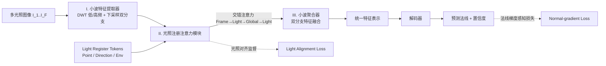

# Light of Normals: Unified Feature Representation for Universal Photometric Stereo

**会议**: ICLR 2026  
**OpenReview**: [https://openreview.net/forum?id=LRA5z3oXOI](https://openreview.net/forum?id=LRA5z3oXOI)  
**代码**: 待确认  
**领域**: 3D 视觉 / 光度立体 (Photometric Stereo)  
**关键词**: Universal Photometric Stereo, 法线估计, 光照解耦, Register Token, 小波变换, ViT  

## 一句话总结
LINO UniPS 用「带光照对齐监督的 Light Register Token + 交错注意力」在编码器内显式把光照从法线特征中剥离，再用「小波双分支 + 法线梯度感知损失」保住高频几何细节，在 DiLiGenT / Luces 等基准上把通用光度立体的法线误差刷到新 SOTA。

## 研究背景与动机
**领域现状**：光度立体 (Photometric Stereo, PS) 要从同一视角、多种未知光照下的图像里恢复表面法线。从依赖标定光源的传统方法，到 UniPS / SDM UniPS 这类"通用 PS"，主流范式已变成「编码器抽多光照特征 → 融合成全局光照上下文 → 解码器当作标定网络输出法线」，摆脱了对显式光照物理模型的依赖。

**现有痛点**：作者指出两个老大难。其一，**光照与法线没被有效解耦**——现有编码器把光照和法线混在一起处理，没有显式光照表示，解码器只能继承不稳定的特征，导致不同输入图像间法线预测前后不一致。作者观察到一个关键现象：编码器在不同输入下产出的法线特征越一致（CSIM/SSIM 越高），最终法线精度越高（MAE 越低）。其二，**高频几何细节易丢**——UniPS 在下采样图上抽特征天然模糊，SDM UniPS 的 split-and-merge 又会破坏高频语义，复杂纹理、细微起伏处的法线质量明显退化。

**核心矛盾**：编码器越强，越容易把"解耦光照"这件最难的活儿甩给更弱的解码器，形成"强编码器 + 弱解码器扛重活"的悖论；同时常规上/下采样在追求语义聚合时必然损失高频细节，两者难以兼得。

**本文目标**：让编码器自己产出一致、已解耦的法线特征，把解码器降格为"简单精修器"，并在整条管线里守住高频细节。

**核心 idea**：
- **显式光照容器**：引入按光源类型（点光/方向光/环境光）分工的 Light Register Token，并用**光照对齐监督**逼它们各自吸收对应光照信息，从而把光照从法线特征里"抽走"。
- **跨图全局注意力**：用交错注意力块同时看遍所有光照条件下的 token，在 patch/帧/跨图三个层级聚合光照，进一步剥离光照。
- **频域保细节**：小波双分支 + 法线梯度感知损失，专门照顾高频几何。

## 方法详解

### 整体框架
LINO UniPS 是一个 ViT 编码器-解码器框架，编码器分三段串起来：**(I) 小波特征提取器** 把多光照图同时做小波分解（低频 LL + 高频 LH/HL/HH）和普通下采样，各自转成独立 token 序列；**(II) 光照注册注意力模块** 在序列前拼上三类 Light Register Token，经多层交错注意力块聚合全局光照并解耦；**(III) 小波聚合器** 把下采样分支与小波分支特征融合成统一特征，交给解码器预测法线。训练由两个监督信号引导：Light Alignment 损失让 register token 学到对应光源特性，Normal-gradient 感知损失强化高频细节重建。

### 关键设计

**1. Light Register Tokens + 光照对齐监督：给光照配三个"专职抽屉"。** 受 DINO register 机制启发，作者引入可学习的 Light Register Token 专门吸收全局光照信息，但关键的"出格之处"是不像 DINO 那样无监督，而是按光源类型拆成点光、方向光、环境光三类 token，并各配一个**显式的光照对齐监督**。借鉴 VAVAE / REPA 里加速生成模型训练的特征对齐思路，让三类 token 去对齐训练集中对应光源的真实信息，分别用余弦相似度损失约束：$L_{light}=\lambda_1 L_{env}+\lambda_2 L_{point}+\lambda_3 L_{direction}$。监督之后注意力图出现清晰分工——Point token 稀疏锐利地盯着高强度高光区（点光的高频特征），Direction/Env token 则关注大面积、空间弥散的区域（方向光/环境光的低频全局明暗），证明光照确实被按物理成分拆开、从法线特征里剥离出去了。

**2. Interleaved Attention Block：在三个层级上聚合光照。** UniPS/SDM UniPS 只靠 Frame Attention 和 Light Axis Attention，局部信息流通但不足以解耦光照与法线。受 VGGT 启发，作者加入一个更强的**跨图全局注意力 (Global)**，一次性 attend 所有输入图像的全部 token，并把四层注意力按 `Frame → Light → Global → Light` 交错堆叠。三者各司其职：Light-axis 在 patch 级、Frame 在单图内、Global 在跨图级聚合，从局部到全局建立对全局光照的整体认知，从而把光照与内在法线更好地分离。

**3. 小波双分支架构：下采样的同时把高频"另存一份"。** 为缓解下采样导致的信息损失，编码器用离散小波变换 (DWT) 把多光照图分解成高/低频分量单独建模，同时保留一条普通下采样分支来留住全局图像域语义；上采样时再用逆小波变换 (IDWT) 从频域重建特征，使细节在整个网络里不被抹平。这条频域旁路正是 SDM UniPS 那种 split-and-merge 难以替代的"高频保险箱"。

**4. Normal-gradient Perception Loss：让损失自己盯住复杂区域。** 不再对所有像素一视同仁，而是用预测法线梯度 $\tilde{G}$ 生成置信图 $C=e^{\tilde{G}}$，在高频区放大误差信号：$L_n=\lambda_4\sum (N-\tilde{N})^2\odot C+\lambda_5\sum(\tilde{G}-G)^2$。第一项是置信度加权的法线重建误差，第二项直接用真值梯度 $G=\nabla N$ 监督预测梯度，使网络对细微表面起伏格外敏感。配合从简单到复杂的课程学习（Level 1→4 逐级加难度，再用带 normal map 的 Level 5 微调），细节重建进一步提升。总损失为 $L=L_{light}+L_n$。

此外作者构建了 **PS-Verse** 大规模合成数据集：从 Objaverse 精选 17,805 个带 UV/PBR 的模型，按几何复杂度分四级递归组场景，材质按原纹理/漫反射/高光/金属 1:4:2.5:2.5 配比，并首次引入 normal mapping 作为第五复杂度级注入高频光照细节，共 10 万场景、每场景 20 张 512 分辨率图，复杂度指标（法线梯度均值 26.7）远超 PS-Mix(11.5)、PS-Uni MS-PS(8.6)。

## 实验关键数据

### 主实验表格
DiLiGenT（96 图，MAE↓，单位度）与 Luces（52 图）法线误差对比：

| 方法 | DiLiGenT Avg.MAE↓ | Luces Avg.MAE↓ |
|------|------|------|
| UniPS | 14.70 | 23.77 |
| SDM UniPS | 5.80 | 13.50 |
| Uni MS-PS | 5.01 | 11.21 |
| **Ours** | **4.65** | **9.43** |
| Ours (K=16) | 4.88 | — |

参数量 / 推理时间对比（K=16）：

| 方法 | Params(M) | 4000×4000 推理(s) | DiLiGenT MAE↓ | Luces MAE↓ |
|------|------|------|------|------|
| Ours | 84.2 | 85.1 | 4.65 | 9.43 |
| Ours-S2 | 60.4 | 81.0 | 4.95 | 10.89 |
| SDM UniPS | 59.9 | 92.7 | 5.83 | 13.52 |
| Uni MS-PS | 75.5 | 3012.2 | 5.01 | 11.21 |

同参数量级下 Ours-S2(60.4M) 全面优于 SDM UniPS(59.9M)；高分辨率推理比 Uni MS-PS 快约 35 倍。

### 消融实验表格
PS-Verse Testdata（20 图输入）逐模块消融：

| 配置 | CSIM↑ | SSIM↑ | Avg.MAE↓ |
|------|------|------|------|
| Baseline | 0.71 | 0.69 | 8.73 |
| + Light Register Tokens | 0.74 | 0.73 | 8.13 |
| + Global Attention | 0.80 | 0.78 | 6.44 |
| + Light Alignment | 0.86 | 0.82 | 5.58 |
| + Wavelet Branch | 0.85 | 0.82 | 5.15 |
| + Grad Perception Loss | 0.86 | 0.83 | 4.84 |
| + Curriculum Learning | **0.88** | **0.86** | **4.51** |

数据集消融：Uni MS-PS 在 PS-Verse 上训练（MAE 7.82）显著优于在 PS-Mix（10.02）和原生 PS-Uni MS-PS（9.02），证明 PS-Verse 更利于训出高性能模型。

### 关键发现
- **特征一致性 ↔ 重建精度强相关**：全局注意力 + 光照对齐两步把 CSIM 从 0.74 拉到 0.86、MAE 从 8.13 降到 5.58，是误差下降最大的两步，直接验证"解耦得越好，法线越准"的核心论点。
- **编码器才是主功臣**：把解码器换成简单 MLP（w/mlp 变体）后特征一致性反而更高，重建虽略降但仍超过 SDM UniPS，说明性能主要来自编码器的解耦能力而非复杂解码器；且 LINO 与 SDM UniPS 用同款解码器，提升只能归因于编码器。
- **小波分支 + 梯度损失专攻细节**：这两项对 CSIM/SSIM 影响不大，但在复杂几何数据上显著提升，恰如设计预期。
- **唯一败北处**：除几何最简单的 'Ball' 外全场景 SOTA，而 Ball 上反而是 MLP 解码器变体最好——简单几何更适合简单解码器。

## 亮点与洞察
- **把"解耦"从解码器搬回编码器**：用一句可验证的观察（特征一致性 ↔ 精度）撬动整个设计，目标明确、消融能逐项对应，方法叙事非常干净。
- **Register Token 的有监督升级**：DINO 的 register 是无监督副产品，这里按物理光源类型分工 + 显式对齐监督，注意力图能可视化出"点光盯高光、环境光看全局"的物理分工，可解释性强。
- **频域旁路是巧解**：用 DWT/IDWT 给高频信息开一条不被下采样抹平的通道，比 split-and-merge 更自然地兼顾语义聚合与细节保留。
- **数据集即贡献**：PS-Verse 在几何复杂度、材质多样性、首次引入 normal mapping 高频细节上都大幅领先现有 PS 数据集，配合课程学习形成完整闭环。

## 局限与展望
- **算力门槛**：84.2M 参数、2×H100 训练约 3 天，PS-Verse 渲染 10 万场景成本不低，复现/扩展需要可观资源。
- **光源类型固定三类**：点/方向/环境三类 register token 是人为划定的，面对混合/特殊光源（如面光源、强间接光）的泛化能力未充分讨论。
- **依赖合成数据**：核心增益来自 PS-Verse 合成训练，真实世界材质（强透明、强次表面散射）下的 sim-to-real gap 仍待更系统评估。
- **简单几何上的反常**：Ball 等简单形体上复杂解码器反不如 MLP，暗示解码器容量与几何复杂度需自适应匹配，可作为后续改进方向。

## 相关工作与启发
- **通用光度立体谱系**：从 UniPS（Ikehata 2022 首次提出 Universal PS）到 SDM UniPS（split-and-merge 特征融合）、Uni MS-PS（多尺度策略），本文沿着"更一致的编码器特征"这条主线推进，并把前作的失败点（解耦不彻底、高频丢失）逐一对症下药。
- **Register Token / 特征对齐**：把 DINO 的 register、VAVAE/REPA 的特征对齐监督迁移到光照解耦场景，是"用监督让中间 token 承担明确语义"思路的一次漂亮跨域应用。
- **跨图全局注意力**：借鉴 VGGT 的全局注意力做多图聚合，提示多视角/多光照任务里"同时看全部输入"往往比逐帧/逐轴局部注意力更利于剥离 nuisance 因素。
- **频域保细节**：小波双分支为所有"既要语义下采样又要保高频"的密集预测任务（深度、法线、超分）提供了可借鉴的频域旁路范式。

## 评分
- 新颖性: ⭐⭐⭐⭐ 把光照解耦从解码器前移到编码器，并用有监督 Light Register Token + 跨图全局注意力 + 频域旁路组合实现，思路清晰且有跨域迁移巧思，虽各组件多源自已有机制但组合与问题定义新颖。
- 实验充分度: ⭐⭐⭐⭐ DiLiGenT/Luces/PS-Verse 三套基准 + 逐模块消融 + 参数量对照 + MLP 解码器探针，论证链条完整且能支撑核心论点；真实世界泛化与光源多样性评估略可加强。
- 写作质量: ⭐⭐⭐⭐ 用一条可验证观察统领全文，挑战-设计-消融一一对应，图表（注意力图、特征方差图）有力，叙述连贯易读。
- 价值: ⭐⭐⭐⭐ 刷新通用光度立体 SOTA 且推理高效（比 Uni MS-PS 快 ~35 倍），附带大规模 PS-Verse 数据集，对法线估计与 3D 重建社区有实用价值。

<!-- RELATED:START -->

## 相关论文

- [\[AAAI 2026\] Geometry Meets Light: Leveraging Geometric Priors for Universal Photometric Stereo under Limited Multi-Illumination Cues](../../AAAI2026/3d_vision/geometry_meets_light_leveraging_geometric_priors_for_universal_photometric_stere.md)
- [\[ICLR 2026\] Learning Unified Representation of 3D Gaussian Splatting](learning_unified_representation_of_3d_gaussian_splatting.md)
- [\[ICLR 2026\] LiTo: Surface Light Field Tokenization](lito_surface_light_field_tokenization.md)
- [\[ICLR 2026\] Universal Beta Splatting](universal_beta_splatting.md)
- [\[CVPR 2026\] UniLight: A Unified Representation for Lighting](../../CVPR2026/3d_vision/unilight_a_unified_representation_for_lighting.md)

<!-- RELATED:END -->
