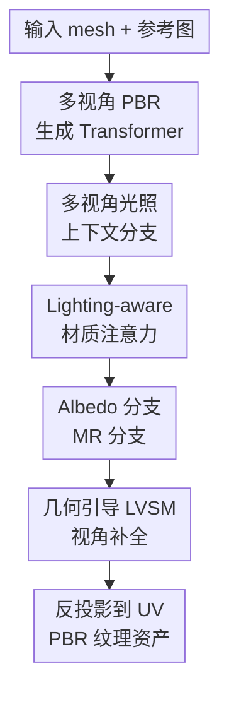

# LumiTex: Towards High-Fidelity PBR Texture Generation with Illumination Context

**会议**: ICLR2026  
**OpenReview**: [https://openreview.net/forum?id=CDwG0Bebfo](https://openreview.net/forum?id=CDwG0Bebfo)  
**论文**: [https://lumitex.vercel.app](https://lumitex.vercel.app)  
**代码**: 未公开  
**领域**: 3D视觉 / PBR纹理生成  
**关键词**: PBR材质、光照上下文、多视角扩散、材质分解、纹理补全  

## 一句话总结
LumiTex 面向给定网格和参考图像的 PBR 纹理生成，把多视角光照上下文、分支式 albedo / metallic-roughness 材质推理和基于 LVSM 的几何引导视角补全接到一个流程里，在纹理质量、重光照一致性和人工偏好上都超过了开源与商业基线。

## 研究背景与动机
**领域现状**：在游戏、影视和 AR/VR 资产生产中，PBR（physically-based rendering）已经是描述材质与光照交互的事实标准。一个可复用的 3D 资产不只需要看起来像参考图，还需要分解出 albedo、metallic、roughness 等材质贴图，让它在新环境光下仍能正确反射、变暗或显出金属质感。近期主流路线通常先用多视角扩散模型从参考图和网格生成若干一致视角，再把这些视角投影回 UV 空间形成纹理。

**现有痛点**：PBR 纹理比普通贴图更难，难点不在“画得好看”本身，而在“哪些颜色属于材质、哪些亮斑属于光照”。两阶段方法会先生成带 baked lighting 的 shaded images，再用优化或专门模型做材质分解；一旦中间 shaded 视角质量不好，后面的 albedo / MR 推理会继承错误。另一类多通道方法把 albedo、metallic、roughness 一起当成多个输出通道生成，看似端到端，却忽略了 albedo 和 MR 的语义差异：albedo 更像固有漫反射颜色，MR 更依赖高光、环境和表面物理属性，强行共享输出空间容易把光照痕迹烤进贴图。

**核心矛盾**：PBR 生成需要光照线索来判断材质，但最终输出又必须把光照从材质中剥离。参考图往往只提供单一或有限光照，训练数据里高质量 MR 图也明显少于普通 shaded / albedo 图；如果完全不利用光照，材质分解会不稳定，如果直接把光照图当中间结果，又会带来误差累积和 baked lighting。

**本文目标**：作者希望从一个输入 mesh 和一张参考图生成多视角一致的 PBR maps，并把这些 maps 合成为无明显接缝、可重光照的 UV 材质。具体来说，模型要同时解决三件事：第一，从有限参考图中抽取稳定的多视角光照上下文；第二，让 albedo 与 metallic-roughness 按各自物理语义分开推理；第三，补齐稀疏视角看不到的表面区域，避免 UV 空间补洞带来的断裂和语义漂移。

**切入角度**：LumiTex 的观察是，shaded images 虽然不适合作为脆弱的中间产物，却非常适合作为“光照上下文”的监督信号。也就是说，模型不必先生成一批 shaded 图再交给另一个模型分解，而是可以训练一个光照上下文分支，让它学到多视角一致的 shaded features，再把这些 features 作为 cross-attention 的 key / value 注入材质分支。

**核心 idea**：用一个冻结的多视角光照上下文分支提供 shared illumination priors，再让 albedo 与 MR 分支分别通过 lighting-aware attention 读取这些先验，最后用几何引导 LVSM 从 view space 补齐缺失纹理，而不是直接在破碎的 UV 空间里补洞。

## 方法详解

### 整体框架
LumiTex 的输入是一张参考图像和一个无纹理或待纹理化的 3D mesh，输出是带 albedo、metallic、roughness UV 贴图的 GLB / PBR 资产。整体流程先训练一个多视角 illumination context branch 生成并编码 shaded images，再冻结该分支，把 shaded keys / values 送入 albedo 和 MR 材质分支；随后模型得到稀疏多视角的 PBR material maps，并通过 geometry-guided LVSM 合成更多目标视角，最后把稀疏和补全视角共同反投影到 UV 空间。

底层生成器由两个 Transformer 组成。Multi-Modal DiT 对每个视角融合参考图像、mesh 几何和材质 token；Multi-View DiT 再把所有视角的 latent 拼成一条序列，让跨视角 token 相互通信，从而保证视角一致性。材质生成完成后，作者不急着在 UV 图上补空洞，而是先根据未覆盖 UV 面积选择更多 target views，再用 LVSM 在 2D view space 合成这些视角，最后把更密集的 albedo / MR 观测投影回 UV。

### 关键设计
**1. 多视角 PBR 生成 Transformer：先把参考图、几何和视角一致性放进同一个生成骨架**

普通图像扩散模型擅长生成好看的单张图，但给 3D mesh 贴材质时，模型必须知道每个视角看到的是同一个表面，且纹理要沿着几何连续。LumiTex 先用 VAE 和 DINOv2 编码参考图像，用 VAE 编码每个视角的 normal map 与 canonical coordinate map，再加上 learnable material embeddings 和当前视角 latent，一起送进 Multi-Modal DiT。这个阶段相当于让每个视角先理解“参考图长什么样、当前几何在哪里、我要生成的是哪类材质通道”。

随后，模型丢弃图像和 domain tokens，只保留各视角 latent，并把 $N$ 个视角拼到 Multi-View DiT 里做全局 denoising。论文把这个过程写成 $\{\hat z_i\}_{i=1}^{N}=\mathrm{MV\text{-}T}(z_1, z_2, \ldots, z_N)$，核心作用是让不同视角不再各画各的，而是在同一个 token 序列里对齐纹理、结构和材质判断。训练目标采用 flow matching loss，直接约束生成噪声与目标噪声之间的 $L_2$ 距离。

**2. 多视角光照上下文分支：把 shaded image 从中间结果变成可注意力读取的光照先验**

两阶段 PBR 方法的问题是，它们真的要先产出 shaded images，再拿这些图做 inverse rendering 或材质推理；如果 shaded 图有局部错位、高光假象或视角不一致，错误会层层传递。LumiTex 改成先训练一个 multi-view illumination context branch 来重建多视角 shaded images，但训练完成后不把图像本身当硬中间结果，而是冻结分支，取其 shaded latent tokens 作为光照上下文。

这些 shaded tokens 会通过 view-aware RoPE 编码空间位置和视角身份，并做跨视角 attention，形成 $K_{shaded}$ 和 $V_{shaded}$。论文中的注意力形式为 $s_i=\sum_j \mathrm{Softmax}_j(q_i k_j^T + \phi(t,i,j))v_j$，其中 $\phi(t,i,j)$ 表示与 query view 绑定的视角位置关系。这样做有两个好处：一方面，训练 shaded reconstruction 可以利用更多只有可靠 shaded / albedo、缺少高质量 MR 的 3D 数据，缓解 PBR 标注稀缺；另一方面，材质分支拿到的是“跨视角一致的光照语境”，而不是一张可能带错误的 shaded 图。

**3. Lighting-aware 材质注意力：让 albedo 和 MR 共享光照先验但分开推理**

albedo 和 metallic-roughness 的错误类型很不一样。albedo 最怕把阴影、高光和环境反射烤进固有颜色；MR 则需要根据高光强弱、反射形态和材质语义判断金属度与粗糙度。如果用一个多通道输出头同时预测所有通道，模型很容易在共享空间里把这些语义混在一起，尤其在金属区域会出现塑料感或错误高光。

LumiTex 因此设置独立的 albedo branch 和 MR branch，但二者都通过同一组 shaded keys / values 做 cross-attention：$\mathrm{Attn}_{albedo}=\mathrm{Softmax}(Q_{albedo}K_{shaded}^T / \sqrt d)V_{shaded}$，$\mathrm{Attn}_{mr}=\mathrm{Softmax}(Q_{mr}K_{shaded}^T / \sqrt d)V_{shaded}$。这个设计的关键不是简单“加一个条件”，而是让两个材质分支从同一光照上下文中抽取不同证据：albedo 分支更关注哪些亮暗变化应该被剥离，MR 分支更关注哪些反射模式说明表面金属或粗糙。于是输出既保持通道间一致，又避免 albedo / MR 在同一个输出空间里互相污染。

**4. 几何引导 LVSM 纹理补全：在 view space 合成更多观测，再统一投影到 UV**

稀疏多视角生成天然会漏掉遮挡面、底面或细小凹陷区域。很多方法选择直接在 UV 空间补洞，但 UV 展开经常把空间上相邻的区域切开，也会把空间上不相干的 patch 放得很近；扩散模型在这种平面图上补纹理，容易把车轮纹理抹到车底，或者在接缝处产生不连续。

LumiTex 把补全问题改写成 novel view synthesis。给定已生成的 $N$ 个视角图像、Plucker ray maps、几何条件和相机姿态，模型先从候选 dense view set 中贪心选择最能覆盖未观测 UV 区域的 $M$ 个目标视角，再用一个 decoder-only LVSM 预测这些目标视角。输入 token 形式为 $x_i=\mathrm{MLP}([P_i,G_i,I_i])$，目标 token 为 $x_i^t=\mathrm{MLP}([P_i^t,G_i^t])$；Transformer 更新后只保留 target tokens，经 MLP reshape 得到新视角图像。由于补全发生在有相机和几何约束的 2D view space 中，模型更容易保持局部语义和全局一致性，最后再反投影到 UV 时，空洞已经被更合理的视角观测覆盖。

### 损失函数 / 训练策略
PBR 生成 Transformer 初始化自 FLUX.1-dev，并被改造成几何条件、多视角的生成器。训练分两段：先训练 multi-view illumination context branch 约 20,000 steps，让它学习多视角 shaded reconstruction；再冻结该分支，训练 PBR generation transformer 约 20,000 steps。主生成损失是 flow matching 形式的多视角 $L_2$ 损失：

$$
L_{pbr}=\mathbb{E}_t\left[\sum_{i=1}^{N}\|G_\theta(I_t^i)-\hat I_t^i\|_2^2\right]
$$

作者先在 $512\times512$ 分辨率训练，再升到 $768\times768$ 继续训练 10,000 steps。多视角设置中 $N=6$，token length 在 $512\times512$ 下为 $L=1024$，特征维度 $C=3072$；优化器使用 Prodigy，batch size 32，warmup 2,000 steps，并做 gradient clipping。

LVSM 纹理补全模型单独训练。每个对象随机取 $N=6$ 个条件视角和对应几何 / 相机参数，要求模型生成 $M=8$ 个额外视角；训练损失同时包含 MSE 和 LPIPS：

$$
L_{lvsm}=\sum_{i=1}^{M}\left(\mathrm{MSE}(\hat I_i,I_i)+\mathrm{LPIPS}(\hat I_i,I_i)\right)
$$

推理时，作者从 48 个候选视角里选择 18 个 target views，并分别对 albedo 和 MR 做 dense view synthesis。最终通过自定义 inverse renderer 把多视角材质投影到统一 UV，重叠 texel 使用角度加权平均，输出 $2048\times2048$ 的 UV 材质贴图；推理约需 1.5 分钟 / 28GB 显存（512 分辨率）或约 3 分钟 / 40GB 显存（768 分辨率）。

## 实验关键数据

### 主实验
作者在 133 个未参与训练的对象上做定量评估，比较对象包括 texture-only 方法、开源 PBR 方法和带私有数据训练的商业级 / 工业级方法。Texture evaluation 直接评估纹理质量与参考图对齐；Relighting evaluation 则把每个对象在随机环境光下从 32 个 Fibonacci sphere 视角渲染，并与 ground truth 渲染比较，因此更能反映 PBR 材质是否真的可重光照。

| 方法 | 类型 | Texture FID↓ | Texture CLIP-I↑ | Texture LPIPS↓ | Relighting FID↓ | Relighting CLIP-I↑ | Relighting LPIPS↓ |
|------|------|--------------|-----------------|----------------|-----------------|--------------------|-------------------|
| SyncMVD-IPA | Texture | 222.1 | 0.9187 | 0.2504 | 149.1 | 0.9101 | 0.1202 |
| MV-Adapter | Texture | 237.3 | 0.9022 | 0.2574 | 123.2 | 0.9246 | 0.1034 |
| Step1X-3D | Texture | 240.9 | 0.9053 | 0.2540 | 120.0 | 0.9288 | 0.1000 |
| UniTEX | Texture | 230.7 | 0.9133 | 0.2473 | 124.8 | 0.9282 | 0.0974 |
| Paint-it | PBR | 293.3 | 0.8648 | 0.3769 | 162.9 | 0.8666 | 0.1564 |
| DreamMat | PBR | 231.6 | 0.9016 | 0.2816 | 160.1 | 0.8983 | 0.1346 |
| Hunyuan3D-2.1* | PBR | 196.6 | 0.9268 | 0.2413 | 103.7 | 0.9420 | 0.0808 |
| LumiTex | PBR | 160.8 | 0.9417 | 0.1903 | 99.6 | 0.9436 | 0.0831 |

这个表的关键信息是，LumiTex 不只在普通纹理指标上强，也在重光照评估中保持优势。尤其 Texture FID 从 Hunyuan3D-2.1 的 196.6 降到 160.8，Texture LPIPS 从 0.2413 降到 0.1903；Relighting FID 也从 103.7 降到 99.6。Relighting LPIPS 略高于 Hunyuan3D-2.1 的 0.0808，但 CLIP-I、FID、CLIP-FID、CMMD 等整体指标仍更好，说明它更像是在物理材质和参考语义之间取得了更稳的综合表现。

### 消融实验
论文的消融主要从三个角度验证：端到端 one-stage 是否优于 two-stage、multi-branch 是否优于 multi-channel、illumination context branch 是否真的必要。表格中的定量数字来自主表和用户研究，消融本身以图 9 的视觉对比为主，因此这里用“观察到的失败模式”概括。

| 配置 | 关键观察 | 说明 |
|------|---------|------|
| Two-stage shaded generation + IDArb 分解 | 容易产生过高金属度、塑料感表面和过于均匀的 albedo | 中间 shaded 结果误差会传给后续材质分解 |
| Multi-channel joint albedo / MR | 金属区域尤其容易出错，MR 图不稳定 | albedo 与 MR 被压到统一输出空间，域差异没有被显式处理 |
| w/o multi-view illumination branch | metallic 区域预测不准，重光照下出现塑料感 | 缺少跨视角光照上下文后，模型难以区分高光和真实材质 |
| LumiTex full model | albedo 更干净，MR 更贴合反射属性，重光照更自然 | shared illumination priors + branch-specific queries 共同起作用 |

作者还做了 23 名 3D modeler 的用户研究，让受试者从渲染质量、完整度、diffuse、metallic、roughness 五个维度以 1 到 5 分评分。

| 方法 | Quality↑ | Completeness↑ | Diffuse↑ | Metallic↑ | Roughness↑ |
|------|----------|---------------|----------|-----------|------------|
| SyncMVD | 2.29 | 3.27 | 2.39 | - | - |
| MV-Adapter | 2.65 | 3.06 | 2.65 | - | - |
| Step1X-3D | 2.70 | 2.98 | 2.58 | - | - |
| UniTEX | 2.96 | 2.98 | 2.75 | - | - |
| Paint-it | 2.27 | 2.97 | 2.19 | 2.46 | 2.57 |
| DreamMat | 2.05 | 2.92 | 2.58 | 2.40 | 2.33 |
| Hunyuan3D-2.1* | 3.69 | 3.98 | 3.57 | 3.34 | 3.61 |
| LumiTex | 4.48 | 4.61 | 4.34 | 4.14 | 4.07 |

从用户研究看，LumiTex 的优势最明显地体现在完整度和材质准确性上。Completeness 达到 4.61，说明 LVSM 视角补全确实缓解了稀疏视角投影造成的空洞和接缝；Metallic / Roughness 分别为 4.14 / 4.07，也支持 lighting-aware material attention 对 MR 推理有实质帮助。

### 关键发现
- 端到端并不等于把所有通道硬塞进一个输出头。LumiTex 的有效点在于“统一流程 + 分支推理”：它避免 two-stage 的误差累积，同时又没有牺牲 albedo 和 MR 的语义分离。
- 光照上下文分支的价值不只是提供额外条件，更是提供可利用的训练监督。因为 shaded images 比高质量 MR maps 更容易获得，先学 shaded illumination context 可以把数据不均衡转化为有用的先验。
- 纹理补全从 UV space 转到 view space 是很关键的工程判断。UV 图上相邻的像素未必代表 3D 空间相邻表面，而 LVSM 使用相机、光线和几何条件后，能更自然地补底部、背面和遮挡区域。
- LumiTex 在极端反光和强背光案例中更不容易把高光烤进 albedo，但仍受分辨率和材质表示限制，尤其对小文字和透明材质不是完整解决方案。

## 亮点与洞察
- 把 shaded image 从“必须生成出来的中间图”改成“被冻结分支里的注意力上下文”很巧妙。它保留了光照信息对材质分解的帮助，却减少了两阶段 pipeline 中图像级中间结果带来的错误传播。
- albedo / MR 分支共享 $K_{shaded}, V_{shaded}$，但使用各自的 query，这个结构非常贴合 PBR 任务。共享上下文保证两类材质图来自同一光照解释，独立 query 又允许 albedo 去除光照、MR 捕捉反射属性。
- 用 LVSM 做纹理补全说明 3D 生成里很多“UV 问题”未必应该在 UV 图上解决。先在有几何和相机约束的 view space 补出观测，再投影回 UV，往往比直接让模型理解破碎 UV atlas 更自然。
- 这篇论文的思路可以迁移到其他 inverse rendering 或 3D asset 生成任务：如果某个中间变量有强监督但直接作为中间产物不稳定，可以把它变成 latent context / attention memory，让下游分支按任务读取。

## 局限与展望
- 当前实现的单视角生成分辨率最高为 $768\times768$，最终 UV 虽然输出到 $2048\times2048$，但细小文字、规格标签、密集图案仍可能不够锐利。作者在失败案例中也展示了小 printed text 难以还原的问题。
- 材质表示没有 alpha channel 或 transmission 参数，因此不能处理玻璃、水、半透明塑料等透明 / 透射材质。要覆盖这些资产，需要额外的透明度、折射或透射监督，也需要渲染管线支持。
- 训练成本不低：多视角 PBR 生成部分约 106 GPU days，推理在 768 分辨率也需要约 40GB 显存。这让方法更像高质量资产生产模型，而不是轻量级本地工具。
- 评估集为 133 个未训练对象，且部分强基线使用私有数据，横向比较已经相当全面但仍受数据来源、mesh 质量和参考图分布影响。未来如果能在真实生产资产、扫描网格和用户上传图上做更大规模盲测，会更能说明实用边界。
- LVSM 补全依赖候选视角覆盖和输入几何质量。对拓扑错误严重、细长结构复杂或初始多视角结果已经语义错位的对象，补全模型可能只能平滑缺口，不能从根上恢复正确材质。

## 相关工作与启发
- **vs DreamMat**: DreamMat 代表较早的 geometry- and light-aware PBR 材质生成路线，通常依赖优化或阶段式推理；LumiTex 的优势是把光照上下文嵌入端到端生成流程，减少优化时间和阶段间误差，但代价是训练一个更大的多分支模型。
- **vs Hunyuan3D-2.1 / MaterialMVP**: Hunyuan3D-2.1 是很强的工业级 PBR 基线，并且使用私有数据训练。LumiTex 在公开评估中仍取得更好的 FID、CLIP-I 和用户研究分数，说明光照上下文与分支材质推理能在高质量基线上继续带来收益。
- **vs MuMA / 多通道多视角生成**: MuMA 类方法倾向于把多类 PBR map 放在多通道或后处理框架里联合生成。LumiTex 的区别是显式承认 albedo 与 MR 的域差异，用 lighting-aware attention 让它们共享光照但不共享同一个材质解释头。
- **vs Paint3D / TexGen**: Paint3D 和 TexGen 主要处理纹理补全，其中 UV 空间方法容易受 UV seam 和拓扑歧义影响。LumiTex 的 LVSM 补全更像“先生成更多可见视角，再做投影融合”，对语义连续性和接缝控制更友好。
- **启发**: 对 3D 生成任务来说，很多物理量并不适合作为独立预测图直接串联，但适合作为中间 latent prior。这个范式可以推广到可编辑材质、可控重光照、扫描资产修复，甚至动态 4D 资产的 appearance completion。

## 评分
- 新颖性: ⭐⭐⭐⭐☆ 多视角扩散、PBR 分支和 LVSM 都有前作基础，但把 shaded illumination context 作为冻结注意力先验来解耦 albedo / MR，切中 PBR 纹理生成的核心难点。
- 实验充分度: ⭐⭐⭐⭐⭐ 覆盖 texture-only、开源 PBR、商业 / 私有数据基线、重光照评估、用户研究和关键消融，且指标与视觉案例互相支撑。
- 写作质量: ⭐⭐⭐⭐☆ 方法动机和图示很清楚，实验结论可信；部分消融偏视觉定性，如果能补更多定量 ablation 会更完整。
- 价值: ⭐⭐⭐⭐⭐ 对高质量 3D 资产生产很有价值，尤其是可重光照 PBR 材质和无缝 UV 完整度，方向上也给后续 3D 材质生成提供了很好的结构范式。

<!-- RELATED:START -->

## 相关论文

- [\[CVPR 2026\] MatLat: Material Latent Space for PBR Texture Generation](../../CVPR2026/3d_vision/matlat_material_latent_space_for_pbr_texture_generation.md)
- [\[ICCV 2025\] MaterialMVP: Illumination-Invariant Material Generation via Multi-view PBR Diffusion](../../ICCV2025/3d_vision/materialmvp_illumination-invariant_material_generation_via_multi-view_pbr_diffus.md)
- [\[CVPR 2026\] LATTICE: Democratize High-Fidelity 3D Generation at Scale](../../CVPR2026/3d_vision/lattice_democratize_high-fidelity_3d_generation_at_scale.md)
- [\[CVPR 2025\] Towards High-fidelity 3D Talking Avatar with Personalized Dynamic Texture](../../CVPR2025/3d_vision/towards_high-fidelity_3d_talking_avatar_with_personalized_dynamic_texture.md)
- [\[CVPR 2026\] NI-Tex: Non-isometric Image-based Garment Texture Generation](../../CVPR2026/3d_vision/ni-tex_non-isometric_image-based_garment_texture_generation.md)

<!-- RELATED:END -->
