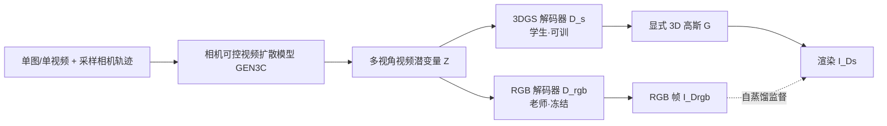

# Lyra: Generative 3D Scene Reconstruction via Video Diffusion Model Self-Distillation

**会议**: ICLR 2026  
**OpenReview**: [https://openreview.net/forum?id=tIVCfVnIHo](https://openreview.net/forum?id=tIVCfVnIHo)  
**项目主页**: [https://research.nvidia.com/labs/toronto-ai/lyra](https://research.nvidia.com/labs/toronto-ai/lyra)  
**代码**: 待确认  
**领域**: 3D 视觉 / 生成式三维重建  
**关键词**: 3D Gaussian Splatting, 视频扩散模型, 自蒸馏, 前馈三维重建, 4D 场景生成  

## 一句话总结
Lyra 用一个相机可控的视频扩散模型当"老师"、用 RGB 解码分支去监督一个新加的 3DGS 解码分支当"学生"，实现完全不用真实多视角数据、仅靠合成视频自蒸馏就能从单图/单视频前馈生成显式 3D（乃至 4D）高斯场景。

## 研究背景与动机
**领域现状**：要把虚拟环境用于游戏、机器人、自动驾驶等闭环仿真，需要可实时渲染、可物理交互、多视角一致的**显式 3D 表示**。NeRF/3DGS 这类神经重建依赖精确相机位姿与高质量多视角图像，难以规模化，动态场景更是要同步多相机阵列；前馈重建模型（GS-LRM、pixelSplat 等）虽快，却受限于稀缺的大规模 3D 训练数据，出域泛化差。

**现有痛点**：视频扩散模型（Cosmos、Wan）在海量互联网视频上训练，隐式编码了大量真实世界的 3D 线索且能"想象"未观测内容，但它只输出 **2D 帧**，缺乏显式 3D 表示，无法直接用于需要几何一致性和物理交互的仿真。已有工作（CAT3D、Wonderland、Bolt3D）要么需要一个昂贵的、不能跨场景摊销的优化阶段，要么仍依赖真实多视角数据训练前馈网络。

**核心矛盾**：重建范式（geometry 一致但受限于观测、需真实数据）与生成范式（能想象、泛化强但只有 2D）各有所长却彼此割裂——如何把视频扩散模型里那套"隐式 3D 知识"直接蒸馏成显式 3DGS，同时摆脱对真实多视角数据的依赖？

**本文目标**：提出"生成式 3D 场景重建"，一次前馈从单图/文本生成显式 3DGS，支持实时渲染、几何一致、无需任何额外优化或后处理，并能极小改动扩展到动态 4D。

**核心 idea**：**自蒸馏（self-distillation）**——在视频扩散模型的潜空间里并联一个 3DGS 解码器（学生），让冻结的 RGB 解码器（老师）去监督它；学生只用视频模型生成的**合成数据**训练，从而彻底去掉真实多视角采集这一环。

## 方法详解

### 整体框架
Lyra 建立在相机可控视频扩散模型 GEN3C 之上：给定单图（或单视频）和一条采样相机轨迹，视频模型先去噪得到视频潜变量 $z$，再沿两条分支解码——预训练 RGB 解码器 $D_{rgb}$ 解出视频帧充当老师，新增的 3DGS 解码器 $D_s$ 在**同一潜空间**直接输出显式高斯 $G$，其渲染图被监督去对齐老师的 RGB 帧，形成自蒸馏闭环。训练时冻结 VAE 和扩散模型、只训 3DGS 解码器；推理时丢掉 RGB 分支，单跑 3DGS 解码器即可。

### 关键设计

**1. 自蒸馏 teacher–student：用合成视频替代真实多视角数据。** 这是全文的根。作者先用 LLM 批量造多样化文本 prompt，用图像扩散模型生成图像 $I$，再用 GEN3C 把单图扩成带位姿的多视角视频序列，整套"Lyra 数据集"全是合成的。视频模型 $\mathcal{V}$ 生成潜变量 $z=\mathcal{V}(I,\{C_t\})$，老师 $D_{rgb}(z)$ 给出 RGB 监督，学生 $D_s$ 输出高斯 $G$，渲染 $\text{Render}(G,\{C_t\})$ 去拟合老师。关键洞察在消融里得到验证：只用自蒸馏（不碰真实数据）PSNR 24.77，纯真实数据只有 19.08，自蒸馏+真实数据反而不涨（24.74）——说明合成监督已足够多样且一致，真实多视角数据并非必需。

**2. 多轨迹监督：在潜空间融合扩大视角覆盖。** 单条轨迹视角有限，作者对每张输入图采样 $V=6$ 条相机轨迹（图 3），每条构建时空缓存并取 $L=121$ 个位姿，分别过视频模型得到 6 份潜变量 $z_v$。3DGS 解码器要学会把这 6 份潜变量**融合**成一套连贯高斯并补全被遮挡区域。消融显示，若各轨迹独立生成高斯再事后拼点云（w/o multi-view fusion），PSNR 暴跌到 17.73；而让重建块里 token 互相 attend 去学融合，能涨到 24.77——跨轨迹的注意力融合是质量关键。

**3. 潜空间 3DGS 解码器：让 726 视角输入不爆显存。** 视频模型一次产出 $V\times L=6\times121=726$ 个 704×1280 视角，远超 GS-LRM（2–4 图 512²）、AnySplat（24 图 448²）的承载量，瓶颈在视觉 token 上的注意力随像素量平方增长。Lyra 干脆**不在像素空间扩展**，直接吃压缩后的视频潜变量 $Z\in\mathbb{R}^{V\times L'\times C\times h\times w}$（$C{=}16$，时空各 8 倍压缩）。架构上只用一个 2×2 patchify 把潜变量和 Plücker 嵌入 $E$ 转成 token 相加，送入重建块——每块是 1 层 Transformer + 7 层 Mamba-2，重复 2 次共 16 层、512 隐藏维，最后转置 3D 卷积输出每像素 14 维高斯（位置/尺度/旋转四元数/不透明度/RGB）。Mamba-2 把一次前馈从 20922ms 压到 3213ms（6.5×加速），而像素空间方案直接 OOM。

**4. 深度监督 + 不透明度剪枝：补几何、提速度。** 只用 RGB 损失会出现"压扁"的平面几何，作者用现成 ViPE 估的一致视频深度加 Long-LRM 的尺度无关深度损失 $L_{depth}$ 来约束；并对不透明度做 L1 正则 $L_{opacity}$、剪掉不透明度最低的 80% 高斯，使表示更紧凑、704×1280 渲染从 30ms 降到 18ms（1.67×）。总损失为
$$L=\lambda_{mse}L_{mse}+\lambda_{lpips}L_{lpips}+\lambda_{depth}L_{depth}+\lambda_{opacity}L_{opacity}$$
其中 $\lambda_{mse}{=}1.0,\ \lambda_{lpips}{=}0.5,\ \lambda_{depth}{=}0.05,\ \lambda_{opacity}{=}0.1$。

**5. 动态 4D 扩展与反向视频增强：以极小改动支持时变高斯。** 把静态框架推到动态只需让解码器额外吃源时间/目标时间嵌入 $T_{src},T_{tgt}$（用同一 RGB 编码器编码后相加），得到时间条件解码器 $G=D_d(Z,E,T_{src},T_{tgt})$，从预训练 $D_s$ 微调、新增 patchify 层零初始化。难点在于动态场景每个时间步只有对应时刻的帧能做监督，naive 训练会让模型走捷径忽略其他帧，导致早期时间步在极端视角下不透明度坍塌（图 5）。作者提出**动态数据增强**：把输入视频倒放再喂给视频模型，得到 6 条"由远向近"的轨迹，与原 6 条"由近向远"轨迹合并，使每个时间步都有近/远各一的成对监督（共 12 视角），且只在训练时用、推理不需要。

## 实验关键数据

### 主实验表格
单图到 3D 生成，在 RealEstate10K、DL3DV、Tanks-and-Temples 上对比（数据多取自各 baseline 原论文报告）：

| 方法 | RE10K PSNR↑ | RE10K SSIM↑ | RE10K LPIPS↓ | DL3DV PSNR↑ | DL3DV LPIPS↓ | T&T PSNR↑ | T&T LPIPS↓ |
|---|---|---|---|---|---|---|---|
| ZeroNVS | 13.01 | 0.378 | 0.448 | 13.35 | 0.465 | 12.94 | 0.470 |
| ViewCrafter | 16.84 | 0.514 | 0.341 | 15.53 | 0.352 | 14.93 | 0.384 |
| Wonderland | 17.15 | 0.550 | 0.292 | 16.64 | 0.325 | 15.90 | 0.344 |
| Bolt3D | 21.54 | 0.747 | 0.234 | - | - | - | - |
| **Ours** | **21.79** | **0.752** | **0.219** | **20.09** | **0.313** | **19.24** | **0.336** |

三个数据集全部指标 SOTA，DL3DV 上 PSNR 较 Wonderland 提升 3.4+。

### 消融实验表格
在 Lyra 数据集（出域多样 prompt）上消融：

| 类别 | 变体 | PSNR↑ | SSIM↑ | LPIPS↓ |
|---|---|---|---|---|
| — | **Ours** | **24.77** | **0.837** | **0.224** |
| 数据 | real data only | 19.08 | 0.659 | 0.413 |
| 数据 | self-distill. + real data | 24.74 | 0.823 | 0.236 |
| 损失 | w/o depth loss | 24.31 | 0.811 | 0.247 |
| 损失 | w/o opacity pruning | 24.55 | 0.820 | 0.237 |
| 损失 | w/o LPIPS loss | 23.74 | 0.766 | 0.370 |
| 架构 | w/o multi-view fusion | 17.73 | 0.632 | 0.446 |
| 架构 | w/o Mamba-2 | 24.58 | 0.818 | 0.241 |
| 架构 | w/o latent 3DGS | OOM | — | — |

### 关键发现
- **自蒸馏 > 真实数据**：纯真实数据 19.08，自蒸馏 24.77，且叠加真实数据不再提升——合成监督已足够多样一致。
- **多视角融合最关键**：去掉融合掉到 17.73，是所有消融里跌幅最大的。
- **潜空间是可行性前提**：像素空间 3DGS 直接 OOM；Mamba-2 带来 6.5× 前馈加速，不透明度剪枝带来 1.67× 渲染加速。
- 训练数据规模：3D 用 59,031 张图 → 354,186 段视频；4D 用 7,378 段视频 → 44,268 段视频，全部合成。

## 亮点与洞察
- **把"数据获取"问题转成"数据生成"问题**：用视频扩散模型当无限多视角数据源 + 监督信号，绕开真实多视角采集这个长期瓶颈，且能想象出输入看不到的内容。
- **自蒸馏的优雅**：老师学生共享同一潜空间、老师完全冻结，仅训一个解码分支，工程上极轻量却换来 SOTA。
- **潜空间重建的扩展性**：726 视角一次吃进去靠的就是"不在像素空间扩展"这一念之差，配 Mamba-2 把长序列做高效，是把视频模型大输出量落到 3DGS 的关键工程。
- **静态到动态只改输入**：加时间嵌入 + 反向视频增强即开启 4D，且 4D 前馈生成此前几乎是空白任务。

## 局限与展望
- **质量上限被老师锁死**：作者自己承认进一步提升主要靠更强的视频生成模型，重建侧是"水涨船高"的被动方。视频模型的几何不一致、幻觉错误会直接传导到 3DGS。
- **依赖外部深度估计**：几何质量依赖 ViPE 的一致视频深度，深度估计失败会导致平面化几何。
- **评测受限**：多数 baseline 无开源代码，只能引用其论文报告值，对比公平性打折扣。
- **合成数据偏置**：训练分布由 LLM prompt + 图像/视频扩散模型决定，可能继承这些生成器的风格与内容偏置。
- 计算成本：尽管推理只需 3DGS 解码器，但训练需先用视频模型批量生成数十万段多视角视频，前置开销大。

## 相关工作与启发
- **相机可控视频生成**（MotionCtrl、ReCamMaster、GEN3C）：Lyra 直接以 GEN3C 当老师，正交地把它的 2D 输出"接地"到 3D。
- **前馈 3D 重建**（GS-LRM、Long-LRM、AnySplat、Bolt3D、Wonderland）：与 Wonderland（也用相机可控视频模型出高斯）最近，但 Lyra 用自蒸馏免去真实多视角数据，并首次扩展到前馈 4D。
- **启发**：当一个强生成模型隐式掌握了某种结构知识（这里是 3D），用"并联一个目标表示解码器 + 让原解码器当老师"的自蒸馏，可能是把隐式知识显式化的一条通用范式，可迁移到其他"2D 模型→3D/物理表示"的接地问题。

## 评分
- **新颖性**: ⭐⭐⭐⭐⭐ — "用视频扩散模型自蒸馏出显式 3DGS、完全不用真实多视角数据"是干净且有冲击力的新范式，且首次做前馈 4D 生成。
- **实验充分度**: ⭐⭐⭐⭐ — 三数据集 SOTA + 覆盖数据/损失/架构的系统消融，含速度量化；扣分在多数 baseline 只能引用报告值、缺统一复现。
- **写作质量**: ⭐⭐⭐⭐⭐ — 动机层层递进、图 2/4 清晰，方法与消融一一对应，可读性强。
- **价值**: ⭐⭐⭐⭐⭐ — 直击"3D 训练数据稀缺"痛点，输出可实时渲染、几何一致、可用于机器人/仿真，工业落地价值高。

<!-- RELATED:START -->

## 相关论文

- [\[ICLR 2026\] Splat and Distill: Augmenting Teachers with Feed-Forward 3D Reconstruction for 3D-Aware Distillation](splat_and_distill_augmenting_teachers_with_feed-forward_3d_reconstruction_for_3d.md)
- [\[ECCV 2024\] Open Vocabulary 3D Scene Understanding via Geometry Guided Self-Distillation](../../ECCV2024/3d_vision/open_vocabulary_3d_scene_understanding_via_geometry_guided_self-distillation.md)
- [\[CVPR 2025\] Decompositional Neural Scene Reconstruction with Generative Diffusion Prior](../../CVPR2025/3d_vision/decompositional_neural_scene_reconstruction_with_generative_diffusion_prior.md)
- [\[ICLR 2026\] SkyEvents: A Large-Scale Event-Enhanced UAV Dataset for Robust 3D Scene Reconstruction](skyevents_a_large-scale_event-enhanced_uav_dataset_for_robust_3d_scene_reconstru.md)
- [\[ICLR 2026\] Stroke3D: Lifting 2D Strokes into Rigged 3D Model via Latent Diffusion Models](stroke3d_lifting_2d_strokes_into_rigged_3d_model_via_latent_diffusion_models.md)

<!-- RELATED:END -->
