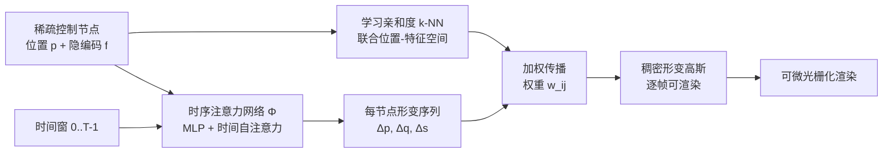

# Mango-GS: Enhancing Spatio-Temporal Consistency in Dynamic Scenes Reconstruction using Multi-Frame Node-Guided 4D Gaussian Splatting

**会议**: ICLR 2026  
**OpenReview**: [https://openreview.net/forum?id=N4VKlSxCLc](https://openreview.net/forum?id=N4VKlSxCLc)  
**代码**: 待确认  
**领域**: 3D 视觉 / 动态场景重建  
**关键词**: 4D Gaussian Splatting, 动态场景, 时序一致性, 控制节点, Temporal Transformer, 多帧建模  

## 一句话总结
Mango-GS 用一组「位置 + 隐编码」解耦的稀疏控制节点驱动稠密 4D 高斯，并在节点空间上跑多帧时序 Transformer，把"逐帧记忆瞬态"换成"建模运动趋势"，在动态场景重建上同时拿到 SOTA 画质、最优时序一致性和 149.5 FPS 实时渲染。

## 研究背景与动机

**领域现状**：3DGS 把静态场景做到了实时高保真，研究者随即把它扩展到动态场景，主流做法是给每个高斯加时间相关参数或用一个 MLP 形变网络（D-3DGS、4DGS、Deformable 3DGS 等）逐帧预测平移/旋转/缩放。

**现有痛点**：这类**逐帧优化**策略把每一帧孤立处理，模型倾向于"背诵"每个时刻的具体状态，而不是学到运动的内在规律。结果就是时序一致性差——快速或复杂运动下容易出现闪烁、模糊、鬼影。一个自然的补救是一次看多帧，用 Transformer 捕捉运动趋势；但一个典型场景动辄几百万个高斯，直接对全部高斯跑时序 Transformer 计算与显存开销爆炸，直接抵消了 3DGS 引以为傲的效率。

**核心矛盾**：想要时序一致就要多帧联合建模，但多帧建模的代价与 3DGS 的"稀疏稠密 + 快"天然冲突。SC-GS 用稀疏控制节点 + k-NN 把运动从少数节点传播到稠密高斯，思路对，但它在**初始帧的空间 k-NN** 邻域在大运动下会失效：一开始挨得近的点可能运动后跑到完全不同的部件上，导致不相关区域被同一控制节点错误带动。

**本文目标**：在保持 3DGS 效率的前提下，做到既高保真又时序连贯的动态重建，尤其是攻克快速/剧烈运动场景。

**核心 idea**：**(1) 解耦控制节点**——把节点从"一个 3D 位置"升级为"规范位置 + 持久隐编码"，用学习到的亲和度（而非纯欧氏距离）建立语义邻域，防止邻域漂移；**(2) 节点空间的多帧时序注意力**——只在稀疏节点上跑时序 Transformer 学连贯运动，再把运动传播回稠密高斯，从根上把"逐帧记忆"换成"运动趋势建模"。

## 方法详解

### 整体框架

Mango-GS 把动态场景表示为一个规范 3D 高斯点云的形变。稠密高斯 $G=\{g_j\}_{j=1}^N$ 由稀疏控制节点 $N=\{n_i\}_{i=1}^M$（$M\ll N$）驱动，每个节点 $n_i=(p_i,f_i)$ 解耦成规范位置 $p_i$ 与可学习隐编码 $f_i$。节点对高斯的影响通过在"位置 + 特征联合空间"里学习的 k-NN 关系建立；一个时序注意力网络吃节点规范位置和时间窗 $[0,T]$，一次性预测整段窗口内每个节点的形变，再按预存的 k-NN 权重把形变插值回每个高斯，得到任意时刻、任意视角可渲染的动态高斯云。整个框架端到端训练，配合时间输入掩码和复合损失。

### 关键设计

**1. 解耦控制节点表示：用学习亲和度替代欧氏邻域，从根上挡住邻域漂移。** SC-GS 直接在规范空间用空间 k-NN 把节点连到高斯，问题是大非刚性运动下"初始挨近"不代表"运动一致"，静态空间邻域会把不同独立运动部件错误绑在一起，造成形变模糊。Mango-GS 把每个节点拆成位置 $p_i$ 和隐编码 $f_i$，并改为**学习亲和度**：对每个高斯 $g_j$ 取其规范参数 $\phi_j=(x_j,q_j,s_j)$（位置、旋转、缩放），用一个轻量 MLP 把它映射成嵌入，与节点编码比较得亲和分数，再对 top-$k$ 分数做 softmax 得到影响权重

$$w_{ij}=\frac{\exp(-D(g_j,n_i))}{\sum_{i'\in K(j)}\exp(-D(g_j,n_{i'}))},\quad \forall i\in K(j)$$

其中 $D$ 度量的是联合位置-特征空间的距离。这样邻域反映的是形状、朝向、位置的语义一致性，而非单纯近邻——可视化里这些 k-NN 连线甚至是"非局部但语义对的"长连接，在大位移下依然有效；同时因为复用了已有高斯属性、不需要给每个高斯额外存隐特征，参数开销很省。

**2. 节点动态的多帧时序注意力：在稀疏节点空间一次预测整窗运动，而不是逐帧记忆。** 要生成连贯运动，模型必须跨时间推理。Mango-GS 设计一个多帧形变网络 $\phi$，同时处理全部 $N$ 个节点。每个节点的规范位置 $p_i$ 编码成 $x_{emb}$，时间戳 $t_0,\dots,t_{T-1}$ 编码成 $t_{emb}$，拼成初始张量 $H^{(0)}\in\mathbb{R}^{N\times T\times C_{in}}$，过 $L$ 层网络：大多数是 ReLU 的标准 MLP 块，在特定层插入**时间自注意力块**——沿时间轴做多头自注意力 $H_{attn}=\mathrm{MHA}(H^{(l)}_{in},H^{(l)}_{in},H^{(l)}_{in})$，让每个节点关联窗口内所有时间步。注意力结果不走简单残差，而是经一个轻量门控模块生成 $(w_{gate},w_{bias})$ 融合回主干

$$H^{(l+1)}=H^{(l)}\otimes\sigma(w_{gate})+w_{bias}$$

门控让网络自适应决定吸收多少时序信息，比残差更具表达力。最后输出经独立线性头解码出每个节点在 $T$ 个时刻的平移 $\Delta p$、旋转 $\Delta q$、缩放 $\Delta s$，再按式 (5) 用 k-NN 权重 $\{\Delta(x_j)(t)\}=\sum_{i\in K(j)}w_{ij}\{\Delta p_i(t)\}$ 传播到稠密高斯。

**3. 输入时间掩码 + 复合损失：逼模型靠上下文外推、专攻难帧、并显式约束时序变化。** 为防止时序注意力网络偷懒去记忆时间戳和逐帧外观，训练时**随机掩掉一部分时间嵌入**，逼网络只用可见时序上下文预测整窗形变（一种轻量训练增强）。总损失 $L=0.8\,L_{frame}+0.2\,L_{motion}$。其中 $L_{frame}$ 是 **top-k 难帧光度损失**：每帧算 L1 与 DSSIM 的加权组合，但不取全帧平均，而是每次迭代只对误差最高的 $K=0.6\times\text{batch}$ 帧求均值并重算 top-k，把梯度持续压向当前最难的时刻。$L_{motion}$ 是**运动感知损失**，作用在相邻帧时间差 $\delta\hat I_t=\hat I_t-\hat I_{t-1}$ 上：

$$L_{motion}=\lambda_{diff}L_{diff}+\lambda_{amp}L_{amp}+\lambda_{dir}L_{dir}$$

三项分别是 $L_{diff}=\sum\|\delta\hat I_t-\delta I_t\|_1$（让帧间变化的空间支撑对上）、$L_{amp}=\sum\max(0,\|\delta I_t\|_1-\|\delta\hat I_t\|_1)$（惩罚低估运动幅度、防过度平滑）、$L_{dir}=\sum(1-\cos(\delta\hat I_t,\delta I_t))$（约束变化方向），权重 $(0.7,0.2,0.1)$。三项合起来要求模型不仅重建单帧，还要匹配帧间如何变化，显著压住闪烁。

## 实验关键数据

### 主实验表格（Neural 3D Video + HyperNeRF-vrig）

| Method | N3DV PSNR↑ | N3DV SSIM↑ | N3DV LPIPS↓ | Hyper PSNR↑ | Hyper MS-SSIM↑ | tLPIPS↓ | FPS↑ | Storage↓ |
|---|---|---|---|---|---|---|---|---|
| D-3DGS | 31.15 | 0.941 | 0.078 | 25.0 | 0.70 | 0.0234 | 14.2 | 172 MB |
| E-D3DGS | 30.86 | 0.938 | **0.048** | 25.4 | 0.70 | 0.0257 | 45.2 | 64 MB |
| 4DGS | 31.58 | 0.942 | 0.055 | 25.2 | 0.68 | 0.0248 | 45.0 | 59 MB |
| SC-GS | 30.20 | 0.935 | 0.067 | 23.6 | 0.66 | 0.0236 | 24.5 | 85 MB |
| GaGS | 31.10 | 0.944 | 0.060 | 24.3 | 0.65 | 0.0233 | 12.0 | **48 MB** |
| MotionGS | - | - | - | 24.6 | 0.71 | 0.0229 | 39.9 | 69 MB |
| TimeFormer | 31.84 | 0.941 | - | 24.3 | 0.68 | 0.0265 | 40.9 | 46 MB |
| **Ours** | **31.89** | 0.942 | 0.049 | **26.2** | **0.78** | **0.0196** | **149.5** | 60 MB |

两个数据集均评 PSNR/SSIM/(MS-)SSIM/LPIPS，HyperNeRF 额外报 tLPIPS（帧间差的时序感知质量），并统计 FPS 和存储。

### 消融实验表格

时间窗 $T$ 与邻居数 $K$（HyperNeRF）：

| $T$ | PSNR↑ | SSIM↑ | tLPIPS↓ | FPS↑ | | $K$ | PSNR↑ | SSIM↑ | tLPIPS↓ |
|---|---|---|---|---|---|---|---|---|---|
| 2 | 27.53 | 0.925 | 0.0225 | 87.9 | | 2 | 27.41 | 0.920 | 0.0205 |
| 4 | 28.19 | 0.937 | 0.0203 | 117.8 | | **3** | **28.39** | **0.942** | **0.0196** |
| **6** | **28.35** | **0.942** | **0.0196** | 149.5 | | 4 | 28.26 | 0.938 | 0.0199 |
| 8 | 28.24 | 0.940 | 0.0197 | 156.2 | | 5 | 27.90 | 0.931 | 0.0203 |

核心组件逐步累加：

| Step | 配置 | PSNR↑ | SSIM↑ | LPIPS↓ | tLPIPS↓ |
|---|---|---|---|---|---|
| 1 | Baseline（单帧） | 25.15 | 0.875 | 0.139 | 0.0250 |
| 2 | + 节点（无学习亲和度） | 24.52 | 0.868 | 0.142 | 0.0235 |
| 3 | + 解耦节点（学习亲和度） | 25.31 | 0.892 | 0.118 | 0.0223 |
| 4 | + 多帧（无时序注意力） | 27.30 | 0.928 | 0.096 | 0.0225 |
| 5 | + 多帧（含时序注意力） | 27.78 | 0.937 | 0.084 | 0.0196 |
| 6 | + Top-k 损失 | 28.05 | 0.941 | 0.077 | 0.0202 |
| 7 | + 运动感知损失 | 28.32 | 0.942 | 0.071 | 0.0192 |

### 关键发现
- **画质 + 速度双赢**：HyperNeRF 上 PSNR/MS-SSIM/tLPIPS 全面领先，且 149.5 FPS 比 MotionGS、TimeFormer 快 3× 以上，存储仅 60 MB。
- **纯加节点反而变差**（Step 2，PSNR 25.15→24.52）：没有学习亲和度的纯空间传播会损害稳定性；解耦 + 学习亲和度（Step 3）才把对应关系修回来并提升细节。
- **多帧是最大增益来源**（Step 3→4，PSNR +2.0），时序自注意力再进一步（Step 5 tLPIPS 大降到 0.0196）。
- **超参有甜点**：$T=6$、$K=3$ 最优——窗口/邻居太小信息不足，太大则过度平滑、损失细节并拖慢速度。

## 亮点与洞察
- **诊断准**：把动态 GS 的核心病灶定位为"逐帧记忆瞬态"和"空间 k-NN 邻域漂移"，两个 insight 一一对应解耦节点和多帧注意力，逻辑闭环。
- **稀疏节点空间做时序建模**是关键的工程取舍：只在 2048 个节点上跑 Transformer，绕开了百万高斯的算力墙，是它能既多帧又实时的根本原因。
- **学习亲和度 vs 欧氏 k-NN** 的可视化很有说服力：好的对应可以是"非局部长连接"，挑战了"近邻即正确"的直觉。
- **运动感知损失**直接监督帧间差的幅度与方向，是把"时序一致性"从隐式期望变成显式监督信号的实用设计。

## 局限与展望
- 仅在 HyperNeRF 与 Neural 3D Video 两个真实数据集上验证，未涉及更大规模/更长序列或合成基准上的系统性测试。
- 固定时间窗 $T=6$ 适合短时依赖，超长运动或周期性运动是否需要分层/滑窗机制未讨论。
- 控制节点数 2048 为固定初始值，节点的自适应增删（随场景复杂度动态分配）未探索。
- 运动感知损失的三项权重靠预实验确定，跨场景的鲁棒性与自动调参留待研究。

## 相关工作与启发
- **节点驱动谱系**：直接对标 SC-GS 的稀疏控制节点 + k-NN，差异点是"解耦节点 + 节点空间多帧建模"；与 4DGS（时空编码）、GaGS（几何特征注入）、MotionGS（光流解耦相机/物体运动）属于同一"增强时序建模"思路的不同切口。
- **时序 Transformer 用法**：TimeFormer 把跨时 Transformer 加到稠密高斯上，本文则把它收缩到稀疏节点上换效率，是"在哪个粒度做注意力"的对照实验。
- **启发**：稀疏控制 + 学习亲和度的范式可迁移到其他需要"少量代理驱动海量基元"的任务（动画绑定、点云配准、可形变模板）；难帧挖掘 + 帧间差监督的组合对一切时序视频生成/重建任务都有借鉴价值。

## 评分
- **新颖性**: ⭐⭐⭐⭐ 解耦节点 + 节点空间多帧时序注意力是对 SC-GS 范式的清晰且有效的改进，组件本身（亲和度、门控注意力、运动损失）多为已有思想的巧妙组合，原创性扎实但非颠覆。
- **实验充分度**: ⭐⭐⭐⭐ 两数据集主比较 + 完整组件消融 + $T/K$ 超参扫描，逐步累加表很清晰；但数据集偏少、缺更大规模/长序列与失败案例分析。
- **写作质量**: ⭐⭐⭐⭐ 动机—矛盾—方案的叙事干净，图 2/3 把"邻域漂移"和注意力架构讲得直观，公式与损失定义完整。
- **价值**: ⭐⭐⭐⭐ 同时刷到 SOTA 画质、最优时序一致性和 149.5 FPS 实时性，对动态场景重建的实用性强，节点空间建模的取舍有方法论参考意义。

<!-- RELATED:START -->

## 相关论文

- [\[AAAI 2026\] Sparse4DGS: 4D Gaussian Splatting for Sparse-Frame Dynamic Scene Reconstruction](../../AAAI2026/3d_vision/sparse4dgs_4d_gaussian_splatting_for_sparse-frame_dynamic_scene_reconstruction.md)
- [\[ICLR 2026\] Uncertainty-Aware 3D Reconstruction for Dynamic Underwater Scenes](uncertainty-aware_3d_reconstruction_for_dynamic_underwater_scenes.md)
- [\[CVPR 2026\] LangField4D: Learning Identity-Adaptive and Spatio-Temporal Continuous 4D Language Fields for Dynamic Scenes](../../CVPR2026/3d_vision/langfield4d_learning_identity-adaptive_and_spatio-temporal_continuous_4d_languag.md)
- [\[CVPR 2026\] ST4R-Splat: Spatio-Temporal Referring Segmentation in 4D Gaussian Splatting](../../CVPR2026/3d_vision/st4r-splat_spatio-temporal_referring_segmentation_in_4d_gaussian_splatting.md)
- [\[ICLR 2026\] Implicit 4D Gaussian Splatting for Fast Motion with Large Inter-Frame Displacements](implicit_4d_gaussian_splatting_for_fast_motion_with_large_inter-frame_displaceme.md)

<!-- RELATED:END -->
