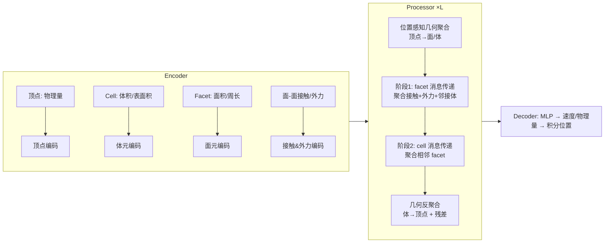

# MAVEN: A Mesh-Aware Volumetric Encoding Network for Simulating 3D Flexible Deformation

**会议**: ICLR 2026  
**OpenReview**: [https://openreview.net/forum?id=XmULVr15E0](https://openreview.net/forum?id=XmULVr15E0)  
**代码**: [https://github.com/zhe-feng27/MAVEN](https://github.com/zhe-feng27/MAVEN)  
**领域**: 3D 视觉 / 基于图神经网络的物理仿真  
**关键词**: 网格仿真, 图神经网络, 3D 柔性形变, 体元素编码, 接触建模, 稀疏网格  

## 一句话总结
MAVEN 把网格里的 2D 面（facet）和 3D 体元（cell）也当成显式节点参与消息传递，用"几何感知的体素编码"在稀疏网格上更准确地模拟 3D 固体的柔性形变与接触。

## 研究背景与动机
- **领域现状**：基于图神经网络（GNN）的物理仿真器（MGN 等）已成为模拟固体柔性形变与接触的主流方案，它们把网格抽象成"点-边"图——顶点当节点、网格连边当边，用 Encoder-Processor-Decoder 架构做消息传递来回归动力学。
- **现有痛点**：这类方法**只用顶点建图**，丢掉了网格本身携带的高维几何元素（2D 面、3D 体元）。在工业实践常用的**稀疏网格**下问题尤其严重：① 接触是面与面之间发生的，但点-边图只能靠"顶点间距离 + 交互半径"近似，粗网格下顶点距离与真实表面距离偏差大，接触信息容易漏检；② GNN 把消息传递当作对局部积分核的离散近似，稀疏顶点采样不足，体积/表面积等几何量估计不准，误差还会沿消息传递累积。
- **核心矛盾**：精度要求高维几何连续性，效率要求稀疏离散——节点级建模在二者之间无法兼顾。
- **本文目标**：在稀疏网格条件下同时保证接触表征精度和内部物理量传播稳定性，逼近 FEM 等数值解法的精度但保留 DL 的效率。
- **核心 idea**：**显式建模高维几何元素**——把每个 cell、facet 都构造成独立节点，赋予体积/面积/周长等几何特征，让物理量沿"体-面"图而非"点-边"图传播，把接触建成 face-to-face 几何，把内部传播建在体元上。

## 方法详解

### 整体框架
MAVEN 沿用 Encoder–Processor–Decoder 三段式，但在每一步都额外引入 cell 与 facet 作为显式节点。Encoder 为顶点（物理量）、cell（体积/表面积）、facet（面积/周长）分别抽取特征，并构造面-面接触边与外力特征；Processor 由 L 层堆叠，每层先用位置感知聚合器把顶点信息汇聚到 cell/facet，再在"体-面二部图"上做两阶段消息传递（先 facet 后 cell），最后反聚合回顶点做残差更新；Decoder 把顶点特征映射回速度与物理量，一阶积分得到下一步位置。

### 关键设计

**1. 高维几何元素的显式建模：把面和体元升格为节点。** MAVEN 的根本转变在于不再把网格简化成顶点图，而是把 cell 集合 $\{C\}$、facet 集合 $\{F\}$、vertex 集合 $V$ 一并实例化成参与消息传递的节点。顶点节点保留位移、速度、压力等物理量 $h^0_{v_i}=\mathcal{A}_V(u^t_{v_i})$；cell 与 facet 本身没有物理输入，于是借鉴有限体积法的思路，用纯几何属性初始化——cell 用当前与初始时刻的体积、表面积，facet 用面积与周长：$h_{c_i}=\mathcal{A}_C(\Omega(c^t_i),\Sigma(c^t_i),\Omega(c^0_i),\Sigma(c^0_i))$，$h_{f_i}=\mathcal{A}_F(\alpha(f^t_i),\lambda(f^t_i),\alpha(f^0_i),\lambda(f^0_i))$，三类特征统一投到 128 维隐空间。把几何"算出来再喂进去"，省去了让网络从顶点坐标隐式反推几何的负担，这正是稀疏网格下精度的来源。

**2. 面-面接触建模：把接触建成几何而非顶点距离。** 区别于在顶点间连边，MAVEN 直接在相互接触的 facet 之间建连接，用简化的包围盒层次（BVH）算法检测碰撞半径 $r$ 内的所有面对。对一对接触面 $f_s,f_r$，它构造一组平移等变向量作为边特征：两面中心的相对位移 $d^F_{rs}=p_r-p_s$、各面顶点到对方中心的张成向量 $d^F_{v_i}=x_{s_i}-p_s$、以及双方面的法向量 $n_s,n_r$，聚合成 $h_{f_s\to f_r}=\mathcal{A}_{F\leftrightarrow F}([d^F_{rs},[d^F_{s_j}],[d^F_{r_j}],n_s,n_r])$。如此接触被表达成"面对面"的几何关系，即便粗网格顶点稀疏也能稳定捕捉接触，这是 FIGNet 路线被验证有效、MAVEN 进一步沿用并改进的关键。

**3. 位置感知几何聚合器：用形函数思想做加权汇聚。** Processor 每层都要把更新后的顶点特征汇聚到 cell/facet。直接拼接所有顶点开销大（六面体有 8 顶点），简单平均又会让特征同质化、丢掉顶点间相对几何关系。MAVEN 受数值求解器中**形函数（shape function）** 用局部坐标描述胞内物理场的启发，基于元素局部坐标系学习一组归一化聚合权重：以 cell 中心到各顶点的位置向量 $\vec d_{c_i,v_j}$ 为输入，$a_{c_i,v_0},\dots,a_{c_i,v_{K-1}}=\text{MLP}(\text{concat}_v(\vec d_{c_i,v}))$，再做加权汇聚 $h^l_{c_i}=\mathcal{A}^{V\to C}_l(h_{c_i},\sum_v a_{c_i,v}h^l_v)$，facet 同理。这些系数跨层共享，并对顶点排序保证置换不变性，等于让网络学到了一套"软形函数"来插值物理场。

**4. 体-面两阶段消息传递 + 几何反聚合。** 在二部图 $G=(\{C,F\},E_G)$（边为所有 $(c_i,f_j),f_j\in c_i$）上分两阶段传播：第一阶段 facet 充当"边"的角色，既桥接相邻 cell，又是外力、接触、内部动力学的汇聚枢纽——它聚合所有面-面接触边、外力特征 $h^S_{f_i}$ 与邻接体特征；第二阶段每个 cell 用对称系数 $a_{c_i,f_j}=a_{f_i,c_j}$ 从其各个面汇聚信息。最后**几何反聚合器**再用对称系数 $a_{v_i,c_j}=a_{c_j,v_i}$ 把体级特征派发回顶点，并加残差与 FFN：$h^{l+1}_{v_i}=h^l_{v_i}+h^{\to V,l}_{v_i}+\text{FFN}(\cdot)$。这种"顶点→面/体→顶点"的往返实现了边界感知的平滑预测，让接触信息能传到远离形变区的地方。训练用一步 MSE 损失，同时回归位置与物理量。

## 实验关键数据

### 主实验（Rollout RMSE，×10³，越低越好）
在三个数据集上对比，DP（密网格弹性）、CG（粗网格弹性抓取）、MBD（极粗六面体网格、弹塑性大变形金属弯折，本文新建）：

| Model | CG-Pos(ALL) | DP-Pos(ALL) | MBD-Pos(ALL) | MBD-Stress(ALL) | MBD-PEEQ(ALL) |
|---|---|---|---|---|---|
| MGN | 16.89 | 23.65 | 2012.16 | 9737.58 | 1.45 |
| GT | 16.69 | 26.77 | 1406.61 | 14255.72 | 2.07 |
| HCMT | 16.87 | 24.94 | 2003.30 | 11539.27 | 1.30 |
| HOOD | 18.84 | 24.01 | 1762.41 | 8352.52 | 1.56 |
| FIGNet | 17.59 | 26.51 | 1030.57 | 5402.31 | 1.09 |
| **MAVEN** | **15.41** | **23.41** | **810.42** | **4776.72** | **1.01** |
| Improv. | 13.07% | 1.33% | 33.82%(Pos) | 11.90% | 8.67% |

网格从细到粗，MAVEN 的平均提升为 3.41% → 13.07% → 18.13%，**网格越稀疏增益越大**。MBD 上几何类方法（FIGNet、MAVEN）显著优于节点类方法，而 MAVEN 因显式建模 cell 比只用 facet 的 FIGNet 更能捕捉 3D 体积变化。

### 消融实验（CG / MBD，Pos & Stress）

| Model | CG-Pos(ALL) | MBD-Pos(ALL) | MBD-Stress(ALL) |
|---|---|---|---|
| Ours | **15.41** | **810.42** | **4776.72** |
| A: 几何聚合→度平均 | 17.45 | 926.71 | 6683.94 |
| B: 去掉显式几何特征(零填充) | 15.93 | 1652.31 | 6680.39 |
| C: 去掉高维元素节点(几何特征平均到顶点) | 17.08 | 1680.20 | 10375.86 |

### 关键发现
- **几何聚合（A）** 在稀疏 CG 上掉点明显——稀疏场景必须捕捉胞内细节几何才能超越节点法。
- **显式几何特征（B）** 在极稀疏 MBD 上崩溃（Pos 810→1652），说明极稀疏下 GNN 无法隐式推断局部几何。
- **高维元素建模（C）** 最关键：仅加几何特征却不建高维拓扑节点，性能退回普通节点法，证明"建模高维元素"本身不可或缺。

## 亮点与洞察
- **把数值方法的归纳偏置注入 GNN**：从有限体积法借"体积/面积是关键几何描述子"，从形函数借"局部坐标加权插值"，让 DL 仿真器获得 FEM 式的稀疏网格稳定性。
- **接触与内部传播分工明确**：facet 管接触与外力汇聚，cell 管体积与内部物理场——这种 cell-facet 协同设计是相对 FIGNet（只 face、擅长刚体接触）和 PhyMPGN（依赖 2D 余切 Laplacian、难扩 3D）的核心增量。
- **稀疏增益曲线**：提升幅度随网格变粗单调上升，直接对应工业界"为效率用粗网格"的真实需求。
- 新建 MBD 金属弯折数据集填补了弹塑性 + 大位移 + 长接触 + 极粗网格的评测空白。

## 局限与展望
- **对网格质量敏感**：几何建模高度依赖网格质量，畸变/断裂场景假设被排除在外。
- **缺乏高效长程交互**：作为局部算子，目前不原生支持长程相互作用，作者把"自动网格 pooling 后的层次图扩展"留作未来工作。
- **扩展成本**：迁移到薄壳/曲面/欧拉系统需额外的几何感知适配。

## 相关工作与启发
- **节点法 GNN 仿真**：MGN（Pfaff et al. 2020）是基线鼻祖，后续工作多在消息传递架构、层次图（HOOD、HCMT）、混合设计上改进，但都只在顶点建模。
- **几何元素仿真**：PhyMPGN 用离散 Laplace-Beltrami 算子（限 2D），FIGNet 用 face-to-face 边建刚体接触——MAVEN 把两条线索统一进 3D Lagrangian 框架并补上体元内部传播。
- **启发**：把经典数值方法（FVM/FEM 的形函数、积分核）当作 GNN 的结构先验，是"物理 ML 不该完全黑箱、应吸收数值方法几何归纳偏置"这一思路的有力例证。

## 评分
- **新颖性**: ⭐⭐⭐⭐ 显式把 2D facet / 3D cell 升格为消息传递节点，并用形函数式几何聚合，是网格 GNN 仿真里清晰且有数值方法理论支撑的新范式。
- **实验充分度**: ⭐⭐⭐⭐ 三个不同稀疏度数据集 + 5 个强基线 + 4 组消融，稀疏增益曲线和分量分工都验证到位；新建 MBD 数据集有价值。
- **写作质量**: ⭐⭐⭐⭐ 动机层层递进（接触漏检 + 积分近似失真），方法与数值方法的对应讲得清楚，Discussion 逐一对比已有方法。
- **价值**: ⭐⭐⭐⭐ 直击工业仿真"粗网格高精度"刚需，代码开源，对物理 ML 与几何深度学习社区有较强借鉴意义。

<!-- RELATED:START -->

## 相关论文

- [\[ICLR 2026\] Variation-Aware Flexible 3D Gaussian Editing](variation-aware_flexible_3d_gaussian_editing.md)
- [\[ICLR 2026\] Positional Encoding Field](positional_encoding_field.md)
- [\[CVPR 2026\] FlexAvatar: Flexible Large Reconstruction Model for Animatable Gaussian Head Avatars with Detailed Deformation](../../CVPR2026/3d_vision/flexavatar_flexible_large_reconstruction_model_for_animatable_gaussian_head_avat.md)
- [\[ICLR 2026\] UniUGG: Unified 3D Understanding and Generation via Geometric-Semantic Encoding](uniugg_unified_3d_understanding_and_generation_via_geometric-semantic_encoding.md)
- [\[ICLR 2026\] VoMP: Predicting Volumetric Mechanical Property Fields](vomp_predicting_volumetric_mechanical_property_fields.md)

<!-- RELATED:END -->
