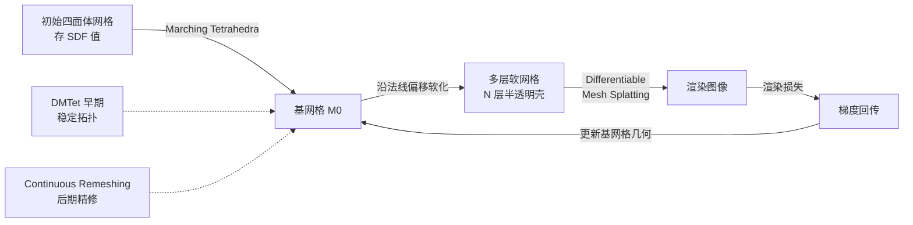

# Mesh Splatting for End-to-end Multiview Surface Reconstruction

**会议**: ICLR 2026  
**OpenReview**: [https://openreview.net/forum?id=PSgps4JXTb](https://openreview.net/forum?id=PSgps4JXTb)  
**代码**: 待确认  
**领域**: 3D 视觉 / 多视图表面重建  
**关键词**: 表面重建, 网格优化, 可微渲染, 体渲染, Mesh Splatting, 拓扑控制  

## 一句话总结
把一张网格沿法线"软化"成多层半透明壳、并让这些层对底层网格可微，从而用体渲染端到端优化网格表面，20 分钟内重建出顶点最少、质量最高的网格。

## 研究背景与动机
**领域现状**：从图像重建表面有两条路线。一条是体积法（NeuS、Neuralangelo、2DGS、GaussianSurfel 等），它们在 3D 空间中铺密度/透明度，沿光线有大的有效感受野，靠体渲染能稳定高效地优化；另一条是直接网格优化（NvdiffRec、IMLS-Splatting、SuGaR），它在优化中可以通过 remeshing 控制网格质量。

**现有痛点**：体积法优化完必须额外做一步 meshing（Marching Cubes / Poisson / Marching Tetrahedra）才能得到网格，这一步会累积误差、并常常产出冗余密集的网格；事后的 remeshing 又往往不可微，进一步累积误差。网格法虽避开 meshing，但网格只描述边界几何、感受野是"单层"的——当网格还没落在真实表面上时，多视图观测只能优化网格表面那一点的颜色，几乎给不出把几何往真实面"推"的空间梯度，于是被迫依赖 shading、法线、深度等先验监督，而这些先验在复杂材质/真实光照下既不准也不够信息量。

**核心矛盾**：体积法有大感受野但要靠不可微 meshing 落地；网格法能控拓扑但单层感受野学不动细节、过度依赖弱先验。两者各缺对方的关键能力。

**本文目标**：在不牺牲网格"可控拓扑"的前提下，给网格补上体积法那种"3D 感受野 + 直接图像监督"。

**核心 idea**：**可微地把表面变成伪体积**——把基网格沿法线偏移软化成若干半透明层，层的透明度由其到基网格的有向距离可微地算出，于是这堆层既有可控的 3D 感受野、又始终对底层网格可微；用体渲染从图像直接监督，梯度能穿过这些层把基网格拉到真实表面，而表面本身仍由那张基网格表示，从而保留 remeshing 控拓扑的能力。

## 方法详解

### 整体框架
从一个存有有向距离值的初始四面体网格出发，用 Marching Tetrahedra 抽出一张基网格；把基网格沿法线偏移软化成多层半透明壳（伪体积）；用提出的 Differentiable Mesh Splatting（基于 tile 光栅化）把多层网格渲成图像，用图像渲染损失监督，梯度回传同时更新基网格几何与附着参数；拓扑上早期用 DMTet 稳定全局结构、收敛后切到 Continuous Remeshing 精修网格质量。

### 关键设计

**1. 网格软化：把单层网格变成可微的伪体积。** 对基网格 $M_0$ 的第 $j$ 个顶点 $v_j^0$，沿其单位法线 $n_j$ 偏移得到第 $i$ 层顶点 $v_j^i = v_j^0 + d_j^i \cdot n_j$（$d_j^i$ 是偏移量）。每层的透明度由该顶点到基网格的有向距离决定，而这里有一个关键技巧：用 stop-gradient 算有向距离 $s_j^i = \mathrm{sign}(d_j^i)\,\lVert \mathrm{stop}(v_j^i) - v_j^0\rVert_2$。如果不做 stop-gradient，把偏移式代入会塌缩成 $s_j^i = \mathrm{sign}(d_j^i)\lVert d_j^i \cdot n_j\rVert_2$，这个量与 $v_j^0$ 无关、根本驱动不了基几何更新；停掉 $v_j^i$ 的梯度后，$s_j^i$ 才对 $v_j^0$ 可微，使得"哪些层更像真实表面 → 把基网格往那拉"的梯度链路成立。有向距离再经 VolSDF 变体映射成 alpha：$s<0$ 时 $\alpha = \tfrac{1}{\beta}(1-\tfrac12 e^{s/\beta})$，$s\ge 0$ 时 $\alpha = \tfrac{1}{2\beta} e^{-s/\beta}$，其中可学习的 $\beta$ 控制密度向基网格集中的紧度（越小越尖）。这一软化机制正是 Fig.2 的直觉来源：单层网格在没贴上真实面时只能优化一点的颜色，而软化出多层壳后产生了与真实面的重叠，近真实面的点跨视图外观一致、在体渲染合成里拿到更高混合权重，反过来减小其有向距离、把基网格拉过去。

**2. Differentiable Mesh Splatting：高效渲染半透明多层网格。** 以三角面为基元做 splatting：用 tile 光栅化把三角顶点投到像平面，找出覆盖每个像素的三角面并按深度从近到远排序。对覆盖像素 $p$ 的三角面，求光线-三角交点 $x^i$ 并算其重心坐标 $w^i = \mathrm{correct}(p, \{u_1,u_2,u_3\}, \{z_1,z_2,z_3\})$（带深度校正）。用 $w^i$ 重心插值得到该交点的属性 $\{\alpha^i, f^i, n^i, r^i, x^i\}$，颜色由 MLP 预测 $c^i = \mathrm{MLP}(f^i, n^i, r^i, \mathrm{Hash}(x^i))$——其中 hash 编码坐标特征注入非线性，避免三角面内部插值过度平滑。最后用体渲染方程把每像素重叠三角合成 $C_p = \sum_{i\in N} c^i \alpha^i \prod_{k=1}^{i-1}(1-\alpha^k)$，渲染图与真值做光度损失，梯度穿过各层更新基网格及其附着参数。相比用 Nvdiffrast 深度剥离做迭代式光栅化，这种 splatting 在 1/4 分辨率只用 2GB 显存（迭代式要 8GB），全分辨率下迭代式 OOM 而 splatting 仍可跑。

**3. 混合拓扑控制：DMTet 稳全局 + Continuous Remeshing 精局部。** 直接优化网格容易产生难修复的缺陷，所以早期沿用 NvdiffRec 的 DMTet 重参数化：初始化四面体网格、把格点 SDF 设为 $\lVert x_g\rVert_2 - r$（即半径 $r$ 的初始球面），用 DMTet 抽基网格来稳定拓扑（注意这里格点 SDF 与软化时的有向距离是两回事——前者稳早期几何抽取，后者产生优化梯度）。但 DMTet 分辨率是立方级增长、且与显式 remeshing 冲突，因此 DMTet 阶段收敛后就冻结其抽出的网格作为基网格、关掉 DMTet，切换到 Continuous Remeshing，每步优化后做一次 remeshing 维持近各向同性三角面、减少缺陷。监督上同时吸收两种范式的好处：除了体渲染图像损失，还光栅化基网格加 shading 监督（仿 IMLS-Splatting）、单目法线监督（仿 GaussianSurfel）、以及 PyTorch3D 的网格平滑损失。

## 实验关键数据

### 主实验表格（表面重建精度，Chamfer Distance cm ↓）

| 方法 | DTU Mean ↓ | 顶点数(K) | 训练(min) | BlendedMVS Mean ↓ |
|------|-----------|-----------|-----------|-------------------|
| NeuS | 0.76 | 1000 | 600 | 2.68 |
| Neuralangelo | 0.62 | 1000 | 600 | — |
| GaussianSurfel | 0.92 | 1000 | 6 | 2.46 |
| 2DGS | 0.78 | 300 | 9 | — |
| GOF | 0.74 | 1000 | 18 | — |
| SuGaR | 1.33 | 1000 | 52 | 8.71 |
| IMLS-Splatting | **0.57** | 300 | 11 | 2.75 |
| Ours w/o MS | 0.73 | 300 | 20 | 1.94 |
| **Ours** | 0.62 | **300** | 23 | **1.71** |

在 DTU 上以最少顶点（300K）追平 SOTA 精度（0.62，与 Neuralangelo 持平、远超它 600min 的训练时间）；在更复杂的 BlendedMVS 上 Mean CD 1.71 显著领先所有对比方法。

### 消融实验表格

混合拓扑控制（DTU，表 4）：

| 配置 | 显存(GB) | 训练(min) | 顶点数 | CD ↓ |
|------|---------|-----------|--------|------|
| w/o DMTet | 7 | 18 | 80K | 3.79（丢全局拓扑/有洞） |
| DMTet (128) | 6 | 15 | 2K | 6.94（网格过稀） |
| DMTet (256) | 8 | 23 | 10K | 4.20（缺细节） |
| Dense Mesh | 28 | 35 | 487K | 1.67 |
| Sparse Mesh | 15 | 19 | 127K | 1.66 |
| **Full Model** | 23 | 25 | 306K | **1.57** |

渲染效率（DTU scan122，表 3，全分辨率 1600×1200）：Mesh Splatting 用 13GB / 22min，迭代式光栅化 OOM；MS 在 1/4 分辨率仅 2GB vs 迭代式 8GB。

### 关键发现
- **软化是涨点关键**：去掉软化只用 shading 监督（Ours w/o MS）在两个数据集都明显变差（DTU 0.73 vs 0.62，BMVS 1.94 vs 1.71），证明端到端体渲染监督比单纯 shading 提供更强几何约束。
- **混合拓扑缺一不可**：去 DMTet 会丢全局拓扑（出洞），只用 DMTet 又过稀/缺细节，混合策略才同时拿到全局拓扑与细节，且在最少顶点下精度最好。
- **顶点数鲁棒**：通过 Continuous Remeshing 的最小边长参数，在很宽的顶点范围内精度都稳定，实践取 ~5mm 边长得到 ~300K 顶点的精度-效率平衡点。
- **细薄结构优势**：在 NeRF Synthetic 上能重建船桅、花瓶褶皱等细结构，但极细的缆绳类结构因各向同性 remeshing 不适配而失败，提示可探索自适应 remeshing。

## 亮点与洞察
- **"软化"这一招把两条路线的优点缝在了一起**：表面表示天然可控拓扑，软化后又获得体积法的 3D 感受野和直接图像监督，避开了 meshing 这个误差累积源头。
- **stop-gradient 的有向距离设计很巧**：一行 stop-gradient 决定了梯度能不能驱动基几何，否则整个端到端链路直接失效——这是方法能成立的"题眼"。
- **效率实在**：单卡 V100 约 20 分钟、300K 顶点出 SOTA 质量网格，对物理仿真等下游应用的"低顶点高质量"诉求非常友好。

## 局限与展望
- **大场景受限**：四面体网格分辨率与显存约束使其难直接扩到很大场景；论文用 GaussianSurfel 的粗网格初始化再精修来变相支持场景级，但当基网格离真实面很远时（如远景背景），薄层壳与目标重叠不足、给不出体梯度。
- **极细结构失败**：各向同性 remeshing 不适合缆绳/头发这类极细结构，需要自适应 remeshing 生成细长三角面。
- **展望**：自适应层带宽 / 层次化软化以支持大场景；三角面剔除、自适应顶点密度等工程优化进一步提速（当前 splatting 仍慢于 3DGS）。

## 相关工作与启发
- **体积法表面重建**：NeuS/VolSDF（SDF 重参数化）、Neuralangelo（hash 编码抓细节）、2DGS/GOF/GaussianSurfel（给 GS 加法线/深度正则）——本文反其道而行，直接在网格上优化、避开 meshing。
- **网格法表面重建**：NvdiffRec（四面体重参数化）、IMLS-Splatting（点云转网格 + shading 损失）、SuGaR（网格贴扁高斯）——本文借了 NvdiffRec 的 DMTet 和 IMLS 的 shading 监督，但用软化补上了它们缺的 3D 感受野。
- **网格软化技术**：Gaussian Shell Maps、DELIFFAS、AdaptiveShell、Gaussian Frosting、Volumetric Surfaces 等在基网格周围套透明层，但都用于新视图合成、且层与基网格不可微（基网格初始化后固定）；本文的层对基网格可微，这是能做端到端表面重建的本质区别。

## 评分
- **新颖性**: ⭐⭐⭐⭐ 「软化网格成可微伪体积」的思路新颖且优雅，stop-gradient 有向距离设计是真正的关键创新点，把两条主流路线的优势统一起来。
- **实验充分度**: ⭐⭐⭐⭐ DTU/BlendedMVS/NeRF Synthetic 多数据集 + 多范式对比，消融覆盖软化、拓扑控制、渲染效率、顶点控制，论证扎实；场景级仅定性、缺少更大规模定量是小遗憾。
- **写作质量**: ⭐⭐⭐⭐ 动机用 Fig.2 的几何直觉讲得清楚，方法推导（尤其 stop-gradient 的必要性）交代到位，逻辑连贯。
- **价值**: ⭐⭐⭐⭐ 低顶点、高质量、20 分钟训练的网格直接对接物理仿真等下游，实用价值高；软化机制也可迁移到更灵活的 3D 参数化上。

<!-- RELATED:START -->

## 相关论文

- [\[ICML 2026\] EPS3D: End-to-End Feed-Forward 3D Panoptic Segmentation](../../ICML2026/3d_vision/eps3d_end-to-end_feed-forward_3d_panoptic_segmentation.md)
- [\[CVPR 2025\] End-to-End HOI Reconstruction Transformer with Graph-based Encoding](../../CVPR2025/3d_vision/end-to-end_hoi_reconstruction_transformer_with_graph-based_encoding.md)
- [\[ICLR 2026\] Guaranteed Simply Connected Mesh Reconstruction from an Unorganized Point Cloud](guaranteed_simply_connected_mesh_reconstruction_from_an_unorganized_point_cloud.md)
- [\[CVPR 2025\] End-to-End Implicit Neural Representations for Classification](../../CVPR2025/3d_vision/end-to-end_implicit_neural_representations_for_classification.md)
- [\[CVPR 2025\] Rethinking End-to-End 2D to 3D Scene Segmentation in Gaussian Splatting](../../CVPR2025/3d_vision/rethinking_end-to-end_2d_to_3d_scene_segmentation_in_gaussian_splatting.md)

<!-- RELATED:END -->
