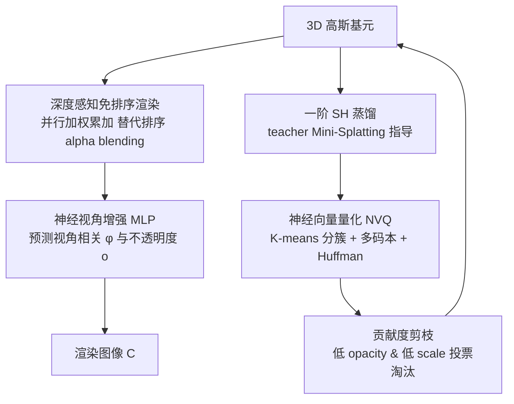

# Mobile-GS: Real-time Gaussian Splatting for Mobile Devices

**会议**: ICLR 2026  
**OpenReview**: [https://openreview.net/forum?id=vRegY0pgvQ](https://openreview.net/forum?id=vRegY0pgvQ)  
**代码**: [https://xiaobiaodu.github.io/mobile-gs-project/](https://xiaobiaodu.github.io/mobile-gs-project/)  
**领域**: 3D 视觉 / 神经渲染  
**关键词**: 3D Gaussian Splatting, 实时渲染, 移动端部署, 免排序渲染, 模型压缩  

## 一句话总结
Mobile-GS 通过"深度感知的免排序渲染 + 神经视角增强 + 一阶 SH 蒸馏 + 神经向量量化 + 贡献度剪枝"五件套，把 3DGS 压到 4.6 MB 并在桌面端跑到 1100+ FPS，首次在骁龙 8 Gen 3 手机上实现 116 FPS 的实时高斯泼溅渲染。

## 研究背景与动机
**领域现状**：3D Gaussian Splatting（3DGS）凭借连续可微的各向异性高斯基元，在高质量新视角合成上已成主流，并被广泛用于自动驾驶、重光照等应用。学界也有 Scaffold-GS、Mini-Splatting、C3DGS 等一批轻量化变体，通过剪枝和紧凑表示提效。

**现有痛点**：这些方法几乎都沿用传统 alpha blending，渲染前必须把高斯按"由近到远"深度排序。本文通过运行时剖析（Fig. 2）发现：**排序才是真正的性能瓶颈**——在 Counter/Bicycle 等场景中，去掉排序后 3DGS 帧率从 134/145 FPS 飙升到 857/871 FPS，几倍加速。排序不仅耗时，还引入实现复杂度与 popping 伪影。

**核心矛盾**：移动 GPU 的算力难以承担成千上万高斯（尤其带视角相关效应）的排序+渲染，而排序又是保证 alpha blending 正确性的前提，去掉它就会破坏前后遮挡关系、产生透明度伪影。如何"既去掉排序换取速度，又不牺牲画质"是核心张力。

**本文目标**：打造一套面向移动端的实时高斯泼溅方案，同时满足三个关键因素——免排序渲染、量化压缩、减少高斯点数。

**核心 idea**：**[免排序]** 用一个可学习、视角相关的深度感知加权方案替代排序式 alpha blending，让所有高斯的颜色贡献能交换次序、并行累加；再用 **[神经补偿]** 一个轻量 MLP 预测视角相关的不透明度，把免排序带来的画质损失补回来；最后叠加 **[极致压缩]** 蒸馏+量化+剪枝三连，把模型压到几 MB。

## 方法详解

### 整体框架
Mobile-GS 在推理阶段彻底抛弃 3DGS 的 tile-based 渲染与排序：先并行计算每个高斯对相关像素的颜色并累加，再单遍合成前景/背景。训练侧叠加蒸馏、量化、剪枝三套压缩术。整体可拆成"渲染路径改造"与"存储压缩"两条主线。

### 关键设计

**1. 深度感知免排序渲染：把排序换成可学习的深度加权，让贡献可交换次序。** 传统 alpha blending 写作 $C=\sum_i c_i\alpha_i T_i$，其中透射率 $T_i$ 依赖前面高斯的累乘，因此必须排序。Mobile-GS 改成 $C=(1-T)\frac{\sum_i c_i\alpha_i w_i}{\sum_i \alpha_i w_i}+Tc_{bg}$，分子分母都是求和，加法可交换，于是渲染顺序无关。其中 $T=\prod_j(1-\alpha_j)$ 是全局透射率用来区分前景与背景，$\alpha_i=o_i\exp(-\frac12\Delta x_i^T\Sigma_i^{-1}\Delta x_i)$ 是常规高斯 alpha。核心是深度感知权重 $w_i=\phi_i^2+\frac{\phi_i}{d_i^2}+\exp(\frac{s_{max}}{d_i})$：用逆深度 $d_i$ 压低远处高斯贡献、抬升近处高斯，并让尺度 $s_{max}$ 更大的高斯权重更高。这样既无需排序、可并行累加，又能保留远处高斯信息，不像硬截断那样丢信息。

**2. 神经视角增强：用一个轻量 MLP 补偿免排序丢失的遮挡线索。** 免排序的代价是缺乏严格深度合成，重叠/遮挡区域会出现不该有的透明效果。作者设计一个 MLP 把每个高斯的几何与外观特征——相机到高斯的归一化方向向量 $P_i=\frac{\mu_i-t_v}{\lVert\mu_i-t_v\rVert}$、尺度 $s_i$、旋转 $r_i\in SO(3)$、球谐系数 $Y_i$——编码成视角相关特征，再分头预测：$F=\text{MLP}_f(P_i,s_i,r_i,Y_i)$，$\phi_i=\text{ReLU}(\text{MLP}_\phi(F))$，$o_i=\sigma(\text{MLP}_o(F))$。这里 $\phi$ 充当深度衰减因子动态调节高斯影响，视角相关不透明度 $o_i$ 则作为校正项动态压制被遮挡区域的透明度，从而把免排序导致的透明伪影补回来。Fig. 4 显示该机制让不透明度分布更集中，冗余高斯被抑制。

**3. 一阶 SH 蒸馏：把三阶球谐压成一阶，并用尺度不变深度损失迁移几何。** 原始 3DGS 用三阶 SH（3×16 系数）表示外观，参数量大、存储重。受 LightGaussian 启发，作者更激进地蒸馏到一阶 SH（3×4 系数），用预训练 teacher（Mini-Splatting）的渲染像素监督学生：$L_{distill}=\frac1{|P|}\sum_{p\in P}\lVert C_p^{tea}-C_p\rVert$。同时引入尺度不变深度蒸馏损失 $L_{depth}(D,D^{tea})=\frac1{|P|}\sum_p(\log\hat D_p-\log\hat D_p^{tea})^2-\frac1{|P|^2}(\sum_p(\log\hat D_p-\log\hat D_p^{tea}))^2$。之所以不用严格的 L1/L2，是因为 teacher 深度不总可靠、师生深度本就有偏差，尺度不变形式更鲁棒。

**4. 神经向量量化 + 贡献度剪枝：用多码本量化与投票剪枝把模型压到 MB 级。** 量化上采用子向量分解策略：把属性向量 $z\in\mathbb R^{KL}$ 经 K-Means 切成 $K$ 个长度 $L$ 的簇，每簇用独立码本 $C_k\in\mathbb R^{B\times L}$ 量化，相比单码本既减小码本内存、又缓解码字冲突；训练末尾再用 Huffman 编码压缩比特流。SH 特征 $Y$ 进一步分解为漫反射分量 $h_d$ 与视角相关分量 $h_v$，用两个 16-bit MLP 在推理时即时解码 $f_d=\text{MLP}_d(h_d,h_v),f_v=\text{MLP}_v(h_d,h_v)$，免去逐高斯存高维 SH。剪枝侧则联合 opacity 与 scale：每轮选出 $C_{opacity}^{(t)}=\{g\mid o_g<Q_\tau(o)\}$ 与 $C_{scale}^{(t)}=\{g\mid s_{max}(g)<Q_\tau(s_{max})\}$ 的交集作为候选，但不立即删，而是累加投票 $V_g^{(t+1)}=V_g^{(t)}+\mathbb1[g\in C_{prune}^{(t)}]$，只有在每个剪枝区间内持续低贡献（票数超阈值）才永久剔除，避免训练早期 opacity/scale 抖动误删。

## 实验关键数据

### 主实验表格
在 Mip-NeRF360 / Tanks&Temples / Deep Blending 三个数据集上与 SOTA 对比（FPS 在 RTX 3090 上测）：

| 方法 | Mip360 PSNR↑ | Mip360 存储↓ | Mip360 FPS↑ | T&T PSNR↑ | T&T 存储↓ | T&T FPS↑ | DB PSNR↑ | DB 存储↓ | DB FPS↑ |
|------|------|------|------|------|------|------|------|------|------|
| 3DGS | 27.21 | 839.9 MB | 174 | 23.14 | 371.5 MB | 236 | 29.41 | 697.3 MB | 214 |
| LightGaussian | 27.08 | 60.4 MB | 227 | 22.61 | 29.9 MB | 392 | 28.74 | 48.2 MB | 271 |
| SortFreeGS | 27.02 | 851.4 MB | 731 | 22.81 | 471.5 MB | 848 | 28.69 | 724.2 MB | 793 |
| Speedy-Splat | 26.92 | 79.4 MB | 401 | 23.08 | 62.4 MB | 527 | 29.11 | 71.2 MB | 463 |
| C3DGS | 27.03 | 30.6 MB | 184 | 23.32 | 21.8 MB | 174 | 29.73 | 24.7 MB | 189 |
| LocoGS-S | 27.02 | 8.5 MB | 292 | 23.23 | 6.8 MB | 325 | 29.76 | 7.8 MB | 322 |
| **Mobile-GS** | **27.12** | **4.6 MB** | **1125** | 23.09 | **2.5 MB** | **1179** | **29.93** | **4.6 MB** | **1132** |

Mobile-GS 在画质几乎追平/超越 3DGS 的同时，存储压到 2.5–4.6 MB（比 3DGS 小约 150–180 倍），FPS 高达 1100+，全面碾压其他轻量方法。

移动端（骁龙 8 Gen 3）实测对比（Table 2）：

| 方法 | PSNR↑ | FPS*↑ | 存储↓ | 训练↓ |
|------|------|------|------|------|
| 3DGS* | 27.01 | 8 | 61.8 MB | 0.5 h |
| Mini-Splatting* | 27.02 | 12 | 36.9 MB | 0.4 h |
| Speedy-Splat | 26.92 | 19 | 79.5 MB | 0.4 h |
| LocoGS-S | 27.02 | 17 | 8.5 MB | 0.8 h |
| SortFreeGS* | 26.74 | 24 | 64.3 MB | 1.3 h |
| **Mobile-GS** | **27.12** | **127** | **4.6 MB** | 1.5 h |

手机端 127 FPS，是次优 SortFreeGS（24 FPS）的 5 倍多，代价仅是更长的训练时间（1.5 h）。

### 消融实验表格
Mip-NeRF360 上各组件消融（FPS 在 RTX 3090 上）：

| 变体 | PSNR↑ | FPS↑ | 存储↓ |
|------|------|------|------|
| **Mobile-GS（完整）** | 27.12 | 1125 | 4.6 MB |
| w/o 免排序（用原 alpha blending） | 27.26 | 684 | 4.5 MB |
| w/o 视角增强 | 26.68 | 1227 | 4.4 MB |
| w/o 神经量化 | 27.33 | 841 | 121 MB |
| w/ 0 阶 SH 蒸馏 | 27.04 | 1219 | 3.6 MB |
| w/ 2 阶 SH 蒸馏 | 27.13 | 917 | 7.3 MB |
| w/ 3 阶 SH | 27.15 | 841 | 9.6 MB |
| w/o Eq.3 深度项 | 27.03 | 1167 | 4.5 MB |
| w/o Eq.3 尺度项 | 27.08 | 1171 | 4.5 MB |

### 关键发现
- **免排序是速度命门**：去掉后 PSNR 微涨（27.26）但 FPS 从 1125 暴跌到 684，证明排序确实是吞吐瓶颈。
- **视角增强是画质命门**：去掉后 PSNR 从 27.12 跌到 26.68，掉点最严重，说明它有效缓解了免排序的遮挡透明伪影。
- **量化是存储命门**：去掉后存储从 4.6 MB 暴涨到 121 MB（约 26 倍），证明 NVQ 对移动部署不可或缺。
- **一阶 SH 是甜点**：一阶在画质/速度/存储间最平衡，二阶/三阶画质几乎不涨却拖慢速度、增大存储。

## 亮点与洞察
- **重新定位瓶颈**：本文最关键的洞察是用运行时剖析坐实"排序而非渲染本身"才是移动端实时化的拦路虎，把优化重心从"减少高斯"转向"消灭排序"，思路清晰且有数据支撑。
- **"破坏-补偿"范式优雅**：免排序破坏了遮挡关系（速度↑画质↓），再用一个轻量神经视角增强把画质补回来，消融数据完整闭环验证了这对取舍的合理性。
- **工程落地扎实**：自研 CUDA Kernel + Vulkan 2.0 部署，真机骁龙 8 Gen 3 上 116/127 FPS，不是只在桌面 GPU 上自嗨，"Mobile"名副其实。
- **压缩组合拳**：蒸馏+多码本量化+Huffman+投票剪枝四管齐下，把模型压到与 LocoGS-S 同量级（甚至更小），同时 FPS 高出 3 倍以上。

## 局限与展望
- **训练成本偏高**：1.5 h 训练时间明显高于多数对比方法（0.4–0.8 h），多视角训练 + 35k 后启动量化 + 60k 迭代叠加所致，对快速建模场景不友好。
- **依赖 teacher 模型**：一阶 SH 蒸馏与深度蒸馏都需要预训练 Mini-Splatting 作 teacher，多了一道前置流程，且学生画质上限受 teacher 约束。
- **免排序近似的边界**：深度加权是对真实遮挡的近似，在极复杂的高频遮挡/半透明叠加场景下，单靠神经补偿能否完全消除伪影仍待更极端场景检验。
- **未涉及动态场景**：方法面向静态场景重建，向动态/4D 高斯、流式重建的扩展尚未探索。

## 相关工作与启发
- **3DGS 与轻量化**：Scaffold-GS、Mini-Splatting、C3DGS、LocoGS-S 等在剪枝/紧凑表示上发力，但都未触及排序瓶颈，本文与它们正交且可借鉴其压缩思路。
- **免排序透明度（OIT）**：从图形学的 depth peeling、A-buffer、k-buffer、stochastic transparency 到近期 SortFreeGS、3DGS 免排序工作，本文 Eq.2 的交换律式累加正是 OIT 思想在高斯泼溅上的落地，并加上深度感知权重与神经补偿。
- **蒸馏与量化**：一阶 SH 蒸馏延续 LightGaussian 的 SH 降阶思路并推到更激进的一阶；NVQ 的子向量多码本量化借鉴向量量化压缩谱系，对任何需要压缩逐基元属性的神经表示都有参考价值。
- **启发**：当一个 pipeline 的瓶颈是某个"为正确性而存在"的强约束（如排序）时，可考虑"放松约束换吞吐 + 神经网络补偿正确性损失"的范式，再叠加压缩组合拳实现端侧部署。

## 评分
- **新颖性**: ⭐⭐⭐⭐ —— 免排序+深度加权+神经补偿的组合在高斯泼溅移动端落地上较新颖，虽 OIT/蒸馏/量化均有前作，但系统性整合并坐实排序瓶颈有价值。
- **实验充分度**: ⭐⭐⭐⭐ —— 三大数据集 + 真机骁龙 8 Gen 3 部署 + 完整组件消融，证据链扎实；若能补更多移动机型与动态场景更佳。
- **写作质量**: ⭐⭐⭐⭐ —— 动机-瓶颈-方法-验证逻辑清晰，图表（瓶颈剖析/pipeline/运行时分析）支撑到位，公式表述规范。
- **价值**: ⭐⭐⭐⭐ —— 首个手机端 100+ FPS 的实时 3DGS，对 AR/移动端神经渲染落地有直接工程意义。

<!-- RELATED:START -->

## 相关论文

- [\[CVPR 2026\] Seele: A Unified Acceleration Framework for Real-Time Gaussian Splatting on Mobile Devices](../../CVPR2026/3d_vision/seele_a_unified_acceleration_framework_for_real-time_gaussian_splatting_on_mobil.md)
- [\[ICLR 2026\] 3DGEER: 3D Gaussian Rendering Made Exact and Efficient for Generic Cameras](3dgeer_3d_gaussian_rendering_made_exact_and_efficient_for_generic_cameras.md)
- [\[ICLR 2026\] MoE-GS: Mixture of Experts for Dynamic Gaussian Splatting](moe-gs_mixture_of_experts_for_dynamic_gaussian_splatting.md)
- [\[ICLR 2026\] FastGHA: Generalized Few-Shot 3D Gaussian Head Avatars with Real-Time Animation](fastgha_generalized_few-shot_3d_gaussian_head_avatars_with_real-time_animation.md)
- [\[ICLR 2026\] PD²GS: Part-Level Decoupling and Continuous Deformation of Articulated Objects via Gaussian Splatting](pd2gs_part-level_decoupling_and_continuous_deformation_of_articulated_objects_vi.md)

<!-- RELATED:END -->
