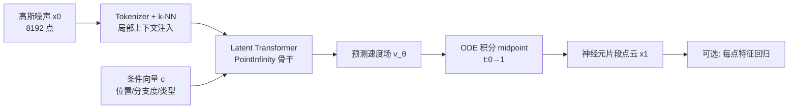

# MoGen: Detailed Neuronal Morphology Generation via Point Cloud Flow Matching

**会议**: ICLR 2026  
**OpenReview**: [https://openreview.net/forum?id=HpIxllcNtb](https://openreview.net/forum?id=HpIxllcNtb)  
**代码**: [https://mogen-release.web.app/](https://mogen-release.web.app/)  
**领域**: 3D 点云生成 / 计算神经科学 / 连接组学  
**关键词**: 流匹配, 点云生成, 神经元形态, 连接组学, 合成数据增强  

## 一句话总结
MoGen 用流匹配在高分辨率 3D 点云上生成逼真的小鼠皮层轴突/树突片段形态，并把上百万合成样本喂给生产级连接组重建管线里的形状可信度分类器，把残余重建错误降了 4.4%，相当于全脑重建省下约 157 人年的人工校对。

## 研究背景与动机
**领域现状**：连接组学要从纳米级电镜体数据里重建神经元的完整接线图，自动分割已经做得不错，但残余的错误分割（错误切断 split / 错误合并 merge）只能靠人工"校对"修，而单个体数据已达 PB 级，人工校对成本被估到一个小鼠全脑要花数十亿美元，成了整个领域的瓶颈。瓶颈的根因之一是负责判断局部形状是否合理的算法组件（如 PATHFINDER 管线里的 SHAPE 分类器）缺乏高质量训练数据。

**现有痛点**：神经元形态的生成建模还很初级。已有的数据驱动方法都停留在简化表示上——MorphGrower/MorphVAE 生成稀疏骨架（只有分支拓扑没有表面细节），MorphOcc 生成粗占据图，PointNeuron 用带半径的点近似膜表面。这些方法都丢掉了树突棘、口径变化这些决定连接关系的高频表面细节，而这些细节恰恰是重建和仿真任务真正需要的。

**核心矛盾**：神经元拓扑上是树状、空间上跨越大体积但自身占体积极小（胞体几十微米、轴突能伸出几毫米）。这种几何让稠密体素生成方法在高分辨率下计算和显存都爆炸；要保细节就必须换更高效的表示。

**本文目标**：做出第一个能生成高分辨率、生物可信的神经元片段 3D 形态的生成模型，并真正在一条生产级重建管线里证明它有用。

**核心 idea**：① **用点云 + 流匹配** 高效编码稀疏高频的膜表面几何；② **给可扩展的潜在 Transformer 骨干注入局部几何上下文**（k-NN 相对坐标），补上 cross-attention 丢失的局部信息；③ **用上百万合成样本 co-train 下游可信度分类器**，把生成质量直接兑现成重建错误的下降。

## 方法详解

### 整体框架
MoGen 把神经元形态建成 8192 个点的局部点云（以骨架节点为原点、10 µm 半径归一化），分两阶段生成：先用一个条件流匹配模型生成 3D 点坐标，再可选地用一个回归模型预测每点特征。生成骨干是为大点云设计的线性复杂度 PointInfinity（点 token 与固定数量的潜在 token 做 cross-attention），MoGen 在其输入端注入 k-NN 局部几何上下文，并用可控条件向量驱动可解释的形态操控。

### 关键设计
**1. 点云上的条件流匹配：用最简目标学高分辨率几何**。模型训练一个速度场 $v_\theta$，把简单先验 $P_0$（标准高斯）输运到真实数据分布 $P_1$。对真实样本 $x_1\sim P_1$ 和噪声 $x_0\sim P_0$ 做线性插值 $x_t=(1-t)x_0+tx_1$，目标是预测常速度向量 $v=x_1-x_0$，于是损失就是一个简洁的均方误差 $L=\mathbb{E}_{t,x_0,x_1,c}\|v-v_\theta(x_t,t,c)\|^2$。生成时从噪声出发用 midpoint 求解器积分 ODE $\frac{dx_t}{dt}=v_\theta(x_t,t,c)$ 到 $t=1$。相比 GAN/VAE/扩散，流匹配训练目标更简单、推理更高效，且能扩到神经元细节所需的 8192 点这种大规模——很多二次复杂度的通用模型在这个分辨率下根本跑不动。

**2. k-NN 相对坐标注入：补回 cross-attention 丢失的局部沟通**。作者诊断出 PointInfinity 的硬伤：全局 cross-attention 让每个点 token 对潜在 token 的贡献彼此独立、与几何邻居无关，形成信息瓶颈，导致生成出现游离点群这类伪影。修法很轻——对每个输入点找 k 个最近邻，把它们的相对 3D 坐标拼成额外特征接到该点 token 上。这把点云文献里成熟的局部几何归纳偏置引进来，被证明是生成高保真形态的关键，且只增加 <15% 训练时间。代价是它让模型变得分辨率相关、打破了 PointInfinity 原本的分辨率不变性（不过附录显示对训练时未见的更高分辨率仍有一定泛化）。

**3. 可控条件生成：把可解释形态属性接进潜在流**。把投影后的条件向量 $c$ 拼到潜在流 token 上（类似 PointInfinity 的条件 token），就能操控全局形态属性：位置与分布（9 维：均值 + 协方差 6 个独立元）、分支复杂度（1 维：256 点子采样上最小生成树 MST 的叶子数，作为终端分支数代理）、神经突类型（轴突/树突，±1）。再配一个二值 mask 标明 $c$ 哪些维有效，从而支持无条件生成和子集条件，并能在轴突↔树突之间平滑插值（插值时树突棘等细节会自然涌现）。配合分类器无关引导（CFG）还能在"忠实于条件"和"多样性"之间调档：引导强度 1.0 最忠实但最不多样。

**4. 面向神经元的可解释评测套件：让指标真正对应质量**。标准点云指标（Chamfer、FID）对神经元不公平——一个生物上合理的小角度分支变化会带来很大的 Chamfer 距离。作者改为比较真实集与生成集在 10 个旋转不变可解释特征上的分布，用最大均值差异 MMD（比 Fréchet 距离假设更少）度量：全局形状（4 维：质心到原点距离 + 沿前三主成分的标准差）、局部/全局点密度（4 维：最近/最远邻距离的均值与标准差）、拓扑（2 维：全点 MST 的总权重 ≈ 路径长度、最长边 ≈ 碎片化敏感度）。作者验证 MMD 与训练损失相关、与用户研究的人类感知相关，且这 10 维特征的线性分类器能 99.3% 区分轴突/树突，说明特征确实抓到了形态差异。

## 实验关键数据

### 主实验（生成质量，500k 步）

| 配置 | MMD ↓ | 低噪声段损失 t∈[0.8,0.9] ↓ |
|------|-------|------|
| **Ours (Full MoGen)** | **3.54** | **0.709** |
| – w/o k-NN (Baseline) | 4.27 | 0.712 |
| – Half Width | 6.97 | 0.711 |
| – Half Depth | 9.94 | 0.711 |
| – w/ Linear schedule | 5.12 | - |

完整 100 万步训练把最终模型 MMD 进一步降到 **3.08**。

### 下游重建影响（PATHFINDER 管线）

| 训练数据 | 最优配置错误率 (errors/mm) ↓ |
|------|------|
| 仅真实数据 | 0.7947 |
| 真实 + MoGen 合成 (10% 负样本替换) | **0.7595** |

错误率下降 **4.4%**，同时改善 split 与 merge 两类错误并建立新的 Pareto 前沿；按全脑尺度估算约省 **157 人年** 人工校对。

### 消融 / 关键发现
- **k-NN 注入是质量主力**：去掉后 MMD 从 3.54 升到 4.27，且低噪声段（细节形成期）损失变差。
- **模型容量必要**：宽度或深度砍半，MMD 分别恶化到 6.97 / 9.94。
- **cosine schedule 优于线性**：线性 schedule MMD 5.12。
- **合成数据替换比例有甜点**：10% 替换最优，比例太高反而掉点——真实数据分布里有不可替代的独特信息（与其他领域一致）。
- **CFG 权衡**：引导强度从 -1.0 到 1.0，忠实度排名从 5.90 提升到 1.20，但多样性排名从 3.70 退到 4.10。

## 亮点与洞察
- **把"生成模型"做成真实科研管线的引擎**：不是刷生成指标，而是端到端证明合成数据能降低生产级连接组重建的错误并量化成人年成本，这种"落地闭环"在生成式 AI 论文里少见。
- **一个极简改动解决架构硬伤**：k-NN 相对坐标注入只加 <15% 训练时间，却把全局 cross-attention 的局部信息瓶颈补上，是"诊断到位 + 改动最小"的范例。
- **为领域量身定制评测**：指出 Chamfer/FID 对神经元的不适配，改用旋转不变可解释特征 + MMD，并用训练损失相关性、99.3% 线性可分、用户研究三重交叉验证指标有效性。
- **可控生成有科学价值**：轴突↔树突平滑插值可做反事实分析（"这个树突棘密度更高会长什么样"），对神经科学假设生成有用。

## 局限与展望
- **拓扑正确性无保证**：偶尔生成带不真实环路或断连组件的片段，流匹配损失不显式约束拓扑（部分也源于真实数据本身的重建瑕疵），目前只能靠 MST 最长边后处理过滤。
- **k-NN 破坏分辨率不变性**：模型变得分辨率相关，虽对更高分辨率有一定泛化，但失去了 PointInfinity 的原生不变性。
- **只能生成局部片段**：约 10 µm 半径、8192 点的片段，扩到完整毫米级、上百万点的整神经元需要能保持全局一致性的层次化方法。
- **合成样本未做优化**：下游只用无条件样本，未来可生成"最有助于 co-train"的样本，或条件于转录组嵌入生成完整 3D 形态、生成合成 EM 影像增强分割模型。

## 相关工作与启发
- **连接组自动重建**：PATHFINDER（Januszewski et al., 2025）的 SHAPE 分类器在 3D 点云上判断聚合段是否生物可信，其性能受限于高质量校对数据量——正是 MoGen 直接攻击的瓶颈。
- **神经元形态生成**：从规则/生物物理仿真到深度学习（MorphGrower、MorphVAE、PointNeuron、MorphOcc），但都停在骨架/占据图等粗表示；MoGen 是首个生成带表面细节（树突棘）的高分辨率片段。
- **3D 点云生成**：GAN/VAE/扩散都被适配过点云，流匹配训练更简单推理更高效；PointInfinity 用点-潜在 token cross-attention 实现线性扩展，是大点云的 SOTA 骨干，MoGen 在其上做改进。
- **启发**：① "诊断架构信息瓶颈→最小改动注入归纳偏置"是通用方法论；② 合成数据 co-train 有甜点比例，盲目加大反而掉点；③ 评测指标要对目标域的不变性/拓扑量身定制，并交叉验证其与训练损失和人类感知的相关性。

## 评分
- **新颖性**: ⭐⭐⭐⭐ 首个高分辨率神经元片段点云生成 + 真实管线落地闭环；架构改动本身（k-NN 注入）较增量，但问题定义和应用很新。
- **实验充分度**: ⭐⭐⭐⭐ 有架构/容量/schedule 消融、CFG 权衡、合成比例扫描、用户研究、99.3% 线性可分验证，并给出生产级重建错误率与经济成本量化；缺与更多通用点云基线的同分辨率对比（作者承认算力不可行）。
- **写作质量**: ⭐⭐⭐⭐ 动机—矛盾—方法—落地叙事清晰，图示与可解释特征讲得透；部分细节压在附录。
- **价值**: ⭐⭐⭐⭐⭐ 把生成模型直接兑现成连接组重建的错误下降与上百人年的人工节省，对神经科学和科学型生成式 AI 都有实打实价值。

<!-- RELATED:START -->

## 相关论文

- [\[AAAI 2026\] Class-Partitioned VQ-VAE and Latent Flow Matching for Point Cloud Scene Generation](../../AAAI2026/3d_vision/class-partitioned_vq-vae_and_latent_flow_matching_for_point_cloud_scene_generati.md)
- [\[ICLR 2026\] Spiking Discrepancy Transformer for Point Cloud Analysis](spiking_discrepancy_transformer_for_point_cloud_analysis.md)
- [\[CVPR 2026\] UniPixie: Unified and Probabilistic 3D Physics Learning via Flow Matching](../../CVPR2026/3d_vision/unipixie_unified_and_probabilistic_3d_physics_learning_via_flow_matching.md)
- [\[ICLR 2026\] RayI2P: Learning Rays for Image-to-Point Cloud Registration](rayi2p_learning_rays_for_image-to-point_cloud_registration.md)
- [\[CVPR 2026\] Optical Flow Matching: Reframing Optical Flow as Continuous Transport Dynamics](../../CVPR2026/3d_vision/optical_flow_matching_reframing_optical_flow_as_continuous_transport_dynamics.md)

<!-- RELATED:END -->
