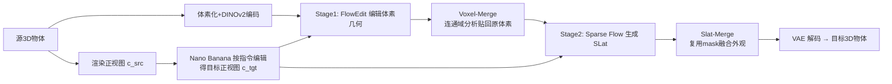

# Nano3D: A Training-Free Approach for Efficient 3D Editing Without Masks

**会议**: ICLR 2026  
**OpenReview**: [https://openreview.net/forum?id=jov79sMFHn](https://openreview.net/forum?id=jov79sMFHn)  
**代码**: 待确认  
**领域**: 3D Vision / 3D 编辑  
**关键词**: 3D Editing, Training-Free, TRELLIS, FlowEdit, Rectified Flow, Voxel Merge, Dataset Construction  

## 一句话总结
把 2D 的免训练编辑方法 FlowEdit 搬进 TRELLIS 的几何-外观两阶段生成里，再用一套基于连通域分析的 Voxel/Slat-Merge 把"该改的区域"贴回原物体，从而无需 mask、无需训练、无需多视图重建就能对 3D 物体做局部一致的增删改，并据此造出首个 10 万规模的 3D 编辑数据集。

## 研究背景与动机
**领域现状**：2D 图像编辑已经走完三步走的成熟路径——先有免训练编辑算法（如 Prompt-to-Prompt），再有大规模配对编辑数据集的自动构造（如 InstructPix2Pix），最后训出能实时推理的前馈编辑模型（GPT-4o、Flux.1 Kontext、Nano Banana）。反观 3D 编辑，整个领域还卡在第一步"算法"上，连可靠的免训练编辑方法都没有，更别说数据和前馈模型。

**现有痛点**：当前 3D 编辑主要走两条路，都不好用。一是 SDS（Score Distillation Sampling）系，靠预训练 2D 扩散模型的梯度去优化 3D 表示，速度慢、结果糊；二是"多视图编辑再重建"范式，先把各视角渲染图改了再用大重建模型缝回 3D，跨视图一致性差、几何容易崩、还经常破坏不该动的区域。两类方法普遍需要耗时优化，且离不开人工 mask。

**核心矛盾**：3D 编辑的本质难点是空间一致性——既要让"该改的地方"语义对齐编辑指令，又要让"不该动的地方"在几何和外观上严丝合缝地保持原样。直接用生成模型从噪声重新生成会丢失原物体结构，而 TRELLIS 这类整流流（rectified flow）3D 生成模型虽能出高质量物体，却"无法可靠复现完全相同的几何"。

**本文目标**：能不能像 2D 那样，仅用预训练生成模型、以免训练的方式，对 3D 物体做多样、高效、一致的局部编辑，且不需要 mask？解决它就能让 3D 编辑进入"数据扩张→训前馈模型"的正循环。

**核心 idea**：**[免训练迁移]** 把 2D 的 inversion-free 编辑算法 FlowEdit 引入 TRELLIS 第一阶段，用预训练先验在源物体和目标物体间建一条整流流编辑轨迹（而非从噪声起步）；**[区域感知融合]** 再用 Voxel/Slat-Merge 通过连通域分析自动定位被改动的区域，把它贴回原物体以锁住未编辑区域的几何与外观一致性。

## 方法详解

### 整体框架
Nano3D 建立在 TRELLIS 的"几何-外观解耦"两阶段流水线之上：原始 3D 物体先被体素化并结合 DINOv2 特征经 VAE 编码成结构化潜变量（SLat）。编辑时先用 2D 编辑模型 Nano Banana 把渲染出的正视图按指令改好，得到目标正视图；随后第一阶段用 FlowEdit 替换标准的流采样、在源/目标正视图引导下编辑体素几何，并用 Voxel-Merge 校正；第二阶段在编辑后的体素和正视图引导下生成 SLat、再用 Slat-Merge 校正外观；最后 VAE 解码出目标 3D 物体。

### 关键设计
**1. FlowEdit 进 TRELLIS：在源-目标物体间建编辑轨迹而非从噪声重生成。** 作者的出发点是，与其让 TRELLIS 从随机噪声生成目标物体（必然丢失原结构），不如借 FlowEdit 的思路在源体素 $s_{src}$ 和目标体素 $s_{tgt}$ 之间直接连一条整流流轨迹。具体做法是先用 Nano Banana 把源正视图 $c_{src}$ 按文本指令改成目标正视图 $c_{tgt}$，再让 TRELLIS 第一阶段的 Flow Transformer 在这两个条件下分别预测两条噪声-体素轨迹 $p_t,q_t$ 的速度场，并让二者从同一采样噪声 $\epsilon$ 出发对齐，得到编辑轨迹：

$$s_t = s_{src} + q_t - p_t \approx s_{src} + \int\big(v^\theta_t(q_t, c_{tgt}) - v^\theta_t(p_t, c_{src})\big)\,dt$$

其中 $p_t=(1-t)s_{src}+t\epsilon$，$q_t=(1-t)s_{tgt}+t\epsilon$。这条轨迹在 $t=1$ 端从 $s_{src}$ 起步（保几何）、在速度场差值的语义引导下逐步逼近 $s_0=s_{tgt}$，整个过程 inversion-free、optimization-free，把 2D 里行之有效的免训练编辑首次搬进 3D 生成先验。

**2. Voxel-Merge：用 XOR 差异图 + 连通域阈值滤掉"误改区"。** FlowEdit 出来的体素 $s_{fe}$ 偶尔会"超纲"——比如让龙去掉翅膀时，连无关部位也被改了。为此 Voxel-Merge 对源体素 $s_{src}$ 和 FlowEdit 体素 $s_{fe}$ 做逐元素 XOR 得到差异图 $g(i)=s_{src}(i)\oplus s_{fe}(i)$，所有被改动的元素标 1，再对这些元素做连通域分析分组。只保留体积大于阈值 $\tau$ 的连通块（视为真正想编辑的区域，过滤掉零碎的误改），据此初始化二值 mask $m$，最后用 $s_{src}\oplus m\to s_{tgt}$ 把正确的编辑区域转移到原体素上、其余原样保留。消融显示 $\tau=100$ 时 mask 最贴合真实编辑区，太小则把无关区域也圈进来。

**3. Slat-Merge：复用同一 mask 把外观一致性也锁住。** 几何对齐后，把合并体素 $s_{tgt}$ 连同目标正视图 $c_{tgt}$ 送进 TRELLIS 第二阶段的 Sparse Flow Transformer 生成目标 SLat $z_{tgt}$。为了让外观同样保持源物体的未编辑区，Slat-Merge 直接复用 Voxel-Merge 阶段算好的 mask $m$，对源 SLat 做 $z_{src}\oplus m\to z_{tgt}^{\cdot}$，最终把"未编辑区取自 $z_{src}$、编辑区取自 $z_{tgt}$"的外观特征拼出来。这一步正是吃到了 TRELLIS 几何-外观解耦的红利——同一套区域定位能同时用于结构和纹理两层。

**4. Nano3D-Edit-100k 数据流水线：把编辑器变成造数据的机器。** 作者把 Nano3D 包成一条全自动数据生产线：从公开 3D 数据集（Trellis-500K、Objaverse 等）采样正视图 → 用 Qwen2.5-VL 按 add/remove/replace 三类模板生成多样指令 → 用 TRELLIS 从图像重建源 mesh（而非用原 mesh，因为取原 mesh 的 SLat 需渲染约 150 视图且 VAE 编码有损）→ 用 Nano-Banana 或 Flux-Kontext 编辑目标图 → 喂进 Nano3D 出编辑后 3D 资产，再用 Qwen2.5-VL-7B 按指令遵从度过滤。32 块 A800 上每个编辑对约 5 分钟（其中 Flexicube 占约 4.5 分钟，故只存 SLat+体素让用户按需转 GLB），最终造出 10 万对高质量 3D 编辑数据。

## 实验关键数据

### 主实验表格
从三个维度评测：未编辑区结构保持（Chamfer Distance）、目标语义对齐（DINO-I）、生成质量（FID）。

| 方法 | CD↓ | DINO-I↑ | FID↓ |
|------|------|---------|------|
| Tailor3D | 0.037 | 0.759 | 140.93 |
| Vox-E | / | 0.782 | 117.12 |
| TRELLIS | 0.019 | 0.901 | 49.57 |
| Instant3DiT | 0.014 | 0.879 | 56.73 |
| **Nano3D** | **0.013** | **0.950** | **27.85** |

Nano3D 在三项指标上全面领先：FID 27.85 远低于次优的 TRELLIS 49.57，DINO-I 0.950 也明显更高。

### 用户研究 + 数据集对比

| 方法 | Prompt 对齐 | 视觉质量 | 形状保持 |
|------|-----------|---------|---------|
| TRELLIS | 32% | 21% | 5% |
| **Nano3D** | **68%** | **79%** | **95%** |

50 名参与者的偏好里，Nano3D 在三项标准上压倒性胜出，尤其形状保持高达 95%（为清晰起见 Tailor3D/Vox-E 因几乎无人选而略去）。数据集质量上，用 CLIPScore 与 ViLT R-Precision 对比，Nano3D-Edit-100k 全面优于 3D-Alpaca（CLIPScore 39.71 vs 28.42，R@5 45.3 vs 33.6，R@10 52.4 vs 40.2）。

### 消融实验

| 配置 | 效果 |
|------|------|
| 仅 FlowEdit | 几何错位变形，外观缺失/模糊/扭曲，与原物体明显不一致 |
| + Voxel-Merge | 恢复几何、提升跨视图全局一致性，但外观问题仍在 |
| + Slat-Merge | 局部视觉质量进一步提升，编辑前后外观更一致 |
| $\tau=100$ | mask 最贴合真实编辑区（$\tau=50/30$ 会圈入无关区域） |

### 关键发现
- 几何-外观解耦是关键：Voxel-Merge 管几何、Slat-Merge 管外观，二者分工正好对应 TRELLIS 两阶段，缺一不可。
- 失败案例几乎都出在 2D 图像编辑阶段——只要图编辑成功遵从指令，后续 Nano3D 的 3D 编辑成功率就很高。

## 亮点与洞察
- **"3D 编辑落后 2D 整整两个阶段"的诊断很有说服力**：把问题拆成算法→数据→前馈模型三步，明确指出 3D 还卡在第一步，并一口气补上算法（Nano3D）和数据（10 万对）两环，定位清晰、贡献完整。
- **免训练 + 免 mask 是真正的实用性突破**：用户只需给源物体和一句指令，不用画 mask、不用 finetune、不用多视图重建，5 分钟出一个编辑对。
- **一套 mask 复用到几何和外观两层**，把 TRELLIS 解耦表示的好处吃透了，工程上非常干净。

## 局限与展望
- **强依赖 2D 编辑模型的上限**：整条链路的瓶颈在 Nano Banana / Flux-Kontext 把正视图改对，失败案例主要源于此；2D 编辑器改不对，3D 就无从谈起。
- **仅以正视图作为编辑引导**：对于背面、内部或正视图不可见区域的编辑，单张正视图可能信息不足，文中也未充分讨论这类情形。
- **连通域阈值 $\tau$ 需手调**：$\tau=100$ 在示例里最好，但对不同尺度/拓扑的物体，固定阈值未必最优，缺少自适应机制。
- **计算成本仍偏重**：Flexicube 把 SLat 转显式 mesh 每对耗时约 4.5 分钟，规模化时只能先存 SLat 推迟转换。
- **面向第三阶段的伏笔**：本文止于"算法+数据"，真正的前馈 3D 编辑模型留待后续，10 万数据是否足以训出可泛化的前馈模型仍待验证。

## 相关工作与启发
- **2D 编辑三步走**：Prompt-to-Prompt（免训练）、InstructPix2Pix（造数据集）、GPT-4o/Flux Kontext/Nano Banana（前馈模型）——本文把这条成熟路径直接当作 3D 的施工图。
- **整流流与 FlowEdit**：FlowEdit 的 inversion-free、optimization-free、model-agnostic 特性是本文能"零成本"迁移的前提；TRELLIS 的几何-外观解耦 SLat 表示则是 Voxel/Slat-Merge 能分别施工的基础。
- **3D 编辑前作**：SDS 系（Vox-E）慢且糊、"多视图编辑再重建"系（Tailor3D）易崩，本文正是冲着这两类痛点设计的；3D-Alpaca 提供了 VLM 自动标注 3D 资产的范式，被本文借用来做数据流水线。
- **启发**：当某个模态的编辑能力滞后时，与其从头设计，不如对照成熟模态的发展阶段"缺哪补哪"——本文用"借 2D 算法 + 借生成先验 + 区域感知融合"三招就把 3D 编辑往前推了一大步，是一个很好的"范式迁移"样本。

## 评分
- **新颖性**: ⭐⭐⭐⭐ 把 FlowEdit 首次引入 3D 生成先验、并用连通域分析做免 mask 的区域融合，组合新颖且解决真问题；单点技术多为已有方法的巧妙缝合而非全新原理。
- **实验充分度**: ⭐⭐⭐⭐ 三维度量化 + 用户研究 + 数据集对比 + $\tau$/Merge 消融较完整；但 baseline 偏少、缺乏对正视图不可见区域和大规模前馈训练的验证。
- **写作质量**: ⭐⭐⭐⭐ 三阶段叙事清晰、动机有力、公式与流水线交代到位；图表略密，部分实现细节（如 Flexicube 成本）穿插在 setup 里稍显杂。
- **价值**: ⭐⭐⭐⭐⭐ 同时补上 3D 编辑的免训练算法和首个 10 万规模数据集，免训练免 mask 的实用性强，为后续前馈 3D 编辑模型铺好了路，对社区价值高。

<!-- RELATED:START -->

## 相关论文

- [\[CVPR 2026\] AnchorFlow: Training-Free 3D Editing via Latent Anchor-Aligned Flows](../../CVPR2026/3d_vision/anchorflow_training-free_3d_editing_via_latent_anchor-aligned_flows.md)
- [\[ICLR 2026\] Variation-Aware Flexible 3D Gaussian Editing](variation-aware_flexible_3d_gaussian_editing.md)
- [\[CVPR 2026\] Fast3Dcache: Training-free 3D Geometry Synthesis Acceleration](../../CVPR2026/3d_vision/fast3dcache_training-free_3d_geometry_synthesis_acceleration.md)
- [\[CVPR 2026\] Muses: Designing, Composing, Generating Nonexistent Fantasy 3D Creatures without Training](../../CVPR2026/3d_vision/muses_designing_composing_generating_nonexistent_fantasy_3d_creatures_without_tr.md)
- [\[ICLR 2026\] TTT3R: 3D Reconstruction as Test-Time Training](ttt3r_3d_reconstruction_as_test-time_training.md)

<!-- RELATED:END -->
