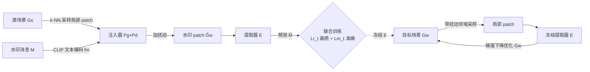

# NGS-Marker: Robust Native Watermarking for 3D Gaussian Splatting

**会议**: ICLR 2026  
**OpenReview**: [https://openreview.net/forum?id=yli4zJhJB0](https://openreview.net/forum?id=yli4zJhJB0)  
**代码**: 待确认  
**领域**: 3D 视觉 / 数字水印 / 版权保护  
**关键词**: 3D Gaussian Splatting, 原生水印, 部分侵权, 渐进式嵌入, 版权验证  

## 一句话总结
NGS-Marker 把水印直接刻进 3D 高斯基元本身，而不是渲染图像里，因此即便攻击者只抠走场景的一小撮高斯拼进新场景，也能从任意局部区域解码出归属信息，专治现有方法束手无策的「部分侵权」。

## 研究背景与动机
**领域现状**：3DGS 凭实时渲染和照片级质量成了虚拟现实、数字内容创作、机器人等领域的主流 3D 表示，版权保护需求随之凸显。现有 3DGS 水印（如 3D-GSW、GaussianMarker、GuardSplat）大多沿用 2D 图像水印的成熟范式——靠预训练解码器从**渲染图像**里嵌取水印，本文称之为「间接水印」(indirect watermarking)。

**现有痛点**：间接水印把渲染图当作中介载体，存在两个结构性问题。一是渲染提取本身会引入可见的画质退化；二是水印提取依赖渲染图像，对视角变化、场景内容变化等外观分布漂移极其脆弱。更关键的是，3DGS 因为 tile-based 光栅化和高斯基元彼此独立，天生是「模块化」的——攻击者可以轻松把某个物体/角色对应的一撮高斯单独抠出来，重组进一个新场景。

**核心矛盾**：作者把这种被忽视的滥用场景命名为**部分侵权 (Partial Infringement)**。论文在 Section 3 用实验证明：当被保护资产的一部分被移植到新场景、渲染分布发生大幅偏移时，3D-GSW / GaussianMarker / GuardSplat 三种方法的检测准确率全部跌到 ~50%（等于随机猜），且减少嵌入比特数也救不回来——说明间接水印信号被彻底破坏，连最小信息都保不住。

**本文目标**：做一个**原生水印 (native watermarking)** 框架，彻底抛弃渲染图像这个中介，直接在高斯基元上嵌入和提取水印，使得「从场景的任意局部区域都能可靠解码归属信息」。

**核心 idea**：作者先做了个可行性验证——把 HiDDeN 的图像输入换成随机噪声，发现神经网络居然能从纯噪声里以 96.7% 比特准确率嵌取水印；而高斯基元虽无结构却有空间分布规律，比纯噪声更可学。基于此，**本文提出"局部高斯水印注入器 + 提取器联合训练 + 用冻结提取器做梯度引导的渐进式嵌入"**，让水印在全场景均匀覆盖、又不牺牲渲染质量。

## 方法详解

### 整体框架
NGS-Marker 分两阶段：**先联合训练**一个局部高斯水印注入器（$P_g + P_d$）和一个消息提取器 $E$；训练完成后**冻结提取器**，用它作为引导信号，通过梯度下降直接优化目标场景的高斯参数，把水印渐进地"刻"进去。最终用户无需渲染，直接对原生 3D 数据的任意可疑局部跑一遍提取器即可验证版权。

### 关键设计
**1. 联合训练注入器与提取器：让水印"扰动"既可学又隐形。** 注入器对一个局部 patch $\tilde{G}_s$（从源场景按中心距离 k-NN 选出的 $k$ 个最近高斯）施加微小扰动来藏水印。它由两块组成：扰动特征生成器 $P_g$（堆叠 PointTransformer 层）先把 patch token 化做 query、把水印消息 $M$ 经 CLIP 文本编码器编成 $f_m$ 做 key/value，生成潜在扰动特征 $f_d = P_g(\text{tokenizer}(\tilde{G}_s); \text{CLIP}(M))$；扰动解码器 $P_d$（主体是 cross-attention）再对每个基元 $\tilde{G}_s^i$ 做 query、$f_d$ 做 key/value，并行预测各自的扰动量，得到 $\tilde{G}_w = \tilde{G}_s + P_d(\tilde{G}_s; f_d)$。提取器 $E$ 架构与 $P_g$ 镜像，单独以 $\tilde{G}_w$ 为输入解码出 $\hat{M}$。两者用复合损失联合优化：$L_t = \text{MSE}(R(\tilde{G}_s,\theta), R(\tilde{G}_w,\theta)) + \lambda_t \cdot \text{BCE}(M,\hat{M})$，前项保证扰动前后渲染外观一致（隐蔽性），后项保证消息解码正确（准确性）。把消息走 CLIP 编码这一步也为后面扩展多模态水印埋下伏笔。

**2. 渐进式水印嵌入：抛弃 one-shot 分块注入，改用提取器引导的梯度优化。** 训练好的注入器若直接用最朴素的"分块逐块注入"会导致边界不一致、覆盖不均；若"反复随机采样并迭代注入"又会和注入器的 one-shot 设计冲突——对同一批基元的重复修改产生矛盾扰动，累积失真、画质崩坏（实验里 WI-Naive 和 WI-Iterative 都验证了这点）。作者的破解办法是**干脆扔掉注入器本身**，只保留冻结的提取器作"裁判"：从目标场景 $G_w$ 随机采 $\delta$ 个邻近高斯组成 patch $\tilde{G}_w$（与训练时的纯最近邻采样不同，这里**故意加入畸变**来增强鲁棒性），送进 $E$ 得到 $\hat{M}$，然后直接对 $G_w$ 的参数做梯度下降，目标是让**任何**随机采样的局部都能解出预设身份 $M_{id}$。损失同样两路：$L_w = \text{MSE}(R(G_s,\theta), R(G_w,\theta)) + \lambda_w \cdot \text{BCE}(M_{id}, \hat{M})$。这套"软优化"既保证全场景均匀覆盖，又把对渲染质量的影响压到最低。

**3. 归属验证与可视化定位：从可疑局部解码并上色。** 怀疑资产被盗用时，用户框选可疑区域喂给提取器 $E$ 取出水印，与私有 ID 比对判定归属。为缓解单组基元解码的噪声，作者设计了可视化方法：采多组基元、为每组判定最可能的归属者、再把对应颜色染到该基元的球谐系数上，从而直观地在 3D 场景里"圈出"哪些区域可能源自用户的私有资产，实现细粒度可视化定位。

**4. 混合保护与多模态扩展：原生水印不与间接水印冲突，且能藏图像。** 因为 NGS-Marker 直接从原生高斯取水印、几乎不动渲染图，它和间接保护"井水不犯河水"，可联合优化 $L_{cooperate} = L_w + \lambda_{indirect} \cdot L_{indirect}$，在原生层和渲染层同时设防、应对图像层面的侵权。更进一步，由于水印消息本就走 CLIP 编码，把 CLIP 文本编码器换成 CLIP 图像编码器、把提取器末端 MLP 换成转置卷积图像解码器，再微调，就能把**一张私有图像**当作水印藏进 3D 场景并解码出来，支持身份感知的个性化版权声明。

## 实验关键数据
数据集为标准公开 3D 数据集（24 场景训练 / 4 场景测试）；通过"先在测试场景嵌水印、再抠子集插入未水印场景"构造部分侵权测试集。注入器/提取器在 2×A100 上训 150 epoch（$k=8192$, $\lambda_t=5$），嵌入在单 A100 上做（$\delta=8192$, $\lambda_w=5$），默认 16 bit。带 `*` 表示从渲染图提取、`§` 表示从高斯基元提取。

### 主实验表格（部分侵权场景，多场景平均）

| 方法 | 8bit Bit-Acc | 8bit 3D-Acc | 16bit Bit-Acc | 16bit 3D-Acc | 16bit PSNR/SSIM↑ | 16bit LPIPS↓ |
|------|------|------|------|------|------|------|
| 3D-GSW | 50.35* | N/A | 49.17* | N/A | 30.37 / 0.960 | 0.051 |
| GaussianMarker | 50.10* | N/A | 50.00* | N/A | 30.75 / 0.961 | 0.046 |
| GuardSplat | 51.08* | N/A | 50.83* | N/A | 39.22 / 0.994 | 0.013 |
| WI-Naive | 65.32§ | 68.50 | 57.54§ | 55.90 | 27.07 / 0.962 | 0.060 |
| WI-Iterative | 77.93§ | 80.70 | 69.25§ | 72.30 | 25.54 / 0.886 | 0.105 |
| **NGS-Marker** | **99.14§** | **95.20** | **97.94§** | **96.60** | **40.17 / 0.995** | **0.007** |

三种间接方法全部 ~50%（随机），NGS-Marker 在 16bit 下 Bit-Acc 97.94%、3D-Acc 96.60%，且渲染质量 PSNR 40.17 反而是全场最佳（不靠改渲染图藏水印）。

### 消融与鲁棒性表格

| 攻击类型 | None | 高斯噪声(σ=0.015) | 旋转(±π) | 缩放 | 致密化(0-50%) | Dropout(0-50%) | 平移 | Combined |
|------|------|------|------|------|------|------|------|------|
| Bit-Acc↑ | 98.35 | 97.06 | 98.31 | 98.35 | 97.93 | 97.41 | 98.35 | 96.28 |
| 3D-Acc↑ | 97.90 | 96.80 | 97.80 | 97.90 | 97.40 | 97.50 | 97.90 | 96.30 |

δ 消融（bear 场景）：δ 从 8192 降到 2048 收敛变慢、准确率略降，但 δ≥2048 仍可靠，说明小规模侵权也能检出。嵌入耗时与基元数正相关（person 42512 个 4min → garden 588946 个 35.2min）。

### 关键发现
- **3D-Acc 不随比特数增加而退化**：更长的水印反而因鲁棒性提升而减少"偶然匹配"导致的误报；8bit 时 3D-Acc 反而偏低，因未标记高斯更易被巧合误判为受保护资产。
- **渐进式优化是画质关键**：直接用局部注入器（WI-Naive/Iterative）画质显著崩坏（PSNR 跌到 25-27），证明渐进优化策略的必要性。
- **混合保护可行**：与 3D-GSW/GuardSplat 联合（λ=0.1）时原生与间接水印几无冲突，3D-Acc 仍 97% 量级、间接 Bit-Acc 仍 98%+。
- **图像水印可行**：换 CLIP 图像编码器 + 转置卷积解码器后，能在 3D 场景藏一张私有图像并以 PSNR 38.75 解码恢复。

## 亮点与洞察
- **问题定义的洞察力**：把 3DGS"显式、模块化"的固有属性识别为安全隐患，提出"部分侵权"这一被忽视但真实的滥用场景，并用一张表把现有方法全部打到随机水平——立论扎实。
- **范式切换**：从"保护渲染图"转向"保护原生高斯基元"，绕开了渲染中介带来的画质退化与外观漂移脆弱性，是方向性的转变而非增量改进。
- **巧妙规避 one-shot 冲突**：训练时用注入器、嵌入时反而扔掉注入器只留提取器做梯度引导，化解了"重复注入累积失真"的死结，且嵌入时主动加畸变换鲁棒性。
- **天然兼容性**：因为不动渲染图，原生水印与间接水印可叠加共存，给出了"原生+渲染"双层防护的实用路径。

## 局限与展望
- **嵌入是 per-scene 梯度优化**，每个场景都要单独跑一遍优化（garden 场景需 35min），不是前馈即时嵌入，规模化部署成本偏高。
- **依赖 3DGS 分割技术假设**：部分侵权的威胁模型建立在攻击者能干净抠出子集之上；面对更复杂的混合编辑、重训练或蒸馏式盗用是否依然稳健，论文未充分探讨。
- **训练数据仅 24 场景**，虽靠局部采样扩充，但跨域泛化（如室外大场景、动态/4D 高斯）能力有待验证。
- **图像水印实验偏 demo 性质**，仅单图、定性展示，容量与鲁棒性的系统评测缺位。

## 相关工作与启发
- **2D 神经水印**：HiDDeN 首次把端到端神经网络用于图像水印，本文的可行性验证和注入器思路直接受其启发（甚至复用其从随机噪声嵌水印的能力）。
- **3D 资产水印**：点云靠扰动坐标/调密度/谱图技术，网格靠顶点位移/谱基/拓扑；NeRF 类靠图像修改或辐射正则（MarkNeRF、NeRFProtector）。
- **现有 3DGS 水印**：3D-GSW、GaussianMarker、GuardSplat 均属"伪 3D"间接范式；GS-Hider/WaterGS 藏隐场景、SecureGS 给 Scaffold-GS 逐场景训 MLP——但**局部 3DGS 的原生保护此前基本空白**，本文是第一个。
- **启发**：对于任何"显式、可分解"的表示（高斯、点云、体素），版权保护都应考虑"组件级抠取重组"这类模块化攻击；把水印做进表示本体而非其投影/渲染产物，是更根本的防线。

## 评分
- **新颖性**: ⭐⭐⭐⭐⭐ 首次提出部分侵权场景并给出首个局部 3DGS 原生水印框架，问题定义和方法范式都有原创性。
- **实验充分度**: ⭐⭐⭐⭐ 主实验、鲁棒性、δ 消融、混合保护、图像水印覆盖全面；但训练场景偏少、图像水印仅 demo。
- **写作质量**: ⭐⭐⭐⭐ 动机层层递进、用反例立论清晰、图表完整；公式与符号略密集。
- **价值**: ⭐⭐⭐⭐⭐ 直击 3DGS 商业化落地的真实版权痛点，且与现有方法可叠加，实用价值高。

<!-- RELATED:START -->

## 相关论文

- [\[CVPR 2026\] Robust3DGSW: Toward Robust Watermarking for Quantization-Aware 3D Gaussian Splatting](../../CVPR2026/3d_vision/robust3dgsw_toward_robust_watermarking_for_quantization-aware_3d_gaussian_splatt.md)
- [\[CVPR 2025\] 3D-GSW: 3D Gaussian Splatting for Robust Watermarking](../../CVPR2025/3d_vision/3d-gsw_3d_gaussian_splatting_for_robust_watermarking.md)
- [\[AAAI 2026\] Can Protective Watermarking Safeguard the Copyright of 3D Gaussian Splatting?](../../AAAI2026/3d_vision/can_protective_watermarking_safeguard_the_copyright_of_3d_gaussian_splatting.md)
- [\[CVPR 2025\] GuardSplat: Efficient and Robust Watermarking for 3D Gaussian Splatting](../../CVPR2025/3d_vision/guardsplat_efficient_and_robust_watermarking_for_3d_gaussian_splatting.md)
- [\[ICLR 2026\] Gradient-Direction-Aware Density Control for 3D Gaussian Splatting](gradient-direction-aware_density_control_for_3d_gaussian_splatting.md)

<!-- RELATED:END -->
