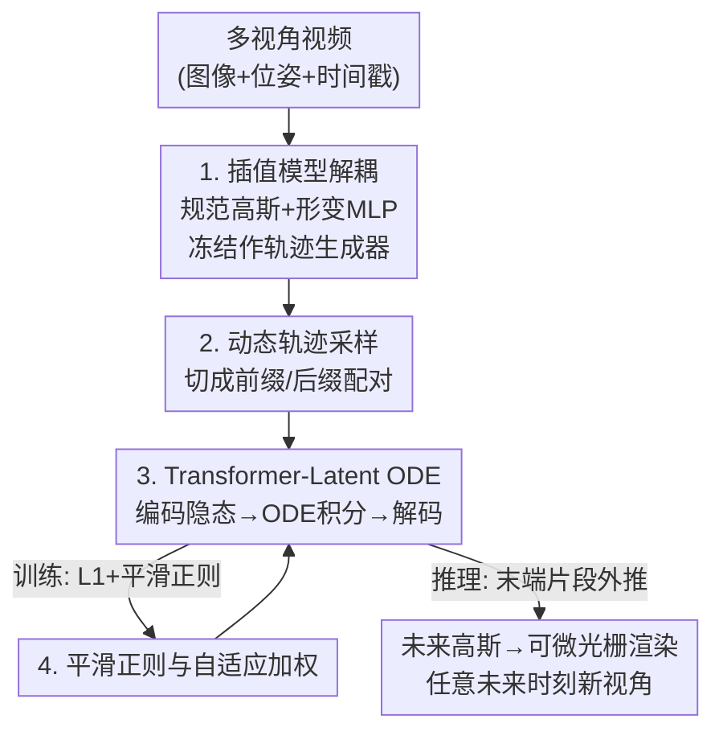

# ODE-GS: Latent ODEs for Dynamic Scene Extrapolation with 3D Gaussian Splatting

**会议**: ICLR 2026  
**OpenReview**: [https://openreview.net/forum?id=XlRbpFj3lJ](https://openreview.net/forum?id=XlRbpFj3lJ)  
**代码**: https://github.com/preacherwhite/ODE-GS (有)  
**领域**: 3D视觉  
**关键词**: 3D高斯泼溅, 动态场景外推, 神经ODE, Latent ODE, 序列预测

## 一句话总结
ODE-GS 把动态 3D 高斯泼溅的"重建"和"未来预测"解耦：先训一个时间形变模型在观测窗口内生成高斯参数轨迹，再用 Transformer + 神经 ODE 在连续隐空间里把过去轨迹外推到未来时刻，从而摆脱"时间戳条件化"导致的分布外失效，在 D-NeRF / NVFi / HyperNeRF 上把外推指标平均提升约 19.8%。

## 研究背景与动机

**领域现状**：3D 高斯泼溅（3DGS）已成为动态场景重建的主流方案。主流做法（Deformable-GS、4D-GS、TiNeuVox）都采用"规范高斯 + 时间条件形变网络"的范式——学一套静态规范高斯 $G$，再用一个以时间戳 $t$ 为输入的形变网络 $D_\omega(t,G)$ 预测每个时刻的位置/旋转/尺度偏移，从而在观测时间窗口内任意时刻渲染出逼真新视角。

**现有痛点**：这类方法本质上是**时间插值器**——它们擅长"填补观测时间戳之间的空隙"，但一旦把时间推到观测窗口之外（$t > t_{\max}$），时间戳就落到了训练分布之外，模型直接产生分布外（OOD）失效，预测出来的运动要么崩塌要么乱跳。而"从过去预测未来动态"（作者称之为 **dynamic scene extrapolation，动态场景外推**）恰恰是自动驾驶、机器人、AR 真正需要的能力，却几乎没人专门研究。

**核心矛盾**：外推任务天生是**欠约束**的——给定过去观测，未来动态有无穷多种可能。直接把时间戳喂进网络，等于让模型在没有约束的外推区域里盲猜。要把解空间收窄，就必须注入物理先验，比如运动的时空平滑性。

**本文目标**：在保留 3DGS 高保真渲染能力的同时，构造一个能稳定外推到任意未来时刻、且预测出的运动物理上合理（平滑、连续）的预测器。

**切入角度**：微分方程历来是描述物理系统演化的天然工具，常微分方程（ODE）尤其适合刻画连续、平滑的运动轨迹。作者据此把"未来预测"重新表述为一个**序列到序列**问题，而不是"按时间戳查询"问题——这恰好与 3DGS 把场景显式表示成一组高斯参数的特性对齐。

**核心 idea**：用"过去高斯轨迹 → 隐状态 → 神经 ODE 演化 → 解码回未来高斯"代替"时间戳 → 形变"，把平滑运动先验直接编码进连续时间的隐空间动力学里，让未来时刻不再是分布外。

## 方法详解

### 整体框架

ODE-GS 的核心思想是**把场景重建与时间预测彻底解耦**，分成两个阶段串行训练。

第一阶段是一个标准的**插值模型**：用规范高斯集 $G$ 加时间条件形变 MLP $D_\omega$，在观测窗口内拟合场景，训练完成后**冻结**。冻结后的插值模型不再用来渲染，而是充当一个"数据生成器"——给定窗口内任意时刻 $t$，它能吐出每个高斯的参数 $G_k(t)$，于是我们拿到了一大批稠密、干净的高斯参数时间轨迹。

第二阶段是真正的预测器 $E_\phi$，一个 **Transformer + Latent ODE** 架构：把一段过去轨迹（前缀）用 Transformer 编码成隐初始状态 $z(t_0)$，再用一个 MLP 参数化的神经 ODE 把这个隐状态沿时间向前积分，最后用解码器把演化出的隐状态映射回高斯参数。训练时通过**动态轨迹采样**把每条轨迹切成"观测前缀 + 未来后缀"的多种长度配对，强迫模型学会不同预测跨度；再配合**隐空间/轨迹平滑正则**（带自适应权重）把欠约束的解空间收窄到物理合理的那一部分。

推理时取观测窗口最末端长度为 $N_c$ 的高斯轨迹片段，编码、ODE 向前积分到 $t > t_{\max}$，解码出未来高斯，最后用可微光栅器渲染出未来新视角。

### 关键设计

**1. 解耦重建与预测：冻结插值模型当轨迹生成器**

直接在原始图像上端到端训练一个"既会重建又会外推"的模型，会让时间戳信号同时背负重建和预测两个职责，外推时极易过拟合噪声时间戳。ODE-GS 把两件事拆开：先用规范高斯 $G$ 加时间条件形变 MLP $D_\omega$，以光度重建损失 $L_{\text{render}}=(1-\lambda)\lVert\hat I_i - I_i\rVert_1 + \lambda(1-\text{SSIM}(\hat I_i,I_i))$ 在观测窗口内训练好一个高质量插值器，然后**把 $G$ 和 $D_\omega$ 全部冻结**。冻结后它只承担一个职责——给定窗口内任意 $t$ 生成高斯参数 $G_k(t)$，等于把"难学的高保真重建"固化成一台稳定的数据生成机。这样下游预测器只需在干净的高斯参数轨迹空间里学习运动规律，不必再碰图像像素，也不再依赖时间戳条件，从根上规避了 OOD 失效。注意每个高斯只让位置 $\mu_k$、旋转 $q_k$、尺度 $s_k$ 随时间变，透明度 $\alpha_k$ 和球谐系数 $c_k$ 跨时间保持一致，进一步缩小了需要预测的维度。

**2. Transformer-Latent ODE：把外推变成连续隐空间的序列预测**

时间戳条件化的根本毛病是把"时间"当成查询输入，外推区域天然落在训练分布外。本设计改成纯序列到序列：给定从长度 $N_c$ 的上下文窗口里均匀采样的过去轨迹 $\gamma_k=\{G_k(t_j)\}_{j=1}^{N_c}$，先逐步嵌入并加正弦位置编码以保留时序，再由 Transformer 编码器 $F_\phi:\mathbb{R}^{N_c\times 10}\to\mathbb{R}^d$ 压成一个概括过去动态的隐状态 $z(t_0)$。这个隐状态作为神经 ODE 的初值，其演化由一个 MLP 参数化的速度场决定：

$$\dot z = \frac{dz}{dt} = f_\theta(z(t)).$$

对任意 $t > t_{\max}$ 做数值积分即可得到连续隐轨迹 $z(t)$，再由解码器 $\delta_\psi:\mathbb{R}^d\to\mathbb{R}^{10}$ 映射回高斯参数 $\hat G_k(t)=\delta_\psi(z(t))$。这样未来时刻不再以"时间戳"身份被查询，而是以"积分多远"的形式自然产生——连续 ODE 公式本身就内蕴平滑先验，因此预测出的运动连续可微，避免了离散自回归那种突跳震荡。

**3. 动态轨迹采样：让模型见过各种预测跨度**

如果训练时采样的轨迹总是占据同样的固定时间跨度，模型只会学到一种预测长度，泛化差。ODE-GS 设计了动态采样：从冻结插值模型给出的连续轨迹中抽取一个"观测前缀"和一个"未来后缀"，前缀按固定间隔采样以保证输入维度一致，而**后缀的时间跨度随起始时刻变化**。训练集是对所有高斯、所有起始时刻、所有可能前缀-后缀切分取并集，于是模型在统一训练流程里同时见过短期和长期预测实例，从而对超出观测窗口的各种外推跨度都更鲁棒。

**4. 平滑正则与自适应加权：在欠约束解空间里挑物理合理的那条**

外推欠约束意味着有无数条轨迹都能拟合过去，必须靠物理先验挑出平滑的那条。除了对预测高斯参数的 L1 外推损失 $L_e=\frac{1}{N_e}\sum_j\lVert\hat G_k(t_j)-G_k(t_j)\rVert_1$，作者加了两个平滑正则：**隐空间正则** $R_{\text{latent}}$ 用有限差分近似隐加速度 $\lVert (f_\theta(z(t_{j+1}))-f_\theta(z(t_j)))/\Delta t_j\rVert_2^2$，惩罚 ODE 速度场的高频振荡；**轨迹正则** $R_{\text{traj}}$ 直接在 3D 空间惩罚高斯位置 $\mu_k(t)$ 的加速度，让物体运动在物理上平滑。但训练早期若正则太强会压制模型学动态，于是引入**自适应加权** $s_t$：用预测损失的指数滑动平均（EMA）估计收敛状态，随着外推损失下降逐步加大正则权重，最终损失为

$$L = L_e + s_t(\lambda_{\text{latent}}R_{\text{latent}} + \lambda_{\text{traj}}R_{\text{traj}}).$$

这样模型先自由学好运动趋势，后期再被慢慢"拉平"到平滑解，兼顾了拟合能力与稳定性。

### 损失函数 / 训练策略

整体训练分两阶段：① 插值模型用光度重建损失 $L_{\text{render}}$（L1 + SSIM）训练后冻结；② 预测器用外推 L1 损失 $L_e$ 加两个平滑正则（隐空间 $R_{\text{latent}}$ + 轨迹 $R_{\text{traj}}$），正则权重由基于 EMA 的自适应项 $s_t$ 动态调度。值得一提的是，作者还试过给预测器加图像重投影损失（随机采相机渲染再算 L1+SSIM），但由于插值模型本身已用重投影损失训练得足够准，轨迹损失已是充分监督，加重投影损失几乎不带来增益。

## 实验关键数据

### 主实验

在 D-NeRF、NVFi、HyperNeRF 三个基准上做未来时刻外推，对比时间插值方法（Deformable-GS、4D-GS、4D-Rotor-Gaussians、TiNeuVox）和外推方法（GaussianPrediction、NVFi）。

| 数据集 | 指标 | ODE-GS | 之前最佳 | 提升 |
|--------|------|--------|----------|------|
| D-NeRF (8 场景均值) | PSNR↑ | 27.30 | GaussianPredict | +18.6% (综合) |
| NVFi (10 场景均值) | PSNR↑ | 33.43 | NVFi | +20% (综合) |
| NVFi | LPIPS↓ | 0.0603 | — | factory/darkroom 降 >40% |
| HyperNeRF (真实) | PSNR/SSIM/LPIPS | 多场景领先 | Deformable-GS / GaussianPredict | 一致改善 |

在 D-NeRF 上运动平滑、轨迹简单的场景优势最大：Mutant +10 dB PSNR、Standup +7 dB。论文总结跨三数据集平均提升 21.4% PSNR、7.4% SSIM、30.5% LPIPS（摘要另给出综合 19.8% 的提法）。

### 消融实验

在 NVFi 数据集上的平均结果：

| 配置 | PSNR↑ | SSIM↑ | LPIPS↓ | 说明 |
|------|-------|-------|--------|------|
| Full model | 33.43 | .947 | .060 | 完整模型 |
| w/o ODE | 23.71 | .879 | .113 | 换成纯自回归 Transformer，LPIPS 几乎翻倍 |
| w/o Regularization | 32.90 | .943 | .066 | 去掉两个平滑正则 |
| w/o Adaptive reg. | 32.19 | .938 | .068 | 正则权重固定，不用 EMA 自适应 |
| w/o Dynamic sampling | 31.35 | .935 | .069 | 固定跨度采样 |

### 关键发现

- **神经 ODE 是命门**：去掉 ODE 换成离散自回归 Transformer 后 PSNR 从 33.43 暴跌到 23.71、LPIPS 几乎翻倍。原因是离散自回归把每步预测反馈回输入，缺乏 ODE 内蕴的平滑先验，容易突跳震荡——这直接印证了"用连续动力学注入平滑先验"的动机。
- **动态采样的贡献仅次于 ODE**：去掉后掉到 31.35 PSNR，说明让模型见过多种预测跨度对外推泛化很关键。
- **平滑正则在复杂运动场景增益更明显**：在 dining、hell-warrior 这类运动多样的场景，正则带来的视觉改善最突出；自适应加权进一步把固定权重的 32.19 提到 33.43。
- **重投影损失无用功**：因插值模型已用投影损失训得足够准，轨迹 L1 损失已是充分监督，再加图像重投影损失不带来显著提升。

## 亮点与洞察
- **"解耦"是最核心的招**：把高保真重建固化成冻结的数据生成器，让预测器在干净的高斯参数轨迹空间里学运动规律，既绕开了像素级噪声，又彻底切断了对时间戳的依赖——这个思路可迁移到任何"重建已成熟、预测还薄弱"的动态表示任务。
- **把"按时间戳查询"重述为"序列到序列预测"**，是规避 OOD 的关键视角转换：未来时刻不再是分布外的查询输入，而是 ODE 积分的自然延伸。
- **用 ODE 公式天然携带平滑先验**，比手工加约束更优雅；消融里自回归基线几乎翻倍的 LPIPS 是对这一点最有力的实证。
- **自适应正则调度（EMA 驱动）** 这个小 trick 很实用：早期放手学、后期收紧平滑，避免了强正则一开始就压死动态，可复用到其他"先拟合后正则"的训练场景。

## 局限与展望
- **依赖插值模型质量**：预测器训练所用轨迹完全由冻结插值模型生成，若插值模型在某些场景（如 Lego 这类已知位姿不准的场景）本身有偏，预测器只能在有偏轨迹上学习——尽管论文展示其在 Lego 上仍较鲁棒。
- **平滑先验在剧烈/非平滑运动上可能受限**：方法的强项是"运动平滑、轨迹简单"的场景（Mutant/Standup 提升最大），对突变、碰撞类运动，平滑假设可能反而抑制真实动态（如 NVFi 的 fallingball 上 ODE-GS 反不及 NVFi 基线）。
- **只预测 $\mu,q,s$ 三类时变参数**，把透明度和球谐系数固定，意味着无法外推光照/外观随时间的变化，对长时间外推下的外观漂移束手无策。
- **改进方向**：引入不确定性建模（如 ODE2VAE 式的隐路径分布）来量化外推置信度，或对非平滑运动引入分段/事件触发的 ODE。

## 相关工作与启发
- **vs Deformable-GS / 4D-GS / TiNeuVox**：它们用时间条件形变网络做插值，本文同样借用"规范高斯+形变"做插值，但把它降级为冻结的数据生成器，外推交给独立的 Latent ODE；区别在于本文不在外推时条件化时间戳，因而避免了它们越出窗口即崩的 OOD 问题。
- **vs NVFi**：NVFi 也研究动态外推并加几何先验，但训练时仍依赖显式时间戳，外推会产生分布外误差；本文用序列到序列 + ODE 彻底去掉时间戳条件，NVFi 数据集上综合提升约 20%。
- **vs GaussianPrediction**：两者都改为"条件于过去运动而非时间"，但 GaussianPrediction 用超点 + 图卷积，外推时只能在离散步上采样；本文用连续 ODE，可在任意连续未来时刻渲染，且消融显示连续公式带来的平滑性显著优于离散自回归。
- **vs GaussianVideo**：同样用神经 ODE，但 GaussianVideo 学的是平滑相机轨迹，本文学的是场景运动本身。

## 评分
- 新颖性: ⭐⭐⭐⭐⭐ 首次把 Latent ODE 与 3DGS 结合做动态场景外推，"解耦重建与预测 + 去时间戳条件化"的视角转换很干净
- 实验充分度: ⭐⭐⭐⭐ 三个基准（含真实数据）+ 四项消融充分，但缺少长时外推退化曲线和不确定性分析
- 写作质量: ⭐⭐⭐⭐⭐ 动机推导清晰，方法分阶段叙述、公式完整，消融直接回应动机
- 价值: ⭐⭐⭐⭐ 为自动驾驶/机器人/AR 的未来 3D 状态预测提供了可行范式，解耦思路有迁移价值

<!-- RELATED:START -->

## 相关论文

- [\[ICLR 2026\] MoE-GS: Mixture of Experts for Dynamic Gaussian Splatting](moe-gs_mixture_of_experts_for_dynamic_gaussian_splatting.md)
- [\[ICLR 2026\] Fracture-GS: Dynamic Fracture Simulation with Physics-Integrated Gaussian Splatting](fracture-gs_dynamic_fracture_simulation_with_physics-integrated_gaussian_splatti.md)
- [\[ICLR 2026\] SSD-GS: Scattering and Shadow Decomposition for Relightable 3D Gaussian Splatting](ssd-gs_scattering_and_shadow_decomposition_for_relightable_3d_gaussian_splatting.md)
- [\[ICLR 2026\] CLoD-GS: Continuous Level-of-Detail via 3D Gaussian Splatting](clod-gs_continuous_level-of-detail_via_3d_gaussian_splatting.md)
- [\[CVPR 2026\] VAD-GS: Visibility-Aware Densification for 3D Gaussian Splatting in Dynamic Urban Scenes](../../CVPR2026/3d_vision/vad-gs_visibility-aware_densification_for_3d_gaussian_splatting_in_dynamic_urban.md)

<!-- RELATED:END -->
