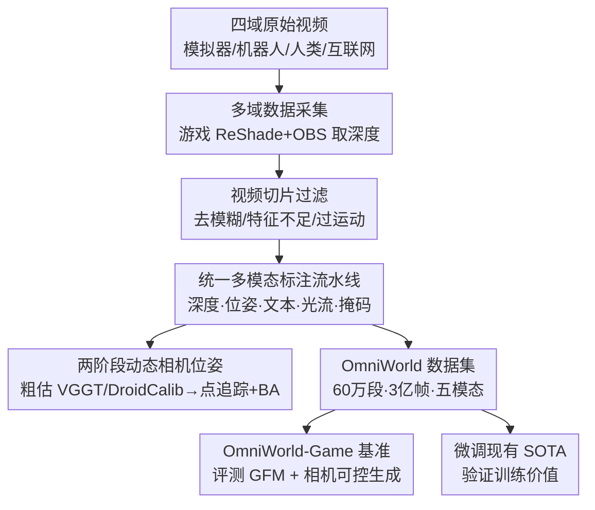

# OmniWorld: A Multi-Domain and Multi-Modal Dataset for 4D World Modeling

**会议**: ICLR 2026  
**OpenReview**: [https://openreview.net/forum?id=1y1YFKb9pp](https://openreview.net/forum?id=1y1YFKb9pp)  
**代码**: https://yangzhou24.github.io/OmniWorld/ （项目主页）  
**领域**: 3D视觉 / 数据集与基准  
**关键词**: 4D世界建模, 多域数据集, 多模态标注, 几何基础模型, 相机可控视频生成

## 一句话总结
作者用游戏引擎自采 + 整合 12 个公开数据集，构建了一个横跨模拟器/机器人/人类/互联网四大域、带深度/相机位姿/文本/光流/前景掩码五种模态、规模超 3 亿帧的 4D 世界建模数据集 OmniWorld，并配套一套自动标注流水线与基准，实测把现有 SOTA 在它上面微调后能在 3D 几何重建和相机可控视频生成上明显涨点。

## 研究背景与动机
**领域现状**：4D 世界建模（同时刻画空间几何与时间动态）近两年靠大规模生成模型和多模态学习快速发展，它落在两个反映"世界理解能力"的核心任务上——3D 几何基础模型（GFM，从 2D 图像还原 3D 几何，如 DUSt3R、VGGT）和相机可控视频生成模型（按精确时空指令生成动态视频）。这两类任务都重度依赖带 RGB、深度、相机位姿等丰富模态的大规模高质量数据。

**现有痛点**：评测侧，现有基准序列太短（Sintel 平均才 50 帧）、运动幅度小、动作类型单一（Bonn 只有室内人体运动、KITTI 只有室外街景），无法考察长程鲁棒性和复杂动态；相机可控视频生成的主流数据集 RealEstate10K 又几乎全是静态场景 + 平滑相机轨迹，和真实世界差距明显。训练侧，图文/视频文本数据虽多，却普遍缺深度、相机位姿、光流这些关键几何模态；而带精确几何标注的多域大规模数据极度稀缺。

**核心矛盾**：真正通用的 4D 世界模型卡在"高质量数据"这个根本约束上——同时满足"动态复杂 + 多域多样 + 时空标注齐全"三者的数据集几乎不存在，要么有语义没几何，要么有几何但场景单一规模小。

**本文目标**：造一个同时具备动态复杂度、多域多样性和密集时空标注的数据集，既能当训练资源，又能当暴露现有 SOTA 短板的难基准。

**切入角度**：现实世界里同步、精确、稠密的多模态真值极难采集，而现代游戏引擎渲染足够逼真、又能在渲染过程中直接拿到精确深度——于是用游戏环境作主力数据源自采，再用公开数据补足真实域多样性。

**核心 idea**：以自采的 OmniWorld-Game 合成数据为核心、整合四大域公开数据，配一套统一的多模态自动标注流水线，把"规模 + 多域 + 多模态几何标注"一次凑齐。

## 方法详解

### 整体框架
OmniWorld 本质是"一套数据采集 + 一套自动标注流水线 + 一套基准"。输入是来自四个域的原始视频（游戏录屏、机器人操作、人类活动、街景），先经视频切片过滤掉运动模糊/特征不足/运动过大的片段，得到高质量 RGB 序列；这些序列再灌进一组专用标注流水线，统一补齐深度、相机位姿、文本描述、光流、前景掩码五种模态；最终既产出可训练的数据集，又基于自采的 OmniWorld-Game 子集切出一个难基准，并用它去评测和微调现有 SOTA。整套数据规模超 60 万段视频、3 亿帧，其中自采子集 OmniWorld-Game 就有 9.6 万段、1851 万帧、214 小时。

### 关键设计

**1. 游戏引擎自采 OmniWorld-Game：用合成手段拿到现实拿不到的精确稠密真值**

数据瓶颈的根子是现实里同步、精确、稠密的多模态真值采不到——深度传感器稀疏带噪，相机位姿在动态场景里更是难标。作者转向游戏环境采集：沿用前人做法，用 ReShade 在渲染管线里截取深度信息，同时用 OBS 从屏幕同步抓取 RGB 图像，从而拿到精确可控的稠密深度 + 720P RGB。这样做有两个好处：一是深度等模态精度高、现实里几乎不可得；二是现代游戏画面逼真、场景多样（荒野到城市、古代到未来），sim-to-real 差距小。最终 OmniWorld-Game 在模态多样性和数据规模上全面超越已有合成数据集——如表 1 所示，它有 1851 万帧、五种模态全齐，而对比的 SeKai-Game 虽有 432 万帧但缺深度/光流/前景掩码。

**2. 四域整合的"自采 + 公开"组合策略：用多域覆盖换真实世界复杂度**

只有合成数据会偏离真实分布，所以作者把自采的模拟器域与三类公开真实域拼起来：机器人域（AgiBot、DROID、RH20T，提供机器人-环境交互与导航序列）、人类域（RH20T-Human、HOI4D、Epic-Kitchens、Ego-Exo4D、HoloAssist、Assembly101、EgoDex，覆盖第一/第三人称的日常到精细装配行为）、互联网域（CityWalk，提供大规模真实街景）。统计上人类域占比最大，凸显对真实活动的侧重；自采的 OmniWorld-Game 则在场景类型、相机视角、历史年代、主导物体等多个维度内部高度多样。这种组合让单一数据集同时具备"合成域的精确标注"和"真实域的分布多样性"，避免任何单一来源的偏置。

**3. 统一多模态标注流水线：按数据源因地制宜地补齐五种几何/语义模态**

不同来源的原始数据模态残缺各异，作者为每种模态设计了按源适配的自动标注方案，统一补齐五种模态：
- **深度**：自采游戏数据直接用 ReShade 取渲染深度；对 AgiBot、HOI4D 这类原始深度稀疏带噪的公开集，用 Prior Depth Anything 优化得到更稠密可靠的深度；对 DROID 这类双目集，用 FoundationStereo 做立体深度估计。
- **前景掩码**：机器人域用 RoboEngine 生成关键帧初始掩码，再用 SAM 2 做时序跟踪与融合；游戏域（如第三人称玩家角色）用 Grounding DINO 在预定义区域检测初始框，作为 SAM 的提示生成掩码。这些掩码后续还用来辅助相机位姿估计。
- **文本**：以 Qwen2-VL-72B-Instruct 为核心、半自动地为每 81 帧片段生成描述，采用域特定提示策略（如游戏域要覆盖第一/第三人称视角、角色动作、背景细节、相机运动），caption 普遍 150–250 token，密度远超 OpenVid-1M、Panda-70M。
- **光流**：用 DPFlow 生成稠密像素级运动，它能直接在原分辨率上处理而无需下采样，适配本数据集的高分辨率。

**4. 两阶段动态相机位姿标注：在弱纹理、转场、剧烈运动下把传统 SfM 救回来**

动态视频里转场、弱纹理、突变运动会让传统 Structure-from-Motion 失效，相机位姿因此最难标。作者设计了一套鲁棒、自动的两阶段流水线，并先借助前面算好的前景掩码把注意力锁定在静态背景区域（屏蔽动态前景的干扰）：第一阶段是**粗估**——无深度视频用 VGGT、有深度约束时用 DroidCalib 给出初始位姿；第二阶段是**精修**——在静态区域上用 SIFT/SuperPoint 配 CoTracker3 做稠密点追踪，再做光束法平差（BA）最小化重投影误差，并可选地结合深度做前后向重投影增强。这套"掩码聚焦静态背景 → 粗估 → 点追踪 + BA 精修"的设计，正是它能在多种数据类型上稳定标出动态相机位姿的关键。

## 实验关键数据

数据集论文的实验分两部分：一是用 OmniWorld-Game 当基准暴露现有 SOTA 的短板，二是用 OmniWorld 微调现有 SOTA 验证训练价值。

### 主实验：OmniWorld-Game 基准上的 GFM 评测

在单目深度 / 视频深度估计上评测一众几何基础模型，结果显示没有任何单一模型能通吃所有任务，且整体误差偏高，验证了基准的挑战性。

| 任务 | 最佳方法 | Abs Rel ↓ | δ<1.25 ↑ | 备注 |
|------|---------|-----------|----------|------|
| 单目深度 (scale) | MoGe-2 | 0.401 | 0.589 | 深度图最锐利 |
| 视频深度 (scale&shift) | VGGT | 0.194 | 0.755 | 精度+效率(18.75 FPS)俱佳 |
| 视频深度 (scale&shift) | DUSt3R | 0.379 | 0.560 | 明显落后 |

点云可视化进一步显示，即便是表现最好的 VGGT，在高度动态场景里仍有明显伪影——当前 SOTA 在长序列一致性和复杂动态上仍吃力。

相机可控视频生成基准上同样暴露问题：I2V 模型里 CamCtrl 相机控制精度最好（CamMC 1.3856），但生成的运动角色常常模糊；T2V 的 AC3D 则动态微弱、跟不上相机轨迹（CamMC 6.6965、FVD 1745.8），量化和定性都差。

### 微调验证：把 SOTA 在 OmniWorld 上微调后涨点

| 模型 | 任务/基准 | 指标 | 原始 | 微调后(*) |
|------|----------|------|------|-----------|
| DUSt3R | 单目深度 / Sintel | Abs Rel ↓ | 0.488 | 0.370 |
| DUSt3R | 单目深度 / Bonn | Abs Rel ↓ | 0.139 | 0.067 |
| CUT3R | 视频深度 / Sintel | Abs Rel ↓ | 0.417→0.537* | 0.396 / 0.314 |
| AC3D | 相机生成 / OmniWorld-Game | CamMC ↓ | 6.6965 | 4.4854 |
| AC3D | 相机生成 / RealEstate10K | CamMC ↓ | 3.6615 | 3.0518 |

### 关键发现
- **微调后的 DUSt3R 不仅超过自己的基线，还超过了在多个动态数据集上微调的 MonST3R**（Sintel 单目深度 Abs Rel 0.370 vs 0.402），说明 OmniWorld 的规模和多样性带来的提升超出了已有动态数据集。
- 视频深度的提升尤其明显（CUT3R 在 Sintel scale&shift 下 Abs Rel 从 0.537 降到 0.314），印证 OmniWorld 在改善时序一致性上的作用。
- 相机可控生成微调后在自家难基准和 RealEstate10K 上**同时**涨点，呼应"动态数据对相机控制至关重要"的先验结论——光靠静态场景数据训不出能跟复杂相机轨迹的模型。

## 亮点与洞察
- **用游戏引擎"白嫖"稠密深度真值**：ReShade 截渲染深度 + OBS 同步抓 RGB，绕开了现实采集稠密深度的硬约束，这套思路对任何需要精确几何真值的合成数据工作都可复用。
- **前景掩码反哺相机位姿**：掩码不只是一个输出模态，还被用来屏蔽动态前景、让位姿估计聚焦静态背景——一个模态的产物被串进另一个模态的标注流程，是流水线设计上很巧的耦合。
- **"难基准 + 训练资源"双重身份**：同一个数据集既暴露 SOTA 短板又能微调涨点，把"评测"和"训练"两件事统一在一个资源上，论证更闭环。
- **按源因地制宜的标注策略**：深度对游戏/单目/双目分别用 ReShade/Prior Depth Anything/FoundationStereo，体现了"统一目标、异构处理"的工程取舍，值得做多源数据集时借鉴。

## 局限与展望
- **合成域的 sim-to-real 残差**：尽管现代渲染逼真，游戏数据与真实物理仍有分布差异，论文未量化这一残差对下游迁移的影响。
- **标注质量依赖外部模型**：深度、位姿、掩码、文本均由现成模型（Prior Depth Anything、VGGT、SAM、Qwen2-VL 等）生成，标注本身的误差会传导进训练，且不同源的真值可信度不一（表 2 中部分模态是重标注而非原生真值）。
- **版权与合规边界**：游戏数据严格限定非商业学术用途、需移除 UI 与敏感内容，这限制了数据集的商用与完全开放程度。
- **基准任务面偏窄**：目前基准聚焦 3D 几何预测和相机可控视频生成两类，未覆盖未来预测、因果推理等同属 4D 世界建模的任务，未来可在五模态标注之上扩展更多评测维度。

## 相关工作与启发
- **vs 静态 3D 数据集（ScanNet 等）**：它们提供精确几何但本质静态，无法建模运动；OmniWorld 用动态视频 + 时序标注补上了"时间"这一维。
- **vs 视频文本数据集（Panda-70M、OpenVid-1M）**：那些有丰富语义却缺深度/位姿等几何模态，做不了 4D 建模；OmniWorld 同时给语义和几何，caption 密度还更高。
- **vs 已有合成数据集（Sintel、TartanAir、SeKai-Game）**：在规模、多样性、模态丰富度上全面更优（表 1），尤其 SeKai-Game 缺深度/光流/前景掩码，而 OmniWorld-Game 五模态齐全且帧数高一个量级。

## 评分
- 新颖性: ⭐⭐⭐⭐ 不是新方法而是新数据资源，但"游戏自采 + 四域整合 + 五模态统一标注"的组合在 4D 世界建模上确属首个同时凑齐三要素的数据集。
- 实验充分度: ⭐⭐⭐⭐ 既有跨多模型的基准评测暴露短板，又有多模型多基准的微调涨点验证，闭环完整；消融偏少（更多是按源的标注方案对比而非模块消融）。
- 写作质量: ⭐⭐⭐⭐ 动机—数据—标注—基准—验证的脉络清晰，表格信息密集。
- 价值: ⭐⭐⭐⭐⭐ 直击 4D 世界建模的数据瓶颈，规模与模态齐全，对训练和评测都有直接、可复用的价值。

<!-- RELATED:START -->

## 相关论文

- [\[ICLR 2026\] RoRE: Rotary Ray Embedding for Generalised Multi-Modal Scene Understanding](rore_rotary_ray_embedding_for_generalised_multi-modal_scene_understanding.md)
- [\[AAAI 2026\] Multi-Modal Assistance for Unsupervised Domain Adaptation on Point Cloud 3D Object Detection](../../AAAI2026/3d_vision/multi-modal_assistance_for_unsupervised_domain_adaptation_on_point_cloud_3d_obje.md)
- [\[ICLR 2026\] Point-MoE: Large-Scale Multi-Dataset Training with Mixture-of-Experts for 3D Semantic Segmentation](point-moe_large-scale_multi-dataset_training_with_mixture-of-experts_for_3d_sema.md)
- [\[CVPR 2026\] WonderZoom: Multi-Scale 3D World Generation](../../CVPR2026/3d_vision/wonderzoom_multi-scale_3d_world_generation.md)
- [\[CVPR 2026\] Multi-modal Frequency Decomposition Network for Semantic Scene Completion](../../CVPR2026/3d_vision/multi-modal_frequency_decomposition_network_for_semantic_scene_completion.md)

<!-- RELATED:END -->
