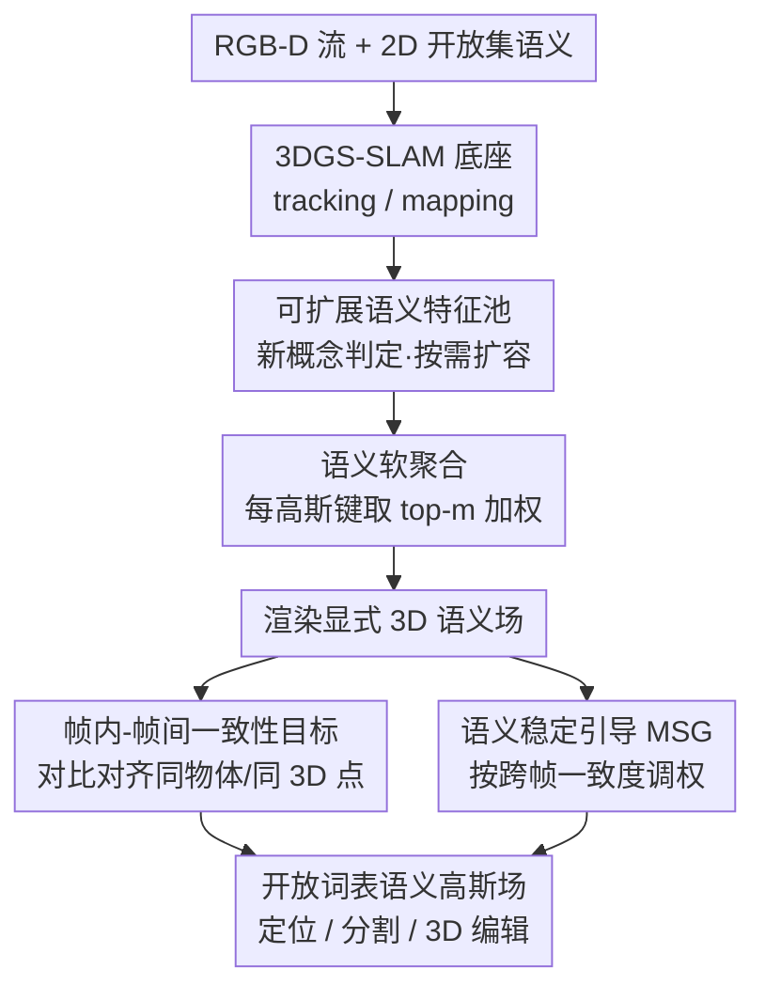

# Open-Set Semantic Gaussian Splatting SLAM with Expandable Representation

**会议**: ICLR 2026  
**OpenReview**: [https://openreview.net/forum?id=E68dgQUzrC](https://openreview.net/forum?id=E68dgQUzrC)  
**代码**: 待确认（作者称将在 Project Page 释出）  
**领域**: 3D视觉 / Gaussian Splatting SLAM / 开放词表语义  
**关键词**: 高斯泼溅、SLAM、开放集语义、可扩展特征池、跨视图一致性

## 一句话总结
本文给 3DGS-SLAM 接上一个**可动态扩容的语义特征池**，让每个 3D 高斯只存一个低维索引键、按需从共享池里软聚合出语义，从而以极小内存在线重建带开放词表语义的三维场景，并用一致性目标 + 语义稳定引导解决跨视图语义不一致，在 Replica 与手机实拍场景上同时提升渲染、轨迹与分割质量。

## 研究背景与动机
**领域现状**：要让普通设备（手机）边走边重建出既有外观、又能用任意文本查询的「度量-语义」三维世界，主流路线是把 CLIP / SAM 这类 2D 基础模型的开放集语义蒸馏进 3DGS 表示，再放进 SLAM 框架里在线优化。已有做法分两派：(i) 把语义特征向量和颜色一起直接塞进每个高斯；(ii) 先把场景渲染成 2D 图再逐像素贴语义，绕开显式 3D 语义。

**现有痛点**：这两派在「场景随 SLAM 不断扩张」的设定下都撑不住——① 它们都是在**固定场景**上拟合预抽好的语义特征，没法在线吸收新出现的概念；② 第 (i) 派内存随高斯数量×特征维度暴涨，为省内存只能把 CLIP 的 512 维压到 3 维，牺牲语义表达力；③ 第 (ii) 派语义只活在 2D 图上，而 3D 定位、具身导航、场景编辑都需要真正 3D-aware 的语义；④ 2D 基础模型对同一物体在不同视角会给出不一致的语义嵌入，导致 3D 语义场学不干净。

**核心矛盾**：「语义表达力 / 可在线扩展」与「内存可控 / 跨视图一致」之间存在根本张力——把高维语义绑死在每个高斯上既贵又僵，压维又丢表达力；而 2D 来源的语义天生跨帧打架。

**本文目标**：(1) 让语义表示既能动态吸收新概念、又把内存压到数量级以下；(2) 真正在 3D 高斯上建立显式语义场；(3) 在序列化的 SLAM 数据流里保证跨帧语义一致。

**切入角度**：作者观察到——同一物体的局部高斯**本应共享相似语义**，因此没必要给每个高斯单独存一份高维特征。把「场景级浓缩语义」与「单个高斯」解耦：语义集中存进一个小池子，高斯只持有一个轻量索引键去检索。

**核心 idea**：用「可扩展语义特征池 + 每高斯一个索引键软聚合」替代「每高斯直存语义」，再配一套跨帧一致性约束，解决可扩展、省内存、3D 显式、跨视图一致四个问题。

## 方法详解

### 整体框架
系统的输入是在线的 RGB-D 流，底座是现成的 3DGS-SLAM（论文在 SplaTAM 和 LoopSplat 上各接一版），输出是一个可被任意文本查询的三维度量-语义高斯场，支撑定位、编辑、AR/VR 等下游应用。在原本只有位置/协方差/不透明度/颜色的高斯上，作者给每个高斯加一个 $D_k$ 维索引键 $k_i$，并在整场景维护两个可学习的共享池：键池 $K_P$ 和语义特征池 $F_P$（同长 $L$，$D_k < D_s$）。每来一帧，新语义先判断「是不是已有概念」，是则被现有池条目吸收、否则插入空槽，槽不够就把池整体扩容——这就是**可扩展语义表示**。渲染语义帧时，每个高斯先用键去池里取 $m$ 个近邻、按相似度软加权聚合出自己的语义，再像 α-blending 渲染颜色那样渲染语义——这是**语义软聚合**。优化阶段在 tracking/mapping 两套损失之外，额外加**帧内-帧间语义一致性目标**（对比学习对齐同物体/同 3D 点的语义）和**语义稳定引导**（按跨帧一致度调节每像素的语义学习信号），共同压住 2D 来源语义的跨视图抖动。

### 关键设计

**1. 可扩展语义特征池：把语义从高斯身上解耦下来**

针对「直存语义又贵又不能扩」这个痛点，作者不再让每个高斯背着高维语义，而是把全场景的浓缩语义集中存进一个随机初始化、可学习的特征池 $F_P \in \mathbb{R}^{L \times D_s}$，配套一个键池 $K_P \in \mathbb{R}^{L \times D_k}$，每个高斯只持有一个 $D_k$ 维键 $k_i$ 去引用语义：$G_S := \{(\mu_i, \Sigma_i, o_i, c_i, k_i), K_P, F_P\}$。池子比高斯数量小好几个数量级（实验里 $L=25$、高斯约 $5\times10^6$，作者强调「200 vs. $5\times10^6$」的量级差），内存因此降到原来的零头。更关键的是它**能在线长大**：每收到一帧，先抽出独特语义并和池内所有条目算余弦相似度，若 top-$m$ 相似度超阈值就判为「非新概念」、交给已有条目吸收，否则标记为新概念待插入。插入前不维护显式计数器，而是用一个巧妙的「空槽判据」——把当前池条目和初始池副本 $F_P^{(0)}$ 比相似度：仍贴近初始随机态的视为空槽可写，已显著偏离的视为已被占用。空槽不够时把 $F_P$、$K_P$ 按因子 $n$ 整体扩容（追加 $((n-1)L, D_s)$ 的可学习段，并同步扩 $F_P^{(0)}$）。这种扩容在实践中很少触发且自限——池一旦覆盖了场景的语义多样性就基本不再增长。

**2. 基于键的软聚合：让局部高斯共享语义、又能 3D 显式渲染**

这一步回答「高斯怎么从池里拿到自己的语义」。高斯 $G_{S_i}$ 先用键 $k_i$ 在 $K_P$ 里按余弦相似度找 $m$ 个最近邻 $\mathrm{NN}_m(k_i, K_P) = \arg\max_m(\cos(k_i, K_P))$，把相似度过 softmax 得到权重 $w_i = \mathrm{softmax}(\mathrm{NN}_m(k_i \cdot K_P))$，再对这 $m$ 个对应位置的语义做加权求和 $s_i = w_i \cdot F_P'$。这种「软索引」比此前 codebook 方法的硬索引更能泛化到稀有/新物体，也天然让相近高斯聚合出相近语义、降低局部语义冗余。拿到逐高斯语义后，渲染语义帧用和颜色一致的前后向 α-blending：$S(p) = \sum_{j=1}^N s_j \alpha_j \prod_{k=1}^{j-1}(1-\alpha_k)$。和「先渲 2D 特征图再逐像素贴语义」的 codebook 路线相反，这里是**先把语义赋到高斯、再渲染**，因此构造的是真正可被文本直接查询交互的显式 3D 语义场，支撑 3D 定位与编辑。

**3. 帧内-帧间语义一致性目标：用对比学习压住跨视图语义抖动**

2D 开放词表模型对同一物体跨帧给的嵌入会不一致，直接喂进语义场会产生互相矛盾的监督。作者用像素级对比学习同时约束两种正样本：**帧内**——当前帧 $S$ 里同一物体的 $Q$ 个邻近像素 $\{p_i^+\}$ 视为正样本；**帧间**——把像素 $p$ 用深度投到 3D 再重投到历史帧 $S_r$ 上找到的对应像素 $\{p_{i,r}^+\}$ 视为正样本，其余像素进负样本池 $N^-$。单个正样本的对比损失为 $L(p_i^+) = -\log \frac{\exp(S(p)\cdot S(p_i^+))}{\sum_{S(p^-)\in N^-}\exp(S(p)\cdot S(p^-))}$，帧间同理得 $L_r$，合成目标 $L_{CO} = 1 - \frac{\lambda_r}{Q}\sum_i L(p_i^+) + \frac{\lambda_r}{R}\sum_i L_r(p_{i,r}^+)$（$\lambda_r$ 平衡帧内/帧间）。相比 GarField 之类只管帧内一致的工作，这里靠 3D 场景建立跨帧像素对应、把帧间一致也显式拉进来，正是 SLAM 序列化输入最需要补的一环。

**4. 语义稳定引导 MSG：按一致度调节学习信号、而非一刀切**

即便有了对比目标，渲染语义场和 2D 真值 $S_{GT}$ 之间仍会有不一致区域，硬拟合会被噪声带偏。作者引入语义稳定引导 $\mathrm{MSG}$ 作为逐像素的可信度权重：对像素 $p$，用和一致性目标同样的投影规则在历史帧里找到对应分割区域，计算 $S(p)$ 与这些对应区域**平均特征**的余弦相似度作为 $\mathrm{MSG}(p)$；若该物体首次出现、无历史可参考，则 $\mathrm{MSG}(p)=1$。它直接乘进 mapping 的语义损失 $L_{M,S} = \lambda_S \|S(p)-S_{GT}(p)\| \cdot \mathrm{MSG}(p) + (1-\lambda_S)L_{CO}$——一致的区域（MSG↑）放大学习信号，不一致区域（MSG↓）抑制其影响，从而在不丢新信息的前提下整体提升语义场的相干与稳定。

### 损失函数 / 训练策略
框架先用预训练模型从 RGB 蒸馏出语义特征作监督。Tracking 阶段固定高斯、只优化相机位姿：$L_{tracking} = \sum_p(\lambda_{T,C}L_{T,C} + \lambda_{T,D}L_{T,D} + \lambda_{T,S}L_{T,S})$，其中颜色/深度项与 SLAM 底座一致，语义项 $L_{T,S}=\|S(p)-S_{GT}(p)\|$。Mapping 阶段固定位姿、优化 $K_P$、$F_P$ 与高斯参数：$L_{mapping} = \lambda_{M,C}L_{M,C} + \lambda_{M,D}L_{M,D} + \lambda_{M,S}L_{M,S}$，语义项即上面带 MSG 与 $L_{CO}$ 的组合。关键超参（Replica）：$D_k=3, D_s=32, L=25, Q=R=1, m=5, n=1$，$\lambda_r=0.5$，$\lambda_S=0.999$，单卡 RTX 3090。

## 实验关键数据

### 主实验
在 Replica 8 个场景上，把本文方法分别接到 SplaTAM 和 LoopSplat 上，并与 Point-SLAM、GS3LAM 对比。

| 指标 | 基线 | +Ours | 提升 |
|------|------|-------|------|
| PSNR↑（SplaTAM 底座） | 34.11 | 37.61 | +3.50 |
| PSNR↑（LoopSplat 底座） | 36.63 | 37.95 | +1.32 |
| ATE RMSE↓ cm（SplaTAM） | 0.36 | 0.29 | −0.07 |
| ATE RMSE↓ cm（LoopSplat） | 0.26 | 0.23 | −0.03 |
| Depth L1↓ cm（SplaTAM） | 0.72 | 0.34 | −0.38 |

语义分割上：闭集 mIoU（4 场景均值）96.76，超过 SGS-SLAM(92.72)、GS3LAM(96.63)、Hier-SLAM++(90.35)；2D 开放集 mIoU 达 66.5（闭集 SLAM 根本做不了开放集）。

| 开放集任务（Replica） | LERF | LEGaussians | GOI | +Ours |
|------|------|------|------|------|
| 2D mIoU↑ | 28.2 | 39.4 | 61.7 | **66.5** |
| 3D 定位 acc@0.25↑ | — | — | — | **54.7** |
| 3D 定位 acc@0.5↑ | 20.6 | 32.1 | 49.5 | **45.1** |

且 SfM 基线需要 COLMAP + 完整图像序列，本文仅靠在线 RGB-D 估位姿；手机实拍场景上 2D mIoU 也有 60.3。

### 消融实验
Replica Room 0、SplaTAM 底座，逐个叠加组件（Table 4）：

| 配置 | PSNR↑ | ATE RMSE↓ | mIoU↑ | 说明 |
|------|-------|-----------|-------|------|
| w/o All | 32.88 | 0.30 | 72.56 | 每高斯直存 3 维语义 |
| + $F_P$ | 33.40 | 0.26 | 80.15 | 加特征池，mIoU +7.6 |
| + $L_{CO}$ | 33.67 | 0.25 | 84.23 | 加一致性目标 |
| + MSG | 33.81 | 0.24 | 87.29 | 加稳定引导，mIoU 共 +14.7 |

特征维度 $D_s$（Table 5，$X=16$GB）：无池时 $D_s=6$ 就显存爆掉跑不动；有池时 $D_s=32$ 只多 2.4GB、mIoU 达 96.93，$D_s=64$ 收益递减。池设计对比（Table 6）：可扩展池 mIoU 96.93，远超隐式 LSTM 式(77.29)、固定大小(86.94)、压缩式(88.62)，且比压缩式更快（省了压缩开销）。

### 关键发现
- 贡献最大的单一组件是**特征池本身**（mIoU 72.56→80.15），它既是省内存的关键、也是开放集语义能落地的前提；$L_{CO}$ 与 MSG 再叠加约 +7 mIoU，证明跨帧一致性确实是 SLAM 语义场的瓶颈。
- 池的「可扩展」相对「固定/压缩」是质变：固定大小池无法稳住跨场景表现，压缩池丢细粒度时序信息，可扩展池在精度、显存、训练时间三者间取得最佳折中。
- 加语义反过来还能**提升几何与轨迹**——更丰富的场景细节让位姿估计更准、Depth L1 显著下降，说明语义与几何在该框架里是相互增益而非额外负担。

## 亮点与洞察
- **「索引键 + 共享池」解耦**是核心巧思：把「语义表达力」从「高斯数量」里剥离，使内存随场景规模近乎常数增长，这一思路可迁移到任何需要给海量基元挂高维属性的显式表示（如点云、体素属性场）。
- **不用计数器、用「与初始随机态的相似度」判空槽**非常工程化又优雅：避免维护额外状态，还天然让「已学到语义 = 偏离初始态」这件事可度量。
- **先赋语义再渲染** vs codebook 的「先渲再贴」是关键区别——前者才真正得到可被文本直接交互的 3D 语义场，这正是 3D 定位/编辑能做、而 2D 路线做不到的根因。
- MSG 用「与历史对应区域平均特征的余弦相似度」当软权重，把「该不该信这帧的语义」量化进损失，是处理噪声监督的可复用 trick。

## 局限与展望
- 评测主要在 Replica 合成场景，真实数据（TUM/ScanNet/手机实拍）虽有展示但定量较少，开放集语义在复杂室外/动态场景的鲁棒性仍待验证。
- 语义质量上限受 2D 基础模型（CLIP/SAM）制约，基础模型给错的概念，一致性约束只能压抖动、无法纠正系统性错误。
- 池容量、扩容因子 $n$、各类相似度阈值（新概念判定、空槽判定）等超参较多，论文称细节在附录，实际跨场景的阈值敏感性与自动化程度值得关注。
- 作者也自陈这是「迈向高质量、可表达、可及的 3D 虚拟世界建模的初步但扎实的一步」，离大规模、动态、多人协同的虚拟世界仍有距离。

## 相关工作与启发
- **vs 直存语义（如 LangSplat/LEGaussians 思路 (i)）**：他们把语义绑在每个高斯上、靠压维省内存；本文用共享池解耦，内存降数量级且能用更高维语义，表达力不降反升。
- **vs codebook 硬索引（LEGaussians、GOI）**：他们用预建、固定大小、硬索引的码本，既不能随增量观测扩展、也难泛化到稀有/新物体，且只在 2D 图上恢复语义；本文是可学习、软聚合、可扩展池，并构造显式 3D 语义场。
- **vs SfM 开放集方法（LERF/GOI）**：它们需要 COLMAP 和完整图像序列离线估位姿；本文在线 RGB-D 即可，且开放集 mIoU 与 3D 定位更优。
- **vs GarField 等对比语义学习**：GarField 只做帧内一致；本文借 3D 场景建立跨帧像素对应，把帧间一致也纳入，更契合 SLAM 的序列化、对不一致更敏感的特性。

## 评分
- 新颖性: ⭐⭐⭐⭐⭐ 「可扩展共享池 + 索引键软聚合」把开放集语义首次以可在线扩容、省内存、3D 显式的方式塞进 GS-SLAM。
- 实验充分度: ⭐⭐⭐⭐ 渲染/轨迹/几何/闭集/开放集 + 池设计/维度消融较全，但真实场景定量略少。
- 写作质量: ⭐⭐⭐⭐ 四个挑战与四个设计一一对应，逻辑清晰；部分实现细节下放附录。
- 价值: ⭐⭐⭐⭐⭐ 让普通设备在线建带开放语义的三维世界，对 AR/VR、具身导航、3D 编辑有直接价值。

<!-- RELATED:START -->

## 相关论文

- [\[ECCV 2024\] SGS-SLAM: Semantic Gaussian Splatting for Neural Dense SLAM](../../ECCV2024/3d_vision/sgs-slam_semantic_gaussian_splatting_for_neural_dense_slam.md)
- [\[ICLR 2026\] GOOD: Geometry-guided Out-of-Distribution Modeling for Open-set Test-time Adaptation in Point Cloud Semantic Segmentation](good_geometry-guided_out-of-distribution_modeling_for_open-set_test-time_adaptat.md)
- [\[CVPR 2026\] ODGS-SLAM: Omnidirectional Gaussian Splatting SLAM](../../CVPR2026/3d_vision/odgs-slam_omnidirectional_gaussian_splatting_slam.md)
- [\[ICLR 2026\] Learning Unified Representation of 3D Gaussian Splatting](learning_unified_representation_of_3d_gaussian_splatting.md)
- [\[ICCV 2025\] 3D Gaussian Map with Open-Set Semantic Grouping for Vision-Language Navigation](../../ICCV2025/3d_vision/3d_gaussian_map_with_openset_semantic_grouping_for_visionlan.md)

<!-- RELATED:END -->
