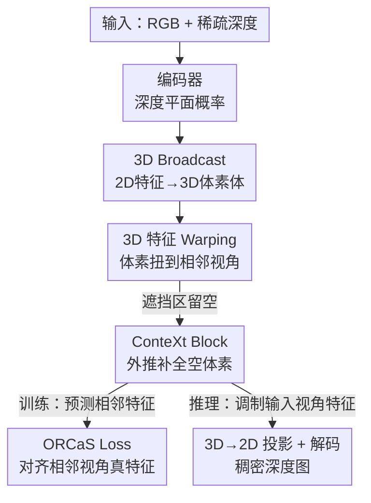

# ORCaS: Unsupervised Depth Completion via Occluded Region Completion as Supervision

**会议**: ICLR 2026  
**OpenReview**: [https://openreview.net/forum?id=v2skNLbrfF](https://openreview.net/forum?id=v2skNLbrfF)  
**代码**: 待确认  
**领域**: 3D视觉  
**关键词**: 深度补全, 无监督学习, 遮挡区域补全, 归纳偏置, Structure-from-Motion

## 一句话总结
ORCaS 让无监督深度补全模型在训练时去预测「输入视角看不见、相邻视角才可见」的遮挡区域特征，以此强迫模型学到一种关于 3D 物体形状的归纳偏置，从而在 VOID1500 / NYUv2 上平均超过此前最优方法 8.91%，并在跨数据集泛化和稀疏输入上大幅领先。

## 研究背景与动机

**领域现状**：深度补全（depth completion）的任务是给定一张 RGB 图和一组稀疏点云，输出稠密的深度图。作者指出这件事可以有两种解读：(1) 把它看成**插值**——以稀疏点为锚、用图像的颜色/纹理/边缘作正则，把深度从稀疏点扩散到稠密像素；(2) 把它看成**归纳**——用单张图重建一个尺度未知的 3D 场景，再用稀疏点校准尺度。两者看似对称，本质却不同：前者不需要"学习"，手工规则就够，但换到新场景很快饱和；后者是病态问题，必须学一个**归纳偏置**才能从单视角推出 3D 结构。

**现有痛点**：为了避开监督学习对昂贵真值的依赖，无监督方法用 Structure-from-Motion 的重建误差作训练信号——把相邻视角的像素通过刚性 warp 投回输入视角，最小化光度重建误差。但这套方案普遍只配上**通用正则**（如局部平滑）。问题在于：这些通用正则和"插值"那条路线里用的是同一类东西，于是模型最终学到的只是"用图像引导深度扩散"，并没有真正学到 3D 场景的高层抽象（物体的形状）。

**核心矛盾**：传统无监督方法用的"逆向 warp"只会把相邻视角里**可见**的点投回输入视角，**遮挡区域被直接丢弃**。也就是说，训练信号天然回避了"看不见的部分"，而恰恰是"看不见的部分"才逼着模型去理解 3D 物体本身，而不是图像表面的纹理。

**本文目标**：找到一个无法被通用正则建模的监督信号，强迫模型学到超越 2D 图像、关于 3D 场景的更强归纳偏置，进而提升输入视角深度预测的保真度。

**切入角度**：作者反其道而行——既然深度补全只需估计可见表面，为什么还要让模型去预测看不见的遮挡区域？因为预测遮挡区域会迫使模型在 3D 中（而非常规 2D 特征图上）表征观测。这带来两个好处：一旦知道物体在 3D 中的形状，赋予它度量尺度只需一个稀疏点，从而对点云密度不敏感；同时预测未见部分会促成"物体"这种更高层抽象，提升泛化。

**核心 idea**：把"补全遮挡区域"当作监督信号（Occluded Region Completion as Supervision, ORCaS）——训练时把输入视角的 3D 特征 warp 到相邻视角，让因遮挡而"空"出来的体素被一个上下文外推模块补全，并用相邻视角的真实特征作监督；推理时这个学到的偏置反过来增强输入视角的特征。

## 方法详解

### 整体框架

ORCaS 的输入和标准深度补全完全一样：一张 RGB 图 $I$ 加一组投影到像平面的稀疏深度 $z$，输出稠密深度 $\hat{d}=f(I,z)$。它的不同之处全在训练：除了像已有无监督方法那样用相邻视角重建输入视角，它还**反过来**用输入视角去预测相邻视角的特征，从而在隐空间和输出空间都拿到监督信号。

整条管线是这样转的：先把图像和稀疏深度编码成 2D 特征图，对每个像素预测一个在 $D$ 个深度平面上的概率分布，把 2D 特征"广播"成一个 3D 体素体（**3D Broadcast**）；接着用输入视角 $t$ 到相邻视角 $\tau$ 的相对位姿 $g_{\tau\leftarrow t}$ 把这个 3D 体素刚性 warp 过去（**3D 特征 Warping**），由于只覆盖两个视角的共视区域，输入视角里被遮挡的位置在相邻视角就会"留空"；这些空体素由 **ConteXt Block** 根据周边可见特征外推补全，得到预测的相邻视角特征 $\hat{F}_\tau$；最后用相邻视角自身编码出的真实特征 $F_\tau$ 去监督它（**ORCaS Loss**）。推理时只需输入视角、位姿取单位阵，warp 退化为恒等，ConteXt 学到的位置偏置被用来"调制"输入视角特征，再经 3D→2D 投影解码成深度图。

### 关键设计

**1. 3D Broadcast：把 2D 特征摊成带深度平面的 3D 体素体**

传统无监督方法停留在 2D 特征图上，无法表征遮挡区域真正的 3D 结构。ORCaS 的第一步是给每个像素位置 $x$ 估一个在 $D$ 个深度平面上的离散概率分布：对融合了图像与稀疏深度的特征向量 $h[x]\in\mathbb{R}^C$ 施加可学习变换 $\Phi(\cdot)$ 后过 softmax，$\tilde{d}[x]=\sigma(\Phi(h[x]))$。与只能产生稀疏 3D 采样的常规 2D 反投影不同，这里按概率把同一个 2D 特征"广播"到该位置所有深度平面对应的体素上，从而由单视角得到一个**完整填满**的 3D 场景表征。深度平面预先在预测范围的上下界之间均匀取 $\bar{d}$。正是这种"先摊成 3D 体"的表征，才让后面"哪里被遮挡、哪里留空"在几何上变得可定义。

**2. 3D 特征 Warping：把体素扭到相邻视角，让遮挡区暴露成可监督的空洞**

有了 3D 体素体，就可以在假设场景静止的前提下，用相对位姿把输入视角 $t$ 的 3D 特征 $F_t$ 刚性搬到相邻视角 $\tau$：

$$F_{\tau\leftarrow t}(x)=F_t(\pi' g_{t\leftarrow\tau}\bar{X}),$$

其中 $\bar{X}$ 是 3D 体素的齐次坐标，$\pi'$ 是把特征赋给最近体素的投影。关键在于：warp 后的体素只填满了两个视角的**共视区域**，那些"在 $t$ 被遮挡、在 $\tau$ 才可见"的位置就成了空体素。于是"从共视区域去重建这些空区域"自然地成为一个**额外的自监督目标**——这正是作者想要的、通用平滑正则无法提供的训练信号。

**3. ConteXt Block：用上下文池化 + 位置编码外推补全空体素**

空体素需要一个机制去"脑补"，作者为此设计了 Contextual eXtrapolation（ConteXt）块。它先做一个**上下文池化** $CP(\cdot)$：在每个 $k_u\times k_v\times k_w$ 的池化区域内，对**非空**体素做掩码平均池化，再按倍率重复上采样回原分辨率，

$$CP(F_{\tau\leftarrow t})(u,v,w)=U\!\left(\frac{\sum_{(u,v,w)\in R} M\odot F_{\tau\leftarrow t}(u,v,w)}{M(u,v,w)+\epsilon}\right),$$

其中掩码 $M(x)=\mathbb{1}\{F_{\tau\leftarrow t}(x)\neq 0\}$ 标记非空体素。池化得到的上下文描述子只被加回**原本为空**的区域：$F'_{\tau\leftarrow t}=F_{\tau\leftarrow t}+\bar{M}\odot CP(F_{\tau\leftarrow t})$（$\bar M$ 是 $M$ 的补，指示空体素位置）。为了让补全依赖体素的局部位置，再叠加一个 3D 正弦位置编码 $\phi(u,v,w)=\mathrm{concat}(PE_u,PE_v,PE_w)$，最后用线性投影 $g(\cdot)$ 把"非空区域上下文 + 位置信息 + 空位置掩码"融合，估出相邻视角特征 $\hat{F}_\tau=g(F'_{\tau\leftarrow t},\phi,\bar{M})$。这里学到的位置偏置 $\phi$ 在推理时被复用：因为输入视角的 $F'_{t\leftarrow t}$ 就等于 $F_t$，ConteXt 的偏置直接用来调制输入视角特征、增强保真度。

**4. ORCaS Loss 与交替训练：用相邻视角真特征监督归纳偏置**

无监督框架下，从输入数据自身导出的监督信号要么稀疏（稀疏深度一致性）、要么因位姿与预测误差累积而含噪（光度重建）。ORCaS 干脆用相邻视角自身编码出的**完整特征** $F_\tau$ 作监督，强制预测特征 $\hat{F}_\tau$ 与之一致：

$$\ell_{\text{ORCaS-}p}=\sum_X\sum_x\|\hat{F}_\tau[x]-\mathrm{sg}(F_\tau[x])\|_p,$$

其中 $\mathrm{sg}(\cdot)$ 是停止梯度。注意作者强调：学习遮挡补全的目的**不是**为了把相邻视角预测得多好看，而是借此逼出一个能增强输入视角预测的归纳偏置。整网以**交替**方式端到端训练——一轮优化整个网络，另一轮只优化 ConteXt（ORCaS）的参数，以此把"2D→3D 广播"和"带位姿的 3D warping"这两个独立组件经由 ORCaS loss 连接起来，真正实现"从遮挡中学习"。

### 损失函数 / 训练策略

总训练目标在传统无监督深度补全损失之上叠加 ORCaS loss。基础损失沿用光度重建项 $\mathcal P$（L1 + SSIM）、稀疏深度一致性项 $\psi$ 与边缘对齐的平滑正则 $\mathcal R$：

$$\arg\min_\theta \sum_{\tau\in T}\sum_{x\in\Omega}\lambda_I\mathcal P(\hat{I}_{t\leftarrow\tau}(x),I_t(x))+\sum_{x\in\Omega_z}\lambda_z\psi(\hat{d}_t(x),z_t(x))+\lambda_r\mathcal R(I_t,\hat{d}_t).$$

从 3D 特征解码深度时，先把每个像素位置的 3D 特征按深度平面向量化 $r[x]=\mathrm{vec}(\hat{F}_\tau[x])\in\mathbb{R}^{C\cdot D}$，再用 3D→2D 投影 $P$ 配 softmax 加权各深度平面贡献，得到 2D 特征 $\hat{F}_t$，经输出层 $o(\cdot)$ 得深度 $\hat{d}_t=o(\hat{F}_t)$。训练时同时拿到输入视角和前/后相邻视角及其相对位姿；推理时位姿取单位阵，输入要求与标准深度补全完全一致。

## 实验关键数据

### 主实验

在 VOID1500 与 NYUv2 上，ORCaS 在全部 4 个指标（MAE / RMSE / iMAE / iRMSE，越低越好）上都超过所有基线，相对当前最优 AugUndo 平均提升 8.91%。

| 数据集 | 指标 | ORCaS | AugUndo (前SOTA) | 提升 |
|--------|------|-------|------------------|------|
| VOID1500 | MAE | 30.90 | 33.32 | -7.3% |
| VOID1500 | RMSE | 80.12 | 85.67 | -6.5% |
| NYUv2 | MAE | 86.50 | 96.73 | -10.6% |
| NYUv2 | RMSE | 158.10 | 188.70 | -16.2% |

相对更早的方法提升更大：在 VOID1500 上相对 VOICED 提升 62.34%、ScaffNet 45.87%、KBNet 22.87%、DesNet 17.68%。

### 消融实验

在 VOID1500 上逐组件消融（基模型为带瓶颈 Transformer 块的 KBNet）：

| 配置 | MAE | RMSE | 说明 |
|------|-----|------|------|
| Base model | 35.31 | 91.32 | 基础网络 |
| + 2D→3D 广播 | 33.56 | 86.72 | 3D 广播单独提升约 2.79% |
| 只有 Warping | 52.60 | 125.88 | 无 ORCaS loss 的 3D warping 反而有害 |
| 广播 + Warping | 40.52 | 98.87 | 仍劣于 base，需要 loss 连接 |
| Full (含 ℓ_ORCaS) | **30.90** | **80.12** | ORCaS loss 贡献约 21.6% |

### 关键发现

- **ORCaS loss 是粘合剂**：单独的 3D warping（无 loss）会把性能拖垮（MAE 35.31→52.60），但一旦加上 ORCaS loss 反而带来约 21.6% 的增益。说明"3D 广播 + 带位姿 warping"这两个组件本身不够，必须靠 ORCaS loss 让它们真正"从遮挡中学习"。
- **深度平面数越多越好**：$D=2$ 已超过 AugUndo，$D=8$ 时 MAE 进一步降到 30.90，说明更细的深度离散有利。
- **ConteXt 池化感受野要适中**：$(k_u,k_v)=(2,2)$ 视野不足只提升 5.67%，$(4,4)$ 最佳，$(8,8)$ 过粗会过度平滑深度平面表征。
- **泛化与抗稀疏是最大亮点**：零样本从 VOID1500 迁到 NYUv2 / ScanNet 平均提升 12.1% / 19.2%；在 10× 稀疏的 VOID150（仅 150 个点、约 0.05% 像素）上相对 AugUndo 提升 31.2%，印证"学到 3D 物体形状后只需单点即可定尺度"的假设。

## 亮点与洞察
- **把"病态"当成训练信号**：传统方法极力回避遮挡这个不可解部分，ORCaS 却故意去预测看不见的区域。这个"知其不可而为之"的目标反而逼出了 2D 正则永远学不到的 3D 归纳偏置——是最让人"啊哈"的设计哲学。
- **遮挡=天然免费监督**：3D warp 后共视区填满、遮挡区留空，这个"空洞"本身就是一个无需任何额外标注的自监督目标，且无法被局部平滑等通用正则覆盖。
- **训练用双视角、推理只用单视角**：ConteXt 学到的位置偏置在推理时退化为对输入视角特征的调制，因此部署时输入要求与标准深度补全完全一致，不增加任何推理负担——这种"训练贵、推理省"的迁移很值得借鉴。
- **stop-gradient 防坍缩**：用相邻视角真特征作监督时对其停梯度，避免编码器为了凑一致性把两边特征一起带歪。

## 局限与展望
- **依赖静态场景假设**：3D warping 显式假设场景静止，动态物体或非刚性运动下，warp 的几何对应会失效，遮挡区监督可能引入噪声。
- **依赖相对位姿**：训练需要相邻视角及其相对位姿（由位姿网络估计），位姿误差会直接污染 warp 与一致性监督；文中相邻视角评估的位姿还是在测试集上微调得到的。
- **离散深度平面的粒度上限**：性能随 $D$ 增长但平面数提升带来体素体显存/计算开销，论文只测到 $D=8$，更高分辨率的代价与收益尚不清楚。
- **改进思路**：可探索把遮挡补全的思想推广到含动态物体的场景（如分层/运动补偿 warp），或用可学习的非均匀深度平面替代均匀离散以兼顾精度与开销。

## 相关工作与启发
- **vs AugUndo (Wu et al., 2024)**：AugUndo 通过启用此前不可行的光度/几何增广来提升无监督深度补全；ORCaS 换了思路，从"遮挡区域补全"这一全新监督信号入手，在同样无监督设定下平均再降 8.91%，且在稀疏输入上优势放大到 31.2%。
- **vs KBNet / Sparse-2-Depth (Wong & Soatto, 2021)**：两者都把 2D 特征反投影到 3D 空间并引入归纳偏置，但 KBNet 用近似深度做反投影、只服务可见区域；ORCaS 用深度平面概率把特征广播成完整 3D 体，并显式预测**遮挡**区域。
- **vs MPI 类方法 (Tucker & Snavely, 2020 等)**：MPI 同样把 2D 特征广播/warp 到离散 3D 平面，但目标是图像合成；ORCaS 把这种表征用作"以遮挡预测为正则"来学深度补全的归纳偏置。
- **vs 遮挡/层结构重建 (Tulsiani et al., 2018; Dhamo et al., 2019 等)**：这些工作从单图推层结构或分层深度以重建含遮挡的 3D 场景；ORCaS 不追求把相邻视角预测得多漂亮，而是把遮挡补全当作**辅助正则**，落脚点始终是输入视角的深度保真度。

## 评分
- 新颖性: ⭐⭐⭐⭐⭐ 首个把"输入视角的遮挡区域"用作无监督深度补全监督信号的工作，思路新颖且自洽。
- 实验充分度: ⭐⭐⭐⭐ 主结果 + 逐组件/深度平面/池化感受野消融 + 零样本与稀疏鲁棒性都覆盖，略缺动态场景与位姿误差的系统分析。
- 写作质量: ⭐⭐⭐⭐ 动机层层递进、公式完整，个别符号（如 $F'_{t\leftarrow t}$ 与推理调制）需结合图才好理解。
- 价值: ⭐⭐⭐⭐⭐ 在精度、跨域泛化、抗稀疏三方面同时刷新无监督深度补全 SOTA，对依赖廉价稀疏深度的机器人/AR 场景实用价值高。

<!-- RELATED:START -->

## 相关论文

- [\[ICLR 2026\] Large Depth Completion Model from Sparse Observations](large_depth_completion_model_from_sparse_observations.md)
- [\[CVPR 2025\] ProtoDepth: Unsupervised Continual Depth Completion with Prototypes](../../CVPR2025/3d_vision/protodepth_unsupervised_continual_depth_completion_with_prototypes.md)
- [\[CVPR 2026\] Zero-Shot Depth Completion with Vision-Language Model](../../CVPR2026/3d_vision/zero-shot_depth_completion_with_vision-language_model.md)
- [\[CVPR 2026\] Dense Metric Depth Completion from Sparse Direct Time-of-Flight Sensors](../../CVPR2026/3d_vision/dense_metric_depth_completion_from_sparse_direct_time-of-flight_sensors.md)
- [\[ICLR 2026\] CloDS: Visual-Only Unsupervised Cloth Dynamics Learning in Unknown Conditions](clods_visual-only_unsupervised_cloth_dynamics_learning_in_unknown_conditions.md)

<!-- RELATED:END -->
