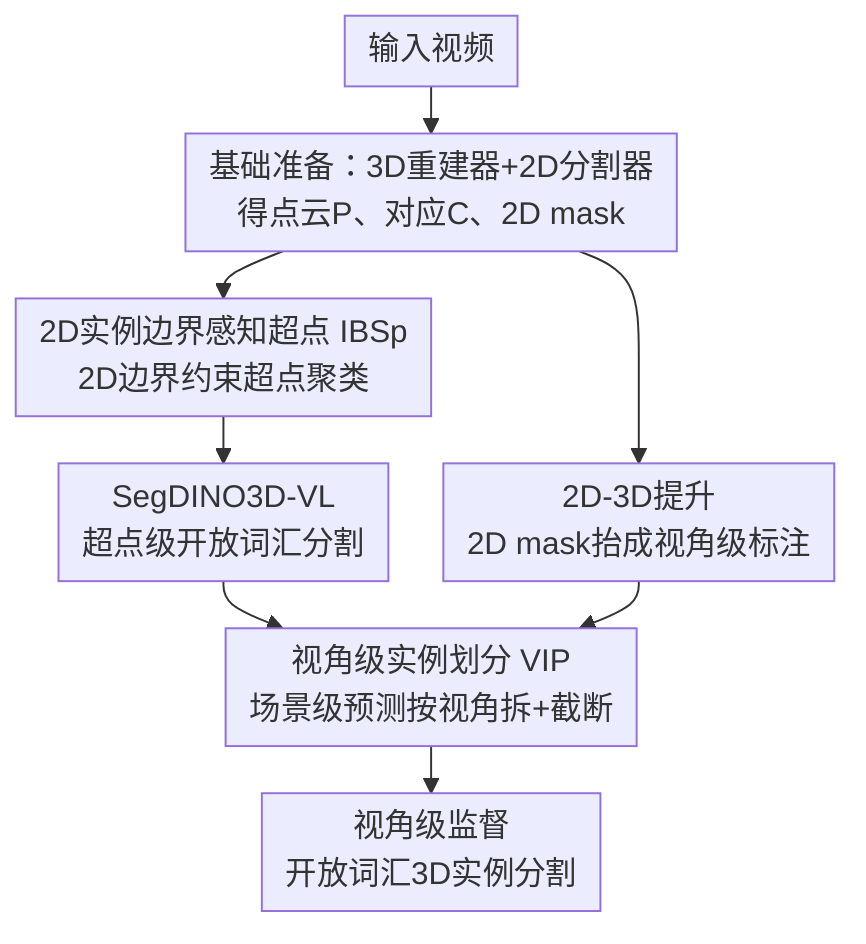

# OVSeg3R: Learn Open-vocabulary Instance Segmentation from 2D via 3D Reconstruction

**会议**: ICLR 2026  
**OpenReview**: [https://openreview.net/forum?id=rIMOXvaLAe](https://openreview.net/forum?id=rIMOXvaLAe)  
**代码**: 待确认  
**领域**: 3D视觉 / 开放词汇分割  
**关键词**: 开放词汇3D实例分割, 3D重建, 2D到3D提升, 视角级监督, 超点

## 一句话总结
OVSeg3R 是一套训练方案：直接拿 2D 视频经 3D 重建得到的点云当输入，把开放词汇 2D 实例分割结果借助重建提供的 2D-3D 对应关系投影到 3D 当标注，再用「视角级实例划分」(VIP) 和「2D 实例边界感知超点」(IBSp) 稳住训练，把一个闭集 SOTA 3D 分割器扩成开放词汇模型，在 ScanNet200 上整体 +2.3 mAP、新类 +7.7 mAP。

## 研究背景与动机

**领域现状**：机器人操作、导航、AR 等下游任务都需要带实例级身份和位置的 3D 感知，因此 3D 实例分割及其开放词汇泛化越来越受关注。2D 分割的开放词汇能力已经相当成熟，而 3D 这边却远远落后。

**现有痛点**：根因在于 3D 标注太贵。虽然现代 3D 重建技术已经把"采集 3D 场景"的成本压得很低，但"标注 3D mask"依然昂贵。绕过标注的两条主流路线都不理想：(1) OpenMask3D 一类先用 3D 模型产类无关 mask、再投回 2D 用基础模型查类别——只有"分类"能力是开放词汇的，受限于 3D 数据稀缺，对训练时没见过的物体往往直接漏检；(2) SAM3D 一类把每帧 2D 分割结果逐帧提升到 3D、再用手工启发式规则把同一实例的 mask 合并——合并规则是 rule-based、不泛化，实际场景里大量 corner case 处理不了，整体脆弱。

**核心矛盾**：这两类方法都"过度依赖 2D 输出",把 3D 当成 2D 结果的搬运/拼接工具，native 的 3D 感知能力始终没被真正训练起来；而要训练 3D 感知又卡在 3D 标注稀缺上。还有些蒸馏方法要专门训练 3D Gaussian 来建立 2D-3D 对应、需要逐场景优化或高质量点云初始化，既冗余又不实用。

**本文目标**：在不引入额外模型容量、推理时不完全依赖 2D 输出的前提下，端到端地训练一个真正具备 3D 感知能力的开放词汇 3D 实例分割模型。

**切入角度**：3D 重建本身就天然提供了 2D 像素↔3D 点的对应关系——既然如此，输入直接用重建出来的点云（顺便引入符合真实手持采集的噪声），标注直接把开放词汇 2D mask 沿对应关系"抬"到 3D，两个昂贵环节（采场景、标 mask）就都被免费的现成模型替代了。

**核心 idea**：用"3D 重建 + 现成开放词汇 2D 分割器"自动造训练数据和监督信号去训练一个标准 3D 分割器，而不是在推理时拼接 2D 结果；并针对"2D 抬到 3D 只有部分标注"和"重建过度平滑"两个副作用，分别设计 VIP 和 IBSp 把训练稳住。

## 方法详解

### 整体框架
OVSeg3R 以最新的闭集 SOTA 模型 SegDINO3D 为骨架，把它的分类头从固定类别头换成"物体特征 vs 文本特征"的相似度匹配，得到支持开放词汇的 SegDINO3D-VL；OVSeg3R 本身是给它喂数据和监督的训练方案。整条流水线分四步串起来：先**基础数据准备**——把一段视频同时丢给 3D 重建器 (默认 MASt3R-SLAM) 和开放词汇 2D 分割器 (默认 DINO-X)，前者输出点云 $P$ 和 2D-3D 对应记录 $C$，后者输出每视角 2D 实例 mask $M^{2D}$、类别名串 $s$ 以及图像级/物体级 2D 特征；接着**输入与视角级标注构造**——按 $C$ 给每个 3D 点采样 2D 特征、用 IBSp 把点聚成超点、把 2D mask 沿 $C$ 抬到 3D 得到每视角的部分标注；然后 SegDINO3D-VL 在超点级别**产出场景级实例预测**；最后 **VIP 把场景级预测按视角拆开**，用各视角自己的部分标注做监督。整个方案的两处关键创新都在"让 2D 来的脏标注/过度平滑几何不至于把训练带崩"上。

### 关键设计

**1. 用 3D 重建 + 2D 分割自动造数据与监督，免标注训练原生 3D 分割器**

这一招针对的是"3D 标注太贵导致开放词汇 3D 感知练不起来"的根本痛点。OVSeg3R 不再要求人工调过的高质量点云和人工 3D mask，而是把一段普通视频 $I \in \mathbb{R}^{V\times H\times W\times 3}$ 直接喂给重建器得到点云 $P \in \mathbb{R}^{N\times 3}$ 以及双向的 2D-3D 对应 $C: i \leftrightarrow (v,x,y)$（点索引 $i$ ↔ 视角 $v$ 和归一化像素坐标）。标注侧不再人工画 3D mask，而是用开放词汇 2D 分割器对每帧出 mask $M^{2D}$，再按 $C$ 把每个像素的实例标号"抬"到对应 3D 点，得到视角级 3D 实例 mask $m^{3D}$。为了沿用 SegDINO3D 的强表征，还给每个 3D 点按 $C$ 直接采样 2D 图像级特征 $F^{2D}_i \Leftarrow \mathrm{Bilinear}(X_{v_i}, (x_i,y_i))$——因为有现成的 $C$，省去了 SegDINO3D 把每个点重投到所有视角找代表视角的开销。这样做的好处是双重的：成本从"买深度相机+人工标注"降到"现成模型自动跑"，同时重建点云天然带噪声，反而和真实手持采集的低质量输入对齐；而且模型推理时是个标准 3D 分割器，不像 SAM3D 那样必须在线拼 2D 结果。

**2. 视角级实例划分 VIP：把场景级预测拆回各视角，消除部分标注带来的假阳惩罚**

2D 抬到 3D 的标注有个硬伤：不同视角的 2D mask 即使对应同一物体也是各自独立估计、没有跨视角关联，直接拼成场景级标注会产生大量重复标注；而每个视角只覆盖点云的一部分，若用某视角的部分标注去监督模型的场景级预测，落在该视角之外的正确预测会被错当成假阳性狠狠惩罚，训练直接抖崩。VIP 的洞察来自解码器机制：物体 query 由超点初始化、且每层 cross-attention 被上一层 mask 预测掩码，整个多层解码器等价于一种迭代软聚类，某 query 解出的 mask 通常就对应"包含它那个超点的实体"。于是 VIP 显式地把 query 指派到它超点所属的视角，并把它的场景级 mask **截断**到只保留该视角可见的区域，得到视角级预测去和该视角的部分标注配对。实现上先由点的视角归属 $V^{p}_v$ 经超点 mask 聚成超点视角归属 $V^{sp}_v \Leftarrow M^{sp}V^p_v > 0$，再切片得到 query 的视角归属 $V^q_v$，最后 $\tilde m^{3D}_v \Leftarrow \tilde M^{3D}[V^q_v, V^{sp}_v]$ 取出第 $v$ 视角内可见的预测。作者坦言这个指派没有数学保证一定指到最合适的视角，但实践上高度可靠，能有效降低引入假阳性的风险。VIP 还兼容标准场景级监督：有完整标注的数据集可直接监督场景级预测，从而把昂贵的人工标注数据和只有原始视频的数据混合训练。

**3. 2D 实例边界感知超点 IBSp：用 2D mask 约束超点聚类，救回几何不显著的物体**

主流 3D 分割为省算力先把点云过分割成超点、再在超点级别做实例分割，超点用 Felzenszwalb 这类基于几何连续性的图分割算法构造——给每点连 KNN 边，几何连续的相邻点聚到同一超点。但重建结果往往过度平滑，实例边界处几何区分度不足，各向同性 KNN 不可避免地在"几何连续却属于不同实例"的点之间连边，结果像画、墙上插座、地毯这类**几何不显著**的物体会被并进覆盖大平面（如墙）的超点里，之后再也分不出来。IBSp 的做法很直接：在为每点找到 KNN 后，把每条边的两个端点按 $C$ 投影回 2D、读出它们在 $M^{2D}$ 里的实例标号 $o_i, o_j$，**只有当 $o_i = o_j$ 时才保留这条边**，否则剪断。这样不同实例的点被分进不连通的子图，后续 Felzenszwalb 聚类就跨不过实例边界，至少给那些几何不显著的物体保住一个超点，让它们有机会被分割出来。它的代价小、却恰好补上了几何-only 超点在重建数据上的盲区。

### 损失函数 / 训练策略
模型在超点级别做匹配与监督：点级特征 $F^{3D}$ 先按超点 mask 池化为超点特征 $S^{3D} \Leftarrow M^{sp}F^{3D}/\mathrm{Sum}(M^{sp},1)$，选 $q$ 个超点作初始 query 送入多层 Transformer 解码器（依次 cross-attend 超点特征与 2D 物体特征、再自注意力+FFN），最终 mask 由 query 与超点特征相似度阈值化 $\tilde M^{3D} \Leftarrow QS^{3D\top} > \tau$ 得到、类别由 $\tilde C \Leftarrow \arg\max(QT^\top,1)$ 与文本特征相似度得到。文本侧把检测到的类名 $s$ 随机补满负类到固定长度 $T$ 拼成串、用 CLIP 文本编码器编码成 $T \in \mathbb{R}^{T\times C}$ 做对比式分类。对场景级监督，沿用超点-GT 关系做稀疏匹配（query 初始化超点落在某 GT mask 内才能匹配），强化超点初始化与最终 mask 的关联、巩固 VIP 的可靠性。Benchmark 实验同时用 MASt3R-SLAM 和 VGGT 两套重建数据，消融默认只用前者。

## 实验关键数据

### 主实验
数据集为 ScanNetv2 / ScanNet200（1201 训练 / 312 验证），分别用 MASt3R-SLAM、VGGT 重建得到 ScanNet3R-MSLAM、ScanNet3R-VGGT，并用 DINO-X 自动产视角级开放词汇标注。

ScanNet200 open setting（mAP）：

| 方法 | All | Head | Tail | 类型 |
|------|-----|------|------|------|
| SegDINO3D | 39.8 | 46.0 | 36.2 | 闭集 SOTA |
| SegDINO3D-VL（仅 ScanNet200） | 38.4 | 45.3 | 34.0 | 加 VL 头反掉点 |
| SAM3D | 9.8 | 9.2 | 12.3 | 开放词汇 |
| Open3DIS | 23.7 | 27.8 | 21.8 | 开放词汇 |
| Any3DIS | 25.8 | 27.4 | 26.4 | 开放词汇 |
| **OVSeg3R (Ours)** | **40.7** | 44.6 | **42.7** | 开放词汇 |

OVSeg3R 整体 +2.3 mAP（相对仅 ScanNet200 的 SegDINO3D-VL），尾类暴涨 +8.7 mAP，把头-尾类差距从 -11.3 mAP 收窄到 -1.9 mAP，且超过所有闭集方法。standard setting（只用 ScanNetv2 20 类监督、评 200 类）：

| 方法 | mAP | mAP_novel | mAP_base |
|------|-----|-----------|----------|
| OpenMask3D | 12.6 | 11.9 | 14.3 |
| Open3DIS | 19.0 | 16.5 | 25.8 |
| **OVSeg3R (Ours)** | **24.6** | **24.2** | 25.8 |

SOTA 主要来自新类泛化（novel +7.7 mAP），base 类几乎持平（约 +0.0），说明增益确实来自开放词汇能力而非基类调参。

### 消融实验

| 配置 | mAP | mAP_novel | 说明 |
|------|-----|-----------|------|
| Full (VIP+IBSp, S.3R-M 100%) | 23.9 | 23.0 | 完整模型 |
| w/o VIP | 18.4 | 16.2 | 去 VIP 引入大量假阳，掉 -5.5 |
| w/o IBSp（几何-only 超点） | 23.6 | 22.0 | 掉幅较小但 novel -1.0 |
| 重建数据 10% | 16.8 | 14.8 | 数据减少明显掉点 |
| 重建数据 1% | 7.0 | 3.3 | 进一步崩 |
| 重建数据 0% | 5.0 | 4e-4 | 退化为传统方案，新类近乎为零 |
| VIP+IBSp + S.3R-M&V 100% | 24.6 | 24.2 | 双重建器当数据增广 |

### 关键发现
- VIP 是稳训练的第一功臣：去掉它 mAP 掉 5.5、novel 掉 6.8，假阳性泛滥；IBSp 在精修过的评测点云上掉幅小，但作者强调在"视频重建而非人工精修"的真实场景里 IBSp 才是几何不显著物体能被分出的关键。
- 开放词汇监督量直接决定新类能力：0% 重建数据时退化成传统方案，novel mAP 近乎 0；这正面证明增益来自 OVSeg3R 喂进来的开放词汇监督。
- 两个不同重建器（MASt3R-SLAM + VGGT）即便重建自同一批场景、共享同一套 2D 标注，混用仍能再涨点（24.6 vs 23.9），说明不同重建器产生的点云可当作一种输入数据增广。

## 亮点与洞察
- 把"3D 重建天然提供 2D-3D 对应"这件事吃干榨净：既用它免费造标注、又用它给点采 2D 特征、还用它给超点剪边，一个对应关系 $C$ 串起了数据、监督、超点三处，不像蒸馏法还要另训 3D Gaussian 建对应。
- VIP 的"截断式视角监督"是处理弱/部分标注的好范式：当监督只覆盖局部时，不要硬拿它惩罚全局预测，而是把全局预测也截到同一可见范围再配对，思路可迁到任何"2D 弱标注监督 3D/全景预测"的场景。
- IBSp 用一行"$o_i=o_j$ 才连边"的判据把 2D 语义边界注入纯几何的超点构造，几乎零成本却补上了过度平滑重建的致命盲区，是个很可复用的小 trick。

## 局限与展望
- 作者自己承认 VIP 的视角指派"没有数学保证"一定指到最合适视角，只是实践可靠；极端 corner case 下的失配未深入分析。
- 强依赖现成 2D 开放词汇分割器（DINO-X）的质量：2D mask 漏检或边界错误会直接污染 3D 标注和 IBSp 剪边，整套方案的上限被 2D 模型钉死。
- 实验只在 ScanNet 系室内场景验证，室外/大尺度/动态场景未测；新类提升虽显著，但 base 类几乎不动，说明该方案主要扩"覆盖面"而非提"已知类精度"。
- IBSp 在精修评测集上贡献小，真正价值要靠真实视频重建场景体现，但论文对真实 in-the-wild 数据多为定性可视化，缺定量。

## 相关工作与启发
- **vs OpenMask3D 类**：它们先出类无关 3D mask 再投 2D 查类别，只有分类是开放词汇的、受 3D 数据稀缺限制对未见物体常漏检；OVSeg3R 直接训练 3D 分割器本身具备开放词汇检测+分割能力，新类 mAP 大幅领先（24.2 vs ~11.9）。
- **vs SAM3D 类**：它们逐帧把 2D 结果提升再用手工启发式合并，规则脆弱不泛化；OVSeg3R 把 2D 只当训练期的监督来源，推理时是端到端原生 3D 模型，避免了在线合并的 corner case。
- **vs SegDINO3D（baseline）**：把固定分类头换成文本相似度匹配得 SegDINO3D-VL，并用 OVSeg3R 方案喂开放词汇数据；值得注意的是仅加 VL 头但只用 ScanNet200 训练反而掉点（38.4 vs 39.8），增益完全来自 OVSeg3R 引入的开放词汇监督数据。

## 评分
- 新颖性: ⭐⭐⭐⭐ 把 3D 重建从"采数据工具"升级为"造监督+建对应+剪超点"的核心枢纽，VIP/IBSp 两个针对性设计扎实。
- 实验充分度: ⭐⭐⭐⭐ open/standard 双设置 + 头尾类拆分 + 数据量梯度消融，证据链完整；但仅限 ScanNet 室内、真实场景多为定性。
- 写作质量: ⭐⭐⭐⭐ 动机推导清晰、符号定义到位，VIP 机制解释充分；公式略密。
- 价值: ⭐⭐⭐⭐ 给"低成本训练开放词汇 3D 分割"提供了实用范式，对机器人/AR 落地有直接意义。

<!-- RELATED:START -->

## 相关论文

- [\[AAAI 2026\] Retrieving Objects from 3D Scenes with Box-Guided Open-Vocabulary Instance Segmentation](../../AAAI2026/3d_vision/retrieving_objects_from_3d_scenes_with_box-guided_open-vocabulary_instance_segme.md)
- [\[ICLR 2026\] GeoPurify: A Data-Efficient Geometric Distillation Framework for Open-Vocabulary 3D Segmentation](geopurify_a_data-efficient_geometric_distillation_framework_for_open-vocabulary_.md)
- [\[CVPR 2026\] OVI-MAP: Open-Vocabulary Instance-Semantic Mapping](../../CVPR2026/3d_vision/ovi-map_open-vocabulary_instance-semantic_mapping.md)
- [\[CVPR 2026\] Ov3R: Open-Vocabulary Semantic 3D Reconstruction from RGB Videos](../../CVPR2026/3d_vision/ov3r_open-vocabulary_semantic_3d_reconstruction_from_rgb_videos.md)
- [\[ICCV 2025\] CutS3D: Cutting Semantics in 3D for 2D Unsupervised Instance Segmentation](../../ICCV2025/3d_vision/cuts3d_cutting_semantics_in_3d_for_2d_unsupervised_instance_segmentation.md)

<!-- RELATED:END -->
