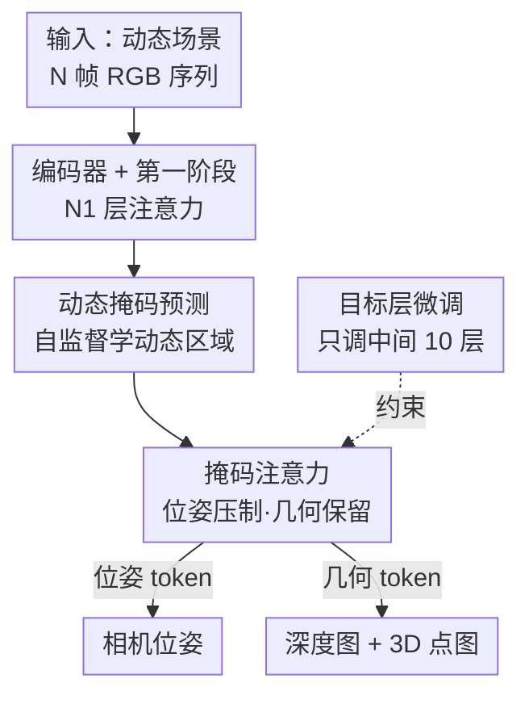

# PAGE-4D: VGGT-4D Perception via Disentangled Pose and Geometry Estimation

**会议**: ICLR 2026  
**OpenReview**: [https://openreview.net/forum?id=Nfmzp5PBzr](https://openreview.net/forum?id=Nfmzp5PBzr)  
**代码**: 待确认（论文称提供 necessary code 与 demo）  
**领域**: 3D视觉 / 4D感知  
**关键词**: 动态场景重建, VGGT, 相机位姿估计, 动态感知掩码, 前馈3D模型

## 一句话总结
PAGE-4D 给前馈式 3D 基础模型 VGGT 接上一个「动态感知聚合器」，用一张自监督学出来的动态掩码把运动信息按任务拆开——估位姿时压制它、重几何时放大它——只微调中间 10 层就让 VGGT 在动态场景的位姿、深度和点云重建上全面超过原版。

## 研究背景与动机
**领域现状**：从一组图像前馈式地推断 3D 属性（深度、点云、相机位姿）近年进展很快，DUSt3R 用 Transformer 直接把 2D 像素映射到 3D 坐标场，VGGT 进一步用「帧内注意力 + 跨帧全局注意力」交替的统一架构，一次前向就联合输出相机位姿、深度图和点对应。但这些模型都建立在「所有视角看的是同一个静态场景」这一时间不变假设上。

**现有痛点**：真实世界里到处是运动的人、变形的伞、行驶的车。一旦场景动起来，VGGT 精度急剧下降——论文在 Odyssey 测试集上直接评测发现，动态区域的绝对深度误差比静态区域高出 94%。可视化 VGGT 各层注意力（第 5/12/18/24 层）也证实：网络在前馈过程中倾向于**忽略**动态内容，动态区域激活明显偏弱。

**核心矛盾**：处理动态场景有个根本性的张力。一方面，运动会破坏静态对极几何约束（epipolar constraint），给相机位姿估计引入噪声——因为本质矩阵拟合假设的是刚性场景；另一方面，运动线索恰恰是重建动态物体几何所必需的。换句话说，**同一批信号，对几何有益、对位姿有害**。作者还做了个消融：显式压制动态 token 之间的注意力，位姿确实变准了，但几何却急剧变差，正好印证这个 trade-off。

**本文目标**：在不大改架构、不依赖大规模带 GT 几何的动态数据集的前提下，让一个预训练的静态 3D 基础模型同时把动态场景的位姿、深度、点云都做好。

**切入角度**：与其把「动态」一刀切地当成有害或有益，不如**按任务把它的作用解耦**——这是本文的核心观察。

**核心 idea**：引入一个动态感知聚合器，先预测一张动态掩码标出运动区域，再通过注意力机制在位姿 token 上滤掉动态内容、在几何 token 上保留动态内容，配合只微调对动态最敏感的中间层，把 VGGT 平滑迁移到动态场景。

## 方法详解

### 整体框架
PAGE-4D 沿用 VGGT 的四大件——DINO 风格的图像编码器、轻量深度/点云解码器、较大的相机位姿解码头——只把中间的「聚合器（aggregator）」从原来的「帧注意力 + 全局注意力」交替结构，扩展成一个**三阶段、带动态感知的聚合器**。输入是动态场景下的 $N$ 帧 RGB 序列 $\{I_i\}_{i=1}^N$，输出是每帧的相机参数 $g_i \in \mathbb{R}^9$、深度图 $D_i$ 和 3D 点图 $P_i$，全程前馈、无需后处理。

三阶段的串法是：第一阶段 $N_1$ 层（每层一个 Global Attention + 一个 Frame Attention）先正常融合时空信息；其输出送进**动态掩码预测模块**产生一张动态感知掩码 $\tilde M$；第二阶段 $N_2$ 层把普通全局注意力换成**动态感知全局注意力（Dynamics-Aware Global Attention）**，用这张掩码把位姿与几何解耦；第三阶段 $N_3$ 层结构同第一阶段。微调时只动中间这批层（约 10 层、占 30% 参数），其余冻结。

### 关键设计

**1. 动态掩码预测：自监督地标出"哪里在动"**

动态场景的核心难点是要在没有运动标注的情况下，知道哪些空间区域属于运动物体，从而对位姿任务把它们压下去、对几何任务把它们留下来。PAGE-4D 设计了一个动态掩码预测模块，以**自监督**方式学这件事——之所以可行，是因为前面分析发现 PAGE-4D 的中间层本身就已经把动静内容分开表示了（动态区域被区别对待），掩码模块只是把这种隐式区分显式读出来。具体地，从聚合器输出的 token 特征 $z \in \mathbb{R}^{B\times S\times P\times d}$ 中只取 patch token $z_p$，先用线性层投到低维，再过一个深度可分离卷积头产生掩码 logits $m = \mathrm{Conv}(z_p)$。整个掩码完全可微，模型据此自适应训练数据里的运动模式，而不依赖任何预设的启发式规则。

**2. 掩码注意力：同一张掩码，对位姿和几何反向使用**

有了动态掩码 $\tilde M$，把它直接加进注意力 logits 里即可：

$$\mathrm{Attn}(Q,K,V) = \mathrm{softmax}\!\left(\frac{QK^\top}{\sqrt{d}} + \tilde M\right)V$$

关键在于**按任务非对称地用这张掩码**。对相机 token 和 register token（位姿相关的 query），$\tilde M$ 主动**压制**对动态区域的注意力，让位姿估计回归到对极几何和静态场景约束上；对深度、点云相关的 patch，掩码**不施加**，让网络放手利用动态运动线索去改善点图重建和 2D–3D 跟踪。这种「同一物理量、两个任务里作用相反」的设计，正是把前面发现的 trade-off 拆开的关键——动态物体在位姿语境里被忽略，但它的运动信号在几何语境里仍然可用。这背后的几何动机很硬：静态时像素对应由 $x_t = K(R_{t\leftarrow r}D_r(x_r)K^{-1}x_r + t_{t\leftarrow r})$ 完全决定、位姿可由本质矩阵 $\tilde x_t^\top E \tilde x_r = 0$ 拟合；动态时几何方程要补一项运动位移 $KM_{t\leftarrow r}$，而本质矩阵约束只对静态像素子集成立，残差 $\delta(x_r)$ 正比于运动垂直于对极线的分量，残差越大位姿误差越大——所以位姿必须躲开动态、几何必须吃进动态。

**3. 显存高效的掩码实现：用两个向量代替 N×N 掩码**

公式里那张 $\tilde M$ 是 $(S\cdot P)^2$ 的完整矩阵，直接构造要 $O(N^2)$ 显存，还会破坏融合版的 Scaled Dot-Product Attention（SDPA）。PAGE-4D 用一个等价的**加性掩码**绕开：掩码头只预测两个向量 $r\in\mathbb{R}^N$、$c\in\mathbb{R}^N$，把它们拼到特征维度上——$q'_i = [q_i\sqrt{d'/d},\, r_i\sqrt{d'}]$、$k'_j = [k_j,\, c_j]$、$v'_j = [v_j,\, 0]$，其中 $d'=d+1$。于是 $\frac{q'_i k'^\top_j}{\sqrt{d'}} = \frac{q_i^\top k_j}{\sqrt{d}} + r_i c_j$，无需显式构造 $N\times N$ 矩阵就实现了等效掩码，只占 $O(N)$ 显存且仍兼容融合 SDPA。这让动态掩码近乎零成本地插进 VGGT，是论文强调「插件式、运行时与存储开销可忽略」的技术基础。

**4. 目标层微调：只调对动态最敏感的中间层**

迁移到动态场景不必全量微调。论文依据 Transformer 表示的研究——低层捕捉局部结构、中层建模区域关系、高层编码全局语义——并结合 Fig.2(b) 观察到「正是 VGGT 的中间层在压制动态内容」，于是只更新中间约 10 层（占全网 30% 参数），冻结其余聚合器和解码器层，目的是把动态信息**重新注入**前馈过程。消融进一步显示中后段的中间层对几何估计贡献最大。这一策略既缓解了动态标注数据稀缺的问题（要学的参数少），又让方法保持轻量、可作为 VGGT 的即插即用扩展。

### 损失函数 / 训练策略
采用多任务损失 $L = \lambda_c L_{\text{camera}} + L_{\text{depth}} + L_{\text{pmap}}$，沿用 VGGT 的经验权重以平衡各任务梯度，取 $\lambda_c = 5$：相机位姿用 Huber 损失，深度与点图用带梯度正则的不确定性加权损失。模型不含点跟踪头——因为 VGGT 的跟踪头主要为视角配准设计、不适合动态场景，且 VGGT 未给出清晰的跟踪头训练代码。

## 实验关键数据

在单目视频序列上评测 5 个任务：视频深度、单目深度、相机位姿、多视点云重建、4D 新视图合成。基线包括 DUSt3R、MASt3R、MonST3R、CUT3R、Fast3R、FLARE、VGGT，主干和参数量与 VGGT 持平（1.26B），FPS 也持平（43.2，A800/KITTI），印证「插件式、开销可忽略」。

### 主实验

视频深度估计（Sintel / Bonn / DyCheck，scale&shift 对齐，对比最强基线 VGGT）：

| 数据集 | 指标 | VGGT | PAGE-4D | 提升 |
|--------|------|------|---------|------|
| Sintel | Abs Rel ↓ | 0.261 | 0.212 | −18.8% |
| Sintel | δ<1.25 ↑ | 0.639 | 0.763 | +19.4% |
| Bonn | Abs Rel ↓ | 0.102 | 0.090 | 更优 |
| DyCheck | δ<1.25 ↑ | 0.792 | 0.854 | 更优 |

相机位姿估计（Sintel / Tum）与点云重建（DyCheck）：

| 任务/数据集 | 指标 | VGGT | PAGE-4D |
|--------|------|------|---------|
| 位姿 Sintel | ATE ↓ | 0.214 | 0.178 |
| 位姿 Sintel | RPErot ↓ | 0.643 | 0.547 |
| 位姿 Tum | ATE ↓ | 0.028 | 0.016 |
| 点云 DyCheck | Acc 均值 ↓ | 1.051 | 0.403 |
| 点云 DyCheck | Acc 中位 ↓ | 1.016 | 0.284 |

点云重建提升最为剧烈：相比 VGGT 点头输出，Accuracy 均值误差降低 60% 以上、中位误差降低 70% 以上，Completion 也降 20% 以上。单目深度（Sintel）同样把 Abs Rel 从 0.292 降到 0.242、δ<1.25 从 0.629 升到 0.742，说明从视频迁移到单图也能泛化。4D 新视图合成上，用 PAGE-4D 点云作 4D-GS 初始化，在 Nerfie 上平均 PSNR 17.593 优于 VGGT 的 16.861。

### 消融实验

| 变体 | Sintel Abs Rel ↓ | Sintel δ<1.25 ↑ |
|------|------|------|
| VGGT*（全模型微调） | 0.405 | 0.593 |
| VGGT*（仅中间层） | 0.409 | 0.590 |
| Ours（中间层 + 掩码注意力） | 0.357 | 0.699 |

两点结论：① 只微调中间层与全量微调效果相当，说明中间层确实承载了最关键的跨帧信息；② 在「仅中间层」基础上加上动态感知聚合器（掩码注意力）带来显著跃升，证明真正解锁主干潜力的是**位姿/几何的显式解耦**，而非简单多调几层。

## 亮点与洞察
- 把「动态对位姿有害、对几何有益」的张力量化成对极几何残差 $\delta(x_r)\propto$ 运动垂直分量，从几何第一性原理给出了「为什么要解耦」的依据，而不是凭直觉。
- 同一张自监督掩码、在两个任务里反向使用（压制 vs 放大），是个很简洁的解耦手段；自监督而非依赖运动分割标注，绕开了动态 GT 数据稀缺的问题。
- 用两个向量 + 拼接特征维实现等效加性掩码，把 $O(N^2)$ 降到 $O(N)$ 并保持 SDPA 融合，是让「插件式、零额外开销」成立的工程关键。
- 只调 30% 参数（中间 10 层）就拿到全面 SOTA，验证了「定位最敏感层再迁移」比全量微调更高效。

## 局限性 / 可改进方向
- 不含点跟踪头：受限于 VGGT 跟踪头本身不适配动态场景、且缺乏清晰训练代码，PAGE-4D 放弃了点跟踪能力，4D 感知拼图并不完整。
- 依赖 VGGT 主干：方法是对预训练 VGGT 的适配，性能上限与失效模式都继承自 VGGT，对 VGGT 本身缺乏覆盖的场景帮助有限。
- 掩码完全自监督、由训练数据运动模式驱动，论文未充分讨论分布外（极端运动、强变形）下掩码失准时位姿/几何如何退化。
- 4D 渲染是把点云作为下游 4D-GS 的初始化来间接评测，PAGE-4D 自身并不直接产出渲染，端到端动态渲染仍是开放问题。

## 相关工作与启发
本文处在「3D 前馈模型 → 4D 前馈模型」的演化线上。3D 侧以 DUSt3R 为代表，用 Transformer 直接回归 3D 坐标场，VGGT 进一步用交替注意力统一位姿/深度/点对应，但都假设时间不变、难处理动态。4D 侧的两类做法各有短板：一类是 DUSt3R 衍生（MonST3R 在视频上微调、D!USt3R 引入 4D 点图与跨帧注意力、Easi3R 免训练），但都被 DUSt3R 的成对处理框架束缚；另一类用任务专用架构（如 MoVieS、StreamVGGT）但牺牲了前馈方法的通用性。PAGE-4D 的立场是：无需大改架构，靠**精准定位并微调关键注意力组件**，就能弥合静态—动态的鸿沟，为「把静态基础模型平移到动态域」提供了一条轻量范式。

<!-- RELATED:START -->

## 相关论文

- [\[CVPR 2026\] VGGT-360: Geometry-Consistent Zero-Shot Panoramic Depth Estimation](../../CVPR2026/3d_vision/vggt-360_geometry-consistent_zero-shot_panoramic_depth_estimation.md)
- [\[ICLR 2026\] UFO-4D: Unposed Feedforward 4D Reconstruction from Two Images](ufo-4d_unposed_feedforward_4d_reconstruction_from_two_images.md)
- [\[CVPR 2026\] ConsisVLA-4D: Advancing Spatiotemporal Consistency in Efficient 3D-Perception and 4D-Reasoning for Robotic Manipulation](../../CVPR2026/3d_vision/consisvla-4d_advancing_spatiotemporal_consistency_in_efficient_3d-perception_and.md)
- [\[ICLR 2026\] Implicit 4D Gaussian Splatting for Fast Motion with Large Inter-Frame Displacements](implicit_4d_gaussian_splatting_for_fast_motion_with_large_inter-frame_displaceme.md)
- [\[CVPR 2026\] Velox: Learning Representations of 4D Geometry and Appearance](../../CVPR2026/3d_vision/velox_learning_representations_of_4d_geometry_and_appearance.md)

<!-- RELATED:END -->
