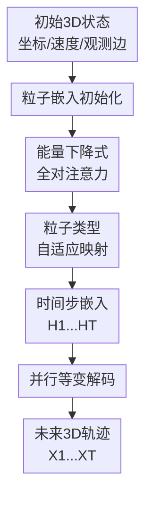

# PAINET: A Principled Efficient Transformer for 3D Dynamics Modeling

**会议**: ICLR 2026  
**OpenReview**: [https://openreview.net/forum?id=haQ0QIor4J](https://openreview.net/forum?id=haQ0QIor4J)  
**代码**: https://github.com/Icarus1411/PAINET  
**领域**: 3D视觉 / 3D动力学建模  
**关键词**: 3D动力学、SE(3)等变、全对交互、物理启发注意力、多体系统  

## 一句话总结
PAINET 将 3D 多体系统中未观测的长程全对交互写成一个能量最小化问题，并由此推导出带粒子类型自适应映射的等变 Transformer 编码器，再用并行 EGNN 解码未来轨迹，在人体动作、小分子、大分子和蛋白动力学上以接近同级的计算成本取得更低预测误差。

## 研究背景与动机
**领域现状**：3D 动力学建模要预测一组粒子、关节或原子的未来空间位置，典型输入包括初始坐标 $X^{(0)}$、速度 $V^{(0)}$、节点特征和可观测边。近年的主流深度方法多把系统建成图：粒子是节点，观测到的键、邻接关系或几何 cutoff 是边，再用 EGNN、EGNO、HEGNN、GF-NODE 等等变 GNN 传播信息。这样做的好处是结构清楚，且 SE(3) 等变性可以保证模型对旋转、平移、置换不敏感，从而更符合物理系统。

**现有痛点**：问题在于，图上的边通常只是“观测结构”或人为构造的近邻结构，并不等于真实动力学中的全部相互作用。在分子系统里，短程键合相互作用很强，但范德华、电荷等长程作用也会影响长期轨迹；在蛋白折叠或晶体形成中，当前可见结构只是一个瞬时快照，后续会自发形成新的隐式结构；在人体动作中，关节的几何骨架也不能完全解释远端关节之间的协同。若模型只沿已有边传消息，就容易忽略这些未观测的全对关系，短期看是小偏差，滚动到长时程就会积累成明显轨迹漂移。

**核心矛盾**：最直接的办法是让任意粒子对都交互，但这又引出两个困难。第一，任意粒子对的潜在结构搜索空间随粒子数快速膨胀，如果没有物理或数学约束，注意力很容易学到伪相关。第二，3D 动力学预测必须保留 SE(3) 等变性，不能为了做全局 attention 就把坐标系依赖的特征粗暴喂给普通 Transformer。

**本文目标**：作者希望同时解决三个子问题：一是给“未观测全对交互”一个可解释的形式化目标，而不是只凭经验堆 attention；二是在模型内部捕获长程、粒子类型相关的 pairwise 依赖；三是在预测未来多个时间步时保持等变性和推理效率。

**切入角度**：PAINET 的关键观察是，可以不直接枚举潜在边，而是让粒子嵌入在一个能量函数下逐步变得“内部一致”。如果两个粒子在隐空间中应该相关，它们的嵌入距离会被能量项拉近；如果差异很大，凹的 pairwise penalty 又能避免过度平滑。这个思路把隐式结构学习转成了能量下降轨迹，也自然导出一种注意力更新。

**核心 idea**：用能量最小化推导全对注意力，再用粒子类型自适应映射和并行等变解码器，把未观测长程交互接入 3D 动力学预测，同时守住 SE(3) 等变性与推理效率。

## 方法详解

### 整体框架
PAINET 的输入是初始 3D 多体状态，包括粒子坐标、速度、节点特征和观测边属性；输出是未来 $T$ 个时间步的坐标轨迹。模型先把初始状态编码成粒子嵌入 $H^{(0)}$，随后在每个时间步用一个“能量下降式全对注意力”更新嵌入，得到 $H^{(1)}, \ldots, H^{(T)}$；最后，每个时间步的嵌入都交给同一个等变 GNN 解码器，结合初始坐标、速度和观测图结构，并行生成对应的预测位置 $\hat X^{(t)}$。

这个流程的分工很清楚：注意力编码器负责补足观测图没有显式给出的潜在全对交互，解码器负责把这些隐空间关系转回 3D 坐标，并通过 EGNN 形式维持旋转、平移和置换等变。

从图里看，真正的贡献节点是“能量下降式全对注意力”“粒子类型自适应映射”和“并行等变解码”。初始化和输出只是脚手架：前者把输入转成隐空间表示，后者把模型预测落到未来坐标序列。

### 关键设计
**1. 能量下降式全对注意力：把隐式相互作用从经验 attention 变成可解释的优化轨迹**

PAINET 没有直接说“所有粒子互相看一眼”就结束，而是先定义一个隐空间能量：

$$
E(H,t;\{\rho_{ij}\})=\sum_i \|h_i-h_i^{(t)}\|_2^2+\lambda\sum_{i,j}\rho_{ij}(\|h_i-h_j\|_2^2).
$$

第一项约束新嵌入不要突然偏离当前嵌入，相当于保留时间上连续的状态；第二项在所有粒子对之间施加平滑约束，用 $\rho_{ij}$ 表示不同粒子对的潜在相互作用强度。这里的关键不是“让所有嵌入都一样”，而是用非线性、非递减且凹的 $\rho_{ij}$ 让相关粒子在隐空间保持一致，同时避免距离很大的粒子被过度拉平。这样，未观测相互作用不再需要显式边，而是通过隐空间一致性间接体现。

作者进一步证明，存在 $0<\eta<1$，使得如下更新是能量的下降步：

$$
h_i^{(t+1)}=(1-\eta)h_i^{(t)}+\eta\sum_j\frac{\omega_{ij}^{(t)}}{\sum_m\omega_{im}^{(t)}}h_j^{(t)},\quad
\omega_{ij}^{(t)}=\frac{\partial \rho_{ij}(h^2)}{\partial h^2}\bigg|_{h^2=\|h_i^{(t)}-h_j^{(t)}\|_2^2}.
$$

这一步直接长成了 attention：权重不是任意打分函数，而是 pairwise penalty 对距离的梯度。物理直觉是，系统从高能状态向低能状态演化；对应到表示学习里，每一层注意力都是沿着降低隐空间能量的方向更新嵌入。相比普通 Transformer，这给 PAINET 的全对交互加了一个明确的“为什么这样更新”的来源。

**2. 粒子类型自适应映射：让不同粒子对拥有不同的长程交互规则**

真实物理系统里，不同粒子类型之间的作用系数并不相同，例如碳-碳、碳-氢、蛋白 backbone 原子之间的相互作用都可能有不同强度。PAINET 因此没有使用全局共享的注意力偏置，而是用两组可学习的 pairwise 矩阵 $\Phi=[\phi_{ij}]$ 和 $\Psi=[\psi_{ij}]$ 来刻画粒子对特异的映射。论文把 $\rho_{ij}$ 实例化为类似 Landau-Ginzburg 形式的二次势：$\rho_{ij}(h^2)=a_{ij}h^2-b_{ij}h^4$，其导数可写成随距离递减的形式。把嵌入归一化后，更新可以化成带点积相似度的注意力：

$$
h_i^{(t+1)}=(1-\eta)h_i^{(t)}+\eta\sum_j
\frac{\phi_{ij}+\psi_{ij}(\tilde h_i^{(t)})^\top\tilde h_j^{(t)}}
{\sum_m\phi_{im}+\psi_{im}(\tilde h_i^{(t)})^\top\tilde h_m^{(t)}}h_j^{(t)}.
$$

在实现上，PAINET 仍采用现代 attention 的 $Q,K,V$ 矩阵形式，但把 $\Phi$ 和 $\Psi$ 作为自适应 pairwise mapping 注入注意力。若粒子类型 one-hot 为 $Z$，则 $\Phi=s_1\sigma(ZE_\phi Z^\top)$、$\Psi=s_2\sigma(ZE_\psi Z^\top)$。这意味着注意力分数不仅由当前隐状态相似度决定，还由“这两个粒子是什么类型”决定。对分子和蛋白尤其重要：模型可以给不同原子类型组合学习不同的相互作用偏好；对人体动作也可以理解为不同关节点类别之间的协同模式不同。

**3. 并行等变解码：把全对隐空间交互转成坐标轨迹，同时避免逐步滚动的低效推理**

全对 attention 更新的是标量隐空间嵌入，不能直接当坐标输出；如果直接用 MLP 从嵌入预测坐标，又容易破坏几何等变性。PAINET 的解码器因此采用 EGNN：每个未来时间步 $t$ 都拿对应的 $H^{(t)}$，并结合初始坐标 $X^{(0)}$、速度 $V^{(0)}$ 与观测结构 $A$，通过基于相对位置和距离的消息传递生成 $\hat X^{(t)}$。EGNN 的坐标更新使用 $x_i-x_j$ 这类等变向量和距离这类不变量，因此对整体旋转和平移保持正确变换关系。

效率上的关键是“并行”。一些轨迹模型会把 $\hat X^{(1)}$ 再喂回模型预测 $\hat X^{(2)}$，这样既慢，也容易放大早期误差。PAINET 则先递推得到所有时间步嵌入 $H^{(1:T)}$，然后对每个 $t$ 并行调用解码器输出 $\hat X^{(t)}$。这样保留了时间上的隐状态演化，又避免坐标空间逐步自回归带来的推理瓶颈。消融中，EGNN-recurrent 比 PAINET 更慢且误差更高，说明并行解码不是简单加速技巧，而是准确率和效率之间更稳的折中。

### 一个完整示例
以人体动作预测中的 Walk 序列为例，输入可以看成 31 个关节点在初始时刻的 3D 坐标和速度，观测边是人体骨架中相邻关节的连接。传统 EGNN 主要沿骨架边传播信息，例如膝盖影响脚踝、髋部影响膝盖；但真实步态里，左右腿、躯干与手臂之间也存在远程协同，这些关系不一定在骨架邻接里显式出现。

PAINET 首先把每个关节编码成一个嵌入。第一个时间步的全对注意力会让所有关节对都参与更新，但权重由能量下降式注意力决定：如果某个手臂关节与对侧腿部关节在当前动作相位里存在协同，它们的隐空间关系可以被提升；如果两个关节只是偶然相似，凹 penalty 和类型映射会抑制过度平滑。得到 $H^{(1)}$ 后，等变解码器仍然借助骨架边和初始坐标，把隐空间交互转成第 1 个未来时刻的坐标。

对于 $T=5$ 的轨迹预测，模型会继续更新得到 $H^{(2)},\ldots,H^{(5)}$，再并行解码五个未来坐标。读者可以把它理解成：PAINET 在隐空间里先推演“哪些关节/粒子之间应该互相影响”，再用等变几何层把这种影响落实为每个时间步的 3D 位置，而不是在坐标空间一步步滚动误差。

### 损失函数 / 训练策略
PAINET 使用监督轨迹预测目标。给定真实未来位置 $X^{(1:T)}$ 和模型预测 $\hat X^{(1:T)}$，训练损失为所有粒子、所有预测时间步的均方误差：

$$
\mathcal{L}_{traj}=\sum_{t=1}^{T}\sum_{i=1}^{N}\|\hat x_i^{(t)}-x_i^{(t)}\|_2^2.
$$

实验里包含两类任务。State-to-State (S2S) 只预测最终状态，报告 Final MSE (F-MSE)；State-to-Trajectory (S2T) 预测多个未来时间步，报告跨时间平均的 Average MSE (A-MSE)。模型用 Adam 训练，并在不同数据集上搜索学习率、权重衰减、decoder 层数、hidden size 和 attention head 数量。一个重要经验结论是：每个时间步只用一层 attention 往往已经足够，多层 attention 反而增加时间开销并可能更难优化。

## 实验关键数据

### 主实验
论文在 11 个数据集/任务上验证 PAINET，覆盖人体动作捕捉、MD17 小分子、MD22 大分子和 Adk 蛋白动力学。下面选取最能体现结论的结果：人体动作上提升幅度最大，分子和蛋白上提升更稳但更难，因为许多 baseline 已经很强。

| 数据集 / 任务 | 指标 | PAINET | 之前最好或强基线 | 相对变化 |
|--------|------|------|----------|------|
| Motion Capture Walk S2S | F-MSE $\times 10^{-2}$ | 8.45 | ClofNet 12.6 | 约 32.9% 更低 |
| Motion Capture Run S2S | F-MSE $\times 10^{-1}$ | 3.50 | GF-NODE 3.87 | 约 9.6% 更低 |
| Motion Capture Walk S2T | A-MSE $\times 10^{-1}$ | 0.86 | GF-NODE 1.25 | 约 31.2% 更低 |
| Motion Capture Run S2T | A-MSE $\times 10^{-1}$ | 3.33 | EGNO 5.70 | 约 41.5% 更低 |
| MD22 Stachyose S2T | A-MSE $\times 10^{-1}$ | 2.40 | GF-NODE 2.54 | 约 5.5% 更低 |
| Adk Protein S2T | A-MSE | 1.654 | HEGNN 1.735 | 约 4.7% 更低 |

在 MD17 小分子上，PAINET 的提升没有人体动作那么夸张，但覆盖面很广：S2S 的 8 个分子全部优于对比方法，S2T 的 8 个分子也全部达到最低 A-MSE。代表性例子包括 benzene S2S 从 ClofNet 的 $4.81\times10^{-1}$ 降到 $4.65\times10^{-1}$，naphthalene S2T 从 EGNO 的 $3.95\times10^{-3}$ 降到 $3.24\times10^{-3}$，说明全对隐式交互对分子长时程轨迹也有帮助。

### 消融实验
| 配置 | 关键指标 | 说明 |
|------|---------|------|
| Full PAINET | Motion Capture Run 上 A-MSE 最低 | 完整模型包含能量式 attention、可学习 $\Phi/\Psi$ 和并行 EGNN 解码 |
| 固定 $\Phi/\Psi$ | A-MSE 高于 Full | 粒子对映射不再随类型学习，长程交互的区分能力下降 |
| w/o attention | A-MSE 明显变差 | 去掉全对注意力后，模型主要依赖观测结构，难以捕捉未观测关系 |
| local attention | A-MSE 高于 Full | 只看局部邻域会重新落回“显式结构依赖”的限制 |
| MLP-add / MLP-concat decoder | 更快但误差更高 | 直接用 MLP 解码无法充分利用观测图结构，也缺少 EGNN 的几何约束 |
| EGNN-recurrent decoder | 比 Full 更慢且误差更高 | 坐标空间逐步滚动会增加推理成本，并放大中间误差 |

### 关键发现
- 能量推导出的 all-pair attention 是性能来源之一。固定 pairwise mapping、去掉 attention 或改成 local attention 都会损害结果，说明 PAINET 的优势不是单纯来自更大的模型容量。
- 并行等变解码在准确率和效率之间比较关键。MLP 解码速度快但几何建模不足，recurrent EGNN 保留几何结构但时间成本高，PAINET 的并行解码更适合多步轨迹预测。
- 长时程预测上 PAINET 更稳定。Motion Capture 的 $T=5,10,15,20$ 结果显示，PAINET 在 Walk 和 Run 的多种时间长度下整体最低或最稳，尤其避免了部分 baseline 在长时间步上的误差爆炸。
- 蛋白 Adk 的逐步误差显示，PAINET 相对优势会随时间步增加而变明显：从 $t=1$ 的 1.076 到 $t=5$ 的 1.994，都优于 EGNO、HEGNN 和 GF-NODE，对长程结构系统比较有意义。
- 计算开销并没有因为全对建模而失控。论文的 scalability 实验显示，GPU memory 和 inference time 随时间步、粒子数近似线性增长；在 Adk 上 PAINET inference time 为 13.59s，反而快于 EGNO 的 14.22s、HEGNN 的 18.22s 和 GF-NODE 的 27.71s。

## 亮点与洞察
- PAINET 最有价值的地方是把 attention 写成能量下降，而不是只给物理任务套一个 Transformer。这个推导让“全对交互”有了明确的优化含义，也让模型设计和物理直觉互相对齐。
- 粒子类型自适应映射是一个很实用的设计。很多几何模型默认所有 pairwise relation 共享同一套打分规则，但物理系统的 pair 类型差异很大，给 $\Phi/\Psi$ 加类型依赖能让 attention 更贴近真实相互作用。
- 并行解码的思路值得迁移到其他几何序列预测任务。对于点云运动、机器人轨迹、流体粒子模拟等任务，可以先在隐空间递推全局依赖，再并行落到多个未来时刻，减少坐标空间自回归误差。
- 论文的实验域跨度比较大，从人体关节到小分子、大分子、蛋白，证明方法不是只针对某一个 benchmark 调参。尤其蛋白和 MD22 结果虽然提升幅度较小，但能展示大图和复杂非局部交互下的可扩展性。
- 一个细节洞察是“观测结构”和“真实相互作用结构”不能混为一谈。许多 GNN 方法默认邻接就是信息通道，但 PAINET 提醒我们：动态图系统里的相互作用往往会随时间变化，固定结构更像先验，不应成为唯一通信路径。

## 局限与展望
- 虽然论文声称计算随粒子数近似线性增长，但 attention 本身仍涉及全对关系；当粒子数扩展到更大规模的流体、材料或全原子蛋白复合物时，内存和带宽压力仍可能成为瓶颈。后续可以考虑稀疏化的能量式 attention 或分层全对交互。
- 当前 $\Phi/\Psi$ 主要依赖粒子类型 lookup，适合原子类型、关节点类型明确的场景；如果系统中粒子类型连续变化或边属性非常复杂，仅靠 one-hot type 可能不足。可以把边属性、距离尺度、环境上下文也纳入自适应映射。
- 论文主要使用 MSE/RMSD 等几何误差，虽然附录补充了 RMSD，但对能量守恒、动量守恒、碰撞约束、化学键长稳定性等物理一致性的评估还不够系统。若用于严肃科学模拟，仍需要更多物理指标。
- PAINET 的能量函数定义在隐空间嵌入上，解释性比普通 attention 更强，但它和真实物理势能之间仍是类比关系。未来可以探索把已知力场项或守恒律直接接进能量形式，减少纯数据学习的自由度。
- 对长时程预测，PAINET 的并行解码避免了坐标自回归，但也意味着它不是显式模拟器式的一步步推进。对于需要在线控制、不断接收新观测并修正状态的任务，可能还要设计闭环更新机制。

## 相关工作与启发
- **vs EGNN**: EGNN 通过相对位置和距离实现 SE(3) 等变，是 PAINET 解码器的基础，但 EGNN 通常沿观测邻接传播，容易受固定图结构限制。PAINET 在编码阶段加入全对隐式交互，再用 EGNN 做等变坐标解码，等于把“全局潜在关系”和“局部几何约束”分工处理。
- **vs EGNO**: EGNO 重点在等变图神经算子和时序建模，对动态轨迹预测很强；PAINET 的不同点是从能量最小化推导 all-pair attention，并采用并行解码。实验中 PAINET 在 Motion Capture、MD17 和 Adk 上均优于 EGNO，尤其多步轨迹预测更明显。
- **vs HEGNN**: HEGNN 通过高阶表示增强等变 GNN 表达力，适合补足普通 message passing 的几何表达瓶颈。PAINET 不是增加高阶几何特征，而是补足未观测全对交互；两者关注的缺口不同，未来也可能结合。
- **vs GF-NODE**: GF-NODE 用 neural ODE 和图傅里叶思想建模连续时间、多尺度动态，物理味更浓。PAINET 则把物理启发放在隐空间能量下降和 attention 形式上，并通过并行 decoder 取得更好的速度/误差折中。
- **vs 普通 Transformer**: 普通 Transformer 能做全对注意力，但缺少 SE(3) 等变和物理约束；PAINET 的注意力权重来自能量下降推导，并只在隐空间做全对更新，坐标预测仍交给等变 GNN，因此更适合 3D 动力学。

## 评分
- 新颖性: ⭐⭐⭐⭐⭐ 将能量最小化、全对 attention 和等变轨迹解码结合得比较自然，理论动机比常规 attention 改造更强。
- 实验充分度: ⭐⭐⭐⭐ 覆盖人体、小分子、大分子和蛋白，并有消融、长时程、scalability 与 RMSD 补充；但物理守恒类指标还可以更丰富。
- 写作质量: ⭐⭐⭐⭐ 主线清楚，公式推导和架构图能对应起来；少数地方对“近似线性成本”的解释还可以更细。
- 价值: ⭐⭐⭐⭐⭐ 对 3D 动力学、几何深度学习和科学机器学习都有参考价值，尤其适合启发“观测图之外的潜在交互”建模。

<!-- RELATED:START -->

## 相关论文

- [\[ICLR 2026\] DiffWind: Physics-Informed Differentiable Modeling of Wind-Driven Object Dynamics](diffwind_physics-informed_differentiable_modeling_of_wind-driven_object_dynamics.md)
- [\[CVPR 2026\] RnG: A Unified Transformer for Complete 3D Modeling from Partial Observations](../../CVPR2026/3d_vision/rng_a_unified_transformer_for_complete_3d_modeling_from_partial_observations.md)
- [\[CVPR 2026\] Modeling Spatiotemporal Neural Frames for High Resolution Brain Dynamics](../../CVPR2026/3d_vision/modeling_spatiotemporal_neural_frames_for_high_resolution_brain_dynamic.md)
- [\[ICLR 2026\] STream3R: Scalable Sequential 3D Reconstruction with Causal Transformer](stream3r_scalable_sequential_3d_reconstruction_with_causal_transformer.md)
- [\[ICLR 2026\] Streaming Visual Geometry Transformer](streaming_visual_geometry_transformer.md)

<!-- RELATED:END -->
