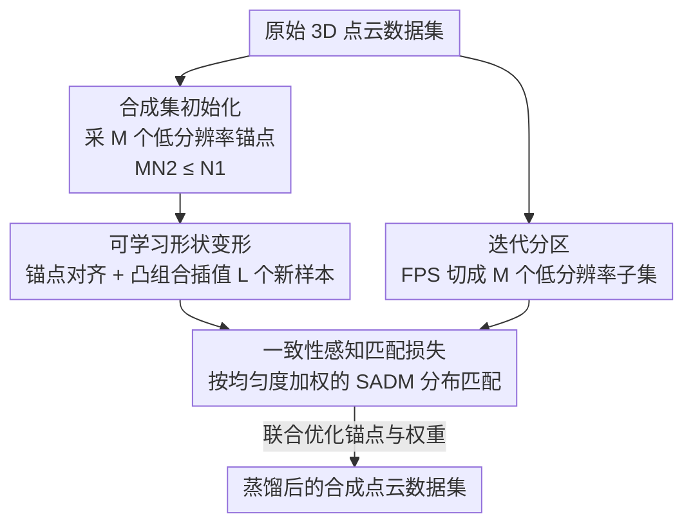

# Parameterization-Based Dataset Distillation of 3D Point Clouds through Learnable Shape Morphing

**会议**: ICLR 2026  
**OpenReview**: [https://openreview.net/forum?id=Qe7dKZOtWM](https://openreview.net/forum?id=Qe7dKZOtWM)  
**代码**: https://github.com/yimjae0/3DDP  
**领域**: 3D视觉  
**关键词**: 数据集蒸馏、3D点云、参数化、形状变形、分布匹配

## 一句话总结
本文首次把"蒸馏数据集参数化"（DDP）思想引入 3D 点云数据集蒸馏：用多个低分辨率锚点（anchor）加可学习权重的凸组合形状变形，在相同存储预算下生成数量更多、更多样的合成样本，并配上一致性感知（uniformity-aware）的匹配损失，在 5 个标准 3D 基准上大幅超过现有蒸馏方法。

## 研究背景与动机
**领域现状**：数据集蒸馏（DD）把大规模训练集压缩成一小撮合成样本，使得在合成集上训练的模型行为逼近在原始集上训练的模型，从而省内存、省算力。在图像域，近年又出现了一种更省存储的范式——蒸馏数据集参数化（DDP）：不直接存原始尺寸的合成样本，而是用下采样、频域裁剪、生成式潜码、神经场等紧凑格式表示，从而在同样的存储预算里塞进更多、更多样的合成样本。

**现有痛点**：DDP 在图像上已经被验证有效，但在 3D 点云上几乎是空白。原因在于点云是无序、不规则的集合，没有图像那种规整的网格结构，图像域里"下采样去空间冗余""丢高频分量"这套参数化技巧无法直接照搬。3D 点云的蒸馏工作本就稀少（PCC 用梯度匹配、SADM 用语义对齐的分布匹配），而且它们都沿用传统 DD 设定——每个类别只优化一个**满分辨率**合成样本，样本多样性受限。

**核心矛盾**：存储预算固定时，"单样本高分辨率"和"多样本多样性"之间存在 trade-off。传统做法把预算全压在一个全分辨率样本上，样本数量上不去；而点云的无序性又让常规参数化无从下手。

**本文目标**：在不超出原有内存预算的前提下，(1) 让合成集容纳更多样本、(2) 提升样本几何多样性、(3) 解决合成样本与原始样本分辨率不一致带来的匹配偏差。

**切入角度**：作者借鉴 3D 形状变形（shape morphing）——多个对齐后的形状之间做凸组合可以插值出新形状。如果把"少数低分辨率锚点 + 可学习的混合权重"作为参数化表示，就能近乎零额外开销地"生"出大量新样本。

**核心 idea**：用"M 个低分辨率锚点 + L 组可学习凸组合权重"代替"一个满分辨率样本"，把参数化省下的空间换成更多、更多样的合成样本，再用一致性感知匹配损失把分辨率不匹配的问题补上。

## 方法详解

### 整体框架
方法要解决的是"同样存储预算下蒸馏出更好的 3D 点云合成集"。整体分两条主线协同：一条是**自适应形状变形**，负责在预算内造出又多又多样的合成样本；另一条是**一致性感知匹配**，负责把这些低分辨率合成样本和原始高分辨率样本公平地比较、对齐分布。

具体流程是：先从原始集随机采样，把传统的"一个 $N_1$ 点满分辨率样本"换成 $M$ 个各含 $N_2$ 点的低分辨率锚点（约束 $MN_2 \le N_1$），构成初始合成集 $D_{init}$；锚点之间通过 KNN + 线性指派做点级对齐；用可学习权重对对齐后的锚点做凸组合，插值出 $L$ 个新样本，与锚点合并成完整合成集 $D_s$；与此同时，对原始样本用迭代最远点采样（FPS）切成 $M$ 个互不重叠的低分辨率子集，再按每个子集的点分布均匀度加权，计算与合成集的 SADM 分布匹配损失；最后联合优化初始合成集与全部可学习权重。

### 关键设计

**1. 锚点参数化：用多个低分辨率锚点替换单个满分辨率样本**

传统 DD 把整个存储预算押在一个 $N_1$ 点的满分辨率合成样本上，样本数量被锁死，多样性无从谈起。本文把每个类别的合成样本拆成 $M$ 个互不相同、各含 $N_2$ 点的**锚点**（anchor），$M$ 个锚点合称一个 group，初始合成集写作 $D_{init}=\{\{a_{i,m}\}_{m=1}^{M}\}_{i=1}^{S}$，其中 $a_{i,m}\in\mathbb{R}^{N_2\times3}$。只要满足 $MN_2\le N_1$，这组锚点占的内存就不超过原来的单个满分辨率样本，却凭空多出了 $M$ 倍数量、$M$ 种不同形状的"种子"。这一步是参数化的根基：它把"高分辨率单样本"换成"低分辨率多锚点"，把省下的分辨率冗余直接兑换成多样性。

**2. 自适应形状变形：可学习凸组合权重插值新样本**

光有 $M$ 个锚点还不够，作者进一步让锚点之间"混血"生出更多样本。先做点级对齐：在每个 group 内把其余 $M-1$ 个锚点对齐到第一个锚点 $a_{i,1}$——构造两两之间的欧氏距离矩阵，解线性指派问题（linear assignment）得到一一对应，再按对应关系重排各样本的点序。对齐后，第 $l$ 个新样本由对齐锚点 $\tilde a_{i,m}$ 的凸组合生成：

$$b_i^l=\sum_{m=1}^{M} w_{i,m}^l\cdot\tilde a_{i,m},\quad \sum_{m=1}^{M}w_{i,m}^l=1,\ w_{i,m}^l\ge0.$$

权重向量 $w_i^l$ 是**可学习**的：由于点云常带绕竖轴的随机旋转，点级对应不可能完美，固定平均权重插出来的样本往往是无意义的噪声点云（论文图 3 显示初始混合样本就很糟）；让权重随训练自适应调整，就能补偿这些错配，最终插出结构一致、又区别于锚点的新形状。最妙的是这一步**几乎零额外存储**——它复用已有锚点，只新增 $32L(M-1)KC$ bit 存权重（之所以是 $M-1$ 而非 $M$，因为凸组合的约束 $\sum w=1$ 让最后一个权重可被推出）。最终合成集为 $D_s=\{\{\tilde a_{i,m}\}_{m=1}^{M}\cup\{b_i^l\}_{l=1}^{L}\}_{i=1}^{S}$。

**3. 一致性感知匹配损失：补偿分辨率不匹配与点分布不均**

合成样本是低分辨率的（$N_2$ 点），原始样本是满分辨率的（$N_1$ 点），而本文采用的 SADM 分布匹配损失 $L_{SADM}=\tilde K_{D_o,D_o}+\tilde K_{D_s,D_s}-2\tilde K_{D_o,D_s}$ 假设两边分辨率相同，直接套用会失真。作者的做法是：把每个原始样本用迭代 FPS 切成 $M$ 个互不重叠、各含 $N_2$ 点的低分辨率子样本，按位置归并成子集 $C_1,\dots,C_M$，再分别与合成集比较。但 FPS 切出来的子集可能点分布不均（spatial non-uniformity），会拖累分布匹配的可靠性，于是引入**均匀度评分** $\nu(D)$——用每个点到其 $k$ 近邻局部距离的变异系数（CV，即标准差/均值）在全集上取平均：

$$\nu(D)=\frac{1}{N(D)\cdot O}\sum_{i=1}^{O}\sum_{j=1}^{N(D)}\frac{\sigma_j^i}{\mu_j^i+\epsilon},$$

其中 $\mu_j^i,\sigma_j^i$ 是第 $i$ 个样本第 $j$ 个点到 $k$ 近邻距离的均值与标准差。再据此给每个子集 $C_m$ 一个惩罚系数 $\eta_m=\exp(-\lambda(\nu(D_o)-\nu(C_m))^2)$：子集均匀度越偏离原始集，权重越低。最终蒸馏损失为各子集 SADM 损失的均匀度加权和：

$$L_{Distill}(D_o,D_s)=\sum_{m=1}^{M}\eta_m\cdot L_{SADM}(C_m,D_s).$$

这样既解决了分辨率不匹配，又让分布更可靠的子集主导匹配。

### 损失函数 / 训练策略
总目标是联合优化初始合成集与全部可学习权重以最小化蒸馏损失：$\{D_{init}^{*},W^{*}\}=\arg\min_{\{D_{init},W\}}L_{Distill}(D_o,D_s)$，其中 $W=\{\{w_i^l\}_{l=1}^{L}\}_{i=1}^{S}$。存储约束写成 $96MN_2KC+32L(M-1)KC\le96N_1KC$（$K$ 为每类点云数 PPC，$C$ 为类别数，坐标为 32-bit 浮点）。实现上，$D_{init}$ 和 $W$ 均用 SGD、学习率 10、迭代 2000 步优化；评估时训练 500 epoch、batch 8、step decay（步长 250、衰减 0.1）；所有结果在单张 RTX 3090 上跑 10 次取平均，所有 baseline 在无数据增强的统一设定下重新实现以保证公平。典型超参：ModelNet10 取 $N_2=252,M=4,L=16$，其余数据集 $N_2=255,M=4,L=4$，原始 $N_1=1024$。

## 实验关键数据

### 主实验
在 5 个标准 3D 点云分类基准上、用 PointNet 在相同内存预算下评测，本文在所有数据集与所有 PPC 设定下都超过 coreset 选择和现有蒸馏方法，尤其 PPC=1 时提升最猛（单位：%，括号外为本文 Ours，对比 SADM 为此前 SOTA）：

| 数据集 | PPC | DM | PCC | SADM | Ours | Whole |
|--------|-----|------|------|------|------|-------|
| ModelNet10 | 1 | 25.8 | 33.0 | 35.9 | **87.7** | 92.18 |
| ModelNet40 | 1 | 31.1 | 55.3 | 54.8 | **73.2** | 88.78 |
| ShapeNet | 1 | 26.3 | 50.9 | 51.1 | **60.5** | 82.49 |
| ScanObjectNN | 1 | 13.7 | 16.0 | 17.6 | **32.6** | 63.43 |
| OmniObject3D | 1 | 15.1 | 35.8 | 33.2 | **41.9** | 74.98 |

ModelNet10 在 PPC=1 时从 SADM 的 35.9% 一跃到 87.7%，几乎逼近全量训练 92.18%；真实世界 ScanObjectNN 从 17.6% 提到 32.6%。跨架构泛化（用 PointNet 蒸馏、换 PointNet++/PointConv/PointTransformer/PointMamba 评测，PPC=1）同样领先，如 ModelNet10 上 PointNet++ 从 SADM 25.9% 提到 55.4%、PointMamba 从 28.4% 提到 69.4%；唯一略逊是 ScanObjectNN+PointNet++，因其底座 SADM 损失在该组合上本就偏弱。部件分割（ShapeNetPart, PPC=1）平均 mIoU 从 SADM 40.6% 提到 56.4%，吉他 51.3→80.1、马克杯 54.9→84.3。

### 消融实验

| 配置 | 关键指标（ScanObjectNN, PPC=1） | 说明 |
|------|------|------|
| 固定权重变形（Static, L=16） | 31.7 | 平均权重插值，结构噪声多 |
| 可学习权重变形（Adaptive, L=16） | **35.1** | 自适应权重补偿对应错配 |
| w/o 均匀度惩罚 $\eta$ | 30.7 | 去掉一致性感知加权 |
| w/ 均匀度惩罚 $\eta$ | **32.6** | 完整损失 |

### 关键发现
- **可学习权重是变形模块的关键**：在 L=2~24 的各档下，Adaptive 几乎都优于 Static（如 L=16 时 35.1 vs 31.7、L=20 时 35.6 vs 31.4），说明凸组合若用固定平均权重会插出噪声，自适应权重才把"混血"变成有效样本。
- **均匀度惩罚 $\eta$ 在真实/高 PPC 场景更有用**：ScanObjectNN 三档全涨（30.7→32.6、40.6→41.3、47.6→49.8），ModelNet10 在 PPC=3/10 也涨（但 PPC=1 反而从 88.4 微降到 87.7），说明它主要在分布噪声大、样本多时收益明显。
- **锚点分辨率 $N_2$ 需按 backbone 取舍**：固定总预算下调 $N_2$，PointNet 偏好小 $N_2$（重全局特征、对粗糙锚点不敏感），PointNet++ 在 $N_2=128$ 时骤降（依赖局部结构），折中取 $N_2\approx256$。
- **$L$ 越大精度越高但训练更慢**：组合样本数 $L$ 增大带来更丰富的表达力、精度上升，但评估时网络训练耗时也线性增加，需要权衡。
- **ScanObjectNN 四变体全胜**：在 PB\_T25/T25\_R/T50\_R/T50\_RS 上分别达 35.2/36.0/34.2/32.6，远超 SADM 的 19.4/18.8/16.7/17.6，难度上升时仍稳。

## 亮点与洞察
- **"参数化即多样性兑换"的视角很巧**：把图像域 DDP 的核心洞察——存储格式越紧凑、同预算下能塞越多样本——迁移到点云，并用"低分辨率锚点 + 凸组合权重"这种点云友好的紧凑表示落地，绕开了点云无法做"网格下采样/频域裁剪"的障碍。
- **凸组合变形近乎零开销**：新样本不存坐标、只存权重，且因 $\sum w=1$ 约束权重维度还能再省一维（$M-1$ 而非 $M$），这是"用极少 bit 换大量样本"的关键。
- **一致性感知加权可复用**：用 $k$ 近邻局部距离 CV 衡量点分布均匀度、再按与原始分布的差异指数加权，这个思路可迁移到任何"低分辨率子集 vs 高分辨率全集"的分布匹配场景，不限于蒸馏。
- **PPC=1 的极端压缩下提升最大**，说明该方法尤其适合超低预算场景——预算越紧，多锚点多样性带来的边际收益越高。

## 局限与展望
- 方法以 SADM 损失为底座，因此继承了它的弱点：ScanObjectNN + PointNet++ 组合上提升有限甚至略逊，跨架构泛化受底层损失质量牵制。
- 均匀度惩罚 $\eta$ 并非处处有益（ModelNet10 PPC=1 反而微降），说明它对"分布噪声小、样本少"的干净场景可能引入不必要的加权偏置，何时启用需要经验判断。
- 锚点对齐依赖线性指派求一一对应，点级对应在强旋转/形变下仍不完美，虽由可学习权重缓解，但对齐质量本身的上限可能限制变形样本的几何保真。
- 实验集中在分类与部件分割，未涉及检测、配准等更复杂的 3D 下游任务；超参（$N_2,L,M$）需按 backbone 与数据集手工调，自动化选择是可拓展方向。

## 相关工作与启发
- **vs SADM**：SADM 用语义对齐的特征分布匹配处理点云无序性、并联合优化旋转角，但仍是"单满分辨率样本"传统 DD 设定。本文直接以 SADM 损失为基座，但把样本表示换成参数化的多锚点+变形，并加一致性感知加权处理分辨率不匹配，多样性与精度都大幅提升。
- **vs PCC**：PCC 是最早把梯度匹配蒸馏搬到 3D 点云的工作，证明可行性；本文走分布匹配路线且引入参数化，PPC=1 时领先 PCC 数十个百分点。
- **vs 图像域 DDP（IDC / FreD / HaBa / DDiF）**：IDC 靠下采样去空间冗余、FreD 靠频域裁剪、HaBa 用离散潜空间、DDiF 用神经场，都是图像域的紧凑表示；本文是首个把 DDP 思想落到 3D 点云的工作，用锚点+凸组合权重作为点云专属的参数化形式。

## 评分
- 新颖性: ⭐⭐⭐⭐⭐ 首个 3D 点云蒸馏数据集参数化框架，锚点+可学习形状变形的表示设计新颖且点云友好。
- 实验充分度: ⭐⭐⭐⭐⭐ 5 个基准 × 多 PPC × 4 种跨架构 + 部件分割 + 4 个 ScanObjectNN 变体 + 完整消融，覆盖很全。
- 写作质量: ⭐⭐⭐⭐ 问题动机与公式清晰，框架图与可视化到位；部分符号（$\nu,\eta$ 的下标）需对照原文细读。
- 价值: ⭐⭐⭐⭐⭐ 在超低存储预算下把 3D 蒸馏精度推高一大截，对 3D 数据高效训练有直接实用价值，且代码开源。

<!-- RELATED:START -->

## 相关论文

- [\[CVPR 2026\] PaNDaS: Learnable Shape Interpolation Modeling with Localized Control](../../CVPR2026/3d_vision/pandas_learnable_shape_interpolation_modeling_with_localized_control.md)
- [\[ICLR 2026\] Interp3D: Correspondence-aware Interpolation for Generative Textured 3D Morphing](interp3d_correspondence-aware_interpolation_for_generative_textured_3d_morphing.md)
- [\[ICLR 2026\] Point-MoE: Large-Scale Multi-Dataset Training with Mixture-of-Experts for 3D Semantic Segmentation](point-moe_large-scale_multi-dataset_training_with_mixture-of-experts_for_3d_sema.md)
- [\[CVPR 2026\] Wave-Former: Through-Occlusion 3D Reconstruction via Wireless Shape Completion](../../CVPR2026/3d_vision/wave-former_through-occlusion_3d_reconstruction_via_wireless_shape_completion.md)
- [\[AAAI 2026\] TOSC: Task-Oriented Shape Completion for Open-World Dexterous Grasp Generation from Partial Point Clouds](../../AAAI2026/3d_vision/tosc_task-oriented_shape_completion_for_open-world_dexterous_grasp_generation_fr.md)

<!-- RELATED:END -->
