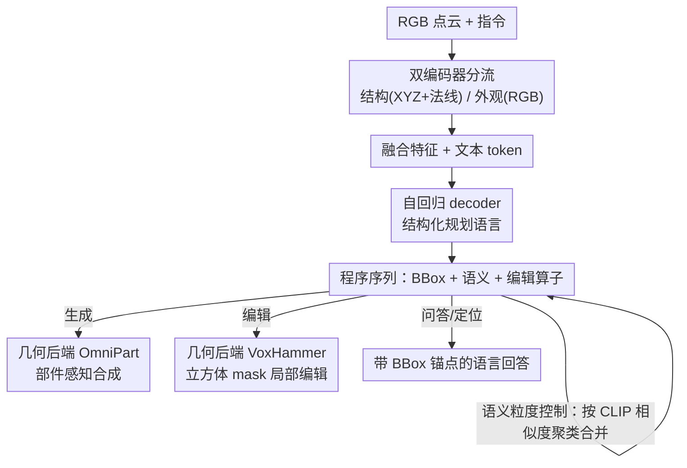

# Part-X-MLLM: Part-aware 3D Multimodal Large Language Model

**会议**: ICLR 2026  
**OpenReview**: [https://openreview.net/forum?id=WffiETiSeU](https://openreview.net/forum?id=WffiETiSeU)  
**项目页**: [https://chunshi.wang/Part-X-MLLM/](https://chunshi.wang/Part-X-MLLM/)  
**代码**: 待确认  
**领域**: 3D视觉 / 多模态VLM  
**关键词**: 3D MLLM, 部件级理解, 结构化规划语言, 双编码器, 部件生成与编辑

## 一句话总结
Part-X-MLLM 是一个原生 3D、部件感知的多模态大模型，它把生成、编辑、问答这些异构的 3D 任务统一成"用一套部件语法写程序"——输入 RGB 点云 + 自然语言，自回归吐出一条同时编码部件包围盒、语义描述、编辑指令的 token 序列，再交给现成几何引擎执行，从而用一个语言原生前端驱动各种 3D 资产操作，在 11 类任务上达到 SOTA。

## 研究背景与动机
**领域现状**：当下 3D 生成与理解大体分两派。一派是场景级 3D MLLM（PointLLM、3D-LLM、ShapeLLM 等），把点云对齐到语言做 captioning、问答；另一派是几何导向的生成模型（TRELLIS、Hunyuan3D、ShapeLLM-Omni 等），靠结构化 3D latent 或离散 token 合成高保真资产。部件生成方向则要么把 2D 分割提升到 3D（Part123、SAMPart3D、HoloPart），要么直接在 3D 里生成部件（AutoPartGen、BANG、OmniPart）。

**现有痛点**：这些系统都没法真正"按部件、用语言"操控 3D 物体。作者把这个根本缺陷称为**结构不透明性（structural opaqueness）**——模型把一个 3D 物体当成一整块不可分的几何，下游应用因此无法定位或操作具体部件（比如"只编辑椅子的左腿"）。场景级 MLLM 缺少持久的部件标识、缺少可定位的引用、也吐不出可执行的输出；几何生成器虽然能合成高保真资产，却几乎没有语义可寻址性；3D 编辑方法多是"工具侧"的，不是一个能推理部件、并发出带空间定位的可执行编辑程序的语言原生前端。

**核心矛盾**：现实物体本就是"有意义部件的组装体"，但现有方法在"语言可控的高层规划"与"几何精确的底层合成"之间没有解耦——要么有强生成器但接口割裂，要么有语言接口但不懂部件结构。没有一个模型能同时做到：(i) 理解并命名部件，(ii) 把引用锚定到持久的包围盒上，(iii) 编译出可执行的增/删/改程序并委派给强几何引擎，且语义粒度可控。

**核心 idea**：把 3D 交互重新表述成一个**语言建模问题**——生成、编辑、问答这些看似无关的任务，都能被统一在一套"几何感知的部件语法"之下。模型把用户指令和 3D 视觉输入翻译成一段结构化程序（部件包围盒 + 持久引用 + 语义描述 + 编辑算子），这段离散、语言原生的输出就成了驱动任意下游几何模块的通用控制面。

## 方法详解

### 整体框架
Part-X-MLLM 的核心是把"符号规划"与"几何合成"解耦：模型本身只负责理解 3D 输入并生成一段程序化 token 序列（plan），具体的高保真几何合成/编辑则交给现成的几何引擎执行。整条 pipeline 是：给定一个 RGB 点云和一句指令，先用**双编码器**分别抽取几何结构特征与外观语义特征，与文本 token 融合后送入一个**自回归 decoder**，decoder 按照一套**结构化规划语言**吐出程序（包围盒、语义文本、编辑算子），最后由**几何执行后端**（生成用 OmniPart 合成模块、编辑用 VoxHammer）把 plan 落地成网格/3DGS/NeRF。由于输出程序与具体模型无关，任何兼容的几何引擎都能被这条 token 接口驱动。

### 关键设计

**1. 结构化规划语言：把异构任务统一成"写程序"**

这是全文的总枢纽，直接解决"生成/编辑/问答接口各不相同、无法统一"的痛点。作者设计了一套几何感知的部件语法：用特殊 token 表示部件，如 `<boxs>` / `<boxe>` 包裹一个包围盒（中间是 6 个量化坐标 token，对应 $[x_{min},y_{min},z_{min}]$ 和 $[x_{max},y_{max},z_{max}]$，坐标被离散化到 128 个 bin）；用 `<adds>`/`<dels>`/`<mods>` 等 token 表示增/删/改编辑算子。decoder 的目标永远是"生成正确的 token 序列来表示这个 plan"，于是部件感知生成、带定位的问答、自动定位编辑这些任务被收敛成同一个 instruction-following 问题。这套表示带来三个具体好处：**部件身份稳定且可锚定**（token 通过 BBox 符号携带对部件的持久引用，跨步骤、跨任务都能精确审计与操作）；**语义粒度可控**（同一段程序可按需暴露粗标签或细描述）；**结构与语义分离**（配合双编码器避免表征冲突）。相比依赖外部 adapter 的方案，这里把 3D 结构当成语言的内在组成——几何部件和编辑指令是和自然文本并列的原生 token。

**2. 双编码器架构：把几何结构和视觉外观分流，避免表征冲突**

针对"单编码器同时塞几何和颜色会互相打架"的问题，模型用两条并行通路。**结构编码器**只处理原始点云几何（XYZ 坐标 + 表面法线），输出结构 token；**语义编码器**只处理 RGB 颜色信息，输出外观 token。这样模型就能区分那些"结构相似但视觉不同"的部件，比如两条形状一样但颜色不同的椅子腿。作者强调这是有意为之的：消融实验显示，强迫单个编码器同时承担结构与语义会产生冲突，而把两种职责解耦到两个专精编码器上更有效、更鲁棒——在纯几何任务（box listing）上双编码器把 IoU 提升了 +7.06，在 Part QA、Multi-Part Grounding 等语言密集任务上也全面涨点。

**3. 语义粒度控制：靠文本聚类自动合并部件，让"粗/细"可调**

现实需求里，用户有时只想要粗粒度的几个大部件，有时想要细到每个小零件。以往做法要么预先定死部件数量（如 PartPacker），要么手动合并 mask（如 OmniPart），都不灵活。本文利用"box + text"的表示，按部件文本描述的语义相似度（用 CLIP embedding）对包围盒做后处理聚类，把细粒度部件逐步合并成更粗的语义组件。论文示例里部件数能从 22 一路自动合并到 2（22→18→10→6→2），全程无需人工干预，同一套程序化接口下就实现了细节层级的连续调节。

**4. 两阶段课程式指令微调：先把几何"刻进"编码器，再对齐强 LLM**

直接端到端训练很难让 LLM 既懂 3D 几何又会写程序，作者用两阶段课程逐步搭能力。**阶段一·纯几何 BBox 预训练**：用 Hunyuan 2.1 3D Shape VAE Encoder 初始化结构编码器，每个样本是固定大小、无 RGB 的点云 $(40960, 6)$（XYZ + 法线），编码器把特征下采样 20× 得到长度 2048 的 latent；为了把"包围盒知识"逼进编码器，配一个轻量自回归 decoder 专门从 latent 预测部件级包围盒（不涉及任何文本语义），在 360 万物体上训 10 个 epoch，之后保留专精化的结构编码器、丢弃轻量 decoder。**阶段二·双编码器全量指令微调**：换上更强的 Qwen 2.5 VL，引入与结构编码器同构的语义（RGB）编码器处理 $(10240, 6)$ 的点云（XYZ + RGB），并把任务专用特殊 token（`<boxs>`/`<boxe>`、`<adds>`/`<adde>` 等）扩进词表；训练时**冻结**阶段一的结构编码器和原始 Qwen 词嵌入，只训新的语义编码器、Qwen decoder 的 AR transformer 层以及新增特殊 token 的嵌入。这样既高效对齐了"几何+外观"双流条件与可执行语法，又保留了 LLM 的强先验。

### 损失函数 / 训练策略
整体是自回归的下一 token 预测——无论是包围盒坐标 token、语义描述还是编辑算子，模型都按"生成正确 token 序列"来优化。训练数据上，作者构建了一个部件中心数据集：85,771 个物体，平均每个 23 个部件，每个部件标注轴对齐包围盒（AABB）+ 两种粒度的文本（粗标签 Q1 / 细描述 Q2），物体级还有整体 caption 和若干部件问答指令对；数据按两步流水线构建（结构化标注 → 转成 instruction-following 样本），实例化 11 个任务模板（Types 0–10，涵盖纯 box listing、粗/细多部件定位、按名/按描述的单部件定位、box-to-text captioning、部件问答、增/删/改编辑程序），train/test 按文件列表确定性划分（约 99.5/0.5）。

## 实验关键数据

### 主实验
评测用作者自建的 **UniPart-Bench**（400 个 held-out 物体），核心衡量结构化 plan 的质量（预测包围盒布局的准确性），下游任务再把 plan 交给外部几何模块执行。

**包围盒生成**（与把 voxel 当点云做分割的 PartField、以及 OmniPart 生成模型对比）：

| 方法 | Voxel recall ↑ | Voxel IoU ↑ | BBox IoU ↑ |
|------|------|------|------|
| PartField | 69.65 | 46.04 | 37.33 |
| OmniPart | 72.32 | 47.62 | 39.78 |
| **Part-X-MLLM (Ours)** | **74.11** | **48.74** | **42.55** |

**部件理解问答**（UniPart-Bench，相比最强非本文基线的提升）：

| 模型 | SBERT | SimCSE | BLEU-1 | ROUGE-L | METEOR |
|------|------|------|------|------|------|
| PointLLM-7B | 61.30 | 58.48 | 21.78 | 29.26 | 22.45 |
| ShapeLLM-13B | 61.19 | 57.26 | 23.32 | 32.56 | 24.45 |
| **Part-X-MLLM (Ours)** | **78.98** | **84.25** | **40.54** | **42.26** | **34.24** |

部件问答相对最强基线提升 +17.7 SBERT / +25.8 SimCSE / +17.2 BLEU-1 / +9.7 ROUGE-L / +9.8 METEOR；整体物体 captioning 也涨 +4.3 SBERT / +2.5 SimCSE / +18.3 BLEU-1 / +19.1 ROUGE-L / +13.3 METEOR（token 级指标涨幅尤其大，说明描述的词汇覆盖与结构更好）。

### 消融实验
双编码器 vs 单编码器（单编码器把 XYZ 与 RGB 融成一个统一点云）：

| 任务 | 配置 | IoU ↑ | SBERT ↑ | BLEU-1 ↑ |
|------|------|------|------|------|
| Pure Box Listing | Dual (Ours) | 75.53 | - | - |
| Pure Box Listing | Single | 68.47 | - | - |
| Multi-Part Grounding | Dual (Ours) | 72.82 | 55.60 | 35.55 |
| Multi-Part Grounding | Single | 69.78 | 54.18 | 33.95 |
| Part QA | Dual (Ours) | 55.44 | 78.98 | 40.54 |
| Part QA | Single | 54.24 | 78.44 | 39.29 |

### 关键发现
- 双编码器在纯几何任务（Box Listing）上 IoU 提升最大（+7.06），印证了"几何与语义混在一条编码器里会冲突"的判断；在语言密集任务上全指标小幅但一致提升。
- 把任务统一成"结构化程序"后，问答类指标（尤其 token 级 BLEU/ROUGE）相对基线大幅领先，说明 box 语法 + 指令微调显著增强了部件级 grounding 与推理。
- 语义粒度控制能把部件从 22 自动合并到 2，是同类方法里少见的"无需预设数量、无需手动合并"的连续可调能力。

## 亮点与洞察
- **把 3D 交互降维成语言建模**：用一套"部件语法 + 程序 token"把生成/编辑/问答统一，是最让人"啊哈"的点——它把高层符号规划和底层几何合成彻底解耦，模型只当"会说部件语言的前端"，几何引擎可热插拔。
- **持久 BBox token = 可审计的部件身份**：用包围盒符号携带跨步骤的持久引用，让多轮编辑/推理有了稳定锚点，这个思路可迁移到任何需要"跨步骤指代同一对象"的具身/agent 任务。
- **双编码器解耦结构与外观**：用消融实证"单编码器有表征冲突"，给"几何 vs 颜色该不该分流"提供了干净证据，做点云 backbone 设计时值得借鉴。
- **语义聚类做粒度控制**：用文本 CLIP 相似度而非几何来合并部件，是个轻量却好用的 trick，把"粗/细"变成连续可调维度。

## 局限与展望
- 模型本身不做几何合成，高保真结果强依赖外部执行后端（生成靠 OmniPart、编辑靠 VoxHammer），plan 再好也受限于后端引擎的能力上界。
- 评测主要在自建的 UniPart-Bench 上，缺少与现有标准基准的横向对照，且 400 物体的 held-out 规模偏小；不同任务难度不一，跨指标的提升幅度不宜直接互比。
- 坐标被量化到 128 bin，对需要极精细空间定位的编辑可能有量化误差；语义粒度聚类依赖 CLIP 文本相似度，描述质量差时合并可能不准。
- 输入是带 RGB 的点云，对真实扫描中常见的噪声、缺失、遮挡的鲁棒性论文未充分展示。

## 相关工作与启发
- **vs 场景级 3D MLLM（PointLLM / 3D-LLM / ShapeLLM）**：它们把物体当整体做 captioning/QA，缺持久部件标识与可执行输出；本文引入语言原生的部件语法，能命名部件、锚定 BBox、吐出可执行程序。
- **vs 几何生成器（TRELLIS / Hunyuan3D / ShapeLLM-Omni）**：它们能合成高保真资产但语义可寻址性弱；本文不直接合成，而是产出可驱动它们的程序接口，把语言变成通用控制面。
- **vs 部件生成（OmniPart / PartPacker / BANG）**：OmniPart 也用自回归 box 规划 + TRELLIS 合成，但需手动合并 mask；本文统一了理解+生成+编辑，并用语义聚类实现自动粒度控制。
- **vs 3D 编辑（VoxHammer / NANO3D / FocalDreamer）**：它们多是工具侧、不推理部件；本文把部件感知规划接口和强几何后端耦合，提供带空间定位的语言原生编辑前端。

## 评分
- 新颖性: ⭐⭐⭐⭐⭐ 把生成/编辑/问答统一成"部件语法写程序"+ 几何引擎热插拔，是一个干净且有普适性的新范式
- 实验充分度: ⭐⭐⭐⭐ 主实验 + 双编码器消融扎实，但基准为自建、规模偏小，缺少标准基准横向对照
- 写作质量: ⭐⭐⭐⭐⭐ 动机（结构不透明性）清晰，框架与三大好处对应明确，图文配合到位
- 价值: ⭐⭐⭐⭐⭐ 语言原生、模型无关的 3D 控制面对部件级 3D 智能很有前景，工程可复用性强

<!-- RELATED:START -->

## 相关论文

- [\[ICLR 2026\] PartSAM: A Scalable Promptable Part Segmentation Model Trained on Native 3D Data](partsam_a_scalable_promptable_part_segmentation_model_trained_on_native_3d_data.md)
- [\[ICLR 2026\] HoloPart: Generative 3D Part Amodal Segmentation](holopart_generative_3d_part_amodal_segmentation.md)
- [\[CVPR 2026\] Part$^{2}$GS: Part-aware Modeling of Articulated Objects using 3D Gaussian Splatting](../../CVPR2026/3d_vision/part2gs_part-aware_modeling_of_articulated_objects_using_3d_gaussian_splatting.md)
- [\[CVPR 2026\] Learning Hierarchical Hyperbolic Mixture Model for Part-aware 3D Generation](../../CVPR2026/3d_vision/learning_hierarchical_hyperbolic_mixture_model_for_part-aware_3d_generation.md)
- [\[ICLR 2026\] MultiMat: Multimodal Program Synthesis for Procedural Materials using Large Multimodal Models](multimat_multimodal_program_synthesis_for_procedural_materials_using_large_multi.md)

<!-- RELATED:END -->
