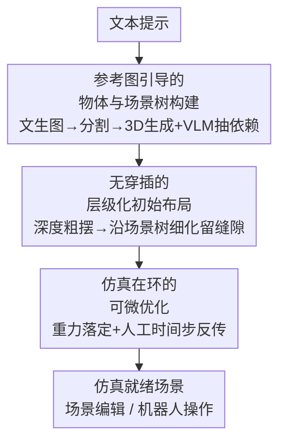

# PAT3D: Physics-Augmented Text-to-3D Scene Generation

**会议**: ICLR 2026  
**OpenReview**: [https://openreview.net/forum?id=iIRxFkeCuY](https://openreview.net/forum?id=iIRxFkeCuY)  
**代码**: https://github.com/Simulation-Intelligence/PAT3D  
**领域**: 3D视觉  
**关键词**: 文本到3D场景、物理仿真、可微刚体仿真、场景树、布局优化

## 一句话总结
PAT3D 把视觉语言模型推理和可微刚体接触仿真接进文本到 3D 场景生成流水线，先用参考图抽出物体间的支撑依赖搭成场景树、再生成一个无穿插的初始布局，最后用「仿真在环」的可微优化让场景在重力下收敛到既稳定又不穿插、还贴合文本语义的静态平衡，成为第一个能直接拿去做编辑和机器人操作的「仿真就绪」场景生成方法。

## 研究背景与动机
**领域现状**：扩散模型和自回归模型把文本到 3D 推到了能合成高质量几何和外观的程度，最近不少工作（GraphDreamer、MIDI、Blender-MCP 等）开始用 LLM/VLM 推理物体的空间关系，把多个物体组合成场景。

**现有痛点**：这些方法几乎都把「布局」当成纯几何问题——要么完全不做物理推理，要么只用简单启发式（比如包围盒不重叠）来避免穿插。结果就是生成的场景普遍出现物体悬浮、堆叠不稳、支撑关系错误，一旦丢进仿真器就塌掉，根本没法用于需要交互、仿真或对应真实世界的下游任务。

**核心矛盾**：要让场景「物理可信」，最直接的办法是把物理仿真接进生成流程，但仿真有三个硬约束彼此打架——① 仿真要求物体是各自分离的网格（单连通网格仿不出物体间交互）；② 仿真要求一个「良态」的初始配置，通常得无穿插，否则数值会爆；而找一个无穿插初始状态本身就很难；③ 即便仿真出物理可信的结果，由于静态平衡解有无穷多个，最终场景可能偏离文本想要的语义。

**本文目标**：在保证物体级网格、无穿插初始化的前提下，让生成场景同时满足物理稳定、无穿插、语义一致三件事。

**切入角度**：作者观察到「重力方向上的支撑依赖」是组织场景的关键结构——只要先把谁压在谁上面理清楚（场景树），无穿插初始化和后续优化都可以围绕这棵树来做，而仿真本身就能把「留出的小缝隙」自然填实。

**核心 idea**：用「VLM 抽支撑依赖 → 场景树驱动无穿插初始化 → 可微仿真在环优化」三段式，把物理约束显式地灌进文本到 3D 场景生成。

## 方法详解

### 整体框架
PAT3D 输入一段文本提示，输出一个仿真就绪、无穿插、贴合语义的 3D 场景，整条流水线分三个阶段串行。第一阶段先用文生图模型生成一张参考图来锚定物体间的空间关系，再用视觉基础模型生成各个独立物体、用 VLM 把成对的支撑关系组织成一棵「场景树」。第二阶段把这些物体先按单目深度先验粗摆成初始布局，再沿场景树细化成一个无穿插的初始配置（关键是沿重力方向刻意留小缝隙）。第三阶段做前向仿真让物体在重力下自然落定，并用「仿真在环」的可微优化把初始布局微调到既物理稳定又语义一致的静态平衡。

### 关键设计

**1. 参考图引导的物体与场景树构建：把文本里的空间关系显式提取成支撑依赖树**

直接让文生 3D 模型或 LLM 同时产出物体和布局，往往抓不住复杂的空间关系，所以作者改用一张文生图的参考图来当中介。具体地，先用 VLM 读参考图给出物体类别，用 Grounded-SAM 分割出各物体区域，再让 VLM 为每个区域写出包含语义、材质、颜色、朝向的详细描述，喂给文生 3D 流水线（Hunyuan3D）逐个生成高质量带纹理的网格——逐物体生成正是它比 MIDI「一步生成整场景」质量更高的原因。关键的一步是空间关系抽取：对参考图中水平位置相近、垂直位置相邻的每一对物体，prompt VLM 沿重力轴推断它们的依赖关系（on / contain / support 等）。这些成对关系随后被组织成一棵层级化场景树：以地面为根节点，遍历场景，每遇到一个与已有节点存在直接物理依赖的未访问物体就把它作为子节点插入，递归直到所有物体入树。这棵树编码了「谁在重力下支撑谁」，是后两个阶段无穿插初始化和优化的依据。

**2. 无穿插的层级化初始布局：用深度先验定位、再沿场景树留缝隙消除穿插**

仿真要求初始配置无穿插且语义合理，作者分两步搭。先建「初步布局」：把 2D 参考图按深度估计反投影得到每个物体的 3D 点云，通过对齐物体中心与点云质心算出平移和缩放。但 2D 图重度遮挡会让从残缺点云直接估的缩放不可靠，于是先让 VLM 找出场景中遮挡最少的物体当锚点算全局缩放，再让 VLM 把被遮挡区域补全（inpaint）、从补全后物体的包围盒估各物体相对缩放，全局与相对缩放相乘得到最终变换。第二步「细化初始布局」按广度优先遍历场景树，在每个节点做两类细化：水平方向上强制「父子约束」（子物体投影必须完全落在父物体投影内，如水果在篮子里）和「兄弟约束」（同父物体投影不重叠，如桌上的花瓶、盘子、叉子各占一块）；垂直方向上把每个子物体沿重力轴抬到父物体包围盒之上。这一步刻意沿重力方向给有父子关系的物体留出小缝隙，让消除穿插变得简单，同时保住推断出的空间关系——这些缝隙会在下一阶段仿真中被重力自然填实。作者强调这个简单策略比复杂优化更高效地消除穿插，为仿真提供了良态初值。

**3. 仿真在环的可微优化：用人工时间步让静态平衡对初始布局可微，修回语义一致**

仿真后重力会让子物体落到父物体上、兄弟物体自然摆成可信姿态，但复杂的物体间交互可能让场景偏离文本语义（如不规则积木因质心失衡而塌掉）。作者把它写成一个带约束的优化：$\min_{q_0} L(q_{n+1}(q_0))\ \ \text{s.t.}\ f(q_{n+1})=0$，其中 $q_0$ 是无穿插初值、$q_{n+1}$ 是最终平衡态、$f$ 是所有物体的净力、$L$ 度量语义不一致。语义损失定义在投影包围盒上：对容器为 $t$ 的物体 $i$，其水平投影包围盒角点对父容器包围盒的偏离记 $l_i=d(p^i_{\min},\text{BBox}_t)^2+d(p^i_{\max},\text{BBox}_t)^2$（$d$ 为点到框边界的欧氏距离，点在框内则为 0），总损失 $L=\sum_{i=1}^N l_i$。难点在于梯度：$q_0$ 只是初值、不在平衡约束 $f(q_{n+1})=0$ 里，没法直接对约束求 $q_{n+1}$ 对 $q_0$ 的导数，而直接穿过非线性求解器又代价过高。作者改用「人工时间步」（artificial time-stepping）：把准静态系统看成在一系列中间态上逐步演化到平衡，每一步用隐式微分高效地从 $q_{n+1}$ 反传回 $q_0$。这让「调初始布局 → 影响最终平衡态 → 修语义」这条梯度链路真正跑得起来，也是论文「第一个把可微仿真接进 3D 场景生成」的核心。

### 损失函数 / 训练策略
PAT3D 没有训练神经网络权重，优化的是场景的初始布局变量 $q_0$。目标函数即上面的语义不一致损失 $L=\sum_i l_i$，约束为静态力平衡 $f(q_{n+1})=0$；用局部优化器求解，借人工时间步公式（Fang et al. 2021）做隐式微分得到梯度，前向仿真与微分推导细节在原文附录 B。

## 实验关键数据

### 主实验
测试集自建 18 条文本提示（3 条来自 MIDI、2 条来自 GraphDreamer、13 条 LLM 新生成），强调物体间物理交互。对比 GraphDreamer、MIDI、Blender-MCP 三个基线，五项指标：CLIP Score、VQA Score 测语义一致；Simulated Scene Displacement（位移，测稳定性）、Penetrating Triangle Pairs Ratio（穿插三角形对比例）测物理；Physical Plausibility Score 测整体物理可信度。

| 方法 | CLIP↑ | VQA↑ | 位移↓ | 穿插比↓ | 物理分↑ |
|------|-------|------|-------|---------|---------|
| GraphDreamer | 27.53 | 0.46 | 0.25 | 61.72 | 40.0 |
| Blender-MCP | 28.93 | 0.56 | 1.03 | 14.78 | 47.7 |
| MIDI | 29.68 | 0.63 | 0.69 | 110.80 | 62.7 |
| **PAT3D（本文）** | **31.79** | 0.68 | **0** | **0** | **88.5** |

PAT3D 在语义一致（CLIP 最高 31.79）、物理稳定（位移 0）、无穿插（穿插比 0）、物理可信（88.5，远高于次优 MIDI 的 62.7）上全面领先，是唯一同时做到完美物理稳定与零穿插的方法。VQA 上 MIDI 的 0.63 与本文 0.68 接近，但 MIDI 穿插比高达 110.80、场景一塌即不可用。

### 消融实验

| 配置 | CLIP↑ | VQA↑ | 位移↓ | 穿插比↓ | 物理分↑ | 说明 |
|------|-------|------|-------|---------|---------|------|
| Raw layout（仅深度对齐） | 29.88 | 0.64 | 0.81 | 14.11 | 65.5 | 无初始化、无优化 |
| Scene Init.（仅初始化） | 30.77 | 0.70 | 2.91 | 0 | 34.2 | 消了穿插但牺牲了稳定性 |
| Full（本文） | 31.79 | 0.68 | 0 | 0 | 88.5 | 完整 |

### 关键发现
- 「初始化」单独看是「以稳定性换无穿插」：Scene Init. 把穿插比从 14.11 压到 0，但位移反而升到 2.91、物理分掉到 34.2——因为留缝隙的初值本身并不稳。它的价值在于给后续可微优化提供了无穿插的良态起点，正是有了它，优化才能把所有指标一起拉满（位移、穿插归零，物理分冲到 88.5）。
- 语义一致指标（CLIP/VQA）的提升幅度相对较小，作者解释这类指标主要取决于几何和纹理等外观因素，而非布局本身。
- 定性消融显示：仅靠深度图，书会互相穿插、笔会戳出笔筒；加场景树初始化后投影落入容器投影、满足重力依赖；再加仿真在环优化，原本会塌的不规则积木堆能收敛到稳定且语义正确的堆叠。

## 亮点与洞察
- **场景树是把「物理」翻译成「可操作结构」的关键中介**：把杂乱的物体关系抽象成一棵以地面为根、按重力支撑组织的树，使得无穿插初始化（父子投影包含、兄弟不重叠、子物体抬高）变成沿树遍历就能完成的简单规则，避开了复杂全局优化。
- **「故意留缝隙再让仿真填实」很巧**：直接求无穿插且接触紧密的布局很难，作者反其道而行——初始化时沿重力留小缝隙把无穿插变简单，把「填实接触」这件难事交给重力仿真自然完成，是把物理引擎当求解器用的典型思路。
- **人工时间步让静态平衡可微**：$q_0$ 不在平衡约束里、又不能硬穿非线性求解器，改用准静态逐步演化 + 每步隐式微分，是这套优化能端到端跑通的技术核心，也可迁移到其他「优化初值以影响平衡态」的可微物理任务。
- **直接产出仿真就绪场景**：生成的场景能直接导入仿真器做场景编辑（加/删物体后仍收敛到无穿插力平衡）和机器人抓取策略评估，这是纯几何方法给不了的下游价值。

## 局限与展望
- 作者承认只覆盖了常见物理依赖，像「秋千吊在树上」这种需要两个特定吊点的「悬挂」关系会被误解（失败案例 1）。
- 仿真在环优化用局部优化器，目标虽稳定下降但不保证收敛到语义完美对齐的全局最优；在高度拥挤场景（如沙发上堆满毛绒玩具）只能把掉落玩具从 3 个减到 1 个，仍有一个留在地上（失败案例 2）。
- 自评：测试集仅 18 条提示、场景规模偏小且偏桌面级接触场景，对大规模/室内级场景、铰接物体、非重力支撑关系的泛化尚未验证；流水线重度依赖 VLM 的关系推断和遮挡补全质量，VLM 出错会沿场景树传导。
- 改进方向：作者提出引入路径规划与层级优化应对更大空间复杂度、探索全局优化策略以摆脱局部最优。

## 相关工作与启发
- **vs GraphDreamer**: 同样用场景图/关系推理，但 GraphDreamer 用 SDS 联合优化几何与布局，资源开销大、难扩展到大场景，且空间关系理解弱常忽略约束；本文解耦物体生成与布局、并显式接入物理仿真，物理可信度（88.5 vs 40.0）大幅领先。
- **vs MIDI**: MIDI 用参考图一步生成整个场景，虽避免穿插但物体质量受损、布局拥挤；本文逐物体生成保证质量，且用仿真保证稳定，穿插比 0 vs MIDI 的 110.80。
- **vs Blender-MCP**: Blender-MCP 把 LLM 推理接进图形工具但几乎无物理真实感（剃刀牙刷悬浮、盘子悬空、尺度失真）；本文用可微刚体接触仿真显式建模接触与稳定性。
- **vs 单物体物理生成（如 PhysDreamer / 自支撑物体优化）**: 这些工作只处理单物体的稳定或动力学，本文首次把可微仿真扩展到多物体场景的复杂空间依赖与接触交互。

## 评分
- 新颖性: ⭐⭐⭐⭐⭐ 第一个把可微刚体接触仿真接进文本到 3D 场景生成，场景树 + 留缝隙 + 人工时间步这套组合很有原创性
- 实验充分度: ⭐⭐⭐⭐ 五指标全面领先且消融清晰，但测试集仅 18 条提示、场景规模偏小
- 写作质量: ⭐⭐⭐⭐⭐ 三阶段动机—难点—对策叙述清楚，公式与失败案例都交代到位
- 价值: ⭐⭐⭐⭐⭐ 直接产出仿真就绪场景、可用于编辑和机器人操作，下游价值明确

<!-- RELATED:START -->

## 相关论文

- [\[AAAI 2026\] Open-World 3D Scene Graph Generation for Retrieval-Augmented Reasoning](../../AAAI2026/3d_vision/open-world_3d_scene_graph_generation_for_retrieval-augmented_reasoning.md)
- [\[ICLR 2026\] Augmented Radiance Field: A General Framework for Enhanced Gaussian Splatting](augmented_radiance_field_a_general_framework_for_enhanced_gaussian_splatting.md)
- [\[ICLR 2026\] One2Scene: Geometric Consistent Explorable 3D Scene Generation from a Single Image](one2scene_geometric_consistent_explorable_3d_scene_generation_from_a_single_imag.md)
- [\[NeurIPS 2025\] Gaussian-Augmented Physics Simulation and System Identification with Complex Colliders](../../NeurIPS2025/3d_vision/gaussian-augmented_physics_simulation_and_system_identification_with_complex_col.md)
- [\[CVPR 2026\] Text–Image Conditioned 3D Generation](../../CVPR2026/3d_vision/text-image_conditioned_3d_generation.md)

<!-- RELATED:END -->
