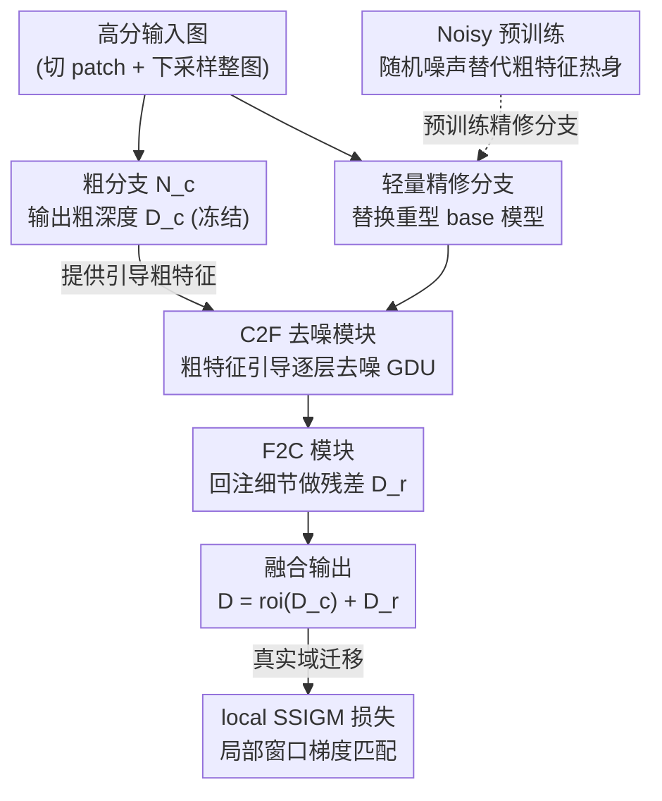

# PatchRefiner V2: Fast and Lightweight Real-Domain High-Resolution Metric Depth Estimation

**会议**: ICLR 2026  
**OpenReview**: [https://openreview.net/forum?id=AAqeYdGdn2](https://openreview.net/forum?id=AAqeYdGdn2)  
**代码**: 待确认  
**领域**: 3D视觉 / 单目深度估计  
**关键词**: 高分辨率深度估计, 度量深度, 轻量化, 特征去噪, 合成到真实迁移

## 一句话总结
PatchRefiner V2 把 tile-based 高分辨率度量深度框架里"又大又慢"的精修分支换成轻量编码器，再用一个 Coarse-to-Fine 去噪模块 + Noisy 预训练救回掉的精度，并在合成到真实迁移阶段用局部窗口梯度匹配损失提升边界质量——在 UnrealStereo4K 上做到比前代 SOTA 更准、参数少 9.2 倍、推理快 10.7 倍。

## 研究背景与动机
**领域现状**：单目深度估计的主流 SOTA（ZoeDepth、Depth Anything、Marigold 等）都构建在重型 backbone 上，因此只能吃 0.3 megapixel 级别的低分辨率输入。要支持 4K（2160×3840）原生分辨率，显存开销会爆炸。为了绕开这点，近年的高分辨率方案（PatchFusion、PatchRefiner，下文记为 PRV1）采用 tile-based 策略：把高分图切成若干 patch，逐块预测细节深度，再和下采样整图的粗深度融合，拼成一张一致的高分辨率深度图。

**现有痛点**：PRV1 这类框架在粗分支和精修分支里用的是**同一个重型 base 深度模型**。问题是精修分支要对每个 patch 跑一次前向，默认模式下单张高分图至少要 16 次前向。base 模型一大，就带来两个致命问题：(1) 单图推理时间超过 1 秒；(2) 显存需求极高，以至于端到端训练根本跑不动——PRV1 只能退而求其次，把全局分支和局部分支**分阶段顺序训练**，训练时间长且容易陷入阶段性局部最优，结果次优。

**核心矛盾**：精修分支才是效率瓶颈（它要跑十几次），但它又必须提供"深度对齐"的高质量特征。沿用重型 base 模型能保证特征质量，却牺牲速度和可训练性；直接换成轻量编码器能解决速度和端到端训练，却让特征变得"嘈杂"——即便经过 ImageNet 初始化和端到端训练，轻量编码器的特征仍是噪声重、难以解读的（论文 Fig. 2），原来的 Fine-to-Coarse（F2C）模块没法从这种特征里注入有用的高分辨率信息。

**本文目标**：在保留 tile-based 高分辨率优势的前提下，把精修分支换成轻量编码器以提速、减参、解锁端到端训练，同时补回因为换模型而丢掉的特征质量与深度预训练。

**核心 idea**：用"轻量编码器 + 粗分支特征引导去噪（C2F）+ Noisy 预训练"三件套替换重型精修分支，并在真实域迁移时用局部窗口的梯度匹配损失（local SSIGM）强化边界——把速度问题和精度问题分别用架构和损失两条线解决。

## 方法详解

### 整体框架
PRV2 沿用 PRV1 的双分支 tile-based 骨架：**粗分支** $N_c$ 处理下采样整图，输出全局粗深度 $D_c$，捕捉整体场景结构与尺度，训练后冻结；**精修分支**对每个裁剪 patch 输出残差深度 $D_r$，最终 patch 深度为 $D = \text{roi}(D_c) + D_r$。PRV2 的核心改动全在精修分支：把原来与 $N_c$ 同架构的重型 base 模型换成 MobileNetV4-Small / EfficientNet-B5 / ConvNeXt-Large（对应 PRV2M/E/C 三个量级）。

但轻量编码器吐出的特征是嘈杂的，于是在精修分支里搭一条**双向融合通路**：先用新提出的 Coarse-to-Fine（C2F）模块，借粗分支特征自底向上逐层去噪、增强精修特征；再用原有的 F2C 模块把去噪后的细粒度信息回注到粗深度做残差预测。为了让这条从零初始化的通路学得动，训练前先做 Noisy 预训练（NP）热身整个精修分支。真实域迁移阶段则在 DSD 损失里把伪标签监督升级为局部窗口的梯度匹配（local SSIGM）。

### 关键设计

**1. 轻量精修分支：把效率瓶颈直接换掉**

PRV1 慢和训不动的根因是精修分支沿用了重型 base 深度模型，而它每张图要跑 16 次。作者的处理简单直接：既然粗分支已经给了可靠的基础深度 $D_c$，精修分支没必要再背一个同样重的模型，于是把它替换成 MobileNetV4-Small、EfficientNet-B5 或 ConvNeXt-Large 这类轻量编码器。这一换立竿见影——以 PRV2M 为例，精修分支额外参数从 PRV1 的 369.0M 降到 47.0M，单图精修推理时间从 1.45s 降到 0.32s，且显存占用小到可以**端到端联合训练**粗分支与精修分支，摆脱 PRV1 必须分阶段训练的桎梏。代价是模型容量下降、丢掉了 base 模型自带的深度对齐特征，精修质量明显回落——后两个设计就是来补这个坑的。

**2. Coarse-to-Fine 模块与 Guided Denoising Unit：用粗特征当"门控"去噪精修特征**

轻量编码器的特征噪声大、缺乏深度对齐性（Fig. 2c），F2C 拿到这种特征没法注入有效高频信息。C2F 的思路是：既然粗分支提供了干净、深度对齐的全局特征，就让它来**引导挑选**精修分支里真正有用的细节。C2F 以自底向上（bottom-to-top）的 $N$ 层结构镜像 F2C，每层由一个残差卷积单元和一个 Guided Denoising Unit（GDU）组成。GDU 的机制是把对应分辨率的粗特征 $f_c$ 与精修 shortcut 特征 $f_s$ 拼接，过卷积块再经 sigmoid 得到一张取值 0~1 的权重图 $M_w$，然后逐元素相乘把噪声压下去：

$$M_w = \sigma(\text{CB}(\text{Cat}(f_c, f_s))), \qquad f_d = M_w \otimes f_s$$

其中 $f_d$ 是去噪后特征。本质上 $M_w$ 是一张由粗特征生成的空间门控掩码，逐层迭代地过滤掉与深度无关的噪声、保留有用高频，去噪后的特征再交给 F2C 注入粗深度，形成"C2F 先去噪 → F2C 再回注"的双向融合。消融显示加上 C2F 后 RMSE 降 12.2%，开销可接受。值得注意的是，若去掉 GDU 让 C2F 退化成普通自底向上聚合，提升大打折扣；若把 GDU 换成 F2C 那套融合模块，性能甚至跌回基线水平——作者归因于那样会让粗特征主导融合、压掉了高频信息。

**3. Noisy 预训练：让从零初始化的精修分支提前学会提深度特征**

PRV1 里精修分支约 94% 的参数来自预训练 base 模型，只有 F2C 从零训。换成轻量编码器后这层"红利"没了——即便预训练编码器，它也只占精修分支约 2%（PRV2M 是 1.3M vs 47.0M），剩下 98%（含 C2F、F2C）仍要从零学。NP 就是给整个精修分支（编码器 + C2F + F2C）做一次预训练热身。难点在于 C2F/F2C 都依赖粗分支特征，而预训练阶段不方便引入粗分支。作者的解法很巧：**直接用 $\mathcal{N}(0,1)$ 随机噪声替代粗特征喂进 GDU**，逼迫精修分支在没有粗分支引导的情况下，仅凭高分输入就学会提取深度相关特征。这样做不改动任何网络结构，预训练与正式训练阶段无缝衔接。消融里如果 NP 后只加载编码器参数（丢掉 C2F/F2C 的预训练权重），性能明显回落，说明 C2F/F2C 的预训练同样关键——这是深度估计社区常忽略的一点。

**4. 局部尺度-平移不变梯度匹配（local SSIGM）：在真实域迁移中专攻边界**

合成到真实迁移阶段，PRV1 用 DSD 损失里的尺度-平移不变（SSI）损失做伪标签监督，但它在全图上对齐，全局尺度偏差会污染高频细节的迁移。local SSIGM 把监督升级到**梯度域**且**局部窗口**计算。对每个训练 patch 随机采 $N$ 个边长 $\ell$ 的方窗 $\{\Omega_k\}$，每窗用最小二乘估一对局部尺度-平移 $(s_k, t_k)$ 对齐预测深度 $d$ 与教师伪标签 $\hat d$，然后只对对齐残差 $r_k(p) = s_k d(p) + t_k - \hat d(p)$ 求梯度的 L1：

$$L_{\text{local-SSIGM}} = \frac{1}{N}\sum_{k=1}^{N}\frac{1}{|\Omega_k|}\sum_{p\in\Omega_k}\big(|\nabla_x r_k(p)| + |\nabla_y r_k(p)|\big)$$

在局部窗口内对齐再匹配梯度，能削弱全局尺度偏差的影响，把模型注意力推向边界、细物体这类细粒度结构。与原始全局梯度匹配的区别有二：监督来自合成数据训练的教师伪标签；损失在局部窗口而非整图上算（令 $N=1$、$\Omega_1$ 为全图即退化为全局 SSIGM）。它在 Cityscapes 上把边界 F1 相对 PRV1 提升 25.1%，同时保持可比的尺度 RMSE。

### 损失函数 / 训练策略
合成数据上用 scale-invariant log 损失 $L_{\text{silog}}$ 训练。流程为：粗网络 $N_c$ 用 NYU-v2 预训练权重初始化、单独训 24 epoch；精修分支先做 96 epoch 的 Noisy 预训练；再端到端微调 48 epoch。真实域阶段先按合成同设置训完整 PRV2E，再用 DSD 损失（含 ranking、SSI、local SSIGM）微调 3 epoch，DSD 权重 0.8。

## 实验关键数据

### 主实验（UnrealStereo4K，P=16 模式）
†为对齐预训练设置的版本（去掉 PRV1/PF 用的非公开 Midas 预训练阶段以公平比较）；#param 与 T 指精修分支为高分估计额外引入的参数量与单图推理时间。

| 方法 | δ1(%)↑ | REL↓ | RMSE↓ | SiLog↓ | SEE↓ | #param↓ | T↓ |
|------|--------|------|-------|--------|------|---------|-----|
| ZoeDepth (粗 baseline) | 97.717 | 0.046 | 1.289 | 7.448 | 0.914 | - | - |
| ZoeDepth+PF† | 98.369 | 0.039 | 1.064 | 6.342 | 0.855 | 432.7M | 3.44s |
| ZoeDepth+PRV1† | 98.680 | 0.034 | 0.941 | 5.614 | 0.771 | 369.0M | 1.45s |
| **PRV2M** | 98.610 | 0.034 | 1.003 | 5.760 | 0.832 | **47.0M** | **0.32s** |
| **PRV2E** | 98.728 | 0.034 | 0.948 | 5.579 | 0.816 | 72.1M | 0.57s |
| **PRV2C** | **98.863** | **0.032** | **0.884** | **5.281** | 0.787 | 245.8M | 0.62s |

- PRV2M 相比粗 base 模型 RMSE 改善 22.2%，参数比 PatchFusion 小 9.2×、推理快 10.7×。
- PRV2E 与前代 SOTA PRV1 的 RMSE 相当（0.948 vs 0.941），但快 2.5×、小 5.1×。
- PRV2C 用 ConvNeXt 刷新 SOTA（RMSE 0.884），仍比 PRV1 快约 2.3×。

### 消融实验（架构设计，UnrealStereo4K）

| 配置 | RMSE | #param | T(s) | 说明 |
|------|------|--------|------|------|
| 粗 baseline | 1.289 | - | - | 仅粗分支 |
| ① 仅 F2C（轻量编码器替换） | 1.201 | 27.5M | 0.08s | 速度暴降但质量也降 |
| ② F2C 加参数扩容 | 1.214 | 70.2M | 0.38s | 单纯堆参数无效 |
| ③ ①+端到端训练 | 1.184 | 27.5M | 0.08s | E2E 有帮助 |
| ④ ③+C2F | 1.041 | 47.0M | 0.32s | C2F 使 RMSE 降 12.2% |
| ★ ④+NP（完整） | **1.003** | 47.0M | 0.32s | 最优 |
| ⑥ C2F 去掉 GDU | 1.137 | 34.5M | 0.19s | 退化为普通聚合，掉点明显 |
| ⑦ GDU 换成 F2C 融合 | 1.202 | 47.0M | 0.32s | 粗特征主导，跌回 ① 水平 |
| ⑧ NP 后只加载编码器 | 1.029 | 47.0M | 0.32s | C2F/F2C 预训练同样关键 |
| ⑨ 无 ImageNet 预训练 | 1.059 | 47.0M | 0.32s | 编码器预训练也重要 |

### 关键发现
- **C2F 中 GDU 是灵魂**：去掉 GDU（⑥，1.137）或把它换成 F2C 式融合（⑦，1.202）都大幅掉点，证明"粗特征当门控去噪"而非"粗特征主导融合"才是有效路径。
- **NP 不只是预训练编码器**：⑧（只载编码器 1.029）vs ★（1.003）说明 C2F/F2C 的预训练权重也不能丢，验证了 NP 设计动机。
- **local SSIGM 主要买边界**：Cityscapes 上它把边界 F1 从 27.98 推到 36.54（相对 PRV1 +25.1%），而尺度 RMSE 几乎不变（约 8.5），说明增益集中在高频边界。
- **窗口超参有甜点**：窗宽 $\ell=23$ 最优（F1 36.54），更大削弱局部性、更小缺乏上下文；窗口数超过 100 后性能饱和。

## 亮点与洞察
- **把"效率"和"精度"解耦成两条独立改进线**：架构侧（轻量编码器 + C2F + NP）解决速度与可训练性，损失侧（local SSIGM）解决边界质量，互不纠缠，工程上很干净。
- **用随机噪声替代粗特征做预训练**是个反直觉但优雅的 trick：既绕开了"预训练阶段引入粗分支"的难题，又不改动任何结构，逼模型自学深度特征，可迁移到其他"分支依赖外部引导、却想单独预训练"的场景。
- **GDU 本质是一张由引导信号生成的空间门控掩码**，这种"用干净模态门控嘈杂模态"的去噪范式，在多模态/多分支特征融合里都能借鉴。
- 揭示了一个常被忽视的点：换轻量 backbone 时，丢掉的不只是编码器的预训练，更是整条精修通路的深度对齐先验，必须显式补回。

## 局限与展望
- 评测主要在 UnrealStereo4K（合成）+ Cityscapes（真实）两个数据集上，真实域只验证了边界 F1，缺乏更多样真实场景（室内、夜间、多传感器）的度量精度验证。
- 粗分支始终冻结且依赖外部预训练权重（NYU-v2），整体性能上限仍受粗分支质量制约；论文未探讨粗分支也轻量化的可能。
- local SSIGM 引入窗口大小、窗口数、损失权重等超参，需要按数据集调（甜点 $\ell=23$ 未必通用）。
- Noisy 预训练用标准正态噪声替代粗特征是经验性选择，噪声分布与真实粗特征统计的差异对预训练效果的影响未深入分析。

## 相关工作与启发
- **vs PatchRefiner (PRV1)**：同为 tile-based 双分支、同用 DSD 做真实域迁移，但 PRV1 精修分支沿用重型 base 模型导致慢、训不动、要分阶段训练；PRV2 换成轻量编码器并用 C2F+NP 补特征质量、用 local SSIGM 升级边界监督，做到端到端训练且更快更准。
- **vs PatchFusion**：PatchFusion 同样用 tile-based 多分支重模型，参数 432.7M、推理 3.44s；PRV2M 参数 47.0M、0.32s，是 9.2× 减参、10.7× 提速。
- **vs Kwon & Kim (2025) 的 patch 一致性方法**：对方聚焦 grouped patch consistency 与 bias-free masking 解决 patch 间一致性，与本文聚焦"轻量架构做高效高分估计"正交互补。
- **vs Depth Anything V2 / Marigold 等重型 SOTA**：它们精度强但受限于低分辨率输入（ViT-L 在 V100 上只能跑约 0.75MP，Marigold 默认约 0.33MP），无法原生支持 4K；PRV2 用 tile-based 路线绕开分辨率瓶颈。

## 评分
- 新颖性: ⭐⭐⭐⭐ C2F/GDU 去噪 + Noisy 预训练 + 局部梯度匹配三处都是针对"轻量化代价"的具体且巧妙的解法，虽建立在 PRV1 框架上但改进实在。
- 实验充分度: ⭐⭐⭐⭐ 主表覆盖三个量级模型，架构/NP/损失消融详尽，窗口超参也扫了；但真实域只测了 Cityscapes 边界。
- 写作质量: ⭐⭐⭐⭐ 动机—矛盾—解法链条清晰，图表对照到位，公式表述明确。
- 价值: ⭐⭐⭐⭐ 把 4K 度量深度的推理从秒级压到 0.3s 量级且更准，对 AR/自动驾驶/3D 重建的实际部署很有意义。

<!-- RELATED:START -->

## 相关论文

- [\[CVPR 2026\] LiteSense: Lifting Lightweight ToF with RGB for High-Resolution Metric Depth Estimation](../../CVPR2026/3d_vision/litesense_lifting_lightweight_tof_with_rgb_for_high-resolution_metric_depth_esti.md)
- [\[CVPR 2026\] Radar-Guided Polynomial Fitting for Metric Depth Estimation](../../CVPR2026/3d_vision/radar-guided_polynomial_fitting_for_metric_depth_estimation.md)
- [\[ICLR 2026\] Fast Estimation of Wasserstein Distances via Regression on Sliced Wasserstein Distances](fast_estimation_of_wasserstein_distances_via_regression_on_sliced_wasserstein_di.md)
- [\[CVPR 2026\] The Midas Touch for Metric Depth](../../CVPR2026/3d_vision/the_midas_touch_for_metric_depth.md)
- [\[CVPR 2026\] MD2E: Modeling Depth-to-Edge Cues for Monocular Metric Depth Estimation](../../CVPR2026/3d_vision/md2e_modeling_depth-to-edge_cues_for_monocular_metric_depth_estimation.md)

<!-- RELATED:END -->
