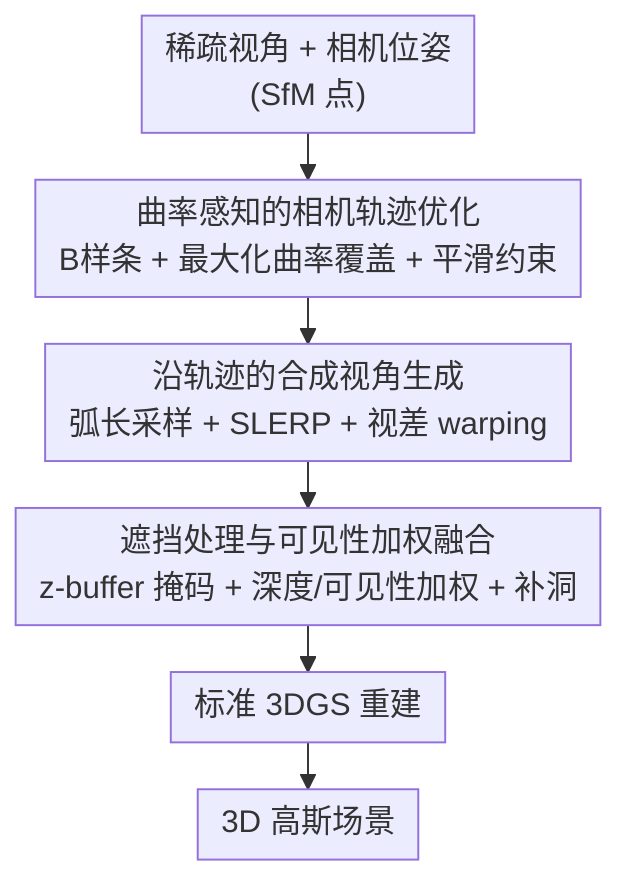

# Path Matters: Unveiling Geometric Implicit Bias via Curvature-Aware Sparse View Optimization

**会议**: ICLR 2026  
**OpenReview**: [https://openreview.net/forum?id=egE7czf8qg](https://openreview.net/forum?id=egE7czf8qg)  
**代码**: 待确认  
**领域**: 3D视觉  
**关键词**: 稀疏视角重建, 3D高斯泼溅, 相机轨迹优化, 曲率覆盖, 隐式偏置

## 一句话总结
这篇论文揭示了稀疏视角下 3DGS 存在两类几何隐式偏置——对高曲率区域监督需求更强、对输入视角轨迹的平滑度敏感——并据此提出一套"曲率感知的相机轨迹优化 + 合成视角生成"框架，让伪标签视角既覆盖更多曲面细节又保持平滑，在 DTU、Mip-NeRF 360、Tanks & Temples 等多个数据集上把稀疏视角重建的渲染质量与几何精度推到 SOTA。

## 研究背景与动机
**领域现状**：3D 高斯泼溅（3DGS）用一组各向异性高斯椭球建模场景，再通过深度排序 + alpha 混合直接光栅化到屏幕，渲染近乎实时，已成为新视角合成的主流表示。在密集视角输入下它效果很好。

**现有痛点**：但现实采集往往只能拿到稀疏视角（密集采样昂贵、嘈杂甚至不可行）。稀疏视角下 3DGS 会出现几何不准、跨视角不一致、空间/光度属性失真等问题。为缓解，已有方法主要靠多视角一致性：把已知视角的 3D 点重投影或 warp 到未观测视角，造伪标签来增强监督。

**核心矛盾**：这些"补监督"的方法没触及更深的根因——3DGS 算法本身对**数据分布与采样方式**存在固有的归纳偏置。场景表示如何被重建、视角如何被排布，这两者之间的相互作用一直被忽视。换句话说，伪标签视角"放在哪、怎么连"，会系统性地影响重建质量，而非随便补几张就行。

**切入角度**：作者先做了一组探索性实验（在 Blender LEGO 场景上用 9 张图，比较红/蓝/橙/绿四条不同相机轨迹），观察到两个清晰规律：(1) **几何细节优先偏置**——在高曲率区域（边、角等复杂几何）多采样能显著降低重建误差；(2) **轨迹平滑度偏置**——相机轨迹越平滑（二阶导越小），重建越稳定，急转/抖动的轨迹会引入更大误差。绿色平滑轨迹拿到最高 PSNR（24.22），橙色抖动轨迹最差（19.63）。

**核心 idea**：既然伪标签视角的"曲率覆盖"和"轨迹平滑度"共同决定稀疏重建质量，那就把生成伪标签的相机轨迹当成优化对象——**在保证轨迹平滑的约束下，最大化对场景曲面曲率的覆盖**，再沿这条优化轨迹合成高质量的新视角喂给 3DGS。

## 方法详解

### 整体框架
方法要解决的是"稀疏视角下给 3DGS 补什么样的伪标签视角"。整体管线分两大组件串行：先从稀疏相机位姿出发，生成一条**最大化曲率覆盖又保持平滑**的最优相机轨迹；再沿该轨迹采样一批合成相机位姿，用基于视差的 warping 把已知视角的像素插值到这些新位姿、并处理遮挡，得到一批高信息量的合成视角；最后把"原始稀疏视角 + 合成视角"一起交给标准 3DGS 完成重建。整个框架是即插即用的——它不改 3DGS 内核，只优化输入数据，因此能套在 3DGS、SCGaussian、MVPGS 等多种 backbone 上。

### 关键设计

**1. 曲率感知的相机轨迹优化：让伪标签视角既多看高曲率细节又走得平滑**

这一步直接对应前面发现的两个偏置。给定稀疏图像序列 $\{(V_i, I_i, t_i)\}_{i=1}^N$，先把相机位置按时间戳线性连成初始轨迹 $\gamma_0(t)$，再用 B 样条把它参数化为 $\gamma(t)=\sum_j N_j(t)Q_j$，其中 $Q_j$ 是可优化的控制点、$N_j(t)$ 是基函数——这样轨迹形状就由一组控制点连续可调。为了"看清细节"，作者在物体表面计算曲率：用主曲率 $\kappa_1,\kappa_2$ 定义平均曲率 $H(x)=\frac{\kappa_1(x)+\kappa_2(x)}{2}$，并把轨迹点处的曲率定义为它对应曲面点的平均曲率 $\kappa(\gamma(t))=H(x(\gamma(t)))$（平均曲率对边、角这类高几何复杂度区域响应强）。

优化被写成一个带约束的泛函问题：目标是最大化沿轨迹的曲率加权弧长 $\max_Q \int w(\gamma(t))\,\|\gamma'(t)\|\,dt$，其中权重 $w(\gamma(t))=\alpha\cdot\kappa(\gamma(t))+\beta$ 让相机在高曲率处"多走多停"。约束则把两个偏置都钉死：平滑性约束 $\int \|\gamma''(t)\|^2 dt \le \epsilon$ 压住二阶导（即抑制急转）；$\gamma(t_i)=V_i$ 强制轨迹穿过原始相机位置；$\|\gamma'(t)\|\ge v_{\min}$ 防止相机在某处停滞；$\kappa(\gamma(t))\ge \kappa_{\min}$ 在高复杂区强制最低曲率覆盖；还有一项 $\int(\|\gamma'(t)\|-\|\gamma_0'(t)\|)^2 dt\le\delta$ 限制优化轨迹别偏离初始轨迹太远。整个问题用 L-BFGS 求解。和"随便重投影造伪标签"的旧做法相比，这里第一次把"伪标签视角放在哪"显式建模成一个可优化、可约束的几何问题，直接对症两个偏置。

**2. 沿轨迹的合成视角生成：把已知像素以视差方式插值到新位姿**

有了最优轨迹 $\gamma^*(t)$，还需要在它上面真正"拍"出合成图像来当伪标签。作者按**弧长参数化**采样 $M$ 个时间戳，使相邻合成视角的基线大致均匀（避免疏密不均又制造新的采样偏置）。每个合成相机位姿 $V_j^*=(P_j^*, R_j^*, K_j)$ 的位置取 $P_j^*=\gamma^*(t_j)$，朝向用相邻两个真实视角朝向的球面线性插值 $R_j^*=\mathrm{SLERP}(R_a,R_b;\lambda_j)$，内参 $K_j$ 继承时间上最近的真实视角。

合成图像本身靠基于视差的 warping：对每个真实源视角 $I_i$ 用其（经两阶段精修的）深度图 $D_i$，把像素反投影成 3D 点 $x_i(u_i)=D_i(u_i)K_i^{-1}\bar u_i$，再用相对位姿 $(R_{ij},t_{ij})$ 变换到目标相机 $j$ 并投影得到目标像素坐标，用双三次插值在源图上取色 $\tilde I_i(u_j)$。这一步把"造视角"从纯几何重投影升级成带深度与视差的图像合成，能给 3DGS 提供光度上更逼真的监督。

**3. 遮挡处理与可见性加权融合：消融里最关键的一环**

单纯把多个源视角 warp 过来会有重影、遮挡边界错位。作者把最终合成图像写成所有 warped 源的**深度+可见性加权混合**：

$$I_j^*(u)=\frac{\sum_{i=1}^N w_{ij}(u)\,\tilde I_i(u)}{\sum_{i=1}^N w_{ij}(u)},\quad w_{ij}(u)=M_{ij}(u)\,e^{-\lambda_d|D_i(u)-z_{ij}(u)|}\max(0,\langle v_i,v_j\rangle)$$

权重里三项各司其职：$M_{ij}$ 是带小容差的 z-buffer 可见性掩码，抑制被遮挡像素造成的重影；$e^{-\lambda_d|D_i-z_{ij}|}$ 按深度一致性加权，warp 后深度与目标深度越吻合越可信；$\max(0,\langle v_i,v_j\rangle)$ 按视线方向夹角加权，朝向越接近目标的源贡献越大。混合后残留的小空洞再用边缘感知、深度引导的 inpainting 补上。消融显示，去掉遮挡处理会让 PSNR 直接掉约 2.5、CD 升约 0.5，是所有组件里最敏感的一项——说明伪标签的"干净程度"对稀疏 3DGS 至关重要。

### 损失函数 / 训练策略
轨迹优化用 L-BFGS 求解带约束的样条优化问题；3DGS 部分用 Adam（学习率 $1\times10^{-4}$）训练 150k 次迭代，batch size 2048，在 NVIDIA A100 上完成。高斯参数 $\{p,c,\alpha\}$ 直接从稀疏视角估计初始化。整体训练开销相对 MVS 初始化的 3DGS 很小。

## 实验关键数据

### 主实验
在 Mip-NeRF 360（12 视角）和 Tanks & Temples（3 视角）上，本方法及其即插即用变体超过一众稀疏视角 SOTA：

| 数据集 | 指标 | 本文 (3DGS+Ours / MVPGS+Ours) | 之前最佳 | 说明 |
|--------|------|------|----------|------|
| Mip-NeRF 360 (12 views) | PSNR ↑ | 20.15 | 19.85 (MVPGS) | 套在 MVPGS 上最高 |
| Mip-NeRF 360 (12 views) | LPIPS ↓ | 0.41 | 0.43 (SCGaussian) | 感知质量更好 |
| Tanks & Temples (3 views) | PSNR ↑ | 26.41 | 25.57 (MVPGS) | 3DGS+Ours 即提升 +0.84 dB |

在 DTU 上按训练比例 $\alpha$（用图占比）评测，几何精度（Chamfer Distance）与图像质量同步领先：

| 配置 | PSNR ↑ | CD ↓ | LPIPS ↓ |
|------|--------|------|---------|
| NexusGS (CVPR'25), α=0.4 | 27.10 | 3.18 | 0.20 |
| **Ours, α=0.4** | **27.89** | **3.01** | **0.18** |
| **Ours, α=0.2** | **27.05** | **3.49** | **0.21** |

极端稀疏（3 视角）下，DTU 取得最高 PSNR 20.65 / SSIM 0.891，LLFF 取得最高 PSNR 20.93。作为插件套到 SCGaussian 上，Tanks & Temples 提升约 0.85 dB，验证了模型无关的即插即用特性。

### 消融实验
DTU 上逐组件移除（PSNR / CD，α=0.2）：

| 配置 | PSNR ↑ | CD ↓ | 说明 |
|------|--------|------|------|
| Ours (完整) | 27.05 | 3.49 | — |
| w/o 最优轨迹生成 | 24.20 | 5.12 | 掉 2.85 dB，曲率覆盖+平滑最关键 |
| w/o 合成视角构建 | 24.38 | 4.98 | 缺伪标签密度，高比例下更差 |
| w/o 平滑约束 | 25.84 | 3.98 | 验证轨迹平滑度偏置 |
| w/o 遮挡处理 | 24.58 | 5.10 | PSNR 掉约 2.5、CD 升约 0.5 |

### 关键发现
- **轨迹优化整体贡献最大**：去掉"最优轨迹生成"在 α=0.2 上掉 2.85 dB，直接印证"曲率覆盖 + 平滑"是稀疏重建的核心杠杆。
- **遮挡处理是最敏感的单点**：它单独移除就让 PSNR 掉约 2.5、CD 升约 0.5，说明伪标签视角"干净"比"多"更重要。
- **效率友好**：相比 MVS 初始化的 3DGS，本方法以小得多的训练开销换来更高质量——室外比 SfM 初始化基线高 +3.11 dB 且保持实时渲染；室内 75 分钟达 35.44 PSNR。

## 亮点与洞察
- **把"机制分析"变成"优化目标"**：先用受控实验把 3DGS 的两个隐式偏置量化出来（高曲率需更多监督、轨迹需平滑），再把这两条直接写进轨迹优化的目标与约束——分析与方法严丝合缝，不是事后凑动机。
- **优化"数据"而非"模型"**：方法完全不动 3DGS 内核，只优化喂进去的伪标签视角，因此天然即插即用，能给 SCGaussian、MVPGS 等现成 backbone 直接加分。
- **曲率加权弧长这个目标很巧**：$\int w(\gamma(t))\|\gamma'(t)\|dt$ 把"在高曲率处多采样"自然编码成沿轨迹的加权路程，配合最低速度/最低曲率约束，既不会在平坦区浪费视角也不会在细节区采样不足，这个思路可迁移到任何"主动视角规划"任务。

## 局限与展望
- **依赖深度图质量**：视差 warping 需要每个源视角的逐像素深度（两阶段精修），深度估计差时合成视角会引入错误监督，论文把深度精修细节放在附录、正文未充分讨论其失败模式。
- **曲率/几何特征的获取**：轨迹优化要在物体表面算曲率，意味着需要一个初步的几何代理，极稀疏或无纹理场景下曲率估计本身可能不准，存在"鸡生蛋"风险（⚠️ 论文未明确说明初始曲面来源，以原文为准）。
- **超参较多**：$\alpha,\beta,\epsilon,\delta,v_{\min},\kappa_{\min},\lambda_d$ 等约束/权重项不少，跨数据集的鲁棒性与调参成本未给系统性分析。
- **改进方向**：把深度与轨迹联合迭代优化、或用学习式的可见性/置信度替代手工 z-buffer 容差，可能进一步降低对深度先验的依赖。

## 相关工作与启发
- **vs 重投影/warp 伪标签类方法（如 SparseNeRF、SCGaussian）**: 它们造伪标签时不管视角"放在哪、怎么连"，本文指出这恰恰决定了重建质量，把伪标签视角的轨迹显式优化为"高曲率覆盖 + 平滑"，从根因上对症 3DGS 偏置。
- **vs 深度先验类稀疏方法（DNGaussian、SparseGS）**: 它们靠预训练深度做正则，本文则把深度用于视差 warping 合成新视角、并叠加曲率感知的轨迹规划，二者互补，且本文是即插即用插件可叠加在这些 backbone 上。
- **vs 主动视角选择 / NeRF 主动学习**: 思路同源（决定下一个看哪），但本文把它落到稀疏 3DGS 的伪标签生成，并给出曲率覆盖与轨迹平滑这两条可量化的几何准则。

## 评分
- 新颖性: ⭐⭐⭐⭐⭐ 首次量化稀疏 3DGS 的两类几何隐式偏置并把它们转成轨迹优化目标，角度新且自洽。
- 实验充分度: ⭐⭐⭐⭐ 覆盖 5 个数据集、多训练比例、即插即用验证与消融，但深度估计失败模式和超参鲁棒性分析略欠。
- 写作质量: ⭐⭐⭐⭐ 从受控实验到方法推导逻辑清晰，公式完整；部分实现细节（深度精修、曲面来源）下放附录。
- 价值: ⭐⭐⭐⭐⭐ 模型无关的即插即用模块，对稀疏视角 3DGS 这一高频实际场景有直接增益。

<!-- RELATED:START -->

## 相关论文

- [\[ICLR 2026\] Neural Compression of 3D Meshes using Sparse Implicit Representation](neural_compression_of_3d_meshes_using_sparse_implicit_representation.md)
- [\[CVPR 2026\] Intrinsic Geometry-Appearance Consistency Optimization for Sparse-View Gaussian Splatting](../../CVPR2026/3d_vision/intrinsic_geometry-appearance_consistency_optimization_for_sparse-view_gaussian_.md)
- [\[AAAI 2026\] Opt3DGS: Optimizing 3D Gaussian Splatting with Adaptive Exploration and Curvature-Aware Exploitation](../../AAAI2026/3d_vision/opt3dgs_optimizing_3d_gaussian_splatting_with_adaptive_exploration_and_curvature.md)
- [\[ICLR 2026\] Test-Time Optimization of 3D Point Cloud LLM via Manifold-Aware In-Context Guidance and Refinement](test-time_optimization_of_3d_point_cloud_llm_via_manifold-aware_in-context_guida.md)
- [\[CVPR 2026\] SMVRT: Implicit Human 3D Modeling Using Sparse Multi-View Volumetric Reconstruction with Transformer Fusion](../../CVPR2026/3d_vision/smvrt_implicit_human_3d_modeling.md)

<!-- RELATED:END -->
