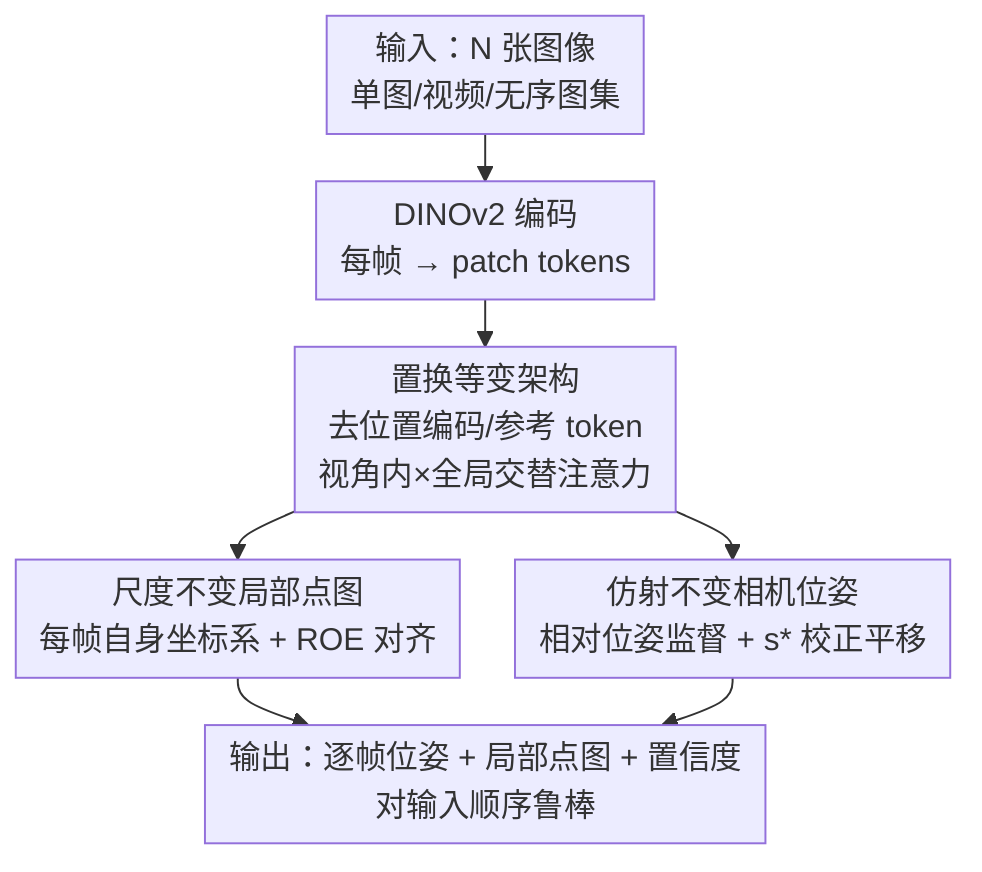

# $\pi^3$: Permutation-Equivariant Visual Geometry Learning

**会议**: ICLR 2026  
**OpenReview**: [https://openreview.net/forum?id=DTQIjngDta](https://openreview.net/forum?id=DTQIjngDta)  
**代码**: https://github.com/yyfz/Pi3  
**领域**: 3D视觉  
**关键词**: 视觉几何重建, 置换等变, 前馈三维重建, 相机位姿估计, 点云重建

## 一句话总结
$\pi^3$ 提出一个完全置换等变的前馈网络，彻底丢掉「固定参考视角」这个延续自传统 SfM 的归纳偏置，改为预测每帧自己坐标系下的「仿射不变相机位姿 + 尺度不变局部点图」，从而对输入顺序天然鲁棒，并在相机位姿、单目/视频深度、稠密点图等多个任务上刷新 SOTA，同时跑到 57.4 FPS。

## 研究背景与动机
**领域现状**：从图像直接重建三维结构是计算机视觉的老问题。传统做法靠 SfM / MVS 加 Bundle Adjustment 迭代优化，鲁棒但流程多阶段、慢。近年 DUSt3R 及其后继（Fast3R、FLARE、VGGT 等）用前馈神经网络一次前向就回归出几何，把速度和易用性拉了上来。

**现有痛点**：无论传统还是现代方法，都共享一个隐藏假设——必须**选一个固定参考视角**，把它的相机坐标系当作全局坐标系，所有其它视角的几何都锚定到它身上。DUSt3R 把点云定义在第一张图的坐标系里；VGGT 用一个专门的 camera token / 参考嵌入来标记参考帧。

**核心矛盾**：这个「参考帧」是人为指定的、武断的。作者通过实验证明，包括 SOTA 的 VGGT 在内，重建质量对参考视角的选择高度敏感——换一个参考帧，精度（Acc/Comp）可能从 0.12 暴跌到 0.95（图 2）。也就是说，重建结果不应该依赖却实际严重依赖于「先看哪张图」，这是一个限制鲁棒性的有害归纳偏置。

**本文目标**：能不能造一个根本不需要参考视角的网络，让重建结果对输入顺序、对「谁当第一帧」完全不敏感？

**切入角度**：作者意识到，参考帧之所以存在，是因为模型要输出一个统一全局坐标系下的几何。如果改成让**每帧只预测自己坐标系下的局部几何**（局部点图）和**视角之间的相对位姿**，全局坐标系就不再需要，参考帧问题也就不复存在。

**核心 idea**：用「置换等变架构 + 每帧局部、相对监督」替代「固定参考视角 + 全局坐标系」，把对输入顺序的不变性做进网络结构里，而不是靠后处理对齐。

## 方法详解

### 整体框架
$\pi^3$ 是一个前馈网络 $\phi$，输入是 $N$ 张图像的序列 $S=(I_1,\dots,I_N)$（可以是单图、视频、无序图集，动态/静态都行），输出是每张图对应的三元组：相机位姿 $T_i\in SE(3)$、定义在该帧自身相机坐标系下的像素对齐点图 $X_i\in\mathbb{R}^{H\times W\times 3}$、以及置信度图 $C_i$。

整个 pipeline 故意「去掉一切跟顺序有关的部件」：用 DINOv2 把每张图编码成 patch token；这些 token 经过交替的「视角内自注意力」和「全局自注意力」层（这一交替结构借鉴 VGGT），让信息在帧内和跨帧之间流动；最后解码器吐出位姿、局部点图和置信度。关键在于，这里**没有**帧索引的位置编码，也**没有**标记参考帧的特殊可学习 token——正是这两样东西在以往方法里破坏了置换等变性。结果是网络满足 $\phi(P_\pi(S))=P_\pi(\phi(S))$：打乱输入顺序，输出会被同样地打乱，但每张图对应的几何/位姿本身不变。训练侧则用两个「相对/局部」的监督把全局坐标系彻底抹掉：点图用尺度不变监督，位姿用仿射不变（相对位姿）监督。

### 关键设计

**1. 置换等变架构：把「顺序无关」做进结构里，而不是事后对齐**

针对「换参考帧就崩」这个痛点，作者要求网络 $\phi$ 对任意排列 $P_\pi$ 满足等变性 $\phi(P_\pi(S))=P_\pi(\phi(S))$（式 2–3）。做法不是加约束，而是**减部件**：删掉用来区分帧次序的位置编码，删掉像 VGGT 那种指定参考视角的 camera token，只保留 DINOv2 编码 + 交替的视角内/全局自注意力（自注意力对 token 顺序本身就是置换等变的）。这样每张输入图和它的输出之间就有一个稳定的一一对应，重建质量与「谁当参考」无关。区别于以往「先选参考帧 → 全局对齐」的范式，这里参考帧从一开始就不存在，因此既消除了选错参考帧的失败模式，对噪声/不确定观测也更鲁棒。

**2. 尺度不变局部点图：每帧只管自己坐标系，绕开单目尺度歧义**

去掉全局坐标系后，每帧的点图 $\hat X_i$ 定义在自己的局部相机坐标系里，但单目重建固有的尺度歧义还在。作者让网络只预测「相差一个未知但全序列一致的尺度因子」的点云，训练时再求一个最优尺度 $s^*$ 把预测对齐到 GT。$s^*$ 通过最小化深度加权 $L_1$ 距离得到：

$$s^*=\arg\min_s \sum_{i=1}^{N}\sum_{j=1}^{H\times W}\frac{1}{z_{i,j}}\lVert s\hat x_{i,j}-x_{i,j}\rVert_1$$

其中 $z_{i,j}$ 是 GT 深度，用 MoGe 的 ROE solver 求解。点云损失 $L_{points}$ 用 $s^*$ 计算同样的深度加权 $L_1$。此外加了一个法向损失 $L_{normal}$（用相邻像素叉乘得到法向，最小化与 GT 法向夹角 $\arccos(\hat n\cdot n)$）鼓励局部平滑表面；置信度 $C_i$ 则用 BCE 监督——当某点的 $L_1$ 重建误差低于阈值 $\epsilon$ 时目标设为 1，否则 0。这样「局部+尺度不变」让模型不必预测绝对尺度，只需把各帧几何放在统一尺度下即可。

**3. 仿射不变相机位姿：用相对位姿监督消掉全局参考系歧义**

置换等变 + 尺度歧义意味着输出位姿只能确定到一个相似变换（刚体 + 单一全局尺度）。为此作者**不监督绝对位姿，而监督视角间的相对位姿** $\hat T_{i\leftarrow j}=\hat T_i^{-1}\hat T_j$（式 7）。相对旋转对全局变换天然不变，但相对平移的尺度仍歧义——这里复用点图对齐求出的同一个 $s^*$ 去校正所有预测平移，使旋转和「校正后尺度的平移」都能被直接监督。相机损失 $L_{cam}$ 在所有有序视角对 $(i\neq j)$ 上平均，旋转用测地角损失 $\arccos\big(\frac{\mathrm{Tr}(R^\top\hat R)-1}{2}\big)$，平移用对离群点鲁棒的 Huber 损失 $H_\delta(s^*\hat t_{i\leftarrow j}-t_{i\leftarrow j})$。作者还观察到，这种无参考的相对建模天然契合真实相机轨迹的低维流形结构（绕物体转→球面、车载→曲线），特征值分析显示其预测位姿的方差集中在比 VGGT 更少的主成分上。

### 损失函数 / 训练策略
端到端训练，总损失是点图、法向、置信度、相机四项的加权和：

$$L = L_{points} + \lambda_{normal}L_{normal} + \lambda_{conf}L_{conf} + \lambda_{cam}L_{cam}$$

为保证泛化与广覆盖，模型在 **15 个数据集**的大规模聚合上训练，涵盖室内外、合成与真实、静态与动态场景（GTA-SfM、CO3D、WildRGB-D、Habitat、ARKitScenes、TartanAir、ScanNet/ScanNet++、BlendedMVG、MatrixCity、MegaDepth、Hypersim、Taskonomy、Mid-Air 以及一个内部动态场景数据集）。

## 实验关键数据

### 主实验
$\pi^3$ 在相机位姿、点图、视频/单目深度四类任务上整体取得 SOTA 或可比结果，且模型更小、更快（959M 参数，57.4 FPS）。

相机位姿估计（节选 Sintel / RealEstate10K，越低/越高越好按箭头）：

| 数据集 | 指标 | VGGT | $\pi^3$ |
|--------|------|------|---------|
| Sintel | ATE ↓ | 0.167 | **0.074** |
| Sintel | RPE-t ↓ | 0.062 | **0.040** |
| RealEstate10K | AUC ↑ | 77.62 | **85.90** |
| Co3Dv2 | RTA ↑ | 97.13 | **97.33** |

视频深度估计（Abs Rel ↓ / FPS）：

| 数据集/指标 | DUSt3R | VGGT | $\pi^3$ |
|------|--------|------|---------|
| Sintel Abs Rel ↓ | 0.662 | 0.299 | **0.233** |
| Bonn Abs Rel ↓ | 0.151 | 0.057 | **0.049** |
| KITTI Abs Rel ↓ | 0.143 | 0.062 | **0.038** |
| FPS ↑ | 1.25 | 43.2 | **57.4** |

点图重建在 DTU / ETH3D / 7-Scenes / NRGBD 上同样多数指标领先；单目深度则与专门的 MoGe 接近，尽管 $\pi^3$ 并非为单帧深度优化。

### 消融实验
作者定义两个削弱版本：Model 1（去掉仿射不变位姿 + 尺度不变点图）、Model 2（仅去掉仿射不变位姿），与 Full Model 在点图重建上对比（节选 ETH3D / NRGBD，Acc/Comp ↓）：

| 配置 | ETH3D Acc.↓ | ETH3D Comp.↓ | NRGBD Acc.↓ | 说明 |
|------|------|------|------|------|
| Model 1 | 0.229 | 0.166 | 0.034 | 无尺度不变点图 + 无仿射不变位姿 |
| Model 2 | 0.197 | 0.118 | 0.031 | 仅去仿射不变位姿 |
| Full Model | **0.131** | **0.079** | **0.028** | 完整模型 |

置换鲁棒性（对每条 N 帧序列轮流换首帧跑 N 次，统计指标标准差，越低越鲁棒）：

| 方法 | DTU Acc. std.↓ | ETH3D Acc. std.↓ |
|------|------|------|
| VGGT | 0.033 | 0.049 |
| $\pi^3$ | **0.003** | **0.000** |

### 关键发现
- 仿射不变位姿建模带来的不只是精度提升，更关键是它让模型真正**置换等变**——标准差比 VGGT 低几个数量级，ETH3D 上几乎为零，证明顺序无关不是口号而是结构保证。
- 尺度不变点图在室内（7-Scenes/NRGBD）增益不明显，但在室外提升显著，与「室外场景受尺度歧义影响更大」的已有结论一致。
- 去掉参考帧偏置后，模型在零样本数据（Sintel、RealEstate10K）上泛化尤其强，同时在 in-domain 数据上不掉点。

## 亮点与洞察
- **把鲁棒性问题归因到「参考帧」这个被忽视的归纳偏置**，是全文最「啊哈」的地方：大家都在堆数据、堆任务，作者却指出 SOTA 的脆弱来自一个延续自经典 SfM 的默认设定，并用换参考帧崩盘的实验把它钉死。
- **等变性靠「删部件」而非「加约束」**：删掉位置编码和参考 token，让自注意力的天然置换等变性直接生效——这种「少即是多」的设计干净且可迁移到其它需要顺序无关的多视角任务。
- **一个 $s^*$ 同时服务点图和位姿**：点图对齐求出的最优尺度因子被复用来校正相机平移，把两个看似独立的歧义（点云尺度、平移尺度）用一个量统一解决，设计很省。
- **低维轨迹流形洞察**：相对位姿建模天然贴合真实相机运动的低维结构，这是无参考表述顺带带来的好处，也解释了为何位姿更稳。

## 局限与展望
- 单目深度上仍略逊于专门优化的 MoGe，说明「多帧通用」与「单帧极致」之间还有取舍空间。
- 尺度不变点图对室内场景增益有限，方法收益依赖场景的尺度歧义程度。
- 论文主要展示前馈重建质量与鲁棒性，但对极大规模视角集（上千帧）下全局自注意力的显存/算力开销、以及动态场景中运动物体的处理细节着墨较少，可作为后续工程化方向。
- 依赖 15 个数据集的大规模聚合训练，复现成本高；置信度阈值 $\epsilon$ 等超参对结果的敏感性未充分讨论。

## 相关工作与启发
- **vs VGGT**：VGGT 用 camera token / 参考嵌入标记参考帧，借多任务 + 大数据冲精度；$\pi^3$ 去掉这些顺序相关部件，改为局部+相对监督，结果是对参考帧不敏感（标准差低几个数量级）、更小更快，并在多数任务上反超。
- **vs DUSt3R / Fast3R**：DUSt3R 把点云定义在第一张图坐标系、需要后续全局对齐；Fast3R 能同时处理上千图但仍锚定参考结构。$\pi^3$ 彻底取消全局坐标系，每帧只预测自身坐标系几何，省掉脆弱的对齐阶段。
- **vs FLARE**：FLARE 先估位姿再估几何、仍依赖参考视角；$\pi^3$ 用统一置换等变骨干联合输出位姿与点图，避免分阶段误差累积，也不引入参考偏置。

## 评分
- 新颖性: ⭐⭐⭐⭐⭐ 把「参考帧偏置」识别并系统性消除，视角独到且影响面大
- 实验充分度: ⭐⭐⭐⭐⭐ 四类任务多数据集 + 置换鲁棒性 + 消融，论证完整
- 写作质量: ⭐⭐⭐⭐⭐ 动机—方法—实验逻辑清晰，图 2 / 图 4 很有说服力
- 价值: ⭐⭐⭐⭐⭐ 又快又稳又准的通用前馈几何重建，工程落地价值高

<!-- RELATED:START -->

## 相关论文

- [\[ICLR 2026\] Quantized Visual Geometry Grounded Transformer](quantized_visual_geometry_grounded_transformer.md)
- [\[ICLR 2026\] FastVGGT: Fast Visual Geometry Transformer](fastvggt_fast_visual_geometry_transformer.md)
- [\[CVPR 2026\] Flow3r: Factored Flow Prediction for Scalable Visual Geometry Learning](../../CVPR2026/3d_vision/flow3r_factored_flow_prediction_for_scalable_visual_geometry_learning.md)
- [\[ICLR 2026\] Ctrl&Shift: High-Quality Geometry-Aware Object Manipulation in Visual Generation](ctrlshift_high-quality_geometry-aware_object_manipulation_in_visual_generation.md)
- [\[ICLR 2026\] CloDS: Visual-Only Unsupervised Cloth Dynamics Learning in Unknown Conditions](clods_visual-only_unsupervised_cloth_dynamics_learning_in_unknown_conditions.md)

<!-- RELATED:END -->
