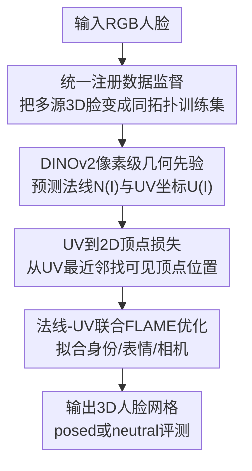

# Pixel3DMM: Versatile Screen-Space Priors for Single-Image 3D Face Reconstruction

**会议**: ICLR2026  
**OpenReview**: [https://openreview.net/forum?id=UmOdd5KQ8K](https://openreview.net/forum?id=UmOdd5KQ8K)  
**代码**: 待公开  
**领域**: 3D视觉 / 单图3D人脸重建  
**关键词**: 3D人脸重建, 3DMM, FLAME, 表面法线, UV坐标

## 一句话总结
Pixel3DMM 用 DINOv2 驱动的像素级法线与 UV 坐标先验约束 FLAME 优化，在单张图像尤其是夸张表情场景下显著提升 3D 人脸重建精度，并提出同时评测 posed 与 neutral 几何的新基准。

## 研究背景与动机
**领域现状**：单图 3D 人脸重建常见路线有两类：一类直接回归 3DMM / FLAME 参数，速度快、训练可扩展；另一类在测试时优化 3DMM，使投影后的模型与图像观测、关键点或密集对应关系对齐。3DMM 本身提供了低维、可解释的人脸身份与表情空间，因此很适合动画、AR/VR、视频会议和数字人等后续任务。

**现有痛点**：单张 RGB 图像里缺少深度，光照、阴影、肤色纹理又会和几何形变混在一起。稀疏 landmark 对嘴唇、脸颊、强侧脸等区域约束不够，photometric loss 容易被反照率和光照骗过；直接回归参数的方法虽然方便，但在强表情输入上容易欠拟合或过拟合表情，难以恢复真实 posed 几何。

**核心矛盾**：人脸重建既需要 3DMM 的结构先验来避免无约束的 3D 歧义，又需要比 landmark 更密、更几何化的图像证据来告诉优化器“这张脸现在到底鼓起、张开、转到哪里”。如果只相信 3DMM，表情细节会被压平；如果只相信图像颜色，优化又会被纹理和光照牵着走。

**本文目标**：作者希望从单张图像中预测两类屏幕空间几何线索：每个可见像素的表面法线，以及每个像素对应到 FLAME 模板的 UV 坐标。然后把这两类线索转成 FLAME 拟合时的约束，最终同时恢复身份、表情、下颌、相机位姿与内参。

**切入角度**：本文观察到 DINOv2 这类 foundation model 已经有很强的泛化视觉特征，但它本身不直接输出 3D 人脸几何。与其从零训练一个庞大 3D 网络，不如把 DINOv2 微调成“人脸几何专家”，用高质量 3D 人脸数据监督它预测像素对齐的几何 cue。

**核心 idea**：用面向人脸的像素级法线和 UV 预测替代稀疏 landmark / 纯 photometric 约束，把单图重建问题改写成由屏幕空间几何先验驱动的 FLAME 参数优化。

## 方法详解

### 整体框架
Pixel3DMM 分成训练时的先验学习和测试时的 FLAME 拟合两部分。训练阶段先把 NPHM、FaceScape、Ava256 三套高质量 3D 人脸数据统一注册到 FLAME 拓扑，渲染出 RGB、法线和 UV 监督信号，再微调两个 DINOv2-ViT 网络分别预测 $N(I)$ 和 $U(I)$。推理阶段给定单张输入图像，网络先输出法线图与 UV 坐标图，随后把 UV 图转为每个 FLAME 顶点的 2D 目标位置，并和法线渲染损失、身份/表情正则一起优化 FLAME 与相机参数。

这个框架里，数据注册和先验网络解决“哪里来可靠、密集的 3D 监督”；UV 到 2D 顶点损失解决“如何把像素预测变成优化器好用的对应关系”；联合能量项解决“如何在表情几何和身份解耦之间保持稳定”。三者都围绕同一个目标：让单图 FLAME 拟合不再只靠稀疏点或颜色，而是靠像素级几何证据收敛。

### 关键设计
**1. 统一注册数据监督：把多源高质量3D脸变成同拓扑训练集**

Pixel3DMM 的监督信号不是普通 2D 标注，而是每个像素对应的法线和 FLAME UV 坐标。为了得到这类监督，作者把 NPHM、FaceScape 和 Ava256 三套 3D 人脸数据统一注册到 FLAME 拓扑：NPHM 提供 470 个身份、每人 23 个表情和 40 个渲染视角，共约 37.6 万组 RGB / normal / UV；FaceScape 提供 350 个身份、20 个表情、50 个相机，共约 35 万组；Ava256 是视频数据，作者用 furthest point sampling 为每个人挑选 50 个多样表情，再随机选 20 个相机，共约 25 万组 RGB / UV。

这一步的价值在于让所有训练样本共享同一套模板语义：某个 UV 坐标始终指向同一类脸部位置，某个法线像素始终来自真实或注册后的 3D 表面。FaceScape 和 Ava256 的光照比较单一，作者还用 IC-Light 做扩散式 relighting，增加背景与照明变化。这样训练出来的先验既看到过真实 3D 几何，也不至于只适应棚拍条件。

**2. DINOv2像素级几何先验：把通用视觉特征转成法线与UV预测**

模型本体是两个网络 $N: \mathbb{R}^{512\times512\times3}\rightarrow[-1,1]^{512\times512\times3}$ 和 $U: \mathbb{R}^{512\times512\times3}\rightarrow[0,1]^{512\times512\times2}$，分别输出表面法线和 UV 坐标。二者共享思路：以预训练 DINOv2 ViT 为 backbone，在后面接 4 个 transformer block、3 个 up-convolution，把 $32\times32$ 的特征逐步恢复到 $256\times256$，最后用线性层 unpatchify 到 $512\times512\times c$。

关键不是网络头有多复杂，而是学习率设计很克制：DINOv2 backbone 不完全冻结，而是用比预测头小 10 倍的学习率更新。这样一方面保留 foundation model 对野外图像、遮挡、光照和纹理的泛化能力，另一方面允许它向人脸几何任务适配。训练目标就是前景 mask 内的像素回归：对样本 $k$ 和前景像素 $p\in M^k$，最小化 $\|f(I^k)_p-Y^k_p\|_2$。这个简单目标配合强 backbone，使作者只用 2 张 A6000 训练 3 天就得到可用先验。

**3. UV到2D顶点损失：把像素UV图转成更容易收敛的顶点约束**

如果直接把当前 FLAME 网格渲染出的 UV 图和网络预测的 $U(I)$ 做像素级差异，优化的吸引域会比较窄：初始姿态或表情稍偏，渲染像素和真实像素就对不上。Pixel3DMM 改成先从预测 UV 图里反查每个可见 FLAME 顶点的 2D 位置。对顶点 $v$，模板 UV 坐标为 $T^{uv}_v$，作者在有效像素集合 $P$ 中找最近邻：$p^*_v=\arg\min_{p\in P}\|T^{uv}_v-U(I)_p\|$。

得到 $p^*_v$ 后，损失不再比较两张 UV 图，而是比较“网络认为顶点应该在图像哪里”和“当前 FLAME 投影后顶点在哪里”：$L_{uv}=\sum_{v\in V}\mathbf{1}_{\|T^{uv}_v-U(I)_{p^*_v}\|<\delta_{uv}}\cdot\|p^*_v-\pi(v)\|$。其中阈值 $\delta_{uv}$ 会过滤掉不可靠最近邻，面部分割网络还会去掉背景、眼球和口腔内部。这个设计让 UV 预测变成密集 2D vertex supervision，既保留模板语义，又比稀疏 landmark 覆盖更广。

**4. 法线-UV联合FLAME优化：同时约束表情几何、姿态和身份解耦**

测试时优化的变量包括 FLAME 身份 $z_{id}\in\mathbb{R}^{300}$、表情 $z_{ex}\in\mathbb{R}^{100}$、下颌旋转 $\theta\in SO(3)$，以及相机旋转、平移、焦距和主点。总能量写成 $E=\lambda_{uv}L_{uv}+\lambda_nL_n+R$，其中 $L_n=|N(I)-render_n(V)|$ 比较预测法线和当前 FLAME 网格渲染法线，$R=\lambda_{id}\|z_{id}-z^{MICA}_{id}\|_2^2+\lambda_{ex}\|z_{ex}\|_2^2$ 用 MICA 的身份预测稳定 identity，并抑制表情参数过度漂移。

这组能量的分工很明确：UV 顶点损失提供“这个语义点在图像中的位置”，法线损失提供“局部表面朝向和褶皱形态”，MICA 正则提供“不要把身份和表情互相解释错”的锚点。实验里只用 landmark、landmark+photometric，甚至把 landmark / photometric 加到完整能量里，posed 指标都会更差，说明本文真正有效的不是把传统项堆起来，而是用法线和 UV 两种屏幕空间几何先验替代它们。

### 一个完整示例
假设输入是一张强侧脸、张嘴且有手部遮挡的人脸照片。Pixel3DMM 先把图像 resize 到 $512\times512$，两个网络分别输出一张法线图和一张 UV 图：法线图告诉优化器鼻梁、嘴唇、脸颊这些局部表面朝向如何变化，UV 图告诉优化器可见像素大致对应 FLAME 模板的哪个语义位置。

接着，算法用面部分割 mask 排除背景、眼球和口腔内部。对于 FLAME 上的一个嘴角顶点，它的模板 UV 坐标 $T^{uv}_v$ 是固定的；系统在预测的 UV 图里找最接近这个坐标的像素 $p^*_v$。如果最近邻距离小于阈值，就把 $p^*_v$ 当作该顶点的 2D 观测。优化开始时，FLAME 投影的嘴角可能还停在闭嘴位置；随着 $L_{uv}$ 拉动嘴角顶点、$L_n$ 拉动嘴唇附近的表面朝向，表情参数和下颌旋转会逐步向张嘴状态收敛。身份参数则被 MICA 初始化和正则约束住，避免优化器为了拟合张嘴把脸型本身改坏。

### 损失函数 / 训练策略
先验网络训练采用 Adam，batch size 为 40，在 2 张 A6000 上约 3 天收敛。预测头学习率为 $1\times10^{-4}$，DINO backbone 学习率为 $1\times10^{-5}$；作者尝试过 DPT head 和 Sapiens-300M backbone，但计算成本显著增加，最终重建收益不明显。

FLAME fitting 也用 Adam。身份学习率 $lr_{id}=0.001$，表情学习率 $lr_{ex}=0.003$；权重设置为 $\lambda_{uv}=2000$、$\lambda_n=200$、$\lambda_{id}=0.15$、$\lambda_{ex}=0.01$。单图拟合运行 500 步，未优化实现约 30 秒。视频场景下，作者先在第一帧初始化，再冻结 $z_{id}$、焦距和主点，逐帧优化表情、下颌和相机，最后用随机采样帧做 batched optimization，并加入平滑项 $L^{\Phi}_{smooth}$ 约束相邻帧变量。

## 实验关键数据

### 主实验
Pixel3DMM 的主要实验分三组：作者提出的新 benchmark、已有 NoW / FaceScape benchmark，以及表面法线估计评测。新 benchmark 最关键，因为它同时评估 posed 几何和 neutral 几何，尤其覆盖强表情。

| 数据集 / 任务 | 指标 | 本文 | 最强对比 | 提升 |
|--------|------|------|----------|------|
| 新 benchmark / Posed | L1 Chamfer ↓ | 1.66 | FlowFace 1.96 | 约 15.3% 更低 |
| 新 benchmark / Posed | R2.5 ↑ | 91.6 | FlowFace 87.9 | +3.7 |
| 新 benchmark / Neutral | L1 Chamfer ↓ | 1.66 | MICA 1.68 / FlowFace 1.93 | 略优于 MICA，明显优于 FlowFace |
| FaceScape | Chamfer Distance ↓ | 1.76 | FlowFace 2.21 | 约 20.4% 更低 |
| NoW | Median / Mean ↓ | 0.87 / 1.07 | FlowFace 0.87 / 1.07 | 持平 |
| NeRSemble normal | 法线相似度 ↑ | 0.931 | DAViD 0.927 | +0.004 |

新 benchmark 上，Pixel3DMM 在 posed 任务里优势最明显：DECA、EMOCAv2、TokenFace 等 feed-forward 方法在强表情下容易表情不足或夸张，MetricalTracker 和 FlowFace 这类优化方法更强，但仍落后于本文。Neutral 任务的提升较小，说明单图条件下身份/表情解耦仍然很难。

| Benchmark | 方法 | Neutral L1 ↓ | Neutral R2.5 ↑ | Posed L1 ↓ | Posed R2.5 ↑ |
|--------|------|------|------|------|------|
| 新 benchmark | DECA | 2.07 | 84.5 | 2.38 | 79.8 |
| 新 benchmark | EMOCAv2 | 2.21 | 82.4 | 2.63 | 75.8 |
| 新 benchmark | FlowFace | 1.93 | 87.0 | 1.96 | 87.9 |
| 新 benchmark | MetricalTracker | - | - | 2.03 | 85.7 |
| 新 benchmark | Ours | 1.66 | 91.2 | 1.66 | 91.6 |

### 消融实验
消融主要证明两个点：第一，传统 landmark / photometric 项在强表情下不够；第二，法线和 UV 两个先验各自有用，MICA 身份初始化对 neutral 解耦尤其重要。

| 配置 | Neutral L1 ↓ | Posed L1 ↓ | Posed R2.5 ↑ | 说明 |
|------|------|------|------|------|
| Lmks. | 1.68 | 2.02 | 85.7 | 只用 landmark 约束，posed 几何明显不足 |
| Lmks.+Pho. | 1.69 | 2.05 | 85.4 | 加 photometric 没有改善，反而略差 |
| Ours+Lmks.+Pho. | 1.68 | 1.86 | 88.3 | 传统项加入完整能量后仍低于 full model |
| only U | 1.66 | 1.72 | 90.6 | UV 顶点约束很强，但少了局部朝向信息 |
| only N | 1.69 | 1.70 | 91.0 | 法线可恢复表面朝向，但语义位置约束不足 |
| only Sapiens | 1.72 | 1.81 | 89.0 | 通用人体法线不如本文人脸专用法线 |
| Ours | 1.66 | 1.66 | 91.6 | 法线 + UV + MICA 正则最稳 |
| no MICA | 1.90 | 1.74 | 90.1 | Neutral 明显下降，身份/表情更难解耦 |

作者还试过 canonical position map 和 neutral-space normal 两种额外先验。Position map 会让 posed L1 恶化到 2.21，neutral normal 的 posed L1 为 1.73，也不如 full model。这说明“更多几何模态”不一定更好，关键是预测噪声、任务歧义和 FLAME 优化能否匹配。

### 关键发现
- Pixel3DMM 的最大收益来自 posed reconstruction：强表情、多视角、多种族场景下，像素级几何先验比 feed-forward 参数回归和传统优化项更可靠。
- UV 与法线互补性很强：UV 提供密集语义对应，法线提供局部几何朝向；单独使用任一项都接近但不等于完整模型。
- MICA 的身份预测不是主角，但对 neutral reconstruction 很关键；去掉后 neutral L1 从 1.66 升到 1.90，说明身份和表情仍容易互相污染。
- NoW 这类 neutral-only benchmark 不能充分反映强表情重建能力；本文在 NoW 上与 FlowFace 持平，但在 FaceScape 和新 benchmark 的 posed 任务上优势更明显。
- 本文法线估计器在 H3DS、MultiFace、NeRSemble 上都领先或接近最强方法，说明真实 3D 人脸数据比纯合成数据更能覆盖皮肤褶皱和复杂形变。

## 亮点与洞察
- 把 DINOv2 微调成“像素级 3DMM 先验”很聪明。它没有抛弃 FLAME 的可解释参数空间，也没有只做端到端回归，而是让 foundation feature 输出优化器真正需要的几何证据。
- UV loss 的形式比直接渲染 UV 更实用。先通过最近邻找到顶点 2D 目标，再比较投影位置，相当于把 dense correspondence 变成模板顶点的观测，优化初值不准时也更容易被拉回正确区域。
- 新 benchmark 的 posed + neutral 双任务设置很有价值。很多方法能拟合当前表情，却未必能还原 neutral 身份；把二者同时评估，能更清楚地区分“表情重建能力”和“身份/表情解耦能力”。
- 消融给出的启发是：在 3D 人脸优化里，传统 photometric 项并不天然有益。若图像颜色和光照本身歧义很大，把更几何化的预测作为中间表示可能比直接吃 RGB 更稳定。
- 这套思路可以迁移到其他 3DMM / articulated model。比如手部、人体、动物头部，只要能构建统一拓扑和像素级监督，就可以训练 screen-space geometric priors，再在测试时优化参数模型。

## 局限与展望
- 单图仍然难以完全解耦身份和表情。作者也承认 optimization-based 方法会把 identity 与 expression 混在一起，neutral 任务上的提升远小于 posed 任务。
- FLAME 表达能力限制了极端嘴部动作。失败案例显示，复杂唇部形变和非常夸张的表情既会影响 UV 预测，也会让 FLAME 优化本身无解。
- 推理速度还不是实时。单图 500 步约 30 秒，虽然未优化实现还能改进，但如果要给大规模视频或生成模型数据清洗使用，需要蒸馏到 feed-forward predictor 或设计更快的初始化。
- 当前先验只看单视角图像。多视角或视频输入里的跨帧几何一致性没有直接进入网络，作者未来可以参考 DUSt3R 或 video depth 的结构，让先验模型本身利用多帧信息。
- 训练依赖高质量注册。UV supervision 来自 FLAME fitting + non-rigid registration，极端表情处注册误差会传给网络；更强 3DMM 或更可靠注册流程可能进一步提升上限。

## 相关工作与启发
- **vs DECA / EMOCA**: 这些方法直接从图像回归 FLAME 参数，优势是快且易部署，但在强表情 posed 几何上容易欠拟合或夸张。Pixel3DMM 不直接回归参数，而是先预测几何 cue，再通过优化求参数，因此更能利用输入图像中的密集形变证据。
- **vs MICA**: MICA 依赖 3D 监督并擅长身份形状，本文还把它作为 $z_{id}$ 的正则锚点。区别在于 Pixel3DMM 主要解决当前输入的 posed 表情几何，而 MICA 更像身份初始化器。
- **vs FlowFace**: FlowFace 也利用 UV / image-space dense correspondence，但预测的是从 UV 空间到图像空间的 flow。Pixel3DMM 从图像像素预测 UV，再通过最近邻得到顶点目标，同时引入法线先验，因此在强表情 benchmark 上更稳。
- **vs MetricalTracker**: MetricalTracker 用 landmark 和 photometric term 做优化，适合经典跟踪设置，但对极端表情和光照歧义更敏感。Pixel3DMM 的法线与 UV 约束更几何化，消融也显示 landmark + photometric 不如本文能量。
- **vs Sapiens / DAViD normal estimators**: Sapiens 是通用人体 foundation model，DAViD 依赖大规模合成数据。Pixel3DMM 的法线网络用真实/注册的 3D 人脸数据监督，尤其在皮肤褶皱、眼周和复杂表情上更贴近人脸域。

## 评分
- 新颖性: ⭐⭐⭐⭐☆ 用 screen-space 法线与 UV 先验约束 FLAME 的组合很扎实，UV 到 2D 顶点损失尤其关键；单个组件不是全新，但整合得有辨识度。
- 实验充分度: ⭐⭐⭐⭐⭐ 不仅有新 benchmark、已有 benchmark、法线估计对比，还有多组能量项和额外先验消融，证据链比较完整。
- 写作质量: ⭐⭐⭐⭐☆ 方法和实验结构清楚，图表能支持结论；部分实现细节如 mask、阈值和 registration 误差影响还可以展开更多。
- 价值: ⭐⭐⭐⭐⭐ 对单图 3D 人脸重建、表情捕捉和 3DMM fitting 都有直接参考价值，新 benchmark 也能推动更公平的强表情评测。

<!-- RELATED:START -->

## 相关论文

- [\[ICCV 2025\] FaceLift: Learning Generalizable Single Image 3D Face Reconstruction from Synthetic Heads](../../ICCV2025/3d_vision/facelift_learning_generalizable_single_image_3d_face_reconstruction_from_synthet.md)
- [\[ECCV 2024\] Compress3D: a Compressed Latent Space for 3D Generation from a Single Image](../../ECCV2024/3d_vision/compress3d_a_compressed_latent_space_for_3d_generation_from_a_single_image.md)
- [\[CVPR 2026\] Human Interaction-Aware 3D Reconstruction from a Single Image](../../CVPR2026/3d_vision/human_interaction-aware_3d_reconstruction_from_a_single_image.md)
- [\[AAAI 2026\] 3D-Free Meets 3D Priors: Novel View Synthesis from a Single Image with Pretrained Diffusion Guidance](../../AAAI2026/3d_vision/3d-free_meets_3d_priors_novel_view_synthesis_from_a_single_image_with_pretrained.md)
- [\[ICLR 2026\] One2Scene: Geometric Consistent Explorable 3D Scene Generation from a Single Image](one2scene_geometric_consistent_explorable_3d_scene_generation_from_a_single_imag.md)

<!-- RELATED:END -->
