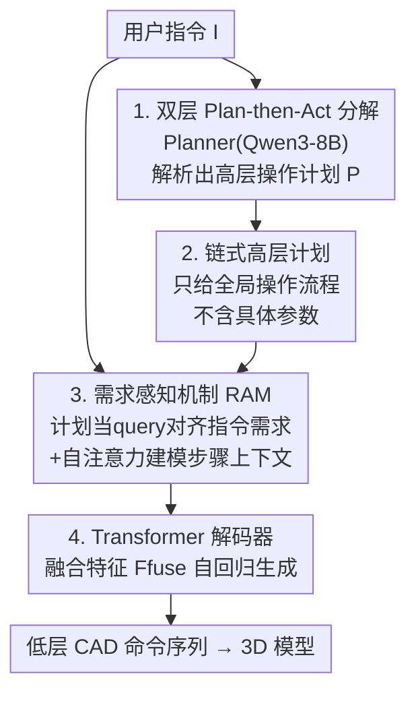

# Plan then Act: Bi-level CAD Command Sequence Generation

**会议**: ICLR 2026  
**OpenReview**: [https://openreview.net/forum?id=LhE03r8X8z](https://openreview.net/forum?id=LhE03r8X8z)  
**代码**: [https://github.com/QiferG/Plan-then-Act](https://github.com/QiferG/Plan-then-Act)  
**领域**: 3D视觉 / CAD生成 / 文本到3D  
**关键词**: CAD命令序列、文本到CAD、双层生成、需求感知机制、LLM规划

## 一句话总结
针对"LLM 直接生成 CAD 命令序列质量很差"的问题，本文提出 PTA：先用一个微调过的 Planner（Qwen3-8B）把用户文字指令解析成"链式高层操作计划"，再用一个带需求感知机制（RAM）的 Actioner 把计划落实成可执行的低层 CAD 命令序列，在 Text2CAD 数据集上把无效率压到 0.85%、各项几何指标全面领先。

## 研究背景与动机

**领域现状**：CAD（计算机辅助设计）是工业数字设计的基石，但它要求设计者掌握参数配置、几何约束等专业技能，且建模过程操作繁多、耗时。近年来"文本驱动 CAD 生成"成为热点——把 CAD 模型表示成一条**命令序列**（2D 草图基元 + 拉伸等 3D 操作，如 DeepCAD 提出的表示），让用户用自然语言描述需求，模型自回归地吐出这条序列。早期方法（Text2CAD、CAD Translator）从零训练文本编码器，语义解析能力有限；后来不少工作改用大规模预训练的 LLM 来理解指令、生成序列。

**现有痛点**：作者做了一组关键的前置实验（Section 3），发现**预训练 LLM 并不擅长直接输出任务专用的低层 CAD 控制序列**。GPT-4o 直接生成的序列无效率（Invalid Rate, IR）高达 70.35%；即便把 LLaMA3.1-8B、Qwen3-8B 微调过，IR 仍有 33.46% 和 20.06%；对微调后的 Qwen3-8B 再做 DPO，IR 还是 18.29%。也就是说，序列里大量的 token 组合根本无法被正确执行成 3D 模型。

**核心矛盾**：低层 CAD 命令链是高度结构化、强约束的"机器语言"（精确坐标、布尔操作、结束标记等），而 LLM 的强项是语义理解与推理，让它一步到位地从抽象描述跳到精确控制码，既要规划整体结构又要算准每个参数，超出了它的稳定能力范围，幻觉会直接污染参数。

**本文目标**：不让 LLM 一步到位，而是把"理解意图、规划结构"和"生成精确控制码"两件事拆开，各用最擅长的模块去做。

**切入角度**：受人类规划策略启发，作者提出假设——**把抽象指令先分解成链式操作计划，能提升命令序列生成的准确率**。他们用对照实验验证：在一个从零训练的任务专用模型上，只给指令时 Median CD 为 200.32、F1 为 45.16；额外喂入操作计划后，Median CD 降到 104.56、F1 升到 67.42，IR 也从 2.66% 降到 0.63%。计划确实有效。

**核心 idea**：用 LLM 做"规划"而非"执行"——先把指令解析成高层操作计划，再由一个专门模块结合计划与原始指令里的需求细节，生成精确的低层命令序列（即 "Plan then Act"）。

## 方法详解

### 整体框架

PTA 是一个**双层（bi-level）生成**框架，输入是一段自然语言用户指令，输出是一条可执行的低层 CAD 命令序列（进而执行成 3D 模型）。整个流程分两个阶段串行：

- **高层阶段（Planner）**：把 Qwen3-8B 微调成一个 CAD 规划器，输入用户指令 $I$，输出一条链式高层操作计划 $P = \text{Planner}(I)$（如"1. 画圆 → 2. 拉伸成圆盘 → 3. 选顶面 → 4. 画第二个圆 → 5. 拉伸成圆柱"）。计划只描述**全局操作流程**，不含具体参数。
- **低层阶段（Actioner）**：把原始指令 $I$ 和高层计划 $P$ 一起送进 Actioner，得到 $\hat{C} = \text{Actioner}(I, P)$。Actioner 内部用共享权重的 BERT 文本编码器分别编码指令和计划，得到指令特征 $F_{inst}$ 与计划特征 $F_{plan}$；再经过**需求感知机制（RAM）**把两者融合成 $F_{fuse}$，最后由 Transformer 解码器据此自回归生成命令序列。

之所以要双层而非单纯把计划当成更详细的指令，是因为高层计划只提供"全局操作指引"，缺少尺寸、几何关系这些**需求细节**；而这些细节恰恰散落在原始指令里，需要按操作步骤去精准对齐——这正是 RAM 要解决的事。

### 关键设计

**1. 双层 Plan-then-Act 分解：把"规划"和"执行"拆给各自擅长的模块**

这是全文的核心。痛点是 LLM 直接生成低层序列无效率极高（GPT-4o 70%、微调 Qwen3-8B 20%）。作者的做法是把任务切成两层：高层让 LLM 只做它擅长的语义解析与推理，产出一条粗粒度的链式操作计划 $P=\text{Planner}(I)$；低层交给一个轻量的、专门学习 CAD 命令语法的 Actioner，$\hat{C}=\text{Actioner}(I,P)$。消融实验（Table 2）很能说明问题：若让微调后的 Planner 直接生成低层序列（Planner only），表现和其它 LLM 一样烂（L0 的 IR 20.06%）；若去掉高层计划、只用指令喂 Actioner（Actioner only），CD/F1 明显劣于完整 PTA（L0 Median CD 200.32 vs 113.79）。两层缺一不可——计划提供结构骨架，Actioner 负责把骨架翻译成合法、精确的控制码，IR 直接压到 0.63%。

**2. 链式高层计划：只给全局流程，不给参数，主动避开 LLM 幻觉**

一个自然的疑问是：为什么不直接让 Planner 生成最详细的低层操作（连参数都算好）？作者明确反对这种做法。LLM 存在幻觉，让它"完全解析用户需求并直接生成带具体操作类型和参数的流程"会引入大量错误信息。因此 Planner 只被要求产出"相对简单但清晰的高层流程"——每个步骤泛化底层控制动作、不含精确参数。训练上对 Qwen3-8B 做全参数 SFT，用配对的 $(I, P)$ 加 few-shot prompt，目标为
$$L_{plan} = -\sum_{t=1}^{T} \log P(p_t \mid p_{<t}, I, \text{Prompt}).$$
其中高层计划 $P$ 的监督信号是用 Qwen2.5-32B 从 Text2CAD 提供的 nli 数据中"聚合/提炼"出来的操作流程。作者还专门做了对照（Table 4）：直接拿带参数的 nli 数据当计划（让 Planner 生成详细低层流程），结果反而更差（Median CD 156.00 vs 高层计划的 113.79，IR 2.46% vs 0.63%）——因为那样 Actioner 退化成纯翻译器，全部精度压力压回易幻觉的 LLM 身上。把"出参数"的活留给确定性更强的 Actioner，是这个设计的精髓。

**3. 需求感知机制 RAM：按操作步骤精准对齐指令里的需求细节**

高层计划缺细节，原始指令里有细节，但不能"一视同仁"地把整段指令灌给每个操作步——某一步（如"画圆"）只应关注与之最相关的需求（如"半径是底盘的一半"）。RAM 用两级多头注意力解决这点。第一级是**交叉注意力**，以计划特征当 query、指令特征当 key/value，为每个操作步检索最相关的需求信息：
$$O = \text{Atten}_1(Q_1=F_{plan},\ K_1=V_1=F_{inst}).$$
随后把 $O$ 与 $F_{plan}$ 简单相加得到初步融合向量。第二级是**自注意力**，因为操作步骤之间并非孤立、存在上下文关联（前一步的结果决定下一步在哪个面上画），于是对相加结果做自注意力建模步骤间关系：
$$F_{fuse} = \text{Atten}_2(Q_2=K_2=V_2=F_{plan}+O).$$
最终 $F_{fuse}$ 作为引导喂给解码器。消融（Table 3）显示：只用 $F_{plan}$（不取指令需求）最差（L0 Median CD 259.31）；简单 Concat 或 Add 指令特征有改善但不如 RAM；RAM 在各层级都取得最低 CD、最高 F1，证明"先按步检索需求、再建模步间上下文"这套结构化融合确实比粗暴拼接更能用上需求信息。

**4. 面向 CAD 序列的 Transformer 解码器：把融合引导翻译成 2D-token 命令链**

CAD 命令序列被表示成草图基元 + 拉伸操作的链，每个 token 是一个 2D token（编码草图基元的 2D 坐标、拉伸参数如欧拉角/拉伸距离/布尔操作/缩放，或 curve/loop/sketch/end 等结束标记），初始化为 256 维 one-hot。把序列拆成 $x$、$y$ 两路嵌入并加位置编码：$F^0_{t-1} = C^x_{1:t-1}W^x_{t-1} + C^y_{1:t-1}W^y_{t-1} + pos$。解码器含 8 个 block，每个 block 先对命令序列嵌入做自注意力，再以其为 query 从 $F_{fuse}$ 检索引导信息，逐层细化，最后经 MLP 输出可执行命令。训练目标为标准的自回归交叉熵
$$L_{act} = -\sum_{t=1}^{N_c} \log P(c_t \mid c_{<t}, I, P).$$
训练时用真实高层计划，推理时计划由微调后的 Planner 自动从指令生成，因此不会给用户增加额外输入负担。

### 一个完整示例

以指令"该 CAD 模型有一个圆盘底座，底座中心有一个圆柱，圆柱半径是底座的一半"为例：

1. **Planner** 解析出链式计划：①画圆 → ②拉伸成圆盘 → ③选圆盘顶面 → ④画第二个圆 → ⑤拉伸成圆柱。注意计划里**没有**"半径是一半"这种参数。
2. **Actioner** 把指令和计划分别过 BERT 得到 $F_{inst}$、$F_{plan}$。
3. **RAM** 交叉注意力让"画第二个圆"这一步当 query，去指令里检索到"半径是底座一半"这条需求；自注意力再让"⑤拉伸成圆柱"知道它建立在"③选顶面"的结果之上。
4. **解码器** 据 $F_{fuse}$ 逐 token 生成合法序列：`<SOL> Circle(...) Extrude(...) Circle(0.x, ...) Extrude(...) <EOS>`，参数与"半径减半"一致，执行得到正确的圆盘+圆柱模型。

## 实验关键数据

数据集为公开的 Text2CAD（17 万条 CAD 命令序列，每条对应 L0–L3 四个抽象层级的指令，共 66 万条文本，按 15 万训练 / 8 千测试划分）。指标含 GPT-4V 偏好评测、Chamfer Distance（CD）、F1（草图/拉伸基元）、Invalid Ratio（IR）、JSD、COV、MMD。对比方法：Text2CAD（SOTA 文本到 CAD）、DeepCAD（经典 VAE 序列生成，换 BERT 编码器以接受文本）、LLaMA3.1-8B、GPT-4o。

### 主实验（与 SOTA 对比，节选 L0 Abstract / L1 Beginner）

| 用户层级 | 方法 | GPT-4V↑ | Median CD↓ | Sketch F1↑ | IR↓ |
|----------|------|---------|-----------|-----------|-----|
| L0 Abstract | GPT-4o | 7.60 | 247.11 | 10.37 | 70.35 |
| L0 Abstract | Text2CAD | 23.90 | 187.31 | 24.22 | 1.78 |
| L0 Abstract | **PTA (Ours)** | **44.30** | **113.79** | **40.63** | **0.63** |
| L1 Beginner | Text2CAD | 20.50 | 206.28 | 21.87 | 1.50 |
| L1 Beginner | **PTA (Ours)** | **40.90** | **142.50** | **37.50** | **0.68** |

PTA 在全部四个层级上 GPT-4V、CD、JSD、MMD、COV、F1、IR 均最优。L0/L1 上 Median CD 分别改善 39%、31%，JSD 改善约 79%/80%，Sketch F1 提升 11.11/8.33。四层级平均 IR 仅 0.85%，即生成序列的可执行成功率约 99.15%。

### 消融实验

| 消融维度 | 配置 | L0 Median CD↓ | L0 IR↓ | 说明 |
|----------|------|--------------|--------|------|
| 双层 vs 单层 (Table 2) | Planner only | 218.97 | 20.06 | LLM 直接生成，IR 高 |
| | Actioner only | 200.32 | 2.66 | 去掉高层计划，CD 显著变差 |
| | **PTA** | **113.79** | **0.63** | 双层缺一不可 |
| RAM 融合方式 (Table 3) | $F_{plan}$ only | 259.31 | 3.05 | 不取指令需求，最差 |
| | Concat | 159.98 | 2.32 | 简单拼接 |
| | Add | 163.27 | 2.92 | 简单相加 |
| | **RAM** | **113.79** | **0.63** | 检索+上下文建模，最优 |
| 计划类型 (Table 4) | nli data plan | 156.00 | 2.46 | 带参数细节，逼 LLM 出精度 → 更差 |
| | **high-level plan** | **113.79** | **0.63** | 只给全局流程 → 更好 |

### 关键发现
- **双层是性能主来源**：单独用 Planner 或单独用 Actioner 都明显劣于完整 PTA，两者协同才把 IR 从 20% 量级压到 0.6%。
- **计划要"粗"不要"细"**：用带参数的 nli 数据当计划反而更差，印证了"把参数精度的活留给 Actioner、让 LLM 只做粗规划以规避幻觉"的设计哲学。
- **RAM 优于拼接/相加**：结构化的"按步检索需求 + 步间自注意力"比无差别融合更能利用指令细节。
- **失败模式**：当指令含训练集中罕见的描述（如"水滴形状""像建筑或屋顶"），PTA 难以完全满足需求，但仍能抓住基本形状（弧线+直线的组合）；作者建议对稀有描述做数据增强缓解。

## 亮点与洞察
- **"让 LLM 规划而非执行"是可迁移的范式**：凡是目标输出是强结构化、强约束的"机器语言"（CAD 序列、CAD 代码、CNC G-code、电路网表、形式化证明脚本），都可以套用"LLM 出高层计划 + 专用确定性模块出精确码"的双层结构，把幻觉挡在参数生成之外。
- **"计划的粒度"本身是个设计变量**：Table 4 的对照很反直觉——更详细的计划（nli）反而更差。它揭示了一个普适教训：把过多的精度负担压给易幻觉的生成器是有害的，计划应停在"结构清晰但参数留白"的甜点上。
- **RAM 的 query/key 角色分配很巧**：用计划当 query、指令当 key/value，天然实现了"按操作步骤去指令里找对应需求"的对齐语义，比把两段文本拼起来更符合任务结构。

## 局限与展望
- **依赖高质量计划监督**：高层计划是用 Qwen2.5-32B 从 Text2CAD 的 nli 数据聚合出来的，计划标注质量直接影响 Planner，迁移到没有 nli 数据的新数据集时需要额外构造计划。
- **罕见/创意描述泛化弱**：作者承认对训练集稀有的形状描述（水滴、建筑轮廓）生成不准，只能靠数据增强缓解，说明方法本质仍受训练分布约束。
- **单模态、单数据集验证**：仅在 Text2CAD 文本条件下评测；作者展望未来探索多模态条件（文本+图像+点云）的 CAD 生成，但当前未验证。
- **Actioner 容量上限未知**：Transformer 解码器最大序列长度 272，超长/超复杂模型（更多操作步）下双层能否保持低 IR 没有讨论。

## 相关工作与启发
- **vs Text2CAD**：Text2CAD 是端到端把文本直接翻译成命令序列；PTA 在中间插入了"高层计划"这一层，并用 RAM 显式对齐需求细节。结果上 PTA 在 GPT-4V、CD、F1、IR 全面领先，尤其抽象/初学者指令下优势明显——说明显式规划在指令越抽象时收益越大。
- **vs DeepCAD**：DeepCAD 是经典的 VAE 序列生成、本身不接受文本（实验里给它换了 BERT 编码器）；PTA 的贡献在文本→计划→序列的解析链路，定位互补。
- **vs 直接用 LLM 生成（GPT-4o / LLaMA3.1）**：本文的前置实验本身就是最有力的对比——直接让 LLM 出低层序列 IR 高达 20%–70%，证明"直接生成"路线在 CAD 这种强约束序列上不可行，从而立起了双层方案的必要性。

## 评分
- 新颖性: ⭐⭐⭐⭐ 把"LLM 规划 + 专用模块执行"的双层范式落到 CAD 序列生成，并用对照实验论证"计划要粗不要细"，视角清晰
- 实验充分度: ⭐⭐⭐⭐ 四层级 × 七指标对比 + 三组消融（双层/RAM/计划类型）+ 失败案例分析，论证链条完整
- 写作质量: ⭐⭐⭐⭐ 动机的前置实验（IR 数据）极具说服力，方法与公式表述清楚
- 价值: ⭐⭐⭐⭐ 把文本到 CAD 的可执行成功率推到约 99%，对 CAD 自动化有实际意义，范式也可迁移到其它结构化生成任务

<!-- RELATED:START -->

## 相关论文

- [\[ICLR 2026\] Scaling Sequence-to-Sequence Generative Neural Rendering](scaling_sequence-to-sequence_generative_neural_rendering.md)
- [\[CVPR 2026\] AutoRegressive Generation with B-rep Holistic Token Sequence Representation](../../CVPR2026/3d_vision/autoregressive_generation_with_b-rep_holistic_token_sequence_representation.md)
- [\[ICLR 2026\] Sat3DGen: Comprehensive Street-level 3D Scene Generation from Single Satellite Image](sat3dgen_comprehensive_street-level_3d_scene_generation_from_single_satellite_im.md)
- [\[CVPR 2026\] Think-Then-Generate: Structural Chain-of-Thought Reasoning for Consistent 3D Generation](../../CVPR2026/3d_vision/think-then-generate_structural_chain-of-thought_reasoning_for_consistent_3d_gene.md)
- [\[CVPR 2025\] CADDreamer: CAD Object Generation from Single-view Images](../../CVPR2025/3d_vision/caddreamer_cad_object_generation_from_single-view_images.md)

<!-- RELATED:END -->
