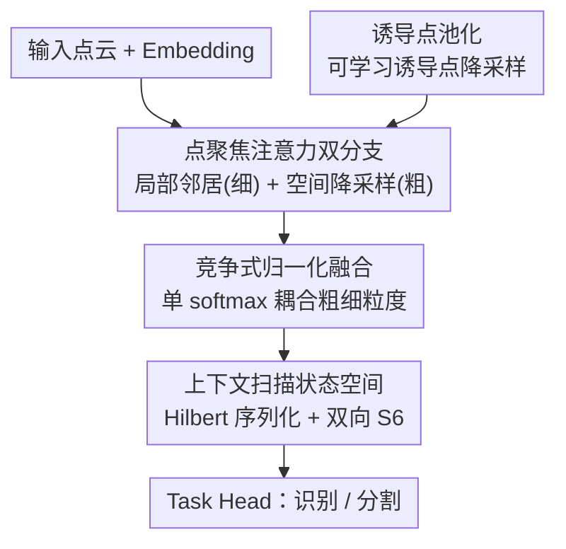

# Point-Focused Attention Meets Context-Scan State Space: Robust Biological Visual Perception for Point Cloud Representation

**会议**: ICLR 2026  
**OpenReview**: [https://openreview.net/forum?id=KQPoMbxInu](https://openreview.net/forum?id=KQPoMbxInu)  
**代码**: https://github.com/Point-Cloud-Learning/PointLearner  
**领域**: 3D视觉 / 点云表示学习  
**关键词**: 点云, 中央凹视觉, 注意力, 状态空间模型, Hilbert 曲线

## 一句话总结
PointLearner 用「先聚焦后扫视」的仿生设计——点聚焦注意力（模拟中央凹视觉）+ 上下文扫描状态空间（模拟眼跳推理）——在线性复杂度下同时建模点云的局部细粒度结构与全局长程依赖，在 ModelNet40/ScanObjectNN/ShapeNet/S3DIS 上拿到 SOTA 并展现出对噪声与稀疏采样的强鲁棒性。

## 研究背景与动机

**领域现状**：点云表示学习目前主流是局部注意力网络（如 Point Transformer 系列）。它们把注意力计算限制在每个点的局部邻域/窗口内，从而把复杂度从点数的平方降到线性，工程上很实用。另一条线是把 Mamba 里的选择性状态空间模型（S6）引入点云，借它「线性复杂度 + 长程建模」的特性来做全局交互。

**现有痛点**：局部注意力为了省算力，把感受野收窄了，牺牲了注意力本该有的全局感知能力，导致场景中物体之间的长程依赖建模不充分。而双向 S6 走到另一个极端——它靠把所有上下文压进「历史隐状态」来实现全局连通，结果对局部细粒度结构的学习又不够。

**核心矛盾**：「局部细粒度结构」与「全局上下文依赖」之间存在 trade-off。注意力擅长前者但难兼顾后者（除非付出平方复杂度），SSM 擅长后者但弱于前者。如何在线性复杂度内**协同**捕获二者，是点云表示学习的核心难题。

**切入角度**：作者从生物视觉系统找灵感。人眼的中央凹视觉具有明显的空间非均匀性——视觉焦点附近极高敏锐度（能分辨细节），随偏心率增大敏锐度下降（外围只做粗处理）；同时视觉是动态的，靠连续的眼跳（saccade）在一串序列化的焦点上采集信息，从而推断整个场景的语义结构。这套机制天然就把「焦点处的局部精修」和「跨焦点的全局推理」融在一起，正好对应点云那对矛盾。

**核心 idea**：造一个「focus-then-context」的仿生网络——先用**点聚焦注意力**在每个点的焦点处模拟中央凹（局部细 + 外围粗），再用**上下文扫描状态空间**沿 Hilbert 扫视路径模拟眼跳做全局推理，两者串联即可在线性复杂度下同时拿下局部与全局。

## 方法详解

### 整体框架
PointLearner 沿用标准的 Point Transformer 式编码器-解码器结构：点云先过 MLP embedding 投到高维，再进入带残差的层级编码-解码（下采样用 FPS、上采样用线性插值），最后接识别头（对编码器输出做平均池化 + MLP 出类别 logits）或分割头（对解码器输出逐点 MLP）。真正的创新在每一层的核心组件 **PointLearner block**：它先做**点聚焦注意力（PFA）**在焦点处融合局部与全局，再做**上下文扫描状态空间（CSSS）**沿扫视路径做场景级推理，二者一前一后即「先聚焦、后扫视」。

PFA 内部是双分支：局部邻居分支负责焦点附近的细粒度感知，空间降采样分支负责每个点对全局语义的粗粒度感知——其中降采样由**诱导点池化**完成；两分支再通过**竞争式归一化融合**在单次 softmax 内耦合。CSSS 则用 **Hilbert 曲线**把 PFA 特征序列化，再喂给**双向 S6** 做几何推理。

### 关键设计

**1. 点聚焦注意力双分支：在每个点上同时模拟中央凹的「焦点细、外围粗」**

这一设计直击「局部注意力感受野太窄、看不到全局」的痛点。对每个查询点 $p_i$，局部邻居分支（LNB）在 KNN 找到的 $K$ 个邻居 $\mathcal{N}_i$ 上做标准注意力，提供高敏锐度的细粒度感知：$A_i^l=\mathrm{softmax}(\langle Q_i^l,K_{\mathcal{N}_i}^l\rangle/\sqrt{D})$，$\mathrm{LNB}(p_i)=A_i^l V_{\mathcal{N}_i}^l$。空间降采样分支（SDB）则让同一个查询点去和一组「空间降采样特征」$S\in\mathbb{R}^{M\times D}$ 做注意力，维持对全局语义的低敏锐度粗感知：$A_i^s=\mathrm{softmax}(\langle Q_i^s,K^s\rangle/\sqrt{D})$，$\mathrm{SDB}(p_i)=A_i^s V^s$。两分支一细一粗，正好对应中央凹「焦点处高敏锐、外围低敏锐」的空间非均匀性，让每个点既看清自己周围的几何细节，又对远处场景保持语义感知——这是后续全局推理的良好起点。

**2. 诱导点池化：用可学习的诱导点适配点云的非均匀分布做降采样**

空间降采样分支需要一组紧凑的全局特征 $S$。但点云不像 2D 图像那样能靠均匀平均池化降采样，而常用的 FPS 为了覆盖全局往往得设很小的采样率，会显著抬高式 (2) 的算力。作者借鉴稀疏高斯过程里的 inducing point 思想，定义 $M$ 个可训练的 $D$ 维向量 $I\in\mathbb{R}^{M\times D}$（诱导点），让它们直接和数据点做注意力交互来「归纳」点云：$S=\mathrm{IPP}(F)=\mathrm{softmax}(\langle I,K^p\rangle/\sqrt{D})V^p$，其中 $(K^p,V^p)=(W_k^p,W_v^p)F$。由于诱导点是可学习的、且数量 $M$ 可控，它能灵活贴合点云的非均匀分布、自适应地把全局语义压进 $M$ 个 token 里，从而既高效又有覆盖地完成空间降采样——这正是 SDB 那条「外围粗感知」分支的 key/value 来源。

**3. 竞争式归一化融合：在单次 softmax 内耦合粗细粒度，而非简单相加**

最直白的做法是把两分支输出相加 $\mathrm{PFA}(p_i)=\mathrm{LNB}(p_i)+\mathrm{SDB}(p_i)$，但这种浅层多尺度相加无法刻画中央凹视觉里局部细粒度与全局粗粒度之间的**深层动态交互**——它们各自独立 softmax，互不竞争。作者改成：把两分支的 query/key 在通道上拼接后一起做**一次** softmax，再按尺寸切回去：$A_i=\mathrm{softmax}(\mathrm{Concat}(Q_i^l,K_{\mathcal{N}_i}^l,Q_i^s,K^s)/\sqrt{D})$，$A_i^l,A_i^s=\mathrm{split}(A_i,[K,M])$，最后 $\mathrm{PFA}(p_i)=A_i^l V_{\mathcal{N}_i}^l+A_i^s V^s$。因为局部邻居和降采样特征现在共享同一个归一化分母，二者会**竞争**注意力质量，让每个点自适应地选出最有效的感受野信息（该看细节时偏向局部、该看全局时偏向降采样特征）。消融显示它在几乎不增加算力的前提下把 OA 从相加版的 93.43% 提到 94.17%。整个 PFA 的复杂度 $\Omega(\mathrm{PFA})=6ND^2+2MD^2+2NKD+4NMD$，由于 $K,M$ 都小，对点数 $N$ 呈线性。

**4. 上下文扫描状态空间：用 Hilbert 扫视路径引导双向 S6 做全局场景推理**

PFA 解决了焦点处的局部-全局融合，但跨焦点的场景级推理要靠 CSSS 模拟眼跳。它先用空间填充曲线把点云序列化：核心是把高维几何结构映射成一维序列、同时保持局部邻接（空间相邻的点在序列里也相邻）。作者比较 Hilbert 与 Z-Order 后选 Hilbert——它的局部保持性更好、自相似旋转复制的特性更贴合眼动视觉搜索时「沿空间相邻区域连续扫视」的模式；而且不像有些方法拼接多条曲线（拉长序列、引入冗余、不同空间关系拼在一起还会混淆），单条 Hilbert 就给出可靠的高保真扫视路径。序列化后喂给双向 S6：S6 本身是基于隐状态的前向递归，只能看到序列里更靠前的内容，对需要全局视野的视觉数据不够用；于是并行部署前向 + 后向两个 S6（后向把序列倒着扫一遍），让每个点都拿到全局感受野，正对应人眼来回扫视去辨认模糊物体的方式。这样「序列化负责连续扫描、状态空间负责信息整合」，把整体语义结构与细粒度空间内容高效融合。

### 损失函数 / 训练策略
论文未引入额外损失，识别任务用类别 logits、分割任务用逐点 logits 按标准监督训练；消融均在 ModelNet40 上以相同配置、三次运行取平均。

## 实验关键数据

### 主实验
PointLearner（Hybrid 架构）在四个标准数据集上全面 SOTA：

| 数据集 | 任务 | 指标 | 本文 | 之前最好 | 说明 |
|--------|------|------|------|----------|------|
| ModelNet40 | 物体识别 | OA | 94.2 | 93.8 (GAD, Attention) | 突破注意力网络 93.2–93.8 的饱和区间 |
| ShapeNet | 部件分割 | Ins. mIoU | 86.9 | 86.4 (ReCon) | 显著超越纯注意力 / 纯 SSM |
| S3DIS | 语义分割 | mIoU | 74.3 | 73.8 (MVNet) | 更难任务上仍领先 |
| ScanObjectNN (PB_T50_RS) | 鲁棒识别 | OA | 89.8 | 89.3 (PointMamba) | 真实噪声场景，超过所有现有模型 |

效率上（S3DIS，单次推理，RTX 4090）：PointLearner 52.78M 参数、63ms 延迟、6.5G 显存、74.3 mIoU，相比 PTv3（46.17M/49ms/73.4）和 HydraMamba（63.14M/54ms/73.6）取得更优的「算力-性能」折中；远好于重型注意力 Swin3D（71.15M/365ms/72.5）。

### 消融实验（ModelNet40，OA）

| 配置 | OA | Throughput | 说明 |
|------|------|-----------|------|
| Full（Bid. S6 + 竞争融合 + 双分支） | 94.17 | 163FPS | 完整模型 |
| w/o 局部邻居分支 LNB | 92.11 | 221FPS | 掉 2.06，局部细粒度感知缺失最伤 |
| w/o 空间降采样分支 SDB | 93.06 | 183FPS | 掉 1.11，全局粗感知缺失 |
| 相加融合（替代竞争融合） | 93.43 | 166FPS | 掉 0.74，浅层相加不如单 softmax 竞争 |
| 单向 S6（替代双向） | 93.08 | 181FPS | 掉 1.09，少了后向扫视的全局视野 |
| 仅 PFA（无 CSSS） | 92.93 | 198FPS | 只焦点不扫视 |
| 仅 CSSS（无 PFA） | 91.94 | 231FPS | 只扫视不聚焦，最差 |

### 关键发现
- **局部邻居分支贡献最大**：去掉后 OA 直接掉 2.06%（94.17→92.11），印证「焦点处的细粒度精修是全局推理的基础」这一仿生直觉。
- **PFA 与 CSSS 互补**：仅 PFA 92.93、仅 CSSS 91.94，合起来才到 94.17——「先聚焦后扫视」缺一不可。
- **鲁棒性突出**：采样点从 1024 降到 256 时 PointLearner 仅掉 2.2% OA，明显优于最强注意力法 GAD 和最强 SSM 法 PCM；作者归因于竞争式归一化在局部结构与全局感知间的自适应加权，以及 CSSS 的全局推理能力。

## 亮点与洞察
- **把「中央凹 + 眼跳」两段生物机制分别对应到两类算子**：中央凹（焦点细、外围粗）↔ 双分支注意力，眼跳（序列化扫视 + 来回推断）↔ Hilbert + 双向 S6。这个映射很自然，解释了为什么 Attention 和 SSM 的混合能恰好补上彼此短板。
- **竞争式归一化是个轻量却关键的 trick**：不是把两路输出相加，而是让它们共享一个 softmax 分母去竞争——几乎零额外算力却 +0.74% OA，这种「用归一化耦合多尺度」的思路可迁移到其他多分支/多尺度融合场景。
- **诱导点池化**用可学习向量直接和数据交互来降采样，绕开了 FPS 在点云上「为覆盖全局必须小采样率、算力暴涨」的尴尬，且 $M$ 可控，是个干净的点云降采样替代件。

## 局限与展望
- 评测集中在物体识别 + 室内分割（ModelNet40/ScanObjectNN/ShapeNet/S3DIS），未覆盖大规模室外/自动驾驶点云（如 nuScenes、SemanticKITTI），跨域泛化待验证。
- block 内组件偏多（双分支 + 诱导点池化 + 双向 S6），虽然各组件线性复杂度、延迟尚可（63ms），但相比纯 PTv3 仍略重；诱导点数 $M$、邻居数 $K$ 等超参的敏感性论文给得不充分。
- 「仿生」更多是结构类比与动机叙事，缺少与真实生物视觉特性（如真实偏心率敏锐度曲线）的定量对照；竞争式归一化为何有效，目前主要靠消融佐证而非理论分析。

## 相关工作与启发
- **vs 局部注意力网络（Point Transformer / PTv3）**：它们把注意力限制在局部邻域换线性复杂度，但感受野窄、长程依赖弱；本文用空间降采样分支 + CSSS 在保持线性复杂度的同时补回全局建模能力。
- **vs 纯 SSM 点云方法（PointMamba / PCM / Mamba3D）**：它们靠双向 S6 压缩全局上下文进隐状态，局部细粒度学习不足；本文用 PFA 在焦点处显式补上局部结构，消融里「仅 CSSS」最差（91.94）正说明 SSM 单独不够。
- **vs 混合架构 PoinTramba**：同为 Attention+SSM 混合，但本文以「中央凹 + 眼跳」的生物视觉机制统一组织两类算子，并在鲁棒性（ScanObjectNN 89.8 vs 88.9）与多任务上更优。

## 评分
- 新颖性: ⭐⭐⭐⭐ 生物视觉机制到 Attention+SSM 混合算子的映射清晰，竞争式归一化与诱导点池化都有巧思
- 实验充分度: ⭐⭐⭐⭐ 四数据集 + 鲁棒性 + 效率 + 细致消融，但缺室外大场景
- 写作质量: ⭐⭐⭐⭐ 仿生叙事贯穿全文、动机到方法衔接自然
- 价值: ⭐⭐⭐⭐ 在多任务刷到 SOTA 且鲁棒性强，混合范式与降采样件有复用价值

<!-- RELATED:START -->

## 相关论文

- [\[ICLR 2026\] Test-Time Optimization of 3D Point Cloud LLM via Manifold-Aware In-Context Guidance and Refinement](test-time_optimization_of_3d_point_cloud_llm_via_manifold-aware_in-context_guida.md)
- [\[CVPR 2026\] Deformation-based In-Context Learning for Point Cloud Understanding](../../CVPR2026/3d_vision/deformation-based_in-context_learning_for_point_cloud_understanding.md)
- [\[ICCV 2025\] UST-SSM: Unified Spatio-Temporal State Space Models for Point Cloud Video Modeling](../../ICCV2025/3d_vision/ust-ssm_unified_spatio-temporal_state_space_models_for_point_cloud_video_modelin.md)
- [\[ICLR 2026\] PointRePar: SpatioTemporal Point Relation Parsing for Robust Category-Unified 3D Tracking](pointrepar_spatiotemporal_point_relation_parsing_for_robust_category-unified_3d_.md)
- [\[ICLR 2026\] Guaranteed Simply Connected Mesh Reconstruction from an Unorganized Point Cloud](guaranteed_simply_connected_mesh_reconstruction_from_an_unorganized_point_cloud.md)

<!-- RELATED:END -->
