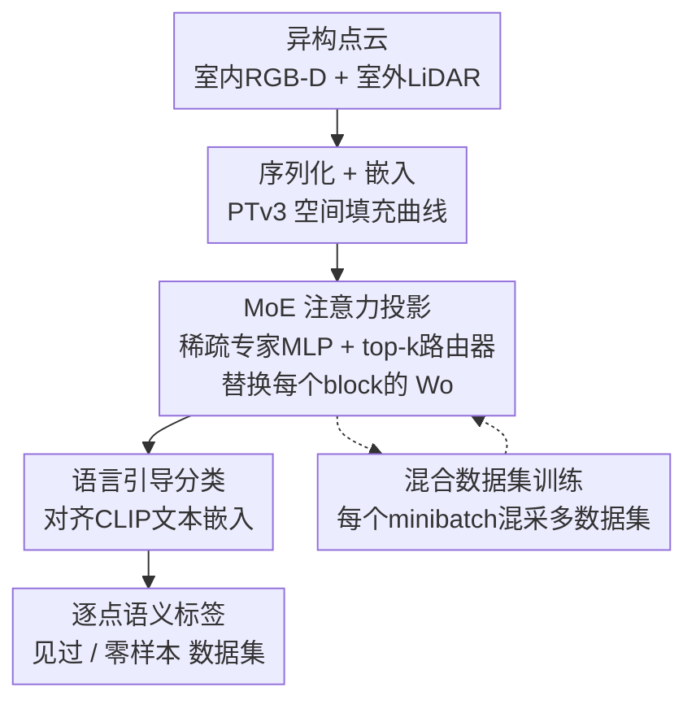

# Point-MoE: Large-Scale Multi-Dataset Training with Mixture-of-Experts for 3D Semantic Segmentation

**会议**: ICLR 2026  
**OpenReview**: [https://openreview.net/forum?id=35HahPHrFG](https://openreview.net/forum?id=35HahPHrFG)  
**项目页**: [https://point-moe.cs.virginia.edu/](https://point-moe.cs.virginia.edu/)  
**领域**: 3D视觉 / 点云语义分割  
**关键词**: 点云语义分割, 混合专家, 多数据集联合训练, 零样本泛化, Point Transformer

## 一句话总结
把稀疏激活的 Mixture-of-Experts（MoE）模块嵌进 Point Transformer V3（PTv3）的注意力输出投影层，让一个统一模型在不依赖任何「数据集标签」的情况下联合训练室内外多种异构点云数据集，靠路由器自发地让 token 选择专家，在 7 个数据集（含零样本）上的语义分割 mIoU 超过需要数据集标签的 PPT，同时推理 FLOPs 反而省 30.9%。

## 研究背景与动机
**领域现状**：NLP 和 2D 视觉的进步很大程度来自「聚合海量异构数据 + 用一个统一大模型在其上训练」。但 3D 点云理解还没走上这条路。以 3D 语义分割为例，虽然有 ScanNet、SemanticKITTI、nuScenes、Structured3D 等数据集，但每个只覆盖现实变化中很窄的一片——点云来自 RGB-D、LiDAR、多视图立体等不同采集管线，密度、噪声伪影、语义偏置各不相同，于是 3D 模型陷入「各自为政」的孤岛生态，一个域上训练的模型换个域就崩。

**现有痛点**：一个自然的想法是「跨孤岛联合训练」得到一套通用参数。但直接把 SOTA 的 PTv3 在室内外混合数据上训练，模型根本调和不了数据分布的异构性，哪怕加大容量也不行（论文 Tab.1 里单数据集模型迁移到别的域 mIoU 只有个位数）。为缓解这点，近期方法引入「数据集感知组件」：PPT 给每个数据集配一套专属归一化层，One-for-All 用一个轻量数据集分类器加数据集专属 adapter。

**核心矛盾**：这些方法都依赖**数据集标签**——训练和推理时都必须知道「这条样本来自哪个数据集」。但真实部署时点云来自混杂、无标注、来源未知的传感器，根本没有 oracle 的「dataset ID」。而且只调归一化参数对大规模多数据集训练而言表达力可能不够。

**本文目标**：研究一个更现实的设定——大规模多数据集联合 3D 语义分割，训练和推理**全程不提供数据集标签**，用单一模型既在见过的数据集上强、又能零样本泛化到没见过的分布。

**切入角度**：作者假设 MoE 架构天然适合这个设定。三点观察支撑：①MoE 鼓励专家专门化和 token-to-expert 路由，能让单模型从混合数据里学习而不需要数据集标签；②相比 PPT/One-for-All 那种只改归一化的适配，MoE 提供远更强的表达容量来建模数据集间差异；③稀疏 MoE 只激活少数专家，能在扩容的同时保持训练/推理高效，本就是 NLP 和 2D 视觉里扩展大模型的标准手段。

**核心 idea**：用「让模型自己在异构 3D 数据里发现结构」替代「靠人工筛选或数据集专属启发式把结构硬塞进去」——具体做法是把 PTv3 每个 block 的注意力输出投影换成稀疏 MoE，由路由器无监督地决定每个 token 走哪些专家。

## 方法详解

### 整体框架
Point-MoE 建立在 PTv3 之上。输入是一个点云 $P=\{p_i\}_{i=1}^M$，每个点带 XYZ 坐标，输出是每点的语义类别 $\hat y_i \in C$。整条管线分三步：先把无结构点云通过 PTv3 的空间填充曲线**序列化并嵌入**成 1D token 序列；再经过若干堆叠的多头自注意力 block 配合下/上采样做多尺度推理，**而每个 block 的注意力输出投影 $W_o$ 被替换成一个 MoE 模块**（专家 MLP 池 + 轻量 top-k 路由器），其余 QKV 投影保持稠密；最后通过一个「语言引导分类头」把每点特征投到 CLIP 文本空间，用类名做监督，从而绕开不同数据集标签空间不一致的问题。训练时每个 minibatch **混合采样**多个数据集的样本，让不同数据集在同一次梯度更新里相互作用、催生专家专门化。

训练目标是一套统一参数 $\theta$（不做逐数据集微调）：$\min_\theta \mathbb{E}_{D_j\sim\mathcal{D}}\,\mathbb{E}_{(P,y)\sim D_j}[L(y,\Phi_\theta(P))]$，全程不假设 oracle 数据集标签。这与 PPT 那类「额外学一组数据集专属参数 $\omega_j$」的目标形成鲜明对比——后者推理时必须先识别样本来自哪个数据集才能选对 $\omega_j$。

### 关键设计

**1. 把 MoE 放在注意力输出投影 $W_o$ 上，而非 FFN**

一个 PTv3 自注意力 block 的标准计算是 $X=\text{Norm}(x_{\ell-1})$，$Q,K,V = XW_q,XW_k,XW_v$，$A=\text{Softmax}(QK^\top/\sqrt{d_h})V$，$O=W_oA$，再走预归一残差和 FFN。Point-MoE 只把 $O=W_oA$ 改写成 $O=\text{MoE}(A)$，QKV 投影仍保持稠密共享。MoE 层本身定义为对 top-k 激活专家的加权和：$\text{MoE}(x)=\sum_{i\in S_x} G_i(x)\,f_i(x)$，其中 $\{f_i\}_{i=1}^N$ 是专家（$f_i:\mathbb{R}^D\to\mathbb{R}^D$），$G$ 是一个线性投影接稀疏 softmax 的门控网络，只激活 $k\ll N$ 个专家，$S_x$ 是 top-k 专家集。

为什么放 $W_o$ 比放 FFN 好？$W_o$ 是多头输出被重新融合、进入下一次归一化之前的「汇合点」，放在这里的专家能在「头聚合后、还保留跨数据集几何线索」的更丰富信号上做路由，同时让 $W_q,W_k,W_v$ 保持共享稳定；而 FFN 专家作用在归一化之后的激活上，数据集/几何线索已被削弱。另一个动机是非线性：若投影纯线性，$W_v$ 和 $W_o$ 可以合并成一个投影，在投影路径上加 MoE 等于注入了额外的非线性和容量。消融（Tab.3d）证实 Proj-MoE 在四个数据集上一致优于 FFN-MoE。

**2. 无数据集标签的 token 级稀疏路由：让专家自发按语义/几何分工**

这是全文的灵魂——路由器只看 token 特征本身决定走哪些专家，整个过程没有任何「数据集 ID」输入。结果是专家自组织出了有意义的分工模式：t-SNE 可视化显示，PTv3 的特征在编码器和解码器都不分离（容量不足以形成数据集特定表示），PPT 因为用了数据集标签在两处都形成尖锐分簇（但这种刚性划分反而损害泛化）；而 Point-MoE 呈现独特模式——**编码器特征跨数据集保持混合**（支持共享表示学习），**解码器才解耦出数据集特定结构**，相当于做了一次「隐式数据集推断」。专家选择可视化进一步显示：编码器层主要按局部几何路由（某个专家专注物体边界和细结构），解码器层则按语义路由（椅子、桌子、地板等语义相关区域跨场景跨数据集被分给同一专家）。关键是在零样本的 Matterport3D 上，Point-MoE 会把样本对齐到语义最接近的见过的数据集簇（如 ScanNet），这正是它强泛化的来源——路由依据的是输入的语义和几何，而非数据集身份。

**3. 混合数据集训练（Mixed-dataset batching）**

每个 minibatch 同时从多个数据集（室内 + 室外）采样。虽然没有显式的 batch 级交互模块，但来自不同数据集的样本仍通过共享归一化统计量、以及（对 Point-MoE 而言）对公共专家池的竞争而相互影响。这一步对所有 backbone 都有益，但对 Point-MoE 效果尤为夸张：Tab.4 显示开启混合采样后平均 mIoU，PTv3 +8.3、PPT +2.9、而 Point-MoE 高达 **+16.6**。原因是多样化的 minibatch 促进了专家跨数据集的专门化、稳定了路由、改善了泛化——这与设计 2 的「专家自组织」是相辅相成的：没有混合采样，专家就没机会在同一更新步里学会区分不同分布。

**4. 反直觉的设计选择：去掉辅助负载均衡损失、不用共享专家**

MoE 常规做法会加一个辅助负载均衡损失来鼓励专家均匀使用、防止专家坍塌。但作者发现在 3D 点云这里**完全去掉辅助损失反而一致更好**（Tab.3a：$\alpha=0$ 时 ScanNet 74.5，$\alpha=10^{-3}$ 掉到 71.6），更强的辅助损失反而显著掉点。作者假设这是因为 3D 点云数据集间样本分布本就极不均衡，强行拉平专家使用反而违背数据真实结构（ChartMoE 也观察到类似现象）。同理，加「共享专家」（shared expert）也一致掉点（Tab.3g），不共享专家能得到更好的精度和数据集专门化。这组选择说明：在异构、长尾的多数据集场景，应该顺应而非压制专家的不均衡分工。

### 损失函数 / 训练策略
基础监督是逐点交叉熵 $L(y,\hat y)$，但分类头不是普通 softmax，而是把每点特征投到 CLIP 文本空间、对齐类名嵌入（语言引导分类），以桥接不同数据集标签空间的差异（例如 ScanNet 里归为「other」的 pillow 在 Structured3D 里有显式标签，对齐到「pillow」的 CLIP 嵌入即可跨数据集迁移知识）。不加 MoE 辅助负载均衡损失。默认配置：top-2 门控、BatchNorm、ReLU、不共享专家；Point-MoE-S 用 4 个专家 / 专家隐藏维 1×，Point-MoE-L 用 8 个专家 / 2×，均为 14 编码层 + 8 解码层。

## 实验关键数据

数据集：室内 ScanNet / S3DIS / Structured3D 联合训练，零样本评测 Matterport3D；更难的室内外联合设定再加入 nuScenes / SemanticKITTI 训练、Waymo 零样本。基线 PTv3、PPT（PPT 需数据集标签，按 One-for-All 训一个 ≥95% 准确率的轻量数据集分类器在推理时预测来源）。

### 主实验

| 设定 | 方法 | 用数据集标签 | 平均 mIoU |
|------|------|:---:|:---:|
| 室内联合 | PTv3-L | 否 | 63.4 |
| 室内联合 | PPT-L | 是 | 67.6 |
| 室内联合 | **Point-MoE-L** | 否 | **71.5** |
| 室内外联合 | PTv3-L | 否 | 67.2 |
| 室内外联合 | PPT-L | 是 | 68.3 |
| 室内外联合 | **Point-MoE-L** | 否 | **70.8** |

室内外联合下，Point-MoE-L 平均超 PTv3-L 3.55 mIoU、超需标签的 PPT-L 2.45 mIoU。零样本（Tab.2）上优势更明显：室内外训练时 Point-MoE-L 在 Matterport3D + Waymo 平均 35.0，PTv3-L 32.5，而 PPT-L 因过度依赖数据集线索骤降到 20.3。

| 效率（vs PPT-L） | FLOPs/step | Peak VRAM |
|------|:---:|:---:|
| PPT-L | 384.4 GFLOPs | 41.1 GiB |
| **Point-MoE-L** | **265.7（↓30.9%）** | **33.3（↓19.0%）** |

稀疏激活让 Point-MoE 在精度更高的同时反而更省算力——这是它相对稠密 PPT 的关键优势。

### 消融实验

| 配置 | 选择 | ScanNet mIoU | 说明 |
|------|------|:---:|------|
| 辅助均衡损失 | $\alpha=0$ | 74.5 | 去掉最好；$\alpha=10^{-3}$ 掉到 71.6 |
| top-k | top-2 | 74.5 | 优于 top-1(74.4)/top-3(73.8) |
| MoE 位置 | Proj. | 74.5 | 优于 FFN(72.6) |
| 归一化 | BatchNorm | 74.5 | LN 70.8、RMSNorm 仅 45.3 |
| 共享专家 | 不共享 | 74.5 | 共享掉到 73.6 |
| 专家数 | 4→8 | 73.6→更高 | 更多专家提升见过/零样本 |
| 混合采样 | 开 | 62.5 平均 | 关闭仅 45.9（+16.6） |

### 关键发现
- 贡献最大的是**混合数据集训练**：开/关使 Point-MoE 平均 mIoU 相差 16.6，远超 PTv3（+8.3）和 PPT（+2.9），说明 MoE 的专家专门化高度依赖在同一 batch 里见到多样分布。
- **归一化极度敏感**：RMSNorm 让 ScanNet 从 74.5 崩到 45.3，说明在 3D 多数据集场景 BatchNorm 的跨样本统计是必要的稳定器。
- 室内 only 训练 vs 室内外联合训练，见过的室内数据集精度几乎不变，说明加入室外数据**不会**牺牲已有能力——这是「负迁移」被有效避免的证据。
- 零样本 Matterport3D 的特征对齐到语义相近的 ScanNet 簇，是 Point-MoE 泛化强的直接可视化证据；反观 PPT 因刚性数据集分簇而泛化崩塌。

## 亮点与洞察
- **「无标签反而更强」的反直觉结论**：Point-MoE 不用数据集标签却超过用标签的 PPT，核心洞察是「显式数据集监督会让模型过度依赖数据集身份线索，一旦零样本就脆」，而隐式路由依据语义/几何更稳——这对所有「靠 domain ID 做适配」的工作都是警示。
- **编码器混合、解码器解耦的分工**很优雅：靠近输入的层做共享表示，靠近监督的层做数据集特定推断，这种「隐式数据集推断」是路由器自发学到的，不是设计出来的。
- **去掉辅助负载均衡损失**这个 trick 可迁移：在数据本身长尾/不均衡的多源场景，强行均衡专家使用可能是错的，应顺应数据真实分布。
- MoE 放 $W_o$ 而非 FFN 的论证（利用 $W_v W_o$ 可合并的线性性来论证注入非线性的价值）很有启发，且与 NLP 侧 UMoE 的发现呼应。

## 局限与展望
- 论文承认这只是「3D 扩展的第一步」，聚焦语义分割单一任务，未覆盖检测、实例分割、3D 重建等更广的 3D 理解任务。
- 数据规模相对 NLP/2D 仍很小（7 个数据集），是否真能复现 NLP 那样的 scaling law 仍待更大规模验证。
- 专家数、稀疏度、专家宽度的最优配置呈现数据集相关的混合趋势（如更宽专家在 ScanNet/Matterport 提升但在 Structured3D/S3DIS 掉点），缺乏一套跨数据集普适的扩展规律。
- 域泛化（DG）方法是正交的、可叠加，但本文未实际结合 DG 技术，二者协同的上限是开放问题。
- 仍有少数孤立点被路由到与邻居不同的专家，作者归因于 PTv3 的序列化和位置编码，未深究其对边界精度的影响。

## 相关工作与启发
- **vs PTv3**：本文的 backbone 就是 PTv3，区别在于把每个 block 的注意力输出投影换成稀疏 MoE。PTv3 直接做多数据集联合训练会因无法调和异构分布而掉点，Point-MoE 用专家容量解决了这点。
- **vs PPT / One-for-All**：它们靠数据集专属归一化层 + 推理时数据集分类器（需 domain label），在见过的数据集上有效但零样本脆且推理更贵；Point-MoE 不需任何 domain label，靠 token 级路由隐式适配，零样本更强、FLOPs 反而省 30.9%。
- **vs UniDet3D / Sonata**：UniDet3D 走「合并标签空间 + vanilla transformer」的 3D 检测多数据集联合训练，Sonata 做多数据集自监督但不跨室内外；本文是首个把 MoE 用于 3D 点云大规模多数据集训练的系统研究，并跨室内外评测。
- **vs 语言/2D 的 MoE（Switch/DeepSeek-VL/MoE-LLaVA/ChartMoE 等）**：本文把这些已在 NLP/2D 验证的 MoE 收益迁移到 3D 点云，并发现 3D 特有现象（去辅助损失更好、BatchNorm 必需），说明跨模态迁移 MoE 需要重新校准设计选择。

## 评分
- 新颖性: ⭐⭐⭐⭐⭐ 首个把 MoE 系统性引入 3D 点云大规模多数据集训练，且证明无标签路由优于有标签适配。
- 实验充分度: ⭐⭐⭐⭐⭐ 7 数据集 + 室内外 + 零样本，MoE 设计空间消融（位置/top-k/归一化/专家数/共享/均衡损失）非常完整。
- 写作质量: ⭐⭐⭐⭐ 动机清晰、可视化分析到位，但部分句子有重复表述。
- 价值: ⭐⭐⭐⭐⭐ 为 3D 感知指出一条「单一统一模型按 scaling law 扩展」的可行路径，且推理更省。

<!-- RELATED:START -->

## 相关论文

- [\[ICLR 2026\] MoE-GS: Mixture of Experts for Dynamic Gaussian Splatting](moe-gs_mixture_of_experts_for_dynamic_gaussian_splatting.md)
- [\[ICLR 2026\] SkyEvents: A Large-Scale Event-Enhanced UAV Dataset for Robust 3D Scene Reconstruction](skyevents_a_large-scale_event-enhanced_uav_dataset_for_robust_3d_scene_reconstru.md)
- [\[ICLR 2026\] GOOD: Geometry-guided Out-of-Distribution Modeling for Open-set Test-time Adaptation in Point Cloud Semantic Segmentation](good_geometry-guided_out-of-distribution_modeling_for_open-set_test-time_adaptat.md)
- [\[CVPR 2026\] SceneScribe-1M: A Large-Scale Video Dataset with Comprehensive Geometric and Semantic Annotations](../../CVPR2026/3d_vision/scenescribe-1m_a_large-scale_video_dataset_with_comprehensive_geometric_and_sema.md)
- [\[ICLR 2026\] OmniWorld: A Multi-Domain and Multi-Modal Dataset for 4D World Modeling](omniworld_a_multi-domain_and_multi-modal_dataset_for_4d_world_modeling.md)

<!-- RELATED:END -->
