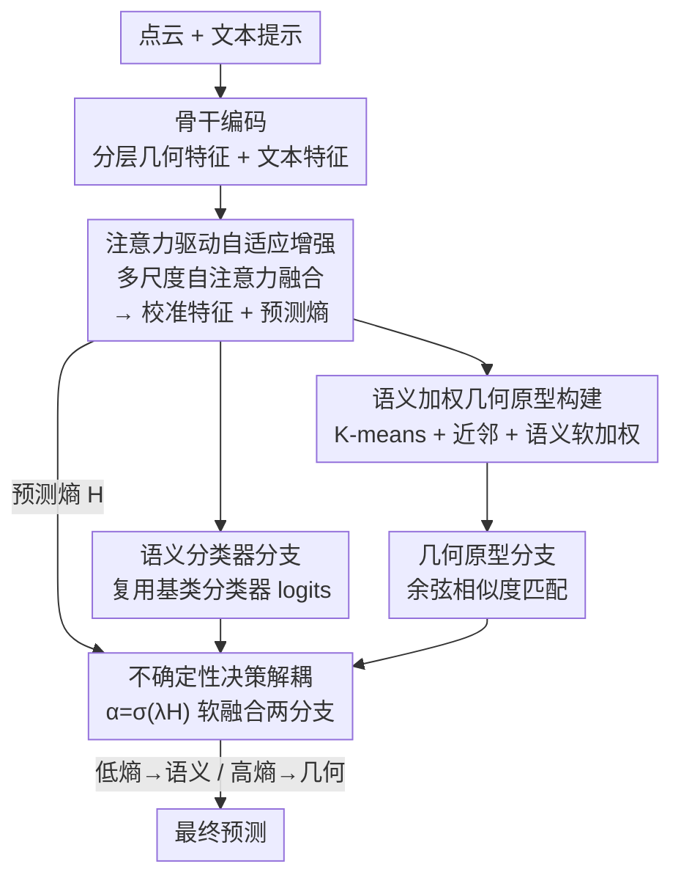

# Point-UQ：面向点云小样本类增量学习的不确定性量化范式

**会议**: ICLR 2026  
**OpenReview**: [https://openreview.net/forum?id=fhVfyiiAqt](https://openreview.net/forum?id=fhVfyiiAqt)  
**领域**: 3D视觉  
**关键词**: 点云、小样本类增量学习、不确定性量化、决策解耦、免训练

## 一句话总结
Point-UQ 把 3D 小样本类增量学习的重心从"反复微调特征"挪到"动态优化决策"，用预测熵衡量每个样本的认知不确定性，在语义分类器和几何原型之间自适应仲裁，从而在不重训的前提下同时守住旧类知识、认对新类样本。

## 研究背景与动机

**领域现状**：3D 小样本类增量学习（3D FSCIL）要求模型先在数据充足的合成基类上训练，随后每来一个新类只用极少的真实扫描样本去增量适应。主流做法（Microshape、Cross-Domain、C3PR、FoundationModel 等）几乎都在"特征"上做文章——通过精细的微调策略增强特征判别力，再借助多模态对齐（如把点云投影成深度图蹭 CLIP 的跨模态知识）来强化语义。

**现有痛点**：这些方法都默认一件事——**特征要不停微调，而决策边界保持静态**。这带来一个根本两难：微调不够，模型分不清新类、还会过拟合基类；微调太猛，又会过拟合那几个稀缺的新样本、加速对旧类的灾难性遗忘。更糟的是，每个增量阶段都重新微调，既抬高训练成本，又随着会话推进不断累积遗忘风险。

**核心矛盾**：问题的根子在于"决策机制是死的"。基类样本多、分类器输出稳定自信，但把这套自信的语义分类器直接套到样本稀缺的新类上就会翻车；而对新类来说，语义分类器权重根本没训练充分，反倒是基于类中心的几何原型匹配更稳。现有范式只盯着特征增强，完全忽视了"决策过程本身可以变得更聪明"。

**本文目标**：在特征表达能力本就有限的前提下，找一条不靠重复微调、而靠"动态分配已有知识"来平衡旧类保持与新类适应的高效路径。

**切入角度**：作者观察到，不确定性量化恰好能为"设计动态推理路径"提供可靠依据——一个样本预测得越含糊（熵越高），就越该少信语义分类器、多信几何结构。这样只需极小的参数开销就能显著提升增量场景下的适应性与鲁棒性。

**核心 idea**：用"基于不确定性的动态决策仲裁"替代"反复微调特征"，让一个免增量训练的范式在语义分类与几何匹配之间按熵自适应切换。

## 方法详解

### 整体框架
Point-UQ 是一个**免增量训练**的 3D FSCIL 范式：所有可学习参数只在基类阶段训练一次，点云编码器和文本编码器全程冻结，增量阶段不更新任何网络权重。整体分两块协同模块——AAE（注意力驱动的自适应增强）负责在基类训练时把骨干网络抽出的多尺度几何特征融成校准表征，并顺手算出预测熵作为每个样本的认知不确定性度量；UDD（不确定性量化决策解耦）则在增量推理时拿着这个熵信号，在"语义分类器分支"和"几何原型分支"之间动态加权仲裁。

直观地说，一个点云进来，先过骨干和 AAE 得到增强特征和一个熵值；熵低（模型有把握，多半是基类）就主要听语义分类器的，复用稳定的基类决策边界；熵高（模型含糊，多半是新类）就把信任转向几何原型匹配，靠空间结构相似度兜底。两条分支的得分按一个由熵驱动的系数 $\alpha$ 软融合，得到最终预测。

### 关键设计

**1. AAE：用多尺度自注意力融合特征，并把预测熵当成可靠的不确定性信号**

针对"浅层局部几何细节没用好、深层语义聚合又丢细节，而固定权重融合无法适配动态判别需求"这一痛点，AAE 不再用固定规则拼接特征，而是用可学习的多头自注意力来动态融合骨干网络的分层特征。具体地，把各层特征 $F=\{F_l\}_{l=1}^{L}$（浅层 $F_1,F_2$ 抓局部几何、深层 $F_{L-1},F_L$ 编码全局语义）堆成张量 $F_{\text{stack}}\in\mathbb{R}^{B\times L\times D}$，再把主点云特征 $F_{pc}$ 作为 query 拼进去得到 $F_{\text{joint}}\in\mathbb{R}^{B\times(L+1)\times D}$，过多头自注意力建模跨层依赖：

$$A_h=\text{Softmax}\Big(\frac{Q_h K_h^\top}{\sqrt{d_k}}\Big),\quad F_{\text{fused}}=\text{Concat}(\text{Head}_1,\dots,\text{Head}_H)W_{\text{out}}$$

为了不让注意力融合冲掉原始局部几何，再加一个残差：$F_{\text{final}}=F_{pc}+W_{\text{res}}\cdot F^{(0)}_{\text{fused}}$。这样既靠跨尺度交互增强了细粒度判别力，又保住了局部几何。AAE 的另一半价值在于：它把语义分类器输出的 softmax 概率算成预测熵 $H(p)=-\sum_c p_c\log p_c$，作为每个样本认知不确定性的可靠估计——这个熵不是事后补的，而是和校准特征一起产出的，直接喂给下游 UDD 做决策依据。

**2. 语义加权几何原型构建：给"高熵时该信谁"准备一组抗噪又有语义的原型**

UDD 高熵时要依赖几何原型，但原型若只是简单取类内均值，容易被离群点带偏、也缺乏语义区分度。为此本文设计了一套语义加权原型：先用 K-means 找到类中心 $\mu_c=\text{KMeans}(F_c)$，按欧氏距离 $d_i=\lVert f_i-\mu_c\rVert_2$ 挑出最近的 $m$ 个核心样本，再用类别文本特征 $p_c$ 算语义相似度 $s_j=f_{ij}^\top p_c$，经稳定化 softmax 归一成权重：

$$w_j=\frac{\exp(s_j-\max(s))}{\sum_{j=1}^{m}\exp(s_j-\max(s))},\qquad c_c=\frac{\sum_{j=1}^{m} w_j f_{ij}}{\sum_{j=1}^{m} w_j}$$

也就是把"离中心近"和"语义相关"两件事捏在一起：先用聚类剔掉离群、保证空间紧致，再用文本语义重新加权，让原型偏向真正代表该类语义的样本。消融显示它明显优于纯均值原型（MeanProto）和纯聚类原型（ClusterProto），尤其在新类识别和不确定性估计上更稳。

**3. UDD：用熵驱动的系数在语义分支和几何分支之间软仲裁**

这是把前两件事兜起来的决策核心，专治"基类自信分类器套到新类就遗忘、新类语义权重又没训好"的冲突。UDD 拆出两条分支：语义分支直接复用预训练基类分类器算 logits $s_{\text{sem}}=f\cdot W_{\text{base}}^\top$；几何分支用增强特征和各新类原型 $c_k$ 算余弦相似度 $s_{\text{geo}}(k)=\frac{f\cdot c_k}{\lVert f\rVert\lVert c_k\rVert}$。关键在融合系数由 AAE 给出的熵决定：

$$\alpha=\sigma(\lambda\cdot H(p))\in[0,1],\qquad s_{\text{final}}=\alpha\cdot s_{\text{geo}}+(1-\alpha)\cdot s_{\text{sem}}$$

其中 $\lambda$ 是可调缩放因子。熵越高 $\alpha$ 越接近 1，决策越偏向几何匹配（应对含糊的新类）；熵越低 $\alpha$ 越接近 0，决策越偏向语义分类器（复用稳定的基类边界）。和"全程一套静态决策边界"的旧范式相比，UDD 把"该信语义还是信几何"变成了一个随样本不确定性连续滑动的开关，因此既能压住灾难性遗忘，又能在跨域分布漂移下保持稳定——因为几何匹配天然比语义分类器更抗域偏移。

### 损失函数 / 训练策略
模型只在基类上训练，点云与文本编码器冻结，只更新 AAE 和原型构建相关参数。训练用两个损失：交叉熵 $L_{ce}=-\frac{1}{N}\sum_i\sum_c y_{ic}\log(p_{ic})$ 保证分类准确；余弦相似度损失 $L_{cos}=1-\frac{1}{N}\sum_i\frac{f_i^\top c_{y_i}}{\lVert f_i\rVert\lVert c_{y_i}\rVert}$ 把特征拉向其类原型。总损失用可调权重 $\beta$ 平衡：$L_{total}=\beta\cdot L_{ce}+L_{cos}$。增量阶段不再训练，只做前向推理与原型扩充。

## 实验关键数据

### 主实验
在 ModelNet、ShapeNet、ScanObjectNN、CO3D 上做内数据集与跨数据集两类评测，指标含平均精度、相对精度下降率 $\Delta\!\downarrow$（越小越好）和调和精度。下表为内数据集最终会话平均精度对比（节选关键基线）：

| 数据集 | 指标 | Point-UQ | 次优基线 | 对比 |
|--------|------|----------|----------|------|
| ModelNet（40 类末会话） | Avg Acc | 79.0 | Microshape 67.1 / C3PR 70.9 | +8 以上 |
| CO3D（50 类末会话） | Avg Acc | 66.5 | C3PR 53.8 | +12.7 |
| ShapeNet（55 类末会话） | Avg Acc | 86.5 | C3PR 74.7 | +11.8 |
| ShapeNet（55 类） | $\Delta\!\downarrow$ | 7.0 | C3PR 15.1 | 遗忘约减半 |

跨数据集设定（更考验域适应）下同样领先，例如 ShapeNet→CO3D 末会话平均精度 80.3 对 FoundationModel 72.6，ModelNet→ScanObjectNN 86.6 对 FoundationModel 79.2。作者总结跨数据集场景下调和精度平均超出现有方法约 9%，相对精度下降率近乎是 Microshape 等基线的一半。

### 消融实验
在 ShapeNet→CO3D 跨数据集上拆 AAE 与 UDD（平均精度 / 调和精度均值）：

| AAE | UDD | 平均精度均值(%) | 调和精度均值(%) | 说明 |
|-----|-----|----------------|----------------|------|
| ✕ | ✕ | — | 54.5 | 基线（无两模块） |
| ✓ | ✕ | — | 55.7 | 仅 AAE，基类阶段判别力提升 |
| ✕ | ✓ | — | 60.0 | 仅 UDD，决策解耦带来主要增益 |
| ✓ | ✓ | — | 64.8 | 完整模型，调和精度 +10.3 |

特征融合方式消融（Tab.4，调和精度均值）：Deep-Semantic-only 60.0、LayerWise-To-Last 61.0、Symmetric-Cross-Fusion 59.4，本文多尺度自注意力 64.8，说明可学习的跨层自适应融合明显胜过各种固定规则融合。

### 关键发现
- UDD 是增益主力：单加 UDD 把调和精度从 54.5 抬到 60.0，再叠 AAE 到 64.8——决策优化的贡献大于单纯特征增强，印证"重心从特征挪到决策"的核心论点。
- 跨数据集优势更明显：2D 改造方法因缺 3D 不变性、新类精度最多崩 20%；Point-UQ 靠"高熵转几何匹配"的开关在域漂移下保持稳定，超次优约 9%。
- 原型构建质量直接影响不确定性估计：语义加权原型在新类识别与不确定性估计上都优于均值/聚类原型，构建原型所用样本数 $m$ 是关键超参之一。

## 亮点与洞察
- **把"不确定性"当成决策路由的开关**很巧妙：熵不仅是评估指标，而是直接以 $\alpha=\sigma(\lambda H)$ 形式连续控制"信语义还是信几何"，几乎零额外参数就实现了动态推理。
- **免增量训练**是工程上的大优点：增量阶段不更新权重，从源头上规避了"微调→遗忘"的死循环，也省掉每会话重训的成本。
- **几何分支兜底跨域**这一观察可迁移：在任何"基类语义稳、新类样本稀且有域偏移"的增量场景里，"高不确定时退回结构/几何匹配"都是一个值得借鉴的稳健策略。

## 局限与展望
- 熵作为不确定性度量依赖语义分类器的标定质量，若基类分类器本身过自信（熵被压低），高熵触发几何分支的机制可能失灵；论文在附录讨论了替代不确定性度量，但正文未给主结论。
- 几何原型依赖文本特征做语义加权，对没有良好文本描述或文本-点云对齐较差的类别，原型质量可能下降。
- 方法默认基类训练数据充足且可一次性获得，对基类本身也是流式到达的更极端设定未覆盖；$\lambda$、$\beta$、$m$ 三个超参需要调，跨数据集的最优取值是否稳定有待更系统验证。

## 相关工作与启发
- **vs Microshape / Cross-Domain**：它们靠域不变描述子或双分支建模来弥合合成-真实域差，仍是"特征侧"努力且决策静态；Point-UQ 不动特征微调，转而做动态决策，遗忘率近乎减半。
- **vs C3PR / FoundationModel**：这两者借 CLIP 把 3D 投到 2D 或直接用大规模 3D 视觉-语言模型强化语义，但牺牲了 3D 几何保真、且决策边界仍固定；Point-UQ 显式保留几何并用熵在语义/几何间仲裁，跨数据集超 FoundationModel 约 9%。

## 评分
- 新颖性: ⭐⭐⭐⭐ 把 FSCIL 重心从特征微调转到不确定性驱动的决策仲裁，视角新且自洽
- 实验充分度: ⭐⭐⭐⭐ 四数据集内/跨设定 + 多组消融，唯部分关键超参敏感性放在附录
- 写作质量: ⭐⭐⭐⭐ 动机-方法-实验逻辑清晰，公式完整
- 价值: ⭐⭐⭐⭐ 免增量训练 + 显著降遗忘，对资源受限的 3D 增量部署有实用意义

<!-- RELATED:START -->

## 相关论文

- [\[ICLR 2026\] Point-Focused Attention Meets Context-Scan State Space: Robust Biological Visual Perception for Point Cloud Representation](point-focused_attention_meets_context-scan_state_space_robust_biological_visual_.md)
- [\[ICLR 2026\] Guaranteed Simply Connected Mesh Reconstruction from an Unorganized Point Cloud](guaranteed_simply_connected_mesh_reconstruction_from_an_unorganized_point_cloud.md)
- [\[ICLR 2026\] PointRePar: SpatioTemporal Point Relation Parsing for Robust Category-Unified 3D Tracking](pointrepar_spatiotemporal_point_relation_parsing_for_robust_category-unified_3d_.md)
- [\[ICLR 2026\] Spiking Discrepancy Transformer for Point Cloud Analysis](spiking_discrepancy_transformer_for_point_cloud_analysis.md)
- [\[ICLR 2026\] RayI2P: Learning Rays for Image-to-Point Cloud Registration](rayi2p_learning_rays_for_image-to-point_cloud_registration.md)

<!-- RELATED:END -->
