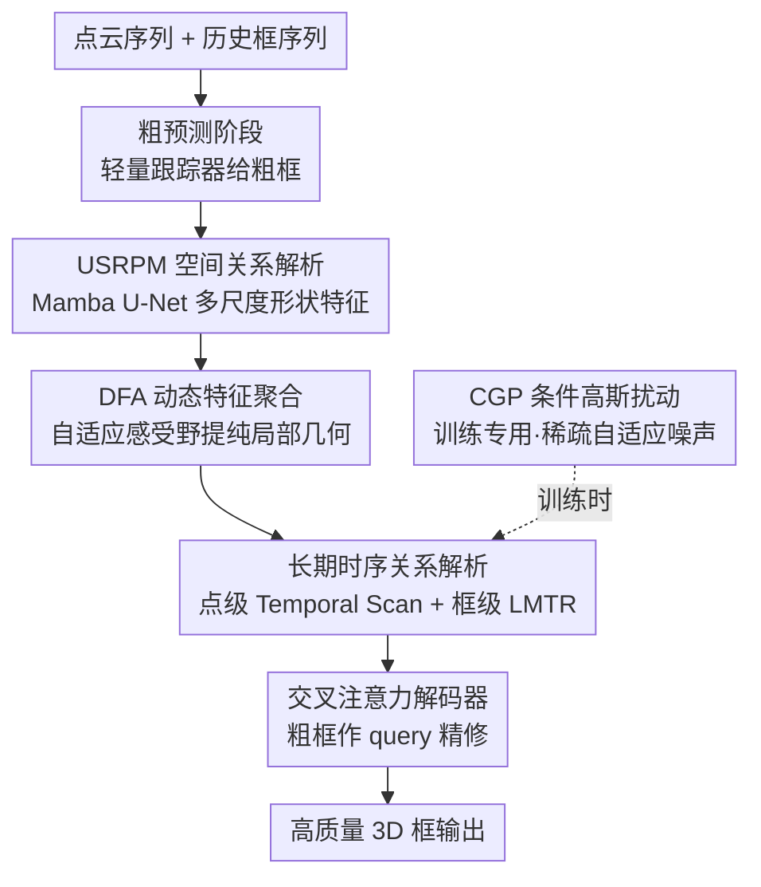

# PointRePar: SpatioTemporal Point Relation Parsing for Robust Category-Unified 3D Tracking

**会议**: ICLR 2026  
**OpenReview**: [https://openreview.net/forum?id=DLcnrY5Uqo](https://openreview.net/forum?id=DLcnrY5Uqo)  
**代码**: 待确认  
**领域**: 3D视觉  
**关键词**: 3D单目标跟踪, 点云, 类别统一, Mamba, 时空关系解析

## 一句话总结
PointRePar 是一个"类别统一"的 3D 单目标跟踪器：用 Mamba 搭建的 U 型空间关系解析骨干 + 动态特征聚合学到更可分的形状特征，再用点级 / 框级双层时序解析捕捉运动，配合稀疏自适应的高斯扰动训练，使得一个模型联合训练所有类别就能超过此前的类别统一方法 CUTrack，并与逐类别训练的 SOTA 掰手腕。

## 研究背景与动机

**领域现状**：3D 单目标跟踪（SOT）给定首帧的目标 3D 包围框，在后续点云流里逐帧预测目标的位置和朝向。主流做法沿用 Siamese 匹配范式（SC3D、P2B、BAT 等）或运动中心范式（M2Track、SeqTrack3D），且几乎全部采用**类别专用（category-specified）训练**——给"车""行人""卡车"各训一个模型。

**现有痛点**：类别专用范式让整个模型容量都聚焦单一类别，确实好优化、收敛快、精度高，但有两个硬伤：一是模型学不到跨类别的通用规律，泛化性和鲁棒性受限；二是要为每个类别各训各存一份模型，效率极低。CUTrack 第一个尝试"类别统一"联合训练，用可变形分组向量注意力去适配不同尺寸形状，但精度明显落后于类别专用的 SOTA。

**核心矛盾**：作者系统分析了 CUTrack 落后的根因——它的**特征学习能力不足**。具体表现为三点：(1) 无论是类别专用常用的 PointNet++ 还是 CUTrack 的 AdaFormer，单帧编码时目标点和背景点在特征空间里**不可分**，容易被背景干扰（见论文 t-SNE 图）；(2) 同一目标在相邻帧之间特征**差异巨大**，时序特征不一致，破坏了帧间匹配；(3) CUTrack 虽把不同类别的运动统一成正态分布，却**缺乏足够的时序建模**和类别无关的时序关系解析设计。

**本文目标**：做一个真正能联合多类别训练、同时在空间形状和时序运动两方面都学得好的类别统一跟踪器。

**切入角度**：把跟踪的核心瓶颈归结为"点关系解析"——空间上要解析多尺度的点—点关系学到可分的形状，时序上要解析点级和框级的关系学到一致的运动。

**核心 idea**：用 Mamba 做时空点关系解析（spatiotemporal point relation parsing），空间侧靠 U 型 Mamba + 动态特征聚合提纯形状特征，时序侧靠点级 Mamba 扫描 + 框级轨迹矫正捕捉运动，再用稀疏自适应扰动提升鲁棒性。

## 方法详解

### 整体框架

PointRePar 采用**由粗到精（coarse-to-fine）两阶段**框架。第一阶段（Coarse Prediction Stage）用一个轻量跟踪器（SegPointNet + miniPointNet）快速给出目标包围框的粗预测；第二阶段（Refining Stage）以这个粗框作为 query，对"富集了时空点关系"的编码特征做交叉注意力精细解码，输出高质量框。整条管线里：空间侧由 **U 型空间关系解析 Mamba（USRPM）**（内含 **动态特征聚合 DFA** 子模块）提取多尺度可分形状特征；时序侧由 **Temporal Scan Mamba**（点级）与 **长期运动轨迹矫正 LMTR**（框级）双层解析运动；训练时额外用 **条件高斯扰动 CGP** 对历史轨迹注入稀疏自适应噪声以提升鲁棒性（仅训练阶段使用）。

### 关键设计

**1. USRPM：用权重共享的双向 Mamba U-Net 做多尺度空间关系解析**

针对单帧编码"目标—背景不可分"的痛点，作者设计了 U 型空间关系解析 Mamba（USRPM），灵感来自 MSVMamba，用 Mamba 的长序列建模能力在效率可控的前提下兼顾全局空间建模。它把点云特征层级下采样构造多尺度表示，得到特征集 $F = \{F^1, F^2, F^3\}$。关键创新在于**权重共享的 Mamba 块**：同一组 Mamba 参数在下采样阶段做前向扫描、在上采样阶段做反向扫描。这样既保持了 MSVMamba 双向建模的高效，又**强制不同扫描方向跨尺度的语义一致**——下采样路径和上采样路径共享权重，避免了两条路径学出割裂的表示。相比把 Mamba 直接塞进点集网络（局部几何细节捕捉不足、难以适配多样形状），USRPM 配合下面的 DFA 才真正解决了类别统一下的形状可分性问题。

**2. DFA：动态特征聚合，按点自适应调整感受野**

单纯堆 Mamba 仍抓不住局部几何、也不适配不同类别千差万别的目标尺寸。DFA 解决的就是这个。给定点 $\{p_i\}$ 及特征 $\{f_i\}$，它先用两层 MLP 为每个点预测 $K$ 个偏移尺度 $\Delta p_i \in \mathbb{R}^{K\times3}$（约束在 $[0,1]$）和权重 $w_i$，把原始点"撑开"成 $N\times K$ 个虚拟点：

$$P_i^o = \{p_i + \Delta p_{ik}\cdot R_{max} \mid k=1,...,K\},\quad W_i^o = \{\mathrm{Sigmoid}(\mathrm{MLP}(f_i))\}_{k=1}^{K}$$

其中 $R_{max}$ 是最大位移半径。虚拟点的特征用反距离加权插值得到 $f_{ik}$，再聚合回原点：$p_i' = \mathrm{LayerNorm}(f_i + \sum_{k=1}^{K} w_{ik} f_{ik})$。这等于**给每个点动态选了一个感受野**：偏移大小由网络自己学，从而在下采样时减少信息损失，同时增强同一物体内部的特征相似性、拉开与背景点的可分性。有趣的是消融显示偏移点数 $K=1$ 就最优（见 Table 4），作者解释为 3D SOT 场景点云稀疏且目标单一，一个偏移点已足够刻画局部几何。

**3. 双层长期时序关系解析：点级 Temporal Scan Mamba + 框级 LMTR**

针对"相邻帧特征不一致、时序建模不足"的痛点，作者**同时**建模点特征和目标轨迹的长期时序，且都用轻量 Mamba 保证效率。点级用 **Temporal Scan Mamba** 在多尺度特征上跨帧扫描，捕捉帧间点级运动细节——但单纯加大点特征的时序窗口计算量会爆炸。于是框级用 **长期运动轨迹矫正（LMTR）**：以往多帧方法只关注点特征、忽略了包围框序列里显式编码的运动。LMTR 取历史框序列 $B_L=\{B_{t-L},...,B_{t-1}\}$（$L>T$）并接上粗预测 $B_t$ 形成 $\hat B_L$，转成角点表示后用 MLP 映射成 token $X_L \in \mathbb{R}^{L\times8\times C}$，加上可学习时序嵌入 $E$ 得 $\hat X_L = X_L + E$，再过 Mamba 建模长程一维序列依赖：$Y=\mathrm{Mamba}(\hat X_L)$，最后取最后 $T$ 步拼成解码器 query $Q_{in}=\mathrm{Concat}(Y_{-T},...,Y_{-1})$。这套"点级抓细节、框级抓轨迹"的双层设计是**类别无关**的，对稀疏 / 遮挡场景和类内干扰物造成的漂移特别有效。消融里 LMTR 框序列长度 7 最优（Table 5），太长反而超过轨迹模式长度、干扰学习。

**4. CGP：条件高斯扰动，按场景稀疏度自适应注噪**

传统做法（M2Track、SeqTrack3D）往训练轨迹里注**均匀噪声**来模拟检测器定位误差，却忽略了误差幅度和场景复杂度的相关性。作者先做了实证分析（论文 Figure 4）：定位不确定性随点云密度上升而下降——稀疏场景几何线索少，定位误差大。据此提出条件高斯扰动（CGP），让扰动强度随场景稀疏度自适应。给定稀疏率 $r$（检测区域点密度的倒数），逐轴施加：

$$\delta_{x,y,z} = \beta_{x,y,z}\cdot c^{-r}\cdot \mathcal{N}(0,1)$$

其中 $c>1$ 控制噪声幅度随密度增大的指数衰减率，$\beta_{x,y,z}$ 是逐轴缩放因子。这样**稀疏观测下放大扰动**模拟低密度区的误差累积、**稠密场景下保持物理合理的噪声边界**，比均匀注噪显著更鲁棒。消融显示 CGP 对运动轨迹最难预测的"行人"类别提升尤为明显。

### 损失函数 / 训练策略
骨干用 PointNet++ 的三层 SA（set abstraction）做下采样，感受半径分别为 0.3 / 0.5 / 0.7 米。在 NVIDIA RTX-3090 上用 Adam 优化、batch size 64 训练。CGP 仅在训练阶段开启，推理时不引入。

## 实验关键数据

### 主实验

在 NuScenes（含大量稀疏场景）上，类别统一范式下 PointRePar 全面碾压同范式的 MoCUT，Mean Success/Precision 提升约 **15.57 / 15.01**；类别专用版本也整体超过 SOTA 的 SiamMo。

| 数据集 | 范式 | 方法 | Mean Success/Precision |
|--------|------|------|------------------------|
| NuScenes | 类别统一 | MoCUT | 51.19 / 64.63 |
| NuScenes | 类别统一 | TrackAny3D | 54.57 / 66.25 |
| NuScenes | 类别统一 | **PointRePar** | **66.76 / 79.64** |
| NuScenes | 类别专用 | SiamMo | 60.31 / 72.68 |
| NuScenes | 类别专用 | **PointRePar** | **64.15 / 76.81** |
| KITTI | 类别统一 | MoCUT | 65.8 / 85.0 |
| KITTI | 类别统一 | **PointRePar** | **72.0 / 89.1** |
| KITTI | 类别专用 | SiamMo | 72.3 / 90.1 |

在 KITTI 上类别统一的 PointRePar（72.0/89.1）超过同范式 MoCUT，并超过多数类别专用方法，仅 Mean 略低于 SiamMo（72.3/90.1）。跨数据集泛化（KITTI 预训练→WOD）上比类别专用 / 类别统一最佳分别再涨 +1.7%/+5.6% 与 +4.0%/+9.7%。推理速度约 36.6 FPS（单 3090），与 SeqTrack3D 等多帧方法相当。

### 消融实验（KITTI，逐项剔除四大设计，Mean Success/Precision）

| 配置 | Mean | 说明 |
|------|------|------|
| 全去（baseline） | 65.7 / 84.6 | 无任何核心设计 |
| +DFA | 68.9 / 87.2 | 动态特征聚合 |
| +DFA+USRPM | 69.9 / 88.1 | 加上 Mamba U-Net 空间骨干 |
| Full（DFA+USRPM+LMTR+CGP） | **72.0 / 89.1** | 完整模型 |

### 关键发现
- **DFA 和 USRPM 贡献空间侧主体增益**：两者是为抓空间点关系、提纯形状特征设计的，去掉任一个都明显掉点；其中"无 USRPM"指用 PointNet++ 替换。
- **CGP 专治难预测轨迹**：对运动轨迹最难预测的"行人"类别提升最明显，印证了它"模拟历史预测误差→增强鲁棒"的设计意图；LMTR 则对轨迹更多变的"车"类别正向收益大。
- **超参敏感性**：DFA 偏移点数 $K=1$ 最优，再加无益；LMTR 框序列长度 7 最优，过长（10、15）反而退化。
- **稀疏鲁棒性**：在目标点数 <30（KITTI）乃至 <15 的极稀疏场景，USRPM 骨干和整体模型都明显优于 PointNet++/AdaFormer 与 SiamMo（Figure 6、7）。

## 亮点与洞察
- **"权重共享 + 前向/反向扫描"**：下采样用前向、上采样用反向、参数共享，一招同时拿到双向建模效率和跨尺度语义一致性，是把 Mamba 适配进点云 U-Net 的巧思。
- **把"包围框序列"当显式运动信号**：以往多帧方法只盯点特征，LMTR 指出历史框序列本身就编码了轨迹，用轻量 Mamba 建模框 token 即可低成本拿到框级运动——这个观察可迁移到任何"有历史状态输出"的时序任务。
- **噪声注入要条件化**：CGP 的"先实证发现误差∝稀疏度、再让扰动随稀疏度指数衰减"是很干净的 data augmentation 思路，可推广到其他受观测密度影响的 3D 任务。
- **类别统一也能打过类别专用**：本文是第一个类别统一 3D 跟踪器在多数指标上与类别专用 SOTA 掰手腕，说明"特征学习能力"才是此前类别统一落后的真正瓶颈，而非范式本身。

## 局限与展望
- 框序列长度、偏移点数等超参对不同类别敏感（如 LMTR 长度 7 是 KITTI 上的折中值），换数据集 / 类别分布可能需要重调。
- WOD 仅用作 KITTI 预训练模型的零样本评测，没有在 WOD 上联合训练，跨域能力的上限尚未充分探索。
- CGP 的稀疏率 $r$ 依赖检测区域点密度估计，在密度估计不准或动态遮挡剧烈的场景下扰动强度可能失配。
- 仍是两阶段由粗到精框架，粗预测阶段的轻量跟踪器若给出严重偏差的粗框，精修阶段的纠偏能力有上限。

## 相关工作与启发
- **vs CUTrack（MoCUT/SiamCUT）**：CUTrack 首倡类别统一，用可变形分组向量注意力适配多类别，但空间特征不可分、时序建模弱。PointRePar 换成 Mamba U-Net + DFA 提纯形状、双层时序解析补运动，在 NuScenes Mean 上领先约 15 个点。
- **vs TrackAny3D**：TrackAny3D 用几何专家混合（MoE）学不同类别几何，但效率次优、仍落后类别专用方法；PointRePar 用更轻量的 Mamba 架构同时拿到精度和 36.6 FPS 的速度。
- **vs SiamMo（类别专用 SOTA）**：SiamMo 在 Siamese 网络里建模目标运动、逐类别训练；PointRePar 一个模型联合训练所有类别就能在 NuScenes 上整体超过它，并在极稀疏场景更鲁棒，KITTI 上仅略逊。

## 评分
- 新颖性: ⭐⭐⭐⭐ 首个与类别专用 SOTA 抗衡的类别统一 3D 跟踪器，时空点关系解析视角清晰，但各组件（Mamba U-Net、DFA、条件噪声）多为已有思路的精巧组合。
- 实验充分度: ⭐⭐⭐⭐⭐ 三大数据集 + 跨域泛化 + 稀疏分级 + 四设计逐项消融 + 超参扫描，证据链完整。
- 写作质量: ⭐⭐⭐⭐ 动机分析（三点失败归因）和实证发现（误差∝稀疏度）讲得到位，少量公式符号略密。
- 价值: ⭐⭐⭐⭐ 把类别统一范式从"明显落后"推到"可比甚至领先"，对自动驾驶等需多类别共模型的场景有直接价值。

<!-- RELATED:START -->

## 相关论文

- [\[CVPR 2026\] Generalizable Structure-Aware Keypoint Correspondence for Category-Unified 3D Single Object Tracking](../../CVPR2026/3d_vision/generalizable_structure-aware_keypoint_correspondence_for_category-unified_3d_si.md)
- [\[ICLR 2026\] Point-Focused Attention Meets Context-Scan State Space: Robust Biological Visual Perception for Point Cloud Representation](point-focused_attention_meets_context-scan_state_space_robust_biological_visual_.md)
- [\[CVPR 2026\] ComPose: A Unified Completion-Pose Framework for Robust Category-Level Object Pose Estimation](../../CVPR2026/3d_vision/compose_a_unified_completion-pose_framework_for_robust_category-level_object_pos.md)
- [\[ECCV 2024\] 3D Single-Object Tracking in Point Clouds with High Temporal Variation](../../ECCV2024/3d_vision/3d_single-object_tracking_in_point_clouds_with_high_temporal_variation.md)
- [\[ICLR 2026\] Point-UQ：面向点云小样本类增量学习的不确定性量化范式](point-uq_an_uncertainty-quantification_paradigm_for_point_cloud_few-shot_class_i.md)

<!-- RELATED:END -->
