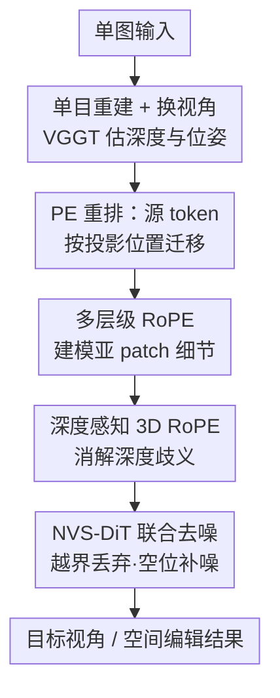

# Positional Encoding Field

**会议**: ICLR 2026  
**OpenReview**: [https://openreview.net/forum?id=STPO8onj9d](https://openreview.net/forum?id=STPO8onj9d)  
**代码**: 待确认  
**领域**: 3D视觉 / 扩散模型 / 新视角合成  
**关键词**: 新视角合成, 扩散Transformer, 位置编码, 旋转位置编码RoPE, 深度感知

## 一句话总结
本文发现 DiT 中图像 token 之间高度独立、空间连贯性几乎完全由位置编码决定，据此把 2D 位置编码扩展成一个带深度、带层级的 3D「位置编码场」（PE-Field），让扩散 Transformer 仅靠改位置编码就能在 3D 空间里重排图像内容，从而在单图新视角合成上取得 SOTA，并自然泛化到可控的空间编辑。

## 研究背景与动机
**领域现状**：扩散 Transformer（DiT）已经成为视觉生成的主流骨干，Flux、Qwen-Image、CogVideo、Wan 等顶尖图像/视频模型都建立在它之上。DiT 把图像切成 patch、每个 patch 编码成一个 token，再叠加 2D 位置编码（PE），用 Transformer 的可扩展性换取空间归纳偏置。

**现有痛点**：人们对 DiT「如何在内部组织和拼合视觉内容」其实理解很少。而在单图新视角合成（NVS）这条具体赛道上，主流做法要么把相机位姿编码成文本条件（难以精确控制视角），要么走「单目重建 → 图像空间 warp → inpainting」的管线（warp 的重投影误差会破坏源图语义、且很难在 inpainting 阶段修回来），要么用视频模型生成中间帧（只想要目标视角时，生成中间帧纯属浪费）。

**核心矛盾**：视角变换本质发生在 3D 空间，而 DiT 的位置编码只活在 2D 图像平面上。仅靠 2D 坐标既无法消解「多个 3D 点投影到同一像素」的深度歧义，也无法在 patch 内部做更细粒度的几何调整。

**切入角度**：作者做了一个朴素却惊人的观察——把图像 token（或噪声 token）的位置编码重新指派后，DiT 解码/生成出来的图像依然全局连贯，只是内容按照新的位置编码重新排布，patch 边界清晰可见。这说明**全局连贯性主要由位置编码强制，而非 token 之间显式的相互依赖**。既然如此，只改位置编码、不动 token 内容，就能让图像内容在空间上结构化地重排。

**核心 idea**：把位置编码从「2D 平面」升级成「3D 结构化场」——给它加上深度轴做体素推理、加上层级结构做亚 patch 控制，于是 DiT 不再需要重训成 3D 模型，就能直接在 3D 位置编码场里推理几何。

## 方法详解

### 整体框架
方法要解决的是：给一张源图和一个目标相机位姿，直接生成几何一致的目标视角图。整体思路是**不在像素空间 warp 图像，而在位置编码空间「搬运」token**——先用单目重建估出每个像素的 3D 位置与深度，把源视角 token 按照目标相机投影到新位置，给它们配上带深度、带层级的 3D 位置编码；同时在目标视角的规则 2D 网格上铺满噪声 token，交给 DiT 联合去噪，越界的 token 丢弃、空缺的格子由噪声补全并逐步精修，最终得到目标视角结果。整个过程把「观测到的图像证据」和「生成式补全」缝在一张 DiT 的前向里。

### 关键设计

**1. Patch 级独立性与位置编码重排：把视角变换变成「搬 token」**

这是全文的基石观察，也对应框架里「PE 重排」这一步。作者发现 DiT 里每个 token 主要编码自己那块局部 patch，彼此保持相当程度的独立：把 token 的位置编码重新指派，解码出的图像就按新布局重排，patch 边界清晰；连去噪过程也如此——重排噪声 token 的位置编码，仍能生成全局连贯的人脸，只是带有与新位置对齐的块状不连续。既然空间组织几乎全由位置编码说了算，作者就不再做图像空间的 warp，而是：以源图单目重建结果和目标相机位姿为条件，把源 token 的位置编码改成它们在目标视角下的投影位置，让内容在 DiT 生成过程里被重新组合到新视角。这样绕开了像素 warp 的重投影误差。但裸搬 token 会暴露两个问题——**分辨率失配**（patch 网格约 16×16 像素，比稠密 3D 重建粗，只能在 patch 级重排、改不动 patch 内部）和**深度歧义**（多个 3D 点投影到同一 token 位置时局部结构会塌缩），这两个痛点正好分别由下面的多层级 RoPE 和深度 RoPE 解决。

**2. 多层级层次化位置编码：在 patch 内部补回细粒度空间结构**

针对「分辨率失配、改不动 patch 内部」的痛点。现有 DiT 虽然把 token 拆到多头（MHA）里建模，但所有头共享同一套绑定在 patch 级位置的 RoPE，因此每个 token 始终只编码整块 patch 的整体内容，缺乏 patch 内细节。作者的做法不是丢掉各头已学到的 patch 级对应关系，而是在 MHA 的拆头结构上「加料」：保留一部分头用原始 patch 级 RoPE（$l_h=0$，一个 token 覆盖 16×16 像素）以维持预训练全局结构，其余头改用更高分辨率网格导出的细粒度 RoPE——每升一级，两个轴的网格分辨率各翻倍、有效格子面积缩到 $1/4$。层级数 $M$ 由总头数 $H$ 自动决定：$M=\lfloor \log_4(3H+1)\rfloor$，可容纳的层次头总数 $W=\frac{4^M-1}{3}$（即几何级数 $1+4+\cdots+4^{M-1}$）。每个头按 $1{:}4{:}16{:}\cdots$ 的几何配额映射到层级，第 $h$ 头的层级为 $l_h=\lfloor\log_4(3h+1)\rfloor-1$（$h\le W$），超出预算的头回退到 $l=0$ 以尽量少扰动预训练先验。以 Flux（24 头）为例：第 1 头用 $l=0$，第 2–5 头用 $l=1$，第 6–21 头用 $l=2$，剩下 22–24 头无法分配、退回 $l=0$；最粗层对应 16×16 patch，最细层对应 4×4 子 patch。因为细层 RoPE 与原始 RoPE 差异很小，这个设计高度兼容原架构，又让直接操纵子 patch RoPE 能在重建中做局部几何微调而不破坏 patch 级对应。

**3. 深度感知旋转位置编码：给位置编码加上第三根 z 轴**

针对「深度歧义」的痛点。标准 2D RoPE 把横坐标 $x$、纵坐标 $y$ 分别编码到嵌入向量的两段不相交子空间，各自施加 1D RoPE，使旋转后 query/key 的点积编码两轴上的相对位移。作者顺着同样的原理，引入第三根空间轴——深度 $z$，即每个像素对应 3D 点沿相机光轴到相机的距离。于是 $(x,y,z)$ 各占嵌入向量一段不相交子空间、各有自己的 1D RoPE：$Q^{(h)}=\big(\mathrm{RoPE}^{(l_h)}_x(Q^{(h)}_x),\ \mathrm{RoPE}^{(l_h)}_y(Q^{(h)}_y),\ \mathrm{RoPE}^{(l_h)}_z(Q^{(h)}_z)\big)$，$K$ 同理。这就把 RoPE 升级成 3D 空间 RoPE，相对偏移不仅含图像平面、还含深度轴，让 Transformer 能区分「2D 投影重叠但深度不同」的 token，建模体素级对应、在跨视角时保持几何一致。多层级与深度两者合起来，正是「位置编码场（PE-Field）」的两个核心创新。

**4. NVS-DiT 联合去噪架构：把图像证据与生成补全缝进一次前向**

把上面两个 PE 创新落到完整的 NVS 模型里（框架图末段）。Transformer 同时吃两类 token：噪声 token 铺在规则 2D 网格上、深度初始化为 0；源视角图像 token 则经单目重建与视角变换投影到目标相机视角，按投影位置分配带深度的分层 3D 位置编码 $(x,y,z)$。投影到有效网格外的 token（图 4 中索引 6）直接丢弃，没有图像 token 落入的空格子（索引 0）由噪声 token 填充、再由 Transformer 逐步精修出合理内容。训练用多视角监督下的矫正流（rectified flow）匹配损失：$\mathcal{L}_\theta=\mathbb{E}\big[\lVert v_\theta(z_t,t,x^{\text{trans-PE}}_{\text{src}})-(\varepsilon-x_{\text{tgt}})\rVert_2^2\big]$，其中 $z_t=(1-t)x_{\text{tgt}}+t\varepsilon$ 是干净潜变量与高斯噪声 $\varepsilon$ 的线性插值，$x^{\text{trans-PE}}_{\text{src}}$ 是改过位置编码的源视角 token，$x_{\text{tgt}}$ 是目标视角 token（均由 DiT 的 VAE 编码得到）。模型基于 Flux.1 Kontext（天生支持参考图 token），去掉文本输入、只用参考图做条件，在 DL3DV、MannequinChallenge 上用 VGGT 估深度与位姿来训练。

### 一个例子：大视角旋转的多步生成
当目标视角与源视角差很大时，模型需要一次性补出大量未见内容，生成负担重、容易和源图不一致。作者把变换拆成多步——例如把一次大旋转分成 5 步，每步只补一小部分缺失内容；每步生成后把新内容融回原视角的图像 token，再把融合后的 token（或点云）变换到下一个中间视角继续生成。相比一步直接转到目标视角，这种渐进策略生成的结果与源视角更一致（图 8）。

## 实验关键数据

### 主实验
在 Tanks-and-Temples、RE10K、DL3DV 三个数据集上做单图新视角合成，统一用 VGGT 预测的深度/点云作为需要几何输入的方法的条件，报告 PSNR / SSIM / LPIPS 平均分。本文在三个数据集的所有指标上都超过现有方法。

| 数据集 | 指标 | 本文 | 之前最好（GEN3C） | 提升 |
|--------|------|------|----------|------|
| Tanks-and-Temples | PSNR↑ | 22.12 | 19.18 | +2.94 |
| RE10K | PSNR↑ | 21.65 | 20.64 | +1.01 |
| DL3DV | PSNR↑ | 22.23 | 19.14 | +3.09 |
| Tanks-and-Temples | LPIPS↓ | 0.174 | 0.207 | −0.033 |
| DL3DV | SSIM↑ | 0.742 | 0.658 | +0.084 |

定性上（图 5），GEN3C 常把重建伪影传播成白色条纹与不规则边界，NVS-Solver、ViewCrafter 易引入 depth-warping 误差，GenWarp 因坐标缺深度、坐标系与输入图错位而效果差。值得注意的是，与众多视频类模型不同，本文不需生成中间帧，生成目标视角比视频类方法快一个数量级以上，同时仍保持几何一致。与基于提示词的编辑模型相比，Flux 对视角类提示几乎不敏感、Qwen-Image-Edit 会改动原图 token 甚至改变人物身份，都难以精确控制视角。

### 消融实验
两个核心组件的消融并入主表（Tanks-and-Temples / DL3DV 列）：

| 配置 | PSNR↑ (T&T) | PSNR↑ (DL3DV) | 说明 |
|------|------|------|------|
| Original PE | 20.03 | 19.92 | 直接用原始 2D PE 搬 token |
| w/o Depth | 20.63 | 20.46 | 去掉深度轴 |
| w/o Multi-Level | 21.97 | 21.91 | 去掉多层级细粒度 PE |
| Ours（完整） | 22.12 | 22.23 | PE-Field 完整模型 |

### 关键发现
- 两个组件叠加才达到最佳：从 Original PE 到完整模型，Tanks-and-Temples PSNR 从 20.03 升到 22.12。
- 去掉多层级 PE（尤其是细粒度层）时，patch 级位置编码与重建不匹配会带来明显形变失真（图 7 上例）。
- 去掉深度信息时，生成图出现严重空间错位（图 7 下例），印证深度轴对消解投影歧义的作用。
- 训练后的 NVS 模型获得了「在 3D 空间推理视觉 token」的能力，无需任务特定训练即可零样本迁移到物体级 3D 编辑（抠出书本点云、旋转、再合回背景）和物体移除（丢弃被遮区 token、补噪声重绘）。

## 亮点与洞察
- 最「啊哈」的点：DiT 的全局连贯性几乎完全由位置编码托管，token 内容彼此独立——这把「视角变换」从「重画图像」降维成「搬运位置编码」，是个非常可复用的认知。
- 几乎零成本扩展：3D RoPE 和多层级 RoPE 都只动位置编码、不改 token 内容，也不需把模型重训成 3D 模型，且细层 RoPE 与原始 RoPE 差异极小，对预训练 DiT 高度兼容。
- 把「按头分配层级」的几何配额（$1{:}4{:}16$、$M=\lfloor\log_4(3H+1)\rfloor$）做成了对任意头数自适应的规则，迁移到别的 DiT 骨干时不用手调。
- 「改位置编码即编辑」的范式可迁移到物体旋转、物体移除等空间编辑任务，且无需重新训练。

## 局限与展望
- 依赖单目重建质量：深度与位姿来自 VGGT，重建误差会直接进入位置编码，源头不准则下游几何受限。
- 大视角变换需要靠多步生成来缓解一致性下降，单步直接转到大角度仍会牺牲与源图的一致性。
- patch 级搬运的粒度上限仍受 token 网格分辨率约束，多层级 RoPE 缓解但未根除分辨率失配。
- 当前在 Flux.1 Kontext 上验证，是否对其他 DiT 骨干（不同头数/RoPE 设计）同样稳健，文中以自适应规则给出了思路但实验覆盖有限。

## 相关工作与启发
- **vs GenWarp（2D 坐标输入）**: GenWarp 用 warp 后的 2D 坐标代替直接 warp 图像，但视角变换本在 3D 中发生，仅靠 2D 坐标仍有歧义、还要训额外分支处理坐标输入；本文直接在位置编码里引入深度轴，3D 推理且不另起分支。
- **vs 重建→warp→inpainting 类扩散方法**: 这类方法在像素空间 warp，重投影误差会破坏源图语义且难在 inpainting 修回；本文在位置编码空间搬 token，从根上避开像素 warp 误差。
- **vs 视频类 NVS（DimensionX / GEN3C / Voyager 等）**: 视频模型靠生成中间帧实现相机控制，只要目标视角时纯属浪费；本文一步直达目标视角，速度快一个数量级以上仍保持几何一致。
- **vs 提示词编辑（Flux.1 Kontext / Qwen-Image-Edit）**: 提示词难以精确控制旋转角度，且 Qwen 会改动原图 token 损失一致性；本文通过位置编码场实现精确、保身份的视角控制。

## 评分
- 新颖性: ⭐⭐⭐⭐⭐ 「连贯性由 PE 托管」的观察 + 把 PE 升成 3D 深度/层级场，角度新且自洽。
- 实验充分度: ⭐⭐⭐⭐ 三数据集、十余个 baseline、双组件消融与多应用，但消融维度集中在两组件本身。
- 写作质量: ⭐⭐⭐⭐ 从观察到方法的推导清晰，公式与配额规则交代到位。
- 价值: ⭐⭐⭐⭐⭐ 给 DiT 提供了「只改位置编码即可几何可控生成」的通用范式，可迁移到编辑/移除等任务。

<!-- RELATED:START -->

## 相关论文

- [\[ICLR 2026\] UniUGG: Unified 3D Understanding and Generation via Geometric-Semantic Encoding](uniugg_unified_3d_understanding_and_generation_via_geometric-semantic_encoding.md)
- [\[ICLR 2026\] LiTo: Surface Light Field Tokenization](lito_surface_light_field_tokenization.md)
- [\[ICLR 2026\] MAVEN: A Mesh-Aware Volumetric Encoding Network for Simulating 3D Flexible Deformation](maven_a_mesh-aware_volumetric_encoding_network_for_simulating_3d_flexible_deform.md)
- [\[CVPR 2026\] SoPE: Spherical Coordinate-Based Positional Embedding for Enhancing Spatial Perception of 3D LVLMs](../../CVPR2026/3d_vision/sope_spherical_coordinate-based_positional_embedding_for_enhancing_spatial_perce.md)
- [\[ICLR 2026\] WAFT: Warping-Alone Field Transforms for Optical Flow](waft_warping-alone_field_transforms_for_optical_flow.md)

<!-- RELATED:END -->
