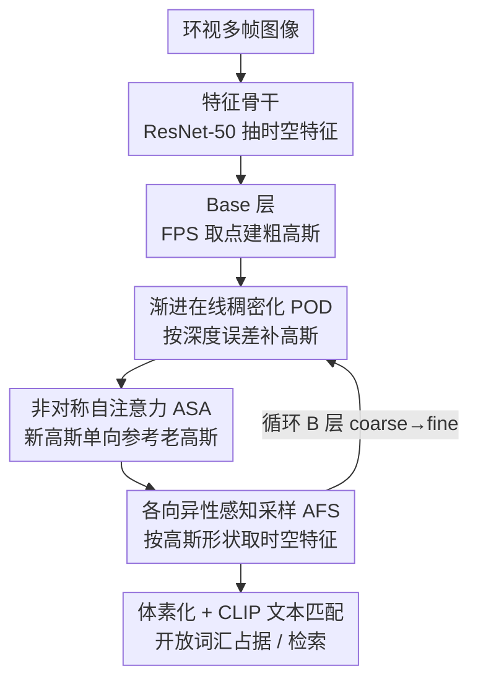

# Progressive Gaussian Transformer with Anisotropy-aware Sampling for Open Vocabulary Occupancy Prediction

**会议**: ICLR 2026  
**OpenReview**: [https://openreview.net/forum?id=mHFaflQv93](https://openreview.net/forum?id=mHFaflQv93)  
**代码**: https://yanchi-3dv.github.io/PG-Occ  
**领域**: 3D视觉 / 开放词汇 / 自动驾驶感知  
**关键词**: 3D占据预测, 开放词汇, 高斯表示, 渐进式稠密化, 各向异性采样

## 一句话总结
PG-Occ 用一组带文本对齐特征的稀疏 3D 高斯来表示驾驶场景，并通过"渐进在线稠密化"边推理边在欠重建区域补高斯、配合"各向异性感知采样"按高斯形状自适应取特征，在 Occ3D-nuScenes 开放词汇占据预测上相对前 SOTA 提升 14.3% mIoU。

## 研究背景与动机
**领域现状**：3D 占据预测（3D occupancy prediction）是视觉自动驾驶感知的核心任务，相比 BEV 它补上了高度维度，能给出完整的三维场景。为了摆脱"只认预定义类别"的限制，近期方法不再直接预测固定语义类，而是预测**文本对齐特征**（text-aligned feature），推理时用 CLIP 文本嵌入与之算相似度，从而支持任意文本查询的开放词汇感知。

**现有痛点**：文本特征维度很高（512 维），把整个场景**稠密**地建成体素特征会带来巨大的显存与算力开销；于是 GaussTR 等工作改用**稀疏高斯**来表示场景，效率上去了，但高斯本身稀疏，难以刻画小物体和复杂场景的细节。

**核心矛盾**：开放词汇占据建模里存在一个稀疏 ↔ 稠密的 trade-off——稀疏高斯省算力但抓不住小目标，稠密表示能抓细节但算不动。已有的稀疏高斯方法还普遍用**固定数量**的高斯 query，无论场景复杂与否都一样，进一步限制了对复杂结构的表达。

**本文目标**：在保持稀疏高斯效率的前提下，让表示具备"该细的地方变细"的能力；同时让高斯在 2D 特征图上的采样真正利用其几何形状，而不是当成一个点。

**切入角度**：作者借鉴前馈式 3D Gaussian Splatting 的思路——既然可以一次前馈预测高斯参数，那也可以**前馈式地、按当前预测误差自适应地加高斯**，而不依赖原版 3DGS 那种基于梯度的离线稠密化。

**核心 idea**：用"渐进式高斯 Transformer"做 coarse-to-fine 的占据预测：先用一层 base 高斯建全局粗结构，再用 B 个渐进层根据深度误差在线补高斯、并用各向异性采样融合时空特征。

## 方法详解

### 整体框架
PG-Occ 把驾驶场景表示成一组**文本对齐特征高斯 blob** $G=\{G_i:(\mu_i,s_i,r_i,\sigma_i,f_i)\}$，每个高斯有位置 $\mu_i\in\mathbb{R}^3$、尺度 $s_i\in\mathbb{R}^3$、旋转四元数 $r_i\in\mathbb{R}^4$、不透明度 $\sigma_i$ 和一个 512 维文本对齐特征 $f_i$（把原版高斯的颜色换成了语义特征）。输入是当前时刻及前若干帧的 $L$ 路环视相机图像，输出是任意分辨率的 3D 语义占据场。

整体是一个**渐进式高斯 Transformer**：先用 ResNet-50 抽时空图像特征，再经过一个 base 层（捕捉粗几何）+ $B$ 个渐进层（迭代细化与扩充高斯）。每个渐进层做三件事：用 POD 根据上一层的深度误差在欠重建区域补新高斯；用 ASA（非对称自注意力）让新高斯能参考老高斯但不污染老高斯；用 AFS（各向异性感知采样）按每个高斯的形状取时空特征并聚合解码出新的几何与特征。训练全程只用 2D 监督（伪深度 + 文本特征），不需要 LiDAR 或 3D 标注；推理时再把高斯体素化成稠密占据。

### 关键设计

**1. 渐进在线稠密化 POD：用前馈+深度误差自适应补高斯**

针对"固定数量稀疏高斯抓不住小物体"的痛点，POD 让高斯数量在推理时按需增长。它分两步：**base 初始化**用 Metric3D V2 的伪深度图反投影出伪点云 $P=\bigcup_l T_l\cdot(K_l^{-1}\cdot D_l)$，再用最远点采样（FPS）选出 $N$ 个代表点作为初始高斯位置；**前馈稠密化**则在每个渐进层比较该层渲染出的期望深度 $\hat D$ 与参考深度 $D$，把误差超阈值的像素标为欠重建区域：

$$U_{select}=\{(u,v)\in\Omega\mid \hat D(u,v)-D(u,v)>\gamma\}$$

其中 $\gamma$ 取最终占据栅格分辨率的一半。在这些区域生成点集并 FPS 采出 $n^b$ 个新高斯，与上一层优化后的高斯拼接 $\mu^b=\mu^{b-1}\oplus\mu^b_{add}$ 作为本层输入。关键在于整个稠密化**只靠高斯渲染、不做梯度反传**，因此能实时、自适应地把算力投到重建不足的地方，而不像原版 3DGS 那样依赖梯度并离线优化。

**2. 非对称自注意力 ASA：让新高斯参考老高斯但不反向污染**

POD 新加的高斯一开始是欠优化的。如果直接用标准自注意力建模高斯间关系，这些"半成品"会反过来干扰前几层已经训练好的高斯，导致训练不稳定。ASA 通过一个注意力掩码强制**单向交互**：新高斯可以 attend 到老高斯、借用它们的特征来细化自己；老高斯则不受新高斯影响。形式上，设第 $b$ 层有 $x^b$ 个 query、前 $x^{b-1}$ 个继承自上一层，掩码为：

$$M_{i,j}=\begin{cases}-\infty,& i<x^{b-1}\ \text{and}\ j\ge x^{b-1}\\ 0,& \text{otherwise}\end{cases}$$

即"老 query（行 $i<x^{b-1}$）看新 query（列 $j\ge x^{b-1}$)"的注意力被屏蔽。这样既稳住了已学好的高斯，又让新扩充的高斯能逐步从已有信息中改进自己。消融里把 ASA 换回普通自注意力（w/o ASA）会掉到 14.85 mIoU，而完全去掉自注意力（w/o SA）则崩到 11.14，说明高斯间的信息传播很关键、但必须是非对称的。

**3. 各向异性感知采样 AFS：按高斯椭球形状而非中心点取特征**

把每个高斯只当成中心点 $\mu_i$ 去采样，会丢掉尺度 $s$ 和旋转 $r$ 编码的各向异性——而这恰恰决定了高斯在 2D 特征空间的有效感受野。AFS 让 query 特征过一个 MLP 生成 $n=16$ 个单位偏移 $\mu_\delta$，再按高斯椭球缩放和旋转，使采样点落在椭球内：

$$\mu^{i,j}_{sample}=\mu_i+R(r_i)\cdot(s_i\odot\mu^{i,j}_\delta),\quad j=1,\dots,n$$

这些 3D 采样点投到各视角/各时刻的 2D 特征平面，双线性插值后聚合成单个代表特征 $f_a^i$，最后两个轻量 MLP 分别解码文本特征 $f_i=\text{MLP}_{feat}(f_a^i)$ 和几何属性 $(\Delta\mu_i,s_i,r_i,\sigma_i)=\text{MLP}_{geo}(f_a^i)$，位置以增量方式更新 $\mu_i=\mu_{i-1}+\Delta\mu_i$。这样大高斯有大感受野、小高斯有小感受野，特征聚合更贴合几何；定性结果（图 7）显示去掉 AFS 会在近相机处产生过大的高斯、破坏占据估计稳定性。

### 损失函数 / 训练策略
全程只用 2D 监督，把每层高斯 $G_b$ 光栅化到 2D 平面后计算两类损失。**深度渲染损失**结合 SILog、L1 与时序光度一致性：$L_{depth}=L_{L1}+\lambda_{SILog}L_{SILog}+\lambda_{temp}L_{temp}$；**特征渲染损失**结合余弦相似度与 MSE：$L_{feat}=L_{cos}+\lambda_{mse}L_{mse}$；总目标 $L_{total}=\lambda_{depth}L_{depth}+\lambda_{feat}L_{feat}$。实现上用 ResNet-50 骨干、前 7 帧时空信息、1 个 base 层 + 2 个渐进层，8×A800 训练 8 epoch（约 9 小时），深度/特征光栅化分辨率 180×320。推理时用 CLIP 文本编码器编码任意 prompt 与高斯特征匹配赋语义标签，再做高斯到体素的后处理得到稠密占据。

## 实验关键数据

### 主实验
在 Occ3D-nuScenes 上，PG-Occ 仅用相机+文本监督（不用 LiDAR）就达到 15.15 mIoU，相对前最佳 14.3% 提升，并在多个中大型物体类别上领先。

| 数据集 | 指标 | 本文 | 之前SOTA | 提升 |
|--------|------|------|----------|------|
| Occ3D-nuScenes | mIoU | 15.15 | 14.07 (GaussianFlowOcc) | +14.3% (相对，对 13.25 GaussTR) |
| Occ3D-nuScenes | bus IoU | 23.63 | 14.70 (VEON) | 大幅领先 |
| Occ3D-nuScenes | car IoU | 26.42 | 20.43 (GaussTR) | +5.99 |
| nuScenes retrieval | mAP(v) | 21.2 | 18.2 (LangOcc) | +3.0 |
| nuScenes 深度 | Abs Rel ↓ | 0.139 | 0.170 (Metric3D V2 标签) | 超越监督来源 +18.2% |

> ⚠️ mIoU 的 14.3% 相对提升按论文表述是相对 GaussTR (13.25) 计算；表中绝对最高的对比项为 GaussianFlowOcc 的 14.07。

### 消融实验

| 配置 | mIoU | RayIoU | mAP(v) | 说明 |
|------|------|--------|--------|------|
| Full model | 15.15 | 13.92 | 21.20 | 完整模型 |
| w/o POD | 14.84 | 12.58 | 19.21 | 去掉在线稠密化 |
| w/o AFS | 15.03 | 13.56 | 20.12 | 去掉各向异性采样 |
| w/o ASA | 14.85 | 12.76 | 19.41 | 自注意力改回对称 |
| w/o SA | 11.14 | 10.44 | 15.60 | 完全去掉自注意力 |

### 关键发现
- **自注意力是骨架**：完全去掉自注意力（w/o SA）mIoU 从 15.15 暴跌到 11.14，是所有消融里掉得最多的；但若改回对称自注意力（w/o ASA）也会掉到 14.85，说明高斯间需要交互、且必须非对称。
- **POD 对检索增益明显**：去掉 POD 后 mAP(v) 从 21.20 掉到 19.21，渐进稠密化对开放词汇检索鲁棒性帮助大。
- **效率同步提升**：相比基线，mIoU +14.3% 的同时 FPS +41.1%、训练时间 -25%，并非靠堆算力换精度。
- **小物体仍偏弱**：0.4 m 的体素分辨率限制了精细高斯的贡献，作者承认小目标上略逊。
- **零样本泛化**：在 Lyft Level-5 上不微调直接推理仍能给出可靠占据，深度甚至超过其监督来源 Metric3D V2。

## 亮点与洞察
- **稠密化无需梯度**：POD 把"哪里该补高斯"转化为渲染深度与参考深度的差异判断，纯前馈、可实时，巧妙绕开了原版 3DGS 梯度稠密化的离线开销。
- **非对称掩码稳训练**：用一个简单的注意力掩码就解决了"新生高斯污染老高斯"的稳定性问题，这个"单向信息流"思路可迁移到任何渐进/增量加 token 的架构。
- **形状即感受野**：AFS 把高斯的 scale/rotation 直接转成 2D 采样的感受野，让"各向异性"这个 3DGS 里常被忽略的几何属性真正参与特征聚合。
- **纯 2D 监督做开放词汇 3D**：整条管线不碰 LiDAR 和 3D 标注，却超过了用 LiDAR 训练的 VEON，对标注成本敏感的落地场景很有吸引力。

## 局限与展望
- 作者承认在**小物体**上表现略弱，根因是 0.4 m 体素分辨率压制了精细高斯的贡献。
- 依赖外部伪深度模型（Metric3D V2 / UniDepth V2）提供监督，深度模型质量是上游瓶颈（论文用 Table 13 验证了换 UniDepth 的鲁棒性，但仍是依赖）。
- 渐进层数、每层补点数 $n^b$、阈值 $\gamma$ 等超参与稠密化策略耦合较紧，论文未充分展开这些超参的敏感性分析。
- 可改进方向：自适应体素分辨率以救小目标、把深度先验与高斯几何联合优化、把时序融合扩展到更长 horizon。

## 相关工作与启发
- **vs GaussTR**: 同样用稀疏文本对齐高斯做开放词汇占据，但 GaussTR 用固定数量 query、camera-wise 前馈；本文用渐进在线稠密化动态扩充高斯，捕捉更厚实的表面和小目标，car IoU 从 20.43 升到 26.42。
- **vs GaussianFlowOcc / GaussianFormer**: 它们也用稀疏高斯降空 voxel 算力，但走的是固定查询或流估计；本文核心是 coarse-to-fine 的渐进稠密化 + 各向异性采样。
- **vs VEON / LangOcc / POP-3D**: 这些开放词汇占据方法或依赖 LiDAR、或用 NeRF 纯视觉，PG-Occ 在不用 LiDAR 的前提下 mIoU 反超 VEON，检索 mAP(v) 超 LangOcc。
- **vs 原版 3DGS**: 3DGS 需场景级离线优化+梯度稠密化；本文借鉴 Splatter Image / pixelSplat 的前馈思路，把稠密化也做成前馈、按预测误差触发。

## 评分
- 新颖性: ⭐⭐⭐⭐ 前馈在线稠密化 + 非对称自注意力 + 各向异性采样三者组合，针对稀疏/稠密 trade-off 切得准。
- 实验充分度: ⭐⭐⭐⭐ 占据/检索/深度三类任务 + 完整组件消融 + 跨域零样本 + 换深度模型鲁棒性。
- 写作质量: ⭐⭐⭐⭐ 框架与公式清晰，POD/ASA/AFS 三模块职责分明。
- 价值: ⭐⭐⭐⭐ 纯 2D 监督做开放词汇 3D 占据，效率与精度同涨，对自动驾驶感知落地有实际意义。

<!-- RELATED:START -->

## 相关论文

- [\[CVPR 2026\] OnlinePG: Online Open-Vocabulary Panoptic Mapping with 3D Gaussian Splatting](../../CVPR2026/3d_vision/onlinepg_online_open-vocabulary_panoptic_mapping_with_3d_gaussian_splatting.md)
- [\[ICLR 2026\] OVSeg3R: Learn Open-vocabulary Instance Segmentation from 2D via 3D Reconstruction](ovseg3r_learn_open-vocabulary_instance_segmentation_from_2d_via_3d_reconstructio.md)
- [\[ICLR 2026\] GeoPurify: A Data-Efficient Geometric Distillation Framework for Open-Vocabulary 3D Segmentation](geopurify_a_data-efficient_geometric_distillation_framework_for_open-vocabulary_.md)
- [\[CVPR 2026\] OVI-MAP: Open-Vocabulary Instance-Semantic Mapping](../../CVPR2026/3d_vision/ovi-map_open-vocabulary_instance-semantic_mapping.md)
- [\[ICLR 2026\] World2Minecraft: Occupancy-Driven Simulated Scenes Construction](world2minecraft_occupancy-driven_simulated_scenes_construction.md)

<!-- RELATED:END -->
