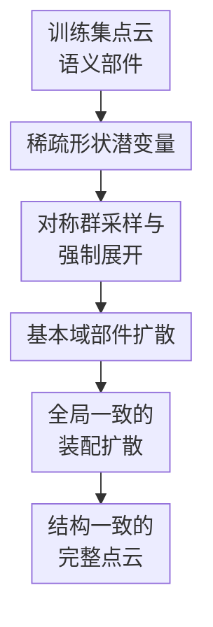

# Quartet of Diffusions: Structure-Aware Point Cloud Generation through Part and Symmetry Guidance

**会议**: ICLR 2026  
**OpenReview**: [https://openreview.net/forum?id=BT9rsod6Hc](https://openreview.net/forum?id=BT9rsod6Hc)  
**代码**: 无  
**领域**: 3D视觉 / 点云生成  
**关键词**: 点云生成、部件组合、对称性约束、扩散模型、结构感知生成  

## 一句话总结
这篇论文把点云生成拆成形状潜变量、对称群、语义部件和部件装配四个扩散过程，用显式部件与对称性先验生成更一致、更可控、且在 ShapeNetPart 上更接近真实分布的 3D 点云。

## 研究背景与动机
**领域现状**：3D 点云生成近几年主要沿着两条线发展：一条是把整个点云当作一个整体分布来学，例如 flow、VAE、score-based 或 diffusion 模型；另一条是引入 part-aware 表示，把物体看作多个语义部件的组合，从而支持局部编辑和更丰富的结构变化。

**现有痛点**：整体式点云生成容易把外观 fidelity 做好，却没有显式机制约束机翼、车轮、椅腿这类结构单元之间的关系。部件式方法虽然能单独生成或组合部件，但通常只管“有什么部件、部件放在哪里”，没有把反射、旋转、局部重复等对称结构作为可学习、可执行的生成变量。结果是模型可能生成看似完整但局部不对称的椅子、偏移的车轮、或左右机翼不一致的飞机。

**核心矛盾**：结构感知点云生成需要同时满足两件事：一方面要保留整体生成模型的多样性和几何质量，另一方面又要让部件关系与对称规律在生成过程中被真正执行。只在 loss 里惩罚不对称并不能保证结果对称；只做部件分解也不能保证各部件按全局形状一致地装配。

**本文目标**：作者把目标拆成四个子问题：先得到能协调全局结构的形状潜变量；再为每个语义部件生成合适的对称群；然后只生成部件的基本域并用对称群展开成完整部件；最后学习每个部件的平移、旋转和缩放，把它们装配回完整点云。

**切入角度**：论文的观察是，真实物体的结构规律往往同时体现在“部件是什么”和“部件怎样重复或镜像”上。例如飞机机翼是成对反射的，车轮既有局部旋转结构又要在车身两侧成对出现，椅腿则可能是多次反射组合出来的重复结构。因此，与其让一个大模型隐式猜这些规律，不如把它们拆成可解释的生成变量。

**核心 idea**：用四个协同扩散模型分别学习形状潜变量、对称群、基本域部件和装配变换，让点云生成从“整体采样”变成“先定结构规律、再生成部件、最后按全局约束装配”的过程。

## 方法详解

### 整体框架
Quartet of Diffusions 的输入不是条件图像或文本，而是从训练集学到的无条件 3D 点云分布；输出是由多个语义部件拼成的完整点云 $\tilde{x}$。核心做法是把一个点云写成 $x=\bigcup_{j=1}^{M}T_jp_j$：$p_j$ 是第 $j$ 个语义部件，$T_j$ 是负责把该部件放回全局坐标系的平移、旋转和缩放变换。

整条生成链路由四个 diffusion 组成。先从形状潜变量分布 $p_\theta(z)$ 采样全局 latent $z$；再对每个部件采样对称群 $S_j\sim p_\zeta(S_j\mid z)$；随后在 $S_j$ 和 $z$ 条件下生成该部件的基本域 $d_j$，并通过对称群展开得到完整部件 $p_j$；最后用部件编码器得到 $w_j$，从装配扩散 $p_\psi(T_j\mid w_j,z)$ 中采样变换 $T_j$，把所有部件装配成完整点云。

从概率建模角度看，论文把联合分布分解为：

$$
p\left(\{(p_j,T_j,S_j,w_j)\}_{j=1}^{M},z\right)
=p_\theta(z)\prod_{j=1}^{M}p_\zeta(S_j\mid z)p_\xi(p_j\mid S_j,z)q_\phi(w_j\mid p_j,z)p_\psi(T_j\mid w_j,p_j,S_j,z).
$$

这条分解的意义在于：$z$ 提供全局结构锚点，$S_j$ 决定每个部件应遵守的对称规律，$p_j$ 负责局部几何，$T_j$ 负责空间装配。四者各学一个相对清晰的分布，合在一起得到既可解释又可控制的生成过程。

### 关键设计
**1. 稀疏形状潜变量：用全局 latent 统一四个局部分布的结构语境**

如果每个部件、每个对称群和每个装配变换都独立采样，模型很容易生成“单个部件还行、合起来不像同一个物体”的结果。论文因此先训练一个 sparse VAE（SVAE）把完整点云编码成形状潜变量 $z$，再用 latent diffusion $p_\theta(z)$ 学习这些潜变量的分布。这样所有后续 diffusion 都能以 $z$ 为共同条件，相当于先确定“这是一把什么样的椅子/一辆什么形态的车”，再生成局部结构。

SVAE 的关键不是简单换一个 encoder，而是在 VAE 的 encoder 最后一层激活 $a_\eta(x)$ 上加入稀疏约束。原文把约束写成 $\mathbb{E}_x[\|a_\eta(x)\|_1]<\delta$，再用 KKT 拉格朗日形式得到训练下界：$\mathcal{L}_{\text{SVAE}}=\mathcal{L}_{\text{ELBO}}-\lambda\|a_\eta(x)\|_1$。这让潜变量更倾向于保留少量有解释性的结构因素，而不是把局部噪声和全局形态都混在一个密集表示里。随后用 U-Net latent diffusion 学 $p_\theta(z)$，也避免了普通 Gaussian prior 难以覆盖复杂潜空间的 prior hole 问题。

**2. 对称群采样与强制展开：先生成基本域，再由群作用保证对称**

很多方法把对称性当成软约束，例如让形状和镜像版本之间的 MSE 小一点，但这种做法只能鼓励对称，不能保证对称。Quartet 的做法更硬：它先为每个部件生成一个对称群 $S_j$，然后只生成该部件的 fundamental domain $d_j$，完整部件由群作用直接展开，即 $p_j=S_jd_j=\bigcup_{S\in S_j}Sd_j$。只要 $S_j$ 和 $d_j$ 确定，展开后的部件天然满足对应对称性。

论文把可处理的对称群限制在由最多三个反射生成的有限刚体变换群中。这个限制看起来窄，但通过 Cartan-Dieudonne theorem 的特殊情形，3D 旋转可以由两个反射组合表达，因此反射、旋转、两个反射、旋转后反射等常见局部结构都能覆盖。训练时先在反射对称空间里用 mean-shift 取得 ground truth symmetry，再训练 score diffusion $s_\zeta(S,t)$ 近似 noisy symmetry distribution 的 score；采样时用 annealed Langevin dynamics 从噪声逐步走向合理的 $S_j$。这一步的实质是把“发现对称性”和“生成对称性”放进同一个可采样空间里。

**3. 基本域部件扩散：把点云生成压力集中到最小非冗余几何上**

在得到对称群 $S_j$ 后，部件 diffusion 并不直接生成完整 $p_j$，而是生成 fundamental domain $d_j$，因为 $p_\xi(p_j\mid S_j,z)$ 可以等价写成 $p_\xi(d_j\mid S_j,z)$。这有两个好处：一是需要生成的点更少，例如一个左右对称的机翼或一组椅腿只需生成最小代表区域；二是模型不需要同时“猜局部形状”和“猜如何复制它”，复制规则由 $S_j$ 明确负责。

具体实现上，作者用 transformer-based diffusion 在体素化点云上建模基本域，条件包括全局形状 latent $z$ 和对称群 $S_j$。相比 U-Net 直接卷完整点云，transformer 结合 3D positional / patch embedding 和 3D window attention，可以在局部空间里建模细节，同时控制计算成本。也就是说，这个模块负责回答的是：“在当前整体形状和当前对称规律下，最小那块非冗余部件几何应该长什么样？”

**4. 全局一致的装配扩散：用部件 latent 和形状 latent 一起预测空间变换**

生成出每个完整部件以后，还要把它们放到正确位置。论文把装配器 $T_j$ 定义为 3D 欧氏空间中的平移、旋转和缩放变换，并训练一个 assembler diffusion 来学 $p_\psi(T_j\mid w_j,z)$。其中 $w_j$ 来自部件编码器 $q_\phi(w_j\mid p_j,z)$，表示当前部件自身的几何语义；$z$ 则告诉装配模块这个部件要服务于怎样的全局形状。

这里的一个简化假设是：如果 $w_j$ 已经编码了部件几何和与对称性相关的信息，那么 $T_j$ 在给定 $w_j,z$ 后可以近似不再显式依赖 $p_j,S_j$。这让装配扩散不用同时处理原始点云、对称参数和全局结构，学习目标更集中。作者还对部件 SVAE 做 equivariance fine-tuning：训练时随机施加平移、旋转、反射，并鼓励 encoder 的 latent 相应变化或保持合适的几何一致性。这样装配扩散拿到的 $w_j$ 更稳定，预测出来的部件位置也更不容易互相冲突。

### 一个完整示例
以椅子生成为例，Quartet 会先从 $p_\theta(z)$ 采样一个全局 latent，里面隐含了“这是一把有靠背、座面、椅腿，也可能有扶手的椅子”的整体形态。随后，模型分别为靠背/扶手、椅腿、座面等语义部件采样对称群。椅腿可能得到由两次反射组合出的四腿结构，座面可能近似为小角度旋转带来的局部圆形对称，靠背则更可能是单次反射。

接着，部件 diffusion 不直接生成四条完整椅腿，而是生成一条或一个最小基本域，再通过对应对称群复制到其他位置，得到满足对称关系的椅腿集合。最后 assembler diffusion 根据椅腿 latent 和全局 $z$ 决定它们应当落在座面的四角还是更靠中间，靠背应当贴在座面后侧还是略微后仰。这样，即使用户只替换黄色高亮的某个部件，其他部件仍可在同一个 $z$ 的约束下维持整体一致。

### 损失函数 / 训练策略
训练是顺序进行的，而不是把四个 diffusion 端到端同时训练。首先训练 SVAE，使其最大化带稀疏惩罚的 VAE 下界 $\mathcal{L}_{\text{SVAE}}$；然后训练 latent diffusion 学习 $z$ 的分布。接着通过 symmetry detection 得到每个部件的对称群标注，训练 symmetry score diffusion $s_\zeta(S,t)$；再在 $S_j,z$ 条件下训练 part diffusion 生成基本域 $d_j$；最后训练部件 encoder 和 assembler diffusion，用 $w_j,z$ 预测装配变换 $T_j$。

扩散模型本身采用常规 denoising diffusion 目标，即在不同噪声时间步预测加入的噪声，等价于最小化 $\mathbb{E}\|\epsilon-\epsilon_\theta(x_t,t)\|^2$ 这一类 score matching 目标。对称 diffusion 的采样使用 Langevin 更新，噪声项不仅用于从高噪声分布逐步退火，也被作者认为能提升鲁棒性并缓解 mode collapse。实验中每个类别在单 GPU 上训练约 50 小时；虽然有四个 diffusion，但 latent、symmetry 和 assembler 都在低维空间中运行，主要成本集中在 part diffusion。

## 实验关键数据

### 主实验
论文在 ShapeNetPart 上评估 airplane、car、chair 三类，每个点云 2048 个点，并使用官方 train/validation/test split。质量与多样性主要用 1-NNA 衡量，越接近 50% 越说明生成分布和真实分布更接近；结构对称性用作者提出的 SDI（symmetry discrepancy index）衡量，即 $L_{\text{SDI}}(p)=d(p,Sd)$，越低表示形状越符合给定对称群。

| 模型 | PA | SA | Airplane 1-NNA CD/EMD ↓ | Airplane SDI CD/EMD ↓ | Car 1-NNA CD/EMD ↓ | Car SDI CD/EMD ↓ | Chair 1-NNA CD/EMD ↓ | Chair SDI CD/EMD ↓ |
|------|----|----|--------------------------|-------------------------|---------------------|--------------------|-----------------------|----------------------|
| DiT-3D | ✗ | ✗ | 64.7 / 60.3 | 105 / 42.4 | 52.7 / 50.2 | 206 / 327 | 52.5 / 53.1 | 235 / 49.0 |
| SALAD | ✓ | ✗ | 73.9 / 71.1 | 198 / 45.1 | 59.2 / 57.2 | 236 / 29.4 | 57.8 / 58.4 | 308 / 52.6 |
| FrePolad | ✗ | ✗ | 65.3 / 62.1 | 94.1 / 38.1 | 52.4 / 53.2 | 173 / 29.6 | 51.9 / 50.3 | 252 / 50.9 |
| Quartet | ✓ | ✓ | 63.3 / 59.7 | 25.7 / 1.87 | 50.1 / 51.8 | 25.7 / 2.28 | 51.6 / 53.7 | 28.9 / 2.86 |

从主表看，Quartet 不是每个 1-NNA 子指标都绝对最低，例如 chair 的 EMD 1-NNA 不如 FrePolad，但整体已经非常接近训练集分布，且 SDI 明显优于所有 baseline。尤其是 symmetry 相关指标，Quartet 在三类上把 SDI-CD 从几十到数百的量级压到约 25.7、25.7、28.9，说明它的优势主要来自“硬执行对称性”，而不是只靠视觉质量取胜。

| 部件 | SPAGHETTI SDI-CD ↓ | SALAD SDI-CD ↓ | Quartet SDI-CD ↓ | 观察 |
|------|--------------------|----------------|------------------|------|
| Airplane body | 318 | 39.1 | 7.86 | 对称约束让机身局部更接近真实对称结构 |
| Airplane wings | 417 | 30.5 | 7.76 | 左右机翼一致性明显增强 |
| Car wheels | 339 | 68.5 | 4.10 | 车轮这类强局部对称部件收益很大 |
| Car body | 417 | 256 | 9.90 | 整体车身不再只靠 part-aware 隐式学习 |
| Chair legs | 2948 | 93.5 | 6.19 | 椅腿重复结构是最能体现 symmetry enforcement 的案例 |
| Chair seat | 1358 | 104 | 10.4 | 座面近似旋转/反射结构也被更好保留 |

### 消融实验
| 配置 | Latent diffusion | Symmetry diffusion | Part/assembler diffusion | Airplane 1-NNA CD/EMD ↓ | Airplane SDI CD/EMD ↓ | Car 1-NNA CD/EMD ↓ | Chair 1-NNA CD/EMD ↓ | 说明 |
|------|------------------|--------------------|---------------------------|--------------------------|-------------------------|---------------------|-----------------------|------|
| Solo | ✗ | ✗ | ✗ | 69.2 / 64.2 | 154 / 44.2 | 55.5 / 53.6 | 53.2 / 53.8 | 单一完整点云 diffusion，缺少结构分解 |
| Duet Var. 1 | ✗ | ✗ | ✓ | 76.3 / 82.1 | 927 / 614 | 70.2 / 72.9 | 68.3 / 67.2 | 有部件生成但没有全局 latent，组合一致性很差 |
| Trio Var. 1 | ✗ | ✓ | ✓ | 85.1 / 85.8 | 3516 / 1450 | 83.9 / 83.6 | 92.5 / 85.2 | 没有 latent diffusion 时加 symmetry 反而放大错配 |
| Trio Var. 2 | ✓ | ✗ | ✓ | 63.1 / 63.6 | 95 / 39.2 | 49.8 / 52.4 | 52.3 / 53.9 | 去掉 symmetry 后 1-NNA 尚可，但对称性明显下降 |
| NoSVAE | ✓ | ✓ | ✓ | 64.3 / 61.8 | 25.2 / 2.51 | 51.6 / 52.0 | 52.6 / 53.9 | 用普通 VAE 替代 SVAE，质量与结构略降 |
| NoEFT | ✓ | ✓ | ✓ | 63.9 / 62.4 | 32.7 / 9.27 | 51.8 / 52.0 | 52.5 / 54.0 | 去掉等变微调后装配更不稳定 |
| Quartet | ✓ | ✓ | ✓ | 63.3 / 59.7 | 25.7 / 1.87 | 50.1 / 51.8 | 51.6 / 53.7 | 四个 diffusion 都保留，综合最好 |

### 关键发现
- 对称性不是锦上添花。对比 Trio Var. 2 和 Quartet，去掉 symmetry diffusion 后 1-NNA 仍然不差，但 SDI 大幅变坏，说明普通分布指标会低估结构错误，而 SDI 能抓住“看起来像点云但结构不对称”的问题。
- 全局 shape latent 是部件组合的锚点。Duet Var. 1 和 Trio Var. 1 的结果都明显崩坏，说明只生成部件和变换不足以得到整体一致形状；没有 $z$ 的约束，symmetry 甚至会和错误的部件表示互相放大。
- SVAE 和 EFT 的贡献更像稳定器。NoSVAE、NoEFT 没有完全崩，但它们在 SDI-EMD 和多个 1-NNA 指标上变差，说明稀疏可解释 latent 与等变部件编码主要帮助装配阶段保持几何语义。
- 运行效率并没有因为四个 diffusion 失控。作者报告每类单 GPU 约 50 小时训练，原因是除了 part diffusion 外，其余 diffusion 都在低维 latent、对称参数或变换参数空间上运行。

## 亮点与洞察
- 这篇论文最核心的亮点是把“对称性”从 loss 或后处理提升为生成变量。生成基本域再用群作用展开，比让网络自己学出左右一致更可靠，也让最终结果有更强的结构保证。
- 四个 diffusion 的分工很清楚：$z$ 管全局语境，$S_j$ 管结构规律，$d_j$ 管局部几何，$T_j$ 管空间装配。这个分解让复杂的 3D shape generation 从一个黑盒问题变成几个可诊断的子问题。
- SDI 是有价值的评估补充。传统 1-NNA、CD、EMD 更关注分布距离和几何匹配，却不一定能惩罚“椅腿不成对、车轮不对称”这种结构错误；SDI 直接度量 $p$ 和 $Sd$ 的差距，更贴近本文关心的结构质量。
- “基本域生成”有很强的迁移潜力。类似思路可以用于 CAD 零件生成、室内场景布局、机器人抓取对象建模，凡是存在重复、镜像、旋转结构的任务，都可以考虑先生成最小非冗余单元再用规则展开。
- 论文的控制性不只是概念卖点。因为每个部件由独立分布生成并由 assembler 放置，用户可以只替换或调节某个部件，同时让全局 latent 维持剩余结构的一致性，这比整体 latent 插值更适合交互式 shape editing。

## 局限与展望
- 当前方法仍是无条件生成，没有展示文本、图像、草图或用户约束输入下的条件生成能力。若要用于设计工具，下一步需要把 $z$、$S_j$ 或 $T_j$ 与外部条件对齐。
- 实验类别集中在 ShapeNetPart 的 airplane、car、chair，都是部件划分清晰、对称性强的类别。对于非刚性物体、自然形态物体或部件边界模糊的类别，semantic part 和 symmetry group 的标注/检测会更难。
- 对称群空间做了工程限制：最多三个反射生成，不处理平移对称，并用离散角度近似圆形对称。这足以覆盖很多人造物体，但对复杂周期结构或近似自由曲面会有表达上限。
- 方法依赖语义部件分割和 symmetry detection 预处理。若上游分割错误，或者 mean-shift 得到的对称 group 不稳定，后续 diffusion 会把这些错误当成监督信号学习。
- 四个 diffusion 顺序训练增强了可解释性，但也可能带来误差传递。未来可以探索联合微调、后验校正，或在装配阶段加入碰撞/接触约束，让部件之间的物理关系更可靠。

## 相关工作与启发
- **vs PointFlow / PVD / LION / FrePolad**: 这些方法主要从整体点云分布出发，擅长学习几何外观和全局分布，但没有显式部件和对称约束。Quartet 的优势是结构可解释、局部可编辑、SDI 显著更低；代价是需要部件与对称性预处理，并且 pipeline 更复杂。
- **vs SPAGHETTI / SALAD**: 这些 part-aware 方法已经把 3D shape 拆成局部部件或 latent composition，支持一定程度的局部控制。Quartet 的区别在于它额外学习并执行 symmetry group，不只是“生成部件”，而是“生成带对称规则的部件并按全局 latent 装配”。
- **vs PAGENet**: PAGENet 用形状和反射版本之间的 MSE 促进对称，但主要是软约束且限于反射对称。Quartet 用基本域和群作用硬保证对称，还能表达由多个反射组合出的旋转或复合局部结构。
- **对后续研究的启发**: 3D 生成模型可以不只追求更强 backbone，也可以把结构先验拆成可采样变量。对于场景生成、可编辑资产生成和机器人环境建模，类似“全局 latent + 局部结构变量 + 装配变量”的分解会比单一端到端模型更容易调试和控制。

## 评分
- 新颖性: ⭐⭐⭐⭐⭐ 将部件、对称群、基本域和装配变换统一进四个 diffusion，结构建模思路很鲜明。
- 实验充分度: ⭐⭐⭐⭐ 覆盖主流点云生成 baseline、part-aware baseline、SDI 与消融，但类别数量偏少，条件生成和复杂类别还没验证。
- 写作质量: ⭐⭐⭐⭐ 方法分解清楚，公式完整，不过 symmetry diffusion 的推导较长，读者需要一定几何与 score-based diffusion 背景。
- 价值: ⭐⭐⭐⭐⭐ 对可控 3D 资产生成和结构化点云生成很有参考价值，尤其是“基本域 + 群展开”的硬约束设计值得复用。

<!-- RELATED:START -->

## 相关论文

- [\[ICLR 2026\] Test-Time Optimization of 3D Point Cloud LLM via Manifold-Aware In-Context Guidance and Refinement](test-time_optimization_of_3d_point_cloud_llm_via_manifold-aware_in-context_guida.md)
- [\[ICLR 2026\] MoGen: Detailed Neuronal Morphology Generation via Point Cloud Flow Matching](mogen_detailed_neuronal_morphology_generation_via_point_cloud_flow_matching.md)
- [\[ICLR 2026\] Part-X-MLLM: Part-aware 3D Multimodal Large Language Model](part-x-mllm_part-aware_3d_multimodal_large_language_model.md)
- [\[CVPR 2026\] Mamba Learns in Context: Structure-Aware Domain Generalization for Multi-Task Point Cloud Understanding](../../CVPR2026/3d_vision/mamba_learns_in_context_structure-aware_domain_generalization_for_multi-task_poi.md)
- [\[CVPR 2026\] Photo3D: Advancing Photorealistic 3D Generation through Structure-Aligned Detail Enhancement](../../CVPR2026/3d_vision/photo3d_advancing_photorealistic_3d_generation_through_structure-aligned_detail_.md)

<!-- RELATED:END -->
