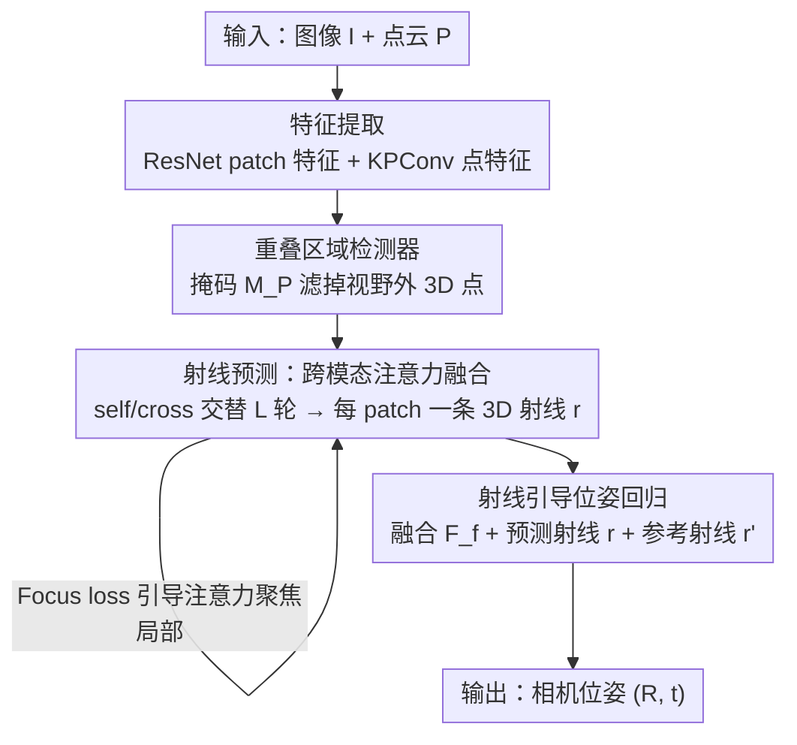

# RayI2P: Learning Rays for Image-to-Point Cloud Registration

**会议**: ICLR 2026  
**OpenReview**: [https://openreview.net/forum?id=arfeGsDWoq](https://openreview.net/forum?id=arfeGsDWoq)  
**代码**: 待确认（作者承诺录用后开源）  
**领域**: 3D视觉  
**关键词**: 图像-点云配准, 相机位姿估计, 射线表示, 跨模态, 可微位姿回归

## 一句话总结
本文把图像-点云配准从"建立 2D-3D 对应点"改写成"为每个图像 patch 预测一束 3D 射线"，再用一个可微的射线引导回归模块直接估计相机 6-DoF 位姿，从根上绕开了投影歧义与尺度不一致，在 KITTI / nuScenes 上刷新了配准精度。

## 研究背景与动机

**领域现状**：图像-点云配准要估计一张查询图像相对一张预建 3D 点云地图的 6-DoF 相机位姿，是 3D 重建、AR/VR、SLAM、视觉定位的基础环节。现有方法分两派：matching-free 方法（如 DeepI2P）用几何先验直接预测位姿，不显式建对应关系；matching-based 方法（CorrI2P、VP2P-Match、CoFiI2P、ICL、GraphI2P 等）则先建稠密 2D-3D 对应，再用 PnP-RANSAC 这类几何求解器解位姿，长期占据精度高地。

**现有痛点**：matching-free 这派靠 frustum 分类只能给到"粗监督"——只判断某个 3D 点在不在相机视锥内，缺乏细粒度对齐信号，最终位姿往往偏得很大。matching-based 这派精度更高，但被两个结构性问题卡住。

**核心矛盾**：第一是**投影歧义（projection-induced correspondence ambiguity）**——透视投影下，沿同一条视线分布、几何性质（曲率、法向、语义）差异巨大的多个 3D 点会投到同一个图像 patch，模型被迫把一堆不相似的 3D 特征对齐到同一个图像特征，导致特征表示坍塌、相似度度量学不出判别性。第二是**尺度不一致（depth-induced scale inconsistency）**——固定大小的图像 patch 因深度不同，对应的 3D 物理范围天差地别（近处小物体和远处大物体可能占同样的图像面积），图像感受野固定而 3D 感受野随深度漂移，两边感受野对不齐。这两点让"学一个尺度一致的相似度度量"变得很难，尤其在复杂室外场景。

**本文目标**：跳出"直接建 2D-3D 对应"的范式，找一种天然抗投影歧义、抗尺度漂移、又能给细粒度监督的跨模态几何表示。

**切入角度**：作者注意到在针孔相机模型下，每个图像 patch 本就天然对应 3D 空间中一条从相机中心射出的射线。射线方向只编码朝向、不绑定深度，因此对"沿视线哪个深度"和"物理尺度多大"都不敏感——这恰好对上了两个痛点。

**核心 idea**：用"为每个 patch 预测一条 3D 射线（射线束）"取代"建 2D-3D 对应点"，再从射线束可微地回归相机位姿，绕开显式匹配。

## 方法详解

### 整体框架
输入一张图像 $I \in \mathbb{R}^{H\times W\times 3}$ 和同场景的点云 $P \in \mathbb{R}^{N\times 3}$，输出点云坐标系下的相机位姿 $T_{gt}=(R_{gt}, t_{gt})$。整个 pipeline 是两阶段串行：先用一个**射线预测模块**为每个图像 patch 推断一条一致的 3D 射线，再用一个**可微射线引导位姿回归模块**从射线束联合回归旋转与平移。

具体地，图像先经 ResNet 下采样到 patch 特征 $F_I \in \mathbb{R}^{H_cW_c\times C}$（$H_c=H/8, W_c=W/8$），点云经 KPConv 得到点特征 $F_P \in \mathbb{R}^{N_c\times C}$；一个重叠区域检测器预测二值掩码 $M_P$ 标出落在相机视野内的可见 3D 点；跨模态注意力把 patch 特征与可见点特征融合成 $F_f$，MLP 头据此回归出每个 patch 的射线 $r \in \mathbb{R}^{H_cW_c\times 6}$；最后位姿回归模块把融合特征 $F_f$、预测射线 $r$、参考射线 $r'$ 一起喂进可微网络，吐出 $(R, t)$。

### 关键设计

**1. 用 Plücker 射线表示相机：把难回归的紧凑外参换成过参数化的射线束**

直接回归相机外参 $(R, t)$ 很难，因为它维度低、几何约束强、非线性重。本文借鉴广义相机模型，把相机表示成"与图像 patch 绑定的一束射线"。每个 patch 中心像素 $u_i$ 对应一条 Plücker 坐标下的 3D 射线 $r_i = [d_i, m_i] \in \mathbb{R}^6$，其中 $d_i$ 是方向、$m_i = p_i \times d_i$ 是力矩向量（与取射线上哪个点 $p_i$ 无关，$d_i$ 归一化时 $\|m_i\|$ 就是射线到原点的距离）。给定 $(R, t, K)$ 可正向生成射线 $d_i = R^\top K^{-1}\tilde{u}_i,\ m_i = (-R^\top t)\times d_i$；反过来也能从射线束近似恢复相机：相机中心 $c=\arg\min_p \sum_i\|p\times d_i - m_i\|^2$，旋转由对齐射线方向与像素向量解出单应再 RQ 分解，平移 $t=-R^\top c$。这种双向可逆把"几何可解释性"和"建模灵活性"接在一起，是整个框架的基石；而方向 $d_i$ 不绑深度，正是它天然抗投影歧义与尺度漂移的原因。

**2. 跨模态注意力 + 重叠掩码：在融合时只让 patch 看见可见、相关的 3D 几何**

为每个 patch 预测正确射线，需要它从点云里取到相关的 3D 信息。作者先给 patch 坐标 $E_I$ 和点坐标 $E_P$ 各过一个 MLP 得到位置嵌入，加回特征得到位置感知表示 $F_I' = F_I + PE_I,\ F_P' = F_P + PE_P$。然后用预测掩码 $M_P$ 只保留可见 3D 点（屏蔽无关几何的干扰），再做 $L$ 轮 self-attention 与 cross-attention 交替：self 让图像 patch 之间交换全局上下文，cross 让每个 patch 去注意可见 3D 点。$L$ 轮交替后 patch 特征同时融入了图像全局语义与点云几何线索，MLP 头据此输出每 patch 的 6 维射线（原点+方向）。默认 $L=2$。

**3. Focus loss：约束注意力聚焦到投影落在 patch 邻域的 3D 点，给射线预测加局部几何先验**

跨模态注意力如果乱注意，射线预测就不准。作者提出 focus loss 引导 cross-attention 的注意力分布：鼓励每个 patch 把更高注意力分给那些"投影落在以该 patch 为中心、半径 $\sigma$ 像素圆内"的 3D 点。设跨注意力层平均得到的注意力图为 $H \in \mathbb{R}^{H_cW_c\times N_c}$，定义指示函数 $\mathbb{1}_{ij}=1$ 当 $\|E_{I,i}-E^{2D}_{P,j}\|_2 < \sigma$ 否则为 0，则

$$L_{foc} = 1 - \frac{1}{H_cW_c}\sum_{i=1}^{H_cW_c}\sum_{j=1}^{N_c} H_{ij}\cdot \mathbb{1}_{ij}.$$

它把注意力推向空间上局部、几何上有意义的区域，既提升射线预测精度又加速收敛。消融显示 $\sigma=32$ 最优——太小（8）局部上下文不足，太大（128）或干脆去掉则混入无关噪声点反而掉点。

**4. 可微射线引导位姿回归：用学习式回归取代易失稳的几何求解器**

预测射线难免有噪声、歧义或错位，此时直接套式 (3)(4) 的经典几何求解器会失稳、位姿不准。作者改用一个可微的学习式回归模块：先把融合特征 $F_f$、预测射线 $r$（LiDAR 坐标系）、参考射线 $r'$ 各过 MLP 再拼接成射线引导特征 $F_r$。其中参考射线 $r'$ 是用已知内参 $K$、patch 坐标、令 $R=I, t=0$ 套式 (2) 算出的相机坐标系射线，充当几何锚点。接着对 $F_r$ 做平均池化并把池化结果拼回去得到上下文增强特征 $F_c$，再经 MLP 与池化压成紧凑位姿向量 $v_{pose}$，最后两个轻量 MLP 头分别预测旋转和平移；旋转用 6D 连续表示以适配 SO(3) 学习。消融（表 3）证明这套可学习回归在精度与鲁棒性上都优于经典几何求解器，尤其在 nuScenes 上经典求解器的旋转误差均值与方差明显更大。

### 损失函数 / 训练策略
总损失是三项之和 $L_{total} = L_{ray} + L_{cam} + L_{foc}$：

- 射线回归损失 $L_{ray} = \frac{1}{H_cW_c}\sum_i \|r_{gt,i}-r_i\|_2$，用真值射线（由式 (2) 算出）做 L2 监督；
- 相机位姿损失 $L_{cam} = \|R_{gt}-R\|_2 + \|t_{gt}-t\|_2$，直接监督预测位姿；
- focus loss $L_{foc}$（式 (7)）引导注意力。

实现上图像/点云骨干均为 4-stage、输出通道 512，$C_f=256, C_{pose}=512$，注意力 512 通道 4 头 ReLU，$L=2, \sigma=32$；单张 RTX 3090、Adam、学习率 $10^{-4}$、weight decay $10^{-6}$、训练 20 epoch，全部从头随机初始化。

## 实验关键数据

### 主实验
KITTI 用序列 0–8 训练、9–10 测试，图像 resize 到 $160\times512$、点云降采到 40,960 点；nuScenes 用官方 850/150 划分、图像 $160\times320$。评测指标为平均相对平移误差 RTE、平均相对旋转误差 RRE、配准准确率 Acc（RTE < 2m 且 RRE < 5° 的样本比例），且**保留所有测试对**（不像 CorrI2P 那样先剔除高误差样本），更贴近真实鲁棒性。

| 数据集 | 指标 | 本文 | ICL（之前SOTA） | GraphI2P†（带深度估计） |
|--------|------|------|----------|----------|
| KITTI | RTE(m)↓ | **0.09±0.08** | 0.20±0.21 | 0.32±0.81 |
| KITTI | RRE(°)↓ | **0.63±0.71** | 1.24±2.34 | 1.65±1.32 |
| KITTI | Acc(%)↑ | **99.75** | 97.49 | 99.61 |
| nuScenes | RTE(m)↓ | **0.39±0.29** | 0.63±0.44 | 0.49±1.22 |
| nuScenes | RRE(°)↓ | **1.48±5.72** | 2.13±3.75 | 1.73±1.63 |
| nuScenes | Acc(%)↑ | 96.61 | 90.94 | 99.48 |

在 KITTI 上本文全指标领先，比 ICL 降 RTE 0.11m、RRE 0.61°，Acc 最高；甚至超过借助外部强深度估计器的 GraphI2P。nuScenes 上 RTE/RRE 也全面优于 ICL（RTE 降 0.24m、RRE 降 0.65°），Acc 略低于带额外深度先验的 GraphI2P 但仍很强。效率上（表 2）本文推理 0.11s，比 DeepI2P/CorrI2P 这类带耗时后处理的方法快约 80×，靠下采样分辨率计算实现"参数量相当但更快"。

### 消融实验（射线引导回归模块各组件，KITTI）
FPF=融合 patch 特征 $F_f$，PR=预测射线 $r$，RR=参考射线 $r'$，CPS=经典几何求解器。

| 配置 | RTE(m)↓ | RRE(°)↓ | Acc(%)↑ | 说明 |
|------|---------|---------|---------|------|
| 仅 FPF | 0.33 | 2.07 | 94.48 | 只用特征，差 |
| 仅 PR | 0.34 | 1.14 | 98.66 | 引入射线大幅提升旋转精度 |
| FPF+PR | 0.10 | 0.73 | 99.41 | 特征与射线互补 |
| PR+RR+CPS | 0.10 | 0.82 | 99.62 | 经典求解器尚可但不稳 |
| PR+RR（学习式） | 0.10 | 0.74 | 99.64 | 学习式更鲁棒 |
| Full（FPF+PR+RR） | **0.09** | **0.63** | **99.75** | 完整模型最佳 |

### 关键发现
- **射线表示是涨点主力**：从"仅 FPF"到"仅 PR"，RRE 从 2.07° 骤降到 1.14°、Acc 从 94.48% 升到 98.66%，说明把相机建成射线束比直接回归外参好学得多。
- **学习式回归 > 经典求解器**：PR+RR 用经典求解器（CPS）在 nuScenes 上旋转误差方差极大（±20.93），换成可学习回归后方差和均值都明显收敛，验证了"预测射线有噪时直接解几何会失稳"的动机。
- **focus 半径 $\sigma$ 有甜点**：$\sigma$ 从 8→32 提升，超过 32（或去掉 focus loss）反而掉点，$\sigma=32$ 在"局部性"与"几何上下文"间最平衡。

## 亮点与洞察
- **换表示而非加模块**：核心创新是把"2D-3D 点匹配"换成"patch→3D 射线"这一表示层面的重写，射线方向不绑深度的性质让投影歧义与尺度不一致这两个老大难"自动消失"，是很干净的"从源头改写问题"。
- **Plücker 射线的双向可逆很巧**：射线↔相机外参可正反互算，既保住几何可解释性，又把难回归的紧凑外参换成易学的过参数化射线束，可迁移到其他需要回归相机位姿的任务（如 NeRF/位姿初始化）。
- **focus loss 是低成本的注意力先验**：用"投影落在 patch 邻域"这个简单几何约束去监督跨模态注意力，几乎零额外成本就提升射线预测精度并加速收敛，是可复用的小 trick。
- **简单架构也能 SOTA**：作者反复强调"simple yet effective"——下采样分辨率 + 轻量 MLP 头，既快 80× 又精度第一，说明表示选对了比堆结构更重要。

## 局限与展望
- 作者承认预测射线可能含噪/歧义，这也是必须引入学习式回归而非直接几何求解的原因；噪声射线下位姿质量的上界仍受射线预测精度制约。
- 实验只在 KITTI / nuScenes 两个自动驾驶室外场景验证，室内、跨域、稀疏点云或大视角变化下的泛化未充分检验。
- 依赖重叠区域检测器给出的可见性掩码 $M_P$，若掩码预测不准（重叠区域小或估计错），跨模态融合会引入无关几何，连锁影响射线与位姿。
- nuScenes 上 Acc 仍略逊于借助外部深度估计器的 GraphI2P，提示在更难/更稀疏的数据上，纯射线表示与"额外深度先验"之间还有差距可挖。

## 相关工作与启发
- **vs DeepI2P（matching-free）**: 它把任务建成 frustum 分类 + 迭代位姿优化，只给粗监督、位姿常偏大；本文用 patch 级射线提供细粒度、方向感知的监督，精度高一个量级且无需迭代优化。
- **vs VP2P-Match / CoFiI2P / ICL（matching-based）**: 它们建稠密 2D-3D 对应再 PnP/可微 PnP 解位姿，受投影歧义与尺度不一致拖累；本文用连续射线取代离散点匹配，绕开显式对应，KITTI/nuScenes 全面超越且推理更快。
- **vs GraphI2P**: 它引入外部强深度估计器来缩小模态差但计算开销大；本文不依赖额外深度模型，靠射线方向天然的深度无关性达到相当甚至更优精度，更轻更快。

## 评分
- 新颖性: ⭐⭐⭐⭐⭐ 把图像-点云配准从"建对应"重写为"学射线"，从表示层面同时化解投影歧义与尺度不一致，范式级创新。
- 实验充分度: ⭐⭐⭐⭐ KITTI/nuScenes 双数据集、SOTA 对比 + 组件消融 + focus 半径消融 + 效率对比齐全，但仅限室外驾驶场景。
- 写作质量: ⭐⭐⭐⭐⭐ 动机推导清晰，两个痛点与射线表示的对应讲得很透，图文配合好。
- 价值: ⭐⭐⭐⭐⭐ 精度 SOTA、推理快 80×、架构简单，射线表示对位姿回归类任务有较强迁移潜力。

<!-- RELATED:START -->

## 相关论文

- [\[CVPR 2026\] Hg-I2P: Bridging Modalities for Generalizable Image-to-Point-Cloud Registration via Heterogeneous Graphs](../../CVPR2026/3d_vision/hg-i2p_bridging_modalities_for_generalizable_image-to-point-cloud_registration_v.md)
- [\[CVPR 2026\] SuP: Sub-cloud Driven Point Cloud Registration](../../CVPR2026/3d_vision/sup_sub-cloud_driven_point_cloud_registration.md)
- [\[ICLR 2026\] Spiking Discrepancy Transformer for Point Cloud Analysis](spiking_discrepancy_transformer_for_point_cloud_analysis.md)
- [\[CVPR 2026\] Deformation-based In-Context Learning for Point Cloud Understanding](../../CVPR2026/3d_vision/deformation-based_in-context_learning_for_point_cloud_understanding.md)
- [\[CVPR 2026\] C-GenReg: Training-Free 3D Point Cloud Registration by Multi-View-Consistent Geometry-to-Image Generation with Probabilistic Modalities Fusion](../../CVPR2026/3d_vision/c-genreg_training-free_3d_point_cloud_registration_by_multi-view-consistent_geom.md)

<!-- RELATED:END -->
