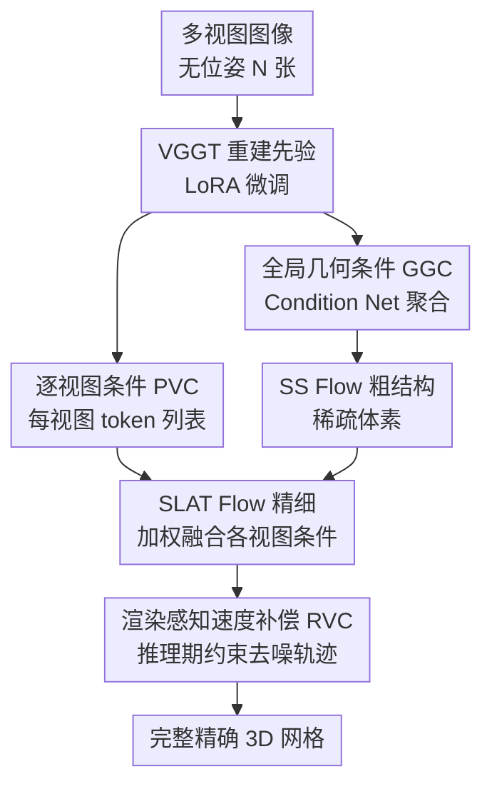

# ReconViaGen: Towards Accurate Multi-view 3D Object Reconstruction via Generation

**会议**: ICLR 2026  
**OpenReview**: [https://openreview.net/forum?id=z0QLeooEEf](https://openreview.net/forum?id=z0QLeooEEf)  
**论文**: [项目主页](https://jiahao620.github.io/reconviagen)  
**代码**: 待确认  
**领域**: 3D视觉  
**关键词**: 多视图重建, 3D生成先验, 扩散模型, 重建先验, 位姿无关

## 一句话总结
ReconViaGen 把强重建先验（VGGT）当作多视图感知条件注入到扩散式 3D 生成器（TRELLIS）里，并在推理期用渲染对齐的速度补偿约束去噪轨迹，从而在保留生成"补全不可见部分"能力的同时，让重建结果在全局结构和局部细节上都与输入视图高度一致，在 Dora-bench 和 OmniObject3D 上取得 SOTA。

## 研究背景与动机
**领域现状**：多视图 3D 物体重建长期是 3D 视觉的核心任务，主流做法（NeRF、3DGS、DUSt3R/VGGT 这类前馈重建器）依赖视图之间足够的重叠和可学到的跨视图对应关系来估计几何与外观。

**现有痛点**：现实采集中遮挡、稀疏覆盖、弱纹理、支撑面遮挡频繁出现，纯重建方法只能恢复"可见表面"，对不可见区域束手无策，结果往往有空洞、伪影、几何细节缺失或模糊，**完整性**严重受限。

**核心矛盾**：扩散式 3D 生成先验能从大规模 3D 数据中学到生成先验、把不可见部分"幻想"出合理结构（解决完整性），但**扩散推理本质是随机的**——这种随机性带来不可控的变异，难以做到重建所需的像素级对齐，**准确性/可靠性**与生成的完整性之间存在天然张力。正因如此，现有重建框架一直无法有效吸收扩散生成先验。

**切入角度**：作者深入剖析了现有多视图扩散生成"不一致"的两个根因——(a) 把多视图图像特征当条件时，**没有充分构造和利用跨视图关联**，导致几何与纹理在全局和局部都估计不准；(b) 局部细节生成时**迭代去噪可控性差**，容易生成看似合理但与输入不一致的几何/纹理细节。

**核心 idea**：用强重建先验去"管住"生成。具体是把重建器 VGGT 编码出的、富含跨视图 3D 提升信息的特征聚合成扩散条件（补 a），再在推理期用渲染对齐的速度补偿显式约束去噪轨迹（补 b），让生成"为重建服务"。

## 方法详解

### 整体框架
ReconViaGen 解决的是"位姿无关的多视图重建"：给定 $N$ 张未标定多视图图像 $I=\{I_i\}_{i=1}^{N}$，输出完整且与输入一致的 3D 物体 $O$。整个流程同时跑重建和生成、并让两种先验互补——以 TRELLIS 的生成先验补全不可见部分，以 VGGT 的重建先验约束生成的准确性，采用 coarse-to-fine 的三阶段管线。

第一阶段，微调后的 VGGT（前馈 transformer，DINO ViT + 24 层交替帧内/全局自注意力，解码出相机参数、深度、点图、跟踪特征）提供重建先验，但作者并不直接用点云这类显式结果，而是把 VGGT 的多层特征 $\phi^{vggt}$ 通过 Condition Net 聚合成**全局几何条件 GGC** 和**逐视图局部条件 PVC**。第二阶段把 GGC 喂给 TRELLIS 的 SS Flow 生成粗结构（稀疏体素），把 PVC 喂给 SLAT Flow 生成精细结构隐变量（带纹理网格）。第三阶段只在推理期开启**渲染感知速度补偿 RVC**：先用第二阶段生成结果反过来精修相机位姿，再把当前去噪结果解码、渲染、和输入图像比对，用其梯度修正每一步去噪速度，逼出像素级对齐的细节。

### 关键设计

**1. 全局几何条件 GGC：用重建特征锚定粗结构，而非随机生成**

针对"跨视图关联不足导致全局结构不准"这个痛点。作者不直接用 VGGT 的点云输出（信息有损），而是用一个 Condition Net 把 VGGT 全部多层特征 $\phi^{vggt}$（拼接所有视图于 token 维）聚合成一个**定长** token 列表 $T_g$。做法是从一个可学习初始 token 列表 $T_{init}$ 出发，用四个 cross-attention 块逐层融合 VGGT 各层特征：

$$T^{i+1}=\mathrm{CrossAttn}\big(Q(T^i),\,K(\phi^{vggt}),\,V(\phi^{vggt})\big),\quad i\in\{0,1,2,3\}$$

其中 $T^0=T_{init}$，$T^3=T_g$。$T_g$ 作为 SS Flow 的条件，让粗结构生成"长在"VGGT 编码的相机位姿、深度、点图、跟踪等显式 3D 提升信息上。训练 SS Flow 时冻结 VGGT，只训 Condition Net 和 DiT。消融显示单加 GGC 就把 PSNR 从 16.7 拉到 20.5、CD 从 0.144 降到 0.093，说明它是全局结构准确性的主力。

**2. 逐视图局部条件 PVC 与加权融合生成：把每个视图的外观细节灌进精细阶段**

单一全局 token 对几何/纹理细节信息量不够，所以作者用同一套 Condition Net 为**每个视图**单独初始化一个 token 列表 $P_k$，只融合该视图的 VGGT 特征 $\phi^{vggt}_k$：

$$P_k^{i+1}=\mathrm{CrossAttn}\big(Q(P_k^i),\,K(\phi^{vggt}_k),\,V(\phi^{vggt}_k)\big)$$

这组 $\{P_k\}_{k=1}^{N}$ 进入 SLAT Flow 提供逐视图外观引导。SLAT DiT 每个块里，噪声隐变量 $y_j$ 先做自注意力得 $y'_j$，再分别和各视图条件 $P_k$ 做 cross-attention，并用一个 MLP 算出的融合权重 $w_k\in(0,1)$ 做加权求和：

$$y_{j+1}=\sum_{k=1}^{N}\mathrm{CrossAttn}\big(Q(y'_j),\,K(P_k),\,V(P_k)\big)\cdot w_k$$

加权而非平均，让模型自适应决定每个视图对当前体素细节的可信度。消融里 PVC 主要拉高 PSNR（20.5→21.0），对应局部逐视图对齐的改善。

**3. 渲染感知速度补偿 RVC：在去噪轨迹上显式逼像素对齐**

前两个设计仍是"条件引导"，去噪过程本身缺乏对输入图像的硬约束，细节容易飘。RVC 只在推理期、且当时间 $t<0.5$ 时启动：先用第二阶段生成结果经 VGGT 精修出相机位姿 $C$，把当前 SLAT 解码成 $O_t$（如带纹理网格）并从 $C$ 渲染图像，与输入算多重相似度损失（受 Hi3DGen 显式法向正则和 V2M4 启发）：

$$L_{RVC}(v_t)=L_{SSIM}+L_{LPIPS}+L_{DreamSim}$$

分别度量结构、感知、语义相似度；若某视图损失 >0.8（多半是位姿估计不准）则丢弃该项以排除干扰。SLAT Flow 同时更新海量体素隐变量是个棘手的协同优化问题，作者把损失对预测目标 $\hat{x}_0=x_t-t\cdot v_t$ 的梯度折算成对速度的补偿项：

$$\Delta v_t=\frac{\partial L}{\partial \hat{x}_0}\frac{\partial \hat{x}_0}{\partial v_t}=-t\,\frac{\partial L}{\partial \hat{x}_0}$$

再把它加到每步去噪更新里（$\alpha$ 控补偿强度，取 0.1）：

$$x_{t_{prev}}=x_t-(t-t_{prev})\,(v+\alpha\cdot\Delta v)$$

这样输入图像成为去噪轨迹的强显式引导，逐个局部 SLAT 向量被推向与所有输入一致的细节。消融里 RVC 进一步把 PSNR 推到 22.6、F-score 到 0.953，对完整性和细粒度几何/纹理都有增益。

### 损失函数 / 训练策略
VGGT aggregator 用 LoRA（rank 64、alpha 128、dropout 0，只加在 qkv 映射和各注意力投影层）微调，多任务目标 $L_{VGGT}=L_{camera}+L_{depth}+L_{nmap}$，保留预训练 3D 几何先验。SS/SLAT Flow 沿用 TRELLIS 的条件流匹配目标 $L_{CFM}=\mathbb{E}\,\|v_\theta(x,t)-(\epsilon-x_0)\|_2^2$，配 CFG（drop rate 0.3）。在 Objaverse 390k 物体上微调，SS Flow 用 8×A800、batch 192、40k 步；推理时 SS/SLAT 的 CFG 强度 7.5/3.0，采样步数 30/12。

## 实验关键数据

### 主实验
在 Dora-bench（300 物体、4 视图输入）和 OmniObject3D（200 物体、4 视图）上，PSNR/SSIM/LPIPS 评新视图一致性，CD/F-score 评几何准确性与完整性。

| 数据集 | 方法 | PSNR↑ | LPIPS↓ | CD↓ | F-score↑ |
|--------|------|-------|--------|------|----------|
| Dora-bench | TRELLIS-M | 16.71 | 0.111 | 0.144 | 0.843 |
| Dora-bench | Hunyuan3D-2.0-mv | 20.22 | 0.093 | 0.094 | 0.937 |
| Dora-bench | InstantMesh | 18.92 | 0.120 | 0.110 | 0.865 |
| Dora-bench | VGGT | - | - | 0.112 | 0.921 |
| Dora-bench | **ReconViaGen** | **22.63** | **0.090** | **0.090** | **0.953** |
| OmniObject3D | TRELLIS-M | 16.86 | 0.242 | 0.072 | 0.932 |
| OmniObject3D | InstantMesh | 17.50 | 0.145 | 0.094 | 0.907 |
| OmniObject3D | **ReconViaGen** | **19.77** | **0.141** | **0.059** | **0.959** |

ReconViaGen 在两个数据集上所有指标都领先，且同时超过它所融合的两个先验来源（TRELLIS 与 VGGT），印证"两种先验互补"确实带来 1+1>2 的效果。VGGT 在 Dora-bench（均匀视角）比在 OmniObject3D（随机视角）好，因为均匀分布的视图能提供更丰富的视觉线索。野外测试中还能与闭源商业模型 Hunyuan3D-2.5、Meshy-5 抗衡，且不要求正交视角输入。

### 消融实验

| 配置 | GGC | PVC | RVC | PSNR↑ | CD↓ | F-score↑ |
|------|-----|-----|-----|-------|------|----------|
| (a) baseline (TRELLIS-M) | ✗ | ✗ | ✗ | 16.71 | 0.144 | 0.843 |
| (b) +GGC | ✓ | ✗ | ✗ | 20.46 | 0.093 | 0.941 |
| (c) +PVC | ✓ | ✓ | ✗ | 21.05 | 0.093 | 0.937 |
| (d) Full +RVC | ✓ | ✓ | ✓ | 22.63 | 0.090 | 0.953 |

### 关键发现
- **GGC 贡献最大**：单加它就把 PSNR 提了近 3.8 分、CD 几乎砍半，说明"用重建特征锚定粗结构"是准确性的根本来源。
- **PVC 主提局部对齐**：主要改善 PSNR（逐视图外观一致性），对全局 CD 改动小，分工清晰。
- **RVC 推理期增益明显**：仅在采样阶段加入就把 F-score 从 0.937 提到 0.953、PSNR 再 +1.6，证明显式渲染约束对细粒度对齐有效。
- **视图数边际递减**：输入从 1→2→4 视图，PSNR 18.4→19.6→22.6 持续涨；4→8 视图只到 23.1，呈现饱和，4 视图已是性价比拐点。

## 亮点与洞察
- **把"重建先验当生成条件"而非当后处理**：不直接用 VGGT 的点云，而是聚合其富信息特征做扩散条件，避免显式重建的信息损失——这是"用强模型特征而非强模型输出"的典型范式，可迁移到其他需要外部先验约束生成的任务。
- **RVC 的梯度→速度补偿很巧**：把渲染损失对 $\hat{x}_0$ 的梯度通过 $\partial\hat{x}_0/\partial v_t=-t$ 折成对去噪速度的修正项，在 rectified flow 框架里实现了"训练免费、推理期可插拔"的像素级对齐，且用 0.8 阈值剔除坏位姿损失，工程上很务实。
- **加权而非平均融合多视图条件**：用 MLP 学每个视图的融合权重 $w_k$，让模型自己判断哪个视图对当前体素更可信，比 TRELLIS-M 的简单平均更鲁棒。

## 局限与展望
- **依赖两个外部大模型**：性能上限被 VGGT 和 TRELLIS 锁住，作者也承认"更强的重建/生成先验可进一步提升"，框架本身是个集成器。
- **RVC 推理开销**：需在去噪中反复解码、渲染、反传梯度，且依赖 VGGT 二次估位姿，推理成本和位姿误差敏感性值得关注（>0.8 丢弃是临时补丁）。
- **训练成本高**：8×A800、390k 物体、150 视图/物体渲染，复现门槛不低。
- **视图数饱和**：超过 4 视图收益骤减，对极稀疏（1-2 视图）虽可用但明显掉点。

## 相关工作与启发
- **vs TRELLIS（生成先验来源）**：TRELLIS-S/M 用随机选视图或简单平均做条件，几何全局不准、细节与输入不一致；本文用 VGGT 特征做多视图感知条件 + RVC 约束，PSNR 从 16.7 提到 22.6。
- **vs VGGT（重建先验来源）**：VGGT 纯前馈重建点云，可见表面准但补不了不可见区域、点云表示不完整；本文借生成先验补全、F-score 从 0.921 提到 0.953。
- **vs 回归式 3D 生成先验（LucidFusion / LRM 系）**：它们回归紧凑 3D 表示避免不一致，但细节平滑模糊；本文用扩散先验 + 重建约束，在细粒度几何/纹理上明显更优。

## 评分
- 新颖性: ⭐⭐⭐⭐⭐ 首个把强重建先验作为多视图条件注入扩散 3D 生成器、并提出推理期渲染感知速度补偿。
- 实验充分度: ⭐⭐⭐⭐⭐ 两个 benchmark + 野外测试 + 三组件逐项消融 + 视图数消融，覆盖完整。
- 写作质量: ⭐⭐⭐⭐ 根因分析清晰、公式完整，但部分实现细节（位姿精修）放在附录。
- 价值: ⭐⭐⭐⭐⭐ 给"生成补全"与"重建准确"的长期张力提供了可落地的融合范式。

<!-- RELATED:START -->

## 相关论文

- [\[ICLR 2026\] ReLi3D: Relightable Multi-View 3D Reconstruction with Disentangled Illumination](reli3d_relightable_multi-view_3d_reconstruction_with_disentangled_illumination.md)
- [\[CVPR 2026\] Multi-view Consistent 3D Gaussian Head Avatars 'without' Multi-view Generation](../../CVPR2026/3d_vision/multi-view_consistent_3d_gaussian_head_avatars_without_multi-view_generation.md)
- [\[ICLR 2026\] D²GS: Depth-and-Density Guided Gaussian Splatting for Stable and Accurate Sparse-View Reconstruction](d2gs_depth-and-density_guided_gaussian_splatting_for_stable_and_accurate_sparse-.md)
- [\[ICLR 2026\] Ctrl&Shift: High-Quality Geometry-Aware Object Manipulation in Visual Generation](ctrlshift_high-quality_geometry-aware_object_manipulation_in_visual_generation.md)
- [\[ICLR 2026\] Text-to-3D by Stitching a Multi-view Reconstruction Network to a Video Generator](text-to-3d_by_stitching_a_multi-view_reconstruction_network_to_a_video_generator.md)

<!-- RELATED:END -->
