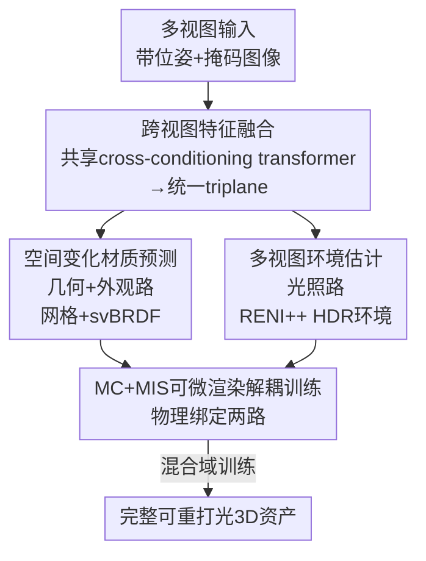

# ReLi3D: Relightable Multi-View 3D Reconstruction with Disentangled Illumination

**会议**: ICLR 2026  
**OpenReview**: [https://openreview.net/forum?id=BlSKgQb3Vd](https://openreview.net/forum?id=BlSKgQb3Vd)  
**论文**: [Project Page](https://reli3d.jdihlmann.com/)  
**代码**: 论文承诺开源（will release code and weights）  
**领域**: 3D视觉  
**关键词**: 前馈3D重建, 逆渲染, 材质光照解耦, svBRDF, 多视图融合

## 一句话总结
ReLi3D 是第一个端到端前馈系统，能在不到 1 秒内从稀疏多视图图像同时重建出完整几何、空间变化的 PBR 材质和一致的 HDR 环境光照，核心思想是用"多视图约束"作为材质-光照解耦的主驱动力，把单图本质病态的逆渲染问题变成可解的约束问题。

## 研究背景与动机

**领域现状**：从图像重建可用的 3D 资产有两条路线。一是基于扩散的生成式方法（如 Score Distillation、多视图生成、直接 3D 扩散），几何保真度高但推理慢、还会幻觉；二是大型重建模型（LRM，如 LRM、SF3D、TripoSR），用 transformer 做图像到 3D 的直接前馈推理，快且实用。但 LRM 类方法与艺术家真正需要的东西之间存在鸿沟——他们要的是从多视图准确重建、并且光照可解耦、能输出支持重打光的空间变化 PBR 材质。

**现有痛点**：现有前馈方法大多只为单视图重建优化，而单视图重建天然病态——同一张 2D 外观可以由无数种"表面反射率 × 光照"组合产生。正则化或学习先验能缓解但消除不了歧义，尤其在未观测区域，导致材质预测不完整、法线不可靠、重打光保真度受限。以 SF3D 为代表的方法甚至只为整个物体预测一个全局 roughness/metallic 值，根本不做空间变化材质，也不估计环境光。

**核心矛盾**：材质和光照在单视图下不可分——这是逆渲染的根本病态性。作者的观察是：几何一致性跨多个视图能提供分离材质与光照所缺失的约束。当多个观测在共同光照下看到同一表面点时，跨视图一致性会收窄可行解空间，把病态的单视图问题变成约束良好的问题。

**本文目标**：构建一个统一的前馈系统，把任意数量的带位姿图像一次性变成带空间变化 PBR 材质的纹理网格 + 一致的 HDR 环境，并且要在 1 秒内完成、能泛化到真实世界。

**核心 idea**：把多视图融合从"提升鲁棒性的附加项"提升为"材质-光照解耦的首要机制"，用一个共享 transformer 融合多视图、再分双路分别预测物体结构外观与环境光照，最后用可微分蒙特卡洛渲染器把两路绑在一起做物理一致的解耦训练。

## 方法详解

### 整体框架

ReLi3D 接收 $N$ 张带相机位姿和掩码的多视图图像 $\{(I_i, M_i, C_i)\}_{i=1}^N$，输出三件套：带空间变化 svBRDF（albedo / roughness / metallic / normal）的网格、以及一张用 RENI++ 隐编码表示的 HDR 环境图。整条流水线是一次前馈，约 0.3 秒。

转法是：先用一个**共享的 cross-conditioning transformer** 把任意数量的视图融成统一的 triplane 特征；然后分**两条平行路径**——几何+外观路从统一 triplane 解出网格和 svBRDF，光照路融合掩码感知 token 估计 HDR 环境；最后用一个**可微分蒙特卡洛 + 多重重要性采样（MC+MIS）渲染器**把两路绑在一起，强制预测的材质和光照必须共同物理地解释观测图像。训练再叠加**混合域协议**（合成 PBR + 合成 RGB + 真实采集），把合成与真实的鸿沟桥接起来。

### 关键设计

**1. 跨视图特征融合：用一个共享 transformer 把任意数量视图压成统一 triplane**

这一步直接针对"单视图病态"——只有让多视图的信息真正交叉融合，下游两路才能拿到一致的约束。具体做法：每张图先用 DINOv2 配合相机调制得到 per-view token，$T^{img}_i = \text{DINOv2}(I_i \odot M_i)$、$e_i = f_{cam}(C_i)$、$T^{cond}_i = [T^{img}_i \odot e_i\,;\,e_i]$。从中随机指定一张为 **hero view** $h$，把它的 token 与可学习的 triplane token bank 拼接，构成 transformer 的查询流 $Q_0 = [T^{tri}\,;\,T^{img}_h]$；hero view 在训练和评测时都均匀随机选取，保证性能不依赖视角选择。为了让跨视图上下文紧凑又有表达力，作者用 **latent mixing**：一组可学习的 latent token $L_0$ 先经自注意力，再与所有非 hero 视图投影后的 token 交错（Interleave）成记忆 $M$；主体用一个双流交错 transformer $T_{out} = \text{TwoStream}(Q_0, M)$，交替地"用 $M$ 更新 $Q$"和"精炼 $M$"。这样既能吃进任意数量视图、又保留一条专属 hero 通道做稳定的几何/外观对齐，最后用 pixel-shuffle 上采样得到高分辨率 triplane。和"多视图只是鲁棒性补丁"的旧做法不同，这里融合本身就是解耦的引擎。

**2. 空间变化材质预测：从单一共享 triplane 直接出 svBRDF**

针对 SF3D 这类只给全局 roughness/metallic 的痛点，ReLi3D 要的是逐表面点的空间变化材质。它把 transformer 输出 token 直接解释为 triplane 像素，形成统一 3D 表示 $T \in \mathbb{R}^{3 \times 40 \times 384 \times 384}$；对任意 3D 点 $p$，按 triplane 投影 $f(p)=\text{concat}(T_{xy}, T_{yz}, T_{zx})$ 取特征，再用一组任务专属 MLP 头同时解出密度、albedo、roughness、metallic 和法线扰动：$\{\sigma, \rho, r, m, n_{bump}\}(p) = \{\text{MLP}_{density}, \text{MLP}_{albedo}, \text{MLP}_{rough}, \text{MLP}_{metal}, \text{MLP}_{normal}\}(f(p))$。关键在于"所有属性共享同一个 triplane 嵌入"——这消除了为材质单设 token 的需要，也天然支持多材质物体。几何用 Flexicubes 提网格以获得更好网格质量，再用快速 UV 展开把空间变化 PBR 参数烘焙上去。

**3. 多视图环境估计：背景可见就读、被遮就从反射推**

这是论文真正新的一点：以往要么用简单 MLP 从 triplane 出环境图，要么只看单视图；ReLi3D 第一次把多视图推理 + 自适应背景掩码用于环境估计，且光照路与几何路并行。它先用一个带两个额外输入通道的可训练 DINOv2-small 编码"掩码-图像"对得到掩码感知 token $T^{mask}_i = f_{mask}([M_i, I_i])$，与物体 transformer 输出拼成环境上下文 $T_{env\text{-}ctx} = \text{concat}(\{T^{mask}_i\}, T_{out})$；再用一个专门的 1D transformer 经交叉注意力把可学习环境 token 映射成 RENI++ 隐编码和一个 6D 全局旋转 $[z_{env}, r_{6D}] = \text{EnvTransformer}(T_{env\text{-}bank}, T_{env\text{-}ctx})$，最终 HDR 环境按 $L_{env}(\omega)=\exp(f_\theta(z, \gamma(\omega)))$ 解码。最巧的是训练时的**随机背景掩码**：随机遮挡一部分视图的背景像素，逼网络学会两件互补的事——背景可见时直接从环境读光照，背景被遮时必须从物体反射和阴影的间接线索里推光照。这种双模训练让它在真实场景（背景常被裁切、过曝或带噪）里也能稳健估光。

**4. MC+MIS 可微渲染：把两路用物理光传输绑死**

前面两路若各管各的，材质和光照仍可能"互相补偿"地乱配。作者用一个可微分的物理基蒙特卡洛渲染器配多重重要性采样（MIS）把两路绑在一起：渲染器强制预测材质 $f_r$ 和光照 $L_{env}$ 必须通过物理光传输共同解释观测图像，从而落实物理上有意义的解耦。工程上用 VNDF 采样配球冠和对偶采样来稳定训练。这个渲染器同时撑起三种能力：有 PBR 真值时额外加直接材质监督；没有时纯靠图像重建保证材质-光照一致；并因此能在合成 PBR、合成纯 RGB、以及最重要的真实采集之间无缝训练。它是第一个能从混合域数据学到空间变化材质重建、且不发生"监督坍缩"的系统。

### 损失函数 / 训练策略
训练用混合域协议，共 174k 物体：42k 合成 PBR（全材质监督）、70k 合成纯 RGB、62k 来自 UCO3D 的真实采集（图像空间自监督）。有 PBR 真值的走直接材质监督，其余靠 MC+MIS 渲染器的图像重建一致性，靠随机背景掩码训练双模光照推理。作者强调多视图约束提供的监督信号比海量单视图数据更强，因此只用 174k 物体（比近期大规模方法少 10–50×）就能学好解耦。

## 实验关键数据

### 主实验

材质与重打光（Polyhaven + Blender Shiny，单视图除非标注），ReLi3D 在所有材质/重打光指标上排第一，且随视图增多稳步提升：

| 方法 | 时间(s) | 重打光 PSNR↑ | Basecolor PSNR↑ | Roughness PSNR↑ | Metallic PSNR↑ |
|------|--------|------|------|------|------|
| SF3D | 0.26 | 15.79 | 18.42 | 19.60 | 28.37 |
| SPAR3D | 0.36 | 15.23 | 17.70 | 19.53 | 30.52 |
| Hunyuan3D | 69.40 | 14.81 | 21.25 | — | — |
| **ReLi3D (1 view)** | 0.28 | **19.77** | **25.00** | 22.69 | 32.73 |
| **ReLi3D (16 views)** | 0.32 | **21.21** | **26.78** | 24.50 | 33.21 |

几何 + 图像质量（GSO + Stanford ORB / UCO3D），ReLi3D 在交互速度下做到 SOTA：

| 方法 | 时间(s) | GSO CD↓ | GSO FS@0.5↑ | GSO PSNR↑ | UCO3D PSNR↑ |
|------|--------|------|------|------|------|
| SF3D | 0.28 | 0.132 | 0.974 | 17.64 | 12.79 |
| Hunyuan3D | 39.69 | 0.133 | 0.970 | 16.68 | 13.75 |
| **ReLi3D (1 view)** | 0.30 | 0.105 | 0.985 | 19.57 | 15.28 |
| **ReLi3D (4 views)** | 0.28 | 0.081 | 0.993 | 21.43 | 15.60 |

### 消融实验
论文没有给一张独立的模块开关消融表，而是用"视图数"这个轴系统验证多视图约束的贡献：

| 配置 | CD↓ (GSO) | FS@0.5↑ | 说明 |
|------|---------|------|------|
| 1 view | 0.105 | 0.985 | 单视图基线 |
| 2 views | 0.088 | 0.991 | 加一视图明显改善 |
| 4 views | 0.081 | 0.993 | CD 较单视图改善约 27% |
| 8–16 views | 0.076 | 0.993–0.994 | 4–8 视图后饱和，增益递减 |

### 关键发现
- **多视图约束是核心增益来源**：从 1 视图到 4 视图，几何 CD 改善约 27%、F-score@0.5 推到 0.993，而推理时间几乎不变（~0.3s），印证了"跨视图一致性收窄解空间"的假设。
- **饱和现象有解释**：4–8 视图后性能饱和，因为表面覆盖一旦充分，额外的随机视图多是冗余信息而非新约束。
- **背景信息帮定位光源**：有背景时能正确定位光源方向；无背景仅靠漫反射推断时，预测的光照会更"散"但仍可用。
- **速度优势悬殊**：比 Hunyuan3D 这类生成式方法快约 100×（0.3s vs 39–69s），且顶点数更省（4.5k vs 100k+），是为"材质感知重建"做的速度-质量权衡。

## 亮点与洞察
- **把多视图从"补丁"重新定位成"解耦引擎"**：很多工作把多视图当鲁棒性附加项，本文论证它才是分离材质与光照的首要机制，这个视角转变是全文的灵魂。
- **随机背景掩码训练双模光照推理**：一个简单的训练技巧逼网络同时学会"读背景光"和"从反射推光"，直接对应真实世界背景常被裁/过曝/带噪的痛点，可迁移到任何需要环境估计的逆渲染任务。
- **统一 triplane + 多 MLP 头出全套 svBRDF**：用单一共享嵌入解所有材质属性，省掉材质专属 token 还天然支持多材质物体，结构干净。
- **MC+MIS 渲染器桥接混合域**：可微物理渲染器既当解耦的物理约束，又当合成/真实数据之间的统一监督接口，是"用 174k 数据打赢大数据方法"的关键。

## 局限与展望
- 作者承认：专门的高分辨率扩散方法通过更长优化可能拿到更精细的几何细节，ReLi3D 的定位是速度-质量权衡而非极致几何。
- 性能在 4–8 视图后饱和，随机视图带来的覆盖冗余使更多视图收益有限——若能做视图选择/主动采样可能突破饱和。
- 顶点数较低（4.5k）虽省算力，但相比 100k+ 的方法在超精细网格场景可能受限。
- 真实世界泛化依赖混合域训练数据的多样性，对训练分布外的极端材质/光照仍存风险（论文未深入探讨）。

## 相关工作与启发
- **vs SF3D**：同为快速前馈 LRM，但 SF3D 限于单视图、只给全局 roughness/metallic、不估环境光；ReLi3D 吃多视图、出空间变化 svBRDF、并联合估计 HDR 环境，本质区别在用多视图破解材质-光照歧义。
- **vs SPAR3D**：SPAR3D 也预测 RENI++ 隐编码，但走"先扩散稀疏点云再回归"的昂贵概率采样，环境预测常过平滑、无清晰光源；ReLi3D 前馈一次完成且环境估计更锐利。
- **vs Hunyuan3D / 3DTopia-XL（生成式）**：生成式几何细节强但慢 100×、且会幻觉；ReLi3D 在可比质量下做到亚秒级，并额外给出可重打光的材质与光照。
- **vs LIRM（并行工作）**：LIRM 目标相近但走渐进优化、缺光照预测、纯合成监督；ReLi3D 把多视图约束当解耦主机制，并用混合域训练桥接合成与真实。

## 评分
- 新颖性: ⭐⭐⭐⭐⭐ 首个亚秒级联合重建几何/空间变化材质/HDR 环境的前馈系统，"多视图即解耦机制"视角清晰
- 实验充分度: ⭐⭐⭐⭐ 跨多个 OOD 合成与真实数据集、覆盖几何/材质/重打光/环境四维，但缺独立的模块开关消融
- 写作质量: ⭐⭐⭐⭐ 动机推导和方法叙述清晰，符号体系完整
- 价值: ⭐⭐⭐⭐⭐ 直击"前馈重建 vs 可重打光资产"的鸿沟，速度-质量权衡对工业 3D 资产生产很实用

<!-- RELATED:START -->

## 相关论文

- [\[ICLR 2026\] ReconViaGen: Towards Accurate Multi-view 3D Object Reconstruction via Generation](reconviagen_towards_accurate_multi-view_3d_object_reconstruction_via_generation.md)
- [\[ICLR 2026\] Text-to-3D by Stitching a Multi-view Reconstruction Network to a Video Generator](text-to-3d_by_stitching_a_multi-view_reconstruction_network_to_a_video_generator.md)
- [\[CVPR 2026\] Reliev3R: Relieving Feed-forward 3D Reconstruction from Multi-View Geometric Annotations](../../CVPR2026/3d_vision/reliev3r_relieving_feed-forward_3d_reconstruction_from_multi-view_geometric_annot.md)
- [\[ICLR 2026\] SSD-GS: Scattering and Shadow Decomposition for Relightable 3D Gaussian Splatting](ssd-gs_scattering_and_shadow_decomposition_for_relightable_3d_gaussian_splatting.md)
- [\[ICLR 2026\] DiMeR: Disentangled Mesh Reconstruction Model with Normal-only Geometry Training](dimer_disentangled_mesh_reconstruction_model_with_normal-only_geometry_training.md)

<!-- RELATED:END -->
