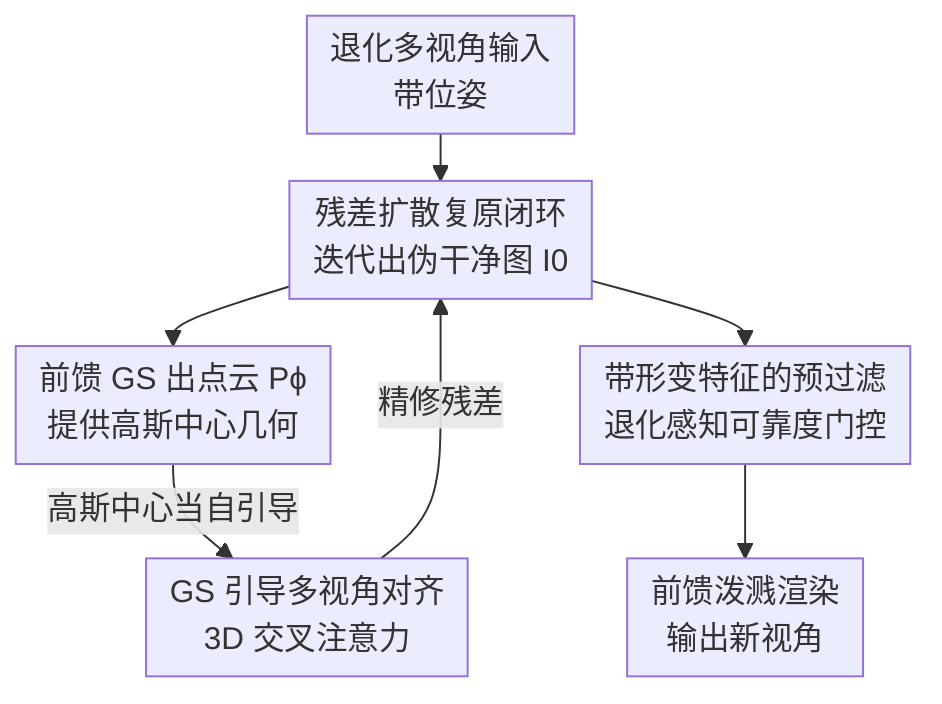

# ReSplat: Degradation-agnostic Feed-forward Gaussian Splatting via Self-guided Residual Diffusion

**会议**: ICLR 2026  
**OpenReview**: [https://openreview.net/forum?id=461VpgnLsi](https://openreview.net/forum?id=461VpgnLsi)  
**代码**: https://github.com/yh-yoon/ReSplat  
**领域**: 3D视觉 / 新视角合成 / 图像复原  
**关键词**: 前馈高斯泼溅, 退化无关复原, 残差扩散, 多视角对齐, 新视角合成

## 一句话总结
ReSplat 把一个扩散式通用图像复原模型和一个前馈 3D 高斯泼溅模型耦合成互导闭环——复原模型用扩散采样中途生成的 3D 高斯中心做"自引导"实现多视角一致的复原，复原后的图又喂给高斯模型重建场景，从而在模糊/低光/雾/雨/雪等任意退化下都能做出更清晰、更鲁棒的新视角合成。

## 研究背景与动机
**领域现状**：新视角合成（NVS）从 NeRF 到 3D Gaussian Splatting（3DGS）渲染质量和速度都越做越好，可泛化版本（generalizable NeRF / feed-forward 3DGS，如 PixelSplat、MVSplat、MVSGaussian）还能免去逐场景优化、一次前向就从几张带位姿的图重建场景。但这些方法几乎都假设输入是干净、受控环境下拍的多视角图。

**现有痛点**：真实采集常带模糊、低光、雾、雨、雪等退化。已有针对退化的 NVS（Deblur-NeRF、低光的 LLNeRF、雾的方法等）几乎都是为**某一种**退化量身定做，把退化的物理过程写进渲染里，换一种退化就失效；而 GAURA 虽然是可泛化、跨多种退化的前馈 NeRF，却完全没用上 2D 域里成熟的图像复原能力，性能上限受限。

**核心矛盾**：单看 2D 通用图像复原（universal image restoration, UIR）是个严重病态问题——一张退化图对应无数种可能的干净图，单视角复原很容易在每个视角各猜一套、互相打架，破坏多视角一致性；而 NVS 又恰恰最需要多视角一致。也就是说"复原"和"几何一致"这两件事如果各做各的，就会互相拖后腿。

**本文目标**：做一个**退化无关（degradation-agnostic）**、不需要预先知道退化类型、单一模型就能扛各种甚至混合退化的前馈高斯泼溅 NVS 框架。

**切入角度**：作者注意到，前馈 3DGS 与 NeRF 不同，它是显式点表示——重建过程中天然会跑多视角立体（MVS）、显式吐出高斯中心（3D 几何）。这份几何正好能告诉复原模型"不同视角里哪些像素是同一个 3D 点"，于是复原可以借几何做到跨视角一致。反过来，复原得越干净，几何估计也越准，形成正反馈。

**核心 idea**：让通用图像复原（扩散式残差去噪 DiffUIR）和前馈高斯泼溅（MVSGaussian）在扩散采样过程中**互相引导**——用中途生成的 3D 高斯中心当复原的"自引导"信号，逐步迭代精修，实现多视角一致的退化无关复原 + 鲁棒 NVS。

## 方法详解

### 整体框架
ReSplat 把两套模型拼成一个迭代闭环：一个基于残差去噪扩散（RDDM/DiffUIR）的通用复原模型 $\theta$，一个前馈高斯泼溅模型 $\phi$（用 MVSGaussian）。给定 $N$ 张带位姿的退化输入 $\{I^i_{in}\}$，复原模型并不一次性出图，而是按 DDIM 走若干步扩散：每一步先从当前残差预测一版"伪干净图" $I^\theta_0 = I_{in} - I^\theta_{res}$，把这版干净图送进 $\phi$ 的 MVS 模块，前馈生成显式点云 $P^\phi_0$（即一组高斯中心）；下一步扩散时，复原模型借这份 3D 几何做跨视角对齐，再吐出更准的残差。如此"复原→出几何→几何反哺复原"反复几轮，直到最后一版干净图稳定，再走一遍完整前馈泼溅渲染出新视角。渲染前还插了一道**预过滤**，根据原始退化图给多视角聚合权重打折，压掉残留伪影。

整个流程是"扩散步内嵌几何反馈 + 渲染前权重门控"的清晰串行 pipeline：

### 关键设计

**1. 复原↔几何互导的自引导闭环：用采样中途的高斯点云当复原模型的引导**

这一招针对的痛点很直接——单视角通用复原是病态的，各视角各猜会破坏一致性。ReSplat 的做法是不把复原和重建当两个串联阶段（"先复原再合成"，即表格里的 IR→NV），而是让它们在扩散采样里**互为条件**（IR w/ NV）。训练时联合优化两项 L1 损失：复原模型的残差预测损失 $\|I_{res}-I^\theta_{res}(P^\phi_0, I_t, I_{in}, t)\|_1$，以及前馈 GS 的新视角渲染损失 $\|I_{nv}-I^\phi_{ren}(I_{in}-I^\theta_{res}, I_{in})\|_1$。注意残差预测里多了个输入 $P^\phi_0$——也就是上一时间步前馈 GS 算出来的高斯中心点云，它把"哪些像素跨视角是同一个 3D 点"这条几何信息喂进复原网络。采样时（Algorithm 2）每步都重算一遍 $P^\phi_0 = \phi(I_{in}-I^\theta_{res}, I_{in})$，让几何随复原一起逐步精修。这种闭环的好处是复原既享受了扩散先验的强复原能力，又被 3D 几何约束着保持多视角一致，而不是退化成一个孤立的 2D 去噪器。

**2. GS 引导的多视角对齐：把单图复原网络改造成跨视角注意力**

原始 DiffUIR 是为单张图设计的，本身没有视角间交互。本文给它嵌入一个空间特征注意力模块（图 3），核心是借助伪几何 $P^\phi_0$ 做对齐。对某个高斯中心点 $p_i$，把 $N$ 个视角的特征向量 $\{f^j_i\}_{j=1}^N$ 投影到这个中心点，然后在这组对应同一 3D 点的特征之间做自注意力，让多视角信息在几何对应处充分交换，这一步在扩散编码器里反复执行以保证 3D 一致性。处理后的特征 $f^j_{i,rep}$ 需要重投影回原像素坐标，但落点是连续坐标、不在离散像素格上，于是作者按落点到周围四个像素的"对角面积"分配 2D 插值权重 $\{w_i\}$ 做加权扩散：对离散点 $q$，其拿到的多视角特征为 $F_q = \sum_{i} w_i f^j_{i,rep}$（$i$ 取包住 $q$ 的最小矩形内的所有点），离查询点越近的特征权重越大。这样复原网络就在"几何对应"而非"像素对应"层面融合多视角，从根上保证跨视角复原一致。

**3. 带形变特征的预过滤：退化感知的可靠度门控，压掉残留伪影**

复原再好也会有残留——雨丝、雪斑、雾的碎片不会被完全抹掉，而这些脏区一旦参与多视角特征聚合，会污染最终高斯椭球的辐射值。前馈 GS 本身会预测每视角聚合权重 $W^i$（基于遮挡/可见性），但它不知道哪里是退化残留。本文加了一个预过滤模块（图 4）：把复原结果 $\{I^i_{out}\}$ 用 $P^\phi_0$ 做深度形变（warp）到新视角，连同形变后的退化图一起送进模块，自注意力后预测一张**每视角可靠度图** $\{W^i_{pre}\}$，独立于 GS 自带的遮挡权重。最终权重为二者相乘 $W^i_{final}(x) = W^i_{pre}(x)\cdot W^i(x)$，再替换原权重进渲染。它相当于在标准可见性权重之上加了一道"退化感知软门"：跨视角不一致或伪影强的区域 $W^i_{pre}$ 给低分被压制，几何一致的干净结构则保留，从而得到更鲁棒的辐射场。

### 损失函数 / 训练策略
训练目标是两项 L1 损失之和：通用复原损失 $L_{UIR}=\|I_{res}-I^\theta_{res}\|_1$ 监督复原模型 $\theta$ 的残差预测，新视角渲染损失 $L_{NV}=\|I_{nv}-I^\phi_{ren}\|_1$ 监督前馈 GS 模型 $\phi$（用 GT 干净新视角 $I_{nv}$ 监督）。残差扩散沿用 DiffUIR 的通用残差去噪：前向加入共享分布项（SDT）$I_t = I_{t-1} + \alpha_t I_{res} + \beta_t \epsilon_{t-1} - \delta_t I_{in}$。训练数据用 GAURA 的合成多退化生成管线在 IBRNet 训练集上构造多视角退化对；MVSGaussian 先在无复原的退化数据上预训练以加速；为公平比较，所有 UIR baseline 都在同一训练集上微调。推理用 DDIM、固定仅 **3 步**采样，3 个视角输入可在 1 秒内完成。

## 实验关键数据

### 主实验
LLFF 合成退化数据集，3 视角输入，5 种退化下 NVS 与多视角复原结果（ReSplat 为 IR w/ NV 闭环，DiffUIR 为 IR→NV 串联），取代表性数值：

| 退化类型 | 指标(NVS) | ReSplat | DiffUIR | GAURA |
|----------|-----------|---------|---------|-------|
| 运动模糊 | PSNR↑ | **23.15** | 22.75 | 21.28 |
| 雪 | PSNR↑ | **24.46** | 24.24 | 20.48 |
| 雾 | PSNR↑ | **21.99** | 21.56 | 17.22 |
| 低光 | PSNR↑ | **19.76** | 18.87 | 15.28 |
| 雨 | PSNR↑ | **24.11** | 23.51 | 21.78 |

混合退化（LLFF mixed）更能体现退化无关优势：在"雾+雪"上 ReSplat 达 20.17 PSNR，而 DiffUIR 只有 15.38，差距近 5 dB；"雨+运动模糊"20.44 vs 20.07，"雪+运动模糊"22.00 vs 21.63。真实退化数据集（DeblurNeRF 模糊 / REVIDE 雾 / LLNeRF 低光）上 ReSplat 同样在三类上 PSNR 均领先（如低光 22.92 vs DiffUIR 22.00、GAURA 19.07）。

### 消融实验
5 种退化平均 NVS（表 4，两个模块逐项加回）：

| 配置 | 对齐 | 预过滤 | PSNR↑ | SSIM↑ | LPIPS↓ |
|------|------|--------|-------|-------|--------|
| #1 | ✗ | ✗ | 22.19 | 0.8264 | 0.2372 |
| #2 | ✗ | ✓ | 22.35 | 0.8290 | 0.2368 |
| #3 | ✓ | ✗ | 22.46 | 0.8313 | 0.2306 |
| #4（完整） | ✓ | ✓ | **22.69** | **0.8383** | **0.2230** |

### 关键发现
- **GS 引导多视角对齐贡献更大**：单加对齐（#3，+0.27 PSNR）比单加预过滤（#2，+0.16）涨得多，说明跨视角几何一致才是闭环的核心增益来源；两者叠加（#4）拿到 +0.50 PSNR、LPIPS 从 0.2372 降到 0.2230，感知质量改善尤为明显。
- **退化越重 / 越混合，闭环优势越大**：单退化里 ReSplat 对 DiffUIR 多是零点几 dB 的稳定领先，但到雾、低光、混合退化（如雾+雪近 5 dB）这类高病态场景，差距被显著拉开——正是几何一致约束在强退化下兜住了复原的不确定性。
- **效率友好**：仅 3 步 DDIM 采样、3 视角 1 秒内完成，相比逐场景优化的退化 NeRF 是数量级的实用性提升。

## 亮点与洞察
- **把"重建的副产物"反用成"复原的引导"**：前馈 3DGS 为了出点云本来就要跑 MVS，作者没让这份几何只服务渲染，而是回灌给复原网络做跨视角对齐——一份计算两头用，零额外几何估计成本就拿到了多视角一致性。
- **闭环 vs 串联是范式差别**：表格里 IR→NV（先复原再合成）和 IR w/ NV（复原与合成互导）的对比，干净说明了"复原别孤立做"这件事的价值，混合退化上的大幅领先就是证据。
- **退化无关的工程价值**：不需要退化类型先验、单模型扛模糊/低光/雾/雨/雪及其混合，这种"all-in-one + 3D 一致"的组合可迁移到任意需要从脏数据快速建场景的下游（如户外/弱光采集的快速三维化）。
- **预过滤是个轻量但通用的 trick**：在前馈 GS 的可见性权重上再乘一张退化感知可靠度图，思路可直接搬到其他带噪多视角聚合任务里做软门控。

## 局限与展望
- **依赖合成退化训练**：训练退化由 GAURA 合成管线生成，真实退化分布与合成分布的差异可能限制泛化，论文虽在真实数据上验证但退化种类有限。
- **绑定特定 backbone**：复原侧用 DiffUIR、几何侧用 MVSGaussian，闭环对这两者的具体实现有耦合；换更强或更轻的前馈 GS / 复原模型时对齐模块和预过滤是否即插即用，文中未充分讨论。
- **稀疏视角与极端退化**：虽宣称稀疏视角可用、并在 3 视角下评测，但视角进一步减少或退化极端（如近全黑低光、浓雾）时几何引导本身也会失真，闭环可能放大误差，这块缺更系统的压力测试。
- **复原与渲染联合监督的平衡**：两项 L1 损失的权衡、采样步数（仅 3 步）对质量-速度的取舍，论文给的是固定配置，缺少对这些超参敏感性的分析。

## 相关工作与启发
- **vs GAURA**：同样追求退化无关的可泛化前馈 NVS，但 GAURA 只做 NeRF 侧、完全不引入 2D 复原能力；ReSplat 显式接入预训练通用复原先验并与前馈 3DGS 闭环互导，性能上对 GAURA 全面大幅领先（雾上 21.99 vs 17.22 PSNR）。
- **vs DiffUIR（及 IR→NV 串联）**：DiffUIR 是本文复原侧的 baseline，单独用就是"先复原各视角、再丢给 NVS"的串联；ReSplat 把它改造成几何引导的多视角对齐版并与渲染联合训练，单退化稳定领先、混合退化大幅领先，证明闭环优于串联。
- **vs 退化专用 NVS（Deblur-NeRF / LLNeRF / DiET-GS / RobustGS 等）**：这些方法把某种退化的物理过程写进渲染、只针对单一退化且多需逐场景优化；ReSplat 是单模型、退化无关、前馈一次过，牺牲了对某种退化的极致专精，换来覆盖面与实用性。

## 评分
- 新颖性: ⭐⭐⭐⭐⭐ 用前馈 GS 中途几何自引导扩散复原、把复原与重建做成互导闭环，角度新颖且自洽
- 实验充分度: ⭐⭐⭐⭐ 覆盖 5 单退化 + 3 混合退化 + 真实数据 + 消融，但超参/步数敏感性与极端场景压力测试偏少
- 写作质量: ⭐⭐⭐⭐ 框架与算法（含训练/采样伪码）讲得清楚，少数符号略密集
- 价值: ⭐⭐⭐⭐⭐ 退化无关 + 秒级前馈 + 多视角一致，对真实脏数据快速三维重建很实用

<!-- RELATED:START -->

## 相关论文

- [\[CVPR 2026\] Z-Order Transformer for Feed-Forward Gaussian Splatting](../../CVPR2026/3d_vision/z-order_transformer_for_feed-forward_gaussian_splatting.md)
- [\[ICLR 2026\] DiffPBR: Point-Based Rendering via Spatial-Aware Residual Diffusion](diffpbr_point-based_rendering_via_spatial-aware_residual_diffusion.md)
- [\[ICLR 2026\] Flash-Mono: Feed-Forward Accelerated Gaussian Splatting Monocular SLAM](flash-mono_feed-forward_accelerated_gaussian_splatting_monocular_slam.md)
- [\[CVPR 2026\] GIFSplat: Generative Prior-Guided Iterative Feed-Forward 3D Gaussian Splatting from Sparse Views](../../CVPR2026/3d_vision/gifsplat_generative_prior-guided_iterative_feed-forward_3d_gaussian_splatting_fr.md)
- [\[CVPR 2026\] AnchorSplat: Feed-Forward 3D Gaussian Splatting with 3D Geometric Priors](../../CVPR2026/3d_vision/anchorsplat_feed-forward_3d_gaussian_splatting_with_3d_geometric_priors.md)

<!-- RELATED:END -->
