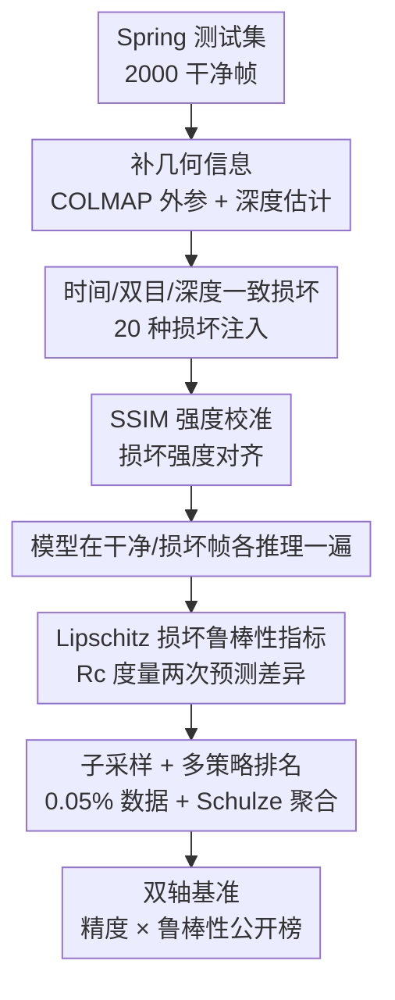

# RobustSpring: Benchmarking Robustness to Image Corruptions for Optical Flow, Scene Flow and Stereo

**会议**: ICLR2026  
**OpenReview**: [https://openreview.net/forum?id=RebPBMrMmk](https://openreview.net/forum?id=RebPBMrMmk)  
**代码**: 集成于 [https://spring-benchmark.org/](https://spring-benchmark.org/)  
**领域**: 3D视觉  
**关键词**: 光流, 场景流, 立体匹配, 鲁棒性基准, 图像损坏

## 一句话总结
本文提出 RobustSpring——首个面向光流 / 场景流 / 立体匹配（稠密匹配）的图像损坏鲁棒性基准，把 20 种损坏以时间 / 双目 / 深度一致的方式注入高分辨率 Spring 数据集，配上一个基于 Lipschitz 连续性、与精度解耦的损坏鲁棒性指标，对 17 个模型做了首轮评测，揭示出"精度高 ≠ 鲁棒"的隐藏短板。

## 研究背景与动机
**领域现状**：光流、场景流、立体匹配这三类稠密匹配任务负责估计像素级的对应关系，是机器人导航、运动恢复结构、医学配准、手术辅助等真实应用的底座。三十年来，KITTI、Sintel、Spring 等基准持续推动"精度"上限，模型在干净图像上的端点误差越做越低。

**现有痛点**：这些主流基准几乎只衡量精度，却很少系统地评测模型在噪声、压缩伪影、雨雪等真实世界损坏下的稳定性。虽然 KITTI/Sintel/Spring 的图像里也夹带了运动模糊、景深、亮度变化等退化，但它们是采集副产物或为提升真实感而加，**并非为系统研究"损坏下模型预测如何变化"而设计**。

**核心矛盾**：图像分类、3D 检测、单目深度估计领域早有成熟的损坏鲁棒性研究（如 ImageNet-C），但稠密匹配这块几乎空白——已有工作只覆盖天气、低光等个别退化，且基本只针对光流，从未有研究横跨三类任务、把场景流和立体也纳进来。更关键的是，"精度更高"并不天然带来"更鲁棒"，甚至可能损害鲁棒性，但这种 trade-off 在稠密匹配里从未被量化。

**本文目标**：构建一个能系统评测三类稠密匹配任务损坏鲁棒性的数据集 + 指标 + 基准平台，并验证它能真实反映现实世界的鲁棒性。

**切入角度**：以 Spring 高分辨率、带稠密真值的渲染立体视频作底座（细腻渲染允许从"模糊去细节"到"天气加细节"的多粒度改造），并意识到稠密匹配与分类的本质区别——它依赖时间、双目、深度的几何一致性，所以损坏不能像 2D 分类那样逐帧独立施加，必须做成时间 / 双目 / 深度一致。

**核心 idea**：把分类领域的 20 种通用损坏"几何化改造"后注入稠密匹配数据，再用一个不依赖真值、把鲁棒性与精度彻底拆开的指标去量化稳定性，让鲁棒性成为与精度并列的"一等公民"。

## 方法详解

### 整体框架
RobustSpring 不是训练数据集，而是评测"未见损坏下模型泛化能力"的基准。它的构造分两条主线：**数据侧**——拿 Spring 测试集的干净帧，先补出几何信息（深度 + 外参），再施加 20 种几何一致的损坏，生成 20,000 张损坏图（40,000 帧 / 20,000 对立体帧）；**评测侧**——让模型在干净帧和损坏帧上各跑一遍，用一个基于 Lipschitz 的损坏鲁棒性指标 $R^c$ 度量两次预测的差异，经子采样压缩后上传到与 Spring 精度榜耦合的网站，做精度 + 鲁棒性双轴排名。

为保证损坏的几何一致性，需要 Spring 未公开的深度与外参：作者用 COLMAP 3.8 估计外参，用 MS-RAFT+ 预测的视差 $d$ 经 $Z = \frac{f_x \cdot B}{d}$（焦距 $f_x$、基线 $B$）反算深度。这一步只用预测值、不碰真值，避免了真值泄漏。

### 关键设计

**1. 时间 / 双目 / 深度一致的损坏注入：把 2D 通用损坏几何化**

稠密匹配模型吃的是立体视频，预测依赖跨帧、跨视角、跨深度的几何关系。如果像 2D 分类那样让每帧每个视角的损坏各自独立，会制造出现实中不存在的"伪不一致"，评测就失真了。作者沿用 Hendrycks & Dietterich 的五大类损坏（color / blur / noise / quality / weather，共 20 种），但给其中 16 种补上三种一致性：**时间一致**让损坏在同一相机的相邻帧间平滑演化（如霜冻在一台相机上呈时间连贯的图案）；**双目一致**让左右相机经受相同强度的变换（注意这不等于逐像素相同的噪声实现，只是变换强度一致，亮度 / 对比度这类全局调整天然双目一致）；**深度一致**则把天气粒子（雪、雨、雾）直接渲染进 3D 场景，让它们沿 3D 轨迹运动并按几何投影到各视角，产生视角相关的遮挡与透视。而模糊、噪声这类不依赖 3D 的损坏则保留逐帧独立实现，只共享全局强度参数。运动模糊因依赖具体视角而**不做双目一致**——这种对每种损坏物理属性的逐一判断，正是把通用损坏"稠密匹配化"的关键。

**2. 基于 Lipschitz 的损坏鲁棒性指标：把鲁棒性从精度里剥离出来**

稠密匹配此前没有标准化的损坏鲁棒性指标。一个直觉但错误的做法是拿损坏预测和**真值**比，但这会把精度和鲁棒性混在一起——而二者本是竞争性的：一个永远输出常数的模型极其鲁棒却毫无精度，一个对任何输入变化都敏感的高精度模型则不鲁棒。所以作者选择拿损坏预测和**干净预测**比，并建立在系统鲁棒性的经典数学概念 Lipschitz 常数上：

$$L_c = \frac{\|f(I) - f(I_c)\|}{\|I - I_c\|}$$

其中 $f$ 是模型预测，$I$ / $I_c$ 是干净 / 损坏图，分母是逐像素强度差。由于 RobustSpring 已通过 SSIM 均衡让各损坏对图像的改变量相近（见设计 3），分母近似常数可省去，最终损坏鲁棒性定义为干净与损坏预测在距离度量 $M$ 下的差异：

$$R^c_M = M[f(I), f(I_c)]$$

为对齐 Spring 的评测，$M$ 取多种度量：光流 / 场景流用 $R^c_{\text{EPE}}$、$R^c_{\text{1px}}$、$R^c_{\text{Fl}}$，立体用 $R^c_{\text{1px}}$、$R^c_{\text{Abs}}$、$R^c_{\text{D1}}$。值越低越鲁棒——注意低值代表"稳定"而非"精度高"。其中基于 EPE 的版本 $R^c_{\text{EPE}} = \frac{1}{|\Omega|}\sum_{i\in\Omega}\|f_i(I) - f_i(I_c)\|$ 正是把光流对抗鲁棒性度量推广到了稠密匹配与一般损坏。

**3. SSIM 均衡的强度校准 + 大幅子采样：让 20 种损坏可比、可上传**

20 种损坏天然强度不一，直接比较会被"某种损坏改得更狠"带偏。作者调每种损坏的超参，直到图像 SSIM 达到设定阈值：一般用 SSIM ≥ 0.7，而因为 SSIM 对噪声比对模糊更敏感，噪声类放宽到 SSIM ≥ 0.2 以获得视觉上相当的伪影强度，并做了一次小型感知实验验证强度选择的合理性。这一步同时支撑了设计 2 里"省去分母"的近似。另一个工程瓶颈是数据量——单个场景流模型跑完 20 种损坏的原始数据就达 2.1 TB。作者沿用并细化 Spring 的子采样策略：先剔除仅用于可视化的全分辨率 Hero 帧（剩 0.95%），再做 20 倍子采样，最终只保留 **0.05%** 的数据（约 1.2 GB），让用户能把鲁棒性结果上传到基准网站。同时只发布损坏后的**测试**数据、不发训练数据，从机制上杜绝"针对损坏微调"刷榜。

**4. 双轴基准 + 多策略排名聚合：把鲁棒性变成可公开比较的一等公民**

每个模型在 20 种损坏上会产出 20 份评测，需要聚合成单一排名。作者用三种策略：**Average**（对 20 份取均值）、**Median**（中位数，削弱极端离群损坏的影响）、以及 **Schulze 投票法**（一种成对偏好聚合的整体排序，曾用于 Robust Vision Challenge 的泛化评测）。由于鲁棒性和精度是同等重要的两个性能轴，RobustSpring 把自己与 Spring 已有的精度榜**耦合**——同一份数据上既报精度又报鲁棒性，研究者得以在精度 × 鲁棒性双轴上定位模型，把鲁棒性评测的门槛降到最低。

## 实验关键数据

### 主实验
作者评测了 17 个**未在 Spring / RobustSpring 上微调**的模型：9 个光流（SEA-RAFT、GMFlow、MS-RAFT+、FlowFormer、GMA、SPyNet、RAFT、FlowNet2、PWCNet）、2 个场景流（M-FUSE、RAFT-3D）、6 个立体（RAFT-Stereo、ACVNet、LEAStereo、GANet 等）。下表为光流模型的平均损坏鲁棒性 $R^c_{\text{EPE}}$（越低越鲁棒），并对照干净精度误差 $\varepsilon_{\text{clean}}$。

| 光流模型 | 平均 $R^c_{\text{EPE}}$ | 平均 $R^c_{\text{1px}}$ | 中位 $R^c_{\text{EPE}}$ | 干净 EPE |
|----------|----------|----------|----------|----------|
| SEA-RAFT | **2.96** | 17.52 | 1.20 | 0.36 |
| GMFlow | 2.98 | 40.89 | 1.92 | 0.94 |
| MS-RAFT+ | 3.62 | 23.39 | 1.71 | 0.64 |
| FlowFormer | 3.77 | 21.53 | 2.14 | 0.72 |
| GMA | 4.03 | 21.47 | **1.39** | 0.91 |
| RAFT | 5.64 | 20.18 | 2.60 | 1.48 |
| FlowNet2 | 7.01 | 18.84 | 1.47 | 1.04 |
| PWCNet | 7.25 | 31.71 | 2.77 | 2.29 |

SEA-RAFT 和 GMFlow 取得最低平均 $R^c_{\text{EPE}}$，而 GMA 取得最低中位数——平均与中位排名不一致，说明损坏间方差极大。

### 不同损坏类型的鲁棒性差异（按损坏分解）

| 损坏类 | 代表损坏 | 对模型的冲击 |
|--------|---------|------------|
| Weather | Rain / Snow | **最严重**，$R^c_{\text{EPE}}$ 可飙到数十（如 PWCNet 在 Rain 上达 40+、Snow 上达 39+） |
| Noise | Gaussian / Impulse | 较重，且高精度模型反而更敏感 |
| Quality | JPEG / Pixelate | 中等，分层模型相对耐受 |
| Blur | Motion / Zoom | 中等 |
| Color | Brightness / Saturate | **影响最小** |

### 关键发现
- **精度高 ≠ 鲁棒，但也无强 trade-off**：精度与鲁棒性整体呈弱、非线性正相关（二次回归拟合），没有任何模型在两轴都领先。这与对抗鲁棒性里"强 trade-off"形成鲜明对比——非对抗损坏下，高精度模型在天气损坏上反而更鲁棒（因为它们把损坏诱发的运动误差**留在粒子周围**而非扩散到背景），但在噪声损坏上依旧敏感。
- **架构留下痕迹**：Transformer 模型（GMFlow、FlowFormer）整体最好但**怵噪声**，可能源于其全局匹配机制；分层模型（MS-RAFT+）鲁棒性均衡，受益于多尺度特征；堆叠 / 渐进细化模型（SEA-RAFT、FlowNet2）独特地抗噪声。没有任何范式全面占优。
- **隐藏短板被揭露**：FlowNet2 整体表现差，却是最抗噪声的模型——这种"换个损坏维度排名就翻盘"的现象，正是仅看精度榜永远发现不了的。

## 亮点与洞察
- **把"几何一致性"作为损坏设计的第一原则**：最大的巧思是认识到稠密匹配损坏不能逐帧独立施加，而要按时间 / 双目 / 深度三种几何关系定制——天气粒子甚至直接在 3D 场景里渲染。这套"几何化损坏"的思路可迁移到任何依赖多视角 / 时序一致性的任务（如视频深度、4D 重建的鲁棒性评测）。
- **用 Lipschitz 把鲁棒性和精度数学上拆干净**：拿干净预测（而非真值）当锚点，既绕开了真值泄漏，又给"鲁棒 = 稳定"一个严格的数学定义。$R^c_{\text{EPE}}$ 还正好是光流对抗鲁棒性度量的自然推广，理论上自洽。
- **SSIM 均衡 + 极致子采样的工程务实**：用 SSIM 阈值把 20 种异质损坏拉到可比，又把 2.1 TB 压到 0.05%（1.2 GB）让评测真正可上传可复现——这是基准能落地成公开榜的关键。
- **"换损坏维度排名翻盘"的洞察**：FlowNet2 整体差却最抗噪声，说明单一精度标量严重掩盖了模型的真实鲁棒画像，论证了"分损坏类型报告结果"的必要性。

## 局限与展望
- **作者承认的局限**：20 种损坏不覆盖整个损坏空间；需重渲染的光照变化（如彩色 / 动态光照）、bloom / 眩光 / 扬尘等户外效应、JPEG 2000 等扩展编解码失真都做不进后处理，留作未来扩展。
- **只设单一强度等级**：为控制数据量（多强度会让用户评测资源不堪重负），每种损坏只取一个强度。这意味着无法刻画"鲁棒性随损坏强度的退化曲线"，而这恰是分类领域 ImageNet-C 的标准做法。
- **深度 / 外参为估计值**：时间 / 双目 / 深度一致性依赖 COLMAP 估计的外参和 MS-RAFT+ 估计的深度，估计误差会传导进损坏渲染的几何正确性（尤其深度一致的天气投影），论文在附录给了估计精度但仍是潜在噪声源。
- **改进思路**：可补上多强度等级（以损坏类型为单位精选少数几个强度，平衡资源与曲线刻画）；可探索把该评测迁移到真实采集的立体视频，进一步验证"RobustSpring 鲁棒性 ↔ 真实世界鲁棒性"的相关性强度。

## 相关工作与启发
- **vs ImageNet-C / 2D 通用损坏（Hendrycks & Dietterich）**：后者面向单目 2D 分类、逐图独立施加损坏；本文继承其五大类损坏，但把它们改造成时间 / 双目 / 深度一致，并首次覆盖光流 + 场景流 + 立体三类稠密匹配任务。
- **vs 稠密匹配的对抗鲁棒性研究（Schmalfuss 等）**：对抗工作针对优化出的最坏扰动、且多限于光流；本文转向非对抗的真实损坏，发现非对抗损坏下精度-鲁棒性没有对抗那种强 trade-off，结论互补。
- **vs 天气 / 低光等单一退化基准**：此前稠密匹配的损坏研究零散且只针对个别退化（天气、低光）和单一任务；RobustSpring 是首个横跨三任务、20 种损坏的系统性基准，并把鲁棒性榜与 Spring 精度榜耦合成双轴评测。

## 评分
- 新颖性: ⭐⭐⭐⭐⭐ 首个覆盖光流 / 场景流 / 立体的损坏鲁棒性基准，"几何一致损坏 + Lipschitz 解耦指标"的组合很扎实。
- 实验充分度: ⭐⭐⭐⭐ 17 个模型 × 20 损坏 × 多度量的首轮评测翔实，但每损坏仅单一强度、缺退化曲线。
- 写作质量: ⭐⭐⭐⭐⭐ 动机—设计—发现逻辑清晰，对每种损坏一致性的物理判断交代到位。
- 价值: ⭐⭐⭐⭐⭐ 把鲁棒性提为"一等公民"并降低评测门槛，对稠密匹配的现实部署评估意义重大。

<!-- RELATED:START -->

## 相关论文

- [\[CVPR 2026\] Optical Flow Matching: Reframing Optical Flow as Continuous Transport Dynamics](../../CVPR2026/3d_vision/optical_flow_matching_reframing_optical_flow_as_continuous_transport_dynamics.md)
- [\[ICLR 2026\] WAFT: Warping-Alone Field Transforms for Optical Flow](waft_warping-alone_field_transforms_for_optical_flow.md)
- [\[CVPR 2026\] ARES: Unifying Asymmetric RGB-Event Stereo for Probabilistic Scene Flow Estimation](../../CVPR2026/3d_vision/ares_unifying_asymmetric_rgb-event_stereo_for_probabilistic_scene_flow_estimatio.md)
- [\[ICLR 2026\] HDR-NSFF: High Dynamic Range Neural Scene Flow Fields](hdr-nsff_high_dynamic_range_neural_scene_flow_fields.md)
- [\[CVPR 2026\] Flow4DGS-SLAM: Optical Flow-Guided 4D Gaussian Splatting SLAM](../../CVPR2026/3d_vision/flow4dgs-slam_optical_flow-guided_4d_gaussian_splatting_slam.md)

<!-- RELATED:END -->
