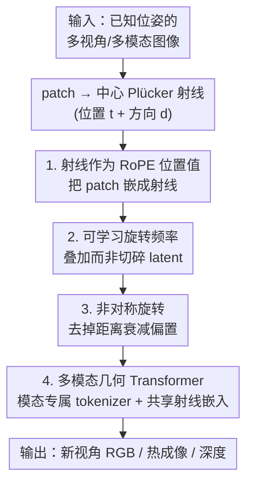

# RoRE: Rotary Ray Embedding for Generalised Multi-Modal Scene Understanding

**会议**: ICLR 2026  
**OpenReview**: [https://openreview.net/forum?id=BR2ItBcqOo](https://openreview.net/forum?id=BR2ItBcqOo)  
**论文**: [项目页](https://roboticimaging.github.io/RoRE)  
**代码**: https://roboticimaging.github.io/RoRE (有)  
**领域**: 3D视觉 / 位置编码 / 多模态融合 / 新视角合成  
**关键词**: 射线编码, RoPE, 多模态场景理解, 相机几何泛化, RGB-热成像

## 一句话总结
RoRE 把图像 patch 直接编码成一条「射线」并通过可学习的旋转式位置编码（RoPE）注入 Transformer，再配合非对称旋转和模态共享的射线嵌入，让**同一个网络**能无重训练地处理透视、鱼眼、RGB-热成像等任意相机几何与模态，显著提升跨几何/跨模态的泛化与一致性。

## 研究背景与动机

**领域现状**：近年的视觉 Transformer（DuST3R、VGGT、LVSM 等）证明，纯前馈 Transformer 就能完成几何推理并合成逼真新视角。这类「隐式渲染器」的一个核心设计点是：**怎么把相机信息注入 Transformer**，让视觉 token 与 3D 场景结构对齐。主流做法是绝对位置编码（APE，如 Plücker 射线的加性嵌入）或相对位置编码（RPE，如基于相机外参/投影矩阵的 GTA、PRoPE）。

**现有痛点**：现有相机编码方式对相机做了很强的假设。一旦输入在分辨率、视场角（FoV）、内参上变化，或换成鱼眼、热成像这类「非常规」传感器，方法就崩。具体表现为两类：①基于外参/投影矩阵的相对编码（GTA、PRoPE）泛化时直接失效——它们把相机绑死在投影矩阵形式上，换焦距、加桶形畸变、上鱼眼就掉到 11~14 dB PSNR；②多模态融合往往依赖人工设计的对齐/融合策略，或要求 confocal（同光心对齐）图像，难以即插即用。

**核心矛盾**：相对编码（RPE）泛化好，但现有 RPE 都**离开了「射线」这一最本质的几何表示**，转而编码外参或投影矩阵，于是丢掉了对相机几何的普适性；而射线表示（如 Plücker 坐标）虽然普适，却通常只以绝对编码（APE）形式注入，享受不到 RPE 的平移不变性与泛化优势。两者一直没能兼得。

**本文目标**：设计一种位置编码，既保留相对编码的泛化能力，又保留射线表示对各种相机族（透视/鱼眼/多模态）的普适性；并在此基础上让单网络融合任意数量、任意模态的输入。

**切入角度**：作者注意到 RoPE 本质是「按某个位置值对向量做旋转」，位置值并不必须是像素索引——完全可以换成**射线**。把 patch 直接参数化为一条射线注入 RoPE，就天然继承了 RoPE 的相对性，又落回到了射线这个普适几何量上。

**核心 idea**：**用「射线」代替「像素索引/外参」作为 RoPE 的位置值**，并让旋转频率可学习、加非对称旋转去掉距离衰减，从而得到一个既相对又普适、可跨几何跨模态的位置编码 RoRE。

## 方法详解

### 整体框架

RoRE 的输入是若干张**已知位姿**的图像（透视/鱼眼/RGB/热成像皆可），输出是目标视角下的新视图（以及可选的深度图）。整体思路是：把每个 patch 用其中心像素的 Plücker 射线（3 维位置/矩 $t$ + 3 维方向 $d$）表示，将这条射线作为「位置值」喂进改造过的 RoPE 去旋转 query/key 向量；为让射线的多维位置不把 latent 空间撕碎，旋转频率改成**可学习**并以叠加方式作用；为消除 RoPE 自带的「越远注意力越弱」的衰减，引入**非对称旋转**让注意力在整个场景上更均匀；最后把这套射线嵌入接到 LVSM 式的 encoder-decoder 上，给每个模态配独立 tokenizer/head 但共享同一套射线嵌入，用带掩码的跨模态预测做训练，实现多模态几何模型。

### 关键设计

**1. 射线式 RoPE：把 patch 当成一条射线来嵌入，而不是像素索引**

现有 RoPE 在视觉里把 patch 按二维像素索引 $(u,v)$ 旋转（向量拆两半，一半按 $u$ 转、一半按 $v$ 转），这只编码了 patch 在图像里的位置，丢掉了它在 3D 里「朝哪看」。RoRE 改成用 patch 中心的 **Plücker 射线**作为位置值——一条射线有 6 维：3 维位置（Plücker 里是「矩」moment）$t=[t_x,t_y,t_z]$ 与 3 维方向 $d=[d_x,d_y,d_z]$。最直接的扩展是把向量切成 6 份、每份按一个射线分量旋转：$x_{rotated}=[f(x^{(1)},t_x),\dots,f(x^{(6)},d_z)]$。因为射线本身就编码了相机几何，这套编码对内参/几何天然不敏感——换焦距、加畸变、上鱼眼时，外参/投影矩阵式的方法（GTA、PRoPE）会失效，而射线照样有意义。这正是 RoRE 在变内参（Tab.2）、桶形畸变与鱼眼（Tab.3）上稳定、其它相对编码崩盘的根因。

**2. 可学习旋转频率：用频率叠加代替向量切片，避免把 latent 空间撕碎**

把 6 维射线硬切成 6 份会有副作用：嵌入维度越多、向量被切得越碎，给 latent 空间加的约束越强；而且位置分量（moment）和方向分量在量级、语义上根本不同，本不该用同一套手工频率。RoRE 干脆把 RoPE 里手工设定的基频 $\theta_i=10000^{-2(i-1)/d}$ 换成**每个维度都可学习**的频率 $\theta_{p\times d/2}$（$p=6$ 为射线维数），并以**叠加**方式作用：对每个旋转平面 $i$，旋转角是所有射线分量按各自学习频率的加权和

$$R^{2d}_{RoRE}(P,\theta_i)=R^{2d}\!\left(\sum_p (P_p\cdot\theta_{i,p})\right),$$

其中 $P_p$ 是射线位置向量 $[t_x,t_y,t_z,d_x,d_y,d_z]$ 的分量。这样不再切碎向量，而是让网络自己学会「哪个位置维度该和 latent 的哪部分交互」。频率从 $U(0,0.5)$ 随机初始化，训练后竟自发地复现出与手工频率类似的「随频率索引衰减」的多尺度结构，且方向通道获得更高频率、位置通道更低频——说明可学习频率能自主恢复出可解释的频率谱。消融（Tab.4）显示它与手工频率性能持平，但好处是**彻底省掉手工调参**，且不增加推理时间。

**3. 非对称旋转：去掉 RoPE 自带的距离衰减，让注意力在整幅场景上均匀**

标准 RoPE 源自 NLP，刻意让注意力随 token 间距增大而衰减以强调局部交互；但在 3D 视觉里，**图像空间上离得很远的射线之间可能存在重要的几何对应**，这种衰减反而有害。RoRE 借鉴 VRoPE，给每个位置分量补一个「平移过的负镜像」，把位置向量构造成

$$P=[t^+,t^-,d^+,d^-]=[t,-t,d,-d]+[0,b_{shift},0,b_{shift}],$$

其中 $b_{shift}=1$（因为 $t,d$ 都归一化到最大值 1）。实际上 $\theta$ 里的 $p$ 维变成原位置向量的两倍。这样编码后的幅度在整个射线域上保持一致，既保留了 RoPE 的旋转性质，又消除了不该有的注意力衰减。可视化（Fig.2）显示：不加非对称时注意力明显偏向 query 射线附近的 patch，加了之后跨帧注意力接近均匀。消融里它带来一个稳定的小幅提升（PSNR 26.56→26.65）。

**4. 多模态几何模型：模态专属 tokenizer + 共享射线嵌入 + 掩码跨模态预测**

要让一个网络同时吃 RGB、热成像、深度，RoRE 沿用 MultiMAE/LVSM 的思路：每个模态配自己的输入 tokenizer 和输出 head，但**共享同一套射线 RoRE 嵌入**作为几何骨架。模态信息一方面用绝对嵌入注入，另一方面把模态类别 $C_{modality}$ 拼进位置向量得到 $P_{modality}=[P, C_{modality}]$，让离散的模态标签也纳入同一编码框架，与几何位置编码保持一致。和需要 confocal 的方法不同，RoRE 直接在**有位姿的非共光心图像**上工作，用光度自监督学跨模态对应。训练用**掩码输入**策略——按固定比例掩掉输入 patch，并从不同模态组合中随机抽 context/target 视图，逼网络学会**同时**补全缺失的空间区域和缺席的模态；损失是光度损失（MSE+感知）加一项几何一致的深度损失（深度对 RGB-热成像融合非必需，但作为额外几何约束并支持显式深度估计）。这套设计让单模型在 RGB-RGB、RGB-热成像、热成像-热成像各种配置下都能跑（Tab.5），并能用一种模态的线索补另一种模态缺失的物体。

### 损失函数 / 训练策略
训练用 RealEstate10K（透视、带位姿视频）为主，配合掩码输入与随机模态组合。多模态分支采用 cross-attention 让 target 与 query 交互（借鉴 DuST3R），并把 Plücker 坐标换成更简单的 raymap（位置+方向而非矩+方向）以便学深度。总损失 = 光度 MSE + 感知损失 + 深度损失（几何一致约束，可选）。

## 实验关键数据

### 主实验

常规新视角合成（RealEstate10K 为训练域，DL3DV 为同类未见域）上，各方法本就接近；RoRE 与 SOTA 持平，优势体现在需要泛化的设定里。

| 数据集 | 指标 | RoRE | LVSM | PRoPE† |
|--------|------|------|------|--------|
| RealEstate10K | PSNR↑ | 26.65 | 26.18 | 26.81 |
| DL3DV (未见域) | PSNR↑ | 19.77 | 19.48 | 19.68 |

真正拉开差距的是**变相机几何**（均不重训练）：

| 测试设定 | 指标 | RoRE | LVSM | GTA | PRoPE |
|----------|------|------|------|-----|-------|
| 变焦距 RE10K | PSNR↑ | **22.66** | 21.95 | 14.81 | 14.71 |
| 桶形畸变 RE10K | PSNR↑ | **23.96** | 21.99 | 18.58 | 18.57 |
| 鱼眼 FIORD | PSNR↑ | **23.55** | 22.52 | 11.64 | 11.90 |

GTA/PRoPE 因缺乏显式射线方向编码，在畸变/鱼眼上彻底失效；RoRE 比次优的 LVSM 在畸变上高出约 1.97 dB。

### 消融实验（RE10K，Tab.4）

| 配置 | PSNR↑ | SSIM↑ | 说明 |
|------|-------|-------|------|
| 仅 APE | 26.18 | 0.834 | LVSM 基线 |
| APE + 相对射线嵌入 | 26.56 | 0.843 | 加 RPE 即涨，主要增益来源 |
| + 非对称旋转 | 26.65 | 0.845 | 再稳定小涨 |
| + 可学习频率（无非对称） | 26.57 | 0.842 | 与手工频率持平 |
| 仅 RPE（去 APE） | 26.65 | 0.843 | 去掉绝对嵌入几乎不掉 |
| 全 RoRE | 26.65 | 0.845 | 完整模型 |

### 关键发现
- **性能增益主要来自相对射线嵌入（RPE）**：从仅 APE 的 26.18 加到 26.56，是最大的一跳；非对称旋转再贡献一个小而稳的提升。
- **可学习频率不为涨点、为省心**：它与手工频率性能几乎一样，但彻底去掉了手工调频率的麻烦，且不增加推理时间——是「等价但更通用」的替换。
- **APE 几乎可有可无**：去掉绝对嵌入只单网络仍能工作（26.65），说明网络会自动依赖最合适的编码信息；保留 APE 只换来略高的 SSIM。
- **泛化-精度有取舍**：RoRE 较少约束的嵌入空间让它在变内参/畸变/鱼眼上大幅领先，但在 RE10K/DL3DV 这类「窄域透视」上会比强约束的 PRoPE 略低。
- **多模态可单模型通吃**：一个模型在 RGB-RGB、RGB-热成像、热成像-热成像下都稳（Tab.5），仅热成像-热成像因纹理少、深度精度略降（δ1 0.959 vs RGB-RGB 0.965）；并能在真实 ThermalGaussian 数据上零重训练渲染，但存在 sim-to-real 差距。

## 亮点与洞察
- **「位置值不必是索引，可以是射线」是个很解耦的视角**：RoPE 的旋转机制对位置值的语义不挑食，把它换成射线就把「相对性」和「几何普适性」一次性拿到手，思路干净。
- **频率从切片改叠加**，避免高维位置把 latent 撕碎，是个可迁移的小 trick——任何要往 RoPE 里塞多维位置（时序、模态、3D 坐标）的场景都能借鉴。
- **非对称旋转把「NLP 的局部偏好」从视觉里拆掉**：用负镜像位置消除距离衰减，让远距射线也能强对应，这对几何任务很关键，也提示我们 NLP 的位置编码默认假设搬到视觉要小心。
- **共享几何骨架 + 模态专属头**：把模态当成位置向量里的一维类别，让离散模态和连续几何统一在同一编码框架里，是多模态即插即用的优雅做法。

## 局限与展望
- **一个 patch 只用一条射线**：patch 的大小和朝向没被显式编码（虽可能被网络隐式推断），限制了表示力；把这些直接编码进去是明确的未来方向。
- **依赖已知位姿**：RoRE 定位于「位姿可得」的场景（如车载固定多相机 rig），与 DuST3R/VGGT/MapAnything 这类 pose-free 方法路线不同——无法标定时不适用，但换来更小更高效的网络。
- **sim-to-real 差距**：多模态训练靠自建的合成 MultiModalBlender 数据集，真实热成像上仍有差距（场景类型、运动、热成像保真度差异），渲染超出输入空间范围时有边缘外推伪影。
- **频率初始化未深究**：可学习频率仅用 $U(0,0.5)$ 初始化，作者把更好的初始化策略留给后续工作。

## 相关工作与启发
- **vs PRoPE / GTA（外参/投影矩阵式相对编码）**：它们把相机绑死在投影矩阵/外参上，在常规透视域上甚至略好，但一旦变内参/畸变/鱼眼就失效；RoRE 编码完整射线，泛化强得多，代价是窄透视域略逊。区别根源是「编码射线 vs 编码相机参数」。
- **vs LVSM（纯 APE）**：RoRE 直接采用 LVSM 架构做底座，只把 APE 换成射线相对编码；在所有泛化设定上稳定优于 LVSM，证明相对射线嵌入的价值。
- **vs MultiMAE**：MultiMAE 要求 confocal 图像把多模态嵌进共享 latent；RoRE 借鉴其「模态专属 tokenizer/head」，但改成直接在有位姿的非共光心图像上工作，并用射线几何骨架对齐，是首个前馈式多模态新视角合成方法。
- **vs VRoPE**：借用其「负镜像位置」思路去衰减，但 VRoPE 处理时序维度，RoRE 把它用到射线域的注意力均匀化上。

## 评分
- 新颖性: ⭐⭐⭐⭐⭐ 「把 RoPE 位置值换成射线」+ 可学习频率叠加 + 非对称旋转，三个改造组合出一个真正普适的相机几何编码，并首次做到前馈多模态新视角合成。
- 实验充分度: ⭐⭐⭐⭐ 覆盖透视/未见域/变内参/畸变/鱼眼/RGB-热成像/真实数据共 5 个数据集，消融清晰；但缺与多模态前馈方法的直接对比（作者称无可比方法），真实多模态多为定性。
- 写作质量: ⭐⭐⭐⭐ 动机链条清楚、公式完整，泛化-精度取舍诚实交代；个别表述与附录细节略简。
- 价值: ⭐⭐⭐⭐⭐ 即插即用、跨几何跨模态的位置编码对车载/搜救/巡检等异构多相机系统很实用，且 trick 可迁移到任何往 RoPE 注入多维位置的场景。

<!-- RELATED:START -->

## 相关论文

- [\[ICLR 2026\] OmniWorld: A Multi-Domain and Multi-Modal Dataset for 4D World Modeling](omniworld_a_multi-domain_and_multi-modal_dataset_for_4d_world_modeling.md)
- [\[CVPR 2026\] Multi-modal Frequency Decomposition Network for Semantic Scene Completion](../../CVPR2026/3d_vision/multi-modal_frequency_decomposition_network_for_semantic_scene_completion.md)
- [\[ICLR 2026\] EgoNight: Towards Egocentric Vision Understanding at Night with a Challenging Benchmark](egonight_towards_egocentric_vision_understanding_at_night_with_a_challenging_ben.md)
- [\[CVPR 2026\] MSGNav: Unleashing the Power of Multi-modal 3D Scene Graph for Zero-Shot Embodied Navigation](../../CVPR2026/3d_vision/msgnav_unleashing_the_power_of_multi-modal_3d_scene_graph_for_zero-shot_embodied.md)
- [\[CVPR 2026\] Fast SceneScript: Fast and Accurate Language-Based 3D Scene Understanding via Multi-Token Prediction](../../CVPR2026/3d_vision/fast_scenescript_fast_and_accurate_language-based_3d_scene_understanding_via_mul.md)

<!-- RELATED:END -->
