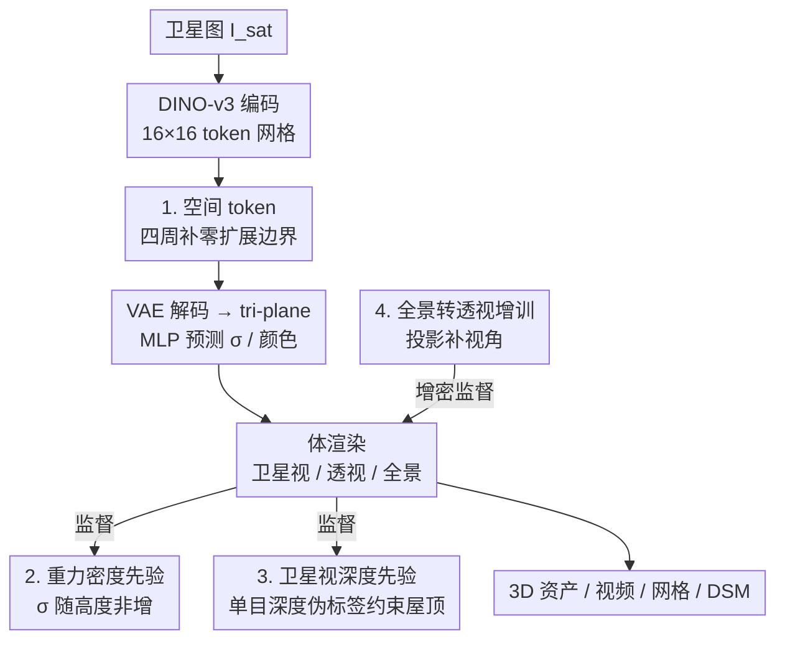

# Sat3DGen: Comprehensive Street-level 3D Scene Generation from Single Satellite Image

**会议**: ICLR 2026  
**OpenReview**: [https://openreview.net/forum?id=E7JzkZCofa](https://openreview.net/forum?id=E7JzkZCofa)  
**代码**: https://github.com/qianmingduowan/Sat3DGen  
**领域**: 3D视觉  
**关键词**: 卫星图生成3D、街景合成、前馈image-to-3D、几何先验、NeRF  

## 一句话总结
给定一张俯视卫星图，Sat3DGen 在前馈 tri-plane NeRF 框架上注入三类几何约束（重力密度先验、卫星视深度先验、边界空间 token）外加全景转透视的视角增训，把街景 3D 的几何 RMSE 从 6.76m 降到 5.20m，同时让渲染 FID 从 ~40 降到 19。

## 研究背景与动机
**领域现状**：从单张卫星图生成街景 3D 场景，目前分两条路线。一是「几何上色」（Sat2Scene、Sat2City）：先预测建筑几何再贴纹理，几何干净但只盯着建筑，斑马线、行道树、绿化带这些非建筑语义全丢，输出和卫星图对不上。二是「3D 代理」（Sat2Density++）：用前馈 image-to-3D 框架在 2D 监督下联合学几何和纹理，整体场景内容丰富、语义忠实，但几何粗糙不稳——屋顶不真实、立面有空洞、空中飘着浮渣（floaters）。

**现有痛点**：本文的目标是「忠实保留卫星图的语义和外观」，所以代理路线更合适，但代理路线的几何太烂，没法用于建图、仿真这类下游。

**核心矛盾**：作者认为代理路线几何差**不是范式本身的缺陷**——object-level 的 InstantMesh/LRM 已证明纯 2D 监督能学出高质量 3D。问题出在卫星-街景数据特有的两个困难：监督**极度稀疏**（一张卫星 patch + 几张地面全景），加上**极端视角差**（俯视 vs 平视），导致屋顶几何欠约束、立面长洞和浮渣；而卫星与街景的覆盖范围（footprint）不一致，又让场景边界几何失稳。

**本文目标**：不重新发明前馈架构，而是在通用框架上「对症下药」修掉它的核心几何失败模式——压住浮渣、稳住边界、消除屋顶歧义、缓解监督稀疏。

**切入角度**：把几何放在第一位（geometry-first），用物理直觉和单目深度伪标签去补足稀疏监督缺失的几何约束。

**核心 idea**：用「重力密度先验 + 卫星视深度先验 + 边界空间 token + 全景转透视增训」四件轻量组件，把前馈 tri-plane NeRF 的几何补好，几何一好，照片真实感也跟着大涨。

## 方法详解

### 整体框架
Sat3DGen 的骨干是一个前馈 image-to-3D 框架，用 tri-plane NeRF 做 3D 表征。输入一张卫星图 $I_{sat}$（外加一个可选的全局光照特征 $f_{ill}$ 用来控制渲染光照），输出一个可渲染的 3D 场景：能渲卫星视、任意位姿的透视街景、全景街景，还能用 Marching Cubes 导出网格。

主干流程是：冻结的 DINO-v3 ViT 编码器把 $I_{sat}$ 压成 $16\times16\times1024$ 的 token 网格 → 四周补一圈零值「空间 token」扩展有效场景范围 → VAE 式解码器上采样成高分辨率 tri-plane 特征 → 3D 查询点正交投影到 XY/XZ/YZ 三平面双线性采样并逐元素相加 → 浅层 MLP 预测密度 $\sigma$ 和颜色 $c$ → 体渲染合成图像。天空单独用球面特征图建模以支持任意视角。本文真正的创新是在这个骨干之上挂的三类几何约束（前两条以 loss 形式、一条以模块形式）加一条训练策略。

### 关键设计

**1. 空间 token：补一圈零 token 扩展场景边界，稳住边界几何**

街景监督经常看到延伸到卫星 crop 之外的建筑和道路，如果把 3D 场强行约束在 crop 的 footprint 内，边界就会出现撕裂、扭曲。作者在 token 网格 $F_{token}\in\mathbb{R}^{16\times16\times1024}$ 四周各补 $N=2$ 圈零值 token，得到 $F_{token\_pad}\in\mathbb{R}^{20\times20\times1024}$。直觉是：原本场景立方体每边跨 $L$ 米（如 50m），补 token 后有效立方体扩大到 $L\cdot(1+\frac{2N}{H_t})$（即 62.5m），多出来的自由度专门收纳周边溢出的内容，从而稳住内部几何。解码时用 padding 的 tri-plane 分辨率取 320（否则 256）。它是个纯结构性的小改动，却专治边界处的 torn edges 和 warped borders。

**2. 重力密度先验：用「密度随高度非增」的物理直觉压住浮渣和空洞**

稀疏视角重建出的户外场景常有空中浮渣和悬空地面。作者从重力这个物理事实出发立了条简单原则：体密度 $\sigma$ 一般应随海拔非增——固体地面、树干在低处密，越往高越稀疏（树冠、空气）。$\sigma$ 在 NeRF 里衡量光线遮挡，正好当物质的代理。具体做法是采样点 $x$ 和它正上方一点 $x'=x+\delta z$，惩罚上方密度显著大于下方的情况：

$$L_{grav}=\mathbb{E}_{x,\delta z}\left[\text{ReLU}(\sigma(x+\delta z)-\sigma(x)-\epsilon)\right]$$

松弛量 $\epsilon$（实验取 1）是个软约束，给树冠、拱顶、桥梁这类合法的悬空/中空结构留余地。这条 loss 既压浮渣又填补无底空腔，同时保住悬挑下方该有的稀疏。消融里它对照片真实感贡献最大——去掉它 FID 退化最猛（升到 25.9）。

**3. 卫星视深度先验：用单目深度伪标签消除屋顶歧义**

每个场景只有一张俯视卫星图加几张街景，屋顶根本没有多视角光度监督，于是长得乱七八糟。作者用 Depth Anything v2 给卫星视生成相对深度伪标签 $D^*$，约束渲染深度 $\hat D$。因为伪标签只有相对尺度，采用 MiDaS 式的尺度-平移不变损失：

$$L_{depth}=\frac{1}{N}\sum_p\left|s\hat D(p)+t-D^*(p)\right|+\lambda_\nabla\frac{1}{N}\sum_p\left\|\nabla(s\hat D(p)+t)-\nabla D^*(p)\right\|_1$$

其中 $(s,t)$ 是每张图用最小二乘估的最优尺度和平移，第二项是梯度匹配项让屋顶平滑。它不要求度量深度，却能给屋顶注入俯视视角的深度顺序线索，把平屋顶压平、坡屋顶保住合理倾斜。去掉它几何 RMSE 涨到 5.75m。

**4. 全景转透视增训：把全景投成透视图补视角，缓解监督稀疏**

监督稀疏的根子是每个场景能看到的视角太少。作者在训练时除了监督卫星视和全景街景，还把全景投影成透视裁片一起监督，等于凭空增加了有效视角覆盖和光度一致性约束。光度目标在 L2 重建 + LPIPS 感知损失基础上加了 StyleGAN2 hinge 对抗项，缓解纯回归在复杂户外场景下的模糊：

$$L_{RGB}=\sum_i\|\hat I_i-I_i^{gt}\|_2^2+\lambda_{lpips}\sum_i L_{LPIPS}(\hat I_i,I_i^{gt})+\lambda_{GAN}\sum_i L_{GAN}(\hat I_i)$$

其中 $i$ 遍历卫星、全景、透视三类监督视角。在四件组件中它是最后加上去、把 FID 和 RMSE 同时推到最佳（19.2 / 5.20m）的一步。

### 损失函数 / 训练策略
总目标是各项加权和：

$$L_{total}=\lambda_{rgb}L_{RGB}+\lambda_{grav}L_{grav}+\lambda_{sky\text{-}op}L_{sky\text{-}op}+\lambda_{sky\text{-}L1}L_{sky\text{-}L1}+\lambda_{depth}L_{depth}$$

其中天空用两条互补损失解耦：对残余透射率 $T_{out}$ 与伪天空 mask $M_{sky}$ 做 BCE（$L_{sky\text{-}op}$），再在天空像素上做 masked L1 保色彩（$L_{sky\text{-}L1}$）。训练数据是 VIGOR 数据集 GPS 配对的卫星-街景对，训三城（Chicago、New York、San Francisco）、留 Seattle 做域外测试（VIGOR-OOD），共 78,188 对训练、11,875 对评测。卫星图缩到 256×256，全景 512×128、透视 256×256，8 卡 H20、batch 32、训 60 万 iter。

## 实验关键数据

### 主实验
VIGOR-OOD 测试集上的街景渲染对比（域外测试，比 ControlS2S 同城划分更难）：

| 方法 | FID↓ | KID↓ | DINO↑ | SSIM↑ | PSNR↑ |
|------|------|------|-------|-------|-------|
| Sat2Density | 85.6 | 0.079 | 0.451 | 0.32 | 12.48 |
| Sat2Density++ | 40.8 | 0.035 | 0.465 | 0.34 | 12.51 |
| Canonical Image-to-3D | 35.6 | 0.030 | 0.479 | 0.35 | 12.63 |
| **Ours** | **19.2** | **0.014** | **0.525** | **0.37** | **12.83** |

几何精度对比（预测卫星视深度 vs 真值 DSM）：

| 方法 | MAE↓ | RMSE↓ | <2.5m↑ | <7.5m↑ |
|------|------|-------|--------|--------|
| Sat2Density++ | 4.72 | 6.76 | 49.69 | 83.65 |
| Canonical Image-to-3D | 4.23 | 6.21 | 52.73 | 84.54 |
| **Ours (Full)** | **3.47** | **5.20** | **62.69** | 88.68 |

### 消融实验
VIGOR-OOD 上逐组件消融（FID 越低越真实，RMSE 越低几何越准）：

| 配置 | FID↓ | KID×100↓ | RMSE↓ | 说明 |
|------|------|----------|-------|------|
| Canonical Image-to-3D | 35.6 | 30.1 | 6.21 | 去掉全部组件的基线 |
| Base w/o $L_{dep}$ | 23.7 | 18.4 | 5.75 | 去深度先验，几何掉得明显 |
| Base w/o $L_{grav}$ | 25.9 | 19.0 | 5.21 | 去重力损失，FID 退化最猛 |
| Base w/o 空间 token | 24.8 | 18.1 | 5.64 | 去边界 token，几何掉 |
| Base（全组件无透视增训）| 21.6 | 16.2 | 5.23 | 三几何先验全开 |
| **Full model** | **19.2** | **13.6** | **5.20** | 加上透视增训，全面最佳 |

### 关键发现
- 重力密度损失 $L_{grav}$ 对**照片真实感**贡献最大：去掉它 FID 从 19.2 退到 25.9，退化幅度最大；说明压住浮渣、拉直立面直接改善了渲染观感。
- 深度先验 $L_{dep}$ 和空间 token 对**几何精度**更关键：分别去掉后 RMSE 升到 5.75m 和 5.64m。三者针对不同几何问题（屋顶 / 边界 / 立面浮渣），互补且都不可省。
- 「几何变好 → 真实感跟着涨」是本文最强的论点：全程没加任何专门做图像质量的模块，仅靠几何优化就把 FID 从 ~40 砍到 19。

## 亮点与洞察
- **几何优先的杠杆效应**：不堆图像质量模块，只补几何约束，却同时拿下几何和真实感两个指标——印证了「代理路线几何差是约束不足而非范式缺陷」的核心假设，是个很干净的因果叙事。
- **重力先验把物理直觉写成单行 loss**：「密度随高度非增」配 ReLU 软约束加松弛量 $\epsilon$，既压浮渣又给拱顶/桥梁/树冠留口子，简洁且物理上自洽，可迁移到任何稀疏视角户外 NeRF。
- **空间 token 是个零成本边界修复**：补一圈零 token 扩展有效立方体，专治 footprint 不匹配导致的边界撕裂，思路可借给任何裁片输入、监督溢出边界的重建任务。
- **全景转透视增训**：用已有全景投影成透视图凭空增视角，是对抗监督稀疏的低成本数据增强，不依赖额外采集。

## 局限与展望
- 几何评测只能靠卫星视深度 vs DSM 间接衡量，**没有真值 3D 资产**做直接的重建质量评估，3D 对比仍以定性为主。
- 训练/测试都在 VIGOR 城市场景、卫星 zoom 固定 20 级，对乡村、复杂地形、不同分辨率卫星图的泛化未验证。
- 重力先验假设「场景以不透明地表为主」，对玻璃幕墙、大面积水面、密集悬挑结构可能不成立。
- 依赖 Depth Anything v2、天空分割等多个现成模型的伪标签，伪标签质量会传导到最终几何。

## 相关工作与启发
- **vs Sat2Density++（同为代理路线）**: 两者都用前馈 image-to-3D、illumination-adaptive 渲染，但 Sat2Density++ 几何粗糙、边界扭曲；本文在同框架上加三类几何约束 + 透视增训，几何 RMSE 6.76→5.20、FID 40.8→19.2，是直接的「修几何」式改进。
- **vs Sat2Scene / Sat2City（几何上色路线）**: 它们几何干净但只建建筑、丢非建筑语义，输出和卫星图弱一致；本文保留斑马线、行道树、绿化带等完整语义，更忠实。
- **vs ControlNet / ControlS2S（扩散生成）**: 扩散模型逐帧生图无 3D 一致性，本文学的是 view-consistent 的 3D 表征，能渲任意轨迹视频且 FID 更低（19.2 vs 23.6/28.0）。
- **vs InstantMesh / LRM（object-level 前馈 3D）**: 本文把 object-level 的「纯 2D 监督也能学好几何」结论搬到 scene-level，并补足户外稀疏跨视角监督特有的几何约束。

## 评分
- 新颖性: ⭐⭐⭐⭐ 不发明新架构，但用四件对症的几何组件把代理路线的老大难几何问题系统修好，叙事清晰。
- 实验充分度: ⭐⭐⭐⭐ 新建 VIGOR-OOD+DSM 几何 benchmark，主实验+几何+逐组件消融齐全；缺真值 3D 直接评测略有遗憾。
- 写作质量: ⭐⭐⭐⭐ 动机推导（范式无错、约束不足）和「几何带动真实感」的论证逻辑很顺。
- 价值: ⭐⭐⭐⭐ 数字地球、仿真、街景生成等下游可直接受益，且组件可迁移到稀疏视角户外重建。

<!-- RELATED:START -->

## 相关论文

- [\[ICLR 2026\] One2Scene: Geometric Consistent Explorable 3D Scene Generation from a Single Image](one2scene_geometric_consistent_explorable_3d_scene_generation_from_a_single_imag.md)
- [\[ICLR 2026\] SceneTransporter: Optimal Transport-Guided Compositional Latent Diffusion for Single-Image Structured 3D Scene Generation](scenetransporter_optimal_transport-guided_compositional_latent_diffusion_for_sin.md)
- [\[ICCV 2025\] Sat2City: 3D City Generation from A Single Satellite Image with Cascaded Latent Diffusion](../../ICCV2025/3d_vision/sat2city_3d_city_generation_from_a_single_satellite_image_with_cascaded_latent_d.md)
- [\[CVPR 2026\] Pano3DComposer: Feed-Forward Compositional 3D Scene Generation from Single Panoramic Image](../../CVPR2026/3d_vision/pano3dcomposer_feed-forward_compositional_3d_scene_generation_from_single_panora.md)
- [\[CVPR 2025\] WonderWorld: Interactive 3D Scene Generation from a Single Image](../../CVPR2025/3d_vision/wonderworld_interactive_3d_scene_generation_from_a_single_image.md)

<!-- RELATED:END -->
