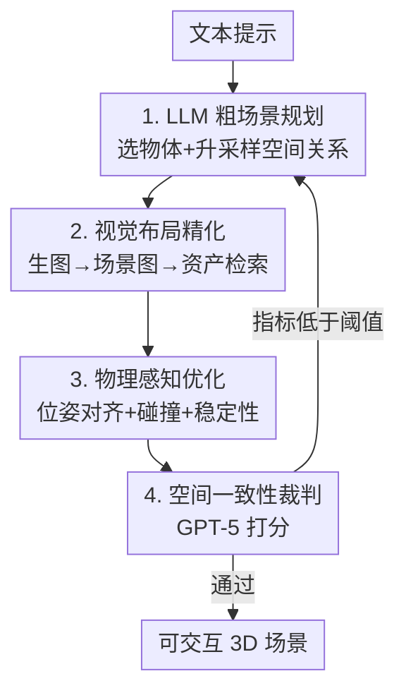

# Scenethesis: A Language and Vision Agentic Framework for 3D Scene Generation

**会议**: ICLR 2026  
**OpenReview**: [https://openreview.net/forum?id=SzhezVoaNB](https://openreview.net/forum?id=SzhezVoaNB)  
**论文**: [NVIDIA Research 项目页](https://research.nvidia.com/labs/dir/scenethesis/)  
**代码**: 待发布（论文承诺 release）  
**领域**: 3D视觉  
**关键词**: 文本到3D场景、Agent框架、物理合理性、布局优化、视觉基础模型

## 一句话总结
Scenethesis 是一个免训练的智能体框架，用 LLM 起草粗布局、视觉基础模型做视觉接地与场景图提取、物理感知优化器（语义对应 + SDF 接触/支撑约束）逐物体校正位姿，再用 GPT-5 裁判验证空间一致性并触发重规划，从而生成室内外通吃、碰撞少、稳定性高的可交互 3D 场景。

## 研究背景与动机

**领域现状**：从文本生成可交互 3D 场景是游戏、虚拟内容创作和具身智能的关键能力。它不只是合成单个资产，更要求"空间智能"——理解支撑、遮挡、可供性（affordance），让物体在可编辑、物理一致的环境里各司其职。目前主流路线有两类：一类是基于学习的布局生成/多实例场景生成（在 3D-FRONT 这类 CAD 数据集上训练），另一类是用 LLM/VLM 做布局规划。

**现有痛点**：两条路线各有硬伤。学习型方法继承了室内数据集的偏置——数据几乎全是室内、偏向大件家具、小物体和长尾关系（on-top-of / inside / behind）严重欠采样，甚至训练数据本身就带碰撞；因此它们过拟合到分布内布局，一到室外场景、稀有支撑关系、小物体就泛化崩盘。LLM 规划器虽然靠文本常识能提出多样化布局，但它在符号空间而非度量几何里操作，缺乏视觉接地，常常把家具摆反、违反支撑/间隙约束，产生悬空或穿模的摆放，尤其对小物体和被遮挡物体。

**核心矛盾**：**多样性与物理合理性之间存在结构性 trade-off**——学习型方法物理上还算可信但只会摆室内、不够多样；LLM 规划够多样但没有视觉/物理接地，摆出来的东西经常违反常识物理。两者都缺一个"既能开放式规划、又能把规划落到物理上站得住"的机制。

**本文目标**：在不训练任何新的场景级生成器的前提下，同时拿到 LLM 的开放式多样性 + 视觉基础模型的空间接地 + 物理感知的无碰撞稳定摆放，并能室内外通用。

**切入角度**：作者注意到，视觉基础模型（图像生成器、分割、深度估计）在大规模训练中已经编码了紧凑的真实世界空间先验——常见的物体共现与排布。与其训练一个新生成器，不如把 LLM 的粗规划"接地"到这些视觉先验上，再用一个物理优化回路把摆放推到无碰撞、可支撑的状态。

**核心 idea**：把"语言规划 + 视觉接地 + 物理优化 + 裁判修复"串成一个免训练的智能体流水线，让物理约束在布局形成过程中就塑造布局，而不是事后打补丁。

## 方法详解

### 整体框架
Scenethesis 输入一句文本提示（如"日落时分宁静的海滩"），输出一个物体可逐件编辑、物理上站得住的可交互 3D 场景。整条流水线由四个串行的智能体模块组成，并带一个"裁判→重规划"的反馈回环：① LLM 模块把提示推理成一份粗场景规划（选物体 + 升采样出带空间关系的描述）；② 视觉模块把这份规划落地成图像，再分割/估深度/建场景图，并检索可编辑的 3D 资产；③ 物理感知优化模块以场景图层级（锚点→父→子）迭代校正每个物体的 5-DoF 位姿，先用语义对应做位姿对齐，再用 SDF 加碰撞与稳定性约束；④ 裁判模块用 GPT-5 比对生成场景与引导图像，若任一空间一致性指标低于阈值就触发重规划。

### 关键设计

**1. LLM 粗场景规划：用语言常识起草锚点层级布局，但只当草稿**

针对"学习型方法不够多样"的痛点，Scenethesis 先让 LLM 发挥它的开放式常识。给一句简单提示时，LLM 先解读提示、遍历 3D 数据库里的所有物体类别、挑出常见关联物体，再生成一段"升采样提示"（upsampled prompt）描述粗略空间关系；给详细提示时则跳过升采样、直接核对数据库里有没有指定物体。关键在于它**只输出粗草稿**：沿用 Holodeck 的做法，LLM 选一个锚点物体（地面之上的层级顶端，如客厅里的沙发），再把其他物体相对锚点排成一个粗空间层级（书架贴墙在背景、咖啡桌和椅子在沙发前/旁）。这个层级关系被折叠进升采样提示，交给下游做视觉接地——作者刻意不让 LLM 直接定最终坐标，因为符号空间的规划本就不可靠，它的价值只在"有哪些物体、大致怎么放"。

**2. 视觉布局精化：用图像生成器的空间先验把草稿接地成场景图**

LLM 草稿没有视觉接地，于是这一步借图像生成器隐含的空间先验把它落地，分三步走。**图像引导**：把升采样提示生成一张视觉接地的图像，作为后续分割、深度、检索的依据。**场景图生成**：用 VFM/VLM（GPT-5、Grounded-SAM、DepthPro）对这张图分割物体、估深度和 3D 包围盒（3DBB），构建一张编码物体间关系的场景图，识别出锚点/父/子结构；通过分割每个物体、用单目深度抬升、反投影到稀疏 3D 点云，初始化每个物体的 5-DoF 位姿（尺度、朝向、平移）。由于遮挡、视角受限、分割噪声会带偏 3DBB，这些位姿只是粗值，留给下一步优化。**资产检索**：不直接用 3DGS 这类生成/重建管线（虽逼真但常有几何瑕疵、缺流形网格/UV/可分解 PBR，难以下游编辑），而是从精选的高质量 Objaverse 子集里按类别/属性检索可编辑资产，并配一张环境贴图来提供墙面/背景元素。场景图既是关系载体，也是下一步迭代调位姿的骨架。

**3. 物理感知优化：语义对应做位姿对齐 + SDF 约束做碰撞/稳定**

直接把资产摆到图像估计的 3DBB 上会有两个硬问题：遮挡导致点云不全、污染朝向/尺度/位置；检索资产和引导图像形状纹理不一致也妨碍精确估姿。这一步用一个迭代优化回路解决，按场景图层级（先锚点立稳地基，再父、再子）逐物体处理，且因检索资产本就竖直，旋转只约束到方位角。**位姿对齐**用 RoMa 提取两图间稠密、语义感知、对部分视图鲁棒的对应点 $\{p(x,y),\tilde p(x,y)\}_i^m = \mathrm{RoMa}(o_i,\tilde o_i)$，再最小化 2D 重投影 + 3D 一致性的加权和，反传梯度细化尺度、平移、竖直朝向。**物理合理性**不再用 3DBB 这种粗代理（它无法表达 containment/under 关系，还会让物体因包围盒假碰撞而无法放进格子里），而是在网格表面采点做精确碰撞测试和 SDF 接触/支撑推理。碰撞约束查询场景 SDF：位置碰撞损失把物体沿"碰撞点指向质心"的方向 $u_i$ 推开

$$L_{translation} = \sum_{v_i \in V^-} \| f(T, |d_i|, u_i) - T \|_2^2, \quad f(T,|d_i|,u_i) = T + u_i \cdot |d_i|$$

其中 $d_i$ 是负 SDF 值（穿模深度）；当出现多个独立碰撞簇（$N_{cluster}>1$，即从两侧被挤）时再启用尺度损失 $L_{scale}$ 把物体缩小。稳定性约束则要求物体底面采样点与父表面接触、SDF 值趋零：

$$L_{stability} = \sum_{v_i \in V_B} \left(1 - e^{-d_i^2}\right)$$

这样碰撞和重力稳定都在优化回路内被强制，而不是事后做物理修正补丁，物理直接塑造布局成型的过程。

**4. 空间一致性裁判：GPT-5 验证并触发定向重规划**

前三步走完未必一定对，于是加一个 GPT-5 裁判把场景生成变成闭环。位姿优化后，裁判比对生成的 3D 场景、引导图像和规划物体，从三个归一化到 $[0,1]$ 的指标验证关系：物体类别准确度（生成场景 vs 图像引导）、物体朝向对齐度（朝向是否匹配参考布局）、整体空间一致性（布局的全局自洽）。只要任一指标低于预设阈值，裁判就触发重规划，让流水线回到 LLM 模块重来。正是这个"判断—修复"机制，把一次性前馈生成升级成可自我纠错的智能体回路。

### 一个完整示例
以"日落时分宁静的海滩"为例走一遍：LLM 模块先推理出常见物体（沙滩巾、沙滩椅、遮阳伞、排球、贝壳……），升采样成"贝壳放在沙滩巾上、沙滩椅在……前面"这样的关系描述。视觉模块据此生成一张海滩图，用 GPT-5 + Grounded-SAM + DepthPro 分割出 chair1/chair2、ball1、bucket1-3、umbrella1、sunglass1/2、seashell、ground 等节点，建出带父子关系的场景图，并从 Objaverse 检索对应资产 + 环境贴图。物理优化先把 ground/锚点立稳，再逐个用 RoMa 对应把椅子、伞的 5-DoF 位姿对齐到引导图，用 SDF 碰撞损失把相互穿插的桶推开、把过大的物体缩小，用稳定性损失让贝壳真正贴在沙滩巾表面而非悬空。最后 GPT-5 裁判检查"贝壳是否在沙滩巾上、椅子朝向是否合理、整体是否像海滩"，若某项不达标就回到 LLM 重新规划。

### 损失函数 / 训练策略
全流程免训练，无需训练任何场景级生成器。优化阶段在 PyTorch / PyTorch3D 上实现，单卡 A100(40G) 即可运行。优化目标即上面三项：位姿对齐（2D 重投影 + 3D 一致性）、碰撞损失 $L_{translation}$/$L_{scale}$、稳定性损失 $L_{stability}$，按场景图层级（锚点→父→子）迭代，旋转限于方位角。

## 实验关键数据

评测在 34 条提示（22 室内 + 12 室外）上进行，涵盖来自 DL3DV-10K 的 8 大类 16 小类场景，每个场景从两个标准视角渲染（共 68 张图）以缓解视角偏置。基线限定为有公开代码的可交互场景生成方法，所有 text-to-3D 基线用同一版 GPT 以求公平。

### 主实验
文本-图像对齐 + 空间质量偏好（GPT-5 / 人类对 Ours 相对各基线的偏好率，越高越好）：

| 方法 | CLIP↑ | BLIP↑ | VQA↑ | 备注 |
|------|------|------|------|------|
| DiffuScene | 23.11 | 48.28 | 0.7832 | 3D-FRONT 训练 |
| SceneTeller | 25.27 | 51.99 | 0.7999 | LLM 规划 |
| Holodeck | 28.32 | 46.25 | 0.6815 | LLM 规划 |
| LayoutGPT | 23.01 | 46.35 | 0.8052 | LLM 规划 |
| IDesign | 28.19 | 44.76 | 0.7095 | VLM 规划 |
| **Ours** | **30.71** | **77.17** | **0.8269** | 免训练 |

Scenethesis 在 CLIP/BLIP/VQA 三项全部最高，BLIP（77.17 vs 次高 51.99）领先尤为悬殊，说明其文本依从性和流水线可靠性都更强。

物理合理性 + 可交互性（室内）：

| 方法 | Col-O↓ | Col-S↓ | Inst-O↓ | Inst-S↓ | Reach↑ | Walk↑ |
|------|------|------|------|------|------|------|
| Holodeck | 6.1% | 21% | 7.00% | 31.58% | 0.90 | 0.96 |
| IDesign | 6.51% | 65% | 8.3% | 68.88% | 0.88 | 0.80 |
| LayoutVLM | 12.2% | 57.1% | 20.3% | 71.4% | 0.90 | 0.71 |
| **Ours** | **0.8%** | **6%** | **3.20%** | **16.67%** | **0.94** | **0.96** |

物体碰撞率从次优的 6.1% 压到 0.8%、场景碰撞率从 21% 压到 6%、场景不稳定率从 31.58% 压到 16.67%，可达性/可行走性也最高，说明 SDF 回路内约束确实把布局推向了无碰撞、可支撑、可交互的配置。室外场景（表 3，仅报 Ours）Col-O 0.06%、Inst-O 0.12%，与室内相当，说明非平面地形下方法依然鲁棒。

### 消融实验
物理感知优化的三个组件逐步叠加：

| 配置 | Pose Align.↑ | Collision↓ | Instability↓ | 说明 |
|------|------|------|------|------|
| Raw layout | 0.536 | 22.7% | 87.3% | 直接摆在 3DBB 上 |
| +Pose Alignment | 0.732 | 10.6% | 74.2% | 加语义对应对齐位姿 |
| +Collision | 0.755 | 3.6% | 69.8% | 加碰撞约束 |
| +Stability | **0.836** | **0.8%** | **3.2%** | 完整系统 |

### 关键发现
- **位姿对齐主管"对齐度"，稳定性约束主管"稳定度"**：加 Pose Alignment 把对齐分从 0.536 拉到 0.732（最大单步提升），而 Instability 真正暴跌（74.2%→3.2%）发生在加 Stability 的最后一步，说明三个组件各司其职、缺一不可。
- **碰撞约束是碰撞率的主力**：Collision 一上，碰撞从 10.6% 降到 3.6%，是降碰撞贡献最大的单步。
- **SDF 网格级几何 vs 3DBB 代理**：相比用 3DBB 近似的基线（无法表达 inside/under、会假碰撞），网格表面采点 + SDF 让小物体能精确放进货架格子（图 6 对比 Holodeck 只能摆在顶上），这是物理指标领先的根因。

## 亮点与洞察
- **免训练却打过训练型**：在残居室内场景上，免训练的 Scenethesis 在布局真实感上能匹敌甚至超过 3D-FRONT 上训练的 DiffuScene/SceneTeller/LayoutGPT，说明"视觉基础模型先验 + 物理优化"可以替代专门训练的场景生成器。
- **物理在回路内塑造布局，而非事后打补丁**：相比 CAST 那种 post-hoc 物理修正，Scenethesis 把 SDF 接触/支撑约束塞进位姿对齐回路，让物理在布局成型时就起作用——这个"in-loop vs post-hoc"的区别是它碰撞率碾压基线的关键。
- **裁判-重规划闭环可迁移**：用一个强 VLM 当裁判、设阈值触发重规划，把一次性前馈管线升级成自纠错智能体，这套思路可迁移到任何"生成质量不稳定、需要验证回退"的多模块流水线。
- **SDF 表面几何取代 3DBB**：把碰撞/支撑推理从包围盒粒度下沉到网格表面采点，直接解锁了小物体放进容器、按支撑层级精确定位这类长尾能力。

## 局限与展望
- 作者承认：方法受限于**检索数据库**，因为生成式 3D 目前还处理不了关节物体（articulation），场景多样性被资产库框住。未来若生成式 3D 能合成关节物体，可突破这一限制。
- 自己发现：评测重度依赖 **GPT-5 既当生成器又当裁判又当评估器**，可能存在自评偏置；偏好类指标（Object Diversity / Layout Coherence 等）是相对偏好率而非绝对量，跨方法绝对可比性有限。
- 流水线含 LLM 规划 + 图像生成 + VFM 分割 + 迭代优化 + VLM 裁判多次大模型调用，单场景成本和延迟应不低（论文未给端到端耗时），对规模化生成是潜在瓶颈。
- 改进思路：把裁判信号反传成更细粒度的定向修复（只重规划失败子区域而非整场重来），或引入轻量可学习的位姿初始化降低对优化迭代的依赖。

## 相关工作与启发
- **vs 学习型布局生成（DiffuScene / LayoutGPT / I-Scene 等）**：它们在 3D-FRONT 上训练、继承室内偏置、室外和长尾关系泛化弱；Scenethesis 免训练、靠视觉先验 + 物理优化做到室内外通用、长尾关系丰富，但代价是多次大模型调用。
- **vs LLM/VLM 规划（Holodeck / IDesign / LayoutVLM）**：它们在符号空间规划、缺视觉接地，常摆反家具、悬空穿模；Scenethesis 只用 LLM 出粗草稿，再用 VFM 把它接地到度量几何，并用 SDF 把物理摁进回路。
- **vs CAST（post-hoc 物理修正）**：CAST 是事后做穿模/悬空校正；Scenethesis 把接触/支撑约束放进位姿对齐回路内，物理在布局成型时就生效，碰撞率显著更低。
- **vs 单一全局表示（NeRF/3DGS 管线）**：那类方法逼真但缺实例结构、难逐物体编辑/交互；Scenethesis 走"感知→逐物体检索→几何拟合"路线，输出可编辑、可交互的实例化场景。

## 评分
- 新颖性: ⭐⭐⭐⭐ 把 LLM 规划 + VFM 接地 + in-loop SDF 物理 + VLM 裁判组合成免训练智能体，单点不算全新但系统组合与"物理在回路内"的定位很有说服力。
- 实验充分度: ⭐⭐⭐⭐ 室内外 + 多类指标（对齐/物理/可交互）+ 组件消融齐全，碰撞率领先显著；但偏好指标依赖 GPT-5 自评、缺端到端耗时。
- 写作质量: ⭐⭐⭐⭐ 动机—矛盾—方法逻辑清晰，四模块流水线和物理约束公式交代到位，配图直观。
- 价值: ⭐⭐⭐⭐⭐ 直接服务虚拟内容创作、仿真、具身 AI，免训练 + 室内外通用 + 可编辑可交互输出，实用性强。

<!-- RELATED:START -->

## 相关论文

- [\[ICLR 2026\] PAT3D: Physics-Augmented Text-to-3D Scene Generation](pat3d_physics-augmented_text-to-3d_scene_generation.md)
- [\[CVPR 2026\] SAGE: Scalable Agentic 3D Scene Generation for Embodied AI](../../CVPR2026/3d_vision/sage_scalable_agentic_3d_scene_generation_for_embodied_ai.md)
- [\[ICLR 2026\] OpenFly: A Comprehensive Platform for Aerial Vision-Language Navigation](openfly_a_comprehensive_platform_for_aerial_vision-language_navigation.md)
- [\[ICLR 2026\] DepthLM: Metric Depth from Vision Language Models](depthlm_metric_depth_from_vision_language_models.md)
- [\[ICLR 2026\] EgoNight: Towards Egocentric Vision Understanding at Night with a Challenging Benchmark](egonight_towards_egocentric_vision_understanding_at_night_with_a_challenging_ben.md)

<!-- RELATED:END -->
