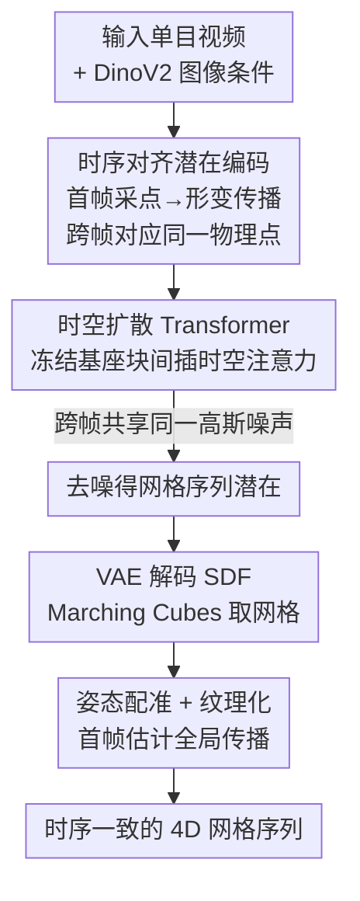

# ShapeGen4D: Towards High Quality 4D Shape Generation from Videos

**会议**: ICLR 2026  
**OpenReview**: [https://openreview.net/forum?id=r9AJisFLLo](https://openreview.net/forum?id=r9AJisFLLo)  
**项目页**: [https://shapegen4d.github.io/](https://shapegen4d.github.io/)  
**领域**: 3D视觉  
**关键词**: 4D形状生成, 视频条件生成, 潜在扩散Transformer, 时序一致性, 网格序列

## 一句话总结
ShapeGen4D 把一个大规模预训练的 3D 形状扩散模型直接改造成「视频→4D 网格序列」的前馈生成器，通过时序对齐的潜在编码、时空注意力和跨帧共享噪声三招，端到端生成几何一致、能处理拓扑变化与体积涨缩的动态网格序列，几何精度全面超过 L4GM、V2M4、GVFD 等基线。

## 研究背景与动机
**领域现状**：视频条件下的 4D 形状生成希望从一段单目视频里恢复出随时间变化的 3D 几何与外观。早期主流是基于 score distillation sampling（SDS）逐场景优化 4D 表示，后来演进出「先用图像/视频扩散生成多视角视频、再前馈重建几何」的两阶段管线。最近受大规模 3D 潜在扩散 Transformer（如 Hunyuan3D、TRELLIS、Step1X-3D）成功的启发，开始有人尝试把预训练 3D 生成模型迁移到 4D。

**现有痛点**：SDS 方法脆弱且计算昂贵；两阶段方法受限于多视角生成阶段累积的不一致误差，重建质量和效率都不理想。两个直接利用预训练 3D 模型的并发工作也各有硬伤——V2M4 对视频每一帧独立跑一次 3D 生成模型，再靠复杂且脆弱的网格配准与几何优化去缝合时序，几何、运动、纹理处处冒 artifact；GVFD 先用 Trellis 生成第一帧，再训一个模型去形变这个初始几何，但它的几何和纹理**只看第一帧**、忽略后续帧暴露的新信息，又因依赖稀缺的 4D 训练数据，只能处理刚性或近等距形变，处理不了拓扑变化和大幅体积涨缩。

**核心矛盾**：4D 训练数据极度稀缺，而 3D 数据丰富得多。想要泛化，就必须最大化复用预训练 3D 生成模型学到的几何先验；但 3D 模型天生是「单图→单形状」、对时序一无所知，直接逐帧用又会抖动、漂移、姿态乱跳。如何在**不引入新模态、不逐帧优化**的前提下，让一个 3D 生成器吐出时序一致的网格序列，是核心难题。

**本文目标**：构建第一个直接生成动态 3D 网格的视频→4D 前馈框架，要求能容纳拓扑变化、放宽对动画类型的约束，同时继承预训练 3D 模型的泛化能力。

**切入角度**：作者的关键观察是——「生成一串 3D 网格」本身就是基座 3D 模型已经会的能力，不必像 GVFD 那样新造「高斯粒子形变偏移」这种模型没学过的模态。只要把 3D 生成器**微调**（而非当黑盒外挂一个网络或外接优化）去同时处理整段视频、并显式解决时序一致性，就能把丰富的 3D 知识迁移过来。

**核心 idea**：在预训练 3D 形状扩散 Transformer 里插入时空注意力，配合时序对齐的 VAE 潜在编码和跨帧共享噪声，端到端把视频映射成时序一致的 SDF 网格序列。

## 方法详解

### 整体框架
ShapeGen4D 是一个基于 flow 的潜在扩散模型，输入单目视频，输出一串随时间变化、捕捉物体非刚性运动的网格序列。它建立在 Step1X-3D / Hunyuan3D 这类「3DShape2VectSet 风格」的 3D 生成模型之上，整体分两大块协同：（a）一个**时序对齐的动态 VAE**，把每一帧网格编码成一组潜在码，再解码成截断符号距离场（SDF），关键是让不同帧的潜在码对应到形变表面上「同一个物理点」，从而天然时序对齐；（b）一个**时空扩散 Transformer**，在冻结的基座 3D 双流/单流 Transformer block 之间交错插入可学习的时空注意力层，让每帧潜在在去噪时互相「看见」彼此，强制跨帧一致。生成出网格序列后，再用一个轻量的两阶段后处理（全局姿态配准 + 全局纹理化）把它对齐到输入视频并贴上一致纹理，做成可驱动资产。

### 关键设计

**1. 时序对齐潜在编码：让每帧潜在落在形变表面的同一物理点上**

直接对网格序列 $\{M_1,...,M_T\}$ 逐帧独立编码会产生时序抖动的潜在码。原因在于：VAE 编码器要把无序点云压成定长表示，做法是用稀疏 query 点集 $Q=\mathrm{FPS}(P)$（最远点采样）去 cross-attend 稠密点云 $P$；但如果每帧的 $Q_t$ 都独立从 $P_t$ 采样，跨帧的 query 点位置就对不上，导致潜在码在时间轴上乱跳，扩散模型很难学到平滑的时序动态。本文的做法是给 query 集引入时序结构：只在第一帧采 $Q_1$，后续帧通过动画形变把它「跟着拉过去」，即 $Q_t = w_t(Q_1)$，其中 $w_t$ 是第 $t$ 帧的形变。这样每条潜在序列都对应形变表面上的**同一个物理点**，抖动大幅下降。实现上有个细节：query 点直接从定义了动画的**原始非水密网格**采样（而不是后处理过的水密网格），否则建立跨帧对应又要回头做昂贵的网格配准。消融显示这是几何质量与减抖的核心来源。

**2. 时空注意力层：把冻结的 3D Transformer 升级成能跨帧通信**

基座的 rectified-flow 扩散 Transformer 原本是「单图→单 3D 潜在」，每个 block 只在单帧内联合处理图像特征和噪声形状潜在，彼此完全独立。为了引入时序依赖，本文在预训练模型每个 block 之后**插入一层时空 Transformer**：它复用基座单流 block 的结构，但 self-attention 是跨所有帧、对形状潜在与图像隐状态联合做注意力，从而捕捉跨帧依赖、把去噪后的潜在拉成时序一致。帧索引用 1D RoPE 嵌入。训练时**只更新这些新插入的时空层、冻结基座**，以免在稀缺 4D 数据上灾难性遗忘掉宝贵的 3D 先验；每个时空层的输出投影做**零初始化**，保证训练初期等价于原 3D 模型、稳定收敛。作者还试过两个变体：只对形状潜在做注意力、以及排除同帧交互的纯 1D 时序注意力——都让质量变差，说明同帧内注意力对「让缺少显式坐标的潜在推断出自己的空间位置」是必需的。

**3. 跨帧共享噪声：消除因噪声差异导致的姿态闪烁**

扩散模型里加性高斯噪声本来是逐帧独立采样的，但在本任务里独立噪声会引起运动不稳。作者诊断出根因：基座 3D 模型当初训练时**不关心视角**，生成的形状朝向是任意的；于是不同帧的不同噪声样本会把模型推向不同的姿态和尺度，造成帧间可见的闪烁。图像/视频扩散模型之所以能用逐帧独立噪声而不崩，是因为它们工作在带显式位置嵌入的规则网格上；而 3DShape2VectSet 风格模型在无显式位置的不规则结构上，必须隐式推断位置，对噪声变化更敏感。解决办法极简：训练和推理时**让所有帧复制同一份噪声**。这一招甚至在额外训练之前就能显著提升时序平滑度，让形状更一致对齐，并在旗帜飘动这类困难案例上改善几何。

### 损失函数 / 训练策略
模型基于 rectified-flow（速度预测）训练。数据上从 Objaverse 精选 14k 高质量带动画 3D 资产，转水密网格、去掉根运动、归一化到单位包围盒。扩散模型生成 16 帧、每帧 1024 个潜在；编码器每帧输入 32k 点云（水密网格采样）配 1024 个来自非水密动画网格的 query 点。在 16 张 A100 上以 batch 64、学习率 $5\times10^{-5}$ 训练 25k 步（约 2 天）。推理去噪时还引入 **time shift**：因为 4D 设定下潜在更多、又有共享噪声，相同噪声水平下预测难度其实变低了，于是把去噪调度往中高噪声段多分配步数（类比多分辨率图像扩散的做法），显著提升结果稳定性——注意 time shift 只在去噪推理时有用，放进训练里几乎无影响。

## 实验关键数据

### 主实验
在 Objaverse 留出测试集（33 个带显著运动的样本）上评几何精度。ShapeGen4D 在 Chamfer / IoU / F-Score 三项上全面领先，且 Hunyuan3D-2.1 基座版本进一步大幅拉开差距。

| 方法 | 表示 | 前馈 | Chamfer↓ | IoU↑ | F-Score↑ | 耗时↓ |
|------|------|------|---------|------|---------|------|
| Step1X-3D（逐帧） | SDF | ✓ | 0.1356 | 0.3033 | 0.2617 | 3 min |
| L4GM | MV-3D GS | ✓ | 0.1576 | – | 0.1932 | 25 sec |
| V2M4 | mesh+deform | ✗ | 0.1233 | 0.3023 | 0.2814 | 30 min |
| GVFD | 3D GS+deform | ✓ | 0.3978 | – | 0.0699 | 10 min |
| **ShapeGen4D (Step1X-3D)** | SDF | ✓ | 0.1220 | 0.3276 | 0.2934 | 3 min |
| **ShapeGen4D (Hunyuan3D-2.1)** | SDF | ✓ | **0.0827** | **0.4155** | **0.3971** | 15 min |

渲染质量在 Consistent4D（20 段视频）上评。值得注意的是 L4GM 各项渲染指标反而最高，但作者指出这是因为 L4GM 的预测**天生对齐输入视角**（强烈偏向重建输入视图），而 Step1X-3D / GVFD / 本文都不对齐、要在「重建输入视图」与「生成在其他视角也合理的 4D 形状」之间权衡——所以这个比较对非对齐方法不公平，几何质量上 L4GM 实际更差。

| 方法 | 对齐 | LPIPS↓ | CLIP↑ | FVD↓ | DreamSim↓ |
|------|------|--------|-------|------|-----------|
| Step1X-3D | ✗ | 0.1524 | 0.9040 | 940 | 0.1106 |
| L4GM | ✓ | 0.0988 | 0.9397 | 302 | 0.0487 |
| GVFD | ✗ | 0.1691 | 0.8601 | 916 | 0.1467 |
| **Ours** | ✗ | 0.1359 | 0.9009 | 796 | 0.0966 |

### 消融实验
逐个移除组件（为省成本用 8 帧而非 16 帧）：

| 配置 | Chamfer↓ | IoU↑ | F-Score↑ | 说明 |
|------|---------|------|---------|------|
| w/o aligned latents | 0.1348 | 0.3230 | 0.3002 | 去时序对齐潜在，质量降、闪烁增 |
| w/o shared noise | 0.1186 | 0.3137 | 0.2962 | 去共享噪声，姿态抖动 |
| 1D temp. attn. | 0.2118 | 0.1503 | 0.1462 | 纯时序注意力，灾难性崩塌 |
| w/o image hidden states | 0.1196 | 0.3332 | 0.3084 | 时空注意力不看图像隐状态，掉点 |
| w/o time shift | 0.1374 | 0.3087 | 0.2861 | 去去噪 time shift，稳定性变差 |
| **Full method** | **0.1096** | **0.3346** | **0.3190** | 完整模型 |

### 关键发现
- **时序对齐潜在贡献最核心**：换成逐帧独立 query 点后，三项几何指标全面下滑且闪烁明显增多——这是「让扩散模型学到平滑时序」的根基。
- **同帧内注意力不可省**：纯 1D 时序注意力直接崩盘（Chamfer 0.21、IoU 暴跌到 0.15），印证了「缺显式位置嵌入的潜在必须靠同帧注意力推断自身空间位置」的假设。
- **共享噪声治姿态闪烁**：在 hippo（朝向乱跳）、flag（表面动态）等困难案例上，共享噪声甚至在训练前就能稳定姿态、改善几何。
- **time shift 只在推理端有效**：训练时加几乎无影响，去噪时加才显著提稳定性。

## 亮点与洞察
- **「不造新模态、复用基座已会的能力」是全文最优雅的设计哲学**：相比 GVFD 强行让模型学「高斯形变偏移」这种没在大规模数据上见过的新模态，本文坚持让 3D 模型继续吐它最擅长的网格序列，只在时序一致性上做文章，从而吃满 3D 先验——这是它泛化更好、能处理拓扑变化的根因。
- **对「3D 潜在为何对噪声敏感」的诊断很到位**：把「逐帧独立噪声→姿态闪烁」归因于基座模型视角无关 + 潜在缺显式位置嵌入，再用「共享噪声」一招化解，是一个从机制理解到简洁解法的漂亮闭环，且几乎零成本。
- **零初始化 + 冻结基座的迁移范式可复用**：在稀缺数据上把预训练大模型扩到新维度（时间）时，「只训新插层 + 输出投影零初始化 + 冻结主干」这套组合能直接搬到其他「3D→4D / 图像→视频」的扩展任务。

## 局限与展望
- **依赖后处理做对齐与纹理**：生成网格在规范坐标系下，需要借用 V2M4 的姿态配准把它 re-pose 到输入视频；纹理也要靠成对网格配准转成拓扑一致网格后从首帧传播——本身不是端到端出可驱动带纹理资产。
- **训练数据仍只有 14k 4D 资产**：虽靠 3D 先验缓解，但 4D 数据规模天花板仍在，复杂多物体、长序列、剧烈拓扑突变的覆盖度有待验证。
- **Hunyuan 版更准但更慢**（15 min vs Step1X 的 3 min），精度-效率仍需权衡；非对齐渲染指标在现有 benchmark 下对本方法天然吃亏，评测协议有改进空间。
- 生成固定 16 帧，更长视频如何分段拼接、跨段一致性如何保证，文中未深入。

## 相关工作与启发
- **vs GVFD**：GVFD 只用第一帧生成几何/纹理、再学形变场驱动高斯粒子，受限于稀缺 4D 数据只能做刚性/近等距形变，实验中泛化很差；本文直接生成网格序列、每帧都看视频信息，能处理拓扑变化与体积涨缩，泛化显著更强。
- **vs V2M4**：V2M4 逐帧独立跑 3D 生成模型 + 复杂脆弱的网格配准/几何优化来缝时序，非直接方法且易出 artifact；本文是端到端前馈、用时空注意力内生地保证一致性，只把配准/纹理留给轻量后处理。
- **vs L4GM**：L4GM 用非扩散骨干预测多视角高斯像素，受模型规模和图像表示所限几何弱、困难案例易错；本文继承大规模 3D 扩散先验，几何质量明显更高（L4GM 渲染指标占优只是因其预测天生对齐输入视角的评测偏置）。

## 评分
- 新颖性: ⭐⭐⭐⭐⭐ 首个直接生成动态网格的视频→4D 前馈框架，「复用基座能力 + 三招治时序」的路线清晰且有洞察
- 实验充分度: ⭐⭐⭐⭐ 几何/渲染双 benchmark + 完整消融，但 4D 测试集规模偏小、长序列与多物体覆盖有限
- 写作质量: ⭐⭐⭐⭐⭐ 动机推导和机制诊断（噪声敏感性、对齐潜在）讲得透彻，图示清晰
- 价值: ⭐⭐⭐⭐⭐ 给「把预训练 3D 大模型扩到 4D」提供了可复用的迁移范式，工程与思想价值兼具

<!-- RELATED:START -->

## 相关论文

- [\[ICLR 2026\] Ctrl&Shift: High-Quality Geometry-Aware Object Manipulation in Visual Generation](ctrlshift_high-quality_geometry-aware_object_manipulation_in_visual_generation.md)
- [\[AAAI 2026\] 4DSTR: Advancing Generative 4D Gaussians with Spatial-Temporal Rectification for High-Quality and Consistent 4D Generation](../../AAAI2026/3d_vision/4dstr_advancing_generative_4d_gaussians_with_spatial-tempora.md)
- [\[ICLR 2026\] Mono4DGS-HDR: High Dynamic Range 4D Gaussian Splatting from Alternating-exposure Monocular Videos](mono4dgs-hdr_high_dynamic_range_4d_gaussian_splatting_from_alternating-exposure_.md)
- [\[ICLR 2026\] Mango-GS: Enhancing Spatio-Temporal Consistency in Dynamic Scenes Reconstruction using Multi-Frame Node-Guided 4D Gaussian Splatting](mango-gs_enhancing_spatio-temporal_consistency_in_dynamic_scenes_reconstruction_.md)
- [\[CVPR 2026\] Sculpt4D: Generating 4D Shapes via Sparse-Attention Diffusion Transformers](../../CVPR2026/3d_vision/sculpt4d_generating_4d_shapes_via_sparse-attention_diffusion_transformers.md)

<!-- RELATED:END -->
