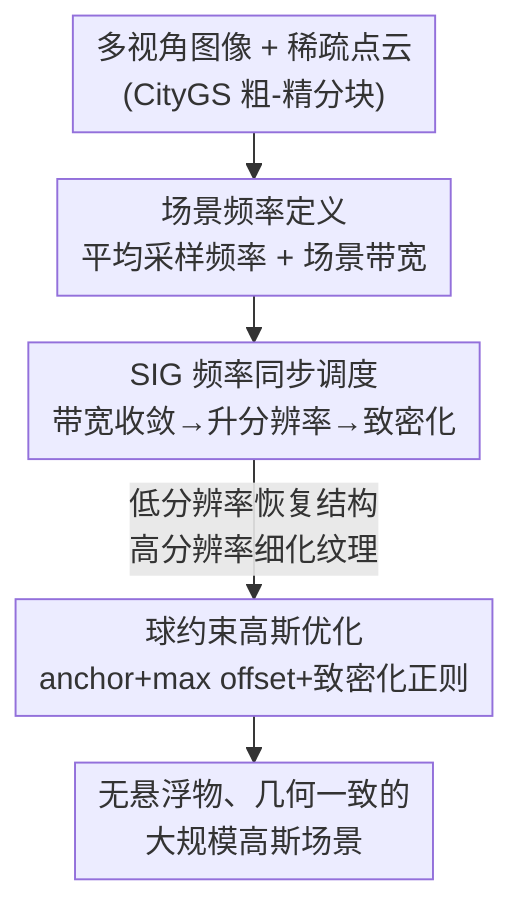

# Signal Structure-Aware Gaussian Splatting for Large-Scale Scene Reconstruction

**会议**: ICLR 2026  
**OpenReview**: [https://openreview.net/forum?id=DavFcTeTbK](https://openreview.net/forum?id=DavFcTeTbK)  
**领域**: 3D视觉  
**关键词**: 3D高斯泼溅, 大规模场景重建, 频率对齐, 自适应调度, 几何先验

## 一句话总结
本文把大规模 3DGS 场景重建重新看作"信号结构恢复"问题，推导出 3D 高斯表示的平均采样频率与场景带宽，提出按场景频率收敛自适应切换图像分辨率与致密化时机的调度器 SIG，再配合球约束高斯抑制悬浮物，最终在多个大规模基准上取得 +0.9 dB PSNR 提升并把单块训练加速约 1.5×。

## 研究背景与动机

**领域现状**：3D Gaussian Splatting（3DGS）用一堆显式高斯基元建模场景，渲染又快又逼真，已成为新视角合成（NVS）的主流方案。面对城市级大场景，主流做法是"分而治之"——把场景切成多个 block 并行训练（如 CityGS、VastGS、BlockGS）。

**现有痛点**：大场景里不可避免会有"稀疏观测区"，这些区域 COLMAP 初始化出的点云极其稀疏、频率很低。用高频图像去监督这些"低频初始化"的高斯，会诱发**不受控的致密化**：过大的梯度让高斯过早地在细纹理上疯狂分裂，反而忽略了底层几何结构，结果产生大量冗余基元和悬浮物（floaters），既慢又糊。

**核心矛盾**：渲染分辨率和致密化策略**不是正交的两件事**，但现有调度策略要么只调分辨率（DashGS 按迭代非线性涨分辨率）、要么只调致密化（TamingGS 预设致密化时刻），而且全是**训练前写死的硬编码调度（hard-coded scheduling）**——它们感知不到场景频率到底收敛到哪一步了。过早上高分辨率会破坏早期优化，过晚又拖慢收敛、浪费算力。

**本文目标**：在一个统一框架里同时回答"何时该升分辨率、何时该致密化"，并约束高斯不要乱跑到错误位置。

**切入角度**：把重建看成"从离散采样图像里恢复连续 3D 信号"。借奈奎斯特采样定理——采样频率 $f$ 只能恢复 $[0, f/2]$ 内的频率成分。那么理想的调度逻辑就是：**只有当前分辨率下场景带宽已经收敛（即榨干了当前采样频率能恢复的信息），才升到下一档分辨率**，让更高频图像去引导致密化补高频细节。要落地这个逻辑，关键是得能**量化计算 3D 高斯的采样频率和有效带宽**。

**核心 idea**：先数学推导 3D 高斯表示的平均频率，再用"场景频率收敛"信号自适应同步图像监督与高斯频率（SIG 调度器），并用球约束高斯把优化空间锁在初始几何先验附近。

## 方法详解

### 整体框架

整个方法建立在 CityGS 的粗-精分块训练之上（粗训练搭脚手架，精训练逐 block 细化），核心是给"精训练"换上一套**频率驱动的自适应调度 + 几何约束优化**。输入是多视角图像和稀疏点云，输出是无悬浮物、几何一致的高斯场景。整条链路分三步走：先把"采样频率"和"场景带宽"这两个抽象量定义清楚并验证其有效性（理论基础）；再用它们驱动 SIG 调度器，在带宽收敛时升分辨率、升完分辨率后做几轮致密化（自适应调度）；最后在优化阶段用球约束高斯把每个高斯锁在其几何先验球内，并辅以致密化正则。三步分别对应下面的三个关键设计。

### 关键设计

**1. 场景频率定义：把"采样频率"和"高斯带宽"算成可比的同一把尺子**

这是后面一切调度的地基。痛点是：没有量化指标就无法判断"何时该升分辨率"。作者从微分视角定义**平均采样频率**——焦距 $f$、采样深度 $d$ 下，一个屏幕空间单位间隔对应 3D 空间半径 $d/f$，故局部采样频率正比于 $f/d$；把图像降采样 $t$ 倍等价于 $f'=f/t$、采样频率 $v'=v/t$，于是分辨率直接决定采样频率。对全场景做加权积分得平均采样频率 $v=\sum_{i=1}^{n}\int_s w_i(s)\cdot\frac{f}{d_i(s)}\,ds$，其中 $w_i(s)$ 是局部 patch 对全场景的贡献权重、未观测处取 0。

另一边定义**场景信号带宽**：把场景不透明度场显式写成高斯加权和 $D(x)=\sum_i o_i G_i(x)$，按功率谱密度加权求平均频率 $\bar\omega=\frac{\int \omega|\hat D(\omega)|^2 d\omega}{\int|\hat D(\omega)|^2 d\omega}$。由于对上千万高斯做连续积分不现实，作者用高斯的半功率（3dB）带宽 $\omega_{3dB}=\sqrt{2a\ln 2}$ 近似每个基元的主能量频率，把功率谱近似成一串冲激，最终得到可直接计算的闭式 $\bar\omega=\frac{\sum_i o_i^2\det(\Sigma_i)\omega_{3dB_i}}{\sum_i o_i^2\det(\Sigma_i)}$。注意 1D 高斯有 $\omega_{3dB}\propto 1/\sigma$，所以用基元三轴尺度的均值 $\omega_{3dB_i}\propto\sum_{k=1}^3\frac{1}{3\sigma_k}$。作者还做了有效性验证：只有用三轴均值 $\sum\frac{1}{3\sigma_k}$ 定义的带宽才和采样频率（图像分辨率）严格正相关，而 $\max\frac1{\sigma_k}$、$\min\frac1{\sigma_k}$ 都不行——因为关注的是场景**平均**带宽而非孤立高/低频；且训练中该带宽随迭代稳步上升，印证它确实在逐步恢复更高频信号。

**2. SIG 调度器：让图像监督和高斯频率"同步"，把硬编码换成收敛感知**

针对"硬编码调度感知不到重建进度"的痛点，SIG（Synchronize Image supervision with Gaussian frequencies）由两个互相咬合的子调度器组成。**频率对齐分辨率调度器**：虽然奈奎斯特定理只在每个无穷小局部严格成立、全局平均不严格满足，但可以用"平均场景带宽是否稳定"来判断当前分辨率下是否收敛。具体每迭代用闭式算场景频率 $\omega_{iter}$ 并求梯度 $\frac{d\omega}{d\,iter}=\omega_i-\omega_{i-1}$，当 $\frac{d\omega}{d\,iter}<k\cdot\mathrm{mean}(\frac1d)$（$d$ 为初始点云最近邻距离，用来归一化尺度、消除点云无真实单位的问题；$k$ 对所有场景通用）即认为带宽已收敛、把训练图像升到下一档分辨率。这样就实现"低分辨率先恢复结构、高分辨率再细化纹理"的频率一致优化。

**致密化调度器**则和分辨率调度咬合：因为采样频率一升、就需要更多高斯来拟合更高频信号，所以每次升分辨率后才执行 $m$ 轮致密化。这避免了早期不受约束的过度致密化，也防止高斯数量爆炸拖慢训练。消融显示二者缺一不可——去掉 FARS 直接在最高分辨率上训会过度致密化（2.2M 点）、质量甚至不如 CityGS；只升分辨率却保留原致密化策略（w/o DS），一旦"到达最高分辨率"晚于"致密化终止"，后面就没机会再补高频了。

**3. 球约束高斯：用点云空间先验把高斯锁在结构里，顺带正则致密化**

针对"稀疏初始化导致优化空间过大、空间无关优化产生悬浮物"的痛点。Scaffold-GS 用神经 anchor 解码高斯能缓解，但共享 MLP 解码器使各 block 无法独立训练、不利于大场景扩展。本文改用**显式**约束：给每个高斯椭球配 anchor 和 max offset 两个属性，anchor 初始化为 COLMAP 初始点、offset 为 $x_{current}-x_{anchor}$，max offset 取每点 $K=15$ 个最近邻平均距离（考虑 COLMAP 可能不准但整体结构可靠，引入 $l>1$ 放宽剪枝）；当 offset 超过 $l\times$ max offset，这个跑出球约束的高斯就被剪掉。

配套的 **anchor 自适应控制**让新生高斯也继承几何约束：复制（replication）对应欠重建的低频区，需要大尺度位移，故新高斯不继承原 anchor、而把当前位置设为新 anchor，仅继承 max offset；分裂（splitting）对应补高频细节，继承原 anchor 保持结构对齐、并把 max offset 缩到 0.7× 鼓励保守更新。最后用**致密化正则** $L_{cons}$ 补 2D 监督的不足：从渲染深度提稠密点云、投影到相邻帧算重投影光度误差 $L_{cons}=\sum_{(i,j)}\|C_i\langle p\rangle-C_j\langle F_j(T_jT_i^{-1}F^{-1}(z,p))\rangle\|_2^2$，对大片无纹理区强制几何-颜色一致。作者发现它只适合在**致密化阶段**用——GS 深度估计并不精确、全程用反而无益，但作为致密化正则能有效压悬浮物。

### 损失函数 / 训练策略
- 在 3DGS 标准重建损失之外，致密化阶段加入重投影光度一致性正则 $L_{cons}$（Eq. 7）。
- 关键超参：分辨率调度阈值 $k=5\times10^{-5}$，$\frac{d\omega}{d\,iter}$ 每 100 迭代评估一次；球约束尺度因子 $l=15$、$K=15$；图像按 $n$（5→1）动态降采样。
- 粗、精两阶段各 30,000 迭代，全程 RTX 4090 训练。

## 实验关键数据

### 主实验
在 Mill19、UrbanScene3D、合成 MatrixCity 三个大规模数据集上评测（SSIM/PSNR/LPIPS，做了 color correction）。Ours-L / Ours-S 为通过致密化梯度阈值控制高斯数量得到的两个变体。

| 场景 | 指标 | Ours-L | CityGS | DashGS | 提升(vs CityGS) |
|------|------|--------|--------|--------|------|
| rubble | PSNR | **27.35** | 26.45 | 26.37 | +0.90 dB |
| rubble | SSIM | **0.843** | 0.809 | 0.802 | +0.034 |
| sci-art | PSNR | **25.94** | 24.49 | 24.10 | +1.45 dB |
| sci-art | SSIM | **0.890** | 0.843 | 0.833 | +0.047 |
| MatrixCity-Aerial | PSNR | **29.04** | 28.61 | 28.66 | +0.43 dB |

效率上（rubble 单 block 平均优化时间）：CityGS 98 min → 加本文 71 min（约 1.4×）；BlockGS 201 min → 130 min（约 1.5×）。本文作为即插即用组件能同时提升两条 baseline 的质量与速度。

### 消融实验
在 rubble 上逐模块消融（完整模型 1.5M 点、PSNR 27.35）：

| 配置 | PSNR | SSIM | LPIPS | 点数 | 说明 |
|------|------|------|-------|------|------|
| 完整模型 | 27.35 | 0.843 | 0.189 | 1.5M | 全部模块 |
| w/o FARS | 26.18 | 0.807 | 0.231 | 2.2M | 去频率对齐分辨率调度，过度致密化、质量最差 |
| w/o DS | 26.89 | 0.827 | 0.212 | 1.4M | 去致密化调度，升满分辨率后无法再补高频 |
| w/o SCG | 27.05 | 0.818 | 0.210 | 1.8M | 去球约束高斯，冗余/错误优化变多 |
| w/o DR | 27.01 | 0.820 | 0.209 | 1.9M | 去致密化正则，悬浮物增多 |

### 关键发现
- **FARS 贡献最大**：去掉它 PSNR 掉 1.17 dB、点数从 1.5M 涨到 2.2M，且质量反而不如 CityGS——印证"低频初始化被高频图像监督会过度致密化"正是大场景退化的根因。
- **分辨率与致密化必须咬合**：单独动分辨率（w/o DS）会出现"到达最高分辨率晚于致密化终止"的错配，后期再没机会补高频。
- **球约束 + 致密化正则共同压点数压悬浮物**：SCG/DR 把点数从 ~1.9M 降到 1.5M，说明它们确实减少了冗余和错误优化的高斯。
- DashGS 这类硬编码调度虽有小幅提升，但因偏重训练效率，大场景高频表达能力有限。

## 亮点与洞察
- **把"何时升分辨率/何时致密化"从超参变成可计算的收敛信号**：用 3D 高斯的 3dB 带宽近似导出闭式平均频率，让训练能"看着"场景带宽收敛来决策，这是从硬编码到收敛感知的范式转变。
- **统一视角的巧思**：作者点破"渲染分辨率"和"致密化策略"其实都是在调信号频率（采样频率 vs 目标信号频率），把两件看似无关的事收进同一个奈奎斯特框架，理论上很自洽。
- **显式球约束替代神经 anchor**：既拿到了 Scaffold-GS 几何先验的好处，又保住了 block 独立训练的可扩展性，这个"显式化"思路可迁移到其他需要分块并行的隐式约束方法。
- **即插即用**：SIG + 球约束能直接挂到 CityGS/BlockGS 上同时提质提速，工程价值高。

## 局限与展望
- 作者承认大场景通常需要 LoD（Level-of-Detail）渲染；本文粗-精训练天然产出粗/细两套高斯，提供了更内在的层级构建方式，但尚未把 LoD 做成完整方案，是明确的未来方向。
- 致密化正则 $L_{cons}$ 依赖 GS 渲染深度，而 GS 深度并不精确，所以只能限定在致密化阶段用、全程用反而无益——说明该几何约束的可靠性受限于深度质量。
- 平均带宽是全局量，对局部极端高/低频区域的调度可能不够精细；$k$ 虽称"对所有场景通用"，但其鲁棒性主要在所测数据集上验证。

## 相关工作与启发
- **vs DashGS**：都动分辨率，但 DashGS 按迭代非线性硬编码涨分辨率、偏重效率，本文按场景带宽收敛自适应升分辨率，能更好地在大场景里恢复高频。
- **vs TamingGS**：TamingGS 用预定义致密化时间表限制早期基元数量，属硬编码；本文的致密化调度与分辨率调度咬合、由频率收敛驱动。
- **vs Scaffold-GS / Octree-GS（Neural Gaussians）**：它们用共享 MLP 解码神经 anchor 引入几何先验，但共享解码器阻碍 block 独立训练；本文用显式球约束达到类似先验约束，且保留分块可扩展性。
- **vs CityGS / BlockGS（分块大场景方案）**：本文沿用其分块脚手架，但作为即插即用模块叠加，针对它们仍存在的冗余与悬浮物问题做频率一致 + 几何约束优化。

## 评分
- 新颖性: ⭐⭐⭐⭐⭐ 把 3DGS 调度问题重新formalize成信号结构恢复并导出可计算的高斯频率，视角新且自洽
- 实验充分度: ⭐⭐⭐⭐ 三数据集多 baseline + 充分消融 + 效率分析，唯频率定义的鲁棒性主要在所测集验证
- 写作质量: ⭐⭐⭐⭐ 理论推导清晰、动机层层递进，部分公式符号略密
- 价值: ⭐⭐⭐⭐⭐ 即插即用、同时提质提速，对大规模 3DGS 重建实用价值高

<!-- RELATED:START -->

## 相关论文

- [\[ICLR 2026\] SkyEvents: A Large-Scale Event-Enhanced UAV Dataset for Robust 3D Scene Reconstruction](skyevents_a_large-scale_event-enhanced_uav_dataset_for_robust_3d_scene_reconstru.md)
- [\[CVPR 2026\] AeroGS: Scale-Aware Gaussian Splatting for Pose-Free Dynamic UAV Scene Reconstruction](../../CVPR2026/3d_vision/aerogs_scale-aware_gaussian_splatting_for_pose-free_dynamic_uav_scene_reconstruc.md)
- [\[ICCV 2025\] OccluGaussian: Occlusion-Aware Gaussian Splatting for Large Scene Reconstruction and Rendering](../../ICCV2025/3d_vision/occlugaussian_occlusion-aware_gaussian_splatting_for_large_scene_reconstruction_.md)
- [\[ICLR 2026\] ODE-GS: Latent ODEs for Dynamic Scene Extrapolation with 3D Gaussian Splatting](ode-gs_latent_odes_for_dynamic_scene_extrapolation_with_3d_gaussian_splatting.md)
- [\[AAAI 2026\] OceanSplat: Object-aware Gaussian Splatting with Trinocular View Consistency for Underwater Scene Reconstruction](../../AAAI2026/3d_vision/oceansplat_object-aware_gaussian_splatting_with_trinocular_view_consistency_for_.md)

<!-- RELATED:END -->
