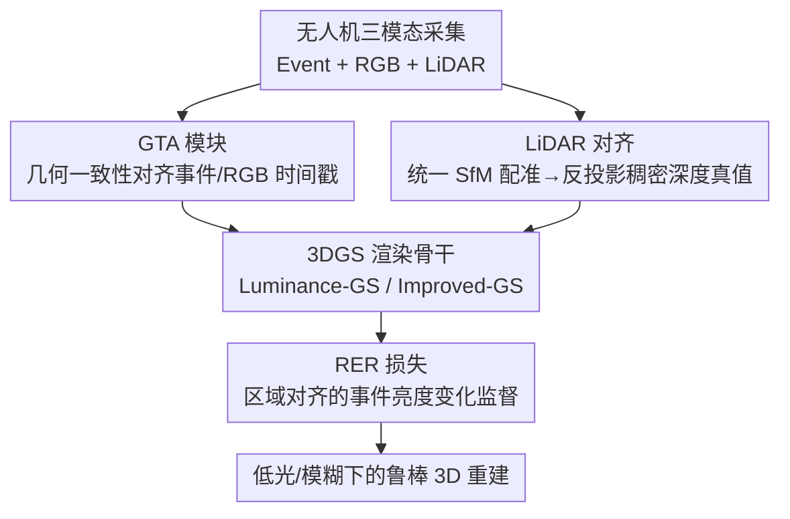

# SkyEvents: A Large-Scale Event-Enhanced UAV Dataset for Robust 3D Scene Reconstruction

**会议**: ICLR 2026  
**OpenReview**: [https://openreview.net/forum?id=dxHPqQindP](https://openreview.net/forum?id=dxHPqQindP)  
**代码**: https://github.com/Anthony-ECPKN/SkyEvent (有)  
**领域**: 3D视觉  
**关键词**: 事件相机, 无人机, 3D 场景重建, 多模态数据集, 3D Gaussian Splatting

## 一句话总结
本文构建了 SkyEvents——首个面向大规模无人机 3D 场景重建的「事件 + RGB + LiDAR」三模态数据集（45 段序列、>8 小时、0.72 km² 点云），并配套提出几何约束时间戳对齐（GTA）模块与区域级事件渲染（RER）损失，证明在低光、运动模糊等极端条件下引入事件模态能显著提升 3DGS 重建的纹理与几何保真度。

## 研究背景与动机
**领域现状**：用无人机做城市级 3D 重建（数字孪生、城市建模）现在主要依赖 NeRF / 3D Gaussian Splatting（3DGS）这类神经渲染技术，它们已经从小物体级别扩展到大场景。但这些方法本质上都吃普通 CMOS RGB 相机拍的多视角图。

**现有痛点**：无人机飞行时相机一直在动，长曝光会带来运动模糊，弱光/夜间环境下动态范围又不够，导致很多视角的 RGB 图要么糊要么欠曝。这直接拖垮了 3DGS 的重建质量——结构错乱、纹理丢失。事件相机（event camera）天生能治这个病：它异步记录像素亮度变化，微秒级时间分辨率 + 高动态范围，对运动模糊和弱光天然鲁棒。

**核心矛盾**：把事件相机引进无人机 3D 重建的思路早就有了，可真正能用的数据集没有。已有的航拍事件数据集（MVSEC、UZH-FPV、M3ED、NU-AIR、EvMAPPER）要么缺同步高分辨率 RGB，要么没有稠密深度与体素级几何真值，要么只做高空正射拼图（planar mosaic）——都满足不了「低空、城市级、需要 6-DoF 位姿 + 稠密深度监督」的体素重建要求。

**本文目标**：补上这个空白——造一个专为事件增强无人机 3D 重建设计的数据集，同时把「事件如何接进神经渲染」这件事打通：(1) 事件流与 RGB 流的时间戳怎么精确对齐；(2) 事件信号怎么变成监督渲染的损失。

**核心 idea**：用 DJI Matrice 350 RTK 同步采集事件 + RGB + LiDAR 三模态数据，以 LiDAR 提供光照无关的几何真值；并用几何一致性来对齐事件/RGB 时间戳、用区域对齐的亮度变化一致性来把事件接进 3DGS 渲染优化。

## 方法详解

### 整体框架
SkyEvents 的产出分两条线：一条是**数据集本身**（采集 → 时间戳对齐 → LiDAR 几何真值），另一条是**让事件能用起来的两个组件**（GTA 模块、RER 损失），后者在标准 3DGS 流水线上做基准实验来验证数据价值。

采集端用一台 DJI Matrice 350 RTK 挂载 Prophesee Gen4 EVK4 事件相机、DJI Osmo Action 4 RGB 相机和一台 mini-PC，在 70–100 m 高度飞过五片不同区域，配合一次 DJI Zenmuse L2 LiDAR 测绘。原始 RGB 与事件流之间存在约 5 ms 延迟，需要先用 **GTA 模块**做帧级对齐；LiDAR 与 RGB 是分两次飞、轨迹不同步的，需要用统一 SfM 把两者刚性配准到同一欧氏坐标系，再把 LiDAR 几何反投影成每帧稠密深度真值。最后在 Luminance-GS / Improved-GS 两个 3DGS 骨干上，用 **RER 损失**把事件累积的亮度变化作为监督，检验「加事件是否更好」。

### 关键设计

**1. SkyEvents 三模态数据集：用 LiDAR 当光照无关的几何真值**

针对「事件增强无人机 3D 重建无数据可用」这个空白，本文采集了首个同步含事件流、120 Hz RGB 视频、LiDAR 点云的航拍数据集。规模上是 45 段序列、跨越 8 小时以上、覆盖五片共 1.41 km² 区域，点云覆盖 0.72 km²、地面采样距离约 2.64 cm/pixel GSD。关键的「真值怎么来」交给 DJI L2 LiDAR——因为激光测距与光照无关、精度高，即便在弱光/模糊条件下也稳定，所以用它来导出稠密深度与体素几何真值。与现有航拍事件数据集相比（见表 1），SkyEvents 是唯一同时具备低光/夜间序列、高帧率 RGB、以及 Depth/Geometry/6-DoF Pose 三类 3D 监督的数据集，这正是城市级神经渲染所必需的。

**2. 几何约束时间戳对齐（GTA）：用单应内点数当对齐分数**

事件相机流相对 RGB 流约有 5 ms 延迟，朴素按触发时间对齐会错帧。GTA 把对齐变成一个「在时间窗里搜分数最高的事件时刻」的问题。对每个 RGB 采样时刻 $t_k$，在对称窗口 $[t_k-\Delta, t_k+\Delta]$（半窗 $\Delta=100\text{ms}$、步长 $\delta=8.333\text{ms}$）内枚举候选事件时刻 $\tau$，取使几何一致性分数 $S(I_{t_k}, E_\tau)$ 最大的 $\tau_k^\star$。分数怎么算：用稠密匹配器（MatchAnything/ROMA）在事件渲染图 $E_\tau$ 与 RGB 图 $I_{t_k}$ 之间找对应点，再用 MAGSAC 估一个 RGB→事件的单应矩阵 $H$；以内点数减去归一化重投影误差作为分数：

$$S(I_{t_k}, E_\tau) = \sum_{i=1}^{N} m_i - \alpha \frac{\sum_{i=1}^{N} m_i \varepsilon_i}{\max(1, \sum_{i=1}^{N} m_i)}$$

其中 $m_i$ 是内点掩码、$\varepsilon_i$ 是内点 $i$ 的重投影误差、$\alpha$ 平衡「内点多」与「误差小」。这样对齐就完全靠几何一致性驱动，而不是相信原始触发时间戳。

为了避免对每对图都做透视 warp，GTA 进一步把单应 $H$ 在规则网格上近似成一个对角仿射映射 $[x,y]^\top \approx D[x',y']^\top + t$（$D=\mathrm{diag}(s_x,s_y)$），用一次线性最小二乘拟合出 $(s_x,s_y,t_x,t_y)$，再据此反算出 RGB 的裁剪窗口，使双线性缩放后正好匹配事件分辨率——既保对齐又省算力，且把 $H$、$\theta$、裁剪坐标全记录下来保证可复现。最后还加一个全局优化项，在最大化逐帧几何一致性的同时，用相邻时间间隔对 1 s 节律的绝对偏差做惩罚（系数 $\beta$），抑制局部抖动、强制全局 1 秒采样节奏。

**3. 区域级事件渲染（RER）损失：只在事件/RGB 重叠区监督亮度变化**

有了对齐还得让事件真正参与 3DGS 优化。RER 的核心是「事件累积值 ≈ 对数亮度变化」这一物理事实。给定两个时刻 $t_1,t_2$，把区间内事件按极性累加成事件图 $\bar E(t_1,t_2)(x)=\sum_{t_1<t_i<t_2} p_i \mathbb{1}[x_i=x]$，它近似刻画了这段时间的对数亮度变化；另一边用两张渲染图 $\hat I_{t_1},\hat I_{t_2}$ 的对数差来合成同样的亮度变化，两者应当一致。

难点在于事件传感器和 RGB 传感器的视场/内参不同，直接 warp RGB 会与事件帧错位。RER 复用 GTA 里估出的对角仿射映射 $C_\theta$ 与裁剪窗口，把渲染图重采样到事件分辨率，**只在两者重叠区域**施加监督：

$$L_{\text{event}} = \left\| \left| \log C_\theta(\hat I_{t_2}) - \log C_\theta(\hat I_{t_1}) \right| - \bar E(t_1, t_2) \right\|_2^2$$

「区域级」正是它和已有事件亮度损失的区别——不在整图上硬比，而是在对齐后的重叠区比，避免视场不一致带来的错配把梯度引偏。训练上事件监督从第 8000 步才介入（共 30000 步），让 3DGS 先建好大致几何再用事件修高频细节。

## 实验关键数据

### 主实验
在两个代表性场景上，分别用 Luminance-GS（擅长复杂光照）和 Improved-GS（SOTA 神经渲染）两个 3DGS 骨干，对比「有事件 / 无事件」（表 2，↑ 越大越好、LPIPS↓ 越小越好）：

| 场景 / 条件 | 方法 | 指标 | 有事件 | 无事件 |
|------|------|------|------|------|
| Scene1 / 低光 | Luminance-GS | PSNR | 5.21 | 4.79 |
| Scene1 / 模糊 | Improved-GS | PSNR | 27.44 | 27.36 |
| Scene1 / 模糊 | Improved-GS+kernel | PSNR / LPIPS | 28.26 / 0.211 | 28.11 / 0.205 |
| Scene2 / 低光 | Luminance-GS | PSNR | 5.77 | 5.70 |
| Scene2 / 模糊 | Improved-GS | PSNR / LPIPS | 26.48 / 0.248 | 25.86 / 0.265 |

低光设定下（Luminance-GS），事件带来小而稳定的增益：PSNR 上升、LPIPS 略降、SSIM 基本不变，说明在 RGB 严重欠曝时事件起的是「稳定线索」的作用。模糊设定下（Improved-GS）收益更明显，尤其在含 800+ 训练图的较大 Scene2，事件驱动模型 PSNR 涨约半个 dB、LPIPS 明显下降；即便 RGB 分支已用 gamma 恢复核做了部分曝光校正，事件线索依然有用。定性上（图 4），加事件后运动/模糊区域的重影与双轮廓明显减少、细节更锐，正常光照下的相机抖动歧义也被缓解。

### 辅助任务基准
数据集还附带两个「现成模型迁不动」的探索性基准，反衬数据的挑战性：

| 任务 | 现象 | 说明 |
|------|------|------|
| 单目深度估计 | E2Depth 在航拍事件流上有明显伪影、细结构丢失 | 现有模型未针对无人机事件深度 |
| 事件转视频 | E2VID/FireNet/SSL-E2VID 等在 SkyEvents 上质量大幅退化（表 3） | 地面数据训练的模型难泛化到航拍低光事件 |

### 关键发现
- **事件的本质作用是补高频约束**：它对去模糊帮助最大（模糊场景增益最明显），对低光重建也有益，尤其在大规模/困难设定下。
- **场景规模放大收益**：Scene2 训练图更多时事件增益比 Scene1 更清晰，说明数据越大越能发挥事件的稳定作用。
- **现有模型普遍水土不服**：深度估计与事件转视频两个任务上 SOTA 模型都失灵，反过来证明 SkyEvents 填补的是真实空白、值得作为新基准。

## 亮点与洞察
- **用 LiDAR 解耦「真值」与「光照」**：弱光下 RGB 既当不了输入也当不了真值，本文让光照无关的 LiDAR 来提供深度/几何真值，再反投影成每帧稠密深度——这套思路可迁移到任何「极端光照下没法用相机自标真值」的数据集构建。
- **把时间戳对齐变成几何优化问题**：GTA 不信硬件触发时间戳，而是用「单应内点数 - 归一化重投影误差」当分数在时间窗里搜最优时刻，再加全局节律约束去抖动，比单纯硬件同步更鲁棒。
- **GTA 与 RER 复用同一个仿射映射**：对齐时估出的对角仿射 $C_\theta$ 和裁剪窗口在损失里被直接复用，避免重复 warp，也保证「监督区域」与「对齐区域」严格一致，这个工程上的一致性很关键。

## 局限与展望
- **低光数据是合成的**：因为弱光真实图特征匹配失败、SfM 注册不上，作者用日间序列经 gamma 校正 + 线性缩放合成低光版本来保证像素级对应。这意味着低光实验是受控仿真，与真实夜间采集存在 gap。
- **主实验规模偏小**：定量对比只放了两个场景、两个骨干，且部分配置（如 Scene2 的 Improved-GS+kernel）出现指标异常崩塌（SSIM 0.26 / PSNR 11.57），稳健性还需更多场景验证。
- **两个组件偏「数据配套」而非方法创新**：GTA 和 RER 都建立在已有事件亮度损失/匹配器之上，论文定位是数据集，方法侧更多是「让数据可用」的工程支撑。
- **下游任务尚未解决**：深度估计、事件转视频都只给出「现有模型失败」的基准，没有提出针对性方法，留给后续研究。

## 相关工作与启发
- **vs MVSEC / UZH-FPV**: 它们提供立体事件与激进飞行轨迹真值，但面向里程计、缺高分辨率 RGB 与体素几何真值；SkyEvents 专为城市级体素重建配齐了同步 RGB + 稠密深度 + 6-DoF 位姿。
- **vs M3ED / NU-AIR**: 前者面向高速机器人、后者面向航拍检测，都缺神经渲染所需的逐帧稠密深度或同步高分辨率 RGB；SkyEvents 把这些监督补全。
- **vs EvMAPPER**: 它开创高空事件正射拼图，但只产平面 mosaic、不处理低空大规模建模的轨迹复杂度与帧抖动；SkyEvents 聚焦低空、低光、需要视差与位姿抖动的体素重建。
- **vs Dark-EvGS**: 同样事件引导 3DGS 做低光合成，但聚焦小物体；本文面向真实城市级大场景。

## 评分
- 新颖性: ⭐⭐⭐⭐ 首个事件 + RGB + LiDAR 三模态航拍 3D 重建数据集，填补明确空白；方法组件偏配套支撑。
- 实验充分度: ⭐⭐⭐ 验证了事件增益且附两个挑战性基准，但主实验仅两场景两骨干、个别配置指标异常。
- 写作质量: ⭐⭐⭐⭐ 动机清晰、表 1 对比到位，GTA/RER 公式完整。
- 价值: ⭐⭐⭐⭐ 为事件增强无人机 3D 重建提供首个可用数据基座与基准，社区价值高。

<!-- RELATED:START -->

## 相关论文

- [\[ICLR 2026\] Signal Structure-Aware Gaussian Splatting for Large-Scale Scene Reconstruction](signal_structure-aware_gaussian_splatting_for_large-scale_scene_reconstruction.md)
- [\[ICLR 2026\] Point-MoE: Large-Scale Multi-Dataset Training with Mixture-of-Experts for 3D Semantic Segmentation](point-moe_large-scale_multi-dataset_training_with_mixture-of-experts_for_3d_sema.md)
- [\[CVPR 2026\] AeroGS: Scale-Aware Gaussian Splatting for Pose-Free Dynamic UAV Scene Reconstruction](../../CVPR2026/3d_vision/aerogs_scale-aware_gaussian_splatting_for_pose-free_dynamic_uav_scene_reconstruc.md)
- [\[CVPR 2026\] 3DReflecNet: A Large-Scale Dataset for 3D Reconstruction of Reflective, Transparent, and Low-Texture Objects](../../CVPR2026/3d_vision/3dreflecnet_a_large-scale_dataset_for_3d_reconstruction_of_reflective_transparen.md)
- [\[CVPR 2026\] SpatialVID: A Large-Scale Video Dataset with Spatial Annotations](../../CVPR2026/3d_vision/spatialvid_a_large-scale_video_dataset_with_spatial_annotations.md)

<!-- RELATED:END -->
