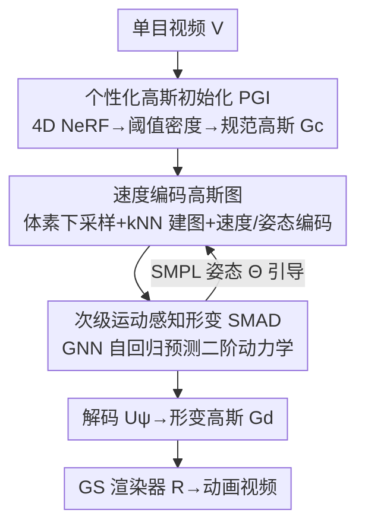

# SMAGA: Secondary Motion-Aware 3D Clothed Gaussian Avatars from Monocular Videos

**会议**: ICLR 2026  
**OpenReview**: [https://openreview.net/forum?id=2A3Q2EtGTF](https://openreview.net/forum?id=2A3Q2EtGTF)  
**代码**: 无  
**领域**: 3D视觉  
**关键词**: 3D Gaussian Splatting、可动画化人体、次级运动、松散服装、自回归形变

## 一句话总结
针对单目视频重建的 3DGS 人体 avatar 难以表现松散服装（如裙子）的随动飘逸，本文提出一个两阶段框架：先用无模板的个性化高斯初始化对齐着衣轮廓，再用一个把高斯结构成图、自回归预测二阶动力学（质点-弹簧-阻尼）的 GNN 形变器，从而在单视角约束下生成逼真、随时间连贯的服装动态。

## 研究背景与动机
**领域现状**：3D Gaussian Splatting（3DGS）让从单目视频重建可动画化人体 avatar 变得既高效又高保真，主流做法是把高斯基元绑定到 SMPL 等参数化骨架模板上，用线性混合蒙皮（LBS）按当前姿态驱动高斯形变。

**现有痛点**：这类方法擅长重现**主运动**（major body parts 的关节运动），但对**次级运动**（secondary motion，即随时间变化的服装动态，如裙摆、羽绒服的惯性飘动）束手无策——一旦驱动到训练时没见过的新姿态，松散服装就会出现不真实的撕裂、needle artifacts 等问题。

**核心矛盾**：作者把失败归因为两点。其一，现有形变是**当前姿态的函数**、逐帧独立计算，**不感知时间上下文**，而次级运动本质上与时间连续性强耦合，于是出现 motion error 的尖峰、与驱动信号对不齐；其二，高斯点的初始化依赖**裸体模板**，模板假设的几何与松散服装的真实形状严重不匹配，少量高斯既要表达身体又要表达远离体表的衣物，在新姿态下必然崩坏。

**本文目标**：在只有单目视频、没有任何 3D ground-truth 或先验几何的前提下，让 3DGS avatar 既能动起来，又能忠实地复现松散服装的次级运动。

**切入角度**：既然 LBS + 裸体模板是两个病根，那就**绕开模板**——初始化不用裸体模板，形变也不用预定义关节层级，转而借助物理上更贴近真实可形变系统演化方式的二阶动力学来建模。

**核心 idea**：把高斯点组织成一张图，用一个 GNN 充当质点-弹簧-阻尼系统的神经代理，**自回归地预测保结构的二阶更新**，从而得到无需模板、随时间连贯的衣物动态。

## 方法详解

### 整体框架
给定一段单目 RGB 视频 $V=\{I_t\}_{t=1}^{T}$，方法把 avatar 表示为一组数量固定为 $N$、但参数随时间动态更新的 3D 高斯 $G^d_t=\{(\mu_{t,i},\Sigma_{t,i},c_{t,i},\alpha_{t,i})\}$，再经可微 splatting 渲染器 $R$ 投影出动画视频 $\hat V=\{R(G^d_t)\}$。整条管线分两个阶段：**(1) 个性化高斯初始化（PGI）**——先在视频上训一个可形变 4D NeRF，把观测点映回规范空间，对时间平均密度 $\bar\sigma(x)=\frac{1}{T}\sum_t\sigma(x,t)$ 做阈值化并对存活体素聚类，得到稠密的规范高斯 $G_c$，它同时覆盖身体和松散衣物、且不依赖裸体模板；**(2) 次级运动感知形变（SMAD）**——把 $G_c$ 体素下采样后结构成一张"速度编码高斯图" $\Gamma$，由一个基于消息传递的 GNN 形变器自回归地预测每个节点的二阶动力学，再经解码器 $U_\psi$ 输出形变后高斯 $G^d$，最后渲染成图。SMPL 姿态序列 $\Theta$ 提供运动描述子，引导时间连贯的形变。

### 关键设计

**1. 个性化高斯初始化（PGI）：用 4D NeRF 蒸馏出无模板的着衣高斯**

这一步直击"裸体模板对不上松散衣物"的痛点。作者不再拿 SMPL 这种裸体参数模型来摆放初始高斯，而是先在输入单目视频上训练一个可形变神经辐射场（deformable NeRF），把每个观测空间点 $x_t$ 映射回一个统一的规范空间（reference time），在规范空间里查询颜色与密度，得到一张**同时刻画身体与松散衣物**的稠密规范密度场。训练完成后，对时间平均密度 $\bar\sigma(x)=\frac{1}{T}\sum_t\sigma(x,t)$ 做阈值化，再对存活的体素聚类得到高斯中心 $\{\mu^c_i\}$，配以各向同性方差 $\{\Sigma^c_i\}$ 与颜色 $\{c^c_i\}$，构成 person-specific 的规范高斯 $G_c$。因为初始几何来自视频本身、而非裸体先验，高斯点天然就贴着着衣轮廓分布，避免了"少量高斯硬扛衣物"导致的新姿态崩坏。

**2. 速度编码高斯图：把高斯结构成图并注入二阶时间状态**

为了让形变摆脱 LBS、又在高斯数指数增长时仍可控，作者把高斯组织成图来近似它们之间的相互作用。先用 voxel-grid 下采样把 $N$ 个高斯点降到 $M\ll N$ 个节点 $X\in\mathbb{R}^{M\times3}$（这 $M$ 个节点就是最终用于渲染的高斯基元），再用 k 近邻按成对距离 $d(x_i,x_j)=\lVert x_i-x_j\rVert_2$ 建图 $\Gamma=(X,A)$，邻接元素取高斯核 $A_{ij}=\exp(-d(x_i,x_j)^2/\rho_a^2)$，$\rho_a$ 控制对距离的敏感度。节点特征 $h_i$ 的关键在于注入**时间状态**：除位置 $x_i$ 外，还拼上有限差分得到的速度 $v_i(t)=\frac{x_i(t)-x_i(t-\Delta t)}{\Delta t}$，并缓存过去 $\tau_v$ 个速度向量 $\bar v_i=\{v_i(t),\dots,v_i(t-\tau_v)\}$ 以捕捉长程依赖，再把时间窗内的 SMPL 姿态 $\Theta_{t-\tau:t}$ 经 MLP 嵌入为 $e_i$，最终 $h_i=(x_i,\bar v_i,e_i)$。这条"速度编码（VE）"正是让形变**感知时间上下文**、消除逐帧独立带来的 motion error 尖峰的来源。

**3. 次级运动感知形变（SMAD）：用 GNN 当二阶动力学的神经代理**

这是方法的心脏，针对"LBS 无法表达惯性驱动的软体动态"。作者把每个高斯节点 $i$ 看作一个点质量 $g_i$，其运动服从二阶质点-弹簧-阻尼系统：

$$F^{ext}_i(t)=g_i\,\ddot x_i(t)+\gamma_i\,\dot x_i(t)+\sum_j k_{ij}\big(x_i(t)-x_j(t)-L^{rest}_{ij}\big)$$

其中 $\gamma_i$ 是阻尼、$k_{ij}$ 是节点间弹簧刚度、$L^{rest}_{ij}$ 是规范空间中的静止偏移。用显式欧拉积分离散后即可由加速度 $a_i(t)$ 递推出 $v_i(t+\Delta t)$、$x_i(t+\Delta t)$，这种二阶形式天然能诱导出裙摆飘动这类次级运动。实际中作者不显式指定力，而是让一个消息传递 GNN 来**学习**这些更新：节点间消息 $m_{j\to i}(t)=M_\theta(h_i,h_j)$，聚合 $m^{agg}_i=\sum_j A_{ij}m_{j\to i}$，再由 $F_\theta$ 更新节点特征、由 $G_\theta$ 输出加速度 $a_i(t)$——$G_\theta$ 就是质点-弹簧-阻尼更新的神经代理。最终节点位置赋给高斯均值 $\mu_i\leftarrow x_i(t+\Delta t)$，而颜色、不透明度、协方差由 $U_\psi(z_i,h^\ell_i)$ 解码（$z_i$ 为可学习隐码）。相比逐帧 LBS，这种自回归 + 图结构形变能在新姿态下保持结构一致并外推出稳定的衣物动态。

### 损失函数 / 训练策略
SMAD 总损失为 $\mathcal{L}_{SMAD}=\mathcal{L}_{RGB}+\lambda_{iso}\mathcal{L}_{iso}+\lambda_{damp}\mathcal{L}_{damp}$。主项是渲染图与真值的 L1 光度损失 $\mathcal{L}_{RGB}=\lVert R(G^d_t)-I_t\rVert_1$。两个正则项分别管"形"与"稳"：等距损失 $\mathcal{L}_{iso}=\sum_{(i,j)\in E}(\lVert x_i-x_j\rVert_2-L^{rest}_{ij})^2$ 惩罚测地距离偏移、保持局部表面积，防止衣物区域被拉伸或收缩（$\lambda_{iso}=0.1$ 强调长度保持）；阻尼损失 $\mathcal{L}_{damp}=\sum_i\sum_t\lVert v_i(t)\rVert_2^2$ 约束速度幅值，抑制高频抖动与动态失稳，减少细布边缘的视觉抖动（$\lambda_{damp}=0.01$，避免过度约束动态细节）。

## 实验关键数据

### 主实验
在 4D-Dress（精选 5 个穿松散衣物的受试者）、ZJU-MoCap（新视角合成）以及作者自建的 in-the-wild **LoCo-Human**（5 个松散着衣人体、每人 5 段动态 + 1 段静态）三个数据集上，与 GART、Gaussian Avatar、3DGS-Avatar、ExAvatar 等 3DGS-based 单目 avatar 方法对比，指标为 PSNR / SSIM / LPIPS，并额外用 motion error 衡量与驱动信号的时间一致性。

| 数据集（受试者） | 指标 | 本文 | 之前最好基线 |
|------|------|------|----------|
| 4D-Dress 00148（新姿态） | PSNR↑ | 24.74 | 22.79 (3DGS-Avatar) |
| 4D-Dress 00185（新姿态） | PSNR↑ / LPIPS↓ | 29.98 / 0.0370 | 28.35 / 0.0470 (ExAvatar) |
| ZJU-MoCap 394（新视角） | PSNR↑ | 30.89 | 30.54 (3DGS-Avatar) |
| LoCo-Human S01（in-the-wild） | PSNR↑ / LPIPS↓ | 26.17 / 0.0423 | 24.82 / 0.0489 (ExAvatar) |

在松散衣物 + 动态运动的 4D-Dress 与 LoCo-Human 上提升最显著（PSNR 普遍 +1.3~2.0），定性上消除了基线常见的衣物撕裂伪影；ZJU-MoCap 由于姿态多样性有限、衣物偏紧身，提升相对温和。

### 消融实验

| 配置 | PSNR↑ | LPIPS↓ | 说明 |
|------|------|---------|------|
| A0: Base（vanilla GNN + 姿态形变） | 25.21 | 0.058 | 无任何物理信息 |
| A1: + 物理有限差分正则 | 26.05 | 0.052 | +0.84 PSNR、−10.3% LPIPS |
| A2: + 自适应弹簧刚度 $k_{ij}$ | 26.44 | 0.049 | 无监督区分刚/非刚部位 |
| A3: + 消息传递（边特征） | 27.12 | 0.044 | 再 +0.68 PSNR、−10.2% LPIPS |
| A4: Full（+ 隐码） | 27.89 | 0.040 | 较 A0 共 +2.68 PSNR、−31.0% LPIPS |
| B0: w/o VE | 22.06 | 0.067 | 无速度编码 |
| B4: $\tau_v=11$（Ours） | 27.89 | 0.040 | 较 B0 +5.83 PSNR、−40.3% LPIPS |
| C0: w/o SMAD | 24.29 | 0.059 | 无图形变 |
| C4: $M=40\text{k}$（Ours） | 27.89 | 0.040 | 较 C0 +3.60 PSNR、−32.2% LPIPS |

### 关键发现
- **速度编码（VE）贡献最大**：去掉 VE 掉 5.83 PSNR，是单项影响最大的组件；它把 motion error 尖峰降低约 35.5%，证实时间上下文是次级运动建模的关键。
- **图节点容量 $M$ 有甜点**：$M<10\text{k}$ 欠表达非刚体动态，$M=100\text{k}$ 反而因优化困难 / 过拟合不如 $M=40\text{k}$，说明容量不是越大越好。
- **速度窗口 $\tau_v$ 也有甜点**：$\tau_v=1$ 收益有限、过长则饱和，$\tau_v=11$ 在时间上下文与特征效率间取得最佳平衡。
- **GNN 优于 MLP 形变器**：在控制对照中，MLP 自回归形变器能拟合训练动作但在未见动作上显著退化，GNN 凭图结构先验更稳定、泛化更好；在 train/test/OOD 序列上（PSNR 28.64 / 27.89 / 26.51）外推退化平缓，印证二阶状态 $(x_t,v_t)$ 提供了物理上合理的运动表示。

## 亮点与洞察
- **把"物理直觉"塞进 GNN**：用质点-弹簧-阻尼二阶系统当形变器的归纳偏置、再让 GNN 当其神经代理，既不必显式解微分方程（省算力），又比纯姿态条件的形变更贴近真实可形变系统的演化方式——这是次级运动得以外推到新姿态的根因。
- **无模板初始化是被低估的一环**：用 4D NeRF 蒸馏规范高斯，绕开裸体模板的几何假设，单这一步就让松散衣物区域的高斯"放对地方"，下游形变才有意义；PGI 与 SMAD 是互补的两条腿。
- **速度编码这个 trick 可迁移**：把有限差分速度 + 历史速度缓冲作为节点特征，本质是给任意基于点 / 图的动态重建注入时间二阶状态，思路可迁移到其他需要时间连贯性的可形变物体（如头发、织物）重建。
- **自建 LoCo-Human 填补 benchmark 空白**：现有数据集普遍缺乏松散衣物 + 大幅动态，自建 in-the-wild 数据集让"次级运动"这个被忽视的能力第一次有了量化评测。

## 局限性 / 可改进方向
- **依赖逐受试者训练**：PGI 的 4D NeRF 与 SMAD 都是 person-specific，需要为每个受试者单独训练，没有跨身份的泛化或快速适配能力。
- **容量与稳定性的权衡敏感**：图节点数 $M$ 与速度窗口 $\tau_v$ 都存在明显甜点，过大反而退化，意味着超参需针对动作幅度调校，鲁棒性有限。
- **物理近似仍是简化**：质点-弹簧-阻尼是对真实布料动力学的高度简化，对极端飘逸、自碰撞、多层衣物等复杂场景可能不足；论文也未引入显式碰撞处理。
- **改进思路**：可探索跨身份的形变先验（amortized PGI）、引入轻量碰撞约束，或把二阶状态扩展到更高阶 / 学习式积分以增强大幅动态下的稳定性。

## 相关工作与启发
- **vs 模板 + LBS 的 3DGS avatar（GART / 3DGS-Avatar / ExAvatar / Gaussian Avatar）**: 它们把高斯绑骨架、用预定义关节逐帧驱动，擅长主运动但缺时间上下文、且受裸体模板几何束缚；本文用无模板初始化 + 图自回归二阶形变，专攻被它们忽略的松散衣物次级运动，单视角下也能稳。
- **vs 基于物理仿真的布料建模**: 数值求解微分方程的方法精确但算力昂贵、难参数化、且通常只在多边形网格上、需要 4D 扫描 / 衣-体分割等高级监督；本文只用单目视频、在高斯基元上以 GNN 近似二阶动力学，不需任何 3D ground-truth 或先验几何。
- **vs MLP 自回归形变器（如 Zheng et al. 2021）**: 同样输入位置 + 编码速度，但 MLP 在未见动作上退化明显；本文的图结构提供了更强的结构先验与泛化，消融中 GNN 全面更稳。

## 评分
- 新颖性: ⭐⭐⭐⭐⭐ 把二阶质点-弹簧-阻尼物理 + 图自回归 + 无模板初始化组合用于单目松散衣物 avatar，针对被忽视的次级运动，角度新。
- 实验充分度: ⭐⭐⭐⭐ 三数据集（含自建 in-the-wild）+ 多维消融（VE / 容量 / 架构 / 模型选择 / OOD），但无开源代码、未与物理仿真方法直接对比。
- 写作质量: ⭐⭐⭐⭐ 动机与方法逻辑清晰、公式完整；个别表述与符号略有瑕疵。
- 价值: ⭐⭐⭐⭐ 让单目 3DGS avatar 第一次较好地表现松散衣物随动，对 VR / 远程在场 / 数字人有实际意义。

<!-- RELATED:START -->

## 相关论文

- [\[CVPR 2026\] Motion-Aware Animatable Gaussian Avatars Deblurring](../../CVPR2026/3d_vision/motion-aware_animatable_gaussian_avatars_deblurring.md)
- [\[ICLR 2026\] FastGHA: Generalized Few-Shot 3D Gaussian Head Avatars with Real-Time Animation](fastgha_generalized_few-shot_3d_gaussian_head_avatars_with_real-time_animation.md)
- [\[NeurIPS 2025\] Dynamic Gaussian Splatting from Defocused and Motion-blurred Monocular Videos](../../NeurIPS2025/3d_vision/dynamic_gaussian_splatting_from_defocused_and_motion-blurred_monocular_videos.md)
- [\[ICLR 2026\] Mono4DGS-HDR: High Dynamic Range 4D Gaussian Splatting from Alternating-exposure Monocular Videos](mono4dgs-hdr_high_dynamic_range_4d_gaussian_splatting_from_alternating-exposure_.md)
- [\[ICLR 2026\] Gradient-Direction-Aware Density Control for 3D Gaussian Splatting](gradient-direction-aware_density_control_for_3d_gaussian_splatting.md)

<!-- RELATED:END -->
