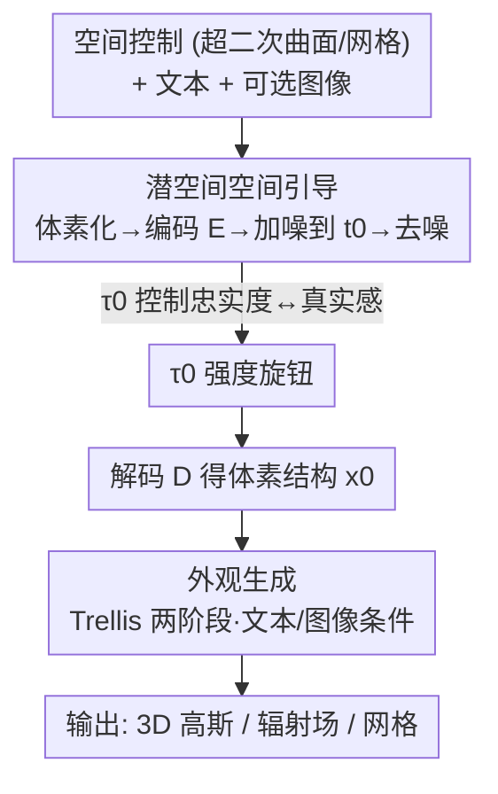

# SpaceControl: Introducing Test-Time Spatial Control to 3D Generative Modeling

**会议**: ICLR 2026  
**OpenReview**: [https://openreview.net/forum?id=mEqsCVI5sN](https://openreview.net/forum?id=mEqsCVI5sN)  
**论文**: [Project Page](https://spacecontrol3d.github.io/)  
**代码**: https://spacecontrol3d.github.io/ (项目页公开)  
**领域**: 3D视觉 / 扩散模型  
**关键词**: 3D 生成, 空间控制, 训练无关引导, rectified flow, 超二次曲面

## 一句话总结
SpaceControl 提出一种**训练无关**的测试时方法，把用户给定的 3D 几何（从粗糙的超二次曲面到精细网格）体素化后编码进预训练 3D 生成模型（Trellis）的潜空间，再用 SDEdit 式"加噪到 $t_0$ 再去噪"的机制注入空间引导，并用单一参数 $\tau_0$ 平滑调节"几何忠实度↔生成真实感"，在不微调任何参数的前提下，几何对齐度（Chamfer 距离）大幅超过训练式与优化式 baseline。

## 研究背景与动机
**领域现状**：3D 资产生成最近进展飞快（Trellis、SAM 3D 等），已能生成质量空前的网格/高斯。但可控性——让用户可靠地把生成结果引导到想要的形状——一直是难点。主流可控方案靠**文本**或**图像**条件。

**现有痛点**：文本灵活但语义模糊，无法精确指定几何（"一把椅子"说不清靠背角度和扶手位置）；图像虽然更约束 3D 结构，但难以编辑、对细粒度控制不直观。两种模态都不允许艺术家**直接操纵物体几何**。

**核心矛盾**：现有的"空间可控 3D 生成"要么是**训练式**（如 Spice-E 微调 Shap-E 接受 cuboid 条件、LION 用 voxel 条件），保留推理速度但需要类别级微调、泛化差、且无法调节控制强度；要么是**引导式/优化式**（如 Latent-NeRF、Coin3D），无需重训练但每个样本要跑漫长的 test-time 优化，而且往往是把 3D 条件投影到多视角 2D 上间接约束，而非直接作用于 3D 体。

**本文目标**：把控制权移到 **3D 空间本身**——用 3D 几何当"三维草图"直接引导细节 3D 资产的合成；既要训练无关、又要直接在 3D 体上控制、还要能调节控制强度。

**切入角度**：作者注意到现代 3D 生成模型（Trellis）用 **rectified flow** 并把**几何结构与外观解耦**成两阶段生成，而其结构阶段自带一个平时推理用不到的预训练编码器 $E$。这恰好提供了一个把空间条件映射进**共享潜空间**的入口。

**核心 idea**：把图像编辑里的 SDEdit 思想搬到 3D——**用 $E$ 把体素化几何编码成潜变量，加噪到中间时刻 $t_0$，再用原模型去噪**，无需任何架构改动或训练，即可让生成在该几何附近成形；$t_0$（即 $\tau_0$）的大小就是忠实度旋钮。

## 方法详解

### 整体框架
SpaceControl 接在预训练的 Trellis（rectified flow + 结构/外观两阶段）之上，输入是「空间控制（超二次曲面或网格）+ 文本提示 + 可选图像」，输出是与几何对齐的高质量 3D 资产（可解码为 3D 高斯 / 辐射场 / 网格）。整条管线分两步：**结构生成**阶段把空间条件注入潜空间引导粗几何成形，**外观生成**阶段在已生成几何上由文本/图像引导贴上纹理。关键在于：空间引导只在结构阶段以"加噪—去噪"的形式注入，全程不动模型权重。

### 关键设计

**1. 潜空间空间引导：把几何当"三维草图"加噪再去噪**

针对"现有方法要么微调要么投影到 2D 间接约束"的痛点，SpaceControl 直接在 3D 潜空间里做 SDEdit 式干预，全程零训练。具体地，给定用户指定的 3D 几何，先体素化得到 $x_c \in \{0,1\}^{64\times64\times64}$，喂进 Trellis 预训练编码器 $E$ 得到干净潜变量 $z_{c,0} \in \mathbb{R}^{16\times16\times16\times8}$；再按 rectified flow 的前向（加噪）公式，把它加噪到某个时刻 $t_0$：

$$z_{t_0} = t_0 z_1 + (1-t_0) z_{c,0}, \quad z_1 \sim \mathcal{N}(0, I)$$

然后从 $t_0$ 出发，用**原始的 Structure Flow Model**迭代去噪（速度场 $v_\theta$，递推式 $z_{t(i+1)} = z_{t(i)} - v_\theta(z_{t(i)}, t(i))(t(i)-t(i+1))$）得到 $z_0$，再由解码器 $D$ 还原成最终体素结构 $x_0$。这一步不需要任何架构改动或训练——因为 $z_{t_0}$ 已经"携带"了用户几何的信息，模型在它附近做的去噪自然就把生成拉向该几何。同时用文本提示参与引导，帮助消解物体的语义歧义（让"这块几何是椅子还是桌子"明确下来）。和 Spice-E 必须按类别微调相比，这里换骨干、换几何类型都不用重训，泛化到训练时没见过的 Toys4K 类别也成立。

**2. $\tau_0$ 强度旋钮：用单参数平滑权衡忠实度与真实感**

针对"现有空间条件方法无法调节控制强度"的痛点，SpaceControl 把加噪时刻 $t_0$（对应离散步 $\tau_0$）本身当成用户可调的控制旋钮。$\tau_0$ 越小，$z_{t_0}$ 初始化得越靠近纯噪声 $z_1$、离控制信号 $z_{c,0}$ 越远，模型要做的去噪步数越多，于是输出更贴合 Trellis 原始数据分布——**更真实但更不忠实**；$\tau_0$ 越大，$z_{t_0}$ 越偏向 $z_{c,0}$，相当于跳过早期去噪步、保留更多注入的空间结构——**更忠实但有时牺牲真实感**。时间步还经一个尺度因子 $\lambda$ 重标定 $t(\tau) = \lambda t(\tau) / (1+(\lambda-1)t(\tau))$。实验显示 $\tau_0 \in [4,6]$ 一般是 Toys4K 上忠实度与质量的好折中。这种"一个标量在两端连续插值"的能力是训练式方法天生给不了的（它们一旦微调好强度就固定了）。

**3. 复用 Trellis 解耦两阶段 + 多模态条件：只在结构阶段注入，外观阶段照常贴图**

SpaceControl 之所以能"只动几何不动外观"，关键是它寄生在 Trellis **结构/外观解耦**的两阶段设计上。第一阶段（结构）生成二值占据栅格 $x \in \{0,1\}^{64\times64\times64}$，空间引导只在这里注入；第二阶段（外观）把激活体素扩展成逐点噪声潜特征 $s_1 \in \mathbb{R}^{L\times8}$，用 Appearance Flow Model 去噪，再经 $D_{GS}/D_{RF}/D_M$ 解码成高斯/辐射场/网格。文本条件在两阶段都用（CLIP 文本编码），图像条件（DINOv2 编码）只进外观阶段，因此**图像主要影响纹理、几乎不动几何**——这让 SpaceControl 顺带支持"从 2D 图像到 3D 形状的风格迁移"，在物体编辑时用图像保持视觉一致性。这种把控制信号精确落到"几何阶段"的解耦，是它能做到细粒度空间对齐（甚至非轴对齐旋转都能严格贴合）的结构性原因。

## 实验关键数据

### 主实验
在两类空间条件（粗糙超二次曲面 vs 精细网格）下评测，数据集横跨 ShapeNet 的 chair/table（Spice-E 训练见过）和 Toys4K（所有方法都没见过）。指标：CD（Chamfer 距离，越低越忠实于空间控制）、CLIP-I（文本对齐）、FID（纹理真实感）、P-FID（几何真实感）。SpaceControl 用 $\tau_0=6$。

| 条件 / 数据集 | 方法 | CD↓ | CLIP-I↑ | FID↓ | P-FID↓ |
|------|------|------|---------|------|--------|
| 超二次曲面 · Toys4K | Coin3D | 54.4 | 0.21 | 231 | 102.0 |
| 超二次曲面 · Toys4K | Spice-E† | 65.9 | 0.29 | 233 | 66.52 |
| 超二次曲面 · Toys4K | SPICE-E-T† | 39.1 | 0.32 | 223 | 53.51 |
| 超二次曲面 · Toys4K | **SpaceControl** | **14.0** | 0.32 | 221 | 81.3 |
| 超二次曲面 · Chair | **SpaceControl** | **0.98** | 0.30 | 146 | 34.06 |
| 网格 · Toys4K | SPICE-E-T† | 23.3 | 0.32 | 222 | 90.99 |
| 网格 · Toys4K | **SpaceControl** | **4.89** | 0.29 | 244 | 72.47 |
| 网格 · Table | **SpaceControl** | **0.48** | 0.28 | 130 | 42.33 |

†表示在 chair/table 类别上微调过。SpaceControl 在**所有设置的 CD 上都显著领先**，且 CLIP-I/FID/P-FID 与最好的 baseline 相当——即在不微调的前提下把几何忠实度拉到新高度，真实感不掉队。训练式 baseline 在见过的 chair/table 上还行，但到没见过的 Toys4K 就明显退化（泛化差），SpaceControl 不受此限。

### 消融实验
$\tau_0$ 扫描（同样指标，P=超二次曲面、M=网格，下表取 Toys4K 列）：

| $\tau_0$ | CD↓ (P) | CD↓ (M) | FID↓ (P) | P-FID↓ (M) | 说明 |
|------|---------|---------|----------|------------|------|
| 0 | 117 | 75.4 | 217 | 79.4 | 几乎等于无控制（纯 Trellis） |
| 2 | 110 | 65.5 | 216 | 82.7 | 控制很弱 |
| 4 | 56.8 | 32.4 | 222 | 83.9 | 开始明显贴合 |
| 6 | 14.0 | 4.89 | 221 | 72.5 | 忠实度大幅提升，真实感仍好 |
| 8 | 9.04 | 1.57 | 257 | 77.0 | 更忠实，FID 开始升（真实感降） |
| 10 | 8.85 | 1.84 | 268 | 74.9 | 最忠实，但纹理真实感明显变差 |

### 关键发现
- **$\tau_0$ 单调权衡成立**：随 $\tau_0$ 增大，CD 持续下降（更忠实），但 FID 在 $\tau_0>6$ 后开始上升（真实感变差），印证了"加噪时刻=忠实度旋钮"的设计，$[4,6]$ 是甜区。
- **训练无关反而更稳**：训练式方法常生成"两个头的牛""背上长眼睛的象"或无法摆出特定姿态的物体；SpaceControl 因直接在 3D 体上约束，能严格贴合非轴对齐旋转的几何且保持质量。
- **用户研究**：52 名志愿者、人均评约 20 组配对，SpaceControl 在整体偏好、忠实度、真实感三项上对 Spice-E / SPICE-E-T 均为最受偏好（如对 Spice-E 整体胜率 85%）。
- **图像条件**：图像只进外观阶段，主要改纹理、几乎不动几何，可用于编辑时保持视觉一致性，相当于免费获得 2D→3D 风格迁移能力。

## 亮点与洞察
- **把 SDEdit 从 2D 图像精准搬到 3D 潜空间**：核心洞察是"现代 3D 生成模型自带一个推理时闲置的编码器 $E$"，正好做空间条件的入口——零训练、换骨干即用，工程上极轻。
- **一个标量买到连续可调的控制强度**：$\tau_0$ 直接复用 rectified flow 的加噪时刻语义，无需额外网络或损失，就把"忠实↔真实"做成用户旋钮，这是训练式方法天生缺的能力。
- **解耦架构是可控性的杠杆**：因为 Trellis 把几何和外观分两阶段，空间控制能精确落到几何阶段而不污染纹理；这条思路可迁移到任何"结构/外观解耦 + flow/diffusion"的生成器（如 SAM 3D）。
- **可交互**：作者还做了实时超二次曲面编辑界面，把"拖几何 → 直接生成带纹理资产"接进创作流，落地性强。

## 局限与展望
- **$\tau_0$ 需手动调**：忠实度旋钮目前靠用户试，作者也承认未来可做类别/采样密度自适应的 $\tau_0$ 调度。
- **全局控制、缺局部控制**：当前 $\tau_0$ 对整个物体统一作用，无法对一个物体的不同部件设不同忠实度；part-aware 局部控制是明确的未来方向。
- **依赖底座模型上限**：质量、可解码格式都受 Trellis 限制，几何分辨率被 $64^3$ 体素栅格约束，细小结构可能丢失（笔者观察）。
- **场景级未验证**：方法天然可扩展到多物体场景（结合 SuperDec/场景图），但论文只在单物体上验证。

## 相关工作与启发
- **vs Spice-E / SPICE-E-T**：Spice-E 微调 Shap-E（SPICE-E-T 是作者为公平比较移植到 Trellis 的版本）接受 cuboid 条件，属训练式——保留推理速度但需类别微调、泛化差、强度不可调；SpaceControl 训练无关、可换几何类型、$\tau_0$ 连续可调，CD 全面领先。
- **vs Coin3D / Latent-NeRF**：它们属引导/优化式，把 3D 条件投影到多视角 2D 再用 score distillation 优化出 3D，速度慢且是间接约束 2D 投影；SpaceControl 直接在 3D 体潜空间一次去噪，快且对齐更精确。
- **vs SDEdit（2D 图像编辑）**：SpaceControl 是其 3D 类比——用 3D 几何代替 2D 笔画作为初始化并引导生成，核心机制（加噪到中间步再去噪）一脉相承。

## 评分
- 新颖性: ⭐⭐⭐⭐ 把 SDEdit 思路干净地迁到 3D 潜空间、且给出可调强度旋钮，简单但抓住要害。
- 实验充分度: ⭐⭐⭐⭐ 两类条件 × 三数据集 + $\tau_0$ 扫描 + 52 人用户研究，对比扎实；场景级与更高分辨率未覆盖。
- 写作质量: ⭐⭐⭐⭐ preliminaries 把 rectified flow / Trellis / 超二次曲面交代清楚，方法叙述简洁。
- 价值: ⭐⭐⭐⭐ 训练无关、即插即用、带交互界面，对 3D 创作工作流实用价值高。

<!-- RELATED:START -->

## 相关论文

- [\[ICLR 2026\] TTT3R: 3D Reconstruction as Test-Time Training](ttt3r_3d_reconstruction_as_test-time_training.md)
- [\[ICLR 2026\] GOOD: Geometry-guided Out-of-Distribution Modeling for Open-set Test-time Adaptation in Point Cloud Semantic Segmentation](good_geometry-guided_out-of-distribution_modeling_for_open-set_test-time_adaptat.md)
- [\[ICLR 2026\] Test-Time Optimization of 3D Point Cloud LLM via Manifold-Aware In-Context Guidance and Refinement](test-time_optimization_of_3d_point_cloud_llm_via_manifold-aware_in-context_guida.md)
- [\[CVPR 2026\] Learning 3D Reconstruction with Priors in Test Time](../../CVPR2026/3d_vision/tco_learning_3d_reconstruction_with_priors_in_test_time.md)
- [\[CVPR 2026\] ZipMap: Linear-Time Stateful 3D Reconstruction via Test-Time Training](../../CVPR2026/3d_vision/zipmap_linear-time_stateful_3d_reconstruction_via_test-time_training.md)

<!-- RELATED:END -->
