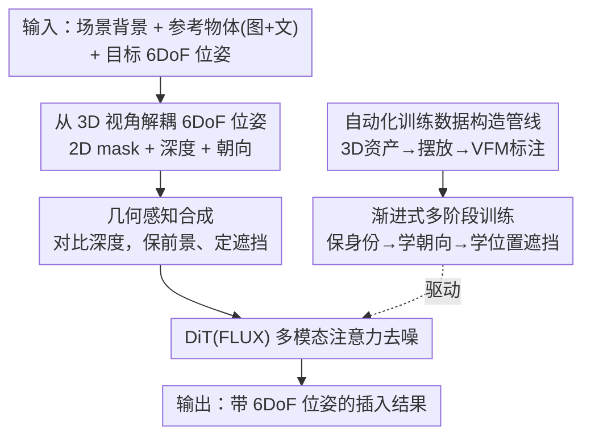

# SpatialHand: Generative Object Manipulation from 3D Perspective

**会议**: ICLR 2026  
**OpenReview**: [https://openreview.net/forum?id=VpsqfCac2B](https://openreview.net/forum?id=VpsqfCac2B)  
**项目页**: [https://spatialhand.github.io/](https://spatialhand.github.io/)  
**代码**: 见项目页  
**领域**: 3D视觉 / 扩散模型 / 图像编辑  
**关键词**: 物体插入, 6DoF 位姿, 深度条件, 朝向控制, 遮挡关系

## 一句话总结
SpatialHand 把生成式物体插入从 2D 图像平面提升到「3D 视角」，通过把 6DoF 位姿拆解成 2D 位置（mask）+ 深度（depth map）+ 3D 朝向（latent 嵌入）三路条件喂给 FLUX 扩散 Transformer，再配上一条全自动的合成数据构造管线和渐进式多阶段训练，实现了对插入物体精确的 3D 定位、任意角度旋转和正确遮挡关系控制。

## 研究背景与动机
**领域现状**：生成式物体插入/移动（Paint-by-Example、AnyDoor、UniReal、ObjectMover 等）已经能在图像里放进一个物体，并且把物体身份保持和环境融合做得相当好。这些方法基本都用 inpainting：给一张带 mask 的场景图 + 一个参考物体，让扩散模型在 mask 区域生成出物体。

**现有痛点**：这些方法都活在 **2D 平面**里。一个简单的 2D mask 根本无法确定物体在真实 3D 空间中的精确位置，于是结果充满歧义——论文用两类歧义概括（见 Fig. 2）：① **位置歧义**：插入的物体到底应该在已有物体的前面还是后面？mask 给不出深度，遮挡关系全靠模型瞎猜。② **朝向歧义**：物体应该朝左还是朝右？2D 条件里没有朝向信息。

**核心矛盾**：要做真正可控的 AR/VR 式物体操纵，必须指定完整的 6DoF 位姿（3D 位置 + 3D 朝向）并形成正确的空间对齐与遮挡；但现有 3D-aware 编辑（Object-3DIT、Diffusion Handles、Image Sculpting）走的是「转成点云/网格→在 3D 里编辑→投影回来」的显式路线，技术链路复杂、延迟高，而且单目点云**拍不到物体背面**，大角度旋转和遮挡重塑都做不好。于是出现一个 trade-off：要么 2D 简单但没有 3D 控制，要么显式 3D 精确但又重又脆。

**本文目标**：在不引入显式 3D 重建的前提下，让一个一阶段的图像生成模型原生理解并遵循 6DoF 位姿条件，做到精确 3D 定位 + 任意角度旋转 + 正确遮挡。

**切入角度**：作者的关键观察是——扩散模型直接理解「3D 坐标」很难，但它**能很好地遵循 2D mask 和 depth map**。那就不要硬塞 3D 坐标，而是把 3D 位置**隐式地**表示成「2D 位置 + 深度」的组合，朝向则单独编码进 latent。

**核心 idea**：把 6DoF 位姿**解耦**成 2D 位置（masked image）、深度（composited depth map）、3D 朝向（zero-init MLP 投影后加进 latent），用模型本就擅长的模态承载 3D 信息，从而隐式、自然地编码空间条件——这样就绕开了显式 3D 重建。

## 方法详解

### 整体框架
SpatialHand 以开源文生图模型 **FLUX-Dev.1**（MM-DiT 结构）为底座，把它改造成一个支持 6DoF 位姿条件的物体插入模型。核心是把「往图里精确摆一个物体」这件事拆成三路条件，再用模型擅长的形式喂进去：用户给定场景背景、参考物体（图+文）和目标 6DoF 位姿后，方法把位姿解耦成 **2D 位置（几何感知 masked image）+ 深度（合成 depth map）+ 3D 朝向（azimuth/elevation/in-plane 三参数经 MLP 嵌入）**，与噪声 token、参考物体 token 拼成一条长序列，送进 DiT 用多模态注意力全局交互去噪生成目标图像。

由于缺少「物体-图像-位姿」配对数据，方法还需要一条离线的**自动数据构造管线**（合成 3D 资产 → 模拟摆放 → 视觉基础模型标注位姿）产出 37 万训练对，再用**渐进式多阶段训练**把模型从「保身份」一步步教到「跟朝向」「跟位置+遮挡」。整体可分为「数据构造（离线）→ 渐进训练 → 推理时位姿解耦生成」三块，前后一致地围绕「让模型听懂 3D 条件」展开：

### 关键设计

**1. 从 3D 视角解耦 6DoF 位姿条件：用 mask+深度+朝向三路替代直接吃 3D 坐标**

这一设计直击「2D mask 给不出 3D 位置和朝向」的歧义痛点。作者不让模型直接理解 3D 坐标，而是把 6DoF 拆成模型本就擅长跟随的三种条件。对 **3D 位置**，先用 Depth Anything 预测场景深度图，再在 mask 区域把深度值改成目标插入深度（实际用时只需在地面点一下就能直观指定），这样 2D mask 管「平面在哪」、深度图管「前后多深」，组合起来就是 3D 位置。对 **3D 朝向**，用方位角 $\varphi$、仰角 $\theta$、面内旋转 $\delta$ 三个参数（遵循 Orient Anything 的定义）描述物体相对其规范正面方向的**绝对朝向**，再用一个 **zero-initialized MLP** 投影器 $P(\cdot)$ 把三参数映射到 latent 维度，加到参考物体条件上。最终输入序列为 $[X,\ \tilde{C}_{mask},\ \tilde{C}_{depth},\ C_{obj}+P([\varphi,\theta,\delta])]$，其中 $X$ 是噪声 token。相比此前 novel view synthesis 靠「相对参考视角旋转」（纯文本场景下失效），这里用绝对朝向作直接条件，使得「面朝哪」可被精确、文本无关地指定。

**2. 几何感知合成：用深度比较把遮挡关系做对，而不是让模型猜**

光有 masked 场景 + 参考物体，模型并不知道插入物该被谁挡住。该设计通过比较场景深度图和目标插入深度，**识别出那些应当保持可见的前景物体**——即深度比插入位置更浅、本应挡在插入物前面的物体，把它们在 masked 场景图和深度图里都**保留下来**，从而强制「前景物体留在插入物之前」的正确遮挡。产出的就是几何感知的 masked image $\tilde{C}_{mask}$ 和深度图 $\tilde{C}_{depth}$（区别于朴素的、直接挖空 mask 区域的版本）。这一步让插入物能自然地「钻到」已有物体后面，既维持了正确遮挡又保住了前景物体身份，是把「2D 位置 + 深度」真正落成「3D 空间关系」的关键润色。

**3. 自动化训练数据构造管线：用合成 3D 资产 + 渲染/生成 + VFM 标注凑齐配对数据**

「物体-图像-6DoF 位姿」三元组在现实里几乎拿不到，这是 3D-aware 插入最大的拦路虎。作者设计三步全自动管线模拟「人在 3D 空间里摆物体」的过程：**① 3D 资产合成**——用 Hunyuan-3D 2.0 从 1 万个常见类别名生成 4.3 万个高质量 3D mesh，每个渲染 20 个随机视角作视觉条件，用 Qwen-2.5-VL 生成对应 caption 作文本条件；**② 摆放模拟**——两条互补路线：Blender 仿真随机排布渲染（身份保持完美但场景多样性弱）和 UNO/ChatGPT-4o 主体驱动生成（场景更真实多样但身份一致性略弱），二者互补兼顾几何精度与环境丰富度；**③ 3D 信息标注**——用 Grounding-DINO + SAM 得 2D 位置、Depth Anything 算分割区域平均深度、Orient Anything 推 3D 朝向。最后经 DINO 相似度和检测/朝向置信度过滤，仿真+生成分别产出 10 万和 45 万张，清洗后得 **37 万高保真训练对**。整条管线把「人类摆物体」这个动作分解成「先有 3D 物体→再放进场景→再标空间信息」，让海量配对数据可规模化、可靠地自动生成。

**4. 渐进式多阶段训练：从保身份到跟朝向再到跟位置遮挡，逐级加约束**

模型同时要遵循物体身份、2D 位置、深度、3D 朝向多个复杂条件，一上来全部硬学容易学不稳。作者把训练拆成三阶段递进：**Stage 0 身份保持预训练**——直接用预训练 FLUX-1 dev + UNO 的主体驱动 LoRA 初始化，让模型一开始就具备物体身份保持能力；**Stage 1 新视角合成微调**——随机取同一 3D 物体的两个渲染分别作参考和目标图，配 Orient Anything 估计的朝向作引导，专门教模型理解朝向、生成指定 3D 朝向的新视角（训 60k 步）；**Stage 2 3D-aware 插入微调**——用上面的数据集训模型把物体按指定位姿真实地插进场景、保住背景（训 20k 步）。微调用 rank 512 的 LoRA，AdamW + cosine、lr 1e-4、batch 8，8×A100。消融显示去掉 Stage 1 会让朝向准确率 Acc@30° 从 52.0 暴跌到 28.7，证明「先学会看朝向、再学会摆位置」的解耦递进是必要的。

## 实验关键数据

### 主实验
基准上手动选 20 张场景图（真实+合成）和 20 个 Objaverse 高质量 3D 物体，每张场景标 2 个目标位姿，构成 800（视觉+文本）+ 800（纯文本）共 1600 个测试样本。指标：DINO/CLIP 衡量身份/语义一致性，AbsRel↓ 衡量深度位置精度，Acc@30°↑ 衡量朝向精度，外加人评 Fidelity 与 Pose Adherence（1–5）。

3D-aware 物体插入（视觉+文本条件，Table 1）：

| 方法 | DINO↑ | AbsRel↓ | Acc@30°↑ | Adherence↑(主观) |
|------|------|---------|----------|------|
| Gemini-2.0-Flash | 81.2 | 33.2 | 16.0 | 2.10 |
| GPT-4o | 80.5 | 38.6 | 20.2 | 2.67 |
| Nano Banana | 80.9 | 32.1 | 17.5 | 2.25 |
| **SpatialHand** | **81.7** | **19.8** | **52.0** | **4.27** |

最强的指令式编辑模型 GPT-4o 也只能把朝向准确率做到 20.2，AbsRel 高达 38.6——纯靠文本指令根本维持不住期望的空间状态，凸显出专门设计的 3D 位置/朝向条件的必要性。

3D-aware 物体移动（Table 2，分旋转/平移/遮挡三子任务，SpatialHand 通过「先删物体再按目标位姿插回」实现）：

| 任务 | 指标 | Object3DiT | Diffusion Handles | GPT-4o | **SpatialHand** |
|------|------|-----------|-------------------|--------|------|
| 旋转 | Acc@30°↑ | 31.4 | 20.7 | 19.5 | **47.8** |
| 平移 | mIoU↑ / AbsRel↓ | 0.45 / 35.4 | 0.28 / 20.7 | 0.24 / 38.2 | **0.72 / 17.9** |
| 遮挡 | VLM-Acc↑ | 55.2 | 49.7 | 59.5 | **82.6** |

显式操作点云的 Diffusion Handles 在大旋转和遮挡上明显吃力（单目点云缺背面结构），SpatialHand 在三个子任务上全面领先，尤其遮挡正确率 82.6 远超第二名。

### 消融实验
3D-aware 插入消融（Table 3）：

| 配置 | DINO↑ | AbsRel↓ | Acc@30°↑ | 说明 |
|------|------|---------|----------|------|
| Full（几何+Stage1&2+视觉文本） | 81.7 | 19.8 | 52.0 | 完整模型 |
| 视觉条件 only（去掉文本 caption） | 78.8 | 18.5 | 46.8 | 身份保持掉点（DINO −2.9） |
| w/o 几何感知合成 | 80.2 | 25.5 | 48.8 | 深度误差升高（AbsRel +5.7） |
| w/o Stage 1（只 Stage 2） | 79.8 | 18.2 | 28.7 | 朝向准确率暴跌（−23.3） |

### 关键发现
- **渐进训练里 Stage 1 贡献最大**：去掉新视角合成微调后 Acc@30° 从 52.0 掉到 28.7，说明「先教会模型看懂朝向」是后续 3D 插入能跟朝向的前提。
- **几何感知合成对深度定位有效**：去掉后 AbsRel 从 19.8 升到 25.5，遮挡关系也变差——它确实在帮模型把前后关系摆对。
- **文本 caption 显著帮助身份保持**：去掉后 DINO 掉 2.9；考虑到 VLM caption 廉价好用，对纯视觉场景用 VLM 自动生成 caption 是很实用的折中。

## 亮点与洞察
- **「不直接喂 3D，而是用模型擅长的模态承载 3D」是核心巧思**：扩散模型听不懂 3D 坐标，但听得懂 mask 和 depth——把 3D 位置改写成「2D mask + depth map」、把朝向用 zero-init MLP 加进 latent，等于用模型的「母语」转述 3D 意图，避开了显式 3D 重建的重链路。
- **几何感知合成把遮挡从「让模型猜」变成「由深度比较算出来」**：通过对比场景深度和插入深度显式保留应可见的前景物体，是个轻量却直接命中遮挡歧义的设计，可迁移到任何需要控制前后关系的插入/合成任务。
- **数据管线把「人摆物体」分解成可自动化的三步**：3D 生成 + 双路摆放（仿真精确 / 生成多样）+ VFM 链式标注，思路可复用到其他缺配对数据的可控生成任务——用生成模型造数据再用基础模型标注。

## 局限与展望
- 整套方法**强依赖一串视觉基础模型**（Depth Anything、Orient Anything、Grounding-DINO、SAM）的预测质量，深度/朝向估计的误差会直接传进训练标注，成为系统精度上限。
- 训练数据全部来自**合成 3D 资产 + 渲染/生成**，与真实照片在材质、光照、复杂场景上仍有域差，真实复杂场景下的泛化未充分验证。
- 物体移动是用「删除 + 重插入」两段式拼出来的，而非端到端的连续移动，复杂交互或非刚体场景下可能不够自然。
- 朝向用方位/仰角/面内旋转三参数描述，对高度对称或无明确「正面」的物体，朝向标注与控制可能本身就有歧义（⚠️ 此为笔者推测，论文未展开）。

## 相关工作与启发
- **vs Paint-by-Example / AnyDoor / ObjectMover**: 它们用 2D inpainting mask 做物体插入，身份保持和环境融合很好但只在 2D 平面操作，无法消解位置/朝向歧义；本文加了深度和朝向条件，把任务抬到 3D 视角，优势是精确 6DoF 可控，代价是需要额外的位姿条件和数据管线。
- **vs Object-3DIT / Diffusion Handles / Image Sculpting**: 它们走显式 3D 路线（转点云/网格→在 3D 编辑→投影回来），提供显式 3D 控制但链路复杂、延迟高，单目点云缺背面导致大旋转和遮挡失败；本文用**隐式 3D 引导 + 一阶段生成模型**，大幅简化流程，同时支持更大角度旋转和遮挡重塑。

## 评分
- 新颖性: ⭐⭐⭐⭐⭐ 把 6DoF 位姿解耦成模型擅长的模态、用隐式条件替代显式 3D 重建，视角新且落地。
- 实验充分度: ⭐⭐⭐⭐ 插入+移动双任务、客观+主观双评、消融到位，但基准规模偏小（1600/300 样本）且对手多是通用编辑模型。
- 写作质量: ⭐⭐⭐⭐ 动机（两类歧义）讲得清晰，pipeline 和数据构造图示直观。
- 价值: ⭐⭐⭐⭐⭐ 直指 AR/VR 式可控物体操纵的真实需求，数据管线与解耦思路都有很强可复用性。

<!-- RELATED:START -->

## 相关论文

- [\[ICLR 2026\] Ctrl&Shift: High-Quality Geometry-Aware Object Manipulation in Visual Generation](ctrlshift_high-quality_geometry-aware_object_manipulation_in_visual_generation.md)
- [\[ICLR 2026\] H2OFlow: Grounding Human-Object Affordances with 3D Generative Models and Dense Diffused Flows](h2oflow_grounding_human-object_affordances_with_3d_generative_models_and_dense_d.md)
- [\[CVPR 2026\] CraftMesh: High-Fidelity Generative Mesh Manipulation via Poisson Seamless Fusion](../../CVPR2026/3d_vision/craftmesh_high-fidelity_generative_mesh_manipulation_via_poisson_seamless_fusion.md)
- [\[ICLR 2026\] Einstein Fields: A Neural Perspective To Computational General Relativity](einstein_fields_a_neural_perspective_to_computational_general_relativity.md)
- [\[ICLR 2026\] Generalizable Coarse-to-Fine Robot Manipulation via Language-Aligned 3D Keypoints](generalizable_coarse-to-fine_robot_manipulation_via_language-aligned_3d_keypoint.md)

<!-- RELATED:END -->
