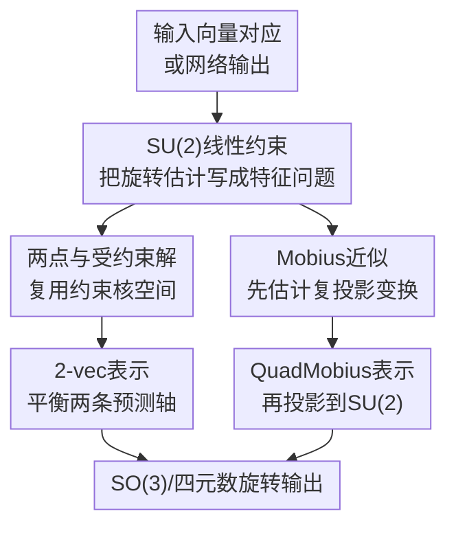

# Special Unitary Parameterized Estimators of Rotation

**会议**: ICLR2026  
**OpenReview**: [https://openreview.net/forum?id=VaS6xcDrTb](https://openreview.net/forum?id=VaS6xcDrTb)  
**代码**: https://github.com/akschion/SUPER  
**领域**: 3D视觉  
**关键词**: 旋转估计, Wahba问题, SU(2), SO(3), 旋转表示

## 一句话总结
本文用特殊酉矩阵 $SU(2)$ 重新推导经典 Wahba 旋转估计问题，得到线性四元数约束、两点闭式解和两个面向神经网络的连续旋转表示，其中 2-vec 在同维度下通常优于 Gram-Schmidt，QuadMobius 在多个旋转学习任务上达到或接近最优结果。

## 研究背景与动机
**领域现状**：3D 旋转是姿态估计、相机定位、机器人、航天器姿态确定和 3D 视觉里绕不开的基本对象。传统几何里常用旋转矩阵、欧拉角和四元数表示旋转；在观测向量对齐问题中，Wahba 问题把旋转估计写成在 $SO(3)$ 上最小化加权平方误差，并可通过 SVD、Davenport Q-method、QUEST 等经典算法求解。

**现有痛点**：这些经典方法虽然成熟，但从现代学习系统看仍有两个裂缝。第一，很多算法最终依赖矩阵分解或特征值计算，只把旋转当作 $SO(3)$ 上的投影结果，没有充分利用与四元数同构的 $SU(2)$ 结构来构造更直接的线性约束。第二，神经网络直接回归欧拉角、四元数这类低维参数时容易遇到不连续、奇异性或 double cover；Zhou et al. 的 6D Gram-Schmidt、Levinson 的 SVD 表示、Peretroukhin 的 QCQP/Bingham 表示缓解了这个问题，但它们各自仍有偏置、梯度不均衡或计算成本问题。

**核心矛盾**：旋转学习需要一个对网络友好的连续高维表示，但旋转本身又必须落在严格的几何流形上。若表示过紧凑，拓扑不连续会伤害学习；若表示过松散，投影到 $SO(3)$ 的方式会决定误差如何分配、梯度如何回传，以及噪声如何被放大。

**本文目标**：作者想回答两个相连的问题：能不能从 $SU(2)$ 视角给 Wahba 问题写出新的线性约束和闭式解；这些约束能不能进一步转化为更好训练的神经网络旋转输出层。

**切入角度**：$SU(2)$ 与单位四元数同构，并且通过 stereographic projection / Mobius transformation 可以自然作用在球面或复射影空间上。换句话说，同一个 3D 旋转既能看成 $SO(3)$ 矩阵，也能看成 $SU(2)$ 复矩阵；后者的复线性结构让“把一个方向转到另一个方向”可以写成对旋转参数的线性约束。

**核心 idea**：用 $SU(2)$ 把 Wahba 问题改写成线性四元数约束，再把这些几何约束蒸馏成 2-vec 和 QuadMobius 两种可微旋转表示。

## 方法详解

### 整体框架
这篇论文不是提出一个单一网络架构，而是先建立一套 $SU(2)$ 旋转估计公式，再从这些公式里抽出可用于深度学习的旋转映射。整体流程可以理解为三层：第一层重新表达 Wahba 问题，第二层利用线性约束得到传统优化和两点闭式解，第三层把“最优对齐”和“Mobius 到 $SU(2)$ 投影”做成神经网络输出层。

在传统旋转估计侧，输入是参考方向 $a_i$、目标方向 $b_i$ 和权重 $w_i$，输出是最小化加权 chordal loss 的旋转。论文给出 stereographic plane、3D sphere、Mobius approximation 三条路线，其中前两条是严格最优解，后一条是近似但可导且适合学习。学习侧则把网络输出解释为轴向量或 Hermitian 矩阵，经由这些几何映射得到合法旋转。

### 关键设计
**1. $SU(2)$ 线性约束：把 Wahba 问题从非线性旋转搜索变成四元数特征问题**

Wahba 问题原本是在 $R \in SO(3)$ 上最小化 $\sum_i w_i\|b_i - Ra_i\|^2$。本文的关键观察是：若把球面点投影到复射影空间，$SU(2)$ 矩阵 $U=\begin{bmatrix}\alpha&\beta\\-\bar\beta&\bar\alpha\end{bmatrix}$ 对投影点的作用就是旋转。对一对投影点 $z_i,p_i$，球面 chordal 距离可以写成复射影叉积形式：$\|a-b\|^2=4|z_1p_2-z_2p_1|^2/(\|z\|^2\|p\|^2)$。这样，“旋转后两点重合”就变成了关于 $\alpha,\beta,\bar\alpha,\bar\beta$ 的线性约束。

在常见复平面坐标下，作者把该约束整理成 $A_iu=0$，再通过 $\alpha=w_q+x_q i, \beta=y_q+z_q i$ 映射到四元数 $q=[w_q,x_q,y_q,z_q]^T$。每个观测对应一个实矩阵 $D_i$，噪声情况下求解

$$
\min_{\|q\|=1} \|Dq\|^2 = \min_{\|q\|=1} q^T G_P q,
$$

其中 $G_P=\sum_i w_i' D_i^T D_i$，最优 $q$ 是 $G_P$ 最小特征值对应的特征向量。这个形式和 Davenport Q-method 都是四维特征问题，但推导路径不同：Davenport 从 $K$ gain matrix 最大特征值出发，本文从 $SU(2)$ 对复射影点的线性约束出发，因此能自然延伸到残差计算、核空间闭式解和 Mobius 近似。

**2. 3D sphere 与两点闭式解：直接在三维向量上复用同一套约束核空间**

如果输入本来就是 3D 单位向量，没必要先投到复平面。作者用映射 $\chi(a)$ 把三维向量写成 $2\times2$ 复矩阵，并利用 $P_i \approx UZ_iU^H$ 得到等价误差。由于 Frobenius 范数在酉变换下不变，约束可以写成 $P_iU-UZ_i=0$，再展开为四元数上的实线性约束 $Q_iq=0$。最终同样得到

$$
\min_{\|q\|=1} q^T G_S q,
\quad G_S=\sum_i w_i Q_i^TQ_i.
$$

这个推导最有用的地方不只是又得到一个 Wahba 求解器，而是揭示了单个向量对应的约束秩通常只有 2：一对方向只能固定旋转的两个自由度，剩下绕该方向的旋转仍不唯一。两个无噪声对应点的核空间交集就能给出唯一旋转。论文据此给出两点 Wahba 问题的简洁闭式解：无权重情形下，最优旋转等价于同时对齐 $a_1+a_2 \rightarrow b_1+b_2$ 和 $a_1-a_2 \rightarrow b_1-b_2$；有权重时，则可看作两个精确对齐旋转的加权平均。这个视角让两点姿态估计、带轴先验的旋转估计、鲁棒 IRLS 中的 per-observation residual 都能用同一组线性约束处理。

**3. 2-vec：把 Gram-Schmidt 的“偏爱第一根轴”改成 Wahba 意义下的平衡投影**

Zhou et al. 的 6D 表示把网络输出拆成两根 3D 轴 $b_x,b_y$，再用 Gram-Schmidt 正交化得到旋转。问题是 Gram-Schmidt 默认第一根轴更可信：它先固定 $x$ 轴，再把 $y$ 轴投到垂直平面上，因此误差和梯度都会更偏向第一根轴。本文的 2-vec 仍然使用 6D 输出，但把它解释为两个目标方向观测，然后用无权重两点 Wahba 解生成旋转。

具体做法是先把 $b_y$ 缩放到与 $b_x$ 同模长，记为 $b'_y=\|b_x\|b_y/\|b_y\|$，再构造归一化的和差方向 $b_+=(b_x+b'_y)/\|b_x+b'_y\|$ 与 $b_-=(b_x-b'_y)/\|b_x-b'_y\|$。因为参考坐标轴的和差方向是固定的 $a_+=(1,1,0)/\sqrt2$、$a_-=(1,-1,0)/\sqrt2$，最终旋转矩阵可以直接写成

$$
R=\left[\frac{1}{\sqrt2}(b_+ + b_-),\; \frac{1}{\sqrt2}(b_+ - b_-),\; b_- \times b_+\right].
$$

这一步的直觉很清楚：不再问“第一根轴应该完全相信吗”，而是问“两根预测轴共同支持哪个旋转”。它保留了 6D 表示的计算量和奇异区域规模，却把两根轴的误差分摊得更均衡。附录的梯度分析也支持这一点：2-vec 的 $\|\nabla_{b_x}L\|/\|\nabla_{b_y}L\|$ 更集中在 1 附近，而 Gram-Schmidt 经常出现 10 到 100 的偏斜比值。

**4. QuadMobius：先学习稳定的 Mobius 中间体，再投影到 $SU(2)$ 输出旋转**

QuadMobius 来自论文的 Mobius approximation。传统 Wahba 直接估计旋转，而这里先放宽 $SU(2)$ 约束，估计一个一般的 $2\times2$ 复 Mobius transformation $M$。对投影点对应关系，作者写出 $A_i'm=0$，堆叠后得到 Hermitian 矩阵 $G_M=A'^HA'$，最优 $m$ 是 $G_M$ 最小特征值对应的复特征向量。再把 $m$ reshape 成 $M$，归一化行列式并投影到最近的特殊酉矩阵。

学习表示中，网络输出 16 个实数 $\Theta$，被排列成 $4\times4$ Hermitian 矩阵 $G_M(\Theta)$。最小特征向量给出 Mobius 变换 $M$，再通过两种方式得到 $Q\in SU(2)$：一种用 SVD / polar decomposition 取最近酉矩阵，另一种用代数式 $Q=M^*+\operatorname{adj}(M^*)^H$ 避免前向 SVD。最后 $Q$ 再映射为四元数或旋转矩阵。这个两阶段结构的好处是把“学习一个抗噪的中间几何对象”和“强制输出合法旋转”分开：特征分解阶段吸收尺度与输入扰动，$SU(2)$ 投影阶段给出结构化、稳定的旋转梯度。

### 一个完整示例
假设网络要从一张椅子图像回归物体姿态。使用 Gram-Schmidt 6D 表示时，网络输出两根轴 $b_x,b_y$，如果 $b_x$ 受遮挡影响偏了 $8^\circ$、$b_y$ 偏了 $2^\circ$，Gram-Schmidt 会先把 $R_x$ 对齐到偏掉的 $b_x$，再调整 $R_y$；最终旋转误差里第一根轴的错误被强行保留。

换成 2-vec 后，同样的 $b_x,b_y$ 会先变成 $b_+$ 和 $b_-$ 两个和差方向。若两根轴互相不完全正交，2-vec 不是简单相信其中一根，而是寻找在 Wahba 意义下同时解释两条观测的旋转。这个旋转可能让 $R_x$ 和 $R_y$ 各自承担一部分误差，从而得到更小的整体 chordal loss，也让反向传播时两根轴都收到更均衡的修正信号。

QuadMobius 的例子可以看作 16D 输出版本。网络不是直接输出四元数，而是输出一个 Hermitian 矩阵；最小特征向量先确定一个 Mobius 变换，相当于把“多个投影点如何在复平面上对应”编码成中间体。随后再把这个中间体压回 $SU(2)$，保证最终输出是合法旋转。若输入图像中有若干局部特征受噪声影响，Mobius 中间体可以先吸收这些不一致，再由投影步骤给出更干净的旋转。

### 损失函数 / 训练策略
传统 Wahba 实验直接比较解析求解器，误差指标为角距离 $\theta_{err}=\cos^{-1}(2(q_{est}\cdot q_{gt})^2-1)$，单位为度。学习实验主要使用 Chordal L2，即 $\|R_{pred}-R_{gt}\|_F^2$；四元数输出的 Chordal L2 按 Peretroukhin et al. 的方式处理符号等价。

ModelNet10-SO3 实验使用 ShuffleNetV2-1.5 backbone、ImageNet 预训练、两层全连接头和 dropout，优化器为 Adam，学习率 $5\times10^{-4}$。Inverse Kinematics 复用 Zhou et al. 的设置训练 200 万步。Cambridge Landmarks 相机姿态估计复用 Chen et al. 的训练代码，以 GoogLeNet 初始化并联合优化平移和旋转。QuadMobius 的两个版本在前向中都可使用代数投影，差异主要体现在反向传播路径；论文还给出手写复特征分解和 polar decomposition 导数，用于说明该映射可微。

## 实验关键数据

### 主实验
传统 Wahba 求解实验表明，本文两个严格 $SU(2)$ 求解器在精度上与 Davenport Q-method、QUEST、FLAE 等最优方法一致；Mobius 近似在含噪输入下更敏感，但这也解释了它在学习场景中能提供更强梯度。

| 设置 | 方法 | 中位角误差 $\epsilon=10^{-5}$ | 中位角误差 $\epsilon=0.1$ | 中位运行时间 |
|------|------|------------------------------|---------------------------|--------------|
| $n=3$ | Q-method | 7.4676e-4 | 7.4868 | 3.583 us |
| $n=3$ | QUEST | 7.4676e-4 | 7.4868 | 0.250 us |
| $n=3$ | Ours $G_P$ | 7.4676e-4 | 7.4868 | 4.084 us |
| $n=3$ | Ours $G_S$ | 7.4676e-4 | 7.4868 | 3.625 us |
| $n=3$ | Ours $G_M$ | 1.2614e-3 | 12.608 | 0.917 us |
| $n=100$ | Q-method | 1.2487e-4 | 1.2551 | 5.375 us |
| $n=100$ | Ours $G_P$ | 1.2487e-4 | 1.2551 | 9.917 us |
| $n=100$ | Ours $G_S$ | 1.2487e-4 | 1.2551 | 6.500 us |

在学习旋转表示上，结果更能体现本文贡献。ModelNet10-SO3 中，QuadMobius 和 2-vec 在不同类别上轮流接近最优；Inverse Kinematics 中 QMSVD 拿到最小均值误差；Cambridge 相机姿态估计中 QMAlg 在 King's College 和 Shop Facade 上表现最好。

| 任务 / 数据 | 指标 | GS | QCQP | SVD | 2-vec | QMAlg | QMSVD |
|-------------|------|----|------|-----|-------|-------|-------|
| ModelNet Chair | Mean $\theta_{err}$ | 13.606 | 13.131 | 13.061 | **12.544** | 12.604 | 13.157 |
| ModelNet Sofa | Median $\theta_{err}$ | 5.469 | 5.476 | 5.812 | 6.217 | 5.657 | **5.421** |
| ModelNet Toilet | Mean $\theta_{err}$ | 6.586 | 6.070 | 6.135 | 6.069 | 6.079 | **6.026** |
| Inverse Kinematics | Mean joint error | 1.629 | 1.511 | 1.550 | 1.574 | 1.510 | **1.509** |
| Cambridge King's | Mean $\theta_{err}$ | 3.298 | 3.204 | 3.292 | 3.085 | **2.631** | 2.706 |
| Cambridge Shop | Mean $\theta_{err}$ | 6.559 | 6.802 | 7.117 | 7.118 | **6.317** | 6.715 |

### 消融实验
论文没有把 2-vec 和 QuadMobius 做成同一个模型内的模块消融，而是通过表示对比、梯度分析和 toy ablation 来拆解机制。比较关键的消融是 QuadMobius 的组件拆分：只做 $SU(2)$ 投影、只做特征分解、以及完整两阶段方法在梯度分布上的差异。

| 配置 | 50% 梯度幅值 | 25-75% 分位跨度 | 10-90% 分位跨度 | 说明 |
|------|--------------|-----------------|-----------------|------|
| Projection only | 3.23e-5 | 9.90e-6 | 1.98e-5 | 只把 8D 复矩阵投影到 $SU(2)$ |
| Eig. no norm | 3.41e-5 | 1.00e-5 | 2.02e-5 | 只取特征向量，不做归一化旋转投影 |
| Eig. norm | 2.51e-5 | 9.41e-6 | 1.78e-5 | 特征向量后做简单归一化 |
| QuadMobius | **2.20e-5** | **6.98e-6** | **1.17e-5** | 特征分解 + Mobius 到 $SU(2)$ 投影 |

2-vec 的分析也很有信息量。作者统计所有报告指标后发现，Gram-Schmidt 平均比 2-vec 差约 11%，52 个指标里 2-vec 赢了 41 个。梯度比值图进一步显示，2-vec 对两根预测轴的学习信号更均衡，这解释了为什么同样 6D、类似复杂度下它通常更稳。

### 关键发现
- 严格的 $G_P$ / $G_S$ 解在 Wahba 问题上没有牺牲精度，几乎复现经典最优求解器的误差；代价是当前实现速度不一定压过高度优化的 QUEST / FLAE。
- Mobius 近似单独用于含噪传统求解时误差较大，但作为神经网络表示的一部分反而有优势，因为网络可以学习一个更稳定的中间 $G_M$，而 Mobius 到 $SU(2)$ 的投影提供强梯度。
- 2-vec 的主要价值不是刷新所有 benchmark，而是在 6D 表示里以很小改动修正 Gram-Schmidt 的贪心偏置；这对已有 6D rotation head 很容易迁移。
- QuadMobius 在多种任务中最稳定，尤其是在 Inverse Kinematics 和相机姿态估计这种梯度需要穿过旋转层的场景里，说明它不只是直接监督旋转时好用。

## 亮点与洞察
- 这篇论文最漂亮的地方是把 $SU(2)$ 当成统一语言：同一套线性约束既解释了 Wahba 问题，又导出两点闭式解，还能继续变成神经网络输出表示。它不是单纯给旋转层加一个新投影，而是把经典姿态估计和深度旋转回归接在了一条数学线上。
- 2-vec 是一个很实用的替换件。很多 3D 视觉代码已经用 6D Gram-Schmidt rotation representation，改成 2-vec 不需要增加输出维度，却能避免“第一根轴被过度信任”的结构性偏置。
- QuadMobius 的中间 Mobius 变换很有启发：网络不一定要直接预测最终流形元素，可以先预测一个更宽松但有几何意义的对象，再投影到目标流形。这种“可学习中间几何对象 + 结构化投影”的思路也可能迁移到本质矩阵、单应矩阵、相机内外参等几何估计任务。
- 作者没有只停留在理论推导，而是把理论公式落到了 C++ 求解器、PyTorch 可微表示和多个公开 benchmark 上。对一篇偏数学的旋转表示论文来说，这让贡献更容易被工程系统采用。

## 局限与展望
- QuadMobius 的计算量明显高于 2-vec、GS、SVD 和 QCQP。论文的 timing 表中，batch size 128 时 QMAlg 训练约 1.223 ms、QMSVD 约 1.625 ms，推理也分别约 0.430 ms 和 0.622 ms；在大规模实时系统里，这个 overhead 可能不可忽略。
- Mobius approximation 在传统含噪 Wahba 求解里明显更脆弱，说明它不是一个可以无脑替代经典求解器的通用数值算法。它更适合作为学习表示，前提是网络能学到稳定的 Hermitian 输入。
- 2-vec 仍有与 Gram-Schmidt 类似的奇异区域，例如 $b_x$ 与 $b'_y$ 导致和差向量退化时需要数值保护。论文说明奇异区域相近，但实际部署仍要关注归一化分母接近 0 的情况。
- 实验覆盖了 3D shape alignment、inverse kinematics、camera pose estimation 和 synthetic Wahba learning，但还缺少更现代的大规模 6D pose、SLAM / SfM 前端、机器人闭环控制中的系统级验证。未来如果能把 QuadMobius 接进端到端视觉定位或物体姿态估计 pipeline，会更能说明它的工程价值。
- 理论上，$SU(2)$ 方法还可能扩展到带不确定性的旋转估计、鲁棒损失、轴先验、多传感器融合等问题。作者在结论中也提到可继续应用到 analytical camera pose estimation，这会是很自然的下一步。

## 相关工作与启发
- **vs Davenport Q-method / QUEST / FLAE**: 这些方法都是 Wahba 问题的经典四元数求解器，重点在快速求最大特征值或特征方程。本文的 $G_P$ / $G_S$ 解在最优性上与它们一致，但从 $SU(2)$ 线性约束出发，带来了更方便的 residual、核空间和两点解解释；速度上当前实现未必优于 QUEST。
- **vs Zhou et al. 6D Gram-Schmidt**: Gram-Schmidt 和 2-vec 都接收 6D 输出并生成旋转。差别在于 GS 贪心固定第一根轴，2-vec 把两根轴视作两个观测方向，用 Wahba 意义下的最优旋转平衡误差，因此梯度更均衡、整体指标通常更好。
- **vs Levinson et al. SVD representation**: SVD 表示把网络输出解释为一个待投影到 $SO(3)$ 的矩阵，本质上是直接投影到正交框架。QuadMobius 则先估计复 Mobius 中间体，再投影到 $SU(2)$，多了一层带几何意义的缓冲，实验中在多个任务上略占优势，但也更慢。
- **vs Peretroukhin et al. QCQP / Bingham belief**: QCQP 使用高维表示并通过四元数优化输出旋转，和本文一样重视连续表示与可微优化。QuadMobius 继承了一些 Bingham belief 与可微特征分解的解释，但用 Mobius transformation 和 $SU(2)$ 投影组织输出，梯度稳定性在作者的 toy ablation 里更好。

## 评分
- 新颖性: ⭐⭐⭐⭐⭐ 从 $SU(2)$ 重新组织 Wahba、两点解和学习表示，理论连接很完整。
- 实验充分度: ⭐⭐⭐⭐ 覆盖传统求解、合成学习和三个公开任务，但缺少更大规模真实 6D pose / SLAM 系统验证。
- 写作质量: ⭐⭐⭐⭐ 主线清楚，附录推导扎实；不过数学背景较重，读者最好先熟悉四元数、$SO(3)$、$SU(2)$ 和 Mobius transformation。
- 价值: ⭐⭐⭐⭐⭐ 2-vec 对现有 6D rotation head 很容易落地，QuadMobius 为高精度旋转学习提供了一个有理论支撑的新选择。

<!-- RELATED:START -->

## 相关论文

- [\[CVPR 2026\] Learning to Infer Parameterized Representations of Plants from 3D Scans](../../CVPR2026/3d_vision/learning_to_infer_parameterized_representations_of_plants_from_3d_scans.md)
- [\[AAAI 2026\] Parameterized Approximation Algorithms for TSP on Non-Metric Graphs](../../AAAI2026/3d_vision/parameterized_approximation_algorithms_for_tsp_on_non-metric_graphs.md)
- [\[CVPR 2026\] RINO: Rotation-Invariant Non-Rigid Correspondences](../../CVPR2026/3d_vision/rino_rotation-invariant_non-rigid_correspondences.md)
- [\[CVPR 2025\] Extreme Rotation Estimation in the Wild](../../CVPR2025/3d_vision/extreme_rotation_estimation_in_the_wild.md)
- [\[CVPR 2025\] Cross-View Completion Models are Zero-shot Correspondence Estimators](../../CVPR2025/3d_vision/cross-view_completion_models_are_zero-shot_correspondence_estimators.md)

<!-- RELATED:END -->
