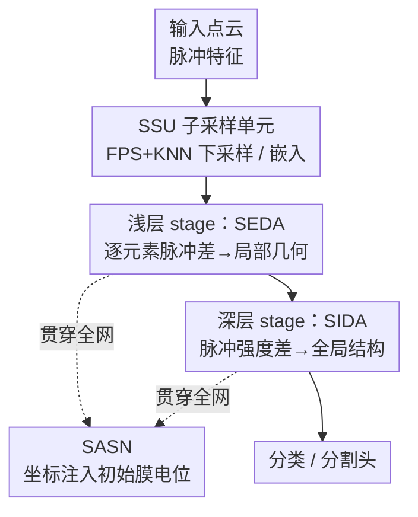

# Spiking Discrepancy Transformer for Point Cloud Analysis

**会议**: ICLR 2026  
**OpenReview**: [https://openreview.net/forum?id=7Brnh0aNFn](https://openreview.net/forum?id=7Brnh0aNFn)  
**代码**: 无  
**领域**: 3D视觉  
**关键词**: 脉冲神经网络, 点云分析, Spiking Transformer, 脉冲差异注意力, 能效

## 一句话总结
针对脉冲神经网络（SNN）做点云分析时"点积注意力抹平边缘、且难以同时建模局部与全局"的痛点，本文提出用脉冲序列之间的**差异（discrepancy）**代替点积相似度作为注意力，配合一个把坐标注入初始膜电位的空间感知脉冲神经元，搭出层次化的 Spiking Discrepancy Transformer，在 SNN 阵营中取得 SOTA，且能耗只有 ANN SOTA 的百分之几。

## 研究背景与动机
**领域现状**：脉冲神经网络以二值脉冲、事件驱动、只在脉冲到来时更新膜电位的特性著称，天然省电、适配神经形态硬件。近来 Spikformer、Spike-Driven Transformer 等工作把 Transformer 的自注意力"脉冲化"（Spiking Self-Attention, SSA），在 2D 图像分类、检测上取得了不错的能效-精度平衡。

**现有痛点**：这些 Spiking Transformer 几乎都停留在 2D 视觉。把 vanilla SSA 直接搬到 3D 点云上有三个具体问题：其一，点云中位于物体边缘、类别交界处的"显著点"对预测最关键，但 SSA 基于点积相似度聚合，倾向于关注高度相似的点，会把这些几何突变的边缘特征**抹平甚至忽略**；其二，点云动辄上万个点，远多于 2D 的 token 数，SSA 建模全局依赖在算力上不可承受；其三，点云存在大量冗余，SSA 无法同时兼顾局部和全局。此外点积形式的 SSA 不天然满足 3D 任务很看重的**平移不变性**。

**核心矛盾**：脉冲化带来能效的同时不可避免地引入信息损失，而 SSA 内部还存在通道维度上的脉冲点积错配，进一步削弱表征能力；点积相似度的"求同"本质与点云"边缘=几何突变=低相似度"的需求正好相反。

**本文目标**：为 3D 设计一种高效注意力，既能突出有判别力的边缘特征，又能从局部平滑扩展到全局建模，还要在脉冲框架里补回丢失的空间信息。

**切入角度**：作者的观察是——既然点云的判别力来自"局部脉冲不对齐"，那就不该再用点积去"求同"，而应该直接度量脉冲之间的**差异**。这恰好类比皮层神经元的侧向抑制：邻近神经元活动相互抑制，从而增强边缘对比。

**核心 idea**：用 Query 与 Key 之间的脉冲差（subtraction）作为注意力矩阵，替代 SSA 的点积——浅层用细粒度逐元素差异捕局部几何，深层用粗粒度脉冲强度差异捕全局结构；再用一个把坐标编码进初始膜电位的脉冲神经元补回空间信息。

## 方法详解

### 整体框架
Spiking Discrepancy Transformer（SDT）是一个层次化的编码器，由若干 stage 串联，逐级下采样并建模点集。输入是脉冲形式的点云特征，每个 stage 先经过 **Spiking Sub-sampling Unit（SSU）** 做采样与嵌入，再进入 SDT block 做注意力与 MLP。核心创新是把 SSA 换成 **Spiking Discrepancy Attention Mechanism（SDAM）**：它定义"脉冲差异" $SD$ —— 直接对脉冲序列做减法得到的脉冲驱动特征度量，并以此作为注意力，$\text{SDAM}(Q,K,V)=SD(Q,K)\circ V$。SDAM 有两个变体，按深浅分工：浅层 stage 用 **SEDA** 捕捉中心点与邻居点之间的细粒度逐元素差异（局部几何），深层 stage 用 **SIDA** 用宏观脉冲强度差异刻画全局拓扑结构。贯穿全网的脉冲神经元被替换成 **SASN（空间感知脉冲神经元）**，把采样点坐标用三角函数编码进初始膜电位，补回脉冲表征里丢失的空间信息。3D 分类默认用 4 个 stage，前一半用 SEDA、后一半用 SIDA。

### 关键设计

**1. 脉冲差异 SD 与 SDAM：用"求异"代替"求同"**

这是全文的总机制，直击 SSA 抹平边缘、不满足平移不变的痛点。SSA 用点积相似度做聚合，相似的点拿到高权重，结果在几何突变的边缘区域分数被稀释，造成"边缘模糊"。SDAM 反其道而行：把 Query 与 Key 的**脉冲差**当作注意力矩阵，$\text{SDAM}(Q,K,V)=SD(Q,K)\circ V$，其中 $SD$ 是对脉冲序列做减法得到的脉冲驱动度量，$\circ$ 是随注意力作用范围（局部/全局）而变的脉冲驱动算子。作者把它类比为皮层神经元对多通道异步脉冲错配的响应——侧向抑制增强边缘对比。由于差异度量对整体平移不敏感，SDAM 天然满足脉冲特征的平移不变性：在 Table 1 中，对数据集做随机旋转/平移/缩放后，SDAM 精度只掉 1.2–1.3%，而 SSA 掉 2.8–3.6%、连 ANN 的 Point Transformer 都掉 2–3%。SDAM 落地为两个变体 SEDA 和 SIDA，分别管浅层局部与深层全局。

**2. SEDA：浅层逐元素脉冲差异，放大局部几何判别力**

SEDA 解决"边缘几何特征被稀释"的问题，假设是——局部几何的可判别性来自邻居点之间的脉冲不对齐。给定中心查询点的脉冲特征 $q\in S^{T\times C}$ 与它的 $n$ 个邻居键点特征 $k=\{k_j\}$（$T$ 为时间步、$C$ 为通道），SEDA 先逐对算多通道脉冲差 $SD_j = q - k_j$，再求和并过脉冲神经元 $SD(q,k)=\text{SN}(\sum_{j=1}^{n} SD_j * s)$（$s$ 为突触缩放因子），最后以逐元素掩码作用到中心值点 $\text{SEDA}(q,k,v)=SD(q,k)\odot v$。它捕的是中心点相对邻居的**细粒度脉冲变化趋势**。论文用 t-SNE 可视化（Figure 2）显示，SEDA 让同一部件的点聚得更紧（intra-part 紧致）、不同部件间隔更大（inter-part 间隔放大），而 SSA 的特征分布弥散、部件间重叠，几何模糊——说明 SEDA 确实学到了精细的空间位置特征。

**3. SIDA：深层脉冲强度差异，建模全局拓扑结构**

到了深层，点已被下采样到较少数量，需要的是全局结构而非逐对邻居关系。SIDA 在 SEDA 的局部判别力之上，用**脉冲强度**（某位置特征脉冲的累积值，纯加性统计量）的宏观差异来捕全局：拓扑显著性来自不同区域之间群体级放电强度的对比。给定全局脉冲特征 $Q,K,V\in S^{T\times N\times C}$，$SD(Q,K)=\text{SN}((\sum_C Q - \sum_C K^T)*s)$，再 $\text{SIDA}(Q,K,V)=SD(Q,K)\cdot V$。沿通道求和把逐元素差异粗粒化为强度差异，既绕开了上万点上做密集点积的算力问题，又对脉冲信息损失更鲁棒（统计量天然抗噪），同样保持平移不变。Figure 3 显示 SIDA 在点云骨架的关键位置（飞机的翼/尾/机鼻、台灯的灯罩/灯杆/灯座）产生稀疏而精准的脉冲激活，而 SSA 要么聚焦次要区域、要么反复强调同一部件（如只盯机身或只盯灯罩）。SEDA（浅层局部）与 SIDA（深层全局）的层次协同，让网络同时拿到细粒度细节和全局几何关系。

**4. SASN：把坐标注入初始膜电位，补回丢失的空间信息**

脉冲特征在建模复杂空间位置时会丢信息，且随网络变深越来越严重。SASN 的依据是：初始膜电位（IMP）会影响神经元动态，所以把空间信息嵌进 IMP 就能增强时空感知。由于点采样与网络解耦，可以在网络处理前，用三角函数以**非可学习**方式把选中点的坐标编码进脉冲神经元的 IMP。按 LIF 更新式，第一时间步的膜电位从 $\frac{1}{\tau}X[1]$ 变为 $H[1]=(1-\frac{1}{\tau})P[0]+\frac{1}{\tau}X[1]$，其中 $P[0]$ 是该神经元对应的位置编码。SASN 可直接替换常规脉冲神经元，实现 SNN 点云处理中的时空信息交互；论文还对插入位置做了消融。

### 损失函数 / 训练策略
SSU 中的采样用无训练参数的最远点采样（FPS）做下采样、K 近邻（KNN）做中心-邻居采样；嵌入变换为 $X'_l=\text{Linear}(\text{SN}(\text{CAT}(X_l,X^k_l)))$，再用最大池化+平均池化聚合邻域特征 $Y_l=\text{MP}(X'_l)+\text{AP}(X'_l)$。SDT block 含 SDAM 与 MLP，默认采用膜电位捷径残差。基于 SpikingJelly 的神经元实现，PyTorch、4×RTX 4090 训练；不同数据集超参不同（如 ModelNet40 用 SGD、lr 5e-2、300 epoch，ScanObjectNN 用 AdamW），时间步 $T$ 默认取 4。

## 实验关键数据

### 主实验
3D 分类（ModelNet40 / ScanObjectNN，OA 为整体精度）：

| 方法 | 类型 | 参数(M) | ModelNet40 OA | ScanObjectNN OA | 能耗(mJ, ModelNet40) |
|------|------|--------|---------------|-----------------|----------------------|
| PointMLP | ANN | 12.60 | 94.10 | 85.40 | 72.38 |
| Point-GPT | ANN | 19.46 | 94.00 | 86.90 | 20.48 |
| E-3DSNN | SNN | 3.27 | 91.70 | 83.91 | 1.76 |
| SPT | SNN | 9.64 | 91.43 | 82.23 | 13.3 |
| **SDT (T=4)** | SNN | **2.25** | **92.46** | **86.19** | **1.33** |

SDT 在 SNN 阵营全面 SOTA：参数仅 2.25M 却比 E-3DSNN（ModelNet40）高 0.76%、比 SPT（ScanObjectNN）高 3.96%。对比 ANN，SDT 精度只略低，但 ModelNet40 上能耗仅 PointMLP 的 1.8%（1.33mJ vs 72.38mJ），ScanObjectNN 上仅 Point-GPT 的 10.3%（2.11mJ vs 20.47mJ）。分割同样成立：S3DIS 上 mIoU 69.6%（E-3DSNN 67.4%），ShapeNetPart cat./ins. mIoU 比 E-3DSNN 高 2.0%/1.3%，且能耗仅 ANN-SOTA 的 1.06% / 3.73%。

### 消融实验
注意力变体与层次框架（Table 6，4 个 stage 各放哪种注意力）+ SASN（Figure 4）：

| 配置 | ModelNet40 OA | ScanObjectNN OA | 说明 |
|------|---------------|-----------------|------|
| SDT（SEDA 浅 + SIDA 深 + SASN） | 92.46 | 86.19 | 完整模型 |
| w/o SASN | 91.16 (-1.30) | 84.37 (-1.82) | 去掉空间感知神经元 |
| SASN 仅加在 SIDA | 91.81 (-0.65) | 85.13 (-1.06) | 部分插入 |
| SASN 仅加在 SSU | 91.93 (-0.53) | 85.43 (-0.76) | 部分插入 |
| 全用 SSA | 较低 | 较低 | SEDA/SIDA 均优于 vanilla SSA |

时间步消融（Table 7）：$T=1/2/4/6$ 在 ModelNet40 上 OA 为 92.18 / 92.34 / 92.46 / 91.93，$T=4$ 最优；3D 数据时序线索稀缺，$T$ 过大只带来冗余计算。深度/宽度消融（Table 8）显示一味加深或加宽收益有限却显著抬高参数与能耗，最终选 4-stage、宽度 [48,96,192,384]。

### 关键发现
- **SASN 贡献最大**：去掉它 ScanObjectNN 掉 1.82%、ModelNet40 掉 1.30%，且插入越全（SSU+SEDA+SIDA 都加）越好，说明把坐标注入初始膜电位对脉冲点云表征是实打实的补偿。
- **浅 SEDA + 深 SIDA 的层次分工优于单用任一种**：两者分别在局部/全局占优，组合才能兼顾细节与拓扑。
- **平移不变性是 SDAM 的隐性红利**：空间变换后掉点最少（1.2–1.3% vs SSA 的 2.8–3.6%），这是"求异"度量相对"求同"点积的结构性优势。
- **能效极致**：用约 2.25M 参数、个位数 mJ 能耗逼近上百 mJ 的 ANN SOTA，体现 SNN 在 3D 点云上的潜力。

## 亮点与洞察
- **把"求同"换成"求异"**：注意力一贯用相似度（点积）聚合，本文洞察到点云判别力恰恰在几何突变处（低相似度），于是直接用脉冲差当注意力矩阵——这个反转既治了边缘模糊，又顺带白拿了平移不变性，思路很巧。
- **浅细深粗的双变体**：SEDA 逐元素（细粒度局部）、SIDA 沿通道求和成强度（粗粒度全局），用同一个"差异"原理覆盖局部到全局，还顺手把全局注意力的算力问题用"强度统计量"绕开。
- **初始膜电位当成空间信息的载体**：SASN 用非可学习三角编码把坐标塞进 IMP，几乎零额外参数地补回脉冲化丢失的空间信息——这个把"位置编码"搬到神经元动态层面的做法，可迁移到其他 SNN 时空任务。

## 局限与展望
- 时间步 $T$ 增大反而掉点（$T=6$ 不如 $T=4$），作者归因于 3D 数据时序线索稀缺——意味着 SNN 多时间步的优势在静态点云上难以发挥，时序维度基本被浪费。
- 与 ANN SOTA（PointMLP 94.10、Point-GPT 86.90）仍有 1–2 个点的精度差距，论文的卖点是能效而非绝对精度，对精度敏感的场景未必划算。
- 大量机制解释（侧向抑制、皮层响应类比）放在附录，正文层面更多是直觉论证；SD 算子 $\circ$ 在局部/全局下的具体形式（$\odot$ 掩码 vs $\cdot$ 矩阵乘）随场景而变，泛化到检测等更复杂 3D 任务时是否还成立有待验证。
- 未开源代码，复现门槛偏高。

## 相关工作与启发
- **vs SSA / Spikformer**：它们把 Transformer 全脉冲化但停留在 2D，用点积相似度；本文换成脉冲差异、并按深浅拆成 SEDA/SIDA，专为点云的边缘判别与局部-全局建模设计。
- **vs E-3DSNN / SPT（SNN 点云）**：E-3DSNN 用脉冲稀疏卷积、SPT 只做单一局部特征提取而丢全局；本文用统一的差异注意力同时管局部和全局，参数更少（2.25M）却精度更高、能耗更低。
- **vs Point Transformer 系列（ANN）**：ANN 用浮点编码更丰富信息、精度更高，但能耗高一两个数量级；本文用 SNN 以个位数 mJ 逼近其精度，定位是"能效优先"的 3D 点云方案。

## 评分
- 新颖性: ⭐⭐⭐⭐⭐ 把注意力从"求同点积"反转为"求异脉冲差"，并按深浅拆成两个变体，是 3D Spiking Transformer 的原创设计。
- 实验充分度: ⭐⭐⭐⭐ 覆盖分类/语义分割/部件分割三类任务，消融到注意力组合/时间步/深宽/稀疏性，但部分关键解释压在附录。
- 写作质量: ⭐⭐⭐⭐ 动机—机制—可视化论证链条清晰，公式与符号基本自洽。
- 价值: ⭐⭐⭐⭐ 为能效敏感的 3D 点云处理（自动驾驶、机器人）提供了 SNN 路线的 SOTA 参考。

<!-- RELATED:START -->

## 相关论文

- [\[ICLR 2026\] 3DSMT: A Hybrid Spiking Mamba-Transformer for Point Cloud Analysis](3dsmt_a_hybrid_spiking_mamba-transformer_for_point_cloud_analysis.md)
- [\[ICCV 2025\] Efficient Spiking Point Mamba for Point Cloud Analysis](../../ICCV2025/3d_vision/efficient_spiking_point_mamba_for_point_cloud_analysis.md)
- [\[AAAI 2026\] Graph Smoothing for Enhanced Local Geometry Learning in Point Cloud Analysis](../../AAAI2026/3d_vision/graph_smoothing_for_enhanced_local_geometry_learning_in_point_cloud_analysis.md)
- [\[ICLR 2026\] AssetFormer: Modular 3D Assets Generation with Autoregressive Transformer](assetformer_modular_3d_assets_generation_with_autoregressive_transformer.md)
- [\[CVPR 2026\] PQDT: Pseudo-Query Dual Transformer for Robust Point Cloud Restoration](../../CVPR2026/3d_vision/pqdt_pseudo-query_dual_transformer_for_robust_point_cloud_restoration.md)

<!-- RELATED:END -->
