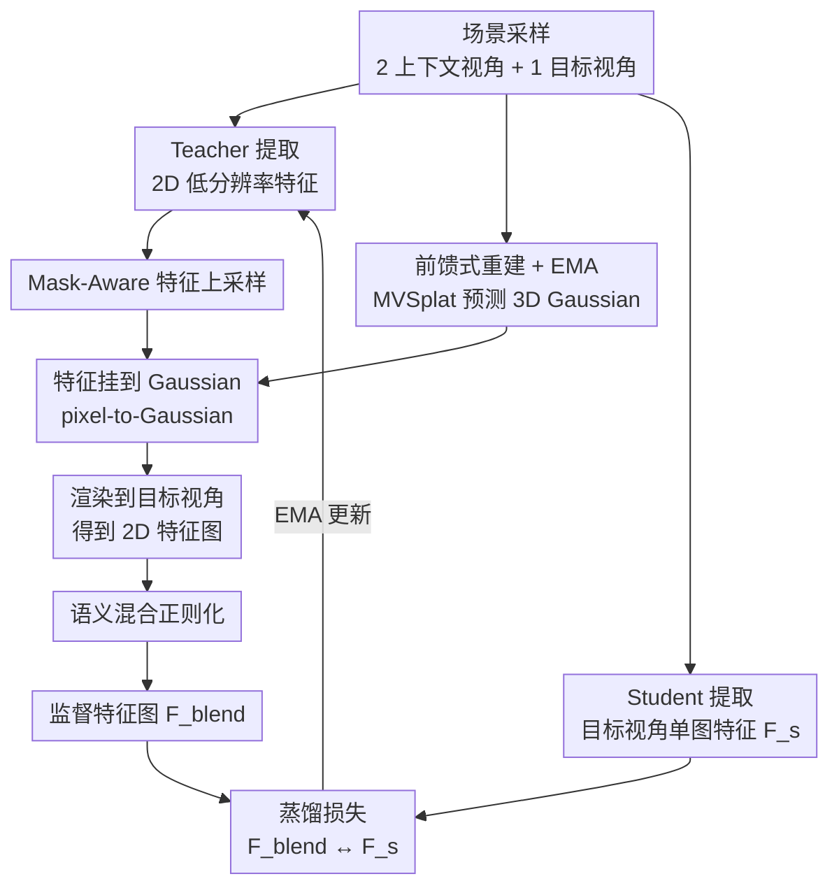

# Splat and Distill: Augmenting Teachers with Feed-Forward 3D Reconstruction for 3D-Aware Distillation

**会议**: ICLR 2026  
**arXiv**: [2602.06032](https://arxiv.org/abs/2602.06032)  
**代码**: 有 (GitHub)  
**领域**: 3D视觉 / 视觉基础模型  
**关键词**: 3D-Aware Distillation, 3D Gaussian Splatting, Feed-Forward Reconstruction, Vision Foundation Models, Student-Teacher

## 一句话总结

在 student-teacher 蒸馏框架中，用预训练的前馈式 3D 重建模型（MVSplat）增强 teacher，将 2D 特征提升到 3D Gaussian 表示后渲染到新视角，从而让 student 学到几何一致的 3D-aware 2D 特征，在深度估计、法线估计、语义分割和多视图对应等下游任务上全面超越现有方法。

## 研究背景与动机

**领域现状**：DINOv2 等视觉基础模型（VFMs）通过自监督蒸馏在大规模 2D 数据上训练，在语义分割等 2D 任务上取得了卓越表现。然而，这些模型本质上缺乏 3D 感知能力，在深度估计、表面法线预测、多视图对应等需要理解三维几何的任务上表现受限。

**现有痛点**：
1. **FiT3D** 通过逐场景优化将 2D 特征提升到 3DGS 表示，再渲染生成训练数据微调 VFM。但由于不同视角的输入特征本身不一致，优化过程会产生"最小二乘折中"，导致语义模糊和特征平均化伪影。
2. **MEF** 通过多视图对应关系强制特征一致性，但仅依赖对应点的特征相似性约束，无法提供完整的稠密几何理解。
3. 逐场景优化方法计算代价高昂，且需要大量 Gaussian 表示，难以扩展。

**核心矛盾**：要让 2D 特征获得 3D 感知能力，需要通过多视图 3D 几何来约束特征学习；但逐场景优化的方式既慢又会因输入特征不一致而产生"平均化"伪影，前馈式重建虽然快但此前仅用于外观重建而非语义特征。

**本文方案**：在 student-teacher 蒸馏框架内，用冻结的前馈式 3D 重建模型（MVSplat）作为 teacher 的增强组件。Teacher 提取的 2D 特征经 mask-aware 上采样后被挂载到 3D Gaussian 上，渲染到目标视角后通过语义混合生成高质量的监督信号。Student 仅从单张 2D 图像学习匹配 teacher 的 3D-aware 特征，最终获得几何一致性。Teacher 通过 EMA 迭代更新，避免了静态特征平均化问题。

## 方法详解

### 整体框架

Splat and Distill (SnD) 把前馈式 3D 重建塞进 DINO/DINOv2 的 student-teacher 自蒸馏框架里，让 teacher 给出的监督信号天然带有几何一致性。每次迭代从一个场景 $\mathcal{S} = \{(\mathbf{I}_i, \mathbf{P}_i)\}_{i=1}^N$ 采样两个上下文视角和一个目标视角：冻结的 MVSplat 把两张上下文图像前馈预测成一组 3D Gaussian primitives $\{(\mu_j, \Sigma_j, \alpha_j)\}$，teacher 提取的 2D 特征经上采样挂到这些 Gaussian 上、渲染并混合到目标视角，得到的特征图 $\mathbf{F}_{blend}^{tgt}$ 充当监督；student 只看目标视角的单张 2D 图像就要匹配上这份带 3D 感知的特征，而 teacher 自己再用 student 的 EMA 持续更新。

### 关键设计

**1. Mask-Aware 特征上采样：消除跨物体边界的特征泄漏**

Teacher 输出的特征图分辨率（$h \times w$）比输入图像（$H \times W$）低了 $\times 14$，直接双线性插值会把不同物体的特征混在一起，挂到 Gaussian 上就成了边界处的脏特征。SnD 改用语义分割 mask 引导插值 $\mathbf{F}_u^{high} = \sum_{v \in \mathcal{N}(u)} w_{uv} \cdot \mathbf{F}_v^{low}$，其中权重 $w_{uv}$ 只在 $\text{mask}(v) = \text{mask}(u)$ 时非零——也就是只从同一语义区域的邻域特征点插值。这样上采样后的特征在物体边界保持锐利，不会从隔壁语义区域漏进无关信息。消融里把它换回普通双线性，ScanNet++ 深度 RMSE 从 0.3299 退到 0.3309，说明这步对几何精度确有贡献。

**2. 语义混合正则化：修掉稀疏视角渲染出的几何伪影**

只用两个上下文视角重建的 3D 场景渲染到新视角时，难免有局部几何不一致带来的伪影。SnD 在语义边界内对渲染特征做一次平均来纠偏：$\mathbf{F}_{blend}(u) = \alpha \cdot \mathbf{F}_{rendered}(u) + (1-\alpha) \cdot \frac{1}{|\mathcal{M}_u|} \sum_{v \in \mathcal{M}_u} \mathbf{F}_{rendered}(v)$，取 $\alpha = 0.5$，$\mathcal{M}_u$ 是与像素 $u$ 同属一个语义 mask 的全部像素。平均只在 mask 内进行，因此能抹平小的几何抖动又不模糊物体边缘。这一步是消融里最关键的一项：完全去掉 blending，深度 RMSE 直接掉到 0.3435。

**3. 前馈式重建 + EMA：把静态优化换成会自我增强的动态闭环**

FiT3D 那类逐场景优化的根本毛病是 teacher 特征是静态的，不同视角输入本身不一致，优化只能取"最小二乘折中"，产生语义模糊和平均化伪影。SnD 让 teacher 随 student 做 EMA 更新 $\theta_t \leftarrow \lambda \theta_t + (1-\lambda) \theta_s$：训练越久 teacher 给出的 2D 特征越一致，馈进 MVSplat 的特征质量也越高，渲染监督随之变好，形成正向循环。Student 端的蒸馏目标是 $\min_{\theta_s} \mathcal{L}_{distill}(\text{head}(\mathbf{F}_s^{tgt}), \text{sg}(\text{head}(\mathbf{F}_{blend}^{tgt})))$，其中 $\text{head}(\cdot)$ 是 DINO head（小 MLP），$\text{sg}(\cdot)$ 是 stop-gradient。消融中把可学习 teacher 冻住，RMSE 从 0.3299 退到 0.3444，印证了这个闭环让框架能从海量多样场景里学到可泛化的 3D 一致性。

## 实验结果

### 主实验

在 ScanNet++、ScanNet、NYUv2 上进行线性探测评估，对比 DINOv2、FiT3D、MEF 三个基线。

**单目深度估计 (ViT-Small)**：

| 方法 | ScanNet++ RMSE↓ | ScanNet RMSE↓ | NYUv2 RMSE↓ |
|------|:---:|:---:|:---:|
| DINOv2 | 0.3777 | 0.2817 | 0.5210 |
| FiT3D | 0.3506 | 0.2713 | 0.5075 |
| MEF | 0.4000 | 0.3042 | 0.5656 |
| **SnD (Ours)** | **0.3299** | **0.2555** | **0.4912** |

**表面法线估计 (NYUv2 RMSE↓)**：

| 方法 | ViT-Small | ViT-Base |
|------|:---:|:---:|
| DINOv2 | 30.99 | 31.40 |
| FiT3D | 30.57 | 30.57 |
| MEF | 33.05 | 32.60 |
| **SnD (Ours)** | **28.93** | **29.37** |

**语义分割 (ViT-Small, mIoU↑)**：

| 方法 | ScanNet++ | ScanNet | NYUv2 |
|------|:---:|:---:|:---:|
| DINOv2 | 29.54 | 51.27 | 64.73 |
| FiT3D | 31.77 | 54.50 | 66.33 |
| MEF | 27.44 | 47.44 | 63.17 |
| **SnD (Ours)** | **31.78** | **56.01** | **67.50** |

**域外泛化 (ViT-Base)**：在 ADE20K 分割上 mIoU 达 50.01（FiT3D: 48.29），KITTI 深度估计 RMSE 为 2.1741（FiT3D: 2.2485），证明了从室内到室外的迁移能力。

### 消融实验

在 ScanNet++ 数据集上使用 ViT-Small 进行消融分析：

| 消融配置 | Seg mIoU↑ | Depth RMSE↓ |
|----------|:---:|:---:|
| 无 Blending (A) | 30.99 | 0.3435 |
| 双线性上采样替代 Mask 上采样 (B) | 31.46 | 0.3309 |
| Cosine Loss 替代蒸馏 Loss (C) | 31.27 | 0.3310 |
| 冻结 Teacher (D) | 31.90 | 0.3444 |
| 上下文视角替代新视角 (E) | 32.08 | 0.3332 |
| SAM Mask 替代人工 Mask (F) | 31.51 | 0.3328 |
| 直接特征渲染 Loss (G) | 31.40 | 0.3430 |
| 最基础配置 (H) | 30.66 | 0.3520 |
| **完整模型** | **31.78** | **0.3299** |

消融结果表明：(1) 语义混合和 Mask-Aware 上采样分别贡献了关键的深度估计性能提升；(2) EMA 可学习 Teacher（对比冻结 Teacher）带来 0.3444→0.3299 的 RMSE 提升；(3) SAM mask 接近人工标注效果，验证了方法的实用性。

## 论文评价

### 优点

1. **思路清晰且优雅**：将前馈式 3D 重建嵌入 student-teacher 蒸馏框架，避免了逐场景优化的计算瓶颈和特征平均化问题
2. **全面且公正的实验**：四个下游任务、多个数据集、域内外评估、详尽消融，复现细节充分
3. **EMA 动态更新**形成 teacher-student 的正向循环，特征质量随训练持续改善
4. **实用性强**：SAM mask 接近人工标注效果，无需对应标注

### 不足

1. 依赖预训练的 MVSplat 模型质量，重建失败的场景可能产生有害的监督信号
2. 训练仅在 ScanNet++ 数据上进行，室外大场景的 3D 重建质量可能受限
3. 需要多视图数据进行训练，限制了在仅有单图数据场景下的应用

## 评分

⭐⭐⭐⭐ — 方法新颖清晰，实验全面扎实，在 3D-aware VFM 方向上是一个重要贡献。

<!-- RELATED:START -->

## 相关论文

- [\[ICLR 2026\] Lyra: Generative 3D Scene Reconstruction via Video Diffusion Model Self-Distillation](lyra_generative_3d_scene_reconstruction_via_video_diffusion_model_self-distillat.md)
- [\[AAAI 2026\] Splat-SAP: Feed-Forward Gaussian Splatting for Human-Centered Scene with Scale-Aware Point Map Reconstruction](../../AAAI2026/3d_vision/splat-sap_feed-forward_gaussian_splatting_for_human-centered_scene_with_scale-aw.md)
- [\[ICLR 2026\] Splat Feature Solver](splat_feature_solver.md)
- [\[ICLR 2026\] Uncertainty-Aware 3D Reconstruction for Dynamic Underwater Scenes](uncertainty-aware_3d_reconstruction_for_dynamic_underwater_scenes.md)
- [\[CVPR 2026\] MoRe: Motion-aware Feed-forward 4D Reconstruction Transformer](../../CVPR2026/3d_vision/more_motion-aware_feed-forward_4d_reconstruction_transformer.md)

<!-- RELATED:END -->
