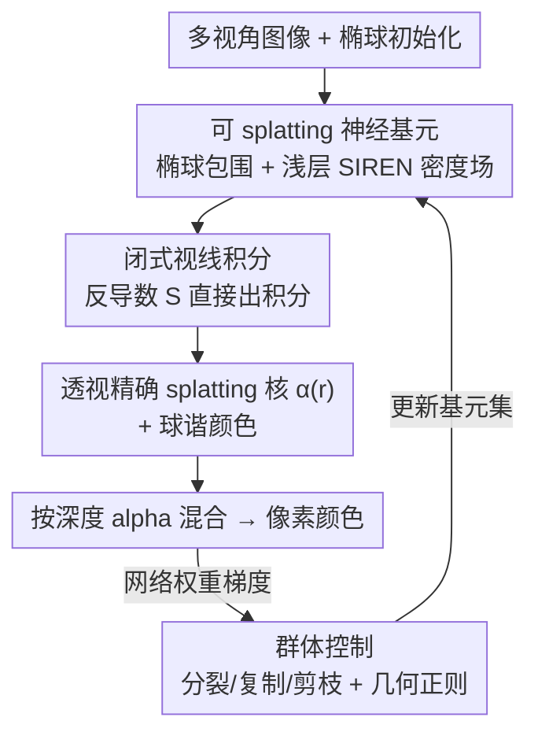

# Splat the Net: Radiance Fields with Splattable Neural Primitives

**会议**: ICLR 2026  
**OpenReview**: [https://openreview.net/forum?id=v3ejhJxT1W](https://openreview.net/forum?id=v3ejhJxT1W)  
**论文**: [项目主页](https://vcai.mpi-inf.mpg.de/projects/SplatNet/)  
**代码**: 无（仅项目页）  
**领域**: 3D视觉 / 辐射场 / 新视角合成  
**关键词**: 辐射场, 神经基元, splatting, 闭式积分, 新视角合成

## 一句话总结
这篇论文提出"可 splatting 的神经基元"——把每个基元的密度场用一个浅层神经网络（SIREN）表示、空间上由椭球包围，并推导出密度沿视线积分的**闭式解**，从而既保留神经表示的强表达力、又能像 3DGS 那样高效 splatting；在新视角合成上用 10× 更少的基元、6× 更少的参数达到与 3DGS 相当的质量和速度。

## 研究背景与动机
**领域现状**：辐射场（Radiance Field）是当前建模 3D 场景外观的主流表示。它沿两条路线发展：一条是以 NeRF 为代表的**神经表示**，用神经网络拟合 $F_\theta:(x,d)\to(\sigma,c)$，表达力极强；另一条是以 3D Gaussian Splatting（3DGS）为代表的**基元表示**，把场景拆成上百万个简单的解析体素函数（如 3D 高斯），渲染时投影到像平面变成 2D 核做 splatting。

**现有痛点**：这两条路线形成了一种被普遍接受的"二分对立"——神经表示表达力强，但渲染要靠**光线步进（ray marching）**，每个采样点都要前向过一遍网络，代价高昂；基元表示渲染快（splatting 只需把基元投影后做 alpha 混合），但表达力弱。3DGS 的高斯基元形状对称、边界柔和，难以精确表示复杂实心结构（如茶壶弯曲的把手、叶片的尖锐切口），只能靠堆叠**海量**基元来弥补，导致基元数和显存都很大。

**核心矛盾**：高效 splatting 的前提是基元密度沿视线的积分（即式 $\alpha_i(r)=1-\exp(-\int \sigma_i\,dt)$）存在**易算的闭式解**。学界普遍认为，只有"简单的手工解析形状"（高斯、beta、卷积核等）才能满足这一点，于是表达力和可 splatting 性被绑死成了一对 trade-off。

**本文目标**：打破这种"非此即彼"——能不能让基元的密度场本身就是一个**神经网络**（表达力强），同时它的视线积分**仍有闭式解**（能 splatting）？

**切入角度**：作者注意到一个被忽视的数学事实——**单隐层浅层网络**既是万能逼近器，又可以被**闭式积分**（Lloyd 等 2020、Subr 2021 的结论）。如果把基元的密度场设计成这样一个浅层网络，就能同时拿到"神经的表达力"和"解析的可积分性"。

**核心 idea**：用"椭球包围 + 单隐层周期激活网络"参数化每个基元的密度场，并推导其沿任意视线的闭式反导数，从而把神经密度场直接转成透视精确的 2D splatting 核，彻底绕开光线步进。

## 方法详解

### 整体框架
方法要解决的是：让辐射场既神经又可 splatting。整体表示是一组体素基元 $\{P_i\}$ 的混合。每个基元做两件事：① 用一个浅层神经网络定义局部密度场 $\sigma(x)$，并用椭球把它的作用范围框住；② 渲染时，对被某条视线穿过的椭球，先算出视线进出椭球的距离 $t_{in},t_{out}$，再用**闭式反导数**直接求出这段密度积分，得到该基元在该像素上的不透明度核 $\alpha(r)$；最后所有基元的核按深度排序做 front-to-back 的 alpha 混合，合成像素颜色。颜色用球谐函数表示视角相关项。

整条管线是"神经表示 → 解析积分 → splatting"的串行结构，关键在于第二步把神经密度场的积分变成闭式公式，使得整个过程不需要在密度场上做任何采样（密度 $\sigma$ 训练和渲染时**从不被直接求值**，所有计算都走它的反导数 $S$）。

### 关键设计

**1. 可 splatting 的神经基元：用单隐层周期网络当密度场，椭球做空间约束**

针对"神经表达力强但难 splatting、解析基元能 splatting 但表达力弱"这一矛盾，作者把每个基元的密度场定义为一个**浅层神经网络**而非固定解析形状。具体地，基元由椭球 $B$ 包围（中心 $x_B$、主轴缩放 $s_B$、旋转四元数 $q_B$），密度场为

$$\sigma(x)=f_\sigma\!\left(\frac{x-x_B}{\|s_B\|_\infty}\right),\quad f_\sigma(x)=W_2\big(\cos(\omega_0(W_1 x+b_1))\big)+b_2,$$

其中 $f_\sigma$ 是只有一个宽度为 $N_\sigma$ 的隐层、采用周期（正弦）激活的 SIREN 风格网络。这个结构可类比傅里叶级数：$W_1,b_1$ 是频率与相位，$W_2,b_2$ 是幅度与偏置；输入先用 $x_B,s_B$ 归一化到居中、均匀缩放的域上。之所以选这种网络而不是普通 MLP，是因为它**既是万能逼近器（保证表达力）、又恰好可被闭式积分**（保证可 splatting）——这正是整个方法成立的数学基石。每个基元仅 99 个参数（约为高斯基元的 1.6×），却因密度场是神经的、能形变出高斯做不出的复杂实心结构，从而用远少的基元覆盖同样几何。作者把 $N_\sigma$ 设为 8、频率倍数 $\omega_0$ 设为 30。

**2. 闭式视线积分：用反导数直接算透视精确的 splatting 核，绕开光线步进**

可 splatting 的关键，是要算出密度沿视线 $r(t)=o+td$ 的积分 $\hat\alpha=\int_{t_{in}}^{t_{out}}\sigma(o+td)\,dt$。本文不做数值采样，而是直接给出**闭式反导数**

$$S(t;o,d)=\big[W_2\oslash(\omega_0\cdot W_1 d)\big]\sin\!\big(\omega_0(t\cdot W_1 d+W_1 o+b_1)\big)+t\cdot b_2,$$

于是 $\hat\alpha=S(t_{out})-S(t_{in})$（微积分基本定理），再代入 $\alpha(r)=1-\exp(-\max(0,\hat\alpha))$ 得到最终的 splatting 核（clamp 到 0 保证累积密度非负）。视线进出椭球的 $t_{in},t_{out}$ 由解析的线-椭球求交得到。这一步是方法的效率核心：它对**任意视线**给出闭式积分，所以渲染无需光线步进。更妙的是，相比 3DGS 依赖投影算子的**仿射近似**，本文的积分是沿真实视线做的，结果是**透视精确**的；同时由于密度场只依赖 3D 位置（而非像 AutoInt 那样依赖视线方向），多视角一致性是"天然成立"的。

**3. 群体控制与几何正则：让神经基元能像 3DGS 一样自适应增删，并抑制极端各向异性**

3DGS 的成功离不开"致密化（densification）"，但它用屏幕空间位置的梯度当增密准则，这套机制对神经基元不适用。作者改用**网络权重的梯度幅值**作为准则：梯度超阈值就复制或分裂基元，梯度过低就剪枝，且不做任何不透明度重置（opacity reset）。此外训练时沿用 3DGS 的损失，并加一个**几何正则项**——惩罚基元形状的极端各向异性，做法是最小化缩放向量 $s_B$ 各分量的标准差，避免椭球被拉成细长的退化形状（消融显示该正则能让形状分布更合理）。由于神经场的优化地形更复杂、收敛更慢，训练迭代延长到 100k 步。这套设计让"用更少基元覆盖更多几何"的潜力真正落地，且全程不依赖复杂的控制/自适应框架。

### 损失函数 / 训练策略
损失沿用 3DGS 的图像重建损失（L1 + D-SSIM），额外叠加上述各向异性几何正则项。网络权重按 Sitzmann 等的方案初始化（$W_1\sim U(-1/3,1/3)$，$W_2$ 按 $\pm\sqrt{6/N_\sigma}/\omega_0$ 均匀采样）以获得稳定初始化。颜色用四个频带的球谐系数。全部用 PyTorch + CUDA 实现，A40 训练、RTX 4090 测速，训练 100k 迭代。

## 实验关键数据

### 主实验
在真实场景（Mip-NeRF360 / Tanks&Temples / Deep Blending）上与多类基元方法及单体神经表示对比，本文（Ours）是**唯一同时"可 splatting + 神经"**的方法：

| 数据集 | 指标 | Ours | 3DGS | 说明 |
|--------|------|------|------|------|
| Mip-NeRF360 | PSNR / FPS / Mem(MB) | 27.21 / 115 / **93** | 27.21 / 152 / 734 | 质量持平，显存约 1/8 |
| Tanks&Temples | PSNR / FPS / Mem(MB) | 23.59 / 158 / **80** | 23.14 / 188 / 411 | 质量略高，显存约 1/5 |
| Deep Blending | PSNR / FPS / Mem(MB) | 29.20 / 178 / **82** | 29.41 / 154 / 676 | 质量接近，显存约 1/8 |

相比单体神经表示（INGP、MipNeRF360 等 <1–9 FPS），本文渲染速度快一个数量级以上；论文还强调达到与 3DGS 相当质量时**只用 10× 更少的基元、6× 更少的参数**。

合成数据集（Synthetic NeRF）上按显存预算分档对比，在受限预算下本文全面优于 3DGS，无约束时持平：

| 显存预算 | 0.1MB | 0.4MB | 1.0MB | 2.0MB | 4.0MB | Unlimited |
|----------|-------|-------|-------|-------|-------|-----------|
| 3DGS PSNR | 23.1 | 25.6 | 27.2 | 28.4 | 29.6 | 33.3 |
| Ours PSNR | **24.7** | **27.6** | **28.9** | **30.4** | **31.4** | 33.4 |

### 消融实验

| 配置 | 关键发现 | 说明 |
|------|---------|------|
| vs AutoInt 神经积分 | AutoInt 视角不一致 | AutoInt 用视线深度参数化，密度随视角变化，产生跨视角不一致；本文密度只依赖 3D 位置，天然一致 |
| 网络配置 $N_\sigma$ | 8→16→32 越大越强，但真实场景收益递减 | toy 场景上 $N_\sigma{=}16$ 比 8 更能还原细节，真实场景因优化欠约束优势变小 |
| 频率 $\omega_0$ | 1→10→30 越大越能还原高频结构 | $\omega_0$ 控制可表达的频率上限 |
| 几何正则 | 抑制极端各向异性 | 去掉后基元易退化成细长形状，形状分布变差 |
| 初始化策略 | 随机 33.36 vs mesh 33.40 | 对初始化不敏感，行为与 3DGS 一致 |

### 关键发现
- **表达力的来源是表示本身**：少量神经基元就能拟合茶壶把手、叶片切口等复杂结构，toy 例子上比 3DGS 少 16× 基元、4× 参数；Ficus 上单个基元就能重建整片叶子。
- **优势来自表示而非控制框架**：本文不依赖 T-3DGS 那类复杂的显存控制机制就拿到了类似的质量-速度-紧凑度折中，作者指出把这类"taming"机制叠加上来还能进一步提升。
- **收敛更慢是代价**：神经场优化地形更复杂，需要 100k 迭代（比高斯表示长），换来基元数和显存的大幅下降。

## 亮点与洞察
- **数学洞察撬动表示设计**："单隐层网络既万能逼近、又可闭式积分"这个看似冷门的性质，被用来同时解开"表达力"和"可 splatting 性"两个约束，是非常巧的支点。
- **密度场从不被直接求值**：训练和渲染都只用反导数 $S$，把"神经密度"和"高效积分"无缝衔接，避免了任何采样近似。
- **透视精确 vs 仿射近似**：3DGS 的投影是仿射近似，本文沿真实视线积分，天然透视精确——这一点可迁移到任何想做精确 splatting 的基元设计。
- **可 splatting 的"基元神经化"范式**：以往神经成分只是给高斯加结构/正则，最终 splat 的还是高斯；本文让**核函数本身**是神经的，是更彻底的一步。

## 局限与展望
- **收敛慢**：神经场优化困难，训练需 100k 迭代，比 3DGS 长，训练开销是明显代价。
- **未叠加控制框架**：本文专注表示本身，没有引入 T-3DGS 这类显存控制机制；作者承认两者正交、叠加后应有更大收益，但本文未实现。
- **网络容量收益在真实场景递减**：$N_\sigma$ 增大在 toy 场景有效、真实场景因欠约束优化而优势缩小，说明更强基元的潜力尚未被优化策略充分释放。
- **无开源代码**（仅项目页），复现门槛较高。

## 相关工作与启发
- **vs 3DGS**：3DGS 用固定的 3D 高斯做基元、投影靠仿射近似，本文用神经密度场做基元、积分闭式且透视精确；本文质量/速度相当但基元数和显存大幅更小。
- **vs NeRF / InstantNGP / MipNeRF360（单体神经表示）**：它们表达力强但渲染靠光线步进、很慢（<1–14 FPS），本文同样神经但支持 splatting，速度快一个数量级以上。
- **vs GES / ConvSplat / BetaGS / Vol3DGS（其他解析基元）**：这些都在换不同的手工解析核形状，本质仍是非神经；本文是其中唯一把核函数本身神经化的。
- **vs AutoInt（神经积分）**：AutoInt 用自动微分对视线深度求积分网络，会引入视角相关密度、跨视角不一致；本文密度只依赖位置，多视角一致性 by construction。

## 评分
- 新颖性: ⭐⭐⭐⭐⭐ 第一个把 splatting 核（密度场本身）做成神经网络并给出闭式视线积分，打破"神经 vs 可 splatting"二分。
- 实验充分度: ⭐⭐⭐⭐ 合成/真实多数据集、多显存预算、表达力与多项消融齐全，但缺超大规模场景与开源验证。
- 写作质量: ⭐⭐⭐⭐⭐ 用 atomicity/neurality 二维分类把自身定位讲得非常清楚，公式推导干净。
- 价值: ⭐⭐⭐⭐⭐ 同质量下 10× 更少基元、6× 更少参数、显存约 1/5–1/8，且优势来自表示本身，可迁移性强。

<!-- RELATED:START -->

## 相关论文

- [\[CVPR 2026\] Evidential Neural Radiance Fields](../../CVPR2026/3d_vision/evidential_neural_radiance_fields.md)
- [\[ICLR 2026\] Einstein Fields: A Neural Perspective To Computational General Relativity](einstein_fields_a_neural_perspective_to_computational_general_relativity.md)
- [\[ICLR 2026\] Splat Feature Solver](splat_feature_solver.md)
- [\[CVPR 2026\] MU-GeNeRF: Multi-view Uncertainty-guided Generalizable Neural Radiance Fields for Distractor-aware Scene](../../CVPR2026/3d_vision/mu-generf_multi-view_uncertainty-guided_generalizable_neural_radiance_fields_for.md)
- [\[ICLR 2026\] Learning Physics-Grounded 4D Dynamics with Neural Gaussian Force Fields](learning_physics-grounded_4d_dynamics_with_neural_gaussian_force_fields.md)

<!-- RELATED:END -->
